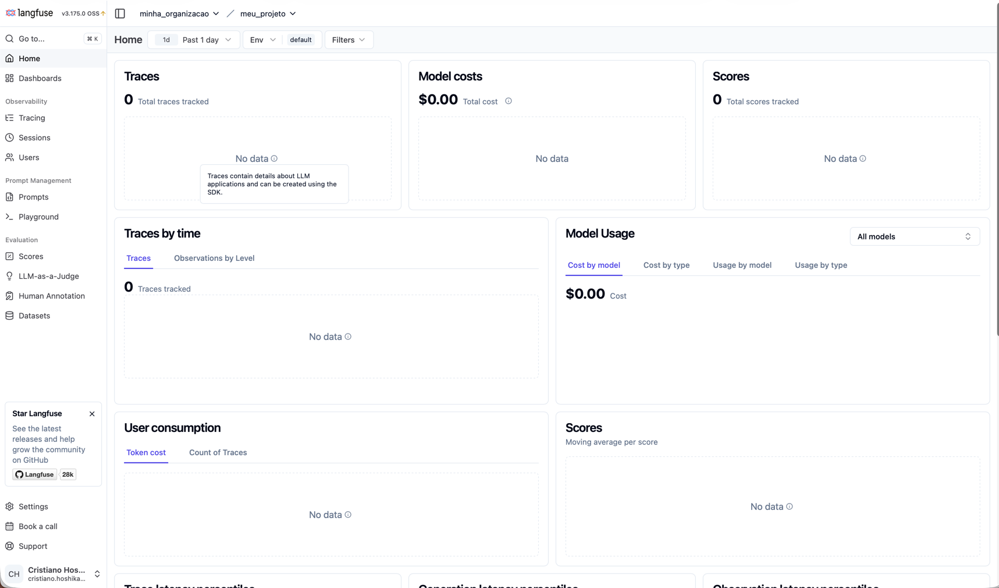

# AI Agent Platform — LangGraph + OCI

Monorepo com três projetos independentes:

- `agent_framework/`: biblioteca reutilizável para agentes escaláveis.
- `agent_template_backend/`: backend FastAPI usando o framework, com dois agentes, roteador, máquina de estados, sessão persistente e gateway de canais.
- `agent_frontend/`: frontend web simples e independente para conversar com o backend via gateway HTTP.

## Visão de arquitetura

```text
Frontend Web / WhatsApp / Voz / Texto
        ↓
Channel Gateway + Adapters
        ↓
SessionRepository persistente
        ↓
Supervisor / Router Agent
        ↓
LangGraph StateGraph
        ↓
Agent A        Agent B
        ↓          ↓
Guardrails → LLM OCI Generative AI → Output Guardrails → Judges
        ↓
Memory / RAG / Vector / Graph / Telemetry / Streaming
```


## Quickstart local

Suba a estrutura de Langfuse, MongoDB, REDIS para seu ambiente de desenvolvimento:

Vá até o folder ./agent_framework/Infrastructure_Langfuse/, onde existe o docker-compose.yml e execute:

```bash
docker compose up
```
O langfuse estará em:

```bash
http://localhost:3005
```
Crie sua Organização e seu projeto



Será criado também um MongoDB e um REDIS, logo seu .env terá a configuração para apontar para estes recursos conteinerizados.
Você pode também apontar para um banco de dados Autonomous Oracle, basta configurar no arquivo .env.

Depois compile do Agent Framework dentro do agent_template_backend (agente template que se utiliza do Framework):

Obs: configure o arquivo .env.

Terminal 1:

```bash
cd agent_framework_oci
python -m venv .venv
source .venv/bin/activate
cd agent_template_backend
pip install -e ../agent_framework
pip install -r requirements.txt
uvicorn app.main:app --reload --reload-dir app --reload-dir config --port 8000
```

Terminal 2:

```bash
cd agent_framework_oci
bash ./scripts/run_mcp_servers.sh
```

Terminal 3:

```bash
cd agent_framework_oci
cd agent_frontend
python -m http.server 5173
```

Abra `http://localhost:5173`.

## OCI LLM

Configure no `.env`:

```env
LLM_PROVIDER=oci_openai
OCI_GENAI_BASE_URL=https://inference.generativeai.sa-saopaulo-1.oci.oraclecloud.com/openai/v1
OCI_GENAI_MODEL=openai.gpt-4.1
OCI_GENAI_API_KEY=...
```

Para rodar sem credenciais, use:

```env
LLM_PROVIDER=mock
```

## Estado do projeto

Este é um template de referência funcional/simulável. Conectores reais de Autonomous Database, MongoDB, Redis, Langfuse, OCI Streaming e OCI GenAI estão isolados por interfaces/adapters para facilitar evolução e deploy.

## Enterprise Routing Edition

Esta versão também possui `README_ENTERPRISE_ROUTING.md`, com detalhes sobre roteamento por estado, intents configuráveis, LLM Router opcional e dois templates de exemplo.

## Multi-agent isolation

Esta distribuição inclui suporte para múltiplos `agent_template` no mesmo backend.
Consulte `README_MULTI_AGENT_ISOLATION.md`.
