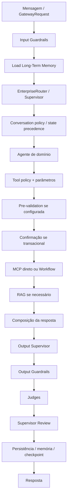
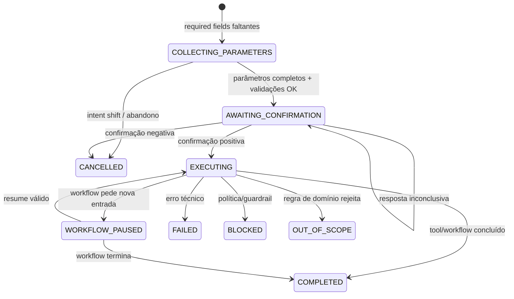
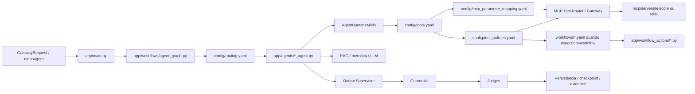

# Manual Detalhado de Regras do `agent_template_backend`


## Prefácio técnico — como funciona o motor de decisão do `agent_template_backend`

O `agent_template_backend` é um **template corporativo de referência** para construir agentes sobre o Agent Framework OCI. Ele não concentra decisão em um único `if`, prompt ou router. O comportamento final resulta da cooperação entre configuração declarativa, estado LangGraph, runtime transacional, MCP Tool Router, RAG, memória, guardrails, judges, Output Supervisor, workflows e persistência.

Uma mensagem pode:

- ser sanitizada/bloqueada antes do roteamento;
- pertencer a uma transação já aberta;
- preencher um parâmetro pendente;
- confirmar/rejeitar uma action;
- interromper a operação anterior por intent shift;
- continuar com o agente atual por route stickiness;
- conter várias intents independentes;
- retomar um workflow pausado;
- selecionar uma ou várias tools candidatas;
- passar por pre-validation;
- trocar de trajetória de execução por policy;
- executar tool diretamente ou workflow determinístico;
- usar MCP como evidência operacional;
- usar RAG como conhecimento documental;
- usar memória resumida/long-term memory como contexto;
- ser revisada por Output Supervisor, guardrails e judges;
- persistir estado/evidência para o turno seguinte.

A pergunta correta ao diagnosticar o template não é apenas “qual intent foi encontrada?”, mas:

> **Em qual estado a sessão estava, qual mecanismo tinha precedência, qual intent/route venceu, qual tool foi selecionada, quais parâmetros foram resolvidos, qual policy/pre-validation se aplicou, qual execução ocorreu e quais evidências sustentaram a resposta final?**

## P.1. Visão geral do motor



Nem todo turno atravessa todas as camadas. Uma consulta de rastreamento pode terminar rapidamente em MCP + renderer; uma devolução exige coleta, confirmação e workflow.

## P.2. Grafo corporativo real do template

`app/workflows/agent_graph.py` monta um `FrameworkStateGraph(AgentState)` com os principais nós:

```text
START
  ↓
input_guardrails
  ↓
load_long_term_memory
  ↓
routing_decision
  ↓
billing_agent | product_agent | orders_agent | support_agent
     | handoff | human_handoff | end_session | supervisor_agent
  ↓
output_supervisor
  ↓
output_guardrails
  ↓
judge
  ↓
supervisor_review
  ↓
persist_long_term_memory
  ↓
persist
  ↓
END
```

O grafo é a espinha dorsal; as regras de domínio ficam em YAML/agentes/MCP/workflows.

## P.3. Três famílias de estado

### P.3.1. Estados declarados em `routing.yaml`

O template declara:

| Estado | Agente proprietário |
|---|---|
| `WAITING_BILLING_CONFIRMATION` | `billing_agent` |
| `WAITING_PRODUCT_CONFIRMATION` | `product_agent` |
| `WAITING_ORDER_CONFIRMATION` | `orders_agent` |
| `WAITING_SUPPORT_CONFIRMATION` | `support_agent` |
| `COLLECTING_BILLING_PARAMETERS` | `billing_agent` |
| `COLLECTING_PRODUCT_PARAMETERS` | `product_agent` |
| `COLLECTING_ORDER_PARAMETERS` | `orders_agent` |
| `COLLECTING_SUPPORT_PARAMETERS` | `support_agent` |

Eles mantêm o próximo turno no agente proprietário durante coleta/confirmação.

### P.3.2. Estados transacionais canônicos do runtime

O runtime utiliza estados como:

```text
COLLECTING_PARAMETERS
AWAITING_CONFIRMATION
CONFIRMED
EXECUTING
WORKFLOW_PAUSED
TOOL_RESULT_CLARIFICATION
COMPLETED
FAILED
CANCELLED
BLOCKED
OUT_OF_SCOPE
```

Esses estados controlam parâmetros, confirmação, execução e encerramento da transação.

### P.3.3. Estados do engine de workflow

Um workflow possui execução independente identificada por `execution_id`, com resultados como:

```text
PAUSED / WAITING_INPUT
COMPLETED
FAILED
```

Os três grupos se relacionam, mas não devem ser tratados como uma única enumeração.

## P.4. Máquina transacional conceitual



## P.5. Routing

`config/routing.yaml` é a fonte declarativa para intents, prioridades, agentes, tools, keywords e exemplos.

A ordem principal do `EnterpriseRouter` é:

```text
estado/transação ativa
→ matching determinístico
→ LLM router quando habilitado
→ fallback
```

O matching determinístico privilegia a intenção com melhor combinação de prioridade/especificidade; **menor valor numérico de `priority` tem precedência**.

Quando `ENABLE_LLM_ROUTER=true`, o LLM recebe o catálogo permitido e classifica dentro dele. O LLM não deve inventar novas tools/agentes.

## P.6. Route stickiness

`ENABLE_ROUTE_STICKINESS` ativa um classificador leve que decide continuidade semântica entre:

```text
CONTINUE
ROUTE
HUMAN_HANDOFF
END_SESSION
```

Configuração relevante:

```text
ROUTE_STICKINESS_LLM_PROFILE
ROUTE_STICKINESS_CONFIDENCE_THRESHOLD
ROUTE_STICKINESS_HISTORY_TURNS
ROUTE_STICKINESS_MAX_TOKENS
```

`CONTINUE` mantém o agente ativo; `ROUTE` volta ao EnterpriseRouter. Stickiness não autoriza transações e não substitui tool policy.

## P.7. Intent shift

Durante `COLLECTING_PARAMETERS` ou `AWAITING_CONFIRMATION`, o framework protege a transação atual contra mudanças acidentais. Entretanto, uma mudança explícita de assunto pode cancelar/limpar o latch transacional e devolver o turno ao routing normal.

A fala atual também tem precedência para preencher campos pendentes. Uma resposta como `PED-1001` durante coleta de `order_id` não deve ser reinterpretada como uma nova intent.

## P.8. Coleta de parâmetros

A necessidade de parâmetros nasce da combinação:

```text
tools.yaml args_schema
+ tool_policies.yaml requires
+ mcp_parameter_mapping.yaml
+ dados canônicos do state
```

Exemplo:

```text
cancelar_pedido
requires: [order_id]
```

Sem `order_id`, o runtime entra em `COLLECTING_PARAMETERS`, usa `user_prompt`/schema para pedir o campo e preserva a propriedade do agente.

## P.9. Reconciliação temporal

O framework contém um reconciliador temporal em `runtime/transaction_parameters.py`. Ele é usado **depois** da tentativa tradicional do turno atual quando ainda restam campos necessários.

Princípios:

- a fala atual é a fonte mais nova e tem precedência;
- histórico serve para resolver referência, não para inventar fato operacional;
- campos podem ser preservados, resolvidos, limpos ou continuar não resolvidos;
- ambiguidade deve permanecer não resolvida;
- o resultado candidato ainda passa pelas validações/pre-validation de domínio.

Isso permite relações coerentes entre turnos sem transformar histórico conversacional em evidência de backend.

## P.10. Contextual reentry

O `EnterpriseRouter` e o runtime suportam `contextual_reentry`: um turno curto pode reentrar em uma regra quando o contexto imediatamente anterior delimita o significado.

O runtime mantém a fala atual separada de `relevant_conversation_context`; esse contexto é interpretativo e não substitui tool/MCP como autoridade operacional.

## P.11. Multi-intent e `pending_topics`

`MultiIntentPlanner` pode separar objetivos independentes:

```text
"rastreia o pedido e depois cancela"
```

em tópicos distintos, sem desmontar parâmetros internos de uma única action.

Quando uma ação precisa terminar antes da seguinte, o framework pode persistir as demais em `pending_topics`. `drain_pending_topics()` aparece diretamente no grafo do template.

## P.12. Policies de tools

`tools.yaml` descreve capabilities. `tool_policies.yaml` descreve **como** uma capability sensível pode executar.

No template base:

- `cancelar_pedido`: transactional + confirmation + `order_id` + pre-validation;
- `solicitar_troca`: transactional + confirmation;
- `solicitar_devolucao`: transactional + confirmation + `order_id/reason` + workflow.

Esta separação evita colocar regra de execução sensível dentro do agente.

## P.13. Pre-validation

A pre-validation ocorre depois dos parâmetros obrigatórios e antes da confirmação.

Fluxo:

```text
parâmetros completos
→ validator MCP side-effect-free
→ eligible?
   ├─ false: OUT_OF_SCOPE / termina latch
   └─ true: AWAITING_CONFIRMATION
```

No template, `cancelar_pedido` usa `validar_cancelamento_pedido` com `fail_open=false`.

## P.14. Confirmação transacional

Tools com `require_confirmation=true` não executam automaticamente.

O framework tenta interpretar confirmações explícitas deterministicamente e pode usar fallback semântico quando necessário. Uma resposta positiva promove a transação para execução; uma negativa cancela; uma resposta inconclusiva mantém a transação ativa.

## P.15. Workflow transacional

A policy pode definir:

```yaml
execution:
  mode: workflow
  workflow: devolucao_pedido
  version: active
```

Assim, após confirmação, a tool lógica é executada pelo `WorkflowToolExecutor`, que carrega o YAML versionado e executa o grafo determinístico. O domínio declara nós/actions; o framework cuida de runtime, checkpoint e trace.

## P.16. Pause/Resume

O engine de workflow suporta nós que pausam, `expected_input`, `resume_from` e retomada por `execution_id`. O workflow base de devolução não pausa; a capability é demonstrada isoladamente em `Tuning-Performance/Pause_Resume_Workflow`.

Uma regra importante: o pause é compilado de modo a não reexecutar automaticamente a action com efeito colateral quando o usuário responde.

## P.17. Guardrails

No template global:

**Input**
- `MSK`
- `VLOOP`

**Output**
- `REVPREC`
- `PINJ`
- `DLEX_OUT`

Os pipelines podem ser habilitados/desabilitados por `.env`. Guardrails avaliam permissão/segurança/coerência operacional; não devem substituir routing ou regra de domínio.

## P.18. Output Supervisor

O Output Supervisor fica entre agente e output guardrails. Ele pode revisar a resposta candidata, aplicar política de retry/sanitize/block/handover e impedir que uma resposta prematura afirme um efeito que não está sustentado por resultado operacional.

`OUTPUT_SUPERVISOR_MAX_RETRIES` controla o limite de regenerações.

## P.19. Judges

`config/judges.yaml` habilita:

| Judge | Threshold/política |
|---|---|
| `response_quality` | `0.7` |
| `groundedness` | `0.6` |
| `sentiment` | não falha por negativo |
| `tone` | `fail_closed=true` |

Configuração global:

```text
enabled=true
fail_closed=true
sample_rate=0.25
always_run_for_transactional=true
```

Portanto, respostas transacionais são avaliadas mesmo quando a amostragem geral seria menor.

## P.20. MCP, evidência operacional e renderers

O template separa três responsabilidades:

```text
routing → quais capabilities pertencem à intent
tool runtime → qual capability realmente deve executar
MCP server → fato operacional / integração
```

Algumas tools possuem `response.mode: renderer`, por exemplo `telecom.invoice`, `telecom.plan`, `retail.order` e `retail.delivery`. Nesses casos o resultado MCP pode ser apresentado de forma determinística sem obrigar uma composição LLM.

## P.21. RAG

`AgentRuntimeMixin._retrieve_rag_context()` usa o RAG oficial do framework. RAG serve para conhecimento documental; MCP serve para estado operacional.

O runtime também suporta **Domain-Requested RAG**: uma tool pode retornar `requires_rag=true` e `rag_queries`, forçando recuperação mesmo quando normalmente o MCP seria considerado suficiente.

## P.22. Composição LLM solicitada pelo domínio

Uma tool/workflow pode retornar:

```json
{
  "requires_llm_composition": true,
  "response_instruction": "..."
}
```

O domínio não cria seu próprio gateway LLM. O AgentRuntime usa o provider oficial, preservando tracing, custos, profiles e guardrails.

## P.23. Memória

O template possui:

- ConversationSummaryMemory;
- memória recente;
- Long-Term Memory opcional;
- checkpoint/persistência operacional.

Memória ajuda a interpretar contexto, preferências e continuidade. **Não substitui Transaction Evidence nem MCP** para afirmar que uma operação ocorreu.

## P.24. Transaction Evidence

Resultados de transações concluídas podem ser persistidos como evidência operacional estruturada e correlacionados em turnos futuros. Isso evita que uma resposta mencione um protocolo/cancelamento anterior sem fornecer a mesma evidência aos judges/groundedness.

## P.25. Idempotência

Estado transacional, checkpoint e `execution_id` existem também para proteger contra retry/replay/reexecução. Uma confirmação repetida não deve criar duas transações somente porque o canal reenviou uma mensagem.

## P.26. Interrupção de voz e replay

O framework possui short-circuit de canal para idle nudge, fala não interrompível, pós-finalização e barge-in. Em vários casos ele simplesmente faz replay da última fala sem reabrir LangGraph, tools ou guardrails; quando necessário usa o profile `processing_interruption_classifier`.

## P.27. Erro e recuperação de workflow

`WorkflowRuntime` preserva o último snapshot válido e expõe `error`, trace parcial e `error_details` quando o provider disponibiliza `status_code`, `body` e `attempts`. O domínio pode distinguir falha técnica de regra de negócio sem acoplar o framework ao provider.

## P.28. Observabilidade

O template emite telemetria para:

- Langfuse;
- OpenTelemetry;
- analytics/observer corporativo;
- eventos IC;
- NOC;
- GRL;
- workflow;
- guardrails;
- judges.

A telemetria deve permitir reconstruir o caminho:

```text
input → route → agent → tool → policy → workflow → output controls → persistence
```

## P.29. `agents.yaml`: isolamento lógico de aplicações/agentes

`config/agents.yaml` registra dois `agent_id` de referência:

- `telecom_contas`;
- `retail_orders`.

Cada um pode apontar para prompt policy, routing, guardrails, judges, MCP servers e tools, além de `metadata.system_prefix`. O objetivo é evitar mistura de políticas/memória/checkpoints entre identidades lógicas diferentes.

## P.30. Regra de ouro de troubleshooting

Sempre investigue nesta ordem:

```text
1. Qual agent_id está ativo?
2. Qual era o estado/checkpoint?
3. Havia transação ou workflow pausado?
4. Qual decisão de route/stickiness ocorreu?
5. Qual intent venceu e por quê?
6. Quais mcp_tools a intent autorizou?
7. Qual tool foi selecionada?
8. Quais parâmetros foram resolvidos?
9. Houve reconciliação temporal?
10. Houve pre-validation?
11. Houve confirmação?
12. Tool direta ou workflow?
13. Qual resultado MCP/workflow foi produzido?
14. A resposta usou renderer, RAG ou LLM?
15. Output Supervisor/guardrails alteraram algo?
16. Judges aprovaram?
17. O estado/evidência foi persistido?
```

Esse é o motor sobre o qual as cinco regras do template são construídas.

## 1. Como ler este manual

O manual usa o mesmo modelo do manual do Agente de Contas. Cada regra é explicada em seis níveis:

1. **Regra/intenção** — o que significa e qual o limite.
2. **Routing** — `routing.yaml` atributo por atributo e como a intent é descoberta.
3. **Tools** — operação, argumentos, aliases, extração, policy, confirmação, pre-validation e retorno.
4. **Workflow** — quando existe, nós, actions, condições e término.
5. **Amarração** — arquivos Python/YAML/`.env` envolvidos.
6. **Diagnóstico** — por que uma decisão específica ocorre.

Depois das regras há uma parte separada dedicada ao `Tuning-Performance`.

## 2. Catálogo de agentes e isolamento por `agent_id`

| agent_id | Nome | Domínio | Configurações específicas |
|---|---|---|---|
| `telecom_contas` | Agente Telecom Contas | `telecom` | prompt `./config/agents/telecom_contas/prompt_policy.yaml`; guardrails `./config/agents/telecom_contas/guardrails.yaml`; judges `./config/agents/telecom_contas/judges.yaml` |
| `retail_orders` | Agente Retail Pedidos | `retail` | prompt `./config/agents/retail_orders/prompt_policy.yaml`; guardrails `./config/agents/retail_orders/guardrails.yaml`; judges `./config/agents/retail_orders/judges.yaml` |

O `default_agent_id` é `telecom_contas`. O `system_prefix` de cada registro orienta o runtime a não misturar políticas, memória/checkpoints ou decisões de outro `agent_id`.

## 3. Amarração entre componentes




## 4. Inventário das regras

| Intent | Regra | Agente | Prioridade | Tools |
|---|---|---|---:|---|
| `billing_invoice_explanation` | Faturamento / Explicação de Fatura | `billing_agent` | 10 | `consultar_fatura`, `consultar_pagamentos` |
| `product_services_information` | Produtos, Plano, Serviços e VAS | `product_agent` | 20 | `consultar_plano`, `listar_servicos` |
| `retail_order_cancel` | Cancelamento de Pedido | `orders_agent` | 20 | `consultar_pedido`, `cancelar_pedido` |
| `retail_order_tracking` | Consulta e Rastreamento de Pedido | `orders_agent` | 30 | `consultar_pedido`, `consultar_entrega` |
| `retail_support_exchange_return` | Troca, Devolução, Garantia e Suporte Retail | `support_agent` | 25 | `consultar_pedido`, `solicitar_troca`, `solicitar_devolucao` |

# 5. Regra — Faturamento / Explicação de Fatura

**Intent:** `billing_invoice_explanation`  
**Domain:** `telecom`  
**Agent:** `billing_agent`  
**Priority:** `10`

## O que esta regra significa

Dúvidas sobre fatura, cobrança, vencimento, segunda via, contestação e valores.

### Limite da regra

É uma regra informativa/operacional de billing. Ela consulta evidência; não autoriza por si só uma ação financeira transacional.

## `routing.yaml` atributo por atributo

| Atributo | Valor nesta regra | Papel no motor |
|---|---|---|
| `name` | billing_invoice_explanation | Nome estável da intent. É o identificador que aparece em state/telemetria e liga a decisão às capabilities declaradas. |
| `domain` | telecom | Domínio lógico. Ajuda a limitar contexto, agentes e interpretação do catálogo. |
| `agent` | billing_agent | Agente que recebe o turno quando esta intent vence. |
| `description` | Dúvidas sobre fatura, cobrança, vencimento, segunda via, contestação e valores. | Descrição semântica usada por manutenção humana e pelo fallback LLM. |
| `priority` | 10 | Desempate entre intents concorrentes. No EnterpriseRouter, valores menores têm precedência. |
| `mcp_tools` | consultar_fatura<br>consultar_pagamentos | Lista de capabilities inicialmente autorizadas/esperadas para a intent. |
| `keywords` | fatura<br>conta<br>cobrança<br>boleto<br>vencimento<br>segunda via<br>contestar<br>valor alto<br>invoice | Gatilhos determinísticos usados antes do fallback semântico. |
| `examples` | Minha fatura veio alta.<br>Quero entender uma cobrança.<br>Preciso da segunda via da conta. | Exemplos oferecidos ao classificador LLM; não são regex nem regras executáveis. |

## Como esta intent é encontrada

1. O EnterpriseRouter verifica estado/transação ativa antes de tratar a frase como nova solicitação.
2. No matching determinístico, esta intent oferece keywords como `fatura`, `conta`, `cobrança`, `boleto`, `vencimento`, `segunda via`, `contestar`, `valor alto`, `invoice`.
3. Em colisões, `priority=10` participa do desempate; menor número tem precedência.
4. Se o fallback LLM for usado, a descrição e exemplos como `Minha fatura veio alta.`, `Quero entender uma cobrança.`, `Preciso da segunda via da conta.` ajudam a classificação.
5. Quando a intent vence, o state recebe route/agente e o conjunto inicial de tools `['consultar_fatura', 'consultar_pagamentos']`.

## Agente proprietário e comportamento Python

Arquivo: `app/agents/billing_agent.py`.
O `run()` segue um padrão comum: emite IC de início, coleta contexto MCP, verifica mensagens de clarificação/confirmação transacional, tenta resposta direta por MCP/renderer, consulta RAG quando necessário, prepara memória, monta `messages`, chama o LLM e devolve patch de estado.
Esse padrão vem de `app/agents/runtime.py::AgentRuntimeMixin`, evitando que cada agente reimplemente MCP, RAG, cache, memória, IC e lógica transacional.

## Tools desta regra

### Tool `consultar_fatura`

**O que faz:** Consulta dados resumidos de fatura por msisdn/invoice_id.

| Propriedade | Valor |
|---|---|
| MCP server | `telecom` |
| enabled | `True` |
| tipo/operação | `read_only` |
| confirmação obrigatória | `false` |
| requires | — |
| selection_keywords | `fatura`, `conta`, `boleto` |
| apresentação | `mode=renderer`; renderer `telecom.invoice` |

**Dados necessários e origem**

| Campo | Tipo | Como é obtido | Uso |
|---|---|---|---|
| `msisdn` | `string` | contexto canônico `customer_key` | Número da linha do cliente (MSISDN) usado para consultar informações de telecom. |
| `invoice_id` | `string` | contexto canônico `contract_key` | Identificador da fatura que o cliente deseja consultar. |

**Aliases MCP:** `customer_key → msisdn`, `contract_key → invoice_id`, `interaction_key → ura_call_id`, `session_key → session_id`.

**Extração conversacional:**
- `mes_referencia`: strategy `month_name_pt`; Extrair mês citado na mensagem. janeiro=1, fevereiro=2, março=3, abril=4, maio=5, junho=6, julho=7, agosto=8, setembro=9, outubro=10, novembro=11, dezembro=12.


**O que retorna:** No MCP de exemplo retorna `invoice_id`, `msisdn`, `valor_total`, `vencimento`, `status` e uma lista `itens`; o envelope final é `{ok, result, metadata}`.

### Tool `consultar_pagamentos`

**O que faz:** Consulta histórico de pagamentos do cliente.

| Propriedade | Valor |
|---|---|
| MCP server | `telecom` |
| enabled | `True` |
| tipo/operação | `read_only` |
| confirmação obrigatória | `false` |
| requires | — |
| selection_keywords | `pagamento`, `pagamentos` |

**Dados necessários e origem**

| Campo | Tipo | Como é obtido | Uso |
|---|---|---|---|
| `msisdn` | `string` | contexto canônico `customer_key` | Número da linha do cliente (MSISDN) usado para consultar informações de telecom. |

**Aliases MCP:** `customer_key → msisdn`, `interaction_key → ura_call_id`, `session_key → session_id`.

**O que retorna:** Retorna `msisdn` e `pagamentos[]`, com data, valor e status dos pagamentos do mock.

## Workflow

Esta regra não possui workflow declarativo obrigatório no template base. A execução ocorre via MCP/runtime padrão; estados transacionais ainda podem existir para coleta/confirmar actions.

## Amarração entre YAML e Python

- `config/routing.yaml` → encontra `billing_invoice_explanation` e escolhe `billing_agent`.
- `config/tools.yaml` → descreve argumentos, servidor MCP, keywords de seleção e renderer.
- `config/tool_policies.yaml` → define read-only/transactional, confirmation, pre-validation e/ou workflow.
- `config/mcp_parameter_mapping.yaml` → traduz chaves canônicas e extrai campos da mensagem.
- `app/agents/billing_agent.py` → usa `AgentRuntimeMixin` para executar capabilities sem duplicar infraestrutura.
- `app/workflows/agent_graph.py` → conecta o agente ao fluxo corporativo e aos controles de saída.
- `mcp/servers/telecom_mcp_server/main.py` → implementação mock/contrato da tool `consultar_fatura`.
- `mcp/servers/telecom_mcp_server/main.py` → implementação mock/contrato da tool `consultar_pagamentos`.

### `.env` e configuração relevante

- `ROUTING_CONFIG_PATH=./config/routing.yaml` e `ENABLE_LLM_ROUTER` controlam o catálogo/semântica de roteamento.
- `ENABLE_ROUTE_STICKINESS`, `ROUTE_STICKINESS_*`, `HUMAN_HANDOFF_MESSAGE` e `END_SESSION_MESSAGE` controlam continuidade/sessão.
- `ENABLE_MCP_TOOLS`, `MCP_SERVERS_CONFIG_PATH`, `TOOLS_CONFIG_PATH`, `TOOL_POLICIES_PATH`, `MCP_PARAMETER_MAPPING_PATH` e `MCP_TOOL_TIMEOUT_SECONDS` controlam tools.
- `MCP_GATEWAY_ENABLED` decide entre chamada via MCP Gateway dedicado e acesso direto aos MCP servers configurados.
- O servidor lógico `telecom` é resolvido por `config/mcp_servers.yaml`; no template base aponta para `http://localhost:8100/mcp` usando o contrato legacy HTTP.
- `ENABLE_INPUT_GUARDRAILS`, `ENABLE_OUTPUT_GUARDRAILS`, `ENABLE_JUDGES`, `ENABLE_OUTPUT_SUPERVISOR` afetam o ciclo antes/depois do agente.
- `ENABLE_CONVERSATION_SUMMARY_MEMORY` e `ENABLE_LONG_TERM_MEMORY` podem enriquecer o prompt/contexto sem substituir evidência MCP.
- `RAG_PROVIDER`, `VECTOR_STORE_PROVIDER`, `GRAPH_STORE_PROVIDER`, `RAG_TOP_K` e `KBDB_*` controlam recuperação documental quando usada.


### Diagnóstico especial — por que duas tools aparecem na mesma intent

A intent de faturamento autoriza `consultar_fatura` e `consultar_pagamentos` porque perguntas de conta/cobrança podem exigir evidência da fatura ou do histórico de pagamento. Isso **não significa que ambas precisam ser chamadas em todo turno**.

`tools.yaml.selection_keywords`, o texto atual, os argumentos disponíveis e o runtime ajudam a escolher a capability adequada. Uma pergunta “quero segunda via/qual valor da fatura?” tende a usar `consultar_fatura`; uma pergunta específica sobre pagamento deve favorecer `consultar_pagamentos`.

# 6. Regra — Produtos, Plano, Serviços e VAS

**Intent:** `product_services_information`  
**Domain:** `telecom`  
**Agent:** `product_agent`  
**Priority:** `20`

## O que esta regra significa

Dúvidas sobre plano, pacote, produto, serviço, VAS, internet, roaming e benefícios.

### Limite da regra

Serve para descobrir plano/serviços/VAS e explicar atributos. Não deve transformar uma pergunta sobre produto em oferta proativa ou action transacional.

## `routing.yaml` atributo por atributo

| Atributo | Valor nesta regra | Papel no motor |
|---|---|---|
| `name` | product_services_information | Nome estável da intent. É o identificador que aparece em state/telemetria e liga a decisão às capabilities declaradas. |
| `domain` | telecom | Domínio lógico. Ajuda a limitar contexto, agentes e interpretação do catálogo. |
| `agent` | product_agent | Agente que recebe o turno quando esta intent vence. |
| `description` | Dúvidas sobre plano, pacote, produto, serviço, VAS, internet, roaming e benefícios. | Descrição semântica usada por manutenção humana e pelo fallback LLM. |
| `priority` | 20 | Desempate entre intents concorrentes. No EnterpriseRouter, valores menores têm precedência. |
| `mcp_tools` | consultar_plano<br>listar_servicos | Lista de capabilities inicialmente autorizadas/esperadas para a intent. |
| `keywords` | plano<br>serviço<br>pacote<br>internet<br>roaming<br>vas<br>benefício<br>assinatura | Gatilhos determinísticos usados antes do fallback semântico. |
| `examples` | Quais serviços estão ativos no meu plano?<br>Quero saber sobre meu pacote de internet.<br>Tenho roaming internacional? | Exemplos oferecidos ao classificador LLM; não são regex nem regras executáveis. |

## Como esta intent é encontrada

1. O EnterpriseRouter verifica estado/transação ativa antes de tratar a frase como nova solicitação.
2. No matching determinístico, esta intent oferece keywords como `plano`, `serviço`, `pacote`, `internet`, `roaming`, `vas`, `benefício`, `assinatura`.
3. Em colisões, `priority=20` participa do desempate; menor número tem precedência.
4. Se o fallback LLM for usado, a descrição e exemplos como `Quais serviços estão ativos no meu plano?`, `Quero saber sobre meu pacote de internet.`, `Tenho roaming internacional?` ajudam a classificação.
5. Quando a intent vence, o state recebe route/agente e o conjunto inicial de tools `['consultar_plano', 'listar_servicos']`.

## Agente proprietário e comportamento Python

Arquivo: `app/agents/product_agent.py`.
O `run()` segue um padrão comum: emite IC de início, coleta contexto MCP, verifica mensagens de clarificação/confirmação transacional, tenta resposta direta por MCP/renderer, consulta RAG quando necessário, prepara memória, monta `messages`, chama o LLM e devolve patch de estado.
Esse padrão vem de `app/agents/runtime.py::AgentRuntimeMixin`, evitando que cada agente reimplemente MCP, RAG, cache, memória, IC e lógica transacional.

## Tools desta regra

### Tool `consultar_plano`

**O que faz:** Consulta plano ativo e atributos comerciais.

| Propriedade | Valor |
|---|---|
| MCP server | `telecom` |
| enabled | `True` |
| tipo/operação | `read_only` |
| confirmação obrigatória | `false` |
| requires | — |
| selection_keywords | `plano` |
| apresentação | `mode=renderer`; renderer `telecom.plan` |

**Dados necessários e origem**

| Campo | Tipo | Como é obtido | Uso |
|---|---|---|---|
| `msisdn` | `string` | contexto canônico `customer_key` | Número da linha do cliente (MSISDN) usado para consultar informações de telecom. |
| `asset_id` | `string` | contexto canônico `resource_key`; contexto canônico `contract_key` | Identificador do plano ou ativo comercial associado ao cliente. |

**Aliases MCP:** `customer_key → msisdn`, `resource_key → asset_id`, `contract_key → asset_id`, `session_key → session_id`.

**O que retorna:** Retorna `msisdn`, `asset_id`, nome do plano, franquia de internet, atributo de roaming e status.

### Tool `listar_servicos`

**O que faz:** Lista serviços ativos e adicionais VAS.

| Propriedade | Valor |
|---|---|
| MCP server | `telecom` |
| enabled | `True` |
| tipo/operação | `read_only` |
| confirmação obrigatória | `false` |
| requires | — |
| selection_keywords | `serviços`, `servicos`, `vas` |

**Dados necessários e origem**

| Campo | Tipo | Como é obtido | Uso |
|---|---|---|---|
| `msisdn` | `string` | contexto canônico `customer_key` | Número da linha do cliente (MSISDN) usado para consultar informações de telecom. |

**Aliases MCP:** `customer_key → msisdn`, `session_key → session_id`.

**O que retorna:** Retorna `msisdn` e `servicos[]` com nome, status e valor.

## Workflow

Esta regra não possui workflow declarativo obrigatório no template base. A execução ocorre via MCP/runtime padrão; estados transacionais ainda podem existir para coleta/confirmar actions.

## Amarração entre YAML e Python

- `config/routing.yaml` → encontra `product_services_information` e escolhe `product_agent`.
- `config/tools.yaml` → descreve argumentos, servidor MCP, keywords de seleção e renderer.
- `config/tool_policies.yaml` → define read-only/transactional, confirmation, pre-validation e/ou workflow.
- `config/mcp_parameter_mapping.yaml` → traduz chaves canônicas e extrai campos da mensagem.
- `app/agents/product_agent.py` → usa `AgentRuntimeMixin` para executar capabilities sem duplicar infraestrutura.
- `app/workflows/agent_graph.py` → conecta o agente ao fluxo corporativo e aos controles de saída.
- `mcp/servers/telecom_mcp_server/main.py` → implementação mock/contrato da tool `consultar_plano`.
- `mcp/servers/telecom_mcp_server/main.py` → implementação mock/contrato da tool `listar_servicos`.

### `.env` e configuração relevante

- `ROUTING_CONFIG_PATH=./config/routing.yaml` e `ENABLE_LLM_ROUTER` controlam o catálogo/semântica de roteamento.
- `ENABLE_ROUTE_STICKINESS`, `ROUTE_STICKINESS_*`, `HUMAN_HANDOFF_MESSAGE` e `END_SESSION_MESSAGE` controlam continuidade/sessão.
- `ENABLE_MCP_TOOLS`, `MCP_SERVERS_CONFIG_PATH`, `TOOLS_CONFIG_PATH`, `TOOL_POLICIES_PATH`, `MCP_PARAMETER_MAPPING_PATH` e `MCP_TOOL_TIMEOUT_SECONDS` controlam tools.
- `MCP_GATEWAY_ENABLED` decide entre chamada via MCP Gateway dedicado e acesso direto aos MCP servers configurados.
- O servidor lógico `telecom` é resolvido por `config/mcp_servers.yaml`; no template base aponta para `http://localhost:8100/mcp` usando o contrato legacy HTTP.
- `ENABLE_INPUT_GUARDRAILS`, `ENABLE_OUTPUT_GUARDRAILS`, `ENABLE_JUDGES`, `ENABLE_OUTPUT_SUPERVISOR` afetam o ciclo antes/depois do agente.
- `ENABLE_CONVERSATION_SUMMARY_MEMORY` e `ENABLE_LONG_TERM_MEMORY` podem enriquecer o prompt/contexto sem substituir evidência MCP.
- `RAG_PROVIDER`, `VECTOR_STORE_PROVIDER`, `GRAPH_STORE_PROVIDER`, `RAG_TOP_K` e `KBDB_*` controlam recuperação documental quando usada.

# 7. Regra — Cancelamento de Pedido

**Intent:** `retail_order_cancel`  
**Domain:** `retail`  
**Agent:** `orders_agent`  
**Priority:** `20`

## O que esta regra significa

Cancelamento explícito de pedido ou compra.

### Limite da regra

A intent representa desejo de cancelar. A execução depende de `order_id`, pre-validation e confirmação; um pedido não elegível é bloqueado antes da confirmação.

## `routing.yaml` atributo por atributo

| Atributo | Valor nesta regra | Papel no motor |
|---|---|---|
| `name` | retail_order_cancel | Nome estável da intent. É o identificador que aparece em state/telemetria e liga a decisão às capabilities declaradas. |
| `domain` | retail | Domínio lógico. Ajuda a limitar contexto, agentes e interpretação do catálogo. |
| `agent` | orders_agent | Agente que recebe o turno quando esta intent vence. |
| `description` | Cancelamento explícito de pedido ou compra. | Descrição semântica usada por manutenção humana e pelo fallback LLM. |
| `priority` | 20 | Desempate entre intents concorrentes. No EnterpriseRouter, valores menores têm precedência. |
| `mcp_tools` | consultar_pedido<br>cancelar_pedido | Lista de capabilities inicialmente autorizadas/esperadas para a intent. |
| `keywords` | cancelar pedido<br>cancelamento do pedido<br>cancelar a compra<br>cancelar compra | Gatilhos determinísticos usados antes do fallback semântico. |
| `examples` | Quero cancelar meu pedido.<br>Cancele o pedido.<br>Quero cancelar a compra. | Exemplos oferecidos ao classificador LLM; não são regex nem regras executáveis. |

## Como esta intent é encontrada

1. O EnterpriseRouter verifica estado/transação ativa antes de tratar a frase como nova solicitação.
2. No matching determinístico, esta intent oferece keywords como `cancelar pedido`, `cancelamento do pedido`, `cancelar a compra`, `cancelar compra`.
3. Em colisões, `priority=20` participa do desempate; menor número tem precedência.
4. Se o fallback LLM for usado, a descrição e exemplos como `Quero cancelar meu pedido.`, `Cancele o pedido.`, `Quero cancelar a compra.` ajudam a classificação.
5. Quando a intent vence, o state recebe route/agente e o conjunto inicial de tools `['consultar_pedido', 'cancelar_pedido']`.

## Agente proprietário e comportamento Python

Arquivo: `app/agents/orders_agent.py`.
O `run()` segue um padrão comum: emite IC de início, coleta contexto MCP, verifica mensagens de clarificação/confirmação transacional, tenta resposta direta por MCP/renderer, consulta RAG quando necessário, prepara memória, monta `messages`, chama o LLM e devolve patch de estado.
Esse padrão vem de `app/agents/runtime.py::AgentRuntimeMixin`, evitando que cada agente reimplemente MCP, RAG, cache, memória, IC e lógica transacional.

## Tools desta regra

### Tool `consultar_pedido`

**O que faz:** Consulta pedido de varejo por order_id/customer_id.

| Propriedade | Valor |
|---|---|
| MCP server | `retail` |
| enabled | `True` |
| tipo/operação | `read_only` |
| confirmação obrigatória | `false` |
| requires | — |
| selection_keywords | `consultar pedido`, `status do pedido`, `pedido` |
| apresentação | `mode=renderer`; renderer `retail.order` |

**Dados necessários e origem**

| Campo | Tipo | Como é obtido | Uso |
|---|---|---|---|
| `order_id` | `string` | extração `hybrid` de `message` | Identificador do pedido que o cliente deseja consultar. |
| `customer_id` | `string` | contexto canônico `customer_key` | Identificador do cliente associado ao pedido de varejo. |

**Aliases MCP:** `customer_key → customer_id`, `session_key → session_id`.

**Extração conversacional:**
- `order_id`: strategy `hybrid`; Extraia somente o identificador do pedido informado explicitamente pelo usuário. Retorne null quando não houver identificador de pedido na mensagem.

**O que retorna:** Retorna `order_id`, `customer_id`, `status`, `valor_total` e `itens[]`. No mock, `123` e `PED-ENTREGUE` aparecem como `ENTREGUE`; outros pedidos ficam `EM_TRANSPORTE`.

### Tool `cancelar_pedido`

**O que faz:** Simula o cancelamento de um pedido de varejo.

| Propriedade | Valor |
|---|---|
| MCP server | `retail` |
| enabled | `True` |
| tipo/operação | `transactional` |
| confirmação obrigatória | `true` |
| requires | `order_id` |
| selection_keywords | `cancelar pedido`, `cancelamento do pedido`, `cancelar compra`, `cancelar a compra` |
| pre-validation | `validar_cancelamento_pedido`; `fail_open=false` |

**Dados necessários e origem**

| Campo | Tipo | Como é obtido | Uso |
|---|---|---|---|
| `order_id` | `string` | extração `hybrid` de `message` | Identificador do pedido que o cliente deseja cancelar. |

**Aliases MCP:** `session_key → session_id`.

**Extração conversacional:**
- `order_id`: strategy `hybrid`; Extraia somente o identificador do pedido informado explicitamente pelo usuário. Retorne null quando não houver identificador de pedido na mensagem.

**O que retorna:** Retorna protocolo, `order_id`, status `CANCELAMENTO_SOLICITADO` e orientação. Como é transacional, só deve executar após parâmetros, pre-validation e confirmação.

### Tool interna usada pela policy

### Tool `validar_cancelamento_pedido`

**O que faz:** Pre-valida cancelamento do pedido sem executar efeitos transacionais.

| Propriedade | Valor |
|---|---|
| MCP server | `retail` |
| enabled | `True` |
| tipo/operação | `internal` |
| confirmação obrigatória | `false` |
| requires | `order_id` |
| selection_keywords | — |

**Dados necessários e origem**

| Campo | Tipo | Como é obtido | Uso |
|---|---|---|---|
| `order_id` | `string` | contexto canônico `resource_key` | Identificador do pedido a ser pre-validado para cancelamento. |
| `target_tool` | `string` | state/contexto, coleta de parâmetros ou chamada explícita | Nome interno da operação transacional que será pre-validada; normalmente preenchido pelo runtime e não solicitado ao usuário. |

**Aliases MCP:** `resource_key → order_id`.

**O que retorna:** Retorna `eligible`, `status`, `order_id`, `reason` quando bloqueado e metadata `side_effect_free`. É uma tool interna/read-only usada antes da confirmação.

## Workflow

Esta regra não possui workflow declarativo obrigatório no template base. A execução ocorre via MCP/runtime padrão; estados transacionais ainda podem existir para coleta/confirmar actions.

## Amarração entre YAML e Python

- `config/routing.yaml` → encontra `retail_order_cancel` e escolhe `orders_agent`.
- `config/tools.yaml` → descreve argumentos, servidor MCP, keywords de seleção e renderer.
- `config/tool_policies.yaml` → define read-only/transactional, confirmation, pre-validation e/ou workflow.
- `config/mcp_parameter_mapping.yaml` → traduz chaves canônicas e extrai campos da mensagem.
- `app/agents/orders_agent.py` → usa `AgentRuntimeMixin` para executar capabilities sem duplicar infraestrutura.
- `app/workflows/agent_graph.py` → conecta o agente ao fluxo corporativo e aos controles de saída.
- `mcp/servers/retail_mcp_server/main.py` → implementação mock/contrato da tool `consultar_pedido`.
- `mcp/servers/retail_mcp_server/main.py` → implementação mock/contrato da tool `cancelar_pedido`.

### `.env` e configuração relevante

- `ROUTING_CONFIG_PATH=./config/routing.yaml` e `ENABLE_LLM_ROUTER` controlam o catálogo/semântica de roteamento.
- `ENABLE_ROUTE_STICKINESS`, `ROUTE_STICKINESS_*`, `HUMAN_HANDOFF_MESSAGE` e `END_SESSION_MESSAGE` controlam continuidade/sessão.
- `ENABLE_MCP_TOOLS`, `MCP_SERVERS_CONFIG_PATH`, `TOOLS_CONFIG_PATH`, `TOOL_POLICIES_PATH`, `MCP_PARAMETER_MAPPING_PATH` e `MCP_TOOL_TIMEOUT_SECONDS` controlam tools.
- `MCP_GATEWAY_ENABLED` decide entre chamada via MCP Gateway dedicado e acesso direto aos MCP servers configurados.
- O servidor lógico `retail` é resolvido por `config/mcp_servers.yaml`; no template base aponta para `http://localhost:8200/mcp` usando o contrato legacy HTTP.
- `ENABLE_INPUT_GUARDRAILS`, `ENABLE_OUTPUT_GUARDRAILS`, `ENABLE_JUDGES`, `ENABLE_OUTPUT_SUPERVISOR` afetam o ciclo antes/depois do agente.
- `ENABLE_CONVERSATION_SUMMARY_MEMORY` e `ENABLE_LONG_TERM_MEMORY` podem enriquecer o prompt/contexto sem substituir evidência MCP.
- `RAG_PROVIDER`, `VECTOR_STORE_PROVIDER`, `GRAPH_STORE_PROVIDER`, `RAG_TOP_K` e `KBDB_*` controlam recuperação documental quando usada.


### Diagnóstico especial — por que `PED-ENTREGUE` não chega à confirmação

A intent `retail_order_cancel` representa o **objetivo do cliente**: cancelar um pedido. Depois do routing, a policy de `cancelar_pedido` exige `order_id`, chama a pre-validation `validar_cancelamento_pedido` e só permite `AWAITING_CONFIRMATION` quando o validator devolve `eligible=true`.

No MCP de exemplo:

```text
PED-1001
→ validar_cancelamento_pedido
→ eligible=true
→ AWAITING_CONFIRMATION
→ "sim"
→ cancelar_pedido
→ protocolo CANCEL-2026-001
```

Já:

```text
PED-ENTREGUE
→ validar_cancelamento_pedido
→ eligible=false / NOT_ELIGIBLE
→ OUT_OF_SCOPE
→ não pergunta confirmação
→ cancelar_pedido não executa
```

Isto ilustra a mesma regra arquitetural usada no agente de Contas: **intent não é autorização operacional**. A intent diz o que o cliente quer; a pre-validation de domínio determina se a operação pode prosseguir.

# 8. Regra — Consulta e Rastreamento de Pedido

**Intent:** `retail_order_tracking`  
**Domain:** `retail`  
**Agent:** `orders_agent`  
**Priority:** `30`

## O que esta regra significa

Consulta de pedido, entrega, rastreamento, atraso e status de compra.

### Limite da regra

É read-only: consulta estado do pedido/entrega. Não deve alterar o pedido.

## `routing.yaml` atributo por atributo

| Atributo | Valor nesta regra | Papel no motor |
|---|---|---|
| `name` | retail_order_tracking | Nome estável da intent. É o identificador que aparece em state/telemetria e liga a decisão às capabilities declaradas. |
| `domain` | retail | Domínio lógico. Ajuda a limitar contexto, agentes e interpretação do catálogo. |
| `agent` | orders_agent | Agente que recebe o turno quando esta intent vence. |
| `description` | Consulta de pedido, entrega, rastreamento, atraso e status de compra. | Descrição semântica usada por manutenção humana e pelo fallback LLM. |
| `priority` | 30 | Desempate entre intents concorrentes. No EnterpriseRouter, valores menores têm precedência. |
| `mcp_tools` | consultar_pedido<br>consultar_entrega | Lista de capabilities inicialmente autorizadas/esperadas para a intent. |
| `keywords` | pedido<br>entrega<br>rastreio<br>rastreamento<br>encomenda<br>compra<br>atraso<br>correios | Gatilhos determinísticos usados antes do fallback semântico. |
| `examples` | Meu pedido não chegou.<br>Quero rastrear minha entrega.<br>Qual é o status da minha compra? | Exemplos oferecidos ao classificador LLM; não são regex nem regras executáveis. |

## Como esta intent é encontrada

1. O EnterpriseRouter verifica estado/transação ativa antes de tratar a frase como nova solicitação.
2. No matching determinístico, esta intent oferece keywords como `pedido`, `entrega`, `rastreio`, `rastreamento`, `encomenda`, `compra`, `atraso`, `correios`.
3. Em colisões, `priority=30` participa do desempate; menor número tem precedência.
4. Se o fallback LLM for usado, a descrição e exemplos como `Meu pedido não chegou.`, `Quero rastrear minha entrega.`, `Qual é o status da minha compra?` ajudam a classificação.
5. Quando a intent vence, o state recebe route/agente e o conjunto inicial de tools `['consultar_pedido', 'consultar_entrega']`.

## Agente proprietário e comportamento Python

Arquivo: `app/agents/orders_agent.py`.
O `run()` segue um padrão comum: emite IC de início, coleta contexto MCP, verifica mensagens de clarificação/confirmação transacional, tenta resposta direta por MCP/renderer, consulta RAG quando necessário, prepara memória, monta `messages`, chama o LLM e devolve patch de estado.
Esse padrão vem de `app/agents/runtime.py::AgentRuntimeMixin`, evitando que cada agente reimplemente MCP, RAG, cache, memória, IC e lógica transacional.

## Tools desta regra

### Tool `consultar_pedido`

**O que faz:** Consulta pedido de varejo por order_id/customer_id.

| Propriedade | Valor |
|---|---|
| MCP server | `retail` |
| enabled | `True` |
| tipo/operação | `read_only` |
| confirmação obrigatória | `false` |
| requires | — |
| selection_keywords | `consultar pedido`, `status do pedido`, `pedido` |
| apresentação | `mode=renderer`; renderer `retail.order` |

**Dados necessários e origem**

| Campo | Tipo | Como é obtido | Uso |
|---|---|---|---|
| `order_id` | `string` | extração `hybrid` de `message` | Identificador do pedido que o cliente deseja consultar. |
| `customer_id` | `string` | contexto canônico `customer_key` | Identificador do cliente associado ao pedido de varejo. |

**Aliases MCP:** `customer_key → customer_id`, `session_key → session_id`.

**Extração conversacional:**
- `order_id`: strategy `hybrid`; Extraia somente o identificador do pedido informado explicitamente pelo usuário. Retorne null quando não houver identificador de pedido na mensagem.

**O que retorna:** Retorna `order_id`, `customer_id`, `status`, `valor_total` e `itens[]`. No mock, `123` e `PED-ENTREGUE` aparecem como `ENTREGUE`; outros pedidos ficam `EM_TRANSPORTE`.

### Tool `consultar_entrega`

**O que faz:** Consulta entrega e rastreamento do pedido.

| Propriedade | Valor |
|---|---|
| MCP server | `retail` |
| enabled | `True` |
| tipo/operação | `read_only` |
| confirmação obrigatória | `false` |
| requires | — |
| selection_keywords | `entrega`, `rastreio`, `rastreamento`, `transportadora`, `previsão` |
| apresentação | `mode=renderer`; renderer `retail.delivery` |

**Dados necessários e origem**

| Campo | Tipo | Como é obtido | Uso |
|---|---|---|---|
| `order_id` | `string` | extração `hybrid` de `message` | Identificador do pedido cuja entrega ou rastreamento será consultado. |

**Aliases MCP:** `session_key → session_id`.

**Extração conversacional:**
- `order_id`: strategy `hybrid`; Extraia somente o identificador do pedido informado explicitamente pelo usuário. Retorne null quando não houver identificador de pedido na mensagem.

**O que retorna:** Retorna `order_id`, transportadora, código de rastreio, previsão e eventos de movimentação.

## Workflow

Esta regra não possui workflow declarativo obrigatório no template base. A execução ocorre via MCP/runtime padrão; estados transacionais ainda podem existir para coleta/confirmar actions.

## Amarração entre YAML e Python

- `config/routing.yaml` → encontra `retail_order_tracking` e escolhe `orders_agent`.
- `config/tools.yaml` → descreve argumentos, servidor MCP, keywords de seleção e renderer.
- `config/tool_policies.yaml` → define read-only/transactional, confirmation, pre-validation e/ou workflow.
- `config/mcp_parameter_mapping.yaml` → traduz chaves canônicas e extrai campos da mensagem.
- `app/agents/orders_agent.py` → usa `AgentRuntimeMixin` para executar capabilities sem duplicar infraestrutura.
- `app/workflows/agent_graph.py` → conecta o agente ao fluxo corporativo e aos controles de saída.
- `mcp/servers/retail_mcp_server/main.py` → implementação mock/contrato da tool `consultar_pedido`.
- `mcp/servers/retail_mcp_server/main.py` → implementação mock/contrato da tool `consultar_entrega`.

### `.env` e configuração relevante

- `ROUTING_CONFIG_PATH=./config/routing.yaml` e `ENABLE_LLM_ROUTER` controlam o catálogo/semântica de roteamento.
- `ENABLE_ROUTE_STICKINESS`, `ROUTE_STICKINESS_*`, `HUMAN_HANDOFF_MESSAGE` e `END_SESSION_MESSAGE` controlam continuidade/sessão.
- `ENABLE_MCP_TOOLS`, `MCP_SERVERS_CONFIG_PATH`, `TOOLS_CONFIG_PATH`, `TOOL_POLICIES_PATH`, `MCP_PARAMETER_MAPPING_PATH` e `MCP_TOOL_TIMEOUT_SECONDS` controlam tools.
- `MCP_GATEWAY_ENABLED` decide entre chamada via MCP Gateway dedicado e acesso direto aos MCP servers configurados.
- O servidor lógico `retail` é resolvido por `config/mcp_servers.yaml`; no template base aponta para `http://localhost:8200/mcp` usando o contrato legacy HTTP.
- `ENABLE_INPUT_GUARDRAILS`, `ENABLE_OUTPUT_GUARDRAILS`, `ENABLE_JUDGES`, `ENABLE_OUTPUT_SUPERVISOR` afetam o ciclo antes/depois do agente.
- `ENABLE_CONVERSATION_SUMMARY_MEMORY` e `ENABLE_LONG_TERM_MEMORY` podem enriquecer o prompt/contexto sem substituir evidência MCP.
- `RAG_PROVIDER`, `VECTOR_STORE_PROVIDER`, `GRAPH_STORE_PROVIDER`, `RAG_TOP_K` e `KBDB_*` controlam recuperação documental quando usada.

# 9. Regra — Troca, Devolução, Garantia e Suporte Retail

**Intent:** `retail_support_exchange_return`  
**Domain:** `retail`  
**Agent:** `support_agent`  
**Priority:** `25`

## O que esta regra significa

Suporte, troca, devolução, garantia e problema com produto.

### Limite da regra

Agrupa suporte pós-venda. A intent pode escolher troca ou devolução como tool específica; as actions transacionais ainda exigem confirmação.

## `routing.yaml` atributo por atributo

| Atributo | Valor nesta regra | Papel no motor |
|---|---|---|
| `name` | retail_support_exchange_return | Nome estável da intent. É o identificador que aparece em state/telemetria e liga a decisão às capabilities declaradas. |
| `domain` | retail | Domínio lógico. Ajuda a limitar contexto, agentes e interpretação do catálogo. |
| `agent` | support_agent | Agente que recebe o turno quando esta intent vence. |
| `description` | Suporte, troca, devolução, garantia e problema com produto. | Descrição semântica usada por manutenção humana e pelo fallback LLM. |
| `priority` | 25 | Desempate entre intents concorrentes. No EnterpriseRouter, valores menores têm precedência. |
| `mcp_tools` | consultar_pedido<br>solicitar_troca<br>solicitar_devolucao | Lista de capabilities inicialmente autorizadas/esperadas para a intent. |
| `keywords` | solicitar devolução<br>devolver pedido<br>solicitar troca<br>troca<br>devolução<br>devolver<br>garantia<br>defeito<br>produto quebrado<br>suporte<br>arrependimento | Gatilhos determinísticos usados antes do fallback semântico. |
| `examples` | Quero trocar um produto.<br>Meu produto veio com defeito.<br>Como faço uma devolução? | Exemplos oferecidos ao classificador LLM; não são regex nem regras executáveis. |

## Como esta intent é encontrada

1. O EnterpriseRouter verifica estado/transação ativa antes de tratar a frase como nova solicitação.
2. No matching determinístico, esta intent oferece keywords como `solicitar devolução`, `devolver pedido`, `solicitar troca`, `troca`, `devolução`, `devolver`, `garantia`, `defeito`, `produto quebrado`, `suporte`.
3. Em colisões, `priority=25` participa do desempate; menor número tem precedência.
4. Se o fallback LLM for usado, a descrição e exemplos como `Quero trocar um produto.`, `Meu produto veio com defeito.`, `Como faço uma devolução?` ajudam a classificação.
5. Quando a intent vence, o state recebe route/agente e o conjunto inicial de tools `['consultar_pedido', 'solicitar_troca', 'solicitar_devolucao']`.

## Agente proprietário e comportamento Python

Arquivo: `app/agents/support_agent.py`.
O `run()` segue um padrão comum: emite IC de início, coleta contexto MCP, verifica mensagens de clarificação/confirmação transacional, tenta resposta direta por MCP/renderer, consulta RAG quando necessário, prepara memória, monta `messages`, chama o LLM e devolve patch de estado.
Esse padrão vem de `app/agents/runtime.py::AgentRuntimeMixin`, evitando que cada agente reimplemente MCP, RAG, cache, memória, IC e lógica transacional.

## Tools desta regra

### Tool `consultar_pedido`

**O que faz:** Consulta pedido de varejo por order_id/customer_id.

| Propriedade | Valor |
|---|---|
| MCP server | `retail` |
| enabled | `True` |
| tipo/operação | `read_only` |
| confirmação obrigatória | `false` |
| requires | — |
| selection_keywords | `consultar pedido`, `status do pedido`, `pedido` |
| apresentação | `mode=renderer`; renderer `retail.order` |

**Dados necessários e origem**

| Campo | Tipo | Como é obtido | Uso |
|---|---|---|---|
| `order_id` | `string` | extração `hybrid` de `message` | Identificador do pedido que o cliente deseja consultar. |
| `customer_id` | `string` | contexto canônico `customer_key` | Identificador do cliente associado ao pedido de varejo. |

**Aliases MCP:** `customer_key → customer_id`, `session_key → session_id`.

**Extração conversacional:**
- `order_id`: strategy `hybrid`; Extraia somente o identificador do pedido informado explicitamente pelo usuário. Retorne null quando não houver identificador de pedido na mensagem.

**O que retorna:** Retorna `order_id`, `customer_id`, `status`, `valor_total` e `itens[]`. No mock, `123` e `PED-ENTREGUE` aparecem como `ENTREGUE`; outros pedidos ficam `EM_TRANSPORTE`.

### Tool `solicitar_troca`

**O que faz:** Simula abertura de solicitação de troca.

| Propriedade | Valor |
|---|---|
| MCP server | `retail` |
| enabled | `True` |
| tipo/operação | `transactional` |
| confirmação obrigatória | `true` |
| requires | `order_id`, `reason` |
| selection_keywords | `solicitar troca`, `trocar`, `troca`, `defeito`, `quebrado` |

**Dados necessários e origem**

| Campo | Tipo | Como é obtido | Uso |
|---|---|---|---|
| `order_id` | `string` | extração `hybrid` de `message` | Identificador do pedido para o qual o cliente deseja solicitar troca. |
| `reason` | `string` | default `Solicitação aberta pelo atendimento conversacional.` | Motivo informado pelo cliente para solicitar a troca do pedido. |

**Aliases MCP:** `session_key → session_id`.

**Extração conversacional:**
- `order_id`: strategy `hybrid`; Extraia somente o identificador do pedido informado explicitamente pelo usuário. Retorne null quando não houver identificador de pedido na mensagem.

**O que retorna:** Retorna protocolo, `order_id`, status `ABERTO` e orientação para postagem/continuidade da troca.

### Tool `solicitar_devolucao`

**O que faz:** Simula abertura de solicitação de devolução.

| Propriedade | Valor |
|---|---|
| MCP server | `retail` |
| enabled | `True` |
| tipo/operação | `transactional` |
| confirmação obrigatória | `true` |
| requires | `order_id`, `reason` |
| selection_keywords | `solicitar devolução`, `solicitar devolucao`, `devolver pedido`, `devolver`, `devolução`, `devolucao`, `arrependimento` |
| execution | `mode=workflow`; workflow `devolucao_pedido`; version `active` |

**Dados necessários e origem**

| Campo | Tipo | Como é obtido | Uso |
|---|---|---|---|
| `order_id` | `string` | extração `hybrid` de `message` | Identificador do pedido para o qual o cliente deseja solicitar devolução. |
| `reason` | `string` | default `Solicitação aberta pelo atendimento conversacional.` | Motivo informado pelo cliente para solicitar a devolução do pedido. |

**Aliases MCP:** `session_key → session_id`.

**Extração conversacional:**
- `order_id`: strategy `hybrid`; Extraia somente o identificador do pedido informado explicitamente pelo usuário. Retorne null quando não houver identificador de pedido na mensagem.

**O que retorna:** No MCP direto retorna protocolo/status/orientação; no template normal a policy escolhe `execution.mode: workflow`, portanto a execução final passa pelo workflow determinístico `devolucao_pedido`.

**Execução especial:** esta tool está ligada a workflow determinístico pela policy; detalhes no capítulo de workflow abaixo.

## Workflow(s) envolvidos

### Workflow `devolucao_pedido.v1.yaml`

**Contrato:** `name=devolucao_pedido`, `version=1`, `start=validar_pedido`.

**Por que foi construído assim:** a devolução é uma ação transacional de múltiplos passos. O template separa a decisão conversacional da execução determinística: primeiro valida o pedido e só registra a devolução se a validação retornar `valid=true`. Isso impede o LLM de escolher livremente a sequência de efeitos.

#### Nós

| Nó | Action | Entrada | Papel |
|---|---|---|---|
| `validar_pedido` | `validar_pedido` | `order_id=$.input.order_id` | Ponto inicial de validação. |
| `registrar_devolucao` | `registrar_devolucao` | `order_id=$.input.order_id`, `reason=$.input.reason` | Executa o efeito/registro de devolução. Possui `retry=1`. |

#### Condições e término

| De | Para | Condição | Consequência |
|---|---|---|---|
| `validar_pedido` | `registrar_devolucao` | `{"path": "$.nodes.validar_pedido.valid", "equals": true}` | Avança para `registrar_devolucao`. |
| `validar_pedido` | `END` | `{"path": "$.nodes.validar_pedido.valid", "equals": false}` | Encerra o workflow. |
| `registrar_devolucao` | `END` | sempre | Encerra o workflow. |

#### Actions Python

- `app/workflow_actions/devolucao.py::validar_pedido`: valida `order_id` e devolve um contrato com `valid`.
- `app/workflow_actions/devolucao.py::registrar_devolucao`: registra o resultado determinístico da devolução e produz `protocol`, `order_id`, `status` e dados necessários ao retorno.

#### Pause/Resume

Este workflow base **não possui nó de pause**. A coleta de `order_id`/`reason` e a confirmação acontecem antes, no runtime transacional. Os exemplos de pause/resume ficam demonstrados separadamente em `Tuning-Performance/Pause_Resume_Workflow`.

## Amarração entre YAML e Python

- `config/routing.yaml` → encontra `retail_support_exchange_return` e escolhe `support_agent`.
- `config/tools.yaml` → descreve argumentos, servidor MCP, keywords de seleção e renderer.
- `config/tool_policies.yaml` → define read-only/transactional, confirmation, pre-validation e/ou workflow.
- `config/mcp_parameter_mapping.yaml` → traduz chaves canônicas e extrai campos da mensagem.
- `app/agents/support_agent.py` → usa `AgentRuntimeMixin` para executar capabilities sem duplicar infraestrutura.
- `app/workflows/agent_graph.py` → conecta o agente ao fluxo corporativo e aos controles de saída.
- `mcp/servers/retail_mcp_server/main.py` → implementação mock/contrato da tool `consultar_pedido`.
- `mcp/servers/retail_mcp_server/main.py` → implementação mock/contrato da tool `solicitar_troca`.
- `mcp/servers/retail_mcp_server/main.py` → implementação mock/contrato da tool `solicitar_devolucao`.

### `.env` e configuração relevante

- `ROUTING_CONFIG_PATH=./config/routing.yaml` e `ENABLE_LLM_ROUTER` controlam o catálogo/semântica de roteamento.
- `ENABLE_ROUTE_STICKINESS`, `ROUTE_STICKINESS_*`, `HUMAN_HANDOFF_MESSAGE` e `END_SESSION_MESSAGE` controlam continuidade/sessão.
- `ENABLE_MCP_TOOLS`, `MCP_SERVERS_CONFIG_PATH`, `TOOLS_CONFIG_PATH`, `TOOL_POLICIES_PATH`, `MCP_PARAMETER_MAPPING_PATH` e `MCP_TOOL_TIMEOUT_SECONDS` controlam tools.
- `MCP_GATEWAY_ENABLED` decide entre chamada via MCP Gateway dedicado e acesso direto aos MCP servers configurados.
- O servidor lógico `retail` é resolvido por `config/mcp_servers.yaml`; no template base aponta para `http://localhost:8200/mcp` usando o contrato legacy HTTP.
- `ENABLE_INPUT_GUARDRAILS`, `ENABLE_OUTPUT_GUARDRAILS`, `ENABLE_JUDGES`, `ENABLE_OUTPUT_SUPERVISOR` afetam o ciclo antes/depois do agente.
- `ENABLE_CONVERSATION_SUMMARY_MEMORY` e `ENABLE_LONG_TERM_MEMORY` podem enriquecer o prompt/contexto sem substituir evidência MCP.
- `RAG_PROVIDER`, `VECTOR_STORE_PROVIDER`, `GRAPH_STORE_PROVIDER`, `RAG_TOP_K` e `KBDB_*` controlam recuperação documental quando usada.


### Diagnóstico especial — troca e devolução compartilham intent, mas não a mesma execução

`retail_support_exchange_return` agrupa suporte pós-venda porque as frases têm grande sobreposição semântica. A decisão da **tool** ocorre dentro do conjunto permitido:

- “trocar”, “troca”, “defeito”, “quebrado” → `solicitar_troca`;
- “devolver”, “devolução”, “arrependimento” → `solicitar_devolucao`;
- `consultar_pedido` pode ser usado para obter contexto do recurso.

As duas actions são transacionais e exigem confirmação. A diferença principal é que `solicitar_devolucao` possui em `tool_policies.yaml`:

```yaml
execution:
  mode: workflow
  workflow: devolucao_pedido
  version: active
```

Portanto, depois da confirmação, a devolução não é apenas uma chamada direta: ela entra no workflow determinístico. Já a troca segue a execução transacional padrão da tool.

# Regras e mecanismos transversais do template


## Seleção de tools dentro de uma intent

`routing.yaml.mcp_tools` define o conjunto compatível com a intent. `tools.yaml.selection_keywords`, argumentos disponíveis, estado transacional e policies ajudam a determinar qual capability deve executar. O fato de duas tools estarem associadas à mesma intent não significa execução obrigatória de ambas.

## Resposta direta por MCP versus LLM

Os agentes chamam `build_direct_mcp_answer()`. Quando o resultado possui renderer/contrato determinístico suficiente, o runtime pode responder diretamente e marcar RAG como `skipped: direct_mcp_answer`.

Quando não há resposta direta suficiente, o agente pode recuperar RAG, preparar memória e usar o LLM.

## `prompt_policy.yaml`

Define tom e vocabulário preferencial; também registra intents/agentes para composição de prompt. Não substitui `routing.yaml`.

## Configurações por `agent_id`

`config/agents/<agent_id>/prompt_policy.yaml`, `guardrails.yaml` e `judges.yaml` permitem especializar cada identidade lógica. O registro fica em `config/agents.yaml`.

## MCP transport

`config/mcp_servers.yaml` documenta três estilos:

- `http`: contrato legacy do framework;
- `fastmcp`: MCP Streamable HTTP oficial;
- `sse`: MCP SSE oficial.

No template base, `telecom` e `retail` usam `http` local, mas o registry pode ser alterado sem reescrever agentes.

## MCP Gateway

Com `MCP_GATEWAY_ENABLED=true`, o backend delega chamadas ao MCP Gateway dedicado (`MCP_GATEWAY_URL`). Com `false`, usa diretamente os endpoints do registry.

## Memória resumida

`ENABLE_CONVERSATION_SUMMARY_MEMORY=true` permite preparar resumo + mensagens recentes antes de montar `messages`. O objetivo é reduzir contexto sem perder continuidade.

## RAG

O template pode usar memory/vector/graph stores e KBDB. RAG não substitui tool operacional. O `ProductAgent` emite IC detalhado mesmo quando a recuperação foi tentada e não produziu contexto.

## Observabilidade

O runtime pode publicar eventos para Langfuse, OTEL e analytics. O `AgentObserver` padroniza IC/NOC/GRL. O `TelemetryObserver` do template conecta eventos do workflow à infraestrutura de observabilidade.

## Presentation

`app/presentation/tool_renderers.py` desacopla payload MCP de resposta textual/visual. Renderers são úteis quando existe uma apresentação determinística que deve evitar custo/latência de LLM.

## Workflow actions

`app/workflow_actions/` contém effects/actions de domínio que são referenciados pelos YAMLs. O workflow define ordem/condição; a action implementa operação.

## Diagnóstico de decisão inesperada

1. Verifique `agent_id`.
2. Inspecione `transaction_status`, `next_state`, workflow pausado e checkpoint.
3. Veja `routing_decision` e método (`state`, keyword, LLM, stickiness).
4. Confirme intent, route e `mcp_tools`.
5. Veja qual tool foi realmente selecionada.
6. Compare `requires` com `resolved_arguments`/`missing_parameters`.
7. Procure reconciliação temporal/contextual reentry.
8. Veja `transaction_pre_validation`.
9. Confirme se houve `AWAITING_CONFIRMATION`.
10. Identifique execução direta versus workflow.
11. Inspecione `mcp_results`, `transaction_evidence`, RAG e renderer.
12. Verifique Output Supervisor, guardrails e judges.
13. Confirme persistência/pending topics no final do turno.

# Parte II — `Tuning-Performance`

`Tuning-Performance` não deve ser lido apenas como “otimização de velocidade”. A pasta funciona como um catálogo de **cenários isolados de capacidades do framework**, útil para benchmark, regressão e entendimento arquitetural.

O template base já incorporou várias dessas capacidades. Alguns diretórios guardam uma cópia executável modificada; outros contêm somente documentação; `Normal` e `Long_Term_Memory` estão vazios neste pacote, portanto não representam uma variante executável adicional nesta versão.

## Inventário do `Tuning-Performance`

| Cenário | Conteúdo neste pacote | Objetivo |
|---|---|---|
| `Authentication` | README + variante executável do template | Autenticação transversal por providers/middleware e políticas de rota. |
| `Deterministic_Transactional_Workflow` | README + variante executável do template | Execução multi-etapas determinística após confirmação. |
| `Domain_Requested_LLM_Composition` | documentação/exemplo | Domínio solicita redação pelo LLM oficial sem criar gateway LLM próprio. |
| `Domain_Requested_RAG` | documentação/exemplo | Domínio solicita RAG do framework quando MCP não é suficiente. |
| `External_Guardrails_Judges` | README + variante executável do template | Extensões externas de guardrails/judges e medição de overhead. |
| `Long_Term_Memory` | documentação/exemplo | Diretório reservado; capability está no framework/template, sem variante local neste pacote. |
| `Normal` | documentação/exemplo | Baseline reservado; diretório vazio neste pacote. |
| `Offline_Workflow_Regression` | documentação/exemplo | Fallback determinístico opt-in para testes offline da DSL de workflow. |
| `Pause_Resume_Workflow` | README + variante executável do template | Pause/resume por execution_id e expected_input. |
| `Route_Stickness` | documentação/exemplo | Continuidade semântica, handoff, encerramento e policies MCP. |
| `Transaction_Evidence` | README + variante executável do template | Persistência/correlação de evidência operacional transacional. |
| `Transaction_Pre_Validation` | README + variante executável do template | Validator MCP side-effect-free antes da confirmação. |
| `Voice_Interruption_Replay` | documentação/exemplo | Short-circuit/replay para voz sem reexecutar o grafo indevidamente. |
| `Workflow_Error_Recovery` | documentação/exemplo | Snapshot parcial e error_details estruturado em falhas de workflow. |

# T1. Tuning — `Authentication`

**Objetivo:** Autenticação transversal por providers/middleware e políticas de rota.

## O que este cenário demonstra

> [!IMPORTANT] > **Template de referência — requer adequação antes do uso produtivo.** > Esta implementação demonstra pontos de extensão, providers, middleware e exemplos de configuração para autenticação. Ela não deve ser considerada uma solução pronta para produção nem substitui o desenho de segurança do projeto. Antes da implantação, a equipe responsável deve revisar, testar e adaptar o código às políticas corporativas, ao modelo de identidade, à topologia de rede, à gestão e rotação de segredos, aos requisitos regulatórios, à observabilidade, à alta disponibilidade e ao processo de resposta a incidentes do ambiente do cliente. Recomenda-se executar security review, threat modeling, testes de integração e testes de segurança antes da homologação e da produção. Implementação de referência para autenticação transversal no Agent Framework OCI. Inclui: - providers genéricos em `libs/agent_framework/security`; - instalação opcional por `install_authentication()`; - políticas por rota, método, roles e scopes;

## Delta em relação ao template base

Variante analisada: `Tuning-Performance/Authentication/agent_template_backend_authentication`.

**Arquivos alterados:** `requirements.txt`, `README.md`, `.env.example`, `app/main.py`, `app/state.py`, `docs/TRANSACTION_SEMANTIC_CONFIRMATION.md`, `config/mcp_parameter_mapping.yaml`, `config/tools.yaml`, `config/tool_policies.yaml`, `app/agents/product_agent.py`, `app/workflows/agent_graph.py`.

**Arquivos adicionados:** `docs/MANUAL_AUTENTICACAO.md`, `config/authentication.example.yaml`, `scripts/generate_secret_hash.py`.


## Motor e configuração

A variante usa `install_authentication()`/providers de `libs/agent_framework/security` e adiciona `config/authentication.example.yaml`. O `.env.example` demonstra:

```text
AGENT_AUTH_MODE=basic|api_key|bearer_static|jwt|oauth2_introspection|trusted_proxy
AGENT_AUTH_PUBLIC_PATHS
AGENT_AUTH_PUBLIC_PREFIXES
```

No exemplo Basic, a credencial é armazenada como hash (`AGENT_AUTH_BASIC_SECRET_HASH`) e o script `scripts/generate_secret_hash.py` ajuda a gerar o valor.

A autenticação é **transversal**: ocorre na borda HTTP/middleware antes do motor conversacional. Ela não deve virar keyword de routing nem regra dentro do agente.

## O que validar

- rotas realmente públicas;
- fail-closed nas rotas protegidas;
- rotação/armazenamento de segredo;
- claims/roles/scopes por provider;
- bloqueio de acesso direto ao pod quando `trusted_proxy`;
- observabilidade sem registrar segredo/token.

A própria documentação marca esta implementação como referência que requer security review antes de produção.


# T2. Tuning — `Deterministic_Transactional_Workflow`

**Objetivo:** Execução multi-etapas determinística após confirmação.

## O que este cenário demonstra

Esta variante contém um `agent_template_backend` funcional que conecta o fluxo conversacional do framework ao motor determinístico de workflows transacionais. `Deterministic_Transactional_Workflow` é mais preciso que apenas `Transactional_Workflow`: a confirmação transacional já existia. O diferencial desta variante é executar uma sequência multi-etapas por um grafo determinístico, em vez de deixar o LLM escolher cada etapa. 1. O router seleciona `orders_agent`. 2. O runtime coleta `order_id` e `reason` por clarification.

## Delta em relação ao template base

Variante analisada: `Tuning-Performance/Deterministic_Transactional_Workflow/agent_template_backend`.

**Arquivos alterados:** `.env.example`, `app/main.py`, `app/state.py`, `docs/TRANSACTION_SEMANTIC_CONFIRMATION.md`, `config/mcp_parameter_mapping.yaml`, `config/tools.yaml`, `config/tool_policies.yaml`, `app/agents/product_agent.py`, `app/agents/runtime.py`, `app/workflows/agent_graph.py`.

**Arquivos adicionados:** `tests/test_transactional_workflow_template.py`.


## Fluxo

```text
router
→ support_agent
→ coleta order_id + reason
→ AWAITING_CONFIRMATION
→ confirmação explícita
→ policy execution.mode=workflow
→ WorkflowToolExecutor
→ devolucao_pedido.active.yaml
→ devolucao_pedido.v1.yaml
→ validar_pedido
→ registrar_devolucao
→ protocolo + workflow_execution_id
```

O ganho principal não é “ter confirmação” — isso já existia. O diferencial é **tirar do LLM a escolha de sequência** após a confirmação.

## O que medir

- tempo de coleta/confirmation;
- latência do workflow;
- retries da action;
- idempotência/reexecução;
- consistência do `workflow_execution_id`;
- resposta quando `validar_pedido.valid=false`.


# T3. Tuning — `Domain_Requested_LLM_Composition`

**Objetivo:** Domínio solicita redação pelo LLM oficial sem criar gateway LLM próprio.

## O que este cenário demonstra

Permitir que uma tool/workflow de domínio informe que o resultado operacional não deve ser devolvido diretamente ao usuário e precisa ser redigido pelo LLM oficial do agente, sem criar um gateway LLM dentro do domínio. A tool pode devolver, em qualquer nível do resultado: { "requires_llm_composition": true, "response_instruction": "Explique ao cliente a forma de devolução usando apenas os dados do workflow." } Também é aceito `response_instructions` como lista. O `AgentRuntimeMixin` percorre recursivamente o resultado MCP. Quando a flag está ativa, `build_direct_mcp_answer()` retorna `None`; a resposta segue pelo LLM configurado no framework e recebe as evidências MCP no contexto normal do agente.


## Contrato

A tool/workflow pode retornar:

```json
{
  "requires_llm_composition": true,
  "response_instruction": "Explique usando somente as evidências do workflow."
}
```

ou `response_instructions` como lista.

`AgentRuntimeMixin` detecta a flag recursivamente. Quando ativa, `build_direct_mcp_answer()` não encerra o turno; o resultado MCP entra como evidência na composição pelo LLM oficial.

## Regra arquitetural

O domínio pode pedir **redação**, mas não deve usar este mecanismo para decidir se a transação ocorre, inventar valores/protocolos ou criar provider LLM privado. Provider, profile, tracing, credenciais e custos continuam no framework.


# T4. Tuning — `Domain_Requested_RAG`

**Objetivo:** Domínio solicita RAG do framework quando MCP não é suficiente.

## O que este cenário demonstra

Permitir que uma tool/workflow de domínio declare que o resultado MCP **não é suficiente** para produzir a resposta final e que o agente deve recuperar conhecimento usando o `RagService` oficial do `agent_framework_oci`. O domínio não instancia banco vetorial, embeddings, LLM ou cliente RAG. Ele apenas devolve no resultado: { "requires_rag": true, "rag_queries": [ "Como cancelar o serviço Paramount+ no parceiro? Procedimento oficial de cancelamento." ] }


## Contrato

```json
{
  "requires_rag": true,
  "rag_queries": [
    "Pergunta documental 1",
    "Pergunta documental 2"
  ]
}
```

Fluxo:

```text
tool/workflow
→ requires_rag
→ AgentRuntimeMixin
→ RagService do framework
→ vector/graph store
→ LLM com MCP evidence + RAG evidence
```

A flag pode sobrepor a otimização `SKIP_RAG_WHEN_MCP_SUFFICIENT`. O domínio não instancia embeddings/vector store; apenas declara a necessidade e as queries.


# T5. Tuning — `External_Guardrails_Judges`

**Objetivo:** Extensões externas de guardrails/judges e medição de overhead.

## O que este cenário demonstra

Este cenário de tuning mede extensões de política do agente. Antes de interpretar os resultados, implemente e valide o contrato descrito no [guia completo](../../docs/EXTERNAL_GUARDRAILS_JUDGES.md). O cenário deve comparar, no mínimo, latência p50/p95/p99, taxa de allow/deny/sanitize, erros e timeouts, custo de judges com LLM e comportamento fail-open/fail-closed. Separe resultados por código/nome e estágio, sem registrar prompts, PII ou payloads financeiros. Cuidados de leitura: - `type: external` afeta apenas o componente declarado; - implementação síncrona usa worker thread e implementação `async` usa o event loop; - judges executam concorrentemente, então meça contenção do provedor e do pool; - compare a mesma carga com extensão desligada para obter o overhead incremental; - execute casos transacionais separadamente, pois `always_run_for_transactional` ignora a amostragem;

## Delta em relação ao template base

Variante analisada: `Tuning-Performance/External_Guardrails_Judges/agent_template_backend`.

**Arquivos alterados:** `README.md`, `llm_profiles.yaml`, `.env.example`, `app/main.py`, `app/state.py`, `docs/TRANSACTION_SEMANTIC_CONFIRMATION.md`, `config/judges.yaml`, `config/mcp_parameter_mapping.yaml`, `config/tools.yaml`, `config/tool_policies.yaml`, `config/guardrails.yaml`, `app/agents/product_agent.py`, `app/workflows/agent_graph.py`.

**Arquivos adicionados:** `app/extensions/example_judges.py`, `app/extensions/__init__.py`, `app/extensions/example_guardrails.py`.


## O que muda

A variante adiciona extensões em `app/extensions/example_guardrails.py` e `app/extensions/example_judges.py` e altera configs para demonstrar `type: external`.

## Benchmark correto

Compare com a extensão desligada e separe:

- p50/p95/p99;
- allow/deny/sanitize;
- timeout/erro;
- custo de judges com LLM;
- comportamento fail-open/fail-closed;
- transacionais, pois `always_run_for_transactional` pode ignorar amostragem.

Implementações síncronas podem usar worker thread; `async` usa event loop. O tuning deve observar contenção do provider/pool e não registrar prompts/PII/payload financeiro.


# T6. Tuning — `Long_Term_Memory`

**Objetivo:** Diretório reservado; capability está no framework/template, sem variante local neste pacote.

## Situação neste pacote

O diretório está vazio. A capability, porém, existe no framework e no template base por `ENABLE_LONG_TERM_MEMORY`, `LONG_TERM_MEMORY_PROVIDER`, `LONG_TERM_MEMORY_*` e nós `load_long_term_memory` / `persist_long_term_memory` do grafo. Portanto este capítulo documenta a capability a partir do template normal, não uma variante específica.


## Como funciona no template base

O grafo chama `load_long_term_memory` antes do routing e `persist_long_term_memory` próximo ao final. O manager é criado por `create_long_term_memory_manager(settings, telemetry=telemetry)` e injetado nos agentes.

Variáveis principais:

```text
ENABLE_LONG_TERM_MEMORY
LONG_TERM_MEMORY_PROVIDER
LONG_TERM_MEMORY_SQLITE_PATH
LONG_TERM_MEMORY_TABLE
LONG_TERM_MEMORY_MAX_CONTEXT_ITEMS
LONG_TERM_MEMORY_MIN_CONFIDENCE
LONG_TERM_MEMORY_AUTO_EXTRACT
LONG_TERM_MEMORY_INJECT_CONTEXT
```

**Não confundir com Transaction Evidence:** LTM é memória semântica/durável; transaction evidence é fato operacional estruturado associado a execução/recurso.


# T7. Tuning — `Normal`

**Objetivo:** Baseline reservado; diretório vazio neste pacote.

## Situação neste pacote

O diretório está vazio. O baseline efetivo é `templates/agent_template_backend`, que é a referência usada em todas as comparações deste manual.


## Baseline usado neste manual

O baseline é `templates/agent_template_backend`. Ao avaliar qualquer tuning, compare contra exatamente a mesma configuração de:

- LLM/provider;
- persistência;
- MCP transport;
- guardrails/judges;
- RAG;
- carga;
- dados de teste.

Sem baseline controlado, a diferença de latência não pode ser atribuída à capability estudada.


# T8. Tuning — `Offline_Workflow_Regression`

**Objetivo:** Fallback determinístico opt-in para testes offline da DSL de workflow.

## O que este cenário demonstra

O backend de produção de `WorkflowRuntime` continua sendo **LangGraph**. A ausência do pacote `langgraph` em produção é erro de configuração. Para builders restritos/offline, o runtime aceita `allow_deterministic_fallback=True`. Esse modo é deliberadamente opt-in e existe somente para exercitar a DSL do framework (actions, edges, condições, pause/resume e trace) quando a dependência externa não pode ser instalada. Ele não é selecionado automaticamente. Exemplo de teste: runtime = WorkflowRuntime( repository, actions=registry, allow_deterministic_fallback=True, )


## Comportamento

Produção continua exigindo LangGraph. O fallback determinístico só existe quando `allow_deterministic_fallback=True`, para builders/testes offline.

Ele exercita a DSL:

- actions;
- edges;
- condições;
- pause/resume;
- trace.

Não deve ser escolhido automaticamente em produção, porque isso esconderia ausência/configuração incorreta do backend LangGraph.


# T9. Tuning — `Pause_Resume_Workflow`

**Objetivo:** Pause/resume por execution_id e expected_input.

## O que este cenário demonstra

Este exemplo demonstra uma capability genérica do `agent_framework_oci`: workflows determinísticos podem interromper a execução para obter uma resposta do cliente e retomar posteriormente pelo mesmo `execution_id`, sem que o domínio importe ou monte um `StateGraph`. A aplicação declara o workflow em YAML. `WorkflowRuntime` transforma a definição em LangGraph internamente, utiliza o checkpointer configurado pelo framework e expõe somente: - `arun(name, payload)` — inicia ou executa o workflow; - `aresume(name, execution_id, value)` — retoma o workflow pausado; - `WorkflowRunResult.status` — `PAUSED`, `COMPLETED` ou `FAILED`. O `pause` é compilado em um nó separado da action anterior. Isto impede que uma action com efeito colateral seja executada novamente quando o cliente responde. A partir da raiz do exemplo, com as dependências do framework instaladas: python -m app.demo

## Delta em relação ao template base

Variante analisada: `Tuning-Performance/Pause_Resume_Workflow/agent_template_backend`.

**Arquivos alterados:** `README.md`, `docs/TRANSACTION_SEMANTIC_CONFIRMATION.md`.

**Arquivos adicionados:** `app/demo.py`, `tests/test_pause_resume.py`, `workflows/confirmacao.active.yaml`, `workflows/confirmacao.v1.yaml`.


## Estrutura

A variante adiciona `workflows/confirmacao.v1.yaml`, `confirmacao.active.yaml`, `app/demo.py` e testes.

`WorkflowRuntime.arun()` inicia; quando o nó declara pause, devolve `PAUSED`. `aresume(name, execution_id, value)` retoma a mesma execução.

O YAML demonstra:

- `expected_input`;
- normalização;
- valores permitidos;
- `resume_from`;
- reprompt;
- `semantic_classifier`;
- reentrada contextual por opção.

A pausa é separada da action anterior para não repetir efeito colateral ao retomar.


# T10. Tuning — `Route_Stickness`

**Objetivo:** Continuidade semântica, handoff, encerramento e policies MCP.

## O que este cenário demonstra

A documentação PT/EN consolida route stickiness, handoff humano, encerramento de sessão e políticas MCP. O classificador decide continuidade (`CONTINUE`/`ROUTE`) e ações globais de sessão (`HUMAN_HANDOFF`/`END_SESSION`) sem executar tool por conta própria.


## Ordem de decisão

```text
sessão encerrada? → rejeita/replay conforme canal
route stickiness habilitada?
   → CONTINUE → agente ativo
   → ROUTE/baixa confiança/erro → EnterpriseRouter
   → HUMAN_HANDOFF → nó global
   → END_SESSION → nó global
```

Variáveis documentadas:

```text
ENABLE_ROUTE_STICKINESS=true
ROUTE_STICKINESS_LLM_PROFILE=route_continuity
ROUTE_STICKINESS_CONFIDENCE_THRESHOLD=0.90
ROUTE_STICKINESS_HISTORY_TURNS=2
ROUTE_STICKINESS_MAX_TOKENS=80
HUMAN_HANDOFF_MESSAGE=...
END_SESSION_MESSAGE=...
```

Stickiness não autoriza tool. Mesmo em `CONTINUE`, a chamada MCP passa pelas policies read-only/transacionais.


# T11. Tuning — `Transaction_Evidence`

**Objetivo:** Persistência/correlação de evidência operacional transacional.

## O que este cenário demonstra

Esta variante demonstra a funcionalidade **Transaction Evidence** do `agent_framework_oci`. Ela preserva o resultado estruturado de transações executadas no estado/checkpoint do LangGraph e o reutiliza, quando relevante, em turnos posteriores como evidência operacional para composição de resposta e groundedness. > Transaction Evidence **não é Long Term Memory**. É estado operacional associado à > sessão/workflow e aos recursos envolvidos na transação. Sem esta funcionalidade, uma transação pode ocorrer corretamente em um turno: quero cancelar pedido

## Delta em relação ao template base

Variante analisada: `Tuning-Performance/Transaction_Evidence/agent_template_backend`.

**Arquivos alterados:** `.env.example`, `app/main.py`, `app/state.py`, `docs/TRANSACTION_SEMANTIC_CONFIRMATION.md`, `config/mcp_parameter_mapping.yaml`, `config/tools.yaml`, `config/tool_policies.yaml`, `app/agents/product_agent.py`, `app/workflows/agent_graph.py`.

**Arquivos adicionados:** nenhum.


## Problema resolvido

Uma transação pode ocorrer em um turno e ser mencionada depois. Sem evidência persistida, groundedness pode considerar o fato “cancelamento/protocolo” não sustentado.

O runtime grava `transaction_evidence` e correlaciona itens relevantes em `relevant_transaction_evidence`.

Exemplo:

```text
cancelar_pedido(PED-1001)
→ COMPLETED
→ protocolo
→ transaction_evidence
...
"quero meu pedido"
→ consultar_pedido
→ relevant_transaction_evidence do cancelamento
→ resposta + judges recebem a mesma evidência
```

Transaction Evidence é operacional, não memória semântica.


# T12. Tuning — `Transaction_Pre_Validation`

**Objetivo:** Validator MCP side-effect-free antes da confirmação.

## O que este cenário demonstra

Esta variante demonstra a capability genérica de **pré-validação MCP antes da confirmação**. A regra de negócio continua no MCP. O framework apenas orquestra o contrato genérico: parâmetros completos ↓ MCP validator (read-only / side-effect-free) ↓ eligible? ├─ false → OUT_OF_SCOPE / NOT_ELIGIBLE → responde sem pedir confirmação

## Delta em relação ao template base

Variante analisada: `Tuning-Performance/Transaction_Pre_Validation/agent_template_backend`.

**Arquivos alterados:** `.env.example`, `docs/TRANSACTION_SEMANTIC_CONFIRMATION.md`, `app/agents/product_agent.py`, `app/workflows/agent_graph.py`.

**Arquivos adicionados:** nenhum.


## Fluxo

```text
parâmetros completos
→ validar_cancelamento_pedido
→ eligible?
   ├─ false → OUT_OF_SCOPE / terminal / limpa latch
   └─ true  → AWAITING_CONFIRMATION
               ↓
              sim
               ↓
          cancelar_pedido
```

`fail_open=false` é apropriado para operação sensível. Rejeição não vira `transaction_evidence`, porque a operação de negócio não ocorreu.

Eventos esperados incluem:

```text
IC.TRANSACTION_PREVALIDATION_REQUESTED
IC.TRANSACTION_PREVALIDATION_PASSED
IC.TRANSACTION_PREVALIDATION_REJECTED
IC.TRANSACTION_CONFIRMATION_REQUIRED
```


# T13. Tuning — `Voice_Interruption_Replay`

**Objetivo:** Short-circuit/replay para voz sem reexecutar o grafo indevidamente.

## O que este cenário demonstra

Esta melhoria move para `agent_framework.channels.interruption` comportamentos que antes costumavam ser implementados dentro de agentes de voz específicos. Evitar que `idle_nudge`, barge-in e fala residual pós-finalização reabram desnecessariamente o LangGraph principal, executem tools novamente ou confundam uma resposta de continuidade com uma nova intenção. 1. **Sessão encerrada**: replay da última fala terminal (ou fallback), preservando `terminal_status`. Não chama LangGraph, tools ou guardrails. 2. **Idle nudge**: replay da última fala real do assistente. Não chama LangGraph, tools ou guardrails. 3. **Fala não interrompível**: replay literal. 4. **Fala interrompível com contexto anterior**: executa `processing_interruption_classifier` pelo `LLMProvider` do framework. - `1`: reprocessa o complemento; - `0`, erro ou resposta inválida: replay fail-safe.


## Ordem framework-native

1. sessão encerrada → replay terminal;
2. idle nudge → replay da última fala real;
3. fala não interrompível → replay literal;
4. fala interrompível com contexto → `processing_interruption_classifier`;
5. sem contexto suficiente → processa normalmente.

Quando há short-circuit, o metadata informa `replay=true`, `framework_short_circuit=true` e evita LangGraph/tools/guardrails. No caso do classificador, somente o LLM leve de classificação pode ser chamado.


# T14. Tuning — `Workflow_Error_Recovery`

**Objetivo:** Snapshot parcial e error_details estruturado em falhas de workflow.

## O que este cenário demonstra

O `WorkflowRuntime` preserva o último snapshot válido do LangGraph e, nesta versão, também expõe `error_details` estruturado quando a exceção externa oferece campos como `status_code`, `body` e `attempts`. Isso permite que o domínio diferencie erro técnico de erro de negócio sem acoplar o framework ao provider. O framework continua responsável por runtime/checkpoint/trace; o domínio interpreta apenas o contrato do seu provider. Exemplo conceitual: result = await runtime.arun("workflow_transacional", payload) if result.status == "FAILED": print(result.output) # nodes concluídos antes da falha print(result.trace) # trace parcial print(result.error) # mensagem humana/técnica


## Contrato de falha

`WorkflowRunResult` preserva:

- `output`: nós concluídos antes da falha;
- `trace`: caminho parcial;
- `error`: mensagem;
- `error_details`: quando disponível, `status_code`, `body`, `attempts`.

Assim o framework continua genérico e o domínio interpreta detalhes do provider sem acoplar o engine à integração.


# Parte III — mapa de arquivos para manutenção


## Template base

| Área | Arquivo |
|---|---|
| API / sessão / SSE / entrada | `templates/agent_template_backend/app/main.py` |
| State | `app/state.py` |
| Grafo | `app/workflows/agent_graph.py` |
| Runtime comum dos agentes | `app/agents/runtime.py` |
| Billing | `app/agents/billing_agent.py` |
| Produtos | `app/agents/product_agent.py` |
| Pedidos | `app/agents/orders_agent.py` |
| Suporte | `app/agents/support_agent.py` |
| Routing | `config/routing.yaml` |
| Agents registry | `config/agents.yaml` |
| Tools | `config/tools.yaml` |
| Policies | `config/tool_policies.yaml` |
| Parâmetros MCP | `config/mcp_parameter_mapping.yaml` |
| MCP servers | `config/mcp_servers.yaml` |
| Guardrails | `config/guardrails.yaml` |
| Judges | `config/judges.yaml` |
| Prompt policy | `config/prompt_policy.yaml` |
| Workflow devolução | `workflows/devolucao_pedido.v1.yaml` |
| Workflow active pointer | `workflows/devolucao_pedido.active.yaml` |
| Actions devolução | `app/workflow_actions/devolucao.py` |
| Renderers | `app/presentation/tool_renderers.py` |
| Observabilidade | `app/observability/telemetry_observer.py` |
| Runtime do framework | `libs/agent_framework/src/agent_framework/runtime/agent_runtime.py` |
| Router | `libs/agent_framework/src/agent_framework/routing/enterprise_router.py` |
| Multi-intent | `libs/agent_framework/src/agent_framework/routing/multi_intent.py` |
| Pending topics | `libs/agent_framework/src/agent_framework/routing/pending_topics.py` |
| Parâmetros/reconciliação | `libs/agent_framework/src/agent_framework/runtime/transaction_parameters.py` |
| Workflow runtime | `libs/agent_framework/src/agent_framework/workflows/` |

## Como criar uma nova regra sem hardcode no core

1. Defina a intent em `config/routing.yaml`.
2. Aponte para um agente existente ou crie o agente em `app/agents/`.
3. Registre o agente no grafo somente se for novo.
4. Declare capabilities em `config/tools.yaml`.
5. Declare confirmação/pre-validation/workflow em `config/tool_policies.yaml`.
6. Configure aliases/extract/defaults em `config/mcp_parameter_mapping.yaml`.
7. Implemente a tool no MCP Server, não no router.
8. Se houver orquestração multi-etapas, crie workflow YAML e actions Python.
9. Acrescente guardrails/judges somente quando a regra for transversal/qualidade; não use guardrail como router.
10. Teste estado, coleta, confirmação, intent shift, retry, idempotência e groundedness.
11. Se a capability precisar de um comportamento avançado, consulte primeiro os cenários de `Tuning-Performance` antes de duplicar infraestrutura no agente.
