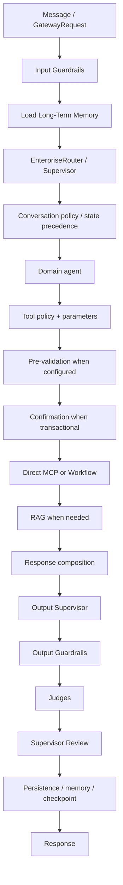
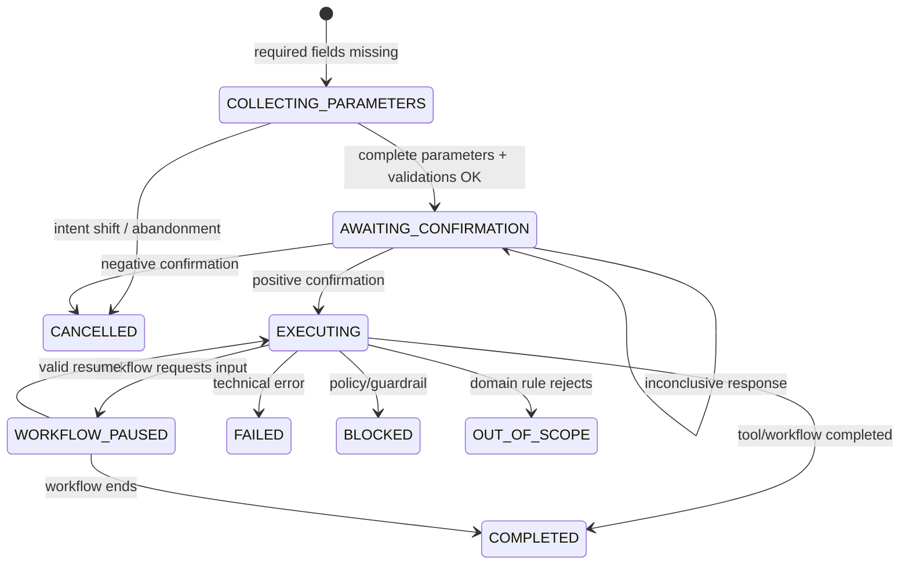
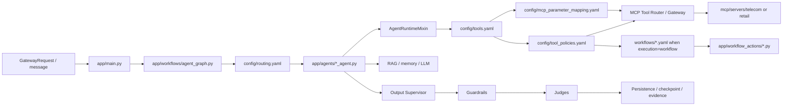

# Detailed Rule Manual for `agent_template_backend`

## Technical Preface — how the `agent_template_backend` decision engine works

`agent_template_backend` is a **corporate reference template** for building agents on the Agent Framework OCI. Decision logic is not concentrated in one `if`, prompt, or router. Final behavior results from cooperation among declarative configuration, LangGraph state, transactional runtime, MCP Tool Router, RAG, memory, guardrails, judges, Output Supervisor, workflows, and persistence.

A message may:

- be sanitized/blocked before routing;
- belong to an already-open transaction;
- fill a pending parameter;
- confirm/reject an action;
- interrupt the previous operation through intent shift;
- continue with the current agent through route stickiness;
- contain multiple independent intents;
- resume a paused workflow;
- select one or more candidate tools;
- go through pre-validation;
- change its execution path because of policy;
- execute a tool directly or a deterministic workflow;
- use MCP as operational evidence;
- use RAG as documentary knowledge;
- use summarized/long-term memory as context;
- be reviewed by Output Supervisor, guardrails, and judges;
- persist state/evidence for the next turn.

When diagnosing the template, the right question is not only “which intent was found?” but:

> **What state was the session in, which mechanism had precedence, which intent/route won, which tool was selected, which parameters were resolved, which policy/pre-validation applied, what execution occurred, and which evidence supported the final response?**

## P.1. Engine overview



Not every turn traverses every layer. A tracking query may finish quickly with MCP + renderer; a return may require collection, confirmation, and workflow execution.

## P.2. Actual corporate graph in the template

`app/workflows/agent_graph.py` builds a `FrameworkStateGraph(AgentState)` with the main nodes:

```text
START
  ↓
input_guardrails
  ↓
load_long_term_memory
  ↓
routing_decision
  ↓
billing_agent | product_agent | orders_agent | support_agent
     | handoff | human_handoff | end_session | supervisor_agent
  ↓
output_supervisor
  ↓
output_guardrails
  ↓
judge
  ↓
supervisor_review
  ↓
persist_long_term_memory
  ↓
persist
  ↓
END
```

The graph is the backbone; domain rules live in YAML, agents, MCP, and workflows.

## P.3. Three state families

### P.3.1. States declared in `routing.yaml`

| State | Owning agent |
|---|---|
| `WAITING_BILLING_CONFIRMATION` | `billing_agent` |
| `WAITING_PRODUCT_CONFIRMATION` | `product_agent` |
| `WAITING_ORDER_CONFIRMATION` | `orders_agent` |
| `WAITING_SUPPORT_CONFIRMATION` | `support_agent` |
| `COLLECTING_BILLING_PARAMETERS` | `billing_agent` |
| `COLLECTING_PRODUCT_PARAMETERS` | `product_agent` |
| `COLLECTING_ORDER_PARAMETERS` | `orders_agent` |
| `COLLECTING_SUPPORT_PARAMETERS` | `support_agent` |

They keep the next turn with the owning agent while parameters or confirmation are pending.

### P.3.2. Canonical transactional runtime states

The runtime uses states such as:

```text
COLLECTING_PARAMETERS
AWAITING_CONFIRMATION
CONFIRMED
EXECUTING
WORKFLOW_PAUSED
TOOL_RESULT_CLARIFICATION
COMPLETED
FAILED
CANCELLED
BLOCKED
OUT_OF_SCOPE
```

These control parameters, confirmation, execution, and transaction termination.

### P.3.3. Workflow-engine states

A workflow has an independent execution identified by `execution_id`, with results such as:

```text
PAUSED / WAITING_INPUT
COMPLETED
FAILED
```

The three groups are related, but they must not be treated as a single enum.

## P.4. Conceptual transactional state machine



## P.5. Routing

`config/routing.yaml` is the declarative source for intents, priorities, agents, tools, keywords, and examples.

The main `EnterpriseRouter` sequence is:

```text
active state/transaction
→ deterministic matching
→ LLM router when enabled
→ fallback
```

Deterministic matching favors the best priority/specificity combination; **lower numeric `priority` values take precedence**.

When `ENABLE_LLM_ROUTER=true`, the LLM receives the allowed catalog and classifies within it. The LLM must not invent new tools or agents.

## P.6. Route stickiness

`ENABLE_ROUTE_STICKINESS` enables a lightweight classifier that decides semantic continuity among:

```text
CONTINUE
ROUTE
HUMAN_HANDOFF
END_SESSION
```

Relevant configuration:

```text
ROUTE_STICKINESS_LLM_PROFILE
ROUTE_STICKINESS_CONFIDENCE_THRESHOLD
ROUTE_STICKINESS_HISTORY_TURNS
ROUTE_STICKINESS_MAX_TOKENS
```

`CONTINUE` keeps the active agent; `ROUTE` goes back to EnterpriseRouter. Stickiness does not authorize transactions and does not replace tool policy.

## P.7. Intent shift and explicit abandonment (`CONTINUE` / `SHIFT` / `ABANDON`)

During `COLLECTING_PARAMETERS` or `AWAITING_CONFIRMATION`, the framework protects the current transaction from accidental topic changes. Before assuming that every new utterance belongs to the open transaction, EnterpriseRouter may classify how the message relates to the active transactional goal using three semantic decisions:

```text
CONTINUE
SHIFT
ABANDON
```

These decisions are not new persisted transactional states. They guide how the current state is handled. The operational terminal state remains, for example, `CANCELLED`.

- `CONTINUE`: the message belongs to the transaction in progress. Parameter collection, confirmation, or execution continues normally.
- `SHIFT`: the user temporarily moves to another goal. The framework releases the active transactional latch so the new intent can be routed, but **a shift is not interpreted as permission to erase all `pending_topics`**. Pending work from a multi-intent plan may remain available for later resumption.
- `ABANDON`: the user explicitly gives up the active action/transaction. The router signals `transaction_interruption=explicit_abandonment`; the runtime terminates the related transaction as `CANCELLED` and clears its transactional latches.

Conceptual examples:

```text
"PED-1001"
→ CONTINUE
→ fills order_id for the current collection

"before that, I want to check my services"
→ SHIFT
→ handles the new goal
→ previous pending_topics are not automatically erased

"I don't want to cancel anymore"
→ ABANDON
→ terminates the active cancellation transaction as CANCELLED
```

When `ABANDON` occurs without a new goal to route, the framework may represent the turn with a state intent such as `state:TRANSACTION_ABANDONED`, without selecting again the tool that was just abandoned. This avoids the incorrect loop `ABANDON → detect the word cancel again → reopen cancelar_pedido`.

`ABANDON` must also not be confused with a global cleanup of the multi-intent plan. By default, it terminates the correlated active action/transaction; other independent operations may remain in `pending_topics`. If the user explicitly abandons additional actions, that scope should be resolved by correlation rather than by an indiscriminate `pending_topics = []`.

The current utterance still has precedence when filling pending fields when the decision is `CONTINUE`. A response such as `PED-1001` while collecting `order_id` must not be reinterpreted as a new intent.

## P.8. Parameter collection

Parameter requirements are produced by the combination:

```text
tools.yaml args_schema
+ tool_policies.yaml requires
+ mcp_parameter_mapping.yaml
+ canonical state data
```

Example:

```text
cancelar_pedido
requires: [order_id]
```

Without `order_id`, the runtime enters `COLLECTING_PARAMETERS`, uses the tool schema/user prompt to request the field, and preserves agent ownership.

## P.9. Temporal reconciliation

The framework contains a temporal reconciler in `runtime/transaction_parameters.py`. It is used **after** the normal current-turn extraction attempt when required fields are still missing.

Principles:

- the current utterance is the newest source and has precedence;
- history resolves references but does not invent operational facts;
- fields may be preserved, resolved, cleared, or remain unresolved;
- ambiguity must remain unresolved;
- candidate results still pass domain validations/pre-validation.

This allows coherent cross-turn relationships without converting conversational history into backend evidence.

## P.10. Contextual reentry

`EnterpriseRouter` and the runtime support `contextual_reentry`: a short turn may reenter a rule when the immediately preceding context constrains its meaning.

The runtime keeps the current utterance separate from `relevant_conversation_context`; that context is interpretive and does not replace tools/MCP as operational authority.

## P.11. Multi-intent and `pending_topics`

`MultiIntentPlanner` can split independent goals:

```text
"track the order and then cancel it"
```

into distinct topics without decomposing internal parameters of one action.

When one action must finish before the next, remaining goals may be persisted in `pending_topics`. `drain_pending_topics()` appears directly in the template graph.

## P.12. Tool policies

`tools.yaml` describes capabilities. `tool_policies.yaml` describes **how** a sensitive capability may execute.

In the base template:

- `cancelar_pedido`: transactional + confirmation + `order_id` + pre-validation;
- `solicitar_troca`: transactional + confirmation;
- `solicitar_devolucao`: transactional + confirmation + `order_id/reason` + workflow.

This prevents sensitive execution rules from being hardcoded inside agents.

## P.13. Pre-validation

Pre-validation occurs after required parameters are complete and before confirmation.

Flow:

```text
complete parameters
→ side-effect-free MCP validator
→ eligible?
   ├─ false: OUT_OF_SCOPE / terminate latch
   └─ true: AWAITING_CONFIRMATION
```

In the template, `cancelar_pedido` uses `validar_cancelamento_pedido` with `fail_open=false`.

## P.14. Transaction confirmation

Tools with `require_confirmation=true` do not execute automatically.

The framework first attempts to interpret explicit confirmations deterministically and can use semantic fallback when necessary. A positive response promotes the transaction to execution; a negative one cancels it; an inconclusive response keeps the transaction active.

## P.15. Transactional workflow

A policy may define:

```yaml
execution:
  mode: workflow
  workflow: devolucao_pedido
  version: active
```

After confirmation, the logical tool is executed by `WorkflowToolExecutor`, which loads the versioned YAML and executes the deterministic graph. The domain declares nodes/actions; the framework owns runtime, checkpointing, and tracing.

## P.16. Pause/Resume

The workflow engine supports pause nodes, `expected_input`, `resume_from`, and resume by `execution_id`. The base return workflow does not pause; the capability is demonstrated separately in `Tuning-Performance/Pause_Resume_Workflow`.

An important rule is that pause compilation must not automatically rerun a side-effecting action when the user answers.

## P.17. Guardrails

In the global template:

**Input**
- `MSK`
- `VLOOP`

**Output**
- `REVPREC`
- `PINJ`
- `DLEX_OUT`

Pipelines can be enabled/disabled through `.env`. Guardrails evaluate permission/safety/operational coherence; they must not replace routing or domain rules.

## P.18. Output Supervisor

Output Supervisor sits between the agent and output guardrails. It may review the candidate response, apply retry/sanitize/block/handover policies, and prevent premature claims about effects that are not supported by operational results.

`OUTPUT_SUPERVISOR_MAX_RETRIES` controls the regeneration limit.

## P.19. Judges

`config/judges.yaml` enables:

| Judge | Threshold/policy |
|---|---|
| `response_quality` | `0.7` |
| `groundedness` | `0.6` |
| `sentiment` | does not fail on negative |
| `tone` | `fail_closed=true` |

Global configuration:

```text
enabled=true
fail_closed=true
sample_rate=0.25
always_run_for_transactional=true
```

Transactional responses are therefore evaluated even when the general sampling rate would skip them.

## P.20. MCP, operational evidence, and renderers

The template separates three responsibilities:

```text
routing → which capabilities belong to the intent
tool runtime → which capability should actually execute
MCP server → operational fact / integration
```

Some tools use `response.mode: renderer`, such as `telecom.invoice`, `telecom.plan`, `retail.order`, and `retail.delivery`. In those cases, MCP results may be presented deterministically without requiring LLM composition.

## P.21. RAG

`AgentRuntimeMixin._retrieve_rag_context()` uses the framework's official RAG path. RAG is for documentary knowledge; MCP is for operational state.

The runtime also supports **Domain-Requested RAG**: a tool may return `requires_rag=true` and `rag_queries`, forcing retrieval even when MCP would normally be considered sufficient.

## P.22. Domain-requested LLM composition

A tool/workflow may return:

```json
{
  "requires_llm_composition": true,
  "response_instruction": "Explain using only workflow evidence."
}
```

The domain does not create its own LLM gateway. AgentRuntime uses the official provider, preserving tracing, cost controls, profiles, and guardrails.

## P.23. Memory

The template provides:

- ConversationSummaryMemory;
- recent memory;
- optional Long-Term Memory;
- operational checkpoint/persistence.

Memory helps interpret context, preferences, and continuity. **It does not replace Transaction Evidence or MCP** for asserting that an operation occurred.

## P.24. Transaction Evidence

Completed transaction results can be persisted as structured operational evidence and correlated with future turns. This prevents later responses from mentioning a previous protocol/cancellation without providing the same evidence to judges/groundedness.

## P.25. Idempotency

Transactional state, checkpointing, and `execution_id` also protect against retry/replay/reexecution. A repeated confirmation must not create two transactions just because the channel resent a message.

## P.26. Voice interruption and replay

The framework contains channel short-circuits for idle nudges, non-interruptible speech, post-finalization, and barge-in. In several cases it simply replays the last utterance without reopening LangGraph, tools, or guardrails; where needed it uses the `processing_interruption_classifier` profile.

## P.27. Workflow error and recovery

`WorkflowRuntime` preserves the last valid snapshot and exposes `error`, partial trace, and `error_details` when the provider supplies `status_code`, `body`, and `attempts`. The domain can distinguish technical failure from business-rule rejection without coupling the framework to the provider.

## P.28. Observability

The template emits telemetry to:

- Langfuse;
- OpenTelemetry;
- corporate analytics/observer;
- IC events;
- NOC;
- GRL;
- workflow;
- guardrails;
- judges.

Telemetry should allow reconstruction of:

```text
input → route → agent → tool → policy → workflow → output controls → persistence
```

## P.29. `agents.yaml`: logical application/agent isolation

`config/agents.yaml` registers two reference `agent_id` values:

- `telecom_contas`;
- `retail_orders`.

Each can point to prompt policy, routing, guardrails, judges, MCP servers, and tools, plus `metadata.system_prefix`. The goal is to prevent policies, memory/checkpoints, or decisions from leaking across logical identities.

## P.30. Troubleshooting golden rule

Always investigate in this order:

```text
1. Which agent_id is active?
2. What was the state/checkpoint?
3. Was there an active transaction or paused workflow?
4. Which route/stickiness decision occurred?
5. Which intent won and why?
6. Which mcp_tools did the intent authorize?
7. Which tool was actually selected?
8. Which parameters were resolved?
9. Did temporal reconciliation occur?
10. Did pre-validation occur?
11. Was confirmation required?
12. Direct tool or workflow?
13. Which MCP/workflow result was produced?
14. Did the response use renderer, RAG, or LLM?
15. Did Output Supervisor/guardrails change anything?
16. Did judges approve it?
17. Was state/evidence persisted?
```

This is the engine on which the template's five rules are built.

## 1. How to read this manual

This manual follows the same model as the Accounts Agent manual. Each rule is explained at six levels:

1. **Rule/intent** — what it means and its boundary.
2. **Routing** — `routing.yaml` attribute by attribute and how the intent is discovered.
3. **Tools** — operation, arguments, aliases, extraction, policy, confirmation, pre-validation, and return.
4. **Workflow** — when present, nodes, actions, conditions, and termination.
5. **Binding** — Python/YAML/`.env` files involved.
6. **Diagnostics** — why a specific decision occurs.

A separate section then covers `Tuning-Performance`.

## 2. Agent catalog and `agent_id` isolation

| agent_id | Name | Domain | Specific configuration |
|---|---|---|---|
| `telecom_contas` | Agente Telecom Contas | `telecom` | prompt `./config/agents/telecom_contas/prompt_policy.yaml`; guardrails `./config/agents/telecom_contas/guardrails.yaml`; judges `./config/agents/telecom_contas/judges.yaml` |
| `retail_orders` | Agente Retail Pedidos | `retail` | prompt `./config/agents/retail_orders/prompt_policy.yaml`; guardrails `./config/agents/retail_orders/guardrails.yaml`; judges `./config/agents/retail_orders/judges.yaml` |

The `default_agent_id` is `telecom_contas`. Each entry's `system_prefix` guides the runtime so that policies, memory/checkpoints, or decisions from another `agent_id` are not mixed.

## 3. Component binding




## 4. Rule inventory

| Intent | Rule | Agent | Priority | Tools |
|---|---|---|---:|---|
| `billing_invoice_explanation` | Billing / Invoice Explanation | `billing_agent` | 10 | `consultar_fatura`, `consultar_pagamentos` |
| `product_services_information` | Products, Plan, Services, and VAS | `product_agent` | 20 | `consultar_plano`, `listar_servicos` |
| `retail_order_cancel` | Order Cancellation | `orders_agent` | 20 | `consultar_pedido`, `cancelar_pedido` |
| `retail_order_tracking` | Order Query and Tracking | `orders_agent` | 30 | `consultar_pedido`, `consultar_entrega` |
| `retail_support_exchange_return` | Exchange, Return, Warranty, and Retail Support | `support_agent` | 25 | `consultar_pedido`, `solicitar_troca`, `solicitar_devolucao` |

# 5. Rule — Billing / Invoice Explanation

**Intent:** `billing_invoice_explanation`  
**Domain:** `telecom`  
**Agent:** `billing_agent`  
**Priority:** `10`

## What this rule means

Questions about invoices, billing, due dates, duplicate copies, disputes, and amounts.

### Rule boundary

This is an informational/operational billing rule. It queries evidence; by itself it does not authorize a transactional financial action.

## `routing.yaml` attribute by attribute

| Attribute | Value in this rule | Role in the engine |
|---|---|---|
| `name` | billing_invoice_explanation | Stable intent identifier. It is stored in routing/telemetry state and links the decision to declared capabilities. |
| `domain` | telecom | Logical domain. It helps constrain context, agents, and catalog interpretation. |
| `agent` | billing_agent | Agent that receives the turn when this intent wins. |
| `description` | Questions about invoices, billing, due dates, duplicate copies, disputes, and amounts. | Semantic definition used by maintainers and by the LLM fallback. |
| `priority` | 10 | Tie-breaker among competing intents. In EnterpriseRouter, lower numeric values take precedence. |
| `mcp_tools` | consultar_fatura<br>consultar_pagamentos | Capabilities initially authorized/expected for this intent. |
| `keywords` | fatura<br>conta<br>cobrança<br>boleto<br>vencimento<br>segunda via<br>contestar<br>valor alto<br>invoice | Deterministic triggers evaluated before semantic fallback. |
| `examples` | Minha fatura veio alta.<br>Quero entender uma cobrança.<br>Preciso da segunda via da conta. | Examples offered to the LLM classifier; they are neither regexes nor executable rules. |

## How this intent is found

1. EnterpriseRouter checks active state/transaction before treating the utterance as a new request.
2. In deterministic matching, this intent offers keywords such as `fatura`, `conta`, `cobrança`, `boleto`, `vencimento`, `segunda via`, `contestar`, `valor alto`, `invoice`.
3. In collisions, `priority=10` participates in tie-breaking; lower values take precedence.
4. If LLM fallback is used, the description and examples such as `Minha fatura veio alta.`, `Quero entender uma cobrança.`, `Preciso da segunda via da conta.` help classification.
5. When the intent wins, state receives the route/agent and initial tool set `['consultar_fatura', 'consultar_pagamentos']`.

## Owning agent and Python behavior

File: `app/agents/billing_agent.py`.
Its `run()` follows a common pattern: emit start IC, collect MCP context, check transactional clarification/confirmation messages, try a direct MCP/renderer answer, retrieve RAG when necessary, prepare memory, assemble `messages`, call the LLM, and return a state patch.
This pattern comes from `app/agents/runtime.py::AgentRuntimeMixin`, preventing each agent from reimplementing MCP, RAG, cache, memory, IC, and transactional logic.

## Tools in this rule

### Tool `consultar_fatura`

**What it does:** Queries summarized invoice data by msisdn/invoice_id.

| Property | Value |
|---|---|
| MCP server | `telecom` |
| enabled | `True` |
| type/operation | `read_only` |
| confirmation required | `false` |
| requires | — |
| selection_keywords | `fatura`, `conta`, `boleto` |
| presentation | `mode=renderer`; renderer `telecom.invoice` |

**Required data and origin**

| Field | Type | How it is obtained | Use |
|---|---|---|---|
| `msisdn` | `string` | canonical context `customer_key` | Número da linha do cliente (MSISDN) usado para consultar informações de telecom. |
| `invoice_id` | `string` | canonical context `contract_key` | Identificador da fatura que o cliente deseja consultar. |

**MCP aliases:** `customer_key → msisdn`, `contract_key → invoice_id`, `interaction_key → ura_call_id`, `session_key → session_id`.

**Conversational extraction:**
- `mes_referencia`: strategy `month_name_pt`; Extrair mês citado na mensagem. janeiro=1, fevereiro=2, março=3, abril=4, maio=5, junho=6, julho=7, agosto=8, setembro=9, outubro=10, novembro=11, dezembro=12.


**What it returns:** In the sample MCP it returns `invoice_id`, `msisdn`, `valor_total`, `vencimento`, `status`, and an `itens` list; the final envelope is `{ok, result, metadata}`.

### Tool `consultar_pagamentos`

**What it does:** Queries the customer's payment history.

| Property | Value |
|---|---|
| MCP server | `telecom` |
| enabled | `True` |
| type/operation | `read_only` |
| confirmation required | `false` |
| requires | — |
| selection_keywords | `pagamento`, `pagamentos` |

**Required data and origin**

| Field | Type | How it is obtained | Use |
|---|---|---|---|
| `msisdn` | `string` | canonical context `customer_key` | Número da linha do cliente (MSISDN) usado para consultar informações de telecom. |

**MCP aliases:** `customer_key → msisdn`, `interaction_key → ura_call_id`, `session_key → session_id`.

**What it returns:** Returns `msisdn` and `pagamentos[]`, with date, amount, and payment status from the mock.

## Workflow

This rule does not require a dedicated declarative workflow in the base template. Execution occurs through MCP/the standard runtime; transactional states may still exist for parameter collection and confirmation.

## Binding between YAML and Python

- `config/routing.yaml` → finds `billing_invoice_explanation` and selects `billing_agent`.
- `config/tools.yaml` → describes arguments, MCP server, selection keywords, and renderer.
- `config/tool_policies.yaml` → defines read-only/transactional behavior, confirmation, pre-validation, and/or workflow.
- `config/mcp_parameter_mapping.yaml` → maps canonical keys and extracts fields from the message.
- `app/agents/billing_agent.py` → uses `AgentRuntimeMixin` to execute capabilities without duplicating infrastructure.
- `app/workflows/agent_graph.py` → connects the agent to the corporate graph and output controls.
- `mcp/servers/telecom_mcp_server/main.py` → mock/contract implementation for tool `consultar_fatura`.
- `mcp/servers/telecom_mcp_server/main.py` → mock/contract implementation for tool `consultar_pagamentos`.

### Relevant `.env` and configuration

- `ROUTING_CONFIG_PATH=./config/routing.yaml` and `ENABLE_LLM_ROUTER` control the routing catalog/semantic fallback.
- `ENABLE_ROUTE_STICKINESS`, `ROUTE_STICKINESS_*`, `HUMAN_HANDOFF_MESSAGE`, and `END_SESSION_MESSAGE` control continuity/session behavior.
- `ENABLE_MCP_TOOLS`, `MCP_SERVERS_CONFIG_PATH`, `TOOLS_CONFIG_PATH`, `TOOL_POLICIES_PATH`, `MCP_PARAMETER_MAPPING_PATH`, and `MCP_TOOL_TIMEOUT_SECONDS` control tools.
- `MCP_GATEWAY_ENABLED` chooses between a dedicated MCP Gateway and direct access to configured MCP servers.
- Logical server `telecom` is resolved by `config/mcp_servers.yaml`; in the base template it points to `http://localhost:8100/mcp` using the legacy HTTP contract.
- `ENABLE_INPUT_GUARDRAILS`, `ENABLE_OUTPUT_GUARDRAILS`, `ENABLE_JUDGES`, and `ENABLE_OUTPUT_SUPERVISOR` affect the cycle before/after the agent.
- `ENABLE_CONVERSATION_SUMMARY_MEMORY` and `ENABLE_LONG_TERM_MEMORY` may enrich prompt/context without replacing MCP evidence.
- `RAG_PROVIDER`, `VECTOR_STORE_PROVIDER`, `GRAPH_STORE_PROVIDER`, `RAG_TOP_K`, and `KBDB_*` control documentary retrieval when used.


### Special diagnostic — why two tools appear under the same intent

The billing intent authorizes `consultar_fatura` and `consultar_pagamentos` because billing questions may require invoice evidence or payment-history evidence. This **does not mean both tools must run on every turn**.

`tools.yaml.selection_keywords`, current text, available arguments, and runtime state help select the appropriate capability. “I need a duplicate invoice / what is my invoice amount?” should favor `consultar_fatura`; a specific payment question should favor `consultar_pagamentos`.

# 6. Rule — Products, Plan, Services, and VAS

**Intent:** `product_services_information`  
**Domain:** `telecom`  
**Agent:** `product_agent`  
**Priority:** `20`

## What this rule means

Questions about plans, packages, products, services, VAS, internet, roaming, and benefits.

### Rule boundary

It is used to discover plans/services/VAS and explain attributes. A product question must not be converted into a proactive offer or a transactional action.

## `routing.yaml` attribute by attribute

| Attribute | Value in this rule | Role in the engine |
|---|---|---|
| `name` | product_services_information | Stable intent identifier. It is stored in routing/telemetry state and links the decision to declared capabilities. |
| `domain` | telecom | Logical domain. It helps constrain context, agents, and catalog interpretation. |
| `agent` | product_agent | Agent that receives the turn when this intent wins. |
| `description` | Questions about plans, packages, products, services, VAS, internet, roaming, and benefits. | Semantic definition used by maintainers and by the LLM fallback. |
| `priority` | 20 | Tie-breaker among competing intents. In EnterpriseRouter, lower numeric values take precedence. |
| `mcp_tools` | consultar_plano<br>listar_servicos | Capabilities initially authorized/expected for this intent. |
| `keywords` | plano<br>serviço<br>pacote<br>internet<br>roaming<br>vas<br>benefício<br>assinatura | Deterministic triggers evaluated before semantic fallback. |
| `examples` | Quais serviços estão ativos no meu plano?<br>Quero saber sobre meu pacote de internet.<br>Tenho roaming internacional? | Examples offered to the LLM classifier; they are neither regexes nor executable rules. |

## How this intent is found

1. EnterpriseRouter checks active state/transaction before treating the utterance as a new request.
2. In deterministic matching, this intent offers keywords such as `plano`, `serviço`, `pacote`, `internet`, `roaming`, `vas`, `benefício`, `assinatura`.
3. In collisions, `priority=20` participates in tie-breaking; lower values take precedence.
4. If LLM fallback is used, the description and examples such as `Quais serviços estão ativos no meu plano?`, `Quero saber sobre meu pacote de internet.`, `Tenho roaming internacional?` help classification.
5. When the intent wins, state receives the route/agent and initial tool set `['consultar_plano', 'listar_servicos']`.

## Owning agent and Python behavior

File: `app/agents/product_agent.py`.
Its `run()` follows a common pattern: emit start IC, collect MCP context, check transactional clarification/confirmation messages, try a direct MCP/renderer answer, retrieve RAG when necessary, prepare memory, assemble `messages`, call the LLM, and return a state patch.
This pattern comes from `app/agents/runtime.py::AgentRuntimeMixin`, preventing each agent from reimplementing MCP, RAG, cache, memory, IC, and transactional logic.

## Tools in this rule

### Tool `consultar_plano`

**What it does:** Queries the active plan and commercial attributes.

| Property | Value |
|---|---|
| MCP server | `telecom` |
| enabled | `True` |
| type/operation | `read_only` |
| confirmation required | `false` |
| requires | — |
| selection_keywords | `plano` |
| presentation | `mode=renderer`; renderer `telecom.plan` |

**Required data and origin**

| Field | Type | How it is obtained | Use |
|---|---|---|---|
| `msisdn` | `string` | canonical context `customer_key` | Número da linha do cliente (MSISDN) usado para consultar informações de telecom. |
| `asset_id` | `string` | canonical context `resource_key`; canonical context `contract_key` | Identificador do plano ou ativo comercial associado ao cliente. |

**MCP aliases:** `customer_key → msisdn`, `resource_key → asset_id`, `contract_key → asset_id`, `session_key → session_id`.

**What it returns:** Returns `msisdn`, `asset_id`, plan name, internet allowance, roaming attribute, and status.

### Tool `listar_servicos`

**What it does:** Lists active services and additional VAS.

| Property | Value |
|---|---|
| MCP server | `telecom` |
| enabled | `True` |
| type/operation | `read_only` |
| confirmation required | `false` |
| requires | — |
| selection_keywords | `serviços`, `servicos`, `vas` |

**Required data and origin**

| Field | Type | How it is obtained | Use |
|---|---|---|---|
| `msisdn` | `string` | canonical context `customer_key` | Número da linha do cliente (MSISDN) usado para consultar informações de telecom. |

**MCP aliases:** `customer_key → msisdn`, `session_key → session_id`.

**What it returns:** Returns `msisdn` and `servicos[]` containing name, status, and amount.

## Workflow

This rule does not require a dedicated declarative workflow in the base template. Execution occurs through MCP/the standard runtime; transactional states may still exist for parameter collection and confirmation.

## Binding between YAML and Python

- `config/routing.yaml` → finds `product_services_information` and selects `product_agent`.
- `config/tools.yaml` → describes arguments, MCP server, selection keywords, and renderer.
- `config/tool_policies.yaml` → defines read-only/transactional behavior, confirmation, pre-validation, and/or workflow.
- `config/mcp_parameter_mapping.yaml` → maps canonical keys and extracts fields from the message.
- `app/agents/product_agent.py` → uses `AgentRuntimeMixin` to execute capabilities without duplicating infrastructure.
- `app/workflows/agent_graph.py` → connects the agent to the corporate graph and output controls.
- `mcp/servers/telecom_mcp_server/main.py` → mock/contract implementation for tool `consultar_plano`.
- `mcp/servers/telecom_mcp_server/main.py` → mock/contract implementation for tool `listar_servicos`.

### Relevant `.env` and configuration

- `ROUTING_CONFIG_PATH=./config/routing.yaml` and `ENABLE_LLM_ROUTER` control the routing catalog/semantic fallback.
- `ENABLE_ROUTE_STICKINESS`, `ROUTE_STICKINESS_*`, `HUMAN_HANDOFF_MESSAGE`, and `END_SESSION_MESSAGE` control continuity/session behavior.
- `ENABLE_MCP_TOOLS`, `MCP_SERVERS_CONFIG_PATH`, `TOOLS_CONFIG_PATH`, `TOOL_POLICIES_PATH`, `MCP_PARAMETER_MAPPING_PATH`, and `MCP_TOOL_TIMEOUT_SECONDS` control tools.
- `MCP_GATEWAY_ENABLED` chooses between a dedicated MCP Gateway and direct access to configured MCP servers.
- Logical server `telecom` is resolved by `config/mcp_servers.yaml`; in the base template it points to `http://localhost:8100/mcp` using the legacy HTTP contract.
- `ENABLE_INPUT_GUARDRAILS`, `ENABLE_OUTPUT_GUARDRAILS`, `ENABLE_JUDGES`, and `ENABLE_OUTPUT_SUPERVISOR` affect the cycle before/after the agent.
- `ENABLE_CONVERSATION_SUMMARY_MEMORY` and `ENABLE_LONG_TERM_MEMORY` may enrich prompt/context without replacing MCP evidence.
- `RAG_PROVIDER`, `VECTOR_STORE_PROVIDER`, `GRAPH_STORE_PROVIDER`, `RAG_TOP_K`, and `KBDB_*` control documentary retrieval when used.

# 7. Rule — Order Cancellation

**Intent:** `retail_order_cancel`  
**Domain:** `retail`  
**Agent:** `orders_agent`  
**Priority:** `20`

## What this rule means

Explicit cancellation of an order or purchase.

### Rule boundary

The intent represents the customer's desire to cancel. Execution still depends on `order_id`, pre-validation, and confirmation; an ineligible order is blocked before confirmation.

## `routing.yaml` attribute by attribute

| Attribute | Value in this rule | Role in the engine |
|---|---|---|
| `name` | retail_order_cancel | Stable intent identifier. It is stored in routing/telemetry state and links the decision to declared capabilities. |
| `domain` | retail | Logical domain. It helps constrain context, agents, and catalog interpretation. |
| `agent` | orders_agent | Agent that receives the turn when this intent wins. |
| `description` | Explicit cancellation of an order or purchase. | Semantic definition used by maintainers and by the LLM fallback. |
| `priority` | 20 | Tie-breaker among competing intents. In EnterpriseRouter, lower numeric values take precedence. |
| `mcp_tools` | consultar_pedido<br>cancelar_pedido | Capabilities initially authorized/expected for this intent. |
| `keywords` | cancelar pedido<br>cancelamento do pedido<br>cancelar a compra<br>cancelar compra | Deterministic triggers evaluated before semantic fallback. |
| `examples` | Quero cancelar meu pedido.<br>Cancele o pedido.<br>Quero cancelar a compra. | Examples offered to the LLM classifier; they are neither regexes nor executable rules. |

## How this intent is found

1. EnterpriseRouter checks active state/transaction before treating the utterance as a new request.
2. In deterministic matching, this intent offers keywords such as `cancelar pedido`, `cancelamento do pedido`, `cancelar a compra`, `cancelar compra`.
3. In collisions, `priority=20` participates in tie-breaking; lower values take precedence.
4. If LLM fallback is used, the description and examples such as `Quero cancelar meu pedido.`, `Cancele o pedido.`, `Quero cancelar a compra.` help classification.
5. When the intent wins, state receives the route/agent and initial tool set `['consultar_pedido', 'cancelar_pedido']`.

## Owning agent and Python behavior

File: `app/agents/orders_agent.py`.
Its `run()` follows a common pattern: emit start IC, collect MCP context, check transactional clarification/confirmation messages, try a direct MCP/renderer answer, retrieve RAG when necessary, prepare memory, assemble `messages`, call the LLM, and return a state patch.
This pattern comes from `app/agents/runtime.py::AgentRuntimeMixin`, preventing each agent from reimplementing MCP, RAG, cache, memory, IC, and transactional logic.

## Tools in this rule

### Tool `consultar_pedido`

**What it does:** Queries a retail order by order_id/customer_id.

| Property | Value |
|---|---|
| MCP server | `retail` |
| enabled | `True` |
| type/operation | `read_only` |
| confirmation required | `false` |
| requires | — |
| selection_keywords | `consultar pedido`, `status do pedido`, `pedido` |
| presentation | `mode=renderer`; renderer `retail.order` |

**Required data and origin**

| Field | Type | How it is obtained | Use |
|---|---|---|---|
| `order_id` | `string` | `hybrid` extraction from `message` | Identificador do pedido que o cliente deseja consultar. |
| `customer_id` | `string` | canonical context `customer_key` | Identificador do cliente associado ao pedido de varejo. |

**MCP aliases:** `customer_key → customer_id`, `session_key → session_id`.

**Conversational extraction:**
- `order_id`: strategy `hybrid`; Extraia somente o identificador do pedido informado explicitamente pelo usuário. Retorne null quando não houver identificador de pedido na mensagem.

**What it returns:** Returns `order_id`, `customer_id`, `status`, `valor_total`, and `itens[]`. In the mock, `123` and `PED-ENTREGUE` are `ENTREGUE`; other orders are `EM_TRANSPORTE`.

### Tool `cancelar_pedido`

**What it does:** Simulates cancellation of a retail order.

| Property | Value |
|---|---|
| MCP server | `retail` |
| enabled | `True` |
| type/operation | `transactional` |
| confirmation required | `true` |
| requires | `order_id` |
| selection_keywords | `cancelar pedido`, `cancelamento do pedido`, `cancelar compra`, `cancelar a compra` |
| pre-validation | `validar_cancelamento_pedido`; `fail_open=false` |

**Required data and origin**

| Field | Type | How it is obtained | Use |
|---|---|---|---|
| `order_id` | `string` | `hybrid` extraction from `message` | Identificador do pedido que o cliente deseja cancelar. |

**MCP aliases:** `session_key → session_id`.

**Conversational extraction:**
- `order_id`: strategy `hybrid`; Extraia somente o identificador do pedido informado explicitamente pelo usuário. Retorne null quando não houver identificador de pedido na mensagem.

**What it returns:** Returns a protocol, `order_id`, `CANCELAMENTO_SOLICITADO` status, and guidance. Because it is transactional, it must only execute after parameters, pre-validation, and confirmation.

### Internal tool used by the policy

### Tool `validar_cancelamento_pedido`

**What it does:** Pre-validates order cancellation without executing transactional side effects.

| Property | Value |
|---|---|
| MCP server | `retail` |
| enabled | `True` |
| type/operation | `internal` |
| confirmation required | `false` |
| requires | `order_id` |
| selection_keywords | — |

**Required data and origin**

| Field | Type | How it is obtained | Use |
|---|---|---|---|
| `order_id` | `string` | canonical context `resource_key` | Identificador do pedido a ser pre-validado para cancelamento. |
| `target_tool` | `string` | state/context, parameter collection, or explicit call | Nome interno da operação transacional que será pre-validada; normalmente preenchido pelo runtime e não solicitado ao usuário. |

**MCP aliases:** `resource_key → order_id`.

**What it returns:** Returns `eligible`, `status`, `order_id`, a `reason` when blocked, and `side_effect_free` metadata. It is an internal/read-only tool used before confirmation.

## Workflow

This rule does not require a dedicated declarative workflow in the base template. Execution occurs through MCP/the standard runtime; transactional states may still exist for parameter collection and confirmation.

## Binding between YAML and Python

- `config/routing.yaml` → finds `retail_order_cancel` and selects `orders_agent`.
- `config/tools.yaml` → describes arguments, MCP server, selection keywords, and renderer.
- `config/tool_policies.yaml` → defines read-only/transactional behavior, confirmation, pre-validation, and/or workflow.
- `config/mcp_parameter_mapping.yaml` → maps canonical keys and extracts fields from the message.
- `app/agents/orders_agent.py` → uses `AgentRuntimeMixin` to execute capabilities without duplicating infrastructure.
- `app/workflows/agent_graph.py` → connects the agent to the corporate graph and output controls.
- `mcp/servers/retail_mcp_server/main.py` → mock/contract implementation for tool `consultar_pedido`.
- `mcp/servers/retail_mcp_server/main.py` → mock/contract implementation for tool `cancelar_pedido`.

### Relevant `.env` and configuration

- `ROUTING_CONFIG_PATH=./config/routing.yaml` and `ENABLE_LLM_ROUTER` control the routing catalog/semantic fallback.
- `ENABLE_ROUTE_STICKINESS`, `ROUTE_STICKINESS_*`, `HUMAN_HANDOFF_MESSAGE`, and `END_SESSION_MESSAGE` control continuity/session behavior.
- `ENABLE_MCP_TOOLS`, `MCP_SERVERS_CONFIG_PATH`, `TOOLS_CONFIG_PATH`, `TOOL_POLICIES_PATH`, `MCP_PARAMETER_MAPPING_PATH`, and `MCP_TOOL_TIMEOUT_SECONDS` control tools.
- `MCP_GATEWAY_ENABLED` chooses between a dedicated MCP Gateway and direct access to configured MCP servers.
- Logical server `retail` is resolved by `config/mcp_servers.yaml`; in the base template it points to `http://localhost:8200/mcp` using the legacy HTTP contract.
- `ENABLE_INPUT_GUARDRAILS`, `ENABLE_OUTPUT_GUARDRAILS`, `ENABLE_JUDGES`, and `ENABLE_OUTPUT_SUPERVISOR` affect the cycle before/after the agent.
- `ENABLE_CONVERSATION_SUMMARY_MEMORY` and `ENABLE_LONG_TERM_MEMORY` may enrich prompt/context without replacing MCP evidence.
- `RAG_PROVIDER`, `VECTOR_STORE_PROVIDER`, `GRAPH_STORE_PROVIDER`, `RAG_TOP_K`, and `KBDB_*` control documentary retrieval when used.


### Special diagnostic — why `PED-ENTREGUE` never reaches confirmation

Intent `retail_order_cancel` represents the **customer's objective**: cancel an order. After routing, the `cancelar_pedido` policy requires `order_id`, calls pre-validation tool `validar_cancelamento_pedido`, and only allows `AWAITING_CONFIRMATION` when the validator returns `eligible=true`.

In the sample MCP:

```text
PED-1001
→ validar_cancelamento_pedido
→ eligible=true
→ AWAITING_CONFIRMATION
→ "yes"
→ cancelar_pedido
→ protocol CANCEL-2026-001
```

For:

```text
PED-ENTREGUE
→ validar_cancelamento_pedido
→ eligible=false / NOT_ELIGIBLE
→ OUT_OF_SCOPE
→ no confirmation question
→ cancelar_pedido does not execute
```

This illustrates the architectural rule: **intent is not operational authorization**. Intent expresses what the customer wants; domain pre-validation determines whether the operation may proceed.

# 8. Rule — Order Query and Tracking

**Intent:** `retail_order_tracking`  
**Domain:** `retail`  
**Agent:** `orders_agent`  
**Priority:** `30`

## What this rule means

Order, delivery, tracking, delay, and purchase-status queries.

### Rule boundary

This is read-only: it queries order/delivery state and must not modify the order.

## `routing.yaml` attribute by attribute

| Attribute | Value in this rule | Role in the engine |
|---|---|---|
| `name` | retail_order_tracking | Stable intent identifier. It is stored in routing/telemetry state and links the decision to declared capabilities. |
| `domain` | retail | Logical domain. It helps constrain context, agents, and catalog interpretation. |
| `agent` | orders_agent | Agent that receives the turn when this intent wins. |
| `description` | Order, delivery, tracking, delay, and purchase-status queries. | Semantic definition used by maintainers and by the LLM fallback. |
| `priority` | 30 | Tie-breaker among competing intents. In EnterpriseRouter, lower numeric values take precedence. |
| `mcp_tools` | consultar_pedido<br>consultar_entrega | Capabilities initially authorized/expected for this intent. |
| `keywords` | pedido<br>entrega<br>rastreio<br>rastreamento<br>encomenda<br>compra<br>atraso<br>correios | Deterministic triggers evaluated before semantic fallback. |
| `examples` | Meu pedido não chegou.<br>Quero rastrear minha entrega.<br>Qual é o status da minha compra? | Examples offered to the LLM classifier; they are neither regexes nor executable rules. |

## How this intent is found

1. EnterpriseRouter checks active state/transaction before treating the utterance as a new request.
2. In deterministic matching, this intent offers keywords such as `pedido`, `entrega`, `rastreio`, `rastreamento`, `encomenda`, `compra`, `atraso`, `correios`.
3. In collisions, `priority=30` participates in tie-breaking; lower values take precedence.
4. If LLM fallback is used, the description and examples such as `Meu pedido não chegou.`, `Quero rastrear minha entrega.`, `Qual é o status da minha compra?` help classification.
5. When the intent wins, state receives the route/agent and initial tool set `['consultar_pedido', 'consultar_entrega']`.

## Owning agent and Python behavior

File: `app/agents/orders_agent.py`.
Its `run()` follows a common pattern: emit start IC, collect MCP context, check transactional clarification/confirmation messages, try a direct MCP/renderer answer, retrieve RAG when necessary, prepare memory, assemble `messages`, call the LLM, and return a state patch.
This pattern comes from `app/agents/runtime.py::AgentRuntimeMixin`, preventing each agent from reimplementing MCP, RAG, cache, memory, IC, and transactional logic.

## Tools in this rule

### Tool `consultar_pedido`

**What it does:** Queries a retail order by order_id/customer_id.

| Property | Value |
|---|---|
| MCP server | `retail` |
| enabled | `True` |
| type/operation | `read_only` |
| confirmation required | `false` |
| requires | — |
| selection_keywords | `consultar pedido`, `status do pedido`, `pedido` |
| presentation | `mode=renderer`; renderer `retail.order` |

**Required data and origin**

| Field | Type | How it is obtained | Use |
|---|---|---|---|
| `order_id` | `string` | `hybrid` extraction from `message` | Identificador do pedido que o cliente deseja consultar. |
| `customer_id` | `string` | canonical context `customer_key` | Identificador do cliente associado ao pedido de varejo. |

**MCP aliases:** `customer_key → customer_id`, `session_key → session_id`.

**Conversational extraction:**
- `order_id`: strategy `hybrid`; Extraia somente o identificador do pedido informado explicitamente pelo usuário. Retorne null quando não houver identificador de pedido na mensagem.

**What it returns:** Returns `order_id`, `customer_id`, `status`, `valor_total`, and `itens[]`. In the mock, `123` and `PED-ENTREGUE` are `ENTREGUE`; other orders are `EM_TRANSPORTE`.

### Tool `consultar_entrega`

**What it does:** Queries delivery and tracking data for an order.

| Property | Value |
|---|---|
| MCP server | `retail` |
| enabled | `True` |
| type/operation | `read_only` |
| confirmation required | `false` |
| requires | — |
| selection_keywords | `entrega`, `rastreio`, `rastreamento`, `transportadora`, `previsão` |
| presentation | `mode=renderer`; renderer `retail.delivery` |

**Required data and origin**

| Field | Type | How it is obtained | Use |
|---|---|---|---|
| `order_id` | `string` | `hybrid` extraction from `message` | Identificador do pedido cuja entrega ou rastreamento será consultado. |

**MCP aliases:** `session_key → session_id`.

**Conversational extraction:**
- `order_id`: strategy `hybrid`; Extraia somente o identificador do pedido informado explicitamente pelo usuário. Retorne null quando não houver identificador de pedido na mensagem.

**What it returns:** Returns `order_id`, carrier, tracking code, forecast, and movement events.

## Workflow

This rule does not require a dedicated declarative workflow in the base template. Execution occurs through MCP/the standard runtime; transactional states may still exist for parameter collection and confirmation.

## Binding between YAML and Python

- `config/routing.yaml` → finds `retail_order_tracking` and selects `orders_agent`.
- `config/tools.yaml` → describes arguments, MCP server, selection keywords, and renderer.
- `config/tool_policies.yaml` → defines read-only/transactional behavior, confirmation, pre-validation, and/or workflow.
- `config/mcp_parameter_mapping.yaml` → maps canonical keys and extracts fields from the message.
- `app/agents/orders_agent.py` → uses `AgentRuntimeMixin` to execute capabilities without duplicating infrastructure.
- `app/workflows/agent_graph.py` → connects the agent to the corporate graph and output controls.
- `mcp/servers/retail_mcp_server/main.py` → mock/contract implementation for tool `consultar_pedido`.
- `mcp/servers/retail_mcp_server/main.py` → mock/contract implementation for tool `consultar_entrega`.

### Relevant `.env` and configuration

- `ROUTING_CONFIG_PATH=./config/routing.yaml` and `ENABLE_LLM_ROUTER` control the routing catalog/semantic fallback.
- `ENABLE_ROUTE_STICKINESS`, `ROUTE_STICKINESS_*`, `HUMAN_HANDOFF_MESSAGE`, and `END_SESSION_MESSAGE` control continuity/session behavior.
- `ENABLE_MCP_TOOLS`, `MCP_SERVERS_CONFIG_PATH`, `TOOLS_CONFIG_PATH`, `TOOL_POLICIES_PATH`, `MCP_PARAMETER_MAPPING_PATH`, and `MCP_TOOL_TIMEOUT_SECONDS` control tools.
- `MCP_GATEWAY_ENABLED` chooses between a dedicated MCP Gateway and direct access to configured MCP servers.
- Logical server `retail` is resolved by `config/mcp_servers.yaml`; in the base template it points to `http://localhost:8200/mcp` using the legacy HTTP contract.
- `ENABLE_INPUT_GUARDRAILS`, `ENABLE_OUTPUT_GUARDRAILS`, `ENABLE_JUDGES`, and `ENABLE_OUTPUT_SUPERVISOR` affect the cycle before/after the agent.
- `ENABLE_CONVERSATION_SUMMARY_MEMORY` and `ENABLE_LONG_TERM_MEMORY` may enrich prompt/context without replacing MCP evidence.
- `RAG_PROVIDER`, `VECTOR_STORE_PROVIDER`, `GRAPH_STORE_PROVIDER`, `RAG_TOP_K`, and `KBDB_*` control documentary retrieval when used.

# 9. Rule — Exchange, Return, Warranty, and Retail Support

**Intent:** `retail_support_exchange_return`  
**Domain:** `retail`  
**Agent:** `support_agent`  
**Priority:** `25`

## What this rule means

Support, exchange, return, warranty, and product-problem requests.

### Rule boundary

It groups post-sale support. The intent may select exchange or return as the specific tool; transactional actions still require confirmation.

## `routing.yaml` attribute by attribute

| Attribute | Value in this rule | Role in the engine |
|---|---|---|
| `name` | retail_support_exchange_return | Stable intent identifier. It is stored in routing/telemetry state and links the decision to declared capabilities. |
| `domain` | retail | Logical domain. It helps constrain context, agents, and catalog interpretation. |
| `agent` | support_agent | Agent that receives the turn when this intent wins. |
| `description` | Support, exchange, return, warranty, and product-problem requests. | Semantic definition used by maintainers and by the LLM fallback. |
| `priority` | 25 | Tie-breaker among competing intents. In EnterpriseRouter, lower numeric values take precedence. |
| `mcp_tools` | consultar_pedido<br>solicitar_troca<br>solicitar_devolucao | Capabilities initially authorized/expected for this intent. |
| `keywords` | solicitar devolução<br>devolver pedido<br>solicitar troca<br>troca<br>devolução<br>devolver<br>garantia<br>defeito<br>produto quebrado<br>suporte<br>arrependimento | Deterministic triggers evaluated before semantic fallback. |
| `examples` | Quero trocar um produto.<br>Meu produto veio com defeito.<br>Como faço uma devolução? | Examples offered to the LLM classifier; they are neither regexes nor executable rules. |

## How this intent is found

1. EnterpriseRouter checks active state/transaction before treating the utterance as a new request.
2. In deterministic matching, this intent offers keywords such as `solicitar devolução`, `devolver pedido`, `solicitar troca`, `troca`, `devolução`, `devolver`, `garantia`, `defeito`, `produto quebrado`, `suporte`.
3. In collisions, `priority=25` participates in tie-breaking; lower values take precedence.
4. If LLM fallback is used, the description and examples such as `Quero trocar um produto.`, `Meu produto veio com defeito.`, `Como faço uma devolução?` help classification.
5. When the intent wins, state receives the route/agent and initial tool set `['consultar_pedido', 'solicitar_troca', 'solicitar_devolucao']`.

## Owning agent and Python behavior

File: `app/agents/support_agent.py`.
Its `run()` follows a common pattern: emit start IC, collect MCP context, check transactional clarification/confirmation messages, try a direct MCP/renderer answer, retrieve RAG when necessary, prepare memory, assemble `messages`, call the LLM, and return a state patch.
This pattern comes from `app/agents/runtime.py::AgentRuntimeMixin`, preventing each agent from reimplementing MCP, RAG, cache, memory, IC, and transactional logic.

## Tools in this rule

### Tool `consultar_pedido`

**What it does:** Queries a retail order by order_id/customer_id.

| Property | Value |
|---|---|
| MCP server | `retail` |
| enabled | `True` |
| type/operation | `read_only` |
| confirmation required | `false` |
| requires | — |
| selection_keywords | `consultar pedido`, `status do pedido`, `pedido` |
| presentation | `mode=renderer`; renderer `retail.order` |

**Required data and origin**

| Field | Type | How it is obtained | Use |
|---|---|---|---|
| `order_id` | `string` | `hybrid` extraction from `message` | Identificador do pedido que o cliente deseja consultar. |
| `customer_id` | `string` | canonical context `customer_key` | Identificador do cliente associado ao pedido de varejo. |

**MCP aliases:** `customer_key → customer_id`, `session_key → session_id`.

**Conversational extraction:**
- `order_id`: strategy `hybrid`; Extraia somente o identificador do pedido informado explicitamente pelo usuário. Retorne null quando não houver identificador de pedido na mensagem.

**What it returns:** Returns `order_id`, `customer_id`, `status`, `valor_total`, and `itens[]`. In the mock, `123` and `PED-ENTREGUE` are `ENTREGUE`; other orders are `EM_TRANSPORTE`.

### Tool `solicitar_troca`

**What it does:** Simulates opening an exchange request.

| Property | Value |
|---|---|
| MCP server | `retail` |
| enabled | `True` |
| type/operation | `transactional` |
| confirmation required | `true` |
| requires | `order_id`, `reason` |
| selection_keywords | `solicitar troca`, `trocar`, `troca`, `defeito`, `quebrado` |

**Required data and origin**

| Field | Type | How it is obtained | Use |
|---|---|---|---|
| `order_id` | `string` | `hybrid` extraction from `message` | Identificador do pedido para o qual o cliente deseja solicitar troca. |
| `reason` | `string` | default `Solicitação aberta pelo atendimento conversacional.` | Motivo informado pelo cliente para solicitar a troca do pedido. |

**MCP aliases:** `session_key → session_id`.

**Conversational extraction:**
- `order_id`: strategy `hybrid`; Extraia somente o identificador do pedido informado explicitamente pelo usuário. Retorne null quando não houver identificador de pedido na mensagem.

**What it returns:** Returns a protocol, `order_id`, `ABERTO` status, and guidance for shipment/continuation of the exchange.

### Tool `solicitar_devolucao`

**What it does:** Simulates opening a return request.

| Property | Value |
|---|---|
| MCP server | `retail` |
| enabled | `True` |
| type/operation | `transactional` |
| confirmation required | `true` |
| requires | `order_id`, `reason` |
| selection_keywords | `solicitar devolução`, `solicitar devolucao`, `devolver pedido`, `devolver`, `devolução`, `devolucao`, `arrependimento` |
| execution | `mode=workflow`; workflow `devolucao_pedido`; version `active` |

**Required data and origin**

| Field | Type | How it is obtained | Use |
|---|---|---|---|
| `order_id` | `string` | `hybrid` extraction from `message` | Identificador do pedido para o qual o cliente deseja solicitar devolução. |
| `reason` | `string` | default `Solicitação aberta pelo atendimento conversacional.` | Motivo informado pelo cliente para solicitar a devolução do pedido. |

**MCP aliases:** `session_key → session_id`.

**Conversational extraction:**
- `order_id`: strategy `hybrid`; Extraia somente o identificador do pedido informado explicitamente pelo usuário. Retorne null quando não houver identificador de pedido na mensagem.

**What it returns:** In direct MCP mode it returns protocol/status/guidance; in the normal template the policy selects `execution.mode: workflow`, so final execution goes through the deterministic `devolucao_pedido` workflow.

**Special execution:** this tool is bound to a deterministic workflow by policy; see the workflow section below.

## Workflow(s) involved

### Workflow `devolucao_pedido.v1.yaml`

**Contract:** `name=devolucao_pedido`, `version=1`, `start=validar_pedido`.

**Why it is built this way:** a return is a transactional multi-step action. The template separates the conversational decision from deterministic execution: it first validates the order and only registers the return when validation produces `valid=true`. This prevents the LLM from freely choosing the sequence of side effects.

#### Nodes

| Node | Action | Input | Role |
|---|---|---|---|
| `validar_pedido` | `validar_pedido` | `order_id=$.input.order_id` | Initial validation point. |
| `registrar_devolucao` | `registrar_devolucao` | `order_id=$.input.order_id`, `reason=$.input.reason` | Executes the return effect/registration. Uses `retry=1`. |

#### Conditions and termination

| From | To | Condition | Consequence |
|---|---|---|---|
| `validar_pedido` | `registrar_devolucao` | `{"path": "$.nodes.validar_pedido.valid", "equals": true}` | Advances to `registrar_devolucao`. |
| `validar_pedido` | `END` | `{"path": "$.nodes.validar_pedido.valid", "equals": false}` | Terminates the workflow. |
| `registrar_devolucao` | `END` | always | Terminates the workflow. |

#### Python actions

- `app/workflow_actions/devolucao.py::validar_pedido`: validates `order_id` and returns a contract containing `valid`.
- `app/workflow_actions/devolucao.py::registrar_devolucao`: deterministically records the return result and produces `protocol`, `order_id`, `status`, and the data required for the response.

#### Pause/Resume

This base workflow **does not contain a pause node**. Collection of `order_id`/`reason` and confirmation happen earlier in the transactional runtime. Pause/resume examples are demonstrated separately in `Tuning-Performance/Pause_Resume_Workflow`.

## Binding between YAML and Python

- `config/routing.yaml` → finds `retail_support_exchange_return` and selects `support_agent`.
- `config/tools.yaml` → describes arguments, MCP server, selection keywords, and renderer.
- `config/tool_policies.yaml` → defines read-only/transactional behavior, confirmation, pre-validation, and/or workflow.
- `config/mcp_parameter_mapping.yaml` → maps canonical keys and extracts fields from the message.
- `app/agents/support_agent.py` → uses `AgentRuntimeMixin` to execute capabilities without duplicating infrastructure.
- `app/workflows/agent_graph.py` → connects the agent to the corporate graph and output controls.
- `mcp/servers/retail_mcp_server/main.py` → mock/contract implementation for tool `consultar_pedido`.
- `mcp/servers/retail_mcp_server/main.py` → mock/contract implementation for tool `solicitar_troca`.
- `mcp/servers/retail_mcp_server/main.py` → mock/contract implementation for tool `solicitar_devolucao`.

### Relevant `.env` and configuration

- `ROUTING_CONFIG_PATH=./config/routing.yaml` and `ENABLE_LLM_ROUTER` control the routing catalog/semantic fallback.
- `ENABLE_ROUTE_STICKINESS`, `ROUTE_STICKINESS_*`, `HUMAN_HANDOFF_MESSAGE`, and `END_SESSION_MESSAGE` control continuity/session behavior.
- `ENABLE_MCP_TOOLS`, `MCP_SERVERS_CONFIG_PATH`, `TOOLS_CONFIG_PATH`, `TOOL_POLICIES_PATH`, `MCP_PARAMETER_MAPPING_PATH`, and `MCP_TOOL_TIMEOUT_SECONDS` control tools.
- `MCP_GATEWAY_ENABLED` chooses between a dedicated MCP Gateway and direct access to configured MCP servers.
- Logical server `retail` is resolved by `config/mcp_servers.yaml`; in the base template it points to `http://localhost:8200/mcp` using the legacy HTTP contract.
- `ENABLE_INPUT_GUARDRAILS`, `ENABLE_OUTPUT_GUARDRAILS`, `ENABLE_JUDGES`, and `ENABLE_OUTPUT_SUPERVISOR` affect the cycle before/after the agent.
- `ENABLE_CONVERSATION_SUMMARY_MEMORY` and `ENABLE_LONG_TERM_MEMORY` may enrich prompt/context without replacing MCP evidence.
- `RAG_PROVIDER`, `VECTOR_STORE_PROVIDER`, `GRAPH_STORE_PROVIDER`, `RAG_TOP_K`, and `KBDB_*` control documentary retrieval when used.


### Special diagnostic — exchange and return share an intent, but not the same execution

`retail_support_exchange_return` groups post-sale support because the phrases have strong semantic overlap. **Tool** selection occurs inside the allowed set:

- “trocar”, “troca”, “defeito”, “quebrado” → `solicitar_troca`;
- “devolver”, “devolução”, “arrependimento” → `solicitar_devolucao`;
- `consultar_pedido` may be used to obtain resource context.

Both actions are transactional and require confirmation. The main difference is that `solicitar_devolucao` has this policy in `tool_policies.yaml`:

```yaml
execution:
  mode: workflow
  workflow: devolucao_pedido
  version: active
```

Therefore, after confirmation, a return is not merely a direct call: it enters the deterministic workflow. Exchange follows the standard transactional tool execution path.

# Cross-cutting template rules and mechanisms


## Tool selection within one intent

`routing.yaml.mcp_tools` defines the set compatible with the intent. `tools.yaml.selection_keywords`, available arguments, transactional state, and policies help determine which capability should execute. Two tools belonging to the same intent does not mean both must run.

## Direct MCP response versus LLM

Agents call `build_direct_mcp_answer()`. When the result contains a sufficient deterministic renderer/contract, the runtime may respond directly and mark RAG as `skipped: direct_mcp_answer`.

When a direct answer is insufficient, the agent may retrieve RAG, prepare memory, and use the LLM.

## `prompt_policy.yaml`

Defines tone and preferred vocabulary; it also registers intents/agents for prompt composition. It does not replace `routing.yaml`.

## Configuration by `agent_id`

`config/agents/<agent_id>/prompt_policy.yaml`, `guardrails.yaml`, and `judges.yaml` allow each logical identity to be specialized. The registry lives in `config/agents.yaml`.

## MCP transport

`config/mcp_servers.yaml` documents three styles:

- `http`: framework legacy contract;
- `fastmcp`: official MCP Streamable HTTP;
- `sse`: official MCP SSE.

In the base template, `telecom` and `retail` use local `http`, but the registry can change without rewriting agents.

## MCP Gateway

With `MCP_GATEWAY_ENABLED=true`, the backend delegates calls to the dedicated MCP Gateway (`MCP_GATEWAY_URL`). With `false`, it uses registry endpoints directly.

## Summarized memory

`ENABLE_CONVERSATION_SUMMARY_MEMORY=true` allows summary + recent messages to be prepared before assembling `messages`. The goal is to reduce context while preserving continuity.

## RAG

The template may use memory/vector/graph stores and KBDB. RAG does not replace an operational tool. `ProductAgent` emits detailed IC even when retrieval was attempted but produced no context.

## Observability

The runtime can publish events to Langfuse, OTEL, and analytics. `AgentObserver` standardizes IC/NOC/GRL. The template's `TelemetryObserver` connects workflow events to observability infrastructure.

## Presentation

`app/presentation/tool_renderers.py` decouples MCP payload from textual/visual response. Renderers are useful when deterministic presentation should avoid LLM cost/latency.

## Workflow actions

`app/workflow_actions/` contains domain effects/actions referenced by YAML. Workflow defines order/conditions; the action implements the operation.

## Diagnosing an unexpected decision

1. Check `agent_id`.
2. Inspect `transaction_status`, `next_state`, paused workflow, and checkpoint.
3. Inspect `routing_decision` and method (`state`, keyword, LLM, stickiness).
4. Confirm intent, route, and `mcp_tools`.
5. See which tool was actually selected.
6. Compare `requires` with `resolved_arguments`/`missing_parameters`.
7. Look for temporal reconciliation/contextual reentry.
8. Inspect `transaction_pre_validation`.
9. Confirm whether `AWAITING_CONFIRMATION` occurred.
10. Identify direct execution versus workflow.
11. Inspect `mcp_results`, `transaction_evidence`, RAG, and renderer.
12. Check Output Supervisor, guardrails, and judges.
13. Confirm persistence/pending topics at the end of the turn.

# Part II — `Tuning-Performance`

`Tuning-Performance` should not be read merely as “speed optimization.” The folder acts as a catalog of **isolated framework-capability scenarios**, useful for benchmarking, regression, and architectural understanding.

The base template already incorporates several of these capabilities. Some directories contain a modified executable copy; others contain documentation only; `Normal` and `Long_Term_Memory` are empty in this package and therefore do not represent an additional executable variant in this version.

## `Tuning-Performance` inventory

| Scenario | Content in this package | Objective |
|---|---|---|
| `Authentication` | README + executable template variant | Cross-cutting authentication through providers/middleware and route policies. |
| `Deterministic_Transactional_Workflow` | README + executable template variant | Deterministic multi-step execution after confirmation. |
| `Domain_Requested_LLM_Composition` | documentation/example | Domain requests composition through the official LLM without creating a private LLM gateway. |
| `Domain_Requested_RAG` | documentation/example | Domain requests framework RAG when MCP is insufficient. |
| `External_Guardrails_Judges` | README + executable template variant | External guardrail/judge extensions and overhead measurement. |
| `Long_Term_Memory` | documentation/example | Reserved directory; the capability exists in framework/template, with no local variant in this package. |
| `Normal` | documentation/example | Reserved baseline; empty directory in this package. |
| `Offline_Workflow_Regression` | documentation/example | Opt-in deterministic fallback for offline workflow-DSL regression tests. |
| `Pause_Resume_Workflow` | README + executable template variant | Pause/resume by execution_id and expected_input. |
| `Route_Stickness` | documentation/example | Semantic continuity, handoff, session ending, and MCP policies. |
| `Transaction_Evidence` | README + executable template variant | Persistence/correlation of transactional operational evidence. |
| `Transaction_Pre_Validation` | README + executable template variant | Side-effect-free MCP validator before confirmation. |
| `Voice_Interruption_Replay` | documentation/example | Voice short-circuit/replay without incorrectly reexecuting the graph. |
| `Workflow_Error_Recovery` | documentation/example | Partial snapshot and structured error_details on workflow failure. |

# T1. Tuning — `Authentication`

**Objective:** Cross-cutting authentication through providers/middleware and route policies.

## What this scenario demonstrates

Demonstrates authentication as a cross-cutting HTTP concern, installed before conversational processing, with provider-specific configuration and public/protected route policies.

## Delta from the base template

Analyzed variant: `Tuning-Performance/Authentication/agent_template_backend_authentication`.

**Changed files:** `requirements.txt`, `README.md`, `.env.example`, `app/main.py`, `app/state.py`, `docs/TRANSACTION_SEMANTIC_CONFIRMATION.md`, `config/mcp_parameter_mapping.yaml`, `config/tools.yaml`, `config/tool_policies.yaml`, `app/agents/product_agent.py`, `app/workflows/agent_graph.py`.

**Added files:** `docs/MANUAL_AUTENTICACAO.md`, `config/authentication.example.yaml`, `scripts/generate_secret_hash.py`.


## Engine and configuration

The variant uses `install_authentication()`/providers from `libs/agent_framework/security` and adds `config/authentication.example.yaml`. `.env.example` demonstrates:

```text
AGENT_AUTH_MODE=basic|api_key|bearer_static|jwt|oauth2_introspection|trusted_proxy
AGENT_AUTH_PUBLIC_PATHS
AGENT_AUTH_PUBLIC_PREFIXES
```

In the Basic example, the credential is stored as a hash (`AGENT_AUTH_BASIC_SECRET_HASH`) and `scripts/generate_secret_hash.py` helps generate it.

Authentication is **cross-cutting**: it occurs at the HTTP edge/middleware before the conversational engine. It must not become a routing keyword or an agent rule.

## What to validate

- truly public routes;
- fail-closed behavior on protected routes;
- secret storage/rotation;
- claims/roles/scopes per provider;
- blocking direct pod access when using `trusted_proxy`;
- observability without logging secrets/tokens.

The documentation itself marks this as a reference implementation requiring security review before production.


# T2. Tuning — `Deterministic_Transactional_Workflow`

**Objective:** Deterministic multi-step execution after confirmation.

## What this scenario demonstrates

Demonstrates how a confirmed transactional capability can be delegated to a deterministic workflow so the LLM does not choose the side-effect sequence.

## Delta from the base template

Analyzed variant: `Tuning-Performance/Deterministic_Transactional_Workflow/agent_template_backend`.

**Changed files:** `.env.example`, `app/main.py`, `app/state.py`, `docs/TRANSACTION_SEMANTIC_CONFIRMATION.md`, `config/mcp_parameter_mapping.yaml`, `config/tools.yaml`, `config/tool_policies.yaml`, `app/agents/product_agent.py`, `app/agents/runtime.py`, `app/workflows/agent_graph.py`.

**Added files:** `tests/test_transactional_workflow_template.py`.


## Flow

```text
router
→ support_agent
→ collect order_id + reason
→ AWAITING_CONFIRMATION
→ explicit confirmation
→ policy execution.mode=workflow
→ WorkflowToolExecutor
→ devolucao_pedido.active.yaml
→ devolucao_pedido.v1.yaml
→ validar_pedido
→ registrar_devolucao
→ protocol + workflow_execution_id
```

The main gain is not simply “having confirmation” — that already exists. The differentiator is **removing post-confirmation sequence choice from the LLM**.

## What to measure

- collection/confirmation time;
- workflow latency;
- action retries;
- idempotency/reexecution;
- `workflow_execution_id` consistency;
- response when `validar_pedido.valid=false`.


# T3. Tuning — `Domain_Requested_LLM_Composition`

**Objective:** Domain requests composition through the official LLM without creating a private LLM gateway.

## What this scenario demonstrates

Demonstrates a domain result explicitly requesting answer composition by the framework's official LLM path.


## Contract

A tool/workflow may return:

```json
{
  "requires_llm_composition": true,
  "response_instruction": "Explain using only workflow evidence."
}
```

or `response_instructions` as a list.

`AgentRuntimeMixin` detects the flag recursively. When active, `build_direct_mcp_answer()` does not end the turn; MCP output becomes evidence for composition through the official LLM.

## Architectural rule

The domain may request **wording/composition**, but it must not use this mechanism to decide whether a transaction occurs, invent amounts/protocols, or create a private LLM provider. Provider, profile, tracing, credentials, and costs remain framework responsibilities.


# T4. Tuning — `Domain_Requested_RAG`

**Objective:** Domain requests framework RAG when MCP is insufficient.

## What this scenario demonstrates

Demonstrates a domain result explicitly requesting framework RAG, including one or more retrieval queries.


## Contract

```json
{
  "requires_rag": true,
  "rag_queries": [
    "Documentary question 1",
    "Documentary question 2"
  ]
}
```

Flow:

```text
tool/workflow
→ requires_rag
→ AgentRuntimeMixin
→ framework RagService
→ vector/graph store
→ LLM with MCP evidence + RAG evidence
```

The flag may override `SKIP_RAG_WHEN_MCP_SUFFICIENT`. The domain does not instantiate embeddings/vector stores; it only declares the need and queries.


# T5. Tuning — `External_Guardrails_Judges`

**Objective:** External guardrail/judge extensions and overhead measurement.

## What this scenario demonstrates

Demonstrates external guardrail/judge extensions and the latency/behavioral overhead they introduce.

## Delta from the base template

Analyzed variant: `Tuning-Performance/External_Guardrails_Judges/agent_template_backend`.

**Changed files:** `README.md`, `llm_profiles.yaml`, `.env.example`, `app/main.py`, `app/state.py`, `docs/TRANSACTION_SEMANTIC_CONFIRMATION.md`, `config/judges.yaml`, `config/mcp_parameter_mapping.yaml`, `config/tools.yaml`, `config/tool_policies.yaml`, `config/guardrails.yaml`, `app/agents/product_agent.py`, `app/workflows/agent_graph.py`.

**Added files:** `app/extensions/example_judges.py`, `app/extensions/__init__.py`, `app/extensions/example_guardrails.py`.


## What changes

The variant adds extensions in `app/extensions/example_guardrails.py` and `app/extensions/example_judges.py` and changes configuration to demonstrate `type: external`.

## Correct benchmark

Compare with the extension disabled and separate:

- p50/p95/p99;
- allow/deny/sanitize;
- timeout/error;
- LLM-judge cost;
- fail-open/fail-closed behavior;
- transactional cases, because `always_run_for_transactional` may bypass sampling.

Synchronous implementations may use a worker thread; `async` uses the event loop. Tuning should observe provider/pool contention and must not log prompts/PII/financial payloads.


# T6. Tuning — `Long_Term_Memory`

**Objective:** Reserved directory; the capability exists in framework/template, with no local variant in this package.

## What this scenario demonstrates

The directory is empty in this package; the capability is documented from the base template itself.


## How it works in the base template

The graph calls `load_long_term_memory` before routing and `persist_long_term_memory` near the end. The manager is created by `create_long_term_memory_manager(settings, telemetry=telemetry)` and injected into agents.

Main variables:

```text
ENABLE_LONG_TERM_MEMORY
LONG_TERM_MEMORY_PROVIDER
LONG_TERM_MEMORY_SQLITE_PATH
LONG_TERM_MEMORY_TABLE
LONG_TERM_MEMORY_MAX_CONTEXT_ITEMS
LONG_TERM_MEMORY_MIN_CONFIDENCE
LONG_TERM_MEMORY_AUTO_EXTRACT
LONG_TERM_MEMORY_INJECT_CONTEXT
```

**Do not confuse it with Transaction Evidence:** LTM is semantic/durable memory; transaction evidence is structured operational fact tied to an execution/resource.


# T7. Tuning — `Normal`

**Objective:** Reserved baseline; empty directory in this package.

## What this scenario demonstrates

The directory is empty; the effective baseline is `templates/agent_template_backend`.


## Baseline used in this manual

The baseline is `templates/agent_template_backend`. When evaluating any tuning scenario, compare against the exact same:

- LLM/provider;
- persistence;
- MCP transport;
- guardrails/judges;
- RAG;
- load;
- test data.

Without a controlled baseline, latency differences cannot be attributed to the capability being studied.


# T8. Tuning — `Offline_Workflow_Regression`

**Objective:** Opt-in deterministic fallback for offline workflow-DSL regression tests.

## What this scenario demonstrates

Demonstrates an opt-in deterministic fallback used only for offline regression of workflow DSL behavior.


## Behavior

Production still requires LangGraph. Deterministic fallback exists only when `allow_deterministic_fallback=True`, for builders/offline tests.

It exercises the DSL:

- actions;
- edges;
- conditions;
- pause/resume;
- trace.

It must not be automatically selected in production, because that would hide missing/misconfigured LangGraph infrastructure.


# T9. Tuning — `Pause_Resume_Workflow`

**Objective:** Pause/resume by execution_id and expected_input.

## What this scenario demonstrates

Demonstrates pausing a workflow for user input and resuming the exact execution by `execution_id`.

## Delta from the base template

Analyzed variant: `Tuning-Performance/Pause_Resume_Workflow/agent_template_backend`.

**Changed files:** `README.md`, `docs/TRANSACTION_SEMANTIC_CONFIRMATION.md`.

**Added files:** `app/demo.py`, `tests/test_pause_resume.py`, `workflows/confirmacao.active.yaml`, `workflows/confirmacao.v1.yaml`.


## Structure

The variant adds `workflows/confirmacao.v1.yaml`, `confirmacao.active.yaml`, `app/demo.py`, and tests.

`WorkflowRuntime.arun()` starts the execution; when a node declares pause, it returns `PAUSED`. `aresume(name, execution_id, value)` resumes the same execution.

The YAML demonstrates:

- `expected_input`;
- normalization;
- allowed values;
- `resume_from`;
- reprompt;
- `semantic_classifier`;
- contextual reentry by option.

Pause is separated from the previous action so resuming does not repeat a side effect.


# T10. Tuning — `Route_Stickness`

**Objective:** Semantic continuity, handoff, session ending, and MCP policies.

## What this scenario demonstrates

Demonstrates route continuity, rerouting, human handoff, and session termination without allowing stickiness to authorize tools.


## Decision order

```text
session ended? → reject/replay according to channel
route stickiness enabled?
   → CONTINUE → active agent
   → ROUTE/low confidence/error → EnterpriseRouter
   → HUMAN_HANDOFF → global node
   → END_SESSION → global node
```

Documented variables:

```text
ENABLE_ROUTE_STICKINESS=true
ROUTE_STICKINESS_LLM_PROFILE=route_continuity
ROUTE_STICKINESS_CONFIDENCE_THRESHOLD=0.90
ROUTE_STICKINESS_HISTORY_TURNS=2
ROUTE_STICKINESS_MAX_TOKENS=80
HUMAN_HANDOFF_MESSAGE=...
END_SESSION_MESSAGE=...
```

Stickiness does not authorize tools. Even under `CONTINUE`, MCP calls still pass through read-only/transactional policies.


# T11. Tuning — `Transaction_Evidence`

**Objective:** Persistence/correlation of transactional operational evidence.

## What this scenario demonstrates

Demonstrates persistence of completed transactional evidence so later turns and judges can ground references to prior operations.

## Delta from the base template

Analyzed variant: `Tuning-Performance/Transaction_Evidence/agent_template_backend`.

**Changed files:** `.env.example`, `app/main.py`, `app/state.py`, `docs/TRANSACTION_SEMANTIC_CONFIRMATION.md`, `config/mcp_parameter_mapping.yaml`, `config/tools.yaml`, `config/tool_policies.yaml`, `app/agents/product_agent.py`, `app/workflows/agent_graph.py`.

**Added files:** none.


## Problem solved

A transaction may occur in one turn and be referenced later. Without persisted evidence, groundedness may consider a prior cancellation/protocol unsupported.

The runtime writes `transaction_evidence` and correlates relevant items into `relevant_transaction_evidence`.

Example:

```text
cancelar_pedido(PED-1001)
→ COMPLETED
→ protocol
→ transaction_evidence
...
"show me my order"
→ consultar_pedido
→ relevant_transaction_evidence from cancellation
→ response + judges receive the same evidence
```

Transaction Evidence is operational, not semantic memory.


# T12. Tuning — `Transaction_Pre_Validation`

**Objective:** Side-effect-free MCP validator before confirmation.

## What this scenario demonstrates

Demonstrates side-effect-free validation before the user is asked to confirm a sensitive transaction.

## Delta from the base template

Analyzed variant: `Tuning-Performance/Transaction_Pre_Validation/agent_template_backend`.

**Changed files:** `.env.example`, `docs/TRANSACTION_SEMANTIC_CONFIRMATION.md`, `app/agents/product_agent.py`, `app/workflows/agent_graph.py`.

**Added files:** none.


## Flow

```text
complete parameters
→ validar_cancelamento_pedido
→ eligible?
   ├─ false → OUT_OF_SCOPE / terminal / clear latch
   └─ true  → AWAITING_CONFIRMATION
               ↓
              yes
               ↓
          cancelar_pedido
```

`fail_open=false` is appropriate for a sensitive operation. Rejection does not become `transaction_evidence`, because the business operation did not occur.

Expected events include:

```text
IC.TRANSACTION_PREVALIDATION_REQUESTED
IC.TRANSACTION_PREVALIDATION_PASSED
IC.TRANSACTION_PREVALIDATION_REJECTED
IC.TRANSACTION_CONFIRMATION_REQUIRED
```


# T13. Tuning — `Voice_Interruption_Replay`

**Objective:** Voice short-circuit/replay without incorrectly reexecuting the graph.

## What this scenario demonstrates

Demonstrates voice replay/short-circuit decisions that avoid unnecessary graph and tool execution.


## Framework-native order

1. ended session → terminal replay;
2. idle nudge → replay last real utterance;
3. non-interruptible speech → literal replay;
4. interruptible speech with context → `processing_interruption_classifier`;
5. insufficient context → normal processing.

On short-circuit, metadata reports `replay=true`, `framework_short_circuit=true` and avoids LangGraph/tools/guardrails. In classifier cases, only the lightweight classification LLM may be called.


# T14. Tuning — `Workflow_Error_Recovery`

**Objective:** Partial snapshot and structured error_details on workflow failure.

## What this scenario demonstrates

Demonstrates preserving partial output/trace and structured provider error details when a workflow fails.


## Failure contract

`WorkflowRunResult` preserves:

- `output`: nodes completed before failure;
- `trace`: partial path;
- `error`: message;
- `error_details`: when available, `status_code`, `body`, `attempts`.

This keeps the framework generic while allowing the domain to interpret provider details without coupling the workflow engine to a specific integration.


# Part III — maintenance file map


## Base template

| Area | File |
|---|---|
| API / session / SSE / entry | `templates/agent_template_backend/app/main.py` |
| State | `app/state.py` |
| Graph | `app/workflows/agent_graph.py` |
| Common agent runtime | `app/agents/runtime.py` |
| Billing | `app/agents/billing_agent.py` |
| Products | `app/agents/product_agent.py` |
| Orders | `app/agents/orders_agent.py` |
| Support | `app/agents/support_agent.py` |
| Routing | `config/routing.yaml` |
| Agents registry | `config/agents.yaml` |
| Tools | `config/tools.yaml` |
| Policies | `config/tool_policies.yaml` |
| MCP parameters | `config/mcp_parameter_mapping.yaml` |
| MCP servers | `config/mcp_servers.yaml` |
| Guardrails | `config/guardrails.yaml` |
| Judges | `config/judges.yaml` |
| Prompt policy | `config/prompt_policy.yaml` |
| Return workflow | `workflows/devolucao_pedido.v1.yaml` |
| Workflow active pointer | `workflows/devolucao_pedido.active.yaml` |
| Return actions | `app/workflow_actions/devolucao.py` |
| Renderers | `app/presentation/tool_renderers.py` |
| Observability | `app/observability/telemetry_observer.py` |
| Framework runtime | `libs/agent_framework/src/agent_framework/runtime/agent_runtime.py` |
| Router | `libs/agent_framework/src/agent_framework/routing/enterprise_router.py` |
| Multi-intent | `libs/agent_framework/src/agent_framework/routing/multi_intent.py` |
| Pending topics | `libs/agent_framework/src/agent_framework/routing/pending_topics.py` |
| Parameters/reconciliation | `libs/agent_framework/src/agent_framework/runtime/transaction_parameters.py` |
| Workflow runtime | `libs/agent_framework/src/agent_framework/workflows/` |

## How to create a new rule without hardcoding the core

1. Define the intent in `config/routing.yaml`.
2. Point it to an existing agent or create one under `app/agents/`.
3. Register the agent in the graph only if it is new.
4. Declare capabilities in `config/tools.yaml`.
5. Declare confirmation/pre-validation/workflow in `config/tool_policies.yaml`.
6. Configure aliases/extract/defaults in `config/mcp_parameter_mapping.yaml`.
7. Implement the tool in the MCP Server, not in the router.
8. For multi-step orchestration, create workflow YAML and Python actions.
9. Add guardrails/judges only for cross-cutting/quality concerns; do not use guardrails as routers.
10. Test state, collection, confirmation, intent shift, retry, idempotency, and groundedness.
11. If the capability needs advanced behavior, consult the `Tuning-Performance` scenarios before duplicating infrastructure in the agent.
