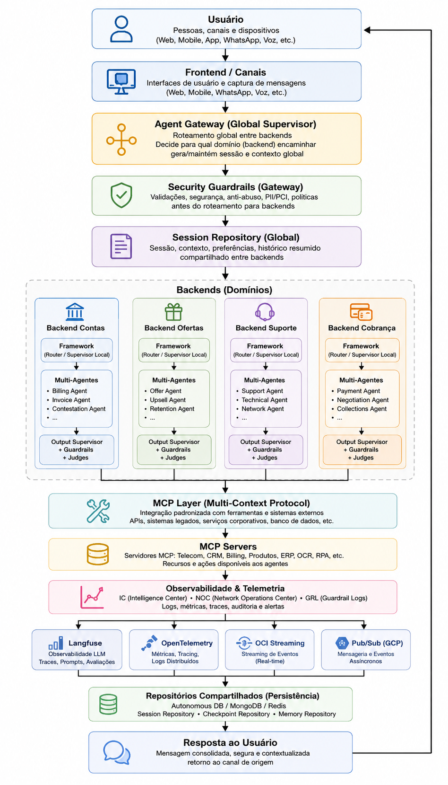
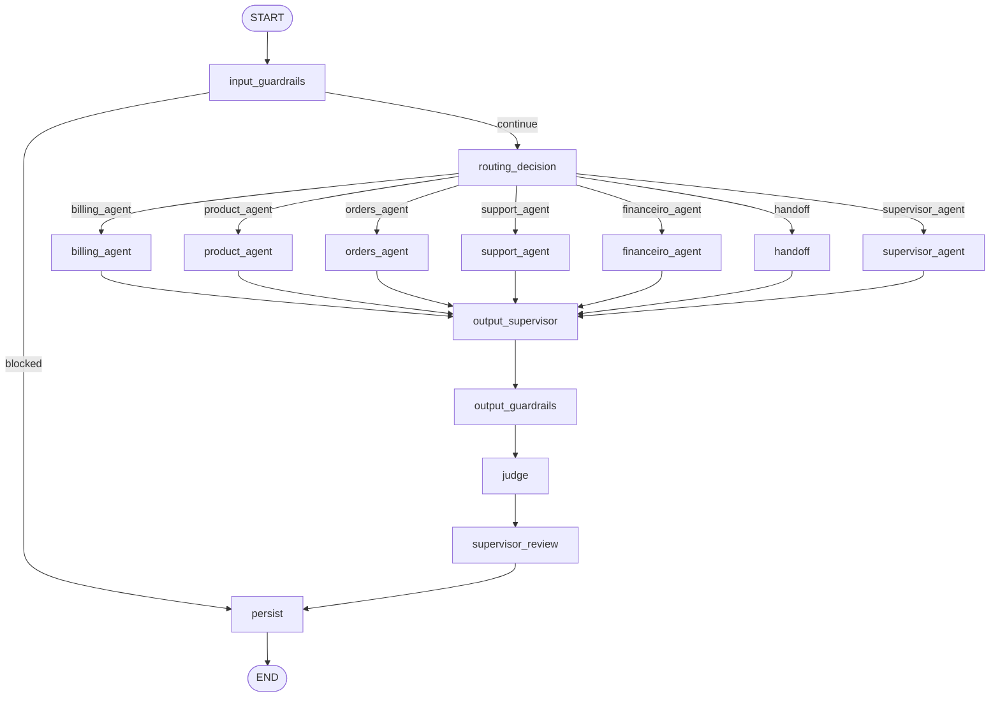
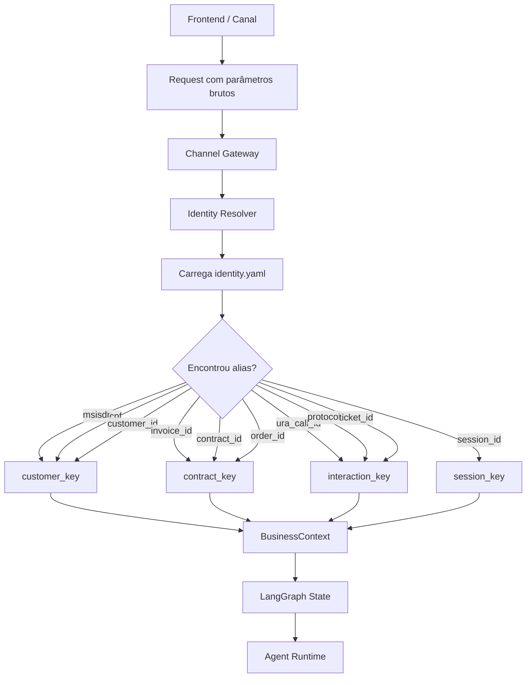
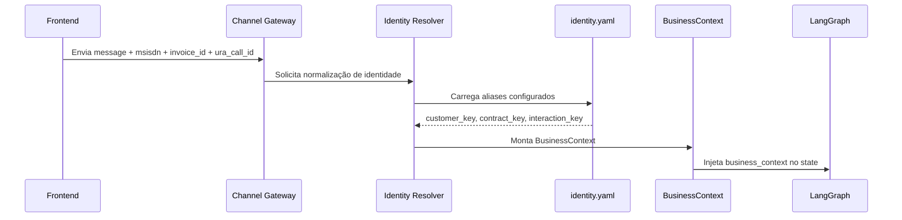
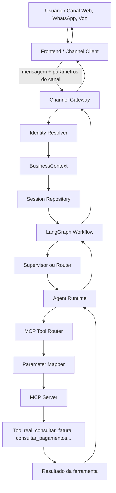
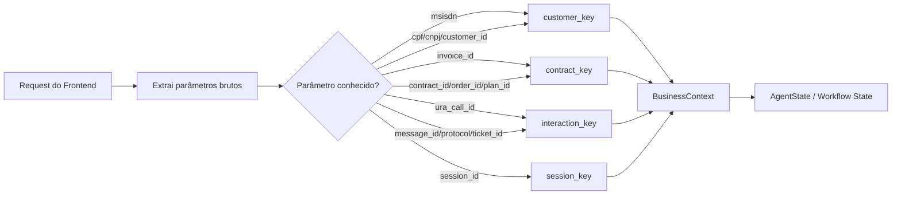
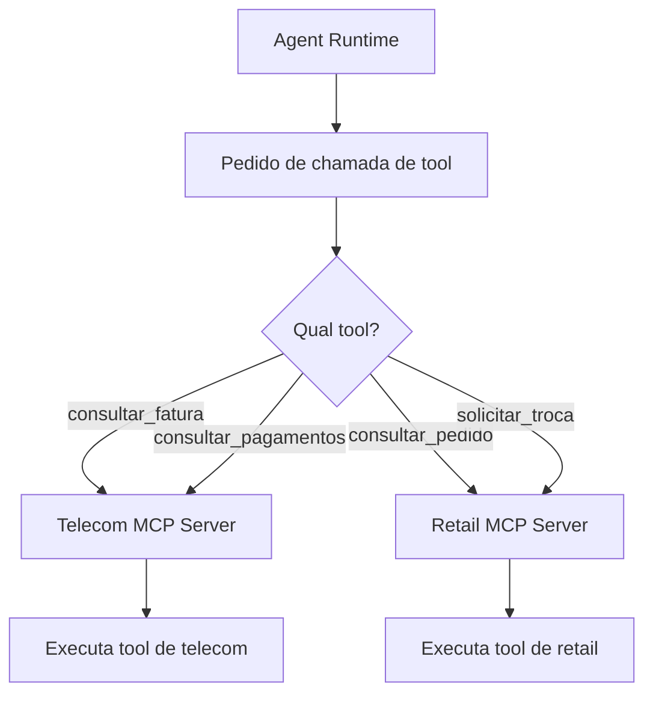
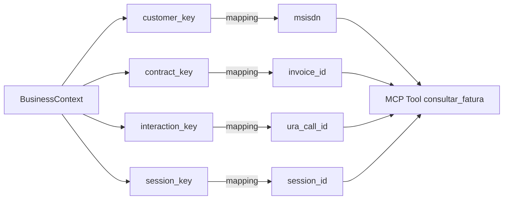
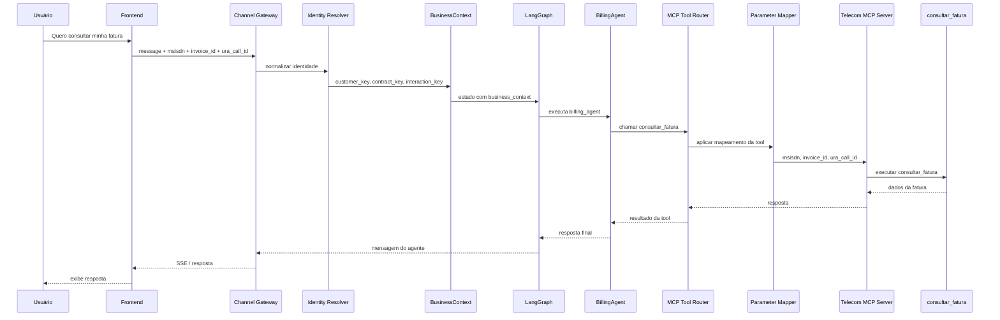

# Tutorial — Implementação de um Agente usando `agent_template_backend`

Este tutorial ensina como implementar um novo agente a partir do `agent_template_backend`, usando o framework como motor corporativo de execução.

A ideia central é simples:

```text
Framework = motor reutilizável
Agente = regra de negócio específica
MCP Server = fronteira padronizada com sistemas externos
Config YAML = comportamento alterável sem recompilar código
IC/NOC/GRL = rastreabilidade de negócio, operação e governança
```



O objetivo é que cada novo agente implemente apenas sua lógica de domínio — prompts, regras de negócio, ferramentas, schemas e nós específicos — sem recriar motores que já pertencem ao framework.

>**Note: Se deseja ir direto e testar a DEMO, vá até a Seção 17 e 18.**

---

## 1. Visão geral da arquitetura

O template separa o que é genérico do que é específico.

```text
agent_template_backend/
├── app/
│   ├── main.py                    # API FastAPI, gateway, sessão, SSE e entrada do workflow
│   ├── state.py                   # Contrato de estado compartilhado do LangGraph
│   ├── workflows/
│   │   └── agent_graph.py          # Workflow corporativo com router, guardrails, agentes, judges e persistência
│   ├── agents/
│   │   ├── runtime.py              # Recursos comuns para agentes: MCP, RAG, cache, IC, LLM
│   │   ├── billing_agent.py        # Exemplo de agente de faturas
│   │   ├── product_agent.py        # Exemplo de agente de produtos
│   │   ├── orders_agent.py         # Exemplo de agente de pedidos
│   │   └── support_agent.py        # Exemplo de agente de suporte
│   └── examples/                  # Exemplos de IC, NOC, GRL, MCP e observer
├── config/
│   ├── agents.yaml                # Registro dos agentes disponíveis
│   ├── routing.yaml               # Intents, keywords, fallback e decisão de rota
│   ├── tools.yaml                 # Catálogo das ferramentas disponíveis para o backend
│   ├── mcp_servers.yaml           # Endpoints MCP locais
│   ├── mcp_servers.docker.yaml    # Endpoints MCP em Docker Compose
│   ├── mcp_parameter_mapping.yaml # Mapeamento entre chaves canônicas e parâmetros das tools
│   ├── identity.yaml              # Resolução de identidade de negócio
│   ├── guardrails.yaml            # Guardrails globais
│   ├── judges.yaml                # Judges globais
│   ├── prompt_policy.yaml         # Política global de prompt
│   └── agents/<agent_id>/         # Configurações isoladas por agente
├── data/
│   └── agent_framework.db         # Banco local de exemplo, quando aplicável
├── Dockerfile
├── requirements.txt
└── .env                           # Configuração local
```

### 1.1. O que pertence ao framework

O framework deve concentrar os motores reutilizáveis:

- LangGraph e montagem do workflow.
- Checkpoint.
- Memória.
- Session repository.
- Channel gateway.
- Enterprise Router.
- Supervisor.
- Guardrails.
- Output Supervisor.
- Judges.
- Telemetria Langfuse/OpenTelemetry.
- Analytics IC/NOC/GRL.
- MCP Tool Router.
- Cache.
- RAG genérico.

### 1.2. O que pertence ao agente

O agente deve concentrar apenas customizações de domínio:

- Prompts específicos.
- Regras de negócio.
- Schemas próprios.
- Tools específicas.
- Clients de sistemas externos, preferencialmente encapsulados atrás de MCP.
- Mapeamento de parâmetros.
- Nós especializados, se houver.
- ICs de negócio da jornada.

Quando uma regra só faz sentido para um domínio, ela pertence ao agente. Quando uma capacidade deve ser usada por vários agentes, ela pertence ao framework.

---

## 2. Fluxo de execução do template

O fluxo principal começa em `app/main.py`, no endpoint `/gateway/message`.

```text
Canal / Frontend / API
  ↓
POST /gateway/message
  ↓
ChannelGateway.normalize()
  ↓
IdentityResolver
  ↓
SessionRepository
  ↓
MemoryRepository
  ↓
AgentWorkflow.ainvoke()
  ↓
LangGraph
  ↓
Input Guardrails
  ↓
Enterprise Router ou Supervisor
  ↓
Agente especializado
  ↓
MCP Tool Router / RAG / Cache / LLM
  ↓
Output Supervisor
  ↓
Output Guardrails
  ↓
Judges
  ↓
Supervisor Review
  ↓
Persistência / Checkpoint / Memória
  ↓
Resposta
```

O `AgentWorkflow`, em `app/workflows/agent_graph.py`, normalmente já contém nós corporativos como:

```text
input_guardrails
routing_decision
billing_agent
product_agent
orders_agent
support_agent
handoff
supervisor_agent
output_supervisor
output_guardrails
judge
supervisor_review
persist
```

Para criar um novo agente, normalmente você altera:

```text
app/agents/<novo_agente>.py
app/workflows/agent_graph.py
app/state.py, se precisar de campos novos
config/agents.yaml
config/routing.yaml
config/tools.yaml
config/mcp_servers.yaml
config/mcp_parameter_mapping.yaml
config/identity.yaml
config/agents/<agent_id>/prompt_policy.yaml
config/agents/<agent_id>/guardrails.yaml
config/agents/<agent_id>/judges.yaml
.env
```

---

## 3. Pré-requisitos

### 3.1. Requisitos locais

- Python 3.12 ou 3.13.
- `pip` ou `uv`.
- Projeto `agent_framework` disponível no mesmo workspace, caso o template use instalação local.
- Servidores MCP, se o agente usar tools.
- Redis, Oracle Autonomous Database, MongoDB e Langfuse são opcionais conforme configuração.

Estrutura recomendada:

```text
workspace/
├── agent_framework/
└── agent_template_backend/
```

### 3.2. Instalação local

Dentro do diretório `agent_template_backend`:

```bash
python -m venv .venv
source .venv/bin/activate
pip install -r requirements.txt
```

Se o `agent_framework` estiver em desenvolvimento local:

```bash
pip install -e ../agent_framework
```

Em Windows PowerShell:

```powershell
python -m venv .venv
.\.venv\Scripts\Activate.ps1
pip install -r requirements.txt
pip install -e ..\agent_framework
```

---

## 4. Configuração do `.env`

O `.env` define quais motores serão ativados. Ele não é apenas um arquivo de propriedades: ele muda o comportamento do agente em tempo de execução.

Exemplo seguro para desenvolvimento local:

```env
APP_NAME=ai-agent-template
APP_ENV=local
LOG_LEVEL=INFO
API_HOST=0.0.0.0
API_PORT=8000
CORS_ORIGINS=http://localhost:5173,http://127.0.0.1:5173

LLM_PROVIDER=mock
LLM_TEMPERATURE=0.2
LLM_MAX_TOKENS=2048
LLM_TIMEOUT_SECONDS=120

SESSION_REPOSITORY_PROVIDER=memory
MEMORY_REPOSITORY_PROVIDER=memory
CHECKPOINT_REPOSITORY_PROVIDER=memory
USAGE_REPOSITORY_PROVIDER=memory

ENABLE_REDIS_CACHE=false
REDIS_URL=redis://localhost:6379/0
CACHE_TTL_SECONDS=300

VECTOR_STORE_PROVIDER=memory
GRAPH_STORE_PROVIDER=memory
RAG_TOP_K=5
EMBEDDING_PROVIDER=mock

ENABLE_LANGFUSE=false
LANGFUSE_HOST=http://localhost:3005
ENABLE_OTEL=false
OTEL_SERVICE_NAME=ai-agent-template

ENABLE_ANALYTICS=false
ANALYTICS_PROVIDERS=noop
ENABLE_OCI_STREAMING=false
OCI_STREAM_ENDPOINT=
OCI_STREAM_OCID=
OCI_STREAM_PARTITION_KEY=agent-events

ENABLE_INPUT_GUARDRAILS=true
ENABLE_OUTPUT_GUARDRAILS=true
ENABLE_OUTPUT_SUPERVISOR=true
ENABLE_JUDGES=true
ENABLE_SUPERVISOR=true
ENABLE_PARALLEL_GUARDRAILS=true
GUARDRAILS_FAIL_FAST=true
OUTPUT_SUPERVISOR_MAX_RETRIES=3
GUARDRAILS_CONFIG_PATH=./config/guardrails.yaml
JUDGES_CONFIG_PATH=./config/judges.yaml
PROMPT_POLICY_PATH=./config/prompt_policy.yaml

ROUTING_CONFIG_PATH=./config/routing.yaml
ROUTING_MODE=router
ENABLE_LLM_ROUTER=false

ENABLE_MCP_TOOLS=true
MCP_SERVERS_CONFIG_PATH=./config/mcp_servers.yaml
TOOLS_CONFIG_PATH=./config/tools.yaml
MCP_PARAMETER_MAPPING_PATH=./config/mcp_parameter_mapping.yaml
MCP_TOOL_TIMEOUT_SECONDS=30

IDENTITY_CONFIG_PATH=./config/identity.yaml
```

### 4.1. Como raciocinar sobre o `.env`

Antes de testar um novo agente, responda:

```text
O LLM será mock ou real?
A memória será local ou banco?
O checkpoint precisa sobreviver a restart?
As tools MCP serão chamadas de verdade ou simuladas?
O roteamento será por regra/intent ou supervisor?
Guardrails, judges e supervisor devem bloquear, revisar ou só observar?
Langfuse/OTEL/Streaming serão usados neste ambiente?
```

Para um primeiro teste, use `LLM_PROVIDER=mock`, persistência em `memory` e MCP mock/local. Depois evolua para LLM real, banco, Langfuse e serviços reais.

Para usar Oracle Autonomous Database, ajuste:

```env
SESSION_REPOSITORY_PROVIDER=autonomous
MEMORY_REPOSITORY_PROVIDER=autonomous
CHECKPOINT_REPOSITORY_PROVIDER=autonomous
USAGE_REPOSITORY_PROVIDER=autonomous

ADB_USER=<usuario>
ADB_PASSWORD=<senha>
ADB_DSN=<dsn>
ADB_WALLET_LOCATION=<caminho-wallet>
ADB_WALLET_PASSWORD=<senha-wallet>
ADB_TABLE_PREFIX=AGENTFW
```

Para usar Langfuse:

```env
ENABLE_LANGFUSE=true
LANGFUSE_PUBLIC_KEY=<public-key>
LANGFUSE_SECRET_KEY=<secret-key>
LANGFUSE_HOST=http://localhost:3005
```

### 4.1.1. Configuração de Provedor LLM e Autenticação OCI

O Agent Framework OCI suporta múltiplos provedores de LLM e diferentes mecanismos de autenticação. O comportamento é controlado principalmente pelas variáveis:

- `LLM_PROVIDER`
- `OCI_AUTH_MODE`
- `OCI_GENAI_API_KEY`

### LLM_PROVIDER

**LLM_PROVIDER**=mock

Utiliza um modelo simulado para desenvolvimento e testes.

**LLM_PROVIDER**=oci_openai

Utiliza o endpoint OpenAI-Compatible do OCI Generative AI.
Utiliza `OCI_GENAI_API_KEY`.

**LLM_PROVIDER**=oci_sdk

Utiliza o SDK nativo do OCI Generative AI.
Utiliza `OCI_AUTH_MODE`.

**LLM_PROVIDER**=openai_compatible

Utiliza qualquer endpoint compatível com a API OpenAI.

### OCI_AUTH_MODE

Utilizado apenas quando:

```env
LLM_PROVIDER=oci_sdk
```

**OCI_AUTH_MODE**=config_file

Autentica utilizando `~/.oci/config`.

**OCI_AUTH_MODE**=instance_principal

Autentica utilizando OCI Instance Principals.

**OCI_AUTH_MODE**=resource_principal

Autentica utilizando OCI Resource Principals.

### OCI_GENAI_API_KEY

API Key utilizada pelo provider `oci_openai`.

### Matriz de Configuração

| LLM_PROVIDER | OCI_AUTH_MODE | OCI_GENAI_API_KEY | Método |
|-------------|-------------|-------------|-------------|
| mock | Ignorado | Não | Nenhum |
| oci_openai | Ignorado | Sim | API Key |
| oci_sdk | config_file | Não | OCI Config File |
| oci_sdk | instance_principal | Não | Instance Principal |
| oci_sdk | resource_principal | Não | Resource Principal |
| openai_compatible | Ignorado | Não | API Key do endpoint |


---

### 4.2.`llm_profiles.yaml`

### 4.2.1. Objetivo do `llm_profiles.yaml`

O arquivo `llm_profiles.yaml` serve para configurar, de forma centralizada e granular, qual modelo LLM cada parte do framework deve usar.

Sem esse arquivo, normalmente o framework usa um único modelo definido no `.env`, por exemplo:

```env
LLM_PROVIDER=oci_openai
OCI_GENAI_MODEL=openai.gpt-4.1
LLM_TEMPERATURE=0.2
LLM_MAX_TOKENS=2048
```

Isso significa que supervisor, router, agentes, RAG, memória, guardrails e judges acabam usando o mesmo modelo padrão, salvo alguma configuração específica no código.

Com o `llm_profiles.yaml`, cada ponto de inferência pode usar um modelo diferente, com parâmetros próprios.

Exemplo:

```yaml
profiles:
  default:
    provider: oci_openai
    model: openai.gpt-4.1
    temperature: 0.2
    max_tokens: 2048

  guardrail:
    provider: oci_openai
    model: openai.gpt-4.1
    temperature: 0
    max_tokens: 600

  judge:
    provider: oci_openai
    model: openai.gpt-4.1
    temperature: 0
    max_tokens: 800

  rag_generation:
    provider: oci_openai
    model: openai.gpt-4.1
    temperature: 0.1
    max_tokens: 1800
```

---

### 4.2.2. Por que esse arquivo é importante

Em um framework de agentes corporativos, nem todo componente precisa usar o mesmo modelo.

Por exemplo:

- O agente principal pode usar um modelo mais criativo.
- O supervisor pode usar temperatura `0` para roteamento mais previsível.
- Guardrails devem ser mais rígidos e determinísticos.
- Judges devem avaliar respostas com baixa variabilidade.
- RAG pode usar modelos diferentes para reescrita, compressão e geração.
- Memória pode usar um modelo barato ou mais curto para resumo.

O `llm_profiles.yaml` permite separar essas responsabilidades.

---

### 4.2.3. Regra geral de funcionamento

A regra esperada do framework é:

```text
Se llm_profiles.yaml existir:
  o framework usa os profiles definidos nele para cada componente.

Se llm_profiles.yaml não existir:
  o framework mantém o comportamento antigo e usa o .env como configuração global.
```

Ou seja, o `llm_profiles.yaml` é opcional.

Ele não substitui completamente o `.env`. Ele funciona como uma camada de override por componente.

---

### 4.2.4. Quando o arquivo NÃO existe

Se o arquivo `llm_profiles.yaml` não existir, o framework deve usar somente as configurações globais do `.env`.

Exemplo:

```env
LLM_PROVIDER=oci_openai
OCI_GENAI_MODEL=openai.gpt-4.1
LLM_TEMPERATURE=0.2
LLM_MAX_TOKENS=2048
```

Nesse cenário, todos os componentes que usam LLM tendem a usar o mesmo provider/modelo global:

```text
supervisor      -> .env
router          -> .env
guardrails LLM  -> .env
judges LLM      -> .env
rag             -> .env
memory summary  -> .env
agents          -> .env
```

Esse modo é útil para ambientes simples, provas de conceito ou quando ainda não se quer controlar modelos por componente.

---

### 4.2.5. Quando o arquivo existe

Se o arquivo `llm_profiles.yaml` existir, o framework passa a procurar um profile específico para cada ponto de inferência.

Exemplo:

```yaml
profiles:
  supervisor:
    provider: oci_openai
    model: openai.gpt-4.1
    temperature: 0
    max_tokens: 700

  judge:
    provider: oci_openai
    model: openai.gpt-4.1
    temperature: 0
    max_tokens: 800
```

Quando o supervisor chamar LLM, ele deve usar o profile `supervisor`.

Quando um judge LLM chamar LLM, ele deve usar o profile `judge`.

---

### 4.2.6. Relação entre `default` e profiles específicos

O profile `default` funciona como base.

Exemplo:

```yaml
profiles:
  default:
    provider: oci_openai
    model: openai.gpt-4.1
    temperature: 0.2
    max_tokens: 2048

  supervisor:
    temperature: 0
    max_tokens: 700
```

Nesse caso, se o resolver suportar herança, o profile `supervisor` pode herdar `provider` e `model` do `default`, alterando apenas `temperature` e `max_tokens`.

Porém, para evitar ambiguidade, a configuração mais segura é declarar `provider` e `model` explicitamente em todos os profiles:

```yaml
supervisor:
  provider: oci_openai
  model: openai.gpt-4.1
  temperature: 0
  max_tokens: 700
```

Esse é o formato recomendado.

---

### 4.2.7. Profiles principais do framework

Abaixo estão os profiles mais comuns:

| Profile | Uso |
|---|---|
| `default` | Configuração base/fallback |
| `supervisor` | Decisão de próximo agente ou fluxo |
| `router` | Roteamento por intenção ou política |
| `guardrail` | Guardrails de entrada ou segurança geral |
| `grl` | Guardrails de saída e regras de resposta |
| `judge` | Judges LLM, como qualidade e groundedness |
| `rag_rewriter` | Reescrita de pergunta para RAG |
| `rag_compressor` | Compressão de contexto recuperado |
| `rag_generation` | Geração final usando contexto RAG |
| `summary_memory` | Resumo de memória conversacional |
| `noc` | Análise operacional/NOC |
| `billing_agent` | Modelo específico do agente de contas/faturas |
| `product_agent` | Modelo específico do agente de produtos |
| `backoffice_agent` | Modelo específico do agente de backoffice |

---

### 4.2.8. Guardrails e `llm_profiles.yaml`

Os guardrails podem ser determinísticos ou baseados em LLM.

Guardrails determinísticos não precisam chamar modelo. Por isso, mesmo que o profile `guardrail` esteja com modelo errado, um rail puramente determinístico pode bloquear antes de chegar no LLM.

Exemplo:

```yaml
guardrail:
  provider: oci_openai
  model: xopenai.gpt-4.1
```

Se o texto disparar um padrão determinístico de prompt injection, o erro de modelo pode não aparecer, porque o LLM não foi chamado.

Para validar se o profile está sendo usado, é preciso testar um guardrail que realmente chame LLM.

Exemplos de profiles usados:

```text
guardrail -> PINJ, TOX, OOS, DLEX_IN, RAGSEC
grl       -> REVPREC, AOFERTA, DLEX_OUT
```

---

### 4.2.9. Judges e `llm_profiles.yaml`

O `judges.yaml` define quais judges existem e se estão habilitados.

Exemplo:

```yaml
judges:
  - name: response_quality
    enabled: true
    threshold: 0.7

  - name: groundedness
    enabled: true
    threshold: 0.6
```

Se esses judges forem calibrados como LLM, eles usarão o profile `judge` do `llm_profiles.yaml`.

Exemplo:

```yaml
judge:
  provider: oci_openai
  model: openai.gpt-4.1
  temperature: 0
  max_tokens: 800
```

O ponto importante é:

```text
judges.yaml       -> define quais judges executam e suas regras
llm_profiles.yaml -> define qual modelo o judge LLM usa
```

Se o modelo do profile `judge` estiver errado e o judge LLM for executado, o framework deve falhar conforme a política configurada no próprio `judges.yaml`, por exemplo `fail_closed`.

---

### 4.2.10. RAG e `llm_profiles.yaml`

O RAG pode usar LLM em diferentes etapas:

```text
rag_rewriter    -> reescreve a pergunta do usuário
rag_compressor  -> comprime documentos/contexto recuperado
rag_generation  -> gera a resposta final fundamentada
```

Exemplo:

```yaml
rag_rewriter:
  provider: oci_openai
  model: openai.gpt-4.1
  temperature: 0
  max_tokens: 300

rag_compressor:
  provider: oci_openai
  model: openai.gpt-4.1
  temperature: 0
  max_tokens: 1200

rag_generation:
  provider: oci_openai
  model: openai.gpt-4.1
  temperature: 0.1
  max_tokens: 1800
```

Isso permite usar modelos diferentes para tarefas diferentes do pipeline RAG.

---

### 4.2.11. Memória e `llm_profiles.yaml`

A memória de resumo, quando usa LLM, deve usar o profile `summary_memory`.

Exemplo:

```yaml
summary_memory:
  provider: oci_openai
  model: openai.gpt-4.1
  temperature: 0.1
  max_tokens: 1200
```

Esse profile é usado quando o framework precisa resumir conversas longas, compactar histórico ou manter memória conversacional sem carregar todas as mensagens anteriores.

---

### 4.2.12. Supervisor e router

O supervisor e o router são pontos críticos de controle de fluxo.

Exemplo:

```yaml
supervisor:
  provider: oci_openai
  model: openai.gpt-4.1
  temperature: 0
  max_tokens: 700

router:
  provider: oci_openai
  model: openai.gpt-4.1
  temperature: 0
  max_tokens: 500
```

Normalmente eles usam temperatura `0`, porque a decisão de rota precisa ser previsível.

---

### 4.2.13. Exemplo completo recomendado

```yaml
profiles:
  default:
    provider: oci_openai
    model: openai.gpt-4.1
    temperature: 0.2
    max_tokens: 2048

  supervisor:
    provider: oci_openai
    model: openai.gpt-4.1
    temperature: 0
    max_tokens: 700

  router:
    provider: oci_openai
    model: openai.gpt-4.1
    temperature: 0
    max_tokens: 500

  guardrail:
    provider: oci_openai
    model: openai.gpt-4.1
    temperature: 0
    max_tokens: 600

  grl:
    provider: oci_openai
    model: openai.gpt-4.1
    temperature: 0
    max_tokens: 700

  judge:
    provider: oci_openai
    model: openai.gpt-4.1
    temperature: 0
    max_tokens: 800

  rag_rewriter:
    provider: oci_openai
    model: openai.gpt-4.1
    temperature: 0
    max_tokens: 300

  rag_compressor:
    provider: oci_openai
    model: openai.gpt-4.1
    temperature: 0
    max_tokens: 1200

  rag_generation:
    provider: oci_openai
    model: openai.gpt-4.1
    temperature: 0.1
    max_tokens: 1800

  summary_memory:
    provider: oci_openai
    model: openai.gpt-4.1
    temperature: 0.1
    max_tokens: 1200

  noc:
    provider: oci_openai
    model: openai.gpt-4.1
    temperature: 0
    max_tokens: 700

  billing_agent:
    provider: oci_openai
    model: openai.gpt-4.1
    temperature: 0.2

  product_agent:
    provider: oci_openai
    model: openai.gpt-4.1
    temperature: 0.2

  backoffice_agent:
    provider: oci_openai
    model: openai.gpt-4.1
    temperature: 0.2
```

---

### 4.2.14. Como testar se o profile está sendo respeitado

Uma forma simples de testar é colocar propositalmente um modelo inexistente em um profile específico.

Exemplo:

```yaml
judge:
  provider: oci_openai
  model: xopenai.gpt-4.1
  temperature: 0
  max_tokens: 800
```

Depois, execute um fluxo que realmente chame um judge LLM.

Se o framework estiver respeitando o profile, a chamada deve falhar, porque o modelo não existe.

O mesmo teste pode ser feito com:

```text
guardrail
 grl
 rag_rewriter
 rag_compressor
 rag_generation
 summary_memory
 supervisor
 router
 billing_agent
```

Mas é preciso garantir que o componente seja realmente executado no fluxo.

---

### 4.2.15. Atenção sobre fallback silencioso

Um ponto importante em arquiteturas de agentes é evitar fallback silencioso quando um profile explícito foi configurado.

Se o usuário configurou:

```yaml
judge:
  provider: oci_openai
  model: xopenai.gpt-4.1
```

então o framework não deve ignorar o erro e cair automaticamente para outro modelo, a menos que isso esteja explicitamente configurado.

A regra recomendada é:

```text
profile explícito + provider real + modelo inválido = erro visível
```

Isso evita situações em que o time acredita estar testando um modelo, mas o framework está usando outro silenciosamente.

---

### 4.2.16. Resumo final

O `llm_profiles.yaml` é a camada de configuração por componente do framework.

Ele permite:

- Separar modelos por função.
- Usar temperaturas diferentes por componente.
- Testar modelos específicos em pontos específicos.
- Evitar que tudo dependa de um único modelo global no `.env`.
- Tornar o comportamento de guardrails, judges, RAG, memória, supervisor e agentes mais controlável.

Regra principal:

```text
Sem llm_profiles.yaml:
  .env governa tudo.

Com llm_profiles.yaml:
  cada componente usa seu profile.
  o .env fica como fallback para chaves ausentes ou para o modo legado.
```

---

## 5. Criando um novo agente

Neste exemplo, vamos criar um agente chamado `financeiro_agent` para atendimento financeiro genérico.

### 5.1. Antes do código: o que é um agente neste framework?

Um agente é uma classe de domínio que recebe o `state` do LangGraph, interpreta a intenção escolhida pelo roteador ou supervisor, coleta evidências, chama tools/RAG/LLM quando necessário e retorna uma decisão para o workflow continuar.

Ele não deve decidir sozinho tudo que o framework já decide. Por exemplo:

```text
O agente não cria sessão.
O agente não abre SSE.
O agente não compila LangGraph.
O agente não cria checkpoint.
O agente não executa guardrails globais.
O agente não chama sistema externo diretamente quando existe MCP Tool Router.
```

O agente deve responder perguntas como:

```text
Qual problema de negócio estou resolvendo?
Quais dados preciso para responder com segurança?
Quais tools podem fornecer esses dados?
Quais regras de domínio impedem ou autorizam uma ação?
Qual resposta deve ser devolvida ao usuário?
Quais eventos IC preciso emitir para auditoria da jornada?
```

---

#### 5.1.1. Channel Gateway — Interno e Externo no Agent Framework

Este capítulo explica o papel do **Channel Gateway** dentro da arquitetura do Agent Framework e por que ele pode ser executado de duas formas:

```text
1. Channel Gateway interno
   Embutido no próprio backend do framework.

2. Channel Gateway externo
   Executado como serviço separado, mantido por uma equipe de canais ou integração.
```

A principal função do Channel Gateway é proteger o Agent Framework contra formatos variados, instáveis ou desconhecidos de canais externos.

Regra central:

```text
O agente não deve conhecer payload bruto de canal.

O agente deve receber apenas mensagens normalizadas pelo framework.
```

---

### 5.1.1.1. Problema que o Channel Gateway resolve

Em ambientes reais, cada canal envia mensagens em formatos diferentes.

Exemplos:

```text
Web
WhatsApp
Teams
Email
Voice
URA
Genesys
Twilio
Zendesk
CRM
Aplicativo mobile
Canal proprietário do cliente
```

Cada canal pode ter um payload completamente diferente.

Um canal de WhatsApp pode enviar algo como:

```json
{
  "wa_id": "5511999999999",
  "messages": [
    {
      "type": "interactive",
      "interactive": {
        "button_reply": {
          "id": "segunda_via_fatura",
          "title": "Segunda via de fatura"
        }
      }
    }
  ]
}
```

Um canal de voz pode enviar:

```json
{
  "event": "voice.transcript.completed",
  "caller": "+5511999999999",
  "transcript": "quero consultar minha fatura",
  "confidence": 0.94
}
```

Um frontend web pode enviar:

```json
{
  "message": "Quero consultar minha fatura",
  "session_id": "abc123",
  "customer_key": "11999999999"
}
```

Se o framework aceitasse todos esses formatos diretamente, o core ficaria contaminado com regras específicas de canal.

O resultado seria ruim:

```text
agentes conhecendo WhatsApp
agentes conhecendo URA
agentes conhecendo Teams
workflow tratando payloads externos
guardrails recebendo objetos inesperados
MCP recebendo parâmetros inconsistentes
manutenção de canais caindo no time do framework
```

O Channel Gateway existe para impedir isso.

---

### 5.1.1.2. Responsabilidade do Channel Gateway

O Channel Gateway é a camada responsável por transformar mensagens externas em um formato aceito pelo Agent Framework.

Ele faz a ponte entre:

```text
Mundo externo
  payloads específicos de canais

e

Agent Framework
  contrato padronizado de entrada
```

Responsabilidades típicas:

```text
receber payload externo
validar estrutura mínima
validar autenticação ou assinatura do canal
extrair texto do usuário
extrair identificadores técnicos
extrair identificadores de negócio
normalizar sessão
normalizar metadados
mapear dados para business_context
montar GatewayRequest
chamar o backend do Agent Framework
traduzir a resposta do framework de volta para o canal
```

O Channel Gateway não deve executar raciocínio de agente.

Ele não deve:

```text
decidir resposta final do usuário
executar LangGraph
executar guardrails de domínio
chamar MCP diretamente
fazer RAG
chamar LLM como agente
persistir memória conversacional do framework
implementar regra de negócio do agente
```

---

### 5.1.1.3. Responsabilidade do Agent Framework

O Agent Framework começa a trabalhar depois que a mensagem já foi colocada no contrato aceito pelo backend.

Responsabilidades do framework:

```text
validar o contrato de entrada
normalizar contexto
resolver identidade de negócio
criar ou recuperar sessão
executar guardrails de entrada
rotear intenção
executar LangGraph
acionar agente especializado
chamar MCP Tool Router
executar RAG
chamar LLM
executar guardrails de saída
executar judges
persistir memória e checkpoint
emitir telemetria
retornar resposta padronizada
```

O framework deve ser protegido contra payloads brutos de canal.

---

### 5.1.1.4. Contrato operacional atual: GatewayRequest

Na versão atual do backend, o endpoint `/gateway/message` espera um envelope chamado aqui de `GatewayRequest`.

Formato:

```json
{
  "channel": "web",
  "tenant_id": "default",
  "agent_id": "telecom_contas",
  "payload": {
    "message": "Quero consultar minha fatura",
    "session_id": "curl-contract-test-001",
    "user_id": "user-curl-001",
    "message_id": "msg-curl-contract-001",
    "customer_key": "11999999999",
    "contract_key": "3000131180",
    "interaction_key": "301953872",
    "session_key": "curl-contract-test-001",
    "business_context": {
      "customer_key": "11999999999",
      "contract_key": "3000131180",
      "interaction_key": "301953872",
      "session_key": "curl-contract-test-001"
    },
    "metadata": {
      "source": "curl",
      "request_id": "req-curl-contract-001"
    }
  }
}
```

Schema conceitual:

```python
from typing import Any
from pydantic import BaseModel


class GatewayRequest(BaseModel):
    channel: str = "web"
    payload: dict[str, Any]
    agent_id: str | None = None
    tenant_id: str | None = None
```

O Channel Gateway, interno ou externo, deve produzir esse formato antes de entregar a mensagem ao workflow.

---

### 5.1.1.5. Channel Gateway interno

### 5.1.1.5.1. Definição

O **Channel Gateway interno** é a implementação embutida dentro do backend do Agent Framework.

Neste modo, o próprio backend recebe a requisição e executa a normalização.

Fluxo:

```text
Frontend / Canal simples
  ↓
POST /gateway/message
  ↓
Agent Framework Backend
  ↓
ChannelGateway.normalize()
  ↓
IdentityResolver
  ↓
SessionRepository
  ↓
LangGraph Workflow
  ↓
Resposta
```

Representação:

```text
┌──────────────────────────────────────────────────────┐
│ Agent Framework Backend                              │
│                                                      │
│  ┌──────────────────────┐                            │
│  │ Channel Gateway      │                            │
│  │ interno              │                            │
│  └──────────┬───────────┘                            │
│             ↓                                        │
│  ┌──────────────────────┐                            │
│  │ Identity Resolver    │                            │
│  └──────────┬───────────┘                            │
│             ↓                                        │
│  ┌──────────────────────┐                            │
│  │ LangGraph Workflow   │                            │
│  └──────────────────────┘                            │
└──────────────────────────────────────────────────────┘
```

---

### 5.1.1.5.2. Quando usar Channel Gateway interno

Use o modo interno quando:

```text
o ambiente é local
o objetivo é demonstração
o canal é simples
o payload é controlado
o time do framework também controla o frontend
o projeto é um MVP
o cliente ainda não definiu time de canais
```

Exemplos:

```text
agent_frontend local
curl
Postman
testes automatizados
demonstração para cliente
laboratório de desenvolvimento
```

---

### 5.1.1.5.3. Vantagens do modo interno

```text
mais simples para começar
menos serviços para subir
menos infraestrutura
mais fácil de testar localmente
bom para demos e tutoriais
reduz atrito para novos desenvolvedores
```

---

### 5.1.1.5.4. Limitações do modo interno

O modo interno não é ideal quando existem muitos canais ou canais proprietários.

Riscos:

```text
framework começa a acumular parsers de canal
time do framework vira responsável por payload de WhatsApp, Teams, URA etc.
mudanças externas quebram o backend
regras de autenticação de canais entram no core
deploy do framework passa a depender de mudanças de canal
responsabilidade arquitetural fica misturada
```

O problema principal é a manutenção.

Se cada novo canal exigir alteração no backend do framework, o framework deixa de ser um motor genérico e vira uma coleção de integrações específicas.

---

### 5.1.1.6. Channel Gateway externo

### 5.1.1.6.1. Definição

O **Channel Gateway externo** é um serviço independente, fora do backend do Agent Framework.

Ele é responsável por receber payloads específicos de canais e convertê-los para o contrato operacional aceito pelo framework.

Fluxo:

```text
Canal externo
  ↓
External Channel Gateway
  ↓
GatewayRequest
  ↓
Agent Framework Backend
  ↓
LangGraph Workflow
  ↓
ChannelResponse atual
  ↓
External Channel Gateway
  ↓
Resposta no canal original
```

Representação:

```text
┌─────────────────────────────┐
│ Canal externo               │
│ WhatsApp / Voice / Teams    │
└──────────────┬──────────────┘
               ↓
┌─────────────────────────────┐
│ External Channel Gateway    │
│ Adapter do canal            │
│ Auth                        │
│ Parser                      │
│ Normalização                │
└──────────────┬──────────────┘
               ↓ GatewayRequest
┌─────────────────────────────┐
│ Agent Framework Backend     │
│ /gateway/message            │
│ LangGraph / Agents / MCP    │
└──────────────┬──────────────┘
               ↓ ChannelResponse
┌─────────────────────────────┐
│ External Channel Gateway    │
│ Tradução da resposta        │
└──────────────┬──────────────┘
               ↓
┌─────────────────────────────┐
│ Canal externo               │
└─────────────────────────────┘
```

---

### 5.1.1.6.2. Quando usar Channel Gateway externo

Use o modo externo quando:

```text
o ambiente é enterprise
existem múltiplos canais
existe uma equipe de canais
o cliente possui canais proprietários
o payload do canal não é conhecido pelo time do framework
há autenticação específica por canal
há requisitos de segurança ou compliance
há rate limit, retry e idempotência próprios do canal
a equipe do framework não deve manter adapters específicos
```

Exemplos:

```text
WhatsApp oficial
URA corporativa
Genesys
Twilio
Microsoft Teams
Zendesk
Salesforce
aplicativo mobile do cliente
portal legado
canal proprietário de atendimento
```

---

### 5.1.1.6.3. Vantagens do modo externo

```text
separa responsabilidades
delega manutenção de canais
protege o framework
evita acoplamento com APIs externas
permite times diferentes evoluírem em ritmos diferentes
facilita governança enterprise
permite deploy separado
permite autenticação específica por canal
permite observabilidade própria por canal
```

A ideia principal é:

```text
Time de canais cuida do canal.
Time do framework cuida do motor de agentes.
```

---

### 5.1.1.6.4. Responsabilidade da equipe dona do Channel Gateway externo

A equipe dona do gateway externo deve implementar:

```text
endpoint público do canal
validação de assinatura/autenticação
controle de rate limit
deduplicação de eventos do canal
tratamento de retry
parser do payload bruto
extração de texto
extração de anexos
extração de IDs técnicos
mapeamento para customer_key, contract_key etc.
montagem do GatewayRequest
chamada ao Agent Framework
tratamento da resposta
tradução da resposta para o canal original
logs e métricas do canal
```

---

### 5.1.1.6.5. Responsabilidade da equipe do Agent Framework

A equipe do framework deve fornecer:

```text
contrato GatewayRequest
contrato de resposta
documentação dos campos aceitos
exemplos de curl
schemas Pydantic
erros padronizados
endpoint estável
versionamento do contrato
regras de autenticação entre gateway externo e framework
observabilidade do workflow
```

A equipe do framework não deve assumir a manutenção do payload bruto do canal.

---

### 5.1.1.7. Comparativo entre Channel Gateway interno e externo

| Critério | Interno | Externo |
|---|---|---|
| Onde roda | Dentro do backend do framework | Serviço separado |
| Melhor uso | Demo, lab, MVP | Produção enterprise |
| Dono típico | Time do framework | Time de canais/integração |
| Payload bruto entra no framework? | Pode entrar em cenários simples | Não deve entrar |
| Escalabilidade organizacional | Baixa/Média | Alta |
| Acoplamento com canal | Maior | Menor |
| Deploy | Junto com framework | Independente |
| Segurança por canal | Limitada ao backend | Especializada por canal |
| Manutenção de parsers | Framework | Equipe do canal |
| Recomendação para produção | Apenas casos simples | Recomendado |

---

### 5.1.1.8. Fluxo detalhado com Channel Gateway interno

```text
1. Frontend envia POST /gateway/message.
2. Backend recebe GatewayRequest.
3. ChannelGateway.normalize() extrai:
   - message
   - session_id
   - user_id
   - message_id
   - business_context
   - metadata
4. IdentityResolver complementa chaves de negócio.
5. SessionRepository resolve conversation_key.
6. LangGraph inicia workflow.
7. Guardrails de entrada executam.
8. Router decide intent e route.
9. Agente especializado executa.
10. MCP Tool Router chama ferramentas, se necessário.
11. RAG consulta documentos, se necessário.
12. LLM gera resposta, se necessário.
13. Guardrails de saída executam.
14. Judges avaliam resposta.
15. Framework retorna channel, session_id, text e metadata.
```

---

### 5.1.1.9. Fluxo detalhado com Channel Gateway externo

```text
1. Canal externo envia evento para o gateway externo.
2. Gateway externo valida autenticação/assinatura.
3. Gateway externo deduplica mensagem usando ID do canal.
4. Gateway externo interpreta o payload bruto.
5. Gateway externo extrai texto, evento ou transcrição.
6. Gateway externo extrai IDs técnicos do canal.
7. Gateway externo mapeia dados para business_context.
8. Gateway externo monta GatewayRequest.
9. Gateway externo chama POST /gateway/message no Agent Framework.
10. Framework executa workflow normalmente.
11. Framework retorna ChannelResponse atual.
12. Gateway externo transforma text/metadata em resposta do canal.
13. Gateway externo envia resposta ao usuário no canal original.
```

---

### 5.1.1.10. Exemplo: payload bruto de WhatsApp para GatewayRequest

#### 5.1.1.10.1. Payload bruto hipotético

```json
{
  "wa_id": "5511999999999",
  "messages": [
    {
      "id": "wamid.123",
      "type": "interactive",
      "interactive": {
        "button_reply": {
          "id": "segunda_via_fatura",
          "title": "Segunda via de fatura"
        }
      }
    }
  ]
}
```

#### 5.1.1.10.2. GatewayRequest enviado ao framework

```json
{
  "channel": "whatsapp",
  "tenant_id": "default",
  "agent_id": "telecom_contas",
  "payload": {
    "message": "Segunda via de fatura",
    "session_id": "5511999999999",
    "user_id": "5511999999999",
    "message_id": "wamid.123",
    "customer_key": "5511999999999",
    "interaction_key": "wamid.123",
    "session_key": "5511999999999",
    "business_context": {
      "customer_key": "5511999999999",
      "interaction_key": "wamid.123",
      "session_key": "5511999999999",
      "metadata": {
        "source_channel": "whatsapp",
        "source_message_type": "interactive"
      }
    },
    "metadata": {
      "external_gateway": "customer-channel-gateway",
      "original_channel": "whatsapp",
      "original_message_id": "wamid.123",
      "interactive_type": "button_reply",
      "raw_reference": "segunda_via_fatura"
    }
  }
}
```

---

### 5.1.1.11. Exemplo: payload bruto de voz para GatewayRequest

#### 5.1.1.11.1. Payload bruto hipotético

```json
{
  "event": "voice.transcript.completed",
  "call_id": "call-9988",
  "caller": "+5511999999999",
  "transcript": "minha fatura veio muito alta esse mês",
  "confidence": 0.94,
  "language": "pt-BR"
}
```

#### 5.1.1.11.2. GatewayRequest enviado ao framework

```json
{
  "channel": "voice",
  "tenant_id": "default",
  "agent_id": "telecom_contas",
  "payload": {
    "message": "minha fatura veio muito alta esse mês",
    "session_id": "call-9988",
    "user_id": "+5511999999999",
    "message_id": "call-9988-turn-1",
    "customer_key": "5511999999999",
    "interaction_key": "call-9988",
    "session_key": "call-9988",
    "business_context": {
      "customer_key": "5511999999999",
      "interaction_key": "call-9988",
      "session_key": "call-9988",
      "metadata": {
        "source_channel": "voice",
        "transcription_provider": "speech-service",
        "confidence": 0.94,
        "language": "pt-BR"
      }
    },
    "metadata": {
      "external_gateway": "voice-channel-gateway",
      "call_id": "call-9988",
      "event": "voice.transcript.completed"
    }
  }
}
```

---

### 5.1.1.12. Exemplo de curl para validar o contrato

```bash
curl -s -X POST "http://localhost:8000/gateway/message" \
  -H "Content-Type: application/json" \
  -d '{
    "channel": "web",
    "tenant_id": "default",
    "agent_id": "telecom_contas",
    "payload": {
      "message": "Quero consultar minha fatura",
      "session_id": "curl-contract-test-001",
      "user_id": "user-curl-001",
      "message_id": "msg-curl-contract-001",
      "customer_key": "11999999999",
      "contract_key": "3000131180",
      "interaction_key": "301953872",
      "session_key": "curl-contract-test-001",
      "business_context": {
        "customer_key": "11999999999",
        "contract_key": "3000131180",
        "interaction_key": "301953872",
        "session_key": "curl-contract-test-001",
        "metadata": {
          "source_channel": "web",
          "frontend": "curl",
          "version": "legacy-envelope-with-business-context"
        }
      },
      "metadata": {
        "source": "curl",
        "request_id": "req-curl-contract-001"
      }
    }
  }' | jq
```

---

### 5.1.1.13. Resposta esperada do framework

A resposta atual do framework retorna:

```json
{
  "channel": "web",
  "session_id": "default:telecom_contas:curl-contract-test-001",
  "text": "[BillingAgent] Aqui estão as informações da sua fatura mais recente...",
  "metadata": {
    "tenant_id": "default",
    "agent_id": "telecom_contas",
    "original_session_id": "curl-contract-test-001",
    "conversation_key": "default:telecom_contas:curl-contract-test-001",
    "message_id": "msg-curl-contract-001",
    "route": "billing_agent",
    "intent": "billing_invoice_explanation",
    "mcp_tools": [
      "consultar_fatura",
      "consultar_pagamentos"
    ],
    "mcp_results": [],
    "business_context": {},
    "guardrails": [],
    "judges": []
  }
}
```

Campos principais:

```text
channel
  Canal de origem.

session_id
  Sessão final resolvida pelo framework.

text
  Resposta final do agente.

metadata
  Dados técnicos, roteamento, contexto de negócio, MCP, guardrails, judges e rastreabilidade.
```

---

### 5.1.1.14. Como o Channel Gateway externo deve tratar a resposta

O framework retorna uma resposta orientada ao backend.

O Channel Gateway externo deve traduzi-la para o formato esperado pelo canal.

Exemplo:

```text
Framework:
  text = "Encontrei sua fatura..."

WhatsApp:
  enviar mensagem de texto via API do WhatsApp

Voice:
  enviar texto para TTS

Teams:
  montar card ou mensagem Teams

Email:
  montar corpo de email

CRM:
  registrar resposta no atendimento
```

O gateway externo pode usar `metadata` para decidir comportamento adicional, por exemplo:

```text
requires_user_input
missing_fields
intent
route
handoff
mcp_results
guardrails
```

Mas a resposta principal ao usuário fica em:

```text
text
```

---

### 5.1.1.15. Segurança e validação

O Channel Gateway deve aplicar validações antes de chamar o framework.

Validações recomendadas:

```text
autenticação do canal
assinatura do webhook
origem permitida
rate limit
tamanho máximo da mensagem
tipo de evento permitido
deduplicação por message_id
normalização de texto
remoção de HTML/script
minimização de dados sensíveis
controle de anexos
```

O Agent Framework também deve validar o contrato recebido.

Validações recomendadas no framework:

```text
channel presente
payload presente
payload.message presente
tenant_id válido
agent_id válido ou roteável
session_id válido
business_context coerente
message_id rastreável
metadata dentro de tamanho aceitável
```

---

### 5.1.1.16. Idempotência

Canais externos podem reenviar eventos.

Por isso, sempre que possível, o Channel Gateway deve preencher:

```text
payload.message_id
```

Chave recomendada de idempotência:

```text
tenant_id:channel:user_id:message_id
```

Exemplo:

```text
default:whatsapp:5511999999999:wamid.123
```

Comportamentos possíveis:

```text
primeira vez:
  processa a mensagem

reenvio duplicado:
  ignora
  retorna resposta anterior
  retorna conflito controlado
```

A política pode ficar no Channel Gateway externo, no Agent Framework ou nos dois.

---

### 5.1.1.17. Relação com IdentityResolver

O Channel Gateway envia dados canônicos no `payload` e em `business_context`.

O `IdentityResolver` do framework pode complementar ou padronizar essas chaves.

Exemplo:

```text
payload.customer_key
payload.contract_key
payload.interaction_key
payload.session_key
```

Pode virar:

```text
metadata.business_context.customer_key
metadata.business_context.contract_key
metadata.business_context.interaction_key
metadata.business_context.session_key
```

Regra recomendada:

```text
O Channel Gateway deve normalizar o que conhece.
O IdentityResolver complementa o que faltar.
```

---

### 5.1.1.18. Relação com MCP Parameter Mapping

O Channel Gateway não deve conhecer o nome exato de cada parâmetro das tools MCP.

Ele deve enviar chaves canônicas.

Exemplo:

```text
customer_key
contract_key
interaction_key
session_key
```

O framework, via `mcp_parameter_mapping.yaml`, traduz para os parâmetros esperados pelas tools.

Exemplo:

```yaml
tools:
  consultar_fatura:
    map:
      customer_key: msisdn
      contract_key: invoice_id
      interaction_key: ura_call_id
      session_key: session_id
```

Fluxo:

```text
GatewayRequest.payload.business_context.customer_key
  ↓
AgentRuntime / MCP Tool Router
  ↓
mcp_parameter_mapping.yaml
  ↓
consultar_fatura.msisdn
```

Assim, o Channel Gateway não fica acoplado ao MCP Server.

---

### 5.1.1.19. Anti-patterns

Evite estes padrões:

```text
Agente lendo payload bruto de WhatsApp.
Workflow com if channel == "whatsapp".
Guardrail dependendo de campos nativos de Teams.
MCP Server recebendo payload inteiro do canal.
Frontend enviando campos arbitrários fora de payload.
Gateway externo chamando agente diretamente, pulando /gateway/message.
Channel Gateway externo executando regra de negócio de agente.
Framework sendo alterado a cada novo canal.
Dados sensíveis ou tokens do canal enviados em metadata.
```

O desenho correto é:

```text
Canal específico
  ↓
Adapter específico
  ↓
GatewayRequest
  ↓
Agent Framework
```

---

### 5.1.1.20. Versionamento do contrato

Para ambientes enterprise, recomenda-se versionar o contrato.

Exemplo:

```json
{
  "channel": "web",
  "tenant_id": "default",
  "agent_id": "telecom_contas",
  "payload": {
    "message": "Quero consultar minha fatura",
    "metadata": {
      "contract_version": "gateway-request-v1"
    }
  }
}
```

Ou no cabeçalho HTTP:

```http
X-Agent-Framework-Contract: gateway-request-v1
```

Regras recomendadas:

```text
mudanças compatíveis mantêm a mesma versão
campos novos devem ser opcionais
remoção de campos exige nova versão
mudança semântica exige nova versão
gateway externo deve declarar a versão usada
framework deve rejeitar versões incompatíveis
```

---

### 5.1.1.21. Observabilidade

O Channel Gateway e o Agent Framework devem emitir rastreabilidade em níveis diferentes.

#### 5.1.1.21.1. Observabilidade do Channel Gateway

```text
evento recebido do canal
validação de assinatura
deduplicação
payload parseado
GatewayRequest montado
chamada ao framework
resposta recebida
resposta enviada ao canal
erro de canal
erro de autenticação
erro de retry
```

#### 5.1.1.21.2. Observabilidade do Agent Framework

```text
GatewayRequest recebido
ChannelGateway.normalize()
IdentityResolver
SessionRepository
Guardrails
Routing
Agent execution
MCP tools
RAG
LLM
Output guardrails
Judges
Persistence
Final response
```

A correlação deve usar:

```text
request_id
message_id
session_id
conversation_key
trace_id
```

#### 5.1.1.21.3. Instrumentação automática do cliente OpenAI pelo Langfuse


```python
ENABLE_LANGFUSE_OPENAI_AUTO_INSTRUMENTATION=true
```

habilita a instrumentação automática do cliente OpenAI pelo Langfuse.

Quando habilitada, todas as chamadas realizadas através do cliente OpenAI instrumentado passam a gerar automaticamente spans e generations detalhadas no Langfuse.

Benefícios

Com a instrumentação automática ativada, o Langfuse passa a registrar informações como:

* OpenAI-generation
* Prompt enviado ao modelo
* Resposta retornada pelo modelo
* Modelo utilizado
* Quantidade de tokens
* Custos estimados
* Latência da chamada
* Erros de execução

Essas informações ficam associadas ao trace principal da conversa, facilitando análise, troubleshooting e auditoria.

Comportamento quando desabilitado

Quando:

```python
ENABLE_LANGFUSE_OPENAI_AUTO_INSTRUMENTATION=false
```

ou a variável não está definida:

* As chamadas LLM continuam funcionando normalmente.
* Os spans customizados do framework continuam sendo emitidos.
* O Langfuse deixa de criar automaticamente as entradas OpenAI-generation.
* Menos detalhes ficam disponíveis para análise das chamadas ao modelo.

Quando utilizar

Recomenda-se habilitar em:

* Ambientes de desenvolvimento.
* Ambientes de homologação.
* Ambientes de produção que necessitem observabilidade detalhada das chamadas LLM.
* Cenários de troubleshooting, tuning de prompts e análise de custos.

Observação

Esta configuração afeta apenas a telemetria automática do Langfuse.

Ela não altera:

* O comportamento dos agentes.
* O roteamento do Supervisor.
* Guardrails.
* Judges.
* MCP Tool Router.
* Fluxos LangGraph.

Seu único objetivo é enriquecer a observabilidade das chamadas realizadas ao modelo de linguagem.
---

### 5.1.1.22. Recomendações de arquitetura

#### 5.1.1.22.1. Para demos e desenvolvimento

Use Channel Gateway interno.

Motivos:

```text
menor complexidade
menos serviços
teste rápido
melhor para tutorial
facilita uso com curl e frontend local
```

#### 5.1.1.22.2. Para produção enterprise

Use Channel Gateway externo.

Motivos:

```text
separação de responsabilidade
controle por equipe de canais
segurança específica por canal
deploy independente
menor acoplamento
melhor governança
```

#### 5.1.1.22.3. Regra de decisão

```text
Se o canal é simples e controlado pelo time do framework:
  Channel Gateway interno pode ser suficiente.

Se o canal é externo, proprietário, regulado ou mantido por outra equipe:
  Channel Gateway externo é recomendado.
```

---

### 5.1.1.23. Checklist para criar um Channel Gateway externo

```text
[ ] Definir quais canais serão atendidos.
[ ] Documentar payload bruto de cada canal.
[ ] Implementar validação de autenticação/assinatura.
[ ] Implementar deduplicação por message_id.
[ ] Extrair texto principal do usuário.
[ ] Extrair anexos, se aplicável.
[ ] Extrair session_id estável.
[ ] Extrair user_id do canal.
[ ] Mapear identificadores de negócio.
[ ] Montar business_context canônico.
[ ] Montar GatewayRequest.
[ ] Chamar POST /gateway/message.
[ ] Interpretar text da resposta.
[ ] Traduzir resposta para o canal original.
[ ] Tratar erro 400/401/403/422/429/500/503.
[ ] Emitir logs e métricas.
[ ] Versionar contrato usado.
[ ] Criar testes com payloads reais do canal.
```

---

### 5.1.1.24. Checklist para aceitar um novo canal no framework

```text
[ ] O canal envia GatewayRequest válido?
[ ] O campo channel está padronizado?
[ ] O campo payload.message está preenchido?
[ ] O session_id é estável?
[ ] O message_id é rastreável?
[ ] O business_context usa chaves canônicas?
[ ] Campos específicos do canal estão em payload.metadata?
[ ] Nenhum payload bruto gigante está sendo enviado?
[ ] Nenhum token ou segredo do canal entra no framework?
[ ] A resposta text é suficiente para o canal responder ao usuário?
[ ] O metadata é suficiente para debug e observabilidade?
[ ] O erro 422 é tratado pelo gateway externo?
```

---

### 5.1.1.25. Decisão arquitetural recomendada

A decisão recomendada é:

```text
Channel Gateway deve ser uma capability do framework,
mas não deve ser obrigatório como componente interno.
```

O framework deve suportar dois modos:

```text
Embedded Mode
  Channel Gateway interno para demos, labs, MVPs e ambientes simples.

External Mode
  Channel Gateway externo para produção enterprise e responsabilidade delegada.
```

O contrato operacional atual entre Channel Gateway e Agent Framework é:

```text
GatewayRequest
```

E a resposta atual é:

```text
channel
session_id
text
metadata
```

---

### 5.1.1.26. Resumo final

O Channel Gateway existe para proteger o Agent Framework.

Sem essa camada:

```text
o agente precisa entender payloads externos
o workflow acumula lógica de canais
o framework vira uma coleção de adapters
a manutenção de canais fica com o time errado
cada novo canal ameaça quebrar o core
```

Com essa camada:

```text
cada canal é traduzido antes de entrar no framework
o backend recebe GatewayRequest
o agente trabalha com contexto normalizado
o MCP recebe parâmetros canônicos
a resposta volta em formato estável
a responsabilidade de canais pode ser delegada
```

Regra final:

```text
Payload bruto pertence ao Channel Gateway.
GatewayRequest pertence à fronteira do Agent Framework.
Raciocínio e execução pertencem ao Agent Framework.
```

---

### 5.2. Responsabilidades do arquivo `app/agents/financeiro_agent.py`

Esse arquivo deve conter a lógica específica do agente financeiro. Ele deve:

1. Receber o `state`.
2. Separar `context`, `session`, `business_context` e `tool_arguments`.
3. Emitir IC de início usando `AgentRuntimeMixin`.
4. Coletar contexto de tools MCP, se houver, usando o MCP Tool Router do framework.
5. Coletar contexto RAG, se houver, usando o RAG genérico do framework.
6. Montar um prompt de domínio.
7. Chamar o LLM pelo runtime comum, com cache e telemetria.
8. Montar uma resposta padronizada.
9. Emitir IC de conclusão.
10. Retornar dados para o workflow.


### 5.2.1. Entendendo `state`, `context`, `session`, `business_context` e `tool_arguments`

Antes de copiar o código do agente, o desenvolvedor precisa entender **de onde vêm os dados**. Em um agente corporativo, o erro mais comum é pegar qualquer campo diretamente do `state` sem saber se aquele dado veio do canal, do gateway, do identity resolver, do roteador ou do usuário.

O `state` é o envelope completo da execução do LangGraph. Dentro dele normalmente existe um `context`, que é o contexto normalizado pelo framework.

Dentro de `context`, se o projeto usa **Agent Gateway / Global Supervisor**, é comum existir também um bloco `session`:

```python
ctx = state.get("context") or {}
session = ctx.get("session") or {}
```

O papel de cada bloco é diferente:

```text
state
  Estado completo do workflow atual. Carrega texto, intent, route, resposta parcial,
  resultados MCP, dados de guardrail, checkpoint e outros campos técnicos.

context
  Contexto normalizado da mensagem atual. Normalmente vem do Channel Gateway,
  Identity Resolver e Agent Gateway.

session
  Dados da sessão e do canal. Ajuda a saber quem está conversando, por qual canal,
  em qual tenant, qual sessão global está ativa e qual backend/agente está atendendo.

business_context
  Dados de negócio já normalizados. Exemplo: customer_key, contract_key,
  interaction_key, session_key, protocol_id, invoice_id, order_id.

tool_arguments
  Parâmetros explícitos já preparados para tools/MCP. Quando existe, deve ter
  prioridade sobre inferências feitas pelo agente.
```

A ordem de confiança recomendada é:

```text
1. tool_arguments explícitos
2. business_context resolvido pelo framework
3. context normalizado
4. session e session.metadata, quando vierem do Agent Gateway
5. state direto
6. texto original do usuário, apenas para extração complementar
```

Essa ordem evita dois problemas:

```text
Problema 1: ignorar dados já resolvidos pelo Gateway/Identity Resolver.
Problema 2: sobrescrever um parâmetro canônico com um valor bruto e menos confiável.
```

Exemplo prático: se o `business_context.customer_key` já foi resolvido pelo framework, o agente não deve preferir um `user_id` genérico da sessão apenas porque ele existe. O `user_id` identifica o usuário no canal; o `customer_key` identifica o cliente no negócio.

Mesmo que um agente simples não use `session` diretamente, existe uma diferença entre **sessão técnica** e **contexto de negócio**.

### 5.2.2. Entendendo a classe `AgentRuntimeMixin` de `runtime.py`

Antes de escrever um agente novo, o desenvolvedor precisa entender por que quase todos os exemplos herdam de:

```python
from app.agents.runtime import AgentRuntimeMixin
```

O `AgentRuntimeMixin` é uma camada de conveniência operacional para o agente. Ele não é o agente, não é o workflow e não contém regra de negócio. Ele existe para evitar que cada agente tenha que reimplementar, de forma diferente, as mesmas capacidades técnicas.

Em termos simples:

```text
AgentRuntimeMixin = caixa de ferramentas padronizada do agente
FinanceiroAgent  = regra de negócio que usa essa caixa de ferramentas
AgentWorkflow    = motor LangGraph que chama o agente
Framework        = infraestrutura corporativa completa
```

Sem o `AgentRuntimeMixin`, cada desenvolvedor tenderia a escrever código próprio para:

```text
emitir IC/NOC/GRL
chamar MCP Tool Router
chamar RAG
montar cache de LLM
chamar LLM
montar chave de cache
tratar ausência de observer, cache, RAG ou tools
```

Isso geraria agentes inconsistentes. Um agente emitiria IC de um jeito, outro chamaria MCP diretamente, outro ignoraria cache, outro quebraria quando o observer estivesse desabilitado. O mixin evita esse problema.

#### 5.2.2.1. O que o `AgentRuntimeMixin` oferece

No template, o `AgentRuntimeMixin` concentra métodos utilitários como:

| Método | Para que serve | Quando o agente usa |
|---|---|---|
| `_emit_ic()` | Emite evento de negócio/auditoria | início, fim, decisão de negócio, contexto coletado |
| `_emit_noc()` | Emite evento operacional | erro técnico, timeout, fallback, indisponibilidade |
| `_emit_grl()` | Emite evento de governança customizado | regra de domínio bloqueou ou sanitizou algo |
| `_retrieve_rag_context()` | Consulta o RAG genérico do framework | agente precisa de contexto documental |
| `_collect_mcp_context()` | Chama as tools MCP declaradas no `state.mcp_tools` | agente precisa consultar sistemas externos |
| `_cache_get()` | Lê cache genérico | uso avançado, normalmente indireto |
| `_cache_set()` | Grava cache genérico | uso avançado, normalmente indireto |
| `_llm_cache_key()` | Monta chave estável de cache do LLM | normalmente usado internamente |
| `_invoke_llm_cached()` | Chama o LLM com cache e telemetria | agente precisa gerar resposta com LLM |

O desenvolvedor deve pensar assim:

```text
Eu escrevo a regra de negócio no run().
Quando precisar de infraestrutura, chamo um helper do AgentRuntimeMixin.
```

#### 5.2.2.2. O que o `AgentRuntimeMixin` não deve fazer

O mixin não deve conter regra de negócio específica, por exemplo:

```text
calcular contestação de fatura
consultar protocolo ANATEL diretamente
abrir SR Siebel diretamente
classificar cancelamento TIM
calcular valor de boleto financeiro
validar produto de varejo específico
```

Essas regras pertencem ao agente ou ao MCP Server do domínio.

A fronteira correta é:

```text
AgentRuntimeMixin
  sabe chamar MCP, RAG, cache, LLM e observer

Agente específico
  sabe quais evidências precisa, quais regras aplicar e como responder

MCP Server
  sabe falar com sistema real, mock, banco, REST, SOAP ou serviço legado
```

#### 5.2.2.3. Como o mixin recebe seus recursos

O `AgentRuntimeMixin` não cria `llm`, `tool_router`, `rag_service`, `cache` ou `observer`. Ele espera que o workflow injete esses objetos no construtor do agente.

Por isso, no agente aparece este padrão:

```python
class FinanceiroAgent(AgentRuntimeMixin):
    name = "financeiro_agent"

    def __init__(
            self,
            llm,
            telemetry=None,
            tool_router=None,
            rag_service=None,
            cache=None,
            settings=None,
            observer=None,
            memory=None,
            summary_memory=None,
    ):
        self.llm = llm
        self.telemetry = telemetry
        self.tool_router = tool_router
        self.rag_service = rag_service
        self.cache = cache
        self.settings = settings
        self.observer = observer
        self.memory = memory
        self.summary_memory = summary_memory
```

Isso significa:

```text
llm          = motor de geração configurado pelo framework
telemetry    = spans/eventos técnicos
tool_router  = roteador MCP padronizado
rag_service  = busca documental/grafo/vetor
cache        = cache Redis/memory/etc.
settings     = configurações carregadas do .env/YAML
observer     = emissor IC/NOC/GRL
memory       = memória de conversação
summary_memory=memória sumarizada
```

O agente recebe esses objetos prontos. Ele não deve criar uma nova instância por conta própria dentro do `run()`.

#### 5.2.2.4. Como `_emit_ic()`, `_emit_noc()` e `_emit_grl()` ajudam

Um agente precisa ser auditável, mas não deveria quebrar se a observabilidade estiver desligada.

Por isso, os métodos de emissão do mixin são **fail-open**: se não houver `observer`, ou se ocorrer erro ao emitir evento, a jornada de negócio continua.

Exemplo de IC:

```python
await self._emit_ic(
    "IC.FINANCEIRO_AGENT_STARTED",
    state,
    {"business_component": "financeiro"},
    component="agent.financeiro.start",
)
```

O desenvolvedor não precisa montar manualmente todos os metadados básicos. O mixin já tenta incluir informações como:

```text
session_id
conversation_key
tenant_id
agent_id
route
intent
message_id
channel_id
```

A regra prática é:

```text
Use _emit_ic() para marco de negócio.
Use _emit_noc() para problema operacional.
Use _emit_grl() para governança específica do domínio.
```

#### 5.2.2.5. Como `_collect_mcp_context()` funciona

O método `_collect_mcp_context(state)` lê a lista de tools já escolhidas pelo roteador:

```python
 tools = state.get("mcp_tools") or []
```

Depois chama o `tool_router` do framework para cada tool. O agente não precisa saber se a tool usa HTTP, Docker, mock ou serviço real.

Fluxo conceitual:

```text
routing.yaml escolhe intent
  ↓
intent define mcp_tools
  ↓
state.mcp_tools recebe a lista de tools
  ↓
AgentRuntimeMixin._collect_mcp_context()
  ↓
MCP Tool Router
  ↓
MCP Server
  ↓
resultado normalizado volta ao agente
```

Exemplo no agente:

```python
tool_context = await self._collect_mcp_context(state)
```

O desenvolvedor deve usar esse método quando basta chamar as tools definidas pela intent.

Se o agente precisar escolher argumentos especiais por tool, pular tools perigosas, exigir confirmação ou montar parâmetros adicionais, ele pode implementar um método próprio no agente e chamar o router de forma mais controlada, como no exemplo do `BackofficeAgent`.

#### 5.2.2.6. Como `_retrieve_rag_context()` funciona

O método `_retrieve_rag_context(state)` consulta o RAG genérico configurado no framework.

Ele usa como texto base:

```text
state.sanitized_input ou state.user_text
```

E tenta definir um namespace de busca a partir de:

```text
agent_profile.rag_namespace
agent_id
route
default
```

Também pode usar informações do `business_context`, como `customer_key` ou `contract_key`, para enriquecer busca em grafo ou contexto relacionado.

Exemplo:

```python
rag_context, rag_metadata = await self._retrieve_rag_context(state)
```

O agente usa `rag_context` no prompt e pode retornar `rag_metadata` para auditoria/debug.

Regra prática:

```text
Use RAG quando a resposta depende de documento, política, base de conhecimento ou conteúdo não codificado.
Não use RAG para substituir uma consulta operacional que deve ser feita por tool MCP.
```

#### 5.2.2.7. Como `_invoke_llm_cached()` funciona

O método `_invoke_llm_cached()` chama o LLM passando mensagens no formato chat:

```python
answer = await self._invoke_llm_cached(state, "FinanceiroAgent", messages)
```

Antes de chamar o LLM, ele monta uma chave de cache considerando elementos como:

```text
nome do agente
tenant_id
agent_id
intent
customer_key
contract_key
interaction_key
texto do usuário
conteúdo do prompt
```

Se já existir resposta no cache, o método retorna o valor cacheado. Se não existir, chama o LLM, grava no cache e retorna a resposta.

Isso evita que cada agente implemente cache de forma diferente.

O desenvolvedor deve entender que o cache é útil para prompts determinísticos ou consultas repetidas, mas deve ser usado com cuidado em ações sensíveis. O agente não deve confirmar operação externa apenas porque uma resposta de LLM veio de cache. Confirmações operacionais devem depender de retorno real da tool.

#### 5.2.2.8. Quando usar `_collect_mcp_context()` e quando criar lógica própria

Use `_collect_mcp_context()` quando:

```text
a intent já definiu as tools corretas
os parâmetros canônicos já estão no business_context
a execução pode chamar todas as tools da lista
nenhuma tool representa ação sensível
```

Crie lógica própria no agente quando:

```text
uma tool só pode ser chamada após confirmação explícita
uma tool exige argumentos adicionais derivados da mensagem
uma tool deve ser pulada se faltar campo obrigatório
uma tool de registro/alteração não pode rodar automaticamente
uma sequência de tools depende do resultado anterior
```

Exemplo de regra segura:

```python
if tool.startswith("registrar_") and not action_text:
    return {"ok": False, "skipped": True, "reason": "ação sem confirmação explícita"}
```

Isso é regra de domínio e deve ficar no agente, não no mixin.

#### 5.2.2.9. Como o dev deve ler o `run()` de um agente que herda o mixin

Ao abrir um agente, o desenvolvedor deve procurar esta estrutura mental:

```text
1. O agente emite IC de início?
2. Ele lê context/session/business_context de forma organizada?
3. Ele valida dados obrigatórios do domínio?
4. Ele chama MCP usando o mixin ou lógica própria controlada?
5. Ele chama RAG quando precisa de conhecimento documental?
6. Ele monta prompt com evidências, e não com chute?
7. Ele chama LLM via _invoke_llm_cached()?
8. Ele emite IC/NOC/GRL relevantes?
9. Ele retorna answer, next_state, mcp_results e metadados úteis?
```

Se o agente faz isso, ele está usando o framework corretamente.

#### 5.2.2.10. Exemplo mínimo de uso correto do mixin

```python
async def run(self, state):
    await self._emit_ic(
        "IC.FINANCEIRO_AGENT_STARTED",
        state,
        {"business_component": "financeiro"},
        component="agent.financeiro.start",
    )

    tool_context = await self._collect_tool_context(state)
    if tool_context:
        await self._emit_ic(
            "IC.FINANCEIRO_MCP_CONTEXT_COLLECTED",
            state,
            {"tool_result_count": len(tool_context)},
            component="agent.financeiro.mcp",
        )

    rag_context, rag_metadata = await self._retrieve_rag_context(state)
    if rag_metadata.get("enabled"):
        await self._emit_ic(
            "IC.FINANCEIRO_RAG_CONTEXT_RETRIEVED",
            state,
            {
                "document_count": rag_metadata.get("document_count"),
                "graph_neighbors": rag_metadata.get("graph_neighbors"),
                "latency_ms": rag_metadata.get("latency_ms"),
            },
            component="agent.financeiro.rag",
        )

    # Prepara ConversationSummaryMemory antes de montar o prompt.
    # O build_messages() do framework injeta resumo + últimas mensagens quando habilitado.
    await self.prepare_memory_context(state)

    messages = self.build_messages(
        state,
        system_prompt=apply_agent_profile_prompt(
            state,
            "Você é um agente financeiro. Responda com clareza, usando dados das ferramentas quando disponíveis. Não confirme ações financeiras sem evidência e confirmação explícita."
        ),
        mcp_results=tool_context,
        rag_context=rag_context,
        rag_metadata=rag_metadata,
    )

    answer = await self._invoke_llm_cached(state, "FinanceiroAgent", messages)
    result = {
        "answer": f"[FinanceiroAgent] {answer}",
        "next_state": "FINANCEIRO_ACTIVE",
        "mcp_results": tool_context,
        "rag": rag_metadata,
        "memory_context_metadata": state.get("memory_context_metadata"),
    }

    await self._emit_ic(
        "IC.FINANCEIRO_AGENT_COMPLETED",
        state,
        {
            "answer_chars": len(result.get("answer") or ""),
            "has_mcp_results": bool(tool_context),
            "rag_enabled": bool(rag_metadata.get("enabled")),
            "memory_context": state.get("memory_context_metadata"),
        },
        component="agent.financeiro.completed",
    )
    return result
```

Esse exemplo mostra a intenção do mixin: o desenvolvedor escreve o raciocínio do agente, mas delega infraestrutura para métodos padronizados.

#### 5.2.2.11. Erros comuns ao usar o `AgentRuntimeMixin`

```text
Herdar de AgentRuntimeMixin, mas chamar REST diretamente dentro do agente.
Criar outro cache manual em vez de usar _invoke_llm_cached().
Emitir eventos diretamente em formatos diferentes do observer.
Colocar regra de domínio dentro do runtime.py.
Usar _collect_mcp_context() para tool de ação sem confirmação.
Ignorar business_context e pegar parâmetros soltos do payload.
Tratar session_id global e backend_session_id como se fossem a mesma coisa.
Sobrescrever métodos internos do mixin sem necessidade.
```

A regra mais importante é:

```text
O mixin padroniza capacidades técnicas.
O agente decide como aplicar essas capacidades ao domínio.
```


### 5.2.3. Entendendo `messages`: arquitetura conversacional do agente

Depois de entender `state`, `context`, `session`, `business_context`, `tool_arguments` e `AgentRuntimeMixin`, falta entender uma peça central: `messages`.

Em um agente, `messages` não é apenas uma lista de textos. Ele é o **contrato conversacional** que será enviado ao LLM naquela chamada. É nesse contrato que o agente organiza instruções, pergunta do usuário, evidências, contexto RAG, resultados MCP, memória resumida e formato esperado da resposta.

Um exemplo mínimo é:

```python
messages = [
    {
        "role": "system",
        "content": "Você é um agente financeiro. Não invente dados.",
    },
    {
        "role": "user",
        "content": "Quero consultar meu pagamento.",
    },
]
```

Esse formato é comum em frameworks e provedores modernos de IA conversacional. Ele aparece, com pequenas variações, em OpenAI Chat Completions/Responses API, OCI Generative AI OpenAI-compatible, LangChain `ChatModel`, LangGraph, Semantic Kernel, LlamaIndex e em arquiteturas com tool calling e MCP.

A ideia é simples:

```text
O agente monta uma conversa canônica.
O AgentRuntimeMixin chama o provider LLM padronizado.
O provider adapta essa conversa para o backend real.
```

Isso permite que o agente continue escrevendo `messages` de forma previsível, mesmo que por baixo o projeto use OCI Generative AI, OpenAI-compatible endpoint, LangChain, Llama local, mock ou outro provider.

#### 5.2.3.1. Papéis principais de uma mensagem

Cada item de `messages` possui pelo menos um `role` e um `content`.

| Role | Para que serve |
|---|---|
| `system` | Define identidade, limites, políticas, regras e comportamento do agente. |
| `user` | Representa a solicitação atual do usuário ou uma instrução contextualizada pelo framework. |
| `assistant` | Representa respostas anteriores do modelo, quando o histórico é incluído explicitamente. |
| `tool` | Representa resultado de ferramenta em fluxos com tool calling estruturado. |
| `developer` | Em alguns provedores, representa instruções intermediárias do desenvolvedor ou da aplicação. |

No template, o padrão mais simples usa principalmente:

```text
system → quem é o agente, o que ele pode fazer e o que ele não pode fazer
user   → mensagem atual + evidências + contexto de negócio + MCP + RAG
```

Esse padrão é intencionalmente simples para manter compatibilidade com vários runtimes.

#### 5.2.3.2. O que deve ir no `system`

O `system` deve conter regras estáveis e de maior prioridade. Ele responde:

```text
Quem é este agente?
Qual domínio ele atende?
Quais limites ele deve respeitar?
O que ele nunca deve inventar?
Quando ele deve pedir mais dados?
Quando ele deve recusar uma ação?
Qual tom e formato de resposta deve usar?
```

Exemplo:

```python
system_content = apply_agent_profile_prompt(
    state,
    """
    Você é um agente financeiro corporativo.
    Use somente dados fornecidos por MCP, RAG ou business_context.
    Não confirme pagamento, baixa, acordo ou contestação sem evidência de tool.
    Se faltar identificador obrigatório, peça apenas esse dado.
    Responda de forma curta, operacional e auditável.
    """.strip(),
)
```

Regras críticas devem ficar no `system`, não escondidas no meio do `user`.

#### 5.2.3.3. O que deve ir no `user`

O `user` deve trazer o pedido atual e o contexto necessário para responder. No agente corporativo, ele normalmente contém:

```text
mensagem atual do usuário
intent escolhida pelo roteador
route/agente ativo
business_context normalizado
resultados MCP
contexto RAG
metadados relevantes de sessão
instrução de formato para a resposta
```

Exemplo:

```python
messages = [
    {
        "role": "system",
        "content": system_content,
    },
    {
        "role": "user",
        "content": (
            "Mensagem do usuário:\n"
            f"{user_text}\n\n"
            "Intent e rota escolhidas pelo framework:\n"
            f"intent={state.get('intent')} route={state.get('route')}\n\n"
            "Contexto de negócio normalizado:\n"
            f"customer_key={business_context.get('customer_key')}\n"
            f"contract_key={business_context.get('contract_key')}\n"
            f"interaction_key={business_context.get('interaction_key')}\n\n"
            "Resultados MCP:\n"
            f"{tool_context}\n\n"
            "Contexto RAG:\n"
            f"{rag_context or '[sem contexto RAG]'}\n\n"
            "Instrução de resposta:\n"
            "Responda somente com base nas evidências acima. "
            "Se uma evidência obrigatória estiver ausente, diga que não foi encontrada."
        ),
    },
]
```

Observe que o exemplo não joga o `state` inteiro no prompt. Ele seleciona os campos relevantes.

#### 5.2.3.4. Relação entre `messages`, memória e histórico

`messages` não é a memória persistente do agente.

```text
Memória persistente
  Fica no repositório/memória do framework.
  Pode sobreviver a várias interações.
  Pode ser resumida, compactada ou consultada.

messages
  É o payload enviado ao LLM em uma chamada específica.
  Pode incluir um resumo de memória.
  Pode incluir parte do histórico.
  Não deve virar um dump completo da conversa.
```

Se o framework já carregou histórico ou resumo de conversa, o agente deve usar apenas o trecho necessário. Duplicar histórico manualmente aumenta custo, latência e risco de inconsistência.

#### 5.2.3.5. Relação entre `messages`, MCP e RAG

MCP e RAG produzem evidências. O LLM usa essas evidências para redigir a resposta.

```text
MCP Tool Router
  consulta sistemas, mocks, serviços ou ações externas
  retorna dados estruturados

RAG
  busca contexto documental
  retorna trechos relevantes e metadados

messages
  organizam essas evidências em uma conversa para o LLM
```

Um bom agente deixa claro para o LLM o que é evidência e o que é instrução.

Evite misturar tudo em um texto sem estrutura. Prefira blocos:

```text
Instruções:
- Não invente dados.

Mensagem do usuário:
...

Evidências MCP:
...

Contexto RAG:
...

Formato esperado:
...
```

Essa organização melhora a rastreabilidade e reduz alucinação.

#### 5.2.3.6. Compatibilidade com frameworks de mercado

O padrão de `messages` é compatível com a maior parte do ecossistema de IA conversacional, mas existem diferenças entre provedores.

| Framework/provedor | Compatibilidade conceitual | Atenção |
|---|---|---|
| OpenAI Chat/Responses | Alta | Roles, tool calls e formatos multimodais podem variar por API. |
| OCI Generative AI OpenAI-compatible | Alta | Normalmente aceita formato semelhante ao OpenAI-compatible. |
| LangChain `ChatModel` | Alta | Pode converter dicts para `SystemMessage`, `HumanMessage`, `AIMessage`. |
| LangGraph | Alta | O state pode carregar `messages` ou o agente pode montar messages por chamada. |
| Semantic Kernel | Alta | Usa conceitos equivalentes de chat history e roles. |
| LlamaIndex | Alta | Pode adaptar para chat engine ou completion engine. |
| Anthropic Messages API | Média/Alta | Pode exigir adaptações de system prompt e roles. |
| Modelos locais | Variável | Alguns esperam chat template específico. |

Por isso, o agente não deve chamar diretamente SDKs específicos. Ele monta `messages` e delega a chamada para:

```python
answer = await self._invoke_llm_cached(state, "FinanceiroAgent", messages)
```

Assim, a adaptação para o provider fica centralizada no runtime/framework.

#### 5.2.3.7. Pitfalls comuns ao montar `messages`

**Pitfall 1 — Enviar o `state` inteiro ao LLM**

Ruim:

```python
{"role": "user", "content": f"State completo: {state}"}
```

Melhor:

```python
{"role": "user", "content": f"customer_key={business_context.get('customer_key')}"}
```

O `state` pode conter dados técnicos, campos sensíveis, histórico, checkpoint e informações desnecessárias.

**Pitfall 2 — Mandar objetos enormes sem curadoria**

Ruim:

```python
f"Resultados completos: {mcp_results}"
```

Melhor:

```python
resumo_tools = [
    {
        "tool": r.get("tool_name") or r.get("tool"),
        "ok": r.get("ok"),
        "status": r.get("status"),
        "evidence": r.get("evidence") or r.get("summary"),
    }
    for r in mcp_results
]
```

Depois envie apenas o resumo necessário.

**Pitfall 3 — Passar dados sensíveis sem necessidade**

Ruim:

```python
f"CPF completo: {cpf}"
```

Melhor:

```python
f"Cliente identificado: {'sim' if customer_key else 'não'}"
```

Quando precisar enviar identificador, prefira chave canônica, hash ou valor mascarado, conforme política do projeto.

**Pitfall 4 — Deixar o LLM inventar quando a tool falhou**

Ruim:

```text
Responda sobre o pagamento do cliente.
```

Melhor:

```text
A tool consultar_pagamentos_financeiro retornou erro ou ausência de dados.
Não confirme pagamento. Informe que a evidência não foi encontrada.
```

**Pitfall 5 — Confundir instrução com evidência**

Ruim:

```text
O cliente pagou e você deve responder que está tudo certo.
```

Melhor:

```text
Evidência MCP:
- consultar_pagamentos_financeiro: status=COMPENSADO

Instrução:
- Explique o status de forma objetiva.
```

**Pitfall 6 — Colocar regra crítica só no `user`**

Regra de comportamento permanente deve ir no `system`. O `user` deve carregar o pedido e o contexto daquela interação.

**Pitfall 7 — Duplicar histórico**

Se o framework já incluiu resumo de memória, não reenvie toda a conversa manualmente.

**Pitfall 8 — Não pedir formato de resposta**

Em contexto corporativo, peça resposta curta, operacional, rastreável e baseada em evidência.

#### 5.2.3.8. Modelo recomendado de `messages` para agentes corporativos

Use este padrão como referência:

```python
system_content = apply_agent_profile_prompt(
    state,
    """
    Você é um agente corporativo especializado no domínio financeiro.
    Use somente evidências vindas de business_context, MCP e RAG.
    Não invente protocolo, cliente, contrato, status, pagamento ou ação operacional.
    Se faltar dado obrigatório, peça apenas esse dado.
    Responda de forma curta, operacional e auditável.
    """.strip(),
)

messages = [
    {
        "role": "system",
        "content": system_content,
    },
    {
        "role": "user",
        "content": (
            "Mensagem do usuário:\n"
            f"{user_text}\n\n"
            "Contexto de sessão resumido:\n"
            f"channel={session.get('channel')} tenant_id={session.get('tenant_id')}\n"
            f"global_session_id={session.get('global_session_id')}\n\n"
            "Contexto de negócio:\n"
            f"customer_key={business_context.get('customer_key')}\n"
            f"contract_key={business_context.get('contract_key')}\n"
            f"interaction_key={business_context.get('interaction_key')}\n\n"
            "Intent e rota:\n"
            f"intent={state.get('intent')} route={state.get('route')}\n\n"
            "Evidências MCP:\n"
            f"{mcp_evidence}\n\n"
            "Contexto RAG:\n"
            f"{rag_context or '[sem contexto RAG]'}\n\n"
            "Formato esperado:\n"
            "1. Resposta direta ao usuário.\n"
            "2. Não cite detalhes internos de arquitetura.\n"
            "3. Se faltou evidência, diga claramente o que faltou."
        ),
    },
]
```

Esse padrão ajuda o desenvolvedor a separar:

```text
Regras permanentes        → system
Pedido e contexto atual   → user
Evidências de tools       → bloco MCP
Conhecimento documental   → bloco RAG
Sessão/canal              → contexto resumido
Formato de saída          → instrução final
```

#### 5.2.3.9. Como revisar `messages` durante desenvolvimento

Durante o desenvolvimento, antes de culpar o LLM, revise o payload enviado para ele.

Perguntas úteis:

```text
O system prompt contém as regras mais importantes?
O user prompt contém a pergunta real do usuário?
O business_context certo foi incluído?
Os resultados MCP aparecem como evidência, e não como instrução inventada?
O RAG trouxe contexto útil ou só ruído?
Há dados sensíveis desnecessários?
O prompt está grande demais?
O formato de resposta esperado está claro?
```

Uma boa prática é emitir um IC de debug em ambiente não produtivo ou logar uma versão sanitizada do prompt, nunca o prompt bruto com dados sensíveis.


### 5.2.4. Recursos avançados agora padronizados pelo framework

Nos primeiros exemplos deste tutorial, o agente usa diretamente métodos simples como `_collect_mcp_context()` e `_invoke_llm_cached()`. Isso é suficiente para agentes simples. Porém, em agentes reais migrados para o framework, aparecem necessidades adicionais:

```text
normalizar tools por intent;
ler context/session/business_context/tool_arguments sempre da mesma forma;
montar argumentos MCP com aliases;
bloquear tools de ação quando falta payload obrigatório;
executar tools uma a uma com eventos de observabilidade;
montar messages sem despejar o state inteiro no prompt;
gerar fallback controlado quando o LLM falha.
```

A partir desta versão, elas passam a ser tratadas como **capacidades reutilizáveis do framework**, e não como código que cada agente deve copiar.

#### 5.2.4.1. `RuntimeContext`: leitura canônica do state

O framework passa a oferecer um objeto conceitual chamado `RuntimeContext`, obtido pelo agente com:

```python
runtime = self.get_runtime_context(state)
```

Esse objeto organiza:

```text
runtime.state              → state completo do LangGraph
runtime.context            → context normalizado
runtime.session            → dados de sessão/canal vindos do Gateway
runtime.session_metadata   → metadata da sessão
runtime.business_context   → identidade de negócio canônica
runtime.tool_arguments     → parâmetros explícitos para tools
runtime.sanitized_input    → texto sanitizado pelos guardrails
runtime.original_text      → texto original, quando necessário para extração controlada
```

O desenvolvedor não precisa ficar repetindo:

```python
ctx = state.get("context") or {}
session = ctx.get("session") or {}
business_context = ctx.get("business_context") or state.get("business_context") or {}
```

Ele pode usar:

```python
runtime = self.get_runtime_context(state)
customer_key = runtime.pick("customer_key", "cpf", "cnpj", "msisdn")
```

A ordem de confiança continua padronizada:

```text
1. tool_arguments
2. business_context
3. context
4. session
5. session.metadata
6. state
```

#### 5.2.4.2. `normalize_tools_by_intent()`: fallback de tools sem tirar poder do router

Em um agente ideal, o `EnterpriseRouter` escolhe a intent e injeta `mcp_tools` no `state`. Mas, em testes, chamadas diretas ou migrações, o agente pode ser executado sem essa injeção.

Para isso, o framework oferece:

```python
normalized_state = self.normalize_tools_by_intent(
    state,
    default_tools_by_intent=DEFAULT_TOOLS_BY_INTENT,
    default_intent="financeiro_pagamentos",
    route=self.name,
)
```

A regra é:

```text
Se state['mcp_tools'] veio do router, use essas tools.
Se não veio, use o fallback declarado pelo agente.
Remova duplicidades.
Preserve ordem estável.
Defina intent, route e active_agent quando estiverem ausentes.
```

Isso evita que cada agente implemente seu próprio `_normalize_state_tools()`.

#### 5.2.4.3. `build_tool_arguments()`: argumentos MCP canônicos

O agente pode montar argumentos MCP sem conhecer todos os detalhes do mapper:

```python
args = self.build_tool_arguments(
    state,
    tool_name="consultar_titulo_financeiro",
    intent=state.get("intent"),
    aliases={
        "customer_key": ["customer_id", "cpf", "cnpj"],
        "contract_key": ["contract_id", "invoice_id"],
    },
)
```

Esse método monta argumentos como:

```text
query
operator_instructions
customer_key
contract_key
interaction_key
session_key
parâmetros explícitos de tool_arguments
aliases configurados pelo domínio
```

Depois disso, o `MCPToolRouter` ainda aplica o `mcp_parameter_mapping.yaml`. Ou seja:

```text
build_tool_arguments() monta o contrato canônico.
mcp_parameter_mapping.yaml traduz para o nome esperado por cada MCP Server.
```

#### 5.2.4.4. Política de execução de tools sensíveis

Nem toda tool é apenas consulta. Algumas tools executam ações, como registrar parecer, abrir solicitação, cancelar serviço ou criar protocolo.

Essas tools devem ser declaradas com política em `config/tools.yaml`:

```yaml
tools:
  registrar_acao_backoffice:
    description: Registra ação operacional no backoffice.
    mcp_server: backoffice
    enabled: true
    tool_type: action
    requires: [protocol_id, action_text, operator_session]
    confirmation_required: false
    args_schema:
      protocol_id: string
      action_text: string
      operator_session: string
```

Com isso, o framework consegue bloquear a chamada antes de chegar ao MCP quando falta campo obrigatório:

```text
Tool registrar_acao_backoffice escolhida.
Framework monta argumentos.
Framework verifica requires.
Se action_text estiver ausente, retorna skipped=true.
Agente emite IC/NOC de domínio, se necessário.
```

Isso evita que cada agente escreva manualmente:

```python
if tool.startswith("registrar_") and not arguments.get("action_text"):
    ...
```

#### 5.2.4.5. `execute_tools_for_intent()`: execução padronizada das tools

O agente pode executar tools selecionadas pela intent com:

```python
mcp_results = await self.execute_tools_for_intent(
    state,
    tools=state.get("mcp_tools") or [],
    aliases=TOOL_ALIASES,
)
```

Esse método cuida de:

```text
montar argumentos;
aplicar política de execução;
chamar _call_mcp_tool();
normalizar resultado;
emitir IC.MCP_TOOL_CALLED;
emitir IC.TOOL_CALLED;
emitir NOC.MCP_TOOL_FAILED quando houver falha;
retornar skipped=true quando uma política bloquear a execução.
```

O agente ainda pode emitir ICs específicos de negócio depois disso. Exemplo: `AGA.010` para Speech Analytics, `AGA.011` para Cliente/IMDB, `AGA.020` para TAIS/templates.

#### 5.2.4.6. `build_messages()`: messages padronizado

Para evitar que cada agente monte prompts de forma diferente, o framework oferece:

```python
messages = self.build_messages(
    state,
    system_prompt=system_prompt,
    mcp_results=mcp_results,
    rag_context=rag_context,
    rag_metadata=rag_metadata,
)
```

Esse builder separa:

```text
system prompt;
mensagem do usuário;
intent e route;
business_context;
resultados MCP;
contexto RAG;
metadados RAG;
seções extras.
```

O objetivo é reduzir estes erros:

```text
enviar state inteiro para o LLM;
misturar regra permanente com evidência;
incluir dados sensíveis sem necessidade;
esquecer de informar que uma tool falhou;
duplicar histórico que o framework já carrega.
```

#### 5.2.4.7. Quando customizar e quando usar o framework

Use o framework para:

```text
ler contexto;
normalizar tools;
montar argumentos MCP;
aplicar política de execução;
chamar MCP;
montar messages;
chamar LLM com cache;
emitir eventos técnicos genéricos.
```

Use o agente para:

```text
definir regras de negócio;
definir aliases específicos do domínio;
definir prompts do domínio;
definir ICs específicos da jornada;
definir estados conversacionais como WAITING_*;
tratar compatibilidade de migração;
decidir fallback textual específico do domínio.
```

Essa separação permite que um agente real tenha customizações fortes sem virar um motor paralelo ao framework.


### 5.3. Criar o arquivo do agente

Crie:

```text
app/agents/financeiro_agent.py
```

Código-base comentado:

```python
from app.agents.prompting import apply_agent_profile_prompt
from app.agents.runtime import AgentRuntimeMixin


class FinanceiroAgent(AgentRuntimeMixin):
    name = "financeiro_agent"

    def __init__(
            self,
            llm,
            telemetry=None,
            tool_router=None,
            rag_service=None,
            cache=None,
            settings=None,
            observer=None,
            memory=None,
            summary_memory=None,
    ):
        self.llm = llm
        self.telemetry = telemetry
        self.tool_router = tool_router
        self.rag_service = rag_service
        self.cache = cache
        self.settings = settings
        self.observer = observer
        self.memory = memory
        self.summary_memory = summary_memory

    async def run(self, state):
        await self._emit_ic(
            "IC.FINANCEIRO_AGENT_STARTED",
            state,
            {"business_component": "financeiro"},
            component="agent.financeiro.start",
        )

        tool_context = await self._collect_tool_context(state)
        if tool_context:
            await self._emit_ic(
                "IC.FINANCEIRO_MCP_CONTEXT_COLLECTED",
                state,
                {"tool_result_count": len(tool_context)},
                component="agent.financeiro.mcp",
            )

        rag_context, rag_metadata = await self._retrieve_rag_context(state)
        if rag_metadata.get("enabled"):
            await self._emit_ic(
                "IC.FINANCEIRO_RAG_CONTEXT_RETRIEVED",
                state,
                {
                    "document_count": rag_metadata.get("document_count"),
                    "graph_neighbors": rag_metadata.get("graph_neighbors"),
                    "latency_ms": rag_metadata.get("latency_ms"),
                },
                component="agent.financeiro.rag",
            )

        # Prepara ConversationSummaryMemory antes de montar o prompt.
        # O build_messages() do framework injeta resumo + últimas mensagens quando habilitado.
        await self.prepare_memory_context(state)

        messages = self.build_messages(
            state,
            system_prompt=apply_agent_profile_prompt(
                state,
                "Você é um agente financeiro. Responda com clareza, usando dados das ferramentas quando disponíveis. Não confirme ações financeiras sem evidência e confirmação explícita."
            ),
            mcp_results=tool_context,
            rag_context=rag_context,
            rag_metadata=rag_metadata,
        )

        answer = await self._invoke_llm_cached(state, "FinanceiroAgent", messages)
        result = {
            "answer": f"[FinanceiroAgent] {answer}",
            "next_state": "FINANCEIRO_ACTIVE",
            "mcp_results": tool_context,
            "rag": rag_metadata,
            "memory_context_metadata": state.get("memory_context_metadata"),
        }

        await self._emit_ic(
            "IC.FINANCEIRO_AGENT_COMPLETED",
            state,
            {
                "answer_chars": len(result.get("answer") or ""),
                "has_mcp_results": bool(tool_context),
                "rag_enabled": bool(rag_metadata.get("enabled")),
                "memory_context": state.get("memory_context_metadata"),
            },
            component="agent.financeiro.completed",
        )
        return result

    async def _collect_tool_context(self, state):
        return await self._collect_mcp_context(state)
```

### 5.3.1. Como adaptar esse exemplo para um agente real

No exemplo acima, `session`, `business_context` e `tool_arguments` aparecem no prompt para fins didáticos. Em produção, o desenvolvedor deve evitar jogar objetos enormes diretamente no prompt. O ideal é selecionar apenas os campos necessários.

Exemplo de raciocínio para um agente financeiro:

```text
session.channel       → útil para ajustar linguagem ou entender origem da conversa.
session.tenant_id     → útil para isolamento multi-tenant.
business_context.customer_key → útil para consultar cliente/título/pagamento.
business_context.contract_key → útil para consultar contrato, fatura ou pedido.
business_context.interaction_key → útil para rastrear protocolo/chamado/interação.
tool_arguments        → útil quando o Gateway ou Identity Resolver já preparou parâmetros exatos.
```

Uma função utilitária comum dentro do agente é um `pick()` com ordem de precedência explícita:

```python
def pick(name: str, *, tool_arguments, business_context, ctx, session, session_metadata, state):
    if name in tool_arguments:
        return tool_arguments.get(name)
    if isinstance(business_context, dict) and name in business_context:
        return business_context.get(name)
    if name in ctx:
        return ctx.get(name)
    if name in session:
        return session.get(name)
    if name in session_metadata:
        return session_metadata.get(name)
    return state.get(name)
```

Essa função deixa claro que o agente não está “adivinhando” de onde vem o dado. Ele está seguindo uma política de confiança.

### 5.3.2. Onde entra o Agent Gateway nesse código?

Quando existe Agent Gateway / Global Supervisor, ele pode enriquecer a mensagem antes de enviá-la ao backend do agente. Exemplos de dados que podem chegar em `context.session`:

```json
{
  "session": {
    "global_session_id": "s1",
    "backend_session_id": "default:financeiro_agent:s1",
    "active_backend": "financeiro",
    "channel": "web",
    "tenant_id": "default",
    "metadata": {
      "selected_backend": "financeiro",
      "last_reason": "Backend escolhido por regras: matches=['pagamento']"
    }
  }
}
```

O agente não deve usar esse bloco para tomar decisão de negócio final. Ele deve usá-lo para contexto técnico, rastreabilidade e continuidade da conversa. A decisão de negócio deve continuar baseada em `business_context`, tools MCP, RAG e regras de domínio.

### 5.4. Como saber se o agente está bem implementado?

Um agente está bem implementado quando:

```text
Ele conhece regras de negócio, mas não conhece detalhes de infraestrutura.
Ele usa o runtime comum para LLM, RAG, cache, MCP e IC.
Ele retorna um contrato simples para o workflow.
Ele não duplica guardrail, checkpoint, sessão, memória ou telemetria.
Ele consegue ser testado isoladamente com state simulado.
```

---

## 6. Registrando o agente no workflow

### 6.1. Objetivo deste capítulo

Até aqui, o tutorial criou a classe de domínio `FinanceiroAgent` em:

```text
app/agents/financeiro_agent.py
```

Mas criar a classe não é suficiente. O LangGraph só executa aquilo que foi registrado como nó do grafo.

Este capítulo mostra, de forma implementável, como conectar o `financeiro_agent` ao workflow real do template.

A partir daqui, considere que os trechos de código são para serem aplicados no projeto, não apenas exemplos conceituais.

O objetivo final é fazer o fluxo abaixo existir no grafo:

```text
START
  ↓
input_guardrails
  ↓
routing_decision
  ↓
financeiro_agent
  ↓
output_supervisor
  ↓
output_guardrails
  ↓
judge
  ↓
supervisor_review
  ↓
persist
  ↓
END
```

---

### 6.2. O que precisa ser alterado no workflow

Edite o arquivo:

```text
app/workflows/agent_graph.py
```

Para registrar um novo agente no workflow, você precisa realizar seis alterações:

```text
1. Importar a classe FinanceiroAgent.
2. Instanciar self.financeiro no __init__.
3. Criar o método wrapper financeiro_agent(self, state).
4. Registrar o nó financeiro_agent no StateGraph.
5. Adicionar a rota condicional routing_decision → financeiro_agent.
6. Conectar financeiro_agent → output_supervisor.
```

Se qualquer uma dessas etapas faltar, o agente pode existir no código, mas nunca será executado pelo LangGraph.

---

### 6.3. Importar o agente

No início de `app/workflows/agent_graph.py`, adicione:

```python
from app.agents.financeiro_agent import FinanceiroAgent
```

Esse import torna a classe disponível para o workflow.

---

### 6.4. Instanciar o agente no `__init__`

Dentro da classe `AgentWorkflow`, localize o ponto onde os agentes existentes são instanciados, por exemplo:

```python
self.billing = BillingAgent(llm, **agent_kwargs)
self.product = ProductAgent(llm, **agent_kwargs)
self.orders = OrdersAgent(llm, **agent_kwargs)
self.support = SupportAgent(llm, **agent_kwargs)
```

Adicione:

```python
self.financeiro = FinanceiroAgent(llm, **agent_kwargs)
```

O `agent_kwargs` deve ser o mesmo usado pelos outros agentes. Ele normalmente carrega capacidades compartilhadas do framework, como:

```text
telemetry
tool_router
rag_service
cache
settings
observer
memory
summary_memory
```

O agente financeiro não deve criar esses objetos sozinho. Ele deve recebê-los do workflow.

---

### 6.5. Criar o método wrapper real do `financeiro_agent`

#### 6.5.1. O que é o wrapper neste framework

No LangGraph, um nó precisa ser uma função, método ou callable que receba o `state` atual.

De forma simplificada:

```python
def node(state):
    return {}
```

No framework, porém, o agente real é uma classe com método `run()`:

```python
await self.financeiro.run(state)
```

Por isso, o workflow precisa de um método intermediário. Esse método é o wrapper.

A implementação é um método dentro da classe `AgentWorkflow` (/app/workflows/agent_graph.py).

#### 6.5.2. Código do wrapper

Importe a FinanceiroAgent em /app/workflows/agent_graph.py:

```python
from app.agents.financeiro_agent import FinanceirotAgent
```

Adicione o método abaixo dentro da classe `AgentWorkflow`:

```python
async def financeiro_agent(self, state):
    async with self.langgraph_telemetry.node("financeiro_agent", state):
        async with self.telemetry.span(
            "workflow.agent.financeiro",
            session_id=state.get("conversation_key") or state.get("session_id"),
            input={"intent": state.get("intent")},
        ):
            return await self.financeiro.run(state)
```

Esse método faz a ponte entre:

```text
LangGraph node
  ↓
AgentWorkflow.financeiro_agent(state)
  ↓
FinanceiroAgent.run(state)
```

A lógica de negócio continua dentro de:

```python
FinanceiroAgent.run(state)
```

O wrapper apenas:

```text
recebe o state;
abre telemetria do nó;
abre span do agente;
chama o agente real;
retorna o resultado para o workflow.
```

---

### 6.6. Registrar o nó no `StateGraph`

Dentro do método `_build_graph()`, localize os nós já existentes:

```python
builder.add_node("billing_agent", self._node("billing_agent", self.billing_agent))
builder.add_node("product_agent", self._node("product_agent", self.product_agent))
builder.add_node("orders_agent", self._node("orders_agent", self.orders_agent))
builder.add_node("support_agent", self._node("support_agent", self.support_agent))
```

Adicione:

```python
builder.add_node("financeiro_agent", self._node("financeiro_agent", self.financeiro_agent))
```

O primeiro `financeiro_agent` é o nome do nó dentro do grafo.

O segundo `self.financeiro_agent` é o método wrapper criado na etapa anterior.

---

### 6.7. Adicionar a rota condicional para o novo agente

O nó `routing_decision` decide qual agente será chamado.

No método `_build_graph()`, localize:

```python
builder.add_conditional_edges(
    "routing_decision",
    lambda s: s.get("route", "billing_agent"),
    {
        "billing_agent": "billing_agent",
        "product_agent": "product_agent",
        "orders_agent": "orders_agent",
        "support_agent": "support_agent",
        "handoff": "handoff",
        "supervisor_agent": "supervisor_agent",
    },
)
```

Adicione a rota do financeiro:

```python
"financeiro_agent": "financeiro_agent",
```

O bloco completo fica assim:

```python
builder.add_conditional_edges(
    "routing_decision",
    lambda s: s.get("route", "billing_agent"),
    {
        "billing_agent": "billing_agent",
        "product_agent": "product_agent",
        "orders_agent": "orders_agent",
        "support_agent": "support_agent",
        "financeiro_agent": "financeiro_agent",
        "handoff": "handoff",
        "supervisor_agent": "supervisor_agent",
    },
)
```

Essa etapa é obrigatória.

Sem ela, mesmo que o `routing.yaml` retorne:

```text
route = financeiro_agent
```

o LangGraph não saberá para qual nó ir.

---

### 6.8. Conectar o `financeiro_agent` ao `output_supervisor`

Depois que o agente financeiro responder, o fluxo não deve ir direto ao usuário.

Ele deve passar pelo mesmo pipeline dos demais agentes:

```text
output_supervisor
  ↓
output_guardrails
  ↓
judge
  ↓
supervisor_review
  ↓
persist
```

Localize os edges dos agentes existentes:

```python
builder.add_edge("billing_agent", "output_supervisor")
builder.add_edge("product_agent", "output_supervisor")
builder.add_edge("orders_agent", "output_supervisor")
builder.add_edge("support_agent", "output_supervisor")
```

Adicione:

```python
builder.add_edge("financeiro_agent", "output_supervisor")
```

Sem essa linha, o nó `financeiro_agent` pode até executar, mas o grafo pode não saber como continuar depois dele.

---

### 6.9. Exemplo completo do `_build_graph()` com `financeiro_agent`

Abaixo está o exemplo completo do método `_build_graph()` com o novo agente incluído.

Use este bloco como referência para comparar com o seu arquivo real:

```python
def _build_graph(self):
    builder = StateGraph(AgentState)

    builder.add_node("input_guardrails", self._node("input_guardrails", self.input_guardrails))
    builder.add_node("routing_decision", self._node("routing_decision", self.routing_decision))

    builder.add_node("billing_agent", self._node("billing_agent", self.billing_agent))
    builder.add_node("product_agent", self._node("product_agent", self.product_agent))
    builder.add_node("orders_agent", self._node("orders_agent", self.orders_agent))
    builder.add_node("support_agent", self._node("support_agent", self.support_agent))
    builder.add_node("financeiro_agent", self._node("financeiro_agent", self.financeiro_agent))

    builder.add_node("handoff", self._node("handoff", self.handoff))
    builder.add_node("supervisor_agent", self._node("supervisor_agent", self.supervisor_agent))
    builder.add_node("output_supervisor", self._node("output_supervisor", self.output_supervisor))
    builder.add_node("output_guardrails", self._node("output_guardrails", self.output_guardrails))
    builder.add_node("judge", self._node("judge", self.judge))
    builder.add_node("supervisor_review", self._node("supervisor_review", self.supervisor_review))
    builder.add_node("persist", self._node("persist", self.persist))

    builder.add_edge(START, "input_guardrails")

    builder.add_conditional_edges(
        "input_guardrails",
        self._after_input_guardrails,
        {
            "blocked": "persist",
            "continue": "routing_decision",
        },
    )

    builder.add_conditional_edges(
        "routing_decision",
        lambda s: s.get("route", "billing_agent"),
        {
            "billing_agent": "billing_agent",
            "product_agent": "product_agent",
            "orders_agent": "orders_agent",
            "support_agent": "support_agent",
            "financeiro_agent": "financeiro_agent",
            "handoff": "handoff",
            "supervisor_agent": "supervisor_agent",
        },
    )

    builder.add_edge("billing_agent", "output_supervisor")
    builder.add_edge("product_agent", "output_supervisor")
    builder.add_edge("orders_agent", "output_supervisor")
    builder.add_edge("support_agent", "output_supervisor")
    builder.add_edge("financeiro_agent", "output_supervisor")
    builder.add_edge("handoff", "output_supervisor")
    builder.add_edge("supervisor_agent", "output_supervisor")

    builder.add_edge("output_supervisor", "output_guardrails")
    builder.add_edge("output_guardrails", "judge")
    builder.add_edge("judge", "supervisor_review")
    builder.add_edge("supervisor_review", "persist")
    builder.add_edge("persist", END)

    return builder.compile(
        checkpointer=create_langgraph_checkpointer(self.settings)
    )
```

---

### 6.10. Grafo completo com `financeiro_agent`



---

### 6.11. Como o `routing.yaml` se conecta ao grafo

O workflow só sabe executar uma rota se ela existir no mapa de `add_conditional_edges()`.

O `routing.yaml` precisa devolver exatamente o mesmo nome:

```yaml
intents:
  - name: financeiro_pagamentos
    domain: financeiro
    agent: financeiro_agent
    description: Dúvidas sobre pagamento, boleto, saldo, acordo, cobrança, vencimento e segunda via.
    priority: 15
    mcp_tools:
      - consultar_titulo_financeiro
      - consultar_pagamentos_financeiro
    keywords:
      - pagamento
      - boleto
      - saldo
      - acordo
      - financeiro
      - segunda via
      - vencimento
      - cobrança
      - contestação
```

A relação precisa ficar assim:

```text
routing.yaml
  agent: financeiro_agent
      ↓
state["route"] = financeiro_agent
      ↓
add_conditional_edges possui "financeiro_agent"
      ↓
LangGraph executa o nó financeiro_agent
      ↓
AgentWorkflow.financeiro_agent(state)
      ↓
FinanceiroAgent.run(state)
```

Se o YAML usar `financeiro`, mas o grafo usar `financeiro_agent`, o roteamento não vai encontrar o nó correto.

Use sempre o mesmo nome.

---

### 6.12. Adicionar o agente ao modo supervisor

Se o projeto estiver usando:

```env
ROUTING_MODE=supervisor
```

ou se houver handoff supervisionado, o supervisor também precisa saber chamar o novo agente.

No método `supervisor_agent()`, localize o mapa de handlers:

```python
handlers = {
    "billing_agent": self.billing.run,
    "product_agent": self.product.run,
    "orders_agent": self.orders.run,
    "support_agent": self.support.run,
}
```

Adicione:

```python
"financeiro_agent": self.financeiro.run,
```

O bloco final fica assim:

```python
handlers = {
    "billing_agent": self.billing.run,
    "product_agent": self.product.run,
    "orders_agent": self.orders.run,
    "support_agent": self.support.run,
    "financeiro_agent": self.financeiro.run,
}
```

Atenção: no modo supervisor, o handler normalmente chama diretamente o `run()` do agente. No modo router/LangGraph, a execução passa pelo wrapper registrado como nó.

---

### 6.13. Ordem correta de implementação

Para evitar confusão, implemente nesta ordem:

```text
1. Criar app/agents/financeiro_agent.py.
2. Importar FinanceiroAgent em app/workflows/agent_graph.py.
3. Instanciar self.financeiro no __init__.
4. Criar o wrapper async financeiro_agent(self, state).
5. Adicionar builder.add_node("financeiro_agent", ...).
6. Adicionar "financeiro_agent": "financeiro_agent" em add_conditional_edges.
7. Adicionar builder.add_edge("financeiro_agent", "output_supervisor").
8. Adicionar financeiro_agent ao handlers do supervisor, se o modo supervisor for usado.
9. Registrar financeiro_agent em config/agents.yaml.
10. Criar config/agents/financeiro_agent/*.yaml.
11. Configurar a intent em config/routing.yaml.
12. Configurar tools, MCP server e mcp_parameter_mapping.yaml.
13. Testar via /gateway/message.
14. Validar logs de routing, node, edge, MCP, RAG, output guardrails, judge e persistência.
```

Essa ordem evita que o desenvolvedor crie configuração YAML antes de existir nó real no grafo, ou crie a classe do agente sem que o LangGraph consiga alcançá-la.

---

### 6.14. Como testar se o nó entrou no grafo

Após iniciar o backend, envie uma mensagem que bata com a intent financeira, por exemplo:

```text
Quero consultar o pagamento do meu boleto.
```

Nos logs, procure por eventos como:

```text
router.decision route=financeiro_agent
langgraph.edge.selected source=routing_decision target=financeiro_agent
langgraph.node.started node=financeiro_agent
workflow.agent.financeiro.started
```

Se aparecer:

```text
router.decision route=financeiro_agent
```

mas não aparecer:

```text
langgraph.node.started node=financeiro_agent
```

então o problema provavelmente está no `add_conditional_edges()`.

Se aparecer:

```text
langgraph.node.started node=financeiro_agent
```

mas não aparecer:

```text
workflow.agent.financeiro.started
```

então o problema provavelmente está no wrapper.

Se aparecer:

```text
workflow.agent.financeiro.started
```

mas não houver resposta final, verifique os edges depois do agente:

```python
builder.add_edge("financeiro_agent", "output_supervisor")
```

---

### 6.15. Erros comuns neste capítulo

```text
Criar FinanceiroAgent, mas esquecer de instanciar self.financeiro.
Instanciar self.financeiro, mas esquecer o wrapper financeiro_agent(self, state).
Criar o wrapper, mas esquecer builder.add_node().
Adicionar builder.add_node(), mas esquecer add_conditional_edges().
Configurar routing.yaml com agent: financeiro, mas o grafo espera financeiro_agent.
Adicionar a rota condicional, mas esquecer builder.add_edge("financeiro_agent", "output_supervisor").
Adicionar no modo router, mas esquecer o mapa handlers do supervisor.
Colocar lógica de negócio no wrapper em vez de manter em FinanceiroAgent.run().
Copiar exemplos de billing_agent sem trocar nomes para financeiro_agent.
```

---

### 6.16. Resumo do capítulo

Para o `financeiro_agent` funcionar, três coisas precisam estar alinhadas:

```text
1. Código do agente
   app/agents/financeiro_agent.py
   class FinanceiroAgent

2. Registro no workflow
   self.financeiro = FinanceiroAgent(...)
   async def financeiro_agent(self, state)
   builder.add_node("financeiro_agent", ...)
   add_conditional_edges(... "financeiro_agent": "financeiro_agent")
   builder.add_edge("financeiro_agent", "output_supervisor")

3. Configuração
   config/agents.yaml
   config/routing.yaml
   config/tools.yaml
   config/mcp_servers.yaml
   config/mcp_parameter_mapping.yaml
   config/agents/financeiro_agent/*.yaml
```

Quando esses três blocos estão consistentes, o LangGraph consegue sair do roteamento, entrar no agente financeiro, passar pelos supervisores/guardrails/judges e persistir a resposta.

---


## 7. Ajustando o estado do agente

### 7.1. Antes do código: o que é o state?

O `state` é o objeto que trafega entre os nós do LangGraph. Ele funciona como a memória de curto prazo da execução atual.

Ele não é o banco de dados, não é a memória conversacional completa e não deve virar um repositório gigante de informações.

Use o `state` para dados que precisam circular entre nós, por exemplo:

```text
texto do usuário
intent escolhida
rota escolhida
resposta parcial
resultado de uma tool
próximo estado da conversa
flags de decisão
```

Não use o `state` para:

```text
histórico longo de conversa
arquivos grandes
respostas completas de sistemas externos sem necessidade
conteúdo bruto de documentos
logs extensos
```

### 7.2. Quando alterar `app/state.py`

Edite:

```text
app/state.py
```

Somente adicione novos campos se o agente precisar compartilhar informações específicas com outros nós.

Exemplo:

```python
class AgentState(TypedDict, total=False):
    # campos existentes...
    financial_context: dict[str, Any]
    financial_decision: dict[str, Any]
```

### 7.3. Critério de decisão

Antes de criar um campo novo, pergunte:

```text
Outro nó precisa ler este dado?
Este dado precisa sobreviver ao próximo passo do workflow?
Este dado é pequeno e estruturado?
Este dado ajuda na auditoria ou na decisão?
```

Se a resposta for não, deixe o dado local ao agente ou grave em repositório apropriado.

---

## 8. Registrando o agente em `config/agents.yaml`

### 8.1. Antes do YAML: para que serve `agents.yaml`?

O `agents.yaml` é o cadastro oficial dos agentes disponíveis. Ele não executa o agente sozinho, mas informa ao framework quais agentes existem, quais configurações isoladas eles usam e quais metadados descrevem o domínio.

Ele responde:

```text
Qual é o agent_id?
Qual nome amigável aparece em listagens e debug?
Onde estão prompt, guardrails e judges específicos?
Qual domínio esse agente atende?
Quais metadados ajudam roteamento, auditoria e operação?
```

### 8.2. Exemplo de registro

Edite:

```text
config/agents.yaml
```

Adicione:

```yaml
agents:
  - agent_id: financeiro_agent
    name: Financeiro Agent
    description: Agente para dúvidas financeiras, pagamentos, saldos, acordos e segunda via.
    prompt_policy_path: ./config/agents/financeiro_agent/prompt_policy.yaml
    routing_config_path: ./config/routing.yaml
    guardrails_config_path: ./config/agents/financeiro_agent/guardrails.yaml
    judges_config_path: ./config/agents/financeiro_agent/judges.yaml
    mcp_servers_config_path: ./config/mcp_servers.yaml
    tools_config_path: ./config/tools.yaml
    metadata:
      domain: financeiro
      system_prefix: |
        Você está executando o financeiro_agent.
        Use somente políticas, memória, checkpoints, guardrails e judges deste agent_id.
        Não misture histórico ou decisões de outros agentes.
```

### 8.3. Cuidados

O `agent_id` precisa ser consistente com:

```text
nome do nó no workflow
nome usado em routing.yaml
session_id canônico
pasta config/agents/<agent_id>/
metadados de observabilidade
```

Evite renomear `agent_id` depois que o agente já estiver em produção, porque isso pode quebrar histórico, memória, checkpoint e métricas.

---

## 9. Criando configurações isoladas do agente

### 9.1. Antes do YAML: por que isolar configuração por agente?

Cada agente pode ter política de prompt, guardrails e judges próprios. Um agente financeiro pode exigir confirmação explícita antes de uma ação. Um agente de suporte pode permitir respostas mais abertas. Um agente jurídico pode exigir evidência documental.

Por isso, evite colocar tudo no arquivo global. Use configuração global para regras corporativas e configuração local para regras do domínio.

Crie:

```text
config/agents/financeiro_agent/
```

### 9.2. `prompt_policy.yaml`

Esse arquivo define a postura base do agente.

```yaml
id: financeiro_agent_prompt_policy
version: 1
description: Prompt base isolado do agente financeiro.
system_prefix: |
  Você é um agente corporativo especializado em atendimento financeiro.
  Seja claro, objetivo, auditável e não invente dados.
  Quando precisar executar uma ação, use ferramentas configuradas.
  Quando faltar informação obrigatória, peça apenas o dado necessário.
```

Use este arquivo para regras persistentes de comportamento, não para regras temporárias de teste.

### 9.3. `guardrails.yaml`

Esse arquivo complementa os guardrails globais.

```yaml
input:
  - code: MSK
    enabled: true
  - code: VLOOP
    enabled: true
  - code: PINJ
    enabled: true
output:
  - code: REVPREC
    enabled: true
  - code: CMP
    enabled: true
```

Use guardrail quando a resposta precisa ser bloqueada, sanitizada ou revisada por regra.

### 9.4. `judges.yaml`

Judges avaliam qualidade, aderência, groundedness e outros critérios após a resposta ser produzida.

```yaml
judges:
  - name: response_quality
    type: deterministic
    enabled: true
    threshold: 0.7
  - name: groundedness
    type: deterministic
    enabled: true
    threshold: 0.6
```

Outro exemplo (com judge llm):

```yaml
enabled: true
fail_closed: true
profile: judge

judges:
  - name: response_quality
    enabled: true
    threshold: 0.7

  - name: groundedness
    enabled: true
    threshold: 0.6

  - name: sentiment
    enabled: true
    fail_on_negative: false

  - name: tone
    enabled: true
    fail_closed: true
```

Use judge para avaliar resposta. Use guardrail para bloquear ou proteger. Use prompt para orientar comportamento.

---

## 10. Configurando roteamento em `config/routing.yaml`

### 10.1. Antes do YAML: o que é roteamento?

Roteamento é a decisão de qual agente deve tratar a mensagem.

Em um sistema multiagente, o usuário não deveria precisar saber qual agente chamar. Ele escreve uma mensagem, e o framework decide a rota.

O roteador normalmente considera:

```text
texto do usuário
estado atual da conversa
keywords
examples
prioridade
agent_id solicitado
políticas de estado
LLM router, se habilitado
```

### 10.2. Quando criar uma intent nova?

Crie uma intent quando existir uma categoria clara de solicitação que deve ir para um agente específico.

Exemplo de intent financeira:

```yaml
intents:
  - name: financeiro_pagamentos
    domain: financeiro
    agent: financeiro_agent
    description: Dúvidas sobre pagamento, saldo, fatura, boleto, acordo, contestação e segunda via.
    priority: 15
    mcp_tools:
      - consultar_titulo_financeiro
      - consultar_pagamentos_financeiro
    keywords:
      - pagamento
      - boleto
      - saldo
      - acordo
      - financeiro
      - segunda via
      - vencimento
      - cobrança
      - contestação
    examples:
      - Quero consultar meu pagamento.
      - Preciso da segunda via do boleto.
      - Meu pagamento ainda não foi baixado.
```

### 10.3. O que significa `mcp_tools` na intent?

`mcp_tools` indica quais tools devem ser disponibilizadas/coletadas quando essa intent for escolhida. Assim, o agente não precisa decidir manualmente cada chamada em todos os casos simples.

O fluxo fica:

```text
routing.yaml escolhe intent
intent aponta agent
intent declara mcp_tools
AgentRuntimeMixin coleta contexto MCP
agente usa os dados na resposta
```

### 10.4. Políticas de estado

Se a conversa já estiver em um estado específico, a próxima mensagem pode precisar voltar ao mesmo agente, mesmo que o texto seja curto.

Exemplo:

```yaml
state_policies:
  - state: WAITING_FINANCEIRO_CONFIRMATION
    agent: financeiro_agent
    description: Mantém confirmações curtas no fluxo financeiro.
```

Isso evita que uma resposta como “sim” seja roteada para o agente errado.

### 10.5. Router versus supervisor

No modo router:

```env
ROUTING_MODE=router
```

O framework escolhe uma rota de forma mais direta, normalmente por regras, keywords, examples e score.

No modo supervisor:

```env
ROUTING_MODE=supervisor
```

Um supervisor pode decidir a sequência de agentes, handoff ou combinação de respostas.

Use router quando o domínio for bem mapeado. Use supervisor quando a conversa exigir decomposição, múltiplos agentes ou decisão mais flexível.

---

## 11. Configurando tools em `config/tools.yaml`

### 11.1. Antes do YAML: o que é uma tool?

Uma tool é uma capacidade externa que o agente pode usar para obter dados ou executar uma ação.

Exemplos:

```text
consultar fatura
consultar pagamento
abrir protocolo
buscar pedido
cancelar serviço
consultar base de conhecimento
```

A tool não é necessariamente o sistema real. Ela é o contrato que o backend conhece. O sistema real fica atrás do MCP Server.

### 11.2. Declarando tools

Edite:

```text
config/tools.yaml
```

Adicione:

```yaml
tools:
  consultar_titulo_financeiro:
    description: Consulta um título financeiro por cliente e contrato.
    mcp_server: telecom
    enabled: true
    cache:
      enabled: true
      ttl_seconds: 600
    args_schema:
      customer_id: string
      contract_id: string

  consultar_pagamentos_financeiro:
    description: Consulta pagamentos financeiros por cliente.
    mcp_server: telecom
    enabled: true
    cache:
      enabled: true
      ttl_seconds: 300
    args_schema:
      customer_id: string

```

### 11.3. Como pensar sobre uma tool

Antes de declarar uma tool, defina:

```text
Qual pergunta de negócio ela responde?
Ela só consulta ou executa uma ação?
Quais parâmetros são obrigatórios?
Quais parâmetros vêm da identidade canônica?
Qual MCP Server implementa a tool?
Qual timeout e fallback são aceitáveis?
O resultado tem dados sensíveis que precisam ser mascarados?
```

O backend não deve chamar diretamente HTTP/SOAP/DB de sistemas de negócio quando essa chamada puder ser padronizada via MCP Tool Router.

### 11.4. Cache do MCP

### 11.4.1. Visão geral

O Agent Framework suporta cache para execuções de ferramentas MCP.

O objetivo é evitar chamadas repetidas para os servidores MCP quando a mesma ferramenta é executada várias vezes com os mesmos parâmetros de entrada.

Benefícios:

- Latência reduzida
- Carga de back-end reduzida
- Consultas de banco de dados reduzidas
- Chamadas REST/API reduzidas
- Melhor experiência do usuário
- Escalabilidade aprimorada

---

### 11.4.2. Como funciona o cache do MCP

Fluxo sem cache:

```text
Agent
  ↓
MCP Tool
  ↓
MCP Server
  ↓
Backend/API/Database
  ↓
Response
```

Fluxo com cache:

```text
Agent
  ↓
MCP Cache Lookup
  ↓
Cache HIT
  ↓
Cached Response
```

ou

```text
Agent
  ↓
MCP Cache Lookup
  ↓
Cache MISS
  ↓
MCP Server
  ↓
Response
  ↓
Cache Store
```

---

### 11.4.3. Ativação do cache

O cache é configurado diretamente em `tools.yaml`.

```yaml
tools:

  consultar_fatura:
    description: Consulta dados resumidos de fatura.
    mcp_server: telecom
    enabled: true

    cache:
      enabled: true
      ttl_seconds: 600

    args_schema:
      msisdn: string
      invoice_id: string
```

---

### 11.4.4. Geração de chave de cache

A chave de cache é criada automaticamente a partir de:

- tool_name
- campos declarados em args_schema
- valores efetivamente enviados para o MCP

Campos como session_id, request_id, trace_id e identificadores de telemetria são ignorados.

---

### 11.4.5. Eventos esperados do Langfuse

### 11.4.5.1. IC.MCP_CACHE_MISS

Entrada de cache não encontrada.

```text
IC.MCP_CACHE_MISS
↓
IC.MCP_TOOL_EXECUTING
↓
IC.MCP_TOOL_EXECUTED
↓
IC.MCP_CACHE_SET
```

### 11.4.5.2. IC.MCP_CACHE_HIT

Resposta em cache retornada.

```text
IC.MCP_CACHE_HIT
```

Nenhuma execução de MCP deve ocorrer.

### 11.4.5.3. IC.MCP_CACHE_SET

Uma resposta MCP bem-sucedida foi armazenada no cache.

### 11.4.5.4. IC.MCP_CACHE_BYPASS

Cache ignorada intencionalmente.

### 11.4.5.5. IC.MCP_CACHE_NOT_STORED

Ferramenta executada, mas a resposta não foi armazenada.

### 11.4.5.6. IC.MCP_TOOL_DEDUPED

A mesma solicitação de ferramenta MCP foi detectada mais de uma vez durante o mesmo ciclo de execução.

---

### 11.4.6. Validação

Primeira solicitação:

```text
quero minha fatura
```

Esperado:

```text
IC.MCP_CACHE_MISS
IC.MCP_TOOL_EXECUTING
IC.MCP_TOOL_EXECUTED
IC.MCP_CACHE_SET
```

Segunda solicitação idêntica:

```text
quero minha fatura
```

Esperado:

```text
IC.MCP_CACHE_HIT
```

Nenhum `IC.MCP_TOOL_EXECUTED` deve aparecer.


---

## 12. Configurando servidores MCP

### 12.1. Antes do YAML: o que é o MCP Server?

O MCP Server é o adaptador entre o mundo do agente e os sistemas reais. Ele permite que o backend converse com ferramentas de forma padronizada, sem conhecer detalhes de REST, SOAP, banco, filas ou mocks.

O desenho é:

```text
Agente
  ↓
MCP Tool Router do framework
  ↓
MCP Server do domínio
  ↓
Sistema real, mock, banco, REST, SOAP ou serviço interno
```

### 12.2. Configuração local

Edite:

```text
config/mcp_servers.yaml
```

Exemplo:

```yaml
servers:
  financeiro:
    transport: http
    endpoint: http://localhost:8300/mcp
    enabled: true
    description: MCP Server Financeiro local.
```

### 12.3. Configuração em Docker Compose

Edite:

```text
config/mcp_servers.docker.yaml
```

Exemplo:

```yaml
servers:
  financeiro:
    transport: http
    endpoint: http://financeiro-mcp:8300/mcp
    enabled: true
    description: MCP Server Financeiro em Docker.
```

### 12.4. Como evitar erro comum de endpoint

Localmente, `localhost` funciona porque backend e MCP rodam na mesma máquina.

Dentro do Docker Compose, `localhost` dentro do container do backend aponta para o próprio container do backend, não para o container do MCP. Por isso, em Docker, use o nome do serviço:

```text
http://financeiro-mcp:8300/mcp
```

---

## 13. Configurando mapeamento de parâmetros MCP

### 13.1. Antes do YAML: por que existe mapeamento?

O framework trabalha com chaves canônicas para não depender dos nomes específicos de cada sistema.

Exemplo:

```text
customer_key = cliente canônico no framework
contract_key = contrato/fatura/pedido/título canônico
interaction_key = interação externa
session_key = sessão técnica
```

Mas cada tool pode esperar nomes diferentes:

```text
customer_id
cpf
msisdn
clientCode
contract_id
invoice_id
order_id
```

O `mcp_parameter_mapping.yaml` faz essa tradução sem obrigar o agente a conhecer os nomes internos de cada MCP.

### 13.2. Exemplo

Edite:

```text
config/mcp_parameter_mapping.yaml
```

```yaml
mcp_parameter_mapping:
  defaults:
    use_mock: true
  tools:
    consultar_titulo_financeiro:
      map:
        customer_key: customer_id
        contract_key: contract_id
        interaction_key: interaction_id
        session_key: session_id
    consultar_pagamentos_financeiro:
      map:
        customer_key: customer_id
        session_key: session_id
```

Interpretação:

```text
customer_key  -> chave canônica no framework
customer_id   -> parâmetro esperado pela tool MCP
```

### 13.3. Como validar o mapeamento

Se a tool recebe parâmetro errado, investigue nesta ordem:

```text
payload enviado ao /gateway/message
config/identity.yaml
business_context resolvido
config/mcp_parameter_mapping.yaml
args_schema da tool
assinatura real no MCP Server
```

### 13.4 MCP Parameter Extraction (extract)

O recurso `extract` permite que o framework extraia parâmetros adicionais da mensagem do usuário **antes da chamada do MCP Server**.

Esses parâmetros não fazem parte do Business Context (`customer_key`, `contract_key`, etc.), mas são informações de negócio que podem ser necessárias para uma tool específica.

Exemplos:

- mês de referência
- número de parcelas
- período desejado
- código do pedido citado na conversa
- CPF mencionado na mensagem
- quantidade de itens
- data desejada

---

### 13.4.1 Quando utilizar

Utilize `extract` quando:

1. A informação está presente na linguagem natural do usuário.
2. A informação não pertence ao Identity Resolver.
3. A informação é necessária para uma tool específica.
4. Você deseja que o MCP receba o valor já estruturado.

Exemplo:

Usuário:

```text
Quero minha fatura de outubro
```

O MCP não deveria precisar interpretar a frase.

O framework deve enviar:

```python
args["mes_referencia"] = 10
```

---

### 13.4.2 Quando NÃO utilizar

Não utilize `extract` para:

- customer_key
- contract_key
- interaction_key
- account_key
- resource_key
- session_key

Essas informações pertencem ao mecanismo de identidade e devem ser resolvidas pelo:

```text
identity.yaml
```

---

### 13.4.3 Exemplo de configuração

```yaml
mcp_parameter_mapping:
  tools:

    consultar_fatura:

      map:
        customer_key: msisdn
        contract_key: invoice_id
        interaction_key: ura_call_id
        session_key: session_id

      extract:
        mes_referencia:
          from: message
          type: int
          strategy: llm
          description: >
            Extrair mês citado na mensagem.
            janeiro=1, fevereiro=2, março=3,
            abril=4, maio=5, junho=6,
            julho=7, agosto=8, setembro=9,
            outubro=10, novembro=11, dezembro=12.
```

---

### 13.4.4 Fluxo de execução

```text
Mensagem do usuário
        │
        ▼
Intent Router
        │
        ▼
Tool escolhida
(consultar_fatura)
        │
        ▼
MCP Parameter Mapping
        │
        ▼
Verifica se existe "extract"
        │
        ▼
Executa LLM Extraction
        │
        ▼
Adiciona parâmetros extraídos
        │
        ▼
Chama MCP Server
```

---

### 13.4.5 Exemplo prático

Mensagem:

```text
Quero minha fatura de outubro
```

Resultado da extração:

```json
{
  "mes_referencia": 10
}
```

Payload enviado ao MCP:

```json
{
  "msisdn": "11999999999",
  "invoice_id": "3000131180",
  "mes_referencia": 10
}
```

No MCP:

```python
mes = args.get("mes_referencia")
```

Resultado:

```python
10
```

---

### 13.4.6 Benefícios

### MCP mais simples

Sem extração:

```python
query = args.get("query")

if "outubro" in query:
    mes = 10
```

Com extração:

```python
mes = args.get("mes_referencia")
```

---

### 13.4.7 Centralização

Toda a inteligência de extração fica no framework.

O MCP fica responsável apenas pela lógica de negócio.

---

### 13.4.7 Reuso

A mesma estratégia pode ser utilizada por várias tools.

---

### 13.4.8 Boas práticas

- Utilizar nomes de parâmetros estáveis.
- Manter a lógica de extração declarativa.
- Evitar regras hardcoded dentro dos MCP Servers.
- Utilizar `extract` apenas para informações específicas da tool.
- Manter identidade e extração separadas.

```text
identity.yaml
    → identidade

mcp_parameter_mapping.yaml
    → parâmetros da tool
```

---

## 14. Configurando identidade de negócio

### 14.1. Antes do YAML: o que é identidade de negócio?

Identidade de negócio é a normalização das chaves que representam o cliente, contrato, pedido, protocolo, sessão ou interação.

Sem essa camada, cada canal envia um nome diferente e cada tool espera outro nome. O resultado é erro de parâmetro, tool sem dado obrigatório ou consulta ao cliente errado.

O `identity.yaml` responde:

```text
De onde posso extrair customer_key?
De onde posso extrair contract_key?
De onde posso extrair interaction_key?
De onde posso extrair session_key?
Quais chaves são obrigatórias?
```
### 14.1.1. Identity Resolver e `identity.yaml`

O arquivo `identity.yaml` define como o framework identifica os principais parâmetros de negócio recebidos pelos canais de entrada.

Ele é responsável por transformar nomes específicos de cada canal, frontend ou domínio de negócio em nomes canônicos usados internamente pelo framework.

Em outras palavras, o `identity.yaml` responde à pergunta:

> Quando o canal envia um parâmetro chamado `msisdn`, `cpf`, `customer_id`, `invoice_id` ou `ura_call_id`, o que isso significa dentro do framework?

O resultado dessa interpretação é usado para montar o `BusinessContext`.

---

### 14.1.2. Por que o `identity.yaml` existe

Cada canal ou domínio pode usar nomes diferentes para representar a mesma informação.

| Conceito de negócio | Telecom | Banco | Retail | Framework |
|---|---|---|---|---|
| Cliente | `msisdn` | `cpf` | `customer_id` | `customer_key` |
| Contrato / Conta / Pedido | `invoice_id` | `account_id` | `order_id` | `contract_key` |
| Interação | `ura_call_id` | `protocol` | `ticket_id` | `interaction_key` |
| Sessão | `session_id` | `session_id` | `session_id` | `session_key` |

Sem o `identity.yaml`, o código do framework teria que conhecer todos esses nomes diretamente.

Exemplo ruim:

```python
customer_key = (
        request.get("msisdn")
        or request.get("cpf")
        or request.get("customer_id")
)

contract_key = (
        request.get("invoice_id")
        or request.get("account_id")
        or request.get("order_id")
)
```

Esse tipo de lógica espalhada deixa o framework difícil de manter, difícil de escalar e muito acoplado aos domínios específicos.

Com o `identity.yaml`, essa regra fica centralizada e configurável.

---

### 14.1.3. Papel do `identity.yaml` no fluxo

O `identity.yaml` atua logo na entrada do framework, antes da criação do `BusinessContext`.

Fluxo simplificado:

```text
Frontend / Canal
        ↓
Parâmetros brutos
        ↓
identity.yaml
        ↓
Identity Resolver
        ↓
BusinessContext
        ↓
LangGraph / Agent Runtime
        ↓
MCP Tool Router
```

Exemplo:

```text
Entrada do frontend:

msisdn=11999999999
invoice_id=3000131180
ura_call_id=301953872

        ↓ identity.yaml

BusinessContext:

customer_key=11999999999
contract_key=3000131180
interaction_key=301953872
```

---

### 14.1.4. Exemplo de `identity.yaml`

```yaml
identity:
  aliases:
    customer_key:
      - customer_key
      - customer_id
      - client_id
      - cpf
      - cnpj
      - msisdn
      - phone_number
      - document_number

    contract_key:
      - contract_key
      - contract_id
      - invoice_id
      - account_id
      - order_id
      - plan_id
      - subscription_id

    interaction_key:
      - interaction_key
      - interaction_id
      - protocol
      - protocol_id
      - ticket_id
      - ura_call_id
      - message_id
      - call_id

    account_key:
      - account_key
      - billing_account
      - billing_account_id
      - financial_account_id

    resource_key:
      - resource_key
      - resource_id
      - product_id
      - service_id
      - asset_id

    session_key:
      - session_key
      - session_id
      - conversation_id
      - thread_id
```

---

### 14.1.5. Campos canônicos do framework

O objetivo do `identity.yaml` é preencher os campos canônicos usados pelo `BusinessContext`.

#### 14.1.5.1. `customer_key`

Representa o cliente principal da interação.

Pode vir de:

```text
msisdn
cpf
cnpj
customer_id
client_id
phone_number
```

Exemplo:

```yaml
customer_key:
  - msisdn
  - cpf
  - customer_id
```

Entrada:

```json
{
  "msisdn": "11999999999"
}
```

Resultado interno:

```json
{
  "customer_key": "11999999999"
}
```

---

#### 14.1.5.2. `contract_key`

Representa o contrato, fatura, pedido, plano ou recurso comercial associado à interação.

Pode vir de:

```text
invoice_id
contract_id
account_id
order_id
plan_id
subscription_id
```

Exemplo:

```yaml
contract_key:
  - invoice_id
  - contract_id
  - order_id
```

Entrada:

```json
{
  "invoice_id": "3000131180"
}
```

Resultado interno:

```json
{
  "contract_key": "3000131180"
}
```

---

#### 14.1.5.3. `interaction_key`

Representa a interação de atendimento, protocolo, ticket, chamada ou mensagem.

Pode vir de:

```text
ura_call_id
protocol
ticket_id
message_id
call_id
interaction_id
```

Exemplo:

```yaml
interaction_key:
  - ura_call_id
  - protocol
  - ticket_id
```

Entrada:

```json
{
  "ura_call_id": "301953872"
}
```

Resultado interno:

```json
{
  "interaction_key": "301953872"
}
```

---

#### 14.1.5.4. `account_key`

Representa uma conta financeira, conta de cobrança ou agrupador contábil.

Pode vir de:

```text
billing_account
billing_account_id
financial_account_id
account_key
```

Exemplo:

```yaml
account_key:
  - billing_account
  - billing_account_id
```

Entrada:

```json
{
  "billing_account_id": "BA-10001"
}
```

Resultado interno:

```json
{
  "account_key": "BA-10001"
}
```

---

#### 14.1.5.5. `resource_key`

Representa um recurso técnico, produto, serviço, ativo ou item específico.

Pode vir de:

```text
resource_id
product_id
service_id
asset_id
```

Exemplo:

```yaml
resource_key:
  - product_id
  - service_id
```

Entrada:

```json
{
  "product_id": "VAS-001"
}
```

Resultado interno:

```json
{
  "resource_key": "VAS-001"
}
```

---

#### 14.1.5.6. `session_key`

Representa a sessão conversacional.

Pode vir de:

```text
session_id
conversation_id
thread_id
session_key
```

Exemplo:

```yaml
session_key:
  - session_id
  - conversation_id
```

Entrada:

```json
{
  "session_id": "default:telecom_contas:abc-123"
}
```

Resultado interno:

```json
{
  "session_key": "default:telecom_contas:abc-123"
}
```

---

### 14.1.6. Exemplo completo de entrada e saída

Entrada recebida pelo gateway:

```json
{
  "channel": "web",
  "agent": "telecom_contas",
  "message": "Quero consultar minha fatura",
  "msisdn": "11999999999",
  "invoice_id": "3000131180",
  "ura_call_id": "301953872",
  "use_mock": true
}
```

Após aplicar o `identity.yaml`, o framework monta o seguinte `BusinessContext`:

```json
{
  "customer_key": "11999999999",
  "contract_key": "3000131180",
  "interaction_key": "301953872",
  "account_key": null,
  "resource_key": null,
  "session_key": "default:telecom_contas:abc-123",
  "metadata": {
    "channel": "web",
    "agent": "telecom_contas",
    "use_mock": true
  }
}
```

---

### 14.1.7. Fluxo com Mermaid



---

### 14.1.8. Fluxo em sequência



---

### 14.1.9. Como o `identity.yaml` se relaciona com o `BusinessContext`

O `identity.yaml` não é o `BusinessContext`.

Ele é a configuração usada para criar o `BusinessContext`.

```text
identity.yaml
    ↓
Define aliases e regras de identificação
    ↓
Identity Resolver
    ↓
Cria BusinessContext
```

Exemplo:

```yaml
customer_key:
  - msisdn
  - cpf
  - customer_id
```

Significa:

```text
Se chegar msisdn, cpf ou customer_id,
use o valor encontrado para preencher customer_key.
```

---

### 14.1.10. Como o `identity.yaml` se diferencia do `mcp_parameter_mapping.yaml`

Os dois arquivos fazem mapeamento de nomes, mas em lados opostos do fluxo.

| Arquivo | Momento | Função |
|---|---|---|
| `identity.yaml` | Entrada do framework | Traduz parâmetros externos para nomes internos |
| `mcp_parameter_mapping.yaml` | Saída para tools | Traduz nomes internos para parâmetros da tool |

Fluxo completo:

```text
Entrada do canal
msisdn, invoice_id, ura_call_id
        ↓
identity.yaml
        ↓
BusinessContext
customer_key, contract_key, interaction_key
        ↓
mcp_parameter_mapping.yaml
        ↓
MCP Tool
msisdn, invoice_id, ura_call_id
```

O `identity.yaml` olha para a entrada.

O `mcp_parameter_mapping.yaml` olha para a saída.

---

### 14.1.11. Exemplo prático no domínio Contas

Entrada:

```json
{
  "msisdn": "11999999999",
  "invoice_id": "3000131180",
  "ura_call_id": "301953872"
}
```

Configuração em `identity.yaml`:

```yaml
identity:
  aliases:
    customer_key:
      - msisdn

    contract_key:
      - invoice_id

    interaction_key:
      - ura_call_id
```

Resultado interno:

```json
{
  "customer_key": "11999999999",
  "contract_key": "3000131180",
  "interaction_key": "301953872"
}
```

Depois, o agente pode trabalhar apenas com os nomes canônicos.

```python
customer = business_context.customer_key
contract = business_context.contract_key
interaction = business_context.interaction_key
```

Ele não precisa saber que, no domínio TIM, o cliente é representado por `msisdn`.

---

### 14.1.12. Exemplo prático com outro domínio

Imagine um agente de retail.

Entrada:

```json
{
  "customer_id": "C100",
  "order_id": "ORD900",
  "ticket_id": "T555"
}
```

O mesmo `identity.yaml` pode ter:

```yaml
identity:
  aliases:
    customer_key:
      - msisdn
      - cpf
      - customer_id

    contract_key:
      - invoice_id
      - contract_id
      - order_id

    interaction_key:
      - ura_call_id
      - protocol
      - ticket_id
```

Resultado interno:

```json
{
  "customer_key": "C100",
  "contract_key": "ORD900",
  "interaction_key": "T555"
}
```

O framework continua funcionando do mesmo jeito.

O que muda é apenas o canal/domínio de origem.

---

### 14.1.13. Benefícios do `identity.yaml`

O uso do `identity.yaml` traz vários benefícios importantes.

#### 14.1.13.1. Padronização

Todos os agentes passam a receber os mesmos campos internos:

```text
customer_key
contract_key
interaction_key
account_key
resource_key
session_key
```

#### 14.1.13.2. Baixo acoplamento

O agente não precisa saber se o cliente veio como:

```text
msisdn
cpf
cnpj
customer_id
phone_number
```

Ele sempre usa:

```text
customer_key
```

#### 14.1.13.3. Suporte a múltiplos canais

O mesmo backend pode receber dados de:

```text
Web
WhatsApp
URA
Voz
API externa
Batch
```

Cada canal pode ter seus próprios nomes, mas o framework normaliza tudo.

#### 14.1.13.4. Suporte a múltiplos domínios

O mesmo framework pode atender:

```text
Telecom
Retail
Banco
Saúde
Seguros
Backoffice
```

Sem mudar o núcleo do agente.

#### 14.1.13.5. Evolução sem alteração de código

Se um novo canal começar a enviar `phone_number` em vez de `msisdn`, basta adicionar o alias:

```yaml
customer_key:
  - msisdn
  - phone_number
```

Não é necessário alterar o código do agente.

---

### 14.1.14. Regras recomendadas para o `identity.yaml`

#### 14.1.14.1. Sempre mapear para nomes canônicos

Evite criar campos internos muito específicos, como:

```yaml
msisdn_key:
  - msisdn
```

Prefira:

```yaml
customer_key:
  - msisdn
```

Porque `customer_key` serve para qualquer domínio.

---

#### 14.1.14.2. Não colocar nomes de tools no `identity.yaml`

Evite isto:

```yaml
consultar_fatura:
  msisdn: customer_key
```

Esse tipo de configuração pertence ao `mcp_parameter_mapping.yaml`.

O `identity.yaml` deve tratar apenas da identidade de entrada.

---

#### 14.1.14.3. Manter aliases genéricos e reutilizáveis

Bom exemplo:

```yaml
customer_key:
  - msisdn
  - cpf
  - customer_id
  - client_id
```

Exemplo menos recomendado:

```yaml
customer_key:
  - tim_msisdn
  - banco_cpf
  - retail_customer_id
```

A menos que o canal realmente envie esses nomes específicos.

---

#### 14.1.14.4. Prioridade dos aliases

Quando vários aliases aparecem na mesma requisição, o framework deve usar uma regra de prioridade.

Exemplo:

```yaml
customer_key:
  - customer_key
  - customer_id
  - msisdn
  - cpf
```

Se a entrada contiver:

```json
{
  "customer_key": "C999",
  "msisdn": "11999999999"
}
```

O recomendado é priorizar o primeiro alias da lista:

```json
{
  "customer_key": "C999"
}
```

Assim, campos já canônicos têm prioridade sobre aliases externos.

---

### 14.1.15. Implementação conceitual do resolver

Exemplo simplificado:

```python
def resolve_identity(payload: dict, identity_config: dict) -> dict:
    aliases = identity_config.get("identity", {}).get("aliases", {})

    resolved = {}

    for canonical_field, possible_names in aliases.items():
        for name in possible_names:
            if name in payload and payload[name] not in (None, ""):
                resolved[canonical_field] = payload[name]
                break

    return resolved
```

Uso:

```python
payload = {
    "msisdn": "11999999999",
    "invoice_id": "3000131180",
    "ura_call_id": "301953872"
}

identity_config = {
    "identity": {
        "aliases": {
            "customer_key": ["customer_key", "msisdn", "cpf"],
            "contract_key": ["contract_key", "invoice_id"],
            "interaction_key": ["interaction_key", "ura_call_id"]
        }
    }
}

resolved = resolve_identity(payload, identity_config)

print(resolved)
```

Resultado:

```json
{
  "customer_key": "11999999999",
  "contract_key": "3000131180",
  "interaction_key": "301953872"
}
```

---

### 14.1.16. Exemplo de montagem do `BusinessContext`

Depois que a identidade é resolvida, o framework pode montar o `BusinessContext`.

```python
business_context = BusinessContext(
    customer_key=resolved.get("customer_key"),
    contract_key=resolved.get("contract_key"),
    interaction_key=resolved.get("interaction_key"),
    account_key=resolved.get("account_key"),
    resource_key=resolved.get("resource_key"),
    session_key=resolved.get("session_key") or generated_session_id,
    metadata={
        "channel": payload.get("channel"),
        "agent": payload.get("agent"),
        "use_mock": payload.get("use_mock")
    }
)
```

Esse objeto passa a acompanhar a conversa dentro do estado do workflow.

---

### 14.1.17. Resultado esperado dentro do estado

Após a normalização, o estado do LangGraph pode conter:

```json
{
  "messages": [
    {
      "role": "user",
      "content": "Quero consultar minha fatura"
    }
  ],
  "business_context": {
    "customer_key": "11999999999",
    "contract_key": "3000131180",
    "interaction_key": "301953872",
    "account_key": null,
    "resource_key": null,
    "session_key": "default:telecom_contas:abc-123",
    "metadata": {
      "channel": "web",
      "agent": "telecom_contas",
      "use_mock": true
    }
  }
}
```

Esse estado é o que permite que os próximos componentes do framework tomem decisões sem depender diretamente dos nomes de entrada.

---

### 14.1.18. Conclusão

O `identity.yaml` é uma peça fundamental da arquitetura do framework porque separa a identidade de negócio dos nomes técnicos recebidos pelos canais.

Ele permite que o framework receba parâmetros diferentes de múltiplos canais e domínios, mas normalize tudo para um contrato interno único: o `BusinessContext`.

Em resumo:

```text
identity.yaml
    ↓
Interpreta os parâmetros de entrada
    ↓
Normaliza nomes externos
    ↓
Preenche o BusinessContext
    ↓
Permite que agentes, workflows e tools trabalhem de forma padronizada
```

O `identity.yaml` é, portanto, a camada de tradução de entrada do framework.

### 14.2. Exemplo

Edite:

```text
config/identity.yaml
```

```yaml
identity:
  version: "2"
  required:
    - session_key
  keys:
    customer_key:
      description: Cliente canônico.
      sources:
        - business_context.customer_key
        - context.business_context.customer_key
        - context.session.metadata.customer_key
        - customer_key
        - customer_id
        - cpf
        - cnpj
        - user_id
    contract_key:
      description: Contrato, pedido, fatura ou título principal.
      sources:
        - business_context.contract_key
        - context.business_context.contract_key
        - context.session.metadata.contract_key
        - contract_key
        - contract_id
        - invoice_id
        - order_id
    interaction_key:
      description: Chave externa da interação.
      sources:
        - business_context.interaction_key
        - context.business_context.interaction_key
        - context.session.metadata.interaction_key
        - interaction_key
        - call_id
        - message_id
        - protocol_id
    session_key:
      description: Sessão técnica estável.
      sources:
        - business_context.session_key
        - context.business_context.session_key
        - context.session.backend_session_id
        - context.session.global_session_id
        - context.session.metadata.session_key
        - session_key
        - conversation_key
        - session_id
```

### 14.3. Como pensar sobre identidade

Use o mínimo necessário. Não torne tudo obrigatório. Para uma pergunta genérica, talvez só `session_key` seja suficiente. Para consultar um título financeiro, talvez `customer_key` e `contract_key` sejam obrigatórios.

A identidade resolvida aparece em `business_context` dentro do `state` e é usada pelo `MCP Tool Router`.

### 14.3.1. BusinessContext

O `BusinessContext` é o envelope corporativo padronizado que carrega a identidade de negócio da conversa até as ferramentas (`tools`).

Ele permite que o framework receba parâmetros vindos de diferentes canais, normalize esses parâmetros para nomes internos padronizados e depois converta novamente esses nomes para o formato esperado por cada MCP Server ou tool.

Em outras palavras:

```text
Canal / Frontend
    envia nomes específicos do domínio
        ↓
Framework
    converte para nomes canônicos
        ↓
Agent Runtime / Tool Router
    usa o contexto padronizado
        ↓
MCP Parameter Mapper
    converte para os nomes esperados pela tool
        ↓
MCP Server / Tool real
```

---

### 14.3.2. Problema que o BusinessContext resolve

Sem uma camada de contexto de negócio, cada agente precisaria conhecer diretamente os nomes dos parâmetros de cada canal ou domínio.

Por exemplo, no caso Contas, o frontend pode enviar:

```json
{
  "msisdn": "11999999999",
  "invoice_id": "3000131180",
  "ura_call_id": "301953872"
}
```

Mas outro domínio poderia enviar:

```json
{
  "cpf": "12345678900",
  "contract_id": "ABC123",
  "protocol": "P987654"
}
```

E outro domínio ainda poderia usar:

```json
{
  "customer_id": "CUST-001",
  "order_id": "ORD-789",
  "ticket_id": "TCK-555"
}
```

Se cada agente precisasse entender todos esses nomes, o framework ficaria acoplado aos detalhes de cada canal, cada frontend e cada MCP Server.

O `BusinessContext` evita isso ao padronizar tudo para um contrato interno.

---

### 14.3.3. Ideia central

O framework transforma nomes externos específicos em nomes internos padronizados.

Exemplo:

```text
msisdn         → customer_key
invoice_id     → contract_key
ura_call_id    → interaction_key
session_id     → session_key
```

Depois, quando uma tool precisa ser chamada, o framework pode fazer o caminho inverso:

```text
customer_key     → msisdn
contract_key     → invoice_id
interaction_key  → ura_call_id
session_key      → session_id
```

Assim, o agente trabalha com um modelo interno estável, enquanto o mapper cuida das diferenças externas.

---

### 14.3.4. Visão geral do fluxo



O ponto principal é:

```text
BusinessContext não é a tool.
BusinessContext não é o MCP.
BusinessContext é o contrato interno que carrega os identificadores de negócio.
```

---

### 14.3.5. Exemplo concreto: Contas

Imagine que o frontend envie esta requisição:

```json
{
  "channel": "web",
  "message": "Quero consultar minha fatura",
  "agent": "telecom_contas",
  "msisdn": "11999999999",
  "invoice_id": "3000131180",
  "ura_call_id": "301953872",
  "use_mock": true
}
```

Esses nomes são específicos do canal ou do domínio TIM:

- `msisdn`: número da linha do cliente;
- `invoice_id`: identificador da fatura;
- `ura_call_id`: identificador da chamada/interação na URA;
- `use_mock`: indicador de execução mock ou real.

O framework não deve obrigar todos os agentes a conhecerem esses nomes diretamente.

Por isso, a requisição é normalizada para um `BusinessContext`:

```python
BusinessContext(
    customer_key="11999999999",
    contract_key="3000131180",
    interaction_key="301953872",
    account_key=None,
    resource_key=None,
    session_key="default:telecom_contas:abc-123",
    metadata={
        "channel": "web",
        "frontend": "agent_frontend",
        "use_mock": True
    }
)
```

---

### 14.3.6. Campos principais do BusinessContext

| Campo | Significado | Exemplo Contas |
|---|---|---|
| `customer_key` | Identificador principal do cliente | `11999999999` |
| `contract_key` | Contrato, fatura, plano, pedido ou vínculo de negócio | `3000131180` |
| `interaction_key` | Protocolo, chamada, mensagem ou interação de origem | `301953872` |
| `account_key` | Conta financeira, conta agrupadora ou billing account | `None` |
| `resource_key` | Recurso técnico, produto, serviço ou asset específico | `None` |
| `session_key` | Sessão conversacional omnichannel | `default:telecom_contas:abc-123` |
| `metadata` | Informações extras não padronizadas | `channel`, `use_mock`, `frontend` |

---

### 14.3.7. Normalização dos parâmetros

A normalização é a etapa que identifica os parâmetros recebidos e converte para o modelo canônico do framework.



Exemplo de aliases possíveis:

```text
msisdn         → customer_key
cpf            → customer_key
cnpj           → customer_key
customer_id    → customer_key

invoice_id     → contract_key
contract_id    → contract_key
plan_id         → contract_key
order_id        → contract_key

ura_call_id    → interaction_key
protocol       → interaction_key
message_id     → interaction_key
ticket_id      → interaction_key

session_id     → session_key
```

---

### 14.3.8. Entrada do BusinessContext no LangGraph State

Depois de criado, o `BusinessContext` entra no estado conversacional do workflow.

Exemplo conceitual:

```python
state = {
    "messages": [
        {
            "role": "user",
            "content": "Quero consultar minha fatura"
        }
    ],
    "business_context": {
        "customer_key": "11999999999",
        "contract_key": "3000131180",
        "interaction_key": "301953872",
        "session_key": "default:telecom_contas:abc-123",
        "metadata": {
            "channel": "web",
            "use_mock": True
        }
    }
}
```

A partir desse momento, qualquer nó do LangGraph pode acessar o contexto:

```python
state["business_context"]["customer_key"]
state["business_context"]["contract_key"]
state["business_context"]["interaction_key"]
```

Porém, em uma arquitetura mais limpa, o agente não precisa manipular diretamente esses campos. O ideal é que o `Agent Runtime`, o `MCP Tool Router` e o `Parameter Mapper` façam essa passagem.

---

### 14.3.9. Papel do Agent Runtime

O `Agent Runtime` é a camada que executa o agente dentro do framework.

Ele recebe:

- mensagens da conversa;
- identidade do agente;
- estado da sessão;
- memória;
- `BusinessContext`;
- configurações de guardrails, judges e observabilidade.

Exemplo conceitual:

```python
agent_runtime.execute(
    messages=state["messages"],
    business_context=state["business_context"],
    session_id=state["session_id"]
)
```

Durante a execução, o agente pode decidir chamar uma ferramenta.

Exemplo:

```json
{
  "tool": "consultar_fatura",
  "arguments": {
    "competencia": "atual"
  }
}
```

Mas a ferramenta normalmente precisa de dados de negócio, como cliente, contrato ou sessão.

O runtime ou o tool router complementa os argumentos usando o `BusinessContext`:

```json
{
  "tool": "consultar_fatura",
  "arguments": {
    "customer_key": "11999999999",
    "contract_key": "3000131180",
    "interaction_key": "301953872",
    "session_key": "default:telecom_contas:abc-123",
    "competencia": "atual"
  }
}
```

---

### 14.3.10. Papel do MCP Tool Router

O `MCP Tool Router` é a camada que decide para qual MCP Server a chamada deve ser encaminhada.

Exemplo:

```text
consultar_fatura        → telecom MCP Server
consultar_pagamentos    → telecom MCP Server
consultar_pedido        → retail MCP Server
solicitar_troca         → retail MCP Server
```

Fluxo simplificado:



Antes de chamar o MCP Server, o router precisa garantir que os argumentos estejam no formato esperado pela tool.

É aí que entra o `Parameter Mapper`.

---

### 14.3.11. Papel do MCP Parameter Mapper

O MCP Server pode não esperar os nomes internos do framework.

O framework usa:

```json
{
  "customer_key": "11999999999",
  "contract_key": "3000131180",
  "interaction_key": "301953872",
  "session_key": "default:telecom_contas:abc-123"
}
```

Mas o MCP Server de telecom pode esperar:

```json
{
  "msisdn": "11999999999",
  "invoice_id": "3000131180",
  "ura_call_id": "301953872",
  "session_id": "default:telecom_contas:abc-123"
}
```

Por isso existe o mapeamento.

Exemplo de configuração:

```yaml
mcp_parameter_mapping:
  defaults:
    use_mock: true

  tools:
    consultar_fatura:
      map:
        customer_key: msisdn
        contract_key: invoice_id
        interaction_key: ura_call_id
        session_key: session_id

    consultar_pagamentos:
      map:
        customer_key: msisdn
        contract_key: invoice_id
        interaction_key: ura_call_id
        session_key: session_id

    consultar_plano:
      map:
        customer_key: msisdn
        contract_key: contract_id
        interaction_key: ura_call_id
        session_key: session_id
```

Esse YAML deve ser interpretado da seguinte forma:

```text
Campo interno do framework  →  Campo esperado pela tool
customer_key                →  msisdn
contract_key                →  invoice_id
interaction_key             →  ura_call_id
session_key                 →  session_id
```

---

### 14.3.12. Ilustração do mapeamento para uma tool



---

### 14.3.13. Fluxo completo com exemplo de dados



---

### 14.3.14. Comparação entre nomes externos, internos e nomes da tool

| Camada | Exemplo | Responsabilidade |
|---|---|---|
| Frontend / Canal | `msisdn`, `invoice_id`, `ura_call_id` | Capturar dados vindos da tela, URA, WhatsApp ou Web |
| Framework | `customer_key`, `contract_key`, `interaction_key` | Padronizar o contexto de negócio |
| LangGraph State | `business_context` | Transportar o contexto durante o workflow |
| Agent Runtime | usa `business_context` | Passar contexto para agente e tool router |
| MCP Parameter Mapper | `customer_key -> msisdn` | Traduzir nomes internos para nomes esperados pelo MCP |
| MCP Server | `msisdn`, `invoice_id` | Executar ferramenta real ou mock |
| Tool | `consultar_fatura(msisdn, invoice_id, ...)` | Buscar dados de negócio |

---

### 14.3.15. Exemplo de transformação ponta a ponta

#### 14.3.15.1. Entrada do canal

```json
{
  "channel": "web",
  "session_id": "default:telecom_contas:abc-123",
  "message": "Quero consultar minha fatura",
  "msisdn": "11999999999",
  "invoice_id": "3000131180",
  "ura_call_id": "301953872",
  "use_mock": true
}
```

#### 14.3.15.2. BusinessContext gerado

```json
{
  "customer_key": "11999999999",
  "contract_key": "3000131180",
  "interaction_key": "301953872",
  "account_key": null,
  "resource_key": null,
  "session_key": "default:telecom_contas:abc-123",
  "metadata": {
    "channel": "web",
    "use_mock": true
  }
}
```

#### 14.3.15.3. Estado enviado ao LangGraph

```json
{
  "messages": [
    {
      "role": "user",
      "content": "Quero consultar minha fatura"
    }
  ],
  "business_context": {
    "customer_key": "11999999999",
    "contract_key": "3000131180",
    "interaction_key": "301953872",
    "session_key": "default:telecom_contas:abc-123",
    "metadata": {
      "channel": "web",
      "use_mock": true
    }
  }
}
```

#### 14.3.15.4. Tool selecionada pelo agente

```json
{
  "tool": "consultar_fatura",
  "arguments": {
    "competencia": "atual"
  }
}
```

#### 14.3.15.5. Argumentos enriquecidos pelo framework

```json
{
  "tool": "consultar_fatura",
  "arguments": {
    "customer_key": "11999999999",
    "contract_key": "3000131180",
    "interaction_key": "301953872",
    "session_key": "default:telecom_contas:abc-123",
    "competencia": "atual"
  }
}
```

#### 14.3.15.6. Argumentos finais após o MCP Parameter Mapper

```json
{
  "tool": "consultar_fatura",
  "arguments": {
    "msisdn": "11999999999",
    "invoice_id": "3000131180",
    "ura_call_id": "301953872",
    "session_id": "default:telecom_contas:abc-123",
    "competencia": "atual",
    "use_mock": true
  }
}
```

---

### 14.3.16. Desenho resumido

```text
ENTRADA DO CANAL
────────────────────────────────────────
msisdn=11999999999
invoice_id=3000131180
ura_call_id=301953872
message="Quero consultar minha fatura"


NORMALIZAÇÃO DO FRAMEWORK
────────────────────────────────────────
msisdn       ───────► customer_key
invoice_id  ───────► contract_key
ura_call_id ───────► interaction_key


BUSINESS CONTEXT
────────────────────────────────────────
{
  customer_key: "11999999999",
  contract_key: "3000131180",
  interaction_key: "301953872",
  session_key: "default:telecom_contas:abc"
}


LANGGRAPH STATE
────────────────────────────────────────
{
  messages: [...],
  business_context: {...}
}


AGENTE DECIDE TOOL
────────────────────────────────────────
consultar_fatura


MCP PARAMETER MAPPING
────────────────────────────────────────
customer_key    ───────► msisdn
contract_key    ───────► invoice_id
interaction_key ───────► ura_call_id
session_key     ───────► session_id


CHAMADA FINAL AO MCP SERVER
────────────────────────────────────────
{
  "tool": "consultar_fatura",
  "arguments": {
    "msisdn": "11999999999",
    "invoice_id": "3000131180",
    "ura_call_id": "301953872",
    "session_id": "default:telecom_contas:abc",
    "use_mock": true
  }
}
```

---

### 14.3.17. Por que isso é importante para o framework

O `BusinessContext` permite que o framework seja reutilizável para vários domínios.

Sem ele, um agente de Contas poderia ficar assim:

```python
msisdn = request.query_params["msisdn"]
invoice_id = request.query_params["invoice_id"]
ura_call_id = request.query_params["ura_call_id"]
```

Isso acopla o agente diretamente ao frontend, ao canal e ao domínio TIM.

Com `BusinessContext`, o agente trabalha com um contrato padronizado:

```python
customer = business_context.customer_key
contract = business_context.contract_key
interaction = business_context.interaction_key
```

E o detalhe específico de cada tool fica isolado no mapper.

---

### 14.3.18. Reutilização em diferentes domínios

O mesmo modelo pode funcionar para vários domínios:

```text
Contas:
customer_key -> msisdn
contract_key -> invoice_id
interaction_key -> ura_call_id

Banco:
customer_key -> cpf
contract_key -> account_id
interaction_key -> protocol

Retail:
customer_key -> customer_id
contract_key -> order_id
interaction_key -> ticket_id

Saúde:
customer_key -> patient_id
contract_key -> appointment_id
interaction_key -> protocol
```

O agente não precisa mudar.

O que muda é o mapeamento.

---

### 14.3.19. Onde cada responsabilidade deveria ficar

| Responsabilidade | Camada sugerida |
|---|---|
| Receber parâmetros do canal | Frontend / Channel Gateway |
| Identificar aliases como `msisdn`, `cpf`, `invoice_id` | Identity Resolver / BusinessContext Builder |
| Criar o modelo canônico | BusinessContext Builder |
| Guardar contexto na sessão | Session Repository |
| Transportar contexto durante o workflow | LangGraph State |
| Decidir qual agente executa | Supervisor / Router |
| Executar o agente | Agent Runtime |
| Decidir qual MCP Server atende a tool | MCP Tool Router |
| Converter nomes internos para nomes da tool | MCP Parameter Mapper |
| Executar consulta real ou mock | MCP Server / Tool |

---

### 14.3.20. Fluxo mental simplificado

```text
1. Canal recebe dados com nomes variados
   msisdn, cpf, invoice_id, protocol...

2. Framework converte tudo para nomes canônicos
   customer_key, contract_key, interaction_key...

3. LangGraph carrega isso no state
   business_context dentro do AgentState

4. Agente decide qual tool chamar
   consultar_fatura

5. Tool Router pega o BusinessContext
   customer_key=11999999999

6. Parameter Mapper traduz para o MCP
   customer_key -> msisdn

7. MCP Server executa
   consultar_fatura(msisdn="11999999999")
```

---

### 14.3.21. Resumo final

O `BusinessContext` é o adaptador de identidade de negócio do framework.

Ele pega parâmetros específicos do canal ou domínio, transforma em um modelo interno padronizado e depois permite que o `MCP Parameter Mapper` converta esse modelo interno para os nomes esperados por cada tool real.

A cadeia completa é:

```text
Parâmetros do canal
    ↓
BusinessContext canônico
    ↓
LangGraph State
    ↓
Agent Runtime
    ↓
MCP Tool Router
    ↓
Parameter Mapper
    ↓
MCP Server
    ↓
Tool real
```

Com isso, o framework ganha:

- padronização;
- desacoplamento entre canal e agente;
- reutilização em vários domínios;
- menor duplicação de código;
- maior facilidade de manutenção;
- maior governança sobre quais dados chegam nas tools;
- flexibilidade para usar tools mock ou reais;
- compatibilidade com múltiplos MCP Servers.

### 14.4. Relação entre SessionContext e BusinessContext

Quando o Agent Gateway está presente, ele pode criar ou transportar dados de sessão. Esses dados são importantes, mas não substituem a identidade de negócio.

```text
SessionContext responde:
  Quem está falando?
  Por qual canal?
  Qual sessão global está ativa?
  Qual backend está atendendo?
  Qual foi a razão da última decisão de rota?

BusinessContext responde:
  Qual cliente deve ser consultado?
  Qual contrato/fatura/pedido está em discussão?
  Qual protocolo/chamado/interação identifica o caso?
  Qual chave deve ser enviada para a tool MCP?
```

Regra prática:

```text
Use session para continuidade, rastreabilidade e canal.
Use business_context para consultar sistemas, chamar MCP e tomar decisão de negócio.
Use tool_arguments quando parâmetros já vierem explicitamente preparados.
```

Exemplo de erro comum:

```text
Usar session.user_id como customer_key sem validar identity.yaml.
```

O correto é deixar o `IdentityResolver` transformar `user_id`, `cpf`, `msisdn`, `customer_id` ou outro identificador em uma chave canônica como `customer_key`.

---

## 15. Implementando ou conectando um MCP Server

### 15.1. Antes do código: qual é o papel do MCP Server?

O MCP Server é onde fica a integração com sistemas externos ou mocks de domínio. Ele permite que o agente use uma tool sem conhecer implementação técnica.

O backend sabe chamar:

```text
consultar_titulo_financeiro(customer_id, contract_id)
```

Mas não sabe, nem deveria saber, se essa consulta usa:

```text
REST
SOAP
banco Oracle
arquivo mock
serviço legado
fila
sistema interno
```

### 15.2. Contrato conceitual das tools

Exemplo conceitual:

```python
async def consultar_titulo_financeiro(customer_id: str, contract_id: str, session_id: str | None = None):
    return {
        "customer_id": customer_id,
        "contract_id": contract_id,
        "status": "ABERTO",
        "valor": 129.90,
        "vencimento": "2026-06-20",
    }


async def consultar_pagamentos_financeiro(customer_id: str, session_id: str | None = None):
    return {
        "customer_id": customer_id,
        "pagamentos": [
            {"data": "2026-06-01", "valor": 129.90, "status": "COMPENSADO"}
        ],
    }
```

### 15.3. Critério para mock versus real

Use mock quando:

```text
o sistema real não está disponível
você está testando roteamento e contrato
você quer validar frontend/backend sem depender de VPN
você quer montar testes automatizados determinísticos
```

Use integração real quando:

```text
o contrato já foi validado
os parâmetros estão corretos
o timeout e fallback foram definidos
há observabilidade para sucesso e falha
há dados seguros para teste
```

Para desenvolvimento, você pode usar `use_mock: true` no `mcp_parameter_mapping.yaml` ou implementar um MCP Server local com respostas simuladas.

Vamos criar os 2 serviços (consultar_titulo_financeiro e consultar_pagamentos_financeiro) para funcionar no MCP Server (mock) de exemplo deste projeto. Altere em /mcp_servers/telecom_mcp_server/main.py.

Inclua esta declaração em TOOLS:

```json
    "consultar_titulo_financeiro": {
        "description": "Consulta um título financeiro por cliente e contrato.",
        "input_schema": {"customer_id": "string", "contract_id": "string", "session_id": "string"},
    },
    "consultar_pagamentos_financeiro": {
        "description": "Consulta pagamentos financeiros por cliente.",
        "input_schema": {"customer_id": "string", "session_id": "string"},
    }
```

Desta forma:

```json
TOOLS = {
    "consultar_fatura": {
        "description": "Consulta dados resumidos de fatura por msisdn/invoice_id.",
        "input_schema": {"msisdn": "string", "invoice_id": "string"},
    },
    "consultar_pagamentos": {
        "description": "Consulta histórico de pagamentos do cliente.",
        "input_schema": {"msisdn": "string"},
    },
    "consultar_plano": {
        "description": "Consulta plano ativo e atributos comerciais.",
        "input_schema": {"msisdn": "string", "asset_id": "string"},
    },
    "listar_servicos": {
        "description": "Lista serviços ativos e adicionais VAS.",
        "input_schema": {"msisdn": "string"},
    },
    "consultar_titulo_financeiro": {
        "description": "Consulta um título financeiro por cliente e contrato.",
        "input_schema": {"customer_id": "string", "contract_id": "string", "session_id": "string"},
    },
    "consultar_pagamentos_financeiro": {
        "description": "Consulta pagamentos financeiros por cliente.",
        "input_schema": {"customer_id": "string", "session_id": "string"},
    }
}
```

E em call_tool() adicione os serviços mock:

```python
    elif name == "consultar_titulo_financeiro":
        result = {
            "customer_id": args.get("customer_id") or "123456",
            "contract_id": args.get("contract_id") or "3000131180",
            "status": "ABERTO",
            "valor": 129.90,
            "vencimento": "2026-06-20",
        }
    elif name == "consultar_pagamentos_financeiro":
        result = {
            "customer_id": args.get("customer_id") or "123456",
            "pagamentos": [
                {"data": "2026-06-01", "valor": 129.90, "status": "COMPENSADO"}
            ],
        }
```

### 15.4. MCP via FastMCP no Agent Framework OCI

A seguir, será explicado como ativar e configurar a integração do Agent Framework OCI com servidores MCP implementados com FastMCP.

### 15.4.1. O que é esta opção

O framework suporta dois modos de integração com MCP:

1. **HTTP legado**  
   Usa o contrato simples do próprio framework:

   ```text
   GET  /mcp/tools/list
   POST /mcp/tools/call
   ```

2. **FastMCP / MCP oficial**  
   Usa o protocolo MCP oficial via transporte `streamable-http`, normalmente exposto em:

   ```text
   http://localhost:8001/mcp
   ```

A opção FastMCP permite que o framework consuma servidores MCP reais, criados com:

```python
from mcp.server.fastmcp import FastMCP
```

### 15.4.2. Dependências necessárias

No ambiente virtual do projeto:

```bash
pip install "mcp>=1.28.0"
```

Valide:

```bash
pip show mcp
```

Exemplo esperado:

```text
Name: mcp
Version: 1.28.0
Summary: Model Context Protocol SDK
```

### 15.4.3. Exemplo de MCP Server FastMCP

Exemplo de servidor Telecom na porta `8001`:

```python
from __future__ import annotations

from typing import Any
from mcp.server.fastmcp import FastMCP

mcp = FastMCP("telecom_mcp_server")


@mcp.tool()
def consultar_fatura(msisdn: str | None = None, invoice_id: str | None = None) -> dict[str, Any]:
    """Consulta dados resumidos de fatura por msisdn/invoice_id."""
    print(">>> EXECUTOU consultar_fatura", msisdn, invoice_id, flush=True)
    return {
        "invoice_id": invoice_id or "INV-EXEMPLO-001",
        "msisdn": msisdn or "11999999999",
        "valor_total": 249.90,
        "vencimento": "2026-06-10",
        "status": "ABERTA",
        "itens": [
            {"descricao": "Plano Controle 50GB", "valor": 149.90},
            {"descricao": "Roaming internacional", "valor": 50.00},
            {"descricao": "Serviços digitais", "valor": 50.00},
        ],
    }


@mcp.tool()
def consultar_pagamentos(msisdn: str | None = None) -> dict[str, Any]:
    """Consulta histórico de pagamentos do cliente."""
    return {
        "msisdn": msisdn or "11999999999",
        "pagamentos": [
            {"data": "2026-05-10", "valor": 199.90, "status": "CONFIRMADO"},
            {"data": "2026-04-10", "valor": 189.90, "status": "CONFIRMADO"},
        ],
    }


if __name__ == "__main__":
    mcp.settings.host = "0.0.0.0"
    mcp.settings.port = 8001
    mcp.run(transport="streamable-http")
```

### 15.4.4. Como subir o servidor MCP

Exemplo:

```bash
cd mcp_servers/telecom_mcp_server
python main_fastmcp.py
```

O servidor deve expor:

```text
http://localhost:8001/mcp
```

Logs esperados quando o framework conectar:

```text
Created new transport with session ID: ...
POST /mcp HTTP/1.1 200 OK
GET /mcp HTTP/1.1 200 OK
Processing request of type CallToolRequest
```

### 15.4.5. Configuração no framework

### `config/mcp_servers.yaml`

Configure o transporte como `fastmcp` e a URL do endpoint `/mcp`:

```yaml
servers:
  telecom:
    transport: fastmcp
    endpoint: http://localhost:8001/mcp
    enabled: true
    description: MCP Server de exemplo para domínio Telecom.

  retail:
    transport: fastmcp
    endpoint: http://localhost:8002/mcp
    enabled: true
    description: MCP Server de exemplo para domínio Retail.
```

Também são aceitos aliases como:

```yaml
transport: streamable_http
```

ou:

```yaml
transport: sse
```

quando o servidor estiver usando SSE.

### 15.4.6. Configuração das tools

### `config/tools.yaml`

Cada tool precisa apontar para o servidor correto:

```yaml
tools:
  consultar_fatura:
    enabled: true
    server: telecom
    description: Consulta fatura do cliente.

  consultar_pagamentos:
    enabled: true
    server: telecom
    description: Consulta histórico de pagamentos.

  consultar_plano:
    enabled: true
    server: telecom
    description: Consulta plano ativo.

  listar_servicos:
    enabled: true
    server: telecom
    description: Lista serviços ativos.
```

O nome da tool no YAML precisa bater exatamente com o nome da função decorada no FastMCP:

```python
@mcp.tool()
def consultar_fatura(...):
    ...
```

### 15.4.7. Desligar mock

Se o framework estiver chamando a tool, mas não bater no FastMCP, verifique `use_mock`.

Procure:

```bash
grep -R "use_mock" agent_template_backend/config agent_framework -n
```

Evite:

```yaml
defaults:
  use_mock: true
```

Use:

```yaml
defaults:
  use_mock: false
```

ou remova o parâmetro.

Quando `use_mock=True`, o framework pode simular o resultado e não chamar o servidor real.

### 15.4.8. Mapeamento de parâmetros

### `config/mcp_parameter_mapping.yaml`

Exemplo:

```yaml
mcp_parameter_mapping:
  defaults:
    use_mock: false

  tools:
    consultar_fatura:
      map:
        customer_key: msisdn
        contract_key: invoice_id
        interaction_key: ura_call_id
        session_key: session_id

    consultar_pagamentos:
      map:
        customer_key: msisdn
        interaction_key: ura_call_id
        session_key: session_id
```

Esse arquivo transforma o `BusinessContext` canônico do framework nos argumentos esperados pela tool MCP.

Exemplo:

```text
customer_key → msisdn
contract_key → invoice_id
```

Assim, uma entrada como:

```json
{
  "customer_key": "11999999999",
  "contract_key": "3000131180"
}
```

vira:

```json
{
  "msisdn": "11999999999",
  "invoice_id": "3000131180"
}
```

### 15.4.9. Validação isolada do servidor

Crie um arquivo `test_fastmcp.py`:

```python
import asyncio
from mcp import ClientSession
from mcp.client.streamable_http import streamablehttp_client


async def test():
    async with streamablehttp_client("http://localhost:8001/mcp") as streams:
        read, write = streams[0], streams[1]
        async with ClientSession(read, write) as session:
            await session.initialize()

            tools = await session.list_tools()
            print("TOOLS:", tools)

            result = await session.call_tool(
                "consultar_fatura",
                arguments={
                    "msisdn": "11999999999",
                    "invoice_id": "3000131180",
                },
            )
            print("RESULT:", result)


asyncio.run(test())
```

Execute:

```bash
python test_fastmcp.py
```

O esperado é que `tools` contenha:

```text
consultar_fatura
consultar_pagamentos
consultar_plano
listar_servicos
```

Se aparecer:

```text
tools=[]
```

o problema está no servidor, não no framework.

### 15.4.10. Mensagem `Tool not listed`

A mensagem:

```text
Tool 'consultar_fatura' not listed, no validation will be performed
```

indica que a tool não apareceu na lista de tools conhecida pela sessão MCP.

Ela pode ocorrer quando:

1. O servidor FastMCP subiu sem tools registradas.
2. O código recriou `mcp = FastMCP(...)` no `__main__`.
3. O cliente chamou `call_tool()` sem uma descoberta prévia via `list_tools()`.
4. O endpoint chamado não é o mesmo servidor que contém as tools.

Se `list_tools()` retornar `tools=[]`, a causa mais comum é recriar o objeto `mcp` depois dos decorators.

### 15.4.11. Logs esperados no framework

Quando o framework chama corretamente uma tool FastMCP, devem aparecer logs semelhantes a:

```text
MCPToolRouter carregado enabled=True servers=['telecom', 'retail']
mcp.tool.mapped tool=consultar_fatura server=telecom
span.start mcp.tool_call tool_name=consultar_fatura mcp_server=telecom
fastmcp.tools.listed server=telecom tools=['consultar_fatura', ...]
fastmcp.tool_call.normalized tool=consultar_fatura server=telecom ok=True result_type=dict error=None
```

Se aparecer:

```text
use_mock=True
```

então a chamada pode estar sendo desviada para mock.

### 15.4.12. Contrato de retorno interno

O FastMCP retorna um `CallToolResult`, normalmente com conteúdo em `TextContent.text`.

O framework precisa normalizar esse retorno para o contrato interno:

```json
{
  "ok": true,
  "result": {
    "invoice_id": "3000131180",
    "msisdn": "11999999999",
    "valor_total": 249.90,
    "vencimento": "2026-06-10",
    "status": "ABERTA"
  },
  "metadata": {
    "transport": "fastmcp",
    "server": "telecom",
    "tool": "consultar_fatura"
  }
}
```

Se a normalização falhar, o agente pode cair em fallback com mensagem parecida com:

```text
No momento, não foi possível acessar as informações da sua fatura.
```

### 15.4.13. Checklist rápido

Antes de testar pelo agente, valide:

```bash
pip show mcp
```

```bash
python test_fastmcp.py
```

Confirme que:

```text
tools != []
```

Depois valide no framework:

```bash
grep -R "use_mock" agent_template_backend/config agent_framework -n
```

E confirme no `mcp_servers.yaml`:

```yaml
transport: fastmcp
endpoint: http://localhost:8001/mcp
```

### 15.4.14. Ordem recomendada para subir a stack

Terminal 1 — MCP Telecom:

```bash
cd mcp_servers/telecom_mcp_server
python main_fastmcp.py
```

Terminal 2 — MCP Retail:

```bash
cd mcp_servers/retail_mcp_server
python main_fastmcp.py
```

Terminal 3 — Backend Agent Framework:

```bash
cd agent_template_backend
python -m uvicorn app.main:app --host 0.0.0.0 --port 8000 --reload
```

Terminal 4 — Frontend:

```bash
cd agent_frontend
npm run dev
```

### 15.4.15. Resumo

Para ativar MCP via FastMCP:

1. Suba um servidor com `FastMCP`.
2. Registre as tools com `@mcp.tool()`.
3. Não recrie o objeto `mcp` no `__main__`.
4. Configure `mcp_servers.yaml` com `transport: fastmcp` e endpoint `/mcp`.
5. Configure `tools.yaml` apontando cada tool para o server correto.
6. Garanta `use_mock: false`.
7. Valide com `session.list_tools()` antes de testar pelo agente.


---

## 16. IC, NOC e GRL no novo agente

### 16.1. Antes dos eventos: por que eles existem?

IC, NOC e GRL não são logs comuns. Eles existem para rastrear a execução de forma corporativa.

```text
IC  = evento de negócio ou jornada do agente
NOC = evento operacional, erro, indisponibilidade, timeout ou degradação
GRL = evento de governança, guardrail, bloqueio, revisão ou sanitização
```

Use `logger.info()` para diagnóstico simples. Use IC/NOC/GRL quando o evento precisa aparecer em auditoria, observabilidade ou análise operacional.

### 16.2. IC — eventos de negócio

Use ICs dentro do agente para registrar passos relevantes da jornada.

Exemplo:

```python
await self._emit_ic(
    "IC.FINANCEIRO_AGENT_STARTED",
    state,
    {"business_component": "financeiro"},
    component="agent.financeiro.start",
)
```

Sugestão mínima por agente:

```text
IC.<AGENTE>_AGENT_STARTED
IC.<AGENTE>_MCP_CONTEXT_COLLECTED
IC.<AGENTE>_RAG_CONTEXT_RETRIEVED
IC.<AGENTE>_AGENT_COMPLETED
IC.<AGENTE>_BUSINESS_DECISION
IC.<AGENTE>_ACTION_REQUESTED
IC.<AGENTE>_ACTION_COMPLETED
```

### 16.3. NOC — eventos operacionais

NOC deve ser usado para saúde técnica, indisponibilidade, erro, timeout, fallback e degradação.

Exemplo:

```python
await self.observer.emit_noc(
    "NOC.FINANCEIRO_TOOL_TIMEOUT",
    {
        "session_id": state.get("conversation_key") or state.get("session_id"),
        "tenant_id": state.get("tenant_id"),
        "agent_id": state.get("agent_id"),
        "tool": "consultar_titulo_financeiro",
    },
    component="agent.financeiro.tool",
)
```

### 16.4. GRL — guardrails

A maior parte dos GRLs já é emitida pelo workflow em:

```text
input_guardrails
output_supervisor
output_guardrails
```

Só implemente GRL dentro do agente quando houver uma validação de domínio específica que não caiba nos guardrails globais.

### 16.5. Quando não criar evento novo

Não crie IC/NOC/GRL para cada linha de código. Crie eventos para decisões importantes:

```text
entrada validada
contexto MCP coletado
decisão de negócio tomada
ação externa solicitada
ação externa concluída
fallback técnico acionado
resposta bloqueada ou revisada
workflow concluído
```

---

## 17. Build e execução local

Na raiz do projeto:

```bash
cd agent_framework_oci
python -m venv .venv
```

### 17.1. Antes dos comandos: o que significa subir o backend?

Subir o backend significa iniciar a API que recebe mensagens, normaliza canal, resolve identidade, abre sessão, executa o workflow e devolve resposta.

Ele pode subir mesmo sem MCP real, desde que a configuração esteja em mock ou que as tools não sejam obrigatórias para o teste.

### 17.2. Rodar backend local

Dentro de `agent_template_backend`:

```bash
source .venv/bin/activate
cd agent_template_backend
pip install -e ../agent_framework
pip install -r requirements.txt
python -m uvicorn app.main:app --host 0.0.0.0 --port 8000 --reload
```

Windows PowerShell:

```powershell
.\.venv\Scripts\Activate.ps1
python -m uvicorn app.main:app --host 0.0.0.0 --port 8000 --reload
```

### 17.3. Validações imediatas

Verifique saúde:

```bash
curl http://localhost:8000/health
```

Listar agentes:

```bash
curl http://localhost:8000/agents
```

Listar tools MCP conhecidas:

```bash
curl http://localhost:8000/debug/mcp/tools
```

### 17.4. Como interpretar o resultado

```text
/health ok         → API subiu.
/agents lista      → agents.yaml foi carregado.
/debug/mcp/tools   → tools.yaml e mcp_servers.yaml foram carregados.
```

Se `/health` funciona mas `/agents` não lista o agente, o problema provavelmente está em `config/agents.yaml`. Se `/debug/mcp/tools` não mostra a tool, o problema provavelmente está em `tools.yaml` ou `mcp_servers.yaml`.

---

## 18. Subindo MCP Servers

### 18.1. Antes dos comandos: quando preciso subir MCP?

Você precisa subir MCP quando a intent escolhida usa `mcp_tools` e o agente depende dessas tools para responder.

Não precisa subir MCP para testar apenas:

```text
health check
registro de agentes
roteamento básico
mock LLM sem tools
fluxo conversacional simples sem consulta externa
```

### 18.2. Subir MCP Server local

Se os MCP Servers forem processos Python separados, suba cada um em uma porta distinta.

Exemplo:

```bash
cd ../mcp_servers/financeiro_mcp_server
source .venv/bin/activate
python -m uvicorn main:app --host 0.0.0.0 --port 8300 --reload
```

Depois confirme que o endpoint configurado em `config/mcp_servers.yaml` está correto:

```yaml
servers:
  financeiro:
    endpoint: http://localhost:8300/mcp
```

>**Nota:** A pasta **/scripts/** possui scripts automatizados de inicialização do mcp server para efeitos didáticos.
> A pasta **/agent_template_backend** possui 2 mcp servers configurados, um na porta 8100 e outro na 8200. Estes serviços estão prontos e configurados para execução caso queira testar o circuito.
> Você pode customizar para subir todos os seus mcp servers.
> Execute: **bash ./scripts/run_mcp_servers.sh**

### 18.3. Testar tool pelo backend

Teste pelo backend, não diretamente pelo MCP. Assim você valida o caminho completo:

```text
backend → MCP Tool Router → MCP Server → resposta
```

```bash
curl -X POST http://localhost:8000/debug/mcp/call/consultar_titulo_financeiro \
  -H "Content-Type: application/json" \
  -d '{
    "business_context": {
      "customer_key": "12345",
      "contract_key": "ABC-999",
      "session_key": "sessao-teste"
    },
    "original_context": {
      "session_id": "sessao-teste"
    }
  }'
```

>**Nota:** No projeto existe também uma interface visual para testar:

### 18.4. Subir Frontend para testes

Install before the [npm](https://nodejs.org/) and:

```bash
cd agent_framework_oci
cd agent_frontend
python -m http.server 5173
```

Abra http://localhost:5173.


>**Nota:** O frontend está preparado para funcionar com o **Agent Gateway**. No projeto, consulte os capítulos 28 e 28.10 para experimentá-lo. Lembre-se apenas de trocar **Backend URL** para **http://localhost:8010** pois 8010 é a porta onde o **Agent Gateway** estará escutando.

### 18.5. Como interpretar erros MCP

```text
Tool não encontrada         → tools.yaml ou nome da tool errado.
Servidor não encontrado     → mcp_servers.yaml não tem o mcp_server indicado pela tool.
Connection refused          → MCP Server não está rodando ou porta errada.
Parâmetro obrigatório ausente → identity.yaml ou mcp_parameter_mapping.yaml incorreto.
Timeout                     → MCP lento, endpoint errado, VPN, DNS ou sistema real indisponível.
```

---

## 19. Build com Docker

O Dockerfile do template espera copiar `agent_framework` e `agent_template_backend`. Portanto, rode o build a partir do diretório pai que contém ambos.

Estrutura esperada:

```text
workspace/
├── agent_framework/
└── agent_template_backend/
```

Build:

```bash
cd workspace
docker build -t agent-template-backend:local -f agent_template_backend/Dockerfile .
```

Run:

```bash
docker run --rm -p 8000:8000 \
  --env-file agent_template_backend/.env \
  agent-template-backend:local
```

Health check:

```bash
curl http://localhost:8000/health
```

---

## 20. Docker Compose sugerido

Crie um `docker-compose.yaml` no diretório pai, se quiser subir backend, Redis, Langfuse e MCP Servers juntos.

Exemplo simplificado:

```yaml
services:
  backend:
    build:
      context: .
      dockerfile: agent_template_backend/Dockerfile
    env_file:
      - agent_template_backend/.env
    ports:
      - "8000:8000"
    depends_on:
      - redis
      - financeiro-mcp

  redis:
    image: redis:7
    ports:
      - "6379:6379"

  financeiro-mcp:
    build:
      context: ./mcp_servers/financeiro_mcp_server
    ports:
      - "8300:8300"
```

Quando estiver em Docker, use `config/mcp_servers.docker.yaml` e ajuste o `.env`:

```env
MCP_SERVERS_CONFIG_PATH=./config/mcp_servers.docker.yaml
```

---

## 21. Testando o agente pelo Gateway

### 21.1. Teste simples

```bash
curl -X POST http://localhost:8000/gateway/message \
  -H "Content-Type: application/json" \
  -d '{
    "channel": "web",
    "agent_id": "financeiro_agent",
    "tenant_id": "default",
    "payload": {
      "text": "Quero consultar meu pagamento",
      "session_id": "teste-financeiro-001",
      "user_id": "user-001",
      "customer_id": "12345",
      "contract_id": "ABC-999",
      "message_id": "msg-001"
    }
  }'
```

A resposta deve conter metadados como:

```json
{
  "channel": "web",
  "session_id": "default:financeiro_agent:teste-financeiro-001",
  "text": "...",
  "metadata": {
    "route": "financeiro_agent",
    "intent": "financeiro_pagamentos",
    "mcp_results": [],
    "business_context": {
      "customer_key": "12345",
      "contract_key": "ABC-999"
    }
  }
}
```

### 21.2. Teste de roteamento sem fixar `agent_id`

```bash
curl -X POST http://localhost:8000/gateway/message \
  -H "Content-Type: application/json" \
  -d '{
    "channel": "web",
    "tenant_id": "default",
    "payload": {
      "text": "Meu pagamento ainda não foi baixado",
      "session_id": "teste-router-001",
      "user_id": "user-001",
      "customer_id": "12345",
      "contract_id": "ABC-999"
    }
  }'
```

### 21.3. Teste de SSE

Enviar mensagem com SSE:

```bash
curl -X POST http://localhost:8000/gateway/message/sse \
  -H "Content-Type: application/json" \
  -d '{
    "channel": "web",
    "agent_id": "financeiro_agent",
    "tenant_id": "default",
    "payload": {
      "text": "Preciso da segunda via do boleto",
      "session_id": "teste-sse-001",
      "user_id": "user-001",
      "customer_id": "12345",
      "contract_id": "ABC-999"
    }
  }'
```

Abrir stream:

```bash
curl -N http://localhost:8000/gateway/events/default:financeiro_agent:teste-sse-001
```

Eventos esperados:

```text
connected
flow.start
session.upserted
message.received
workflow.started
workflow.completed
message.responded
flow.end
```

---

## 22. Testando debug endpoints

### 22.1. Roteamento

```bash
curl -X POST http://localhost:8000/debug/route \
  -H "Content-Type: application/json" \
  -d '{
    "text": "Quero consultar meu pagamento",
    "context": {
      "agent_id": "financeiro_agent",
      "tenant_id": "default"
    }
  }'
```

### 22.2. Identidade

```bash
curl -X POST http://localhost:8000/debug/identity \
  -H "Content-Type: application/json" \
  -d '{
    "session_id": "teste-id-001",
    "customer_id": "12345",
    "contract_id": "ABC-999",
    "message_id": "msg-001"
  }'
```

### 22.3. Mensagens da sessão

```bash
curl http://localhost:8000/sessions/default:financeiro_agent:teste-financeiro-001/messages
```

### 22.4. Checkpoint

```bash
curl http://localhost:8000/sessions/default:financeiro_agent:teste-financeiro-001/checkpoint
```

### 22.5. Uso/custo

```bash
curl http://localhost:8000/debug/usage
```

---

## 23. Checklist de validação funcional

Use este checklist antes de considerar o agente pronto.

### 23.1. Configuração

- [ ] `.env` sem credenciais reais versionadas.
- [ ] `LLM_PROVIDER` correto.
- [ ] `ROUTING_MODE` definido: `router` ou `supervisor`.
- [ ] `ENABLE_MCP_TOOLS` ajustado conforme necessidade.
- [ ] `MCP_SERVERS_CONFIG_PATH` aponta para o YAML correto.
- [ ] `IDENTITY_CONFIG_PATH` aponta para `config/identity.yaml`.
- [ ] Persistência local ou Autonomous configurada.

### 23.2. Agente

- [ ] Arquivo criado em `app/agents/<agent>.py`.
- [ ] Classe implementa `async def run(self, state)`.
- [ ] Agente herda `AgentRuntimeMixin`.
- [ ] Agente usa `get_runtime_context()` ou padrão equivalente para ler `state/context/session/business_context`.
- [ ] Agente usa `normalize_tools_by_intent()` quando precisa de fallback de tools por intent.
- [ ] Agente usa `build_tool_arguments()` ou `execute_tools_for_intent()` quando precisa de aliases/política de tools.
- [ ] Tools de ação em `tools.yaml` possuem `tool_type`, `requires` e, quando necessário, `confirmation_required`.
- [ ] Dev entende que `AgentRuntimeMixin` é infraestrutura compartilhada, não regra de negócio.
- [ ] Agente usa `_emit_ic()`, `_emit_noc()` ou `_emit_grl()` em vez de emitir observabilidade em formato próprio.
- [ ] Agente usa `_collect_mcp_context()` para consultas simples às tools declaradas em `routing.yaml`.
- [ ] Agente usa `_retrieve_rag_context()` quando precisa de contexto documental.
- [ ] Agente usa `_invoke_llm_cached()` para chamada LLM com cache e telemetria.
- [ ] Dev entende que `messages` é o contrato conversacional enviado ao LLM, não a memória persistente.
- [ ] `messages` separa regras permanentes no `system` e pedido/evidências no `user`.
- [ ] `messages` inclui apenas campos necessários de `session`, `business_context`, MCP e RAG.
- [ ] Agente não envia `state` completo, objetos enormes ou dados sensíveis desnecessários ao LLM.
- [ ] Agente deixa claro no prompt quando MCP/RAG falharam, para evitar resposta inventada.
- [ ] Agente não chama REST, banco, SOAP ou serviço externo diretamente quando isso deveria estar atrás de MCP.
- [ ] Agente separa `context`, `session`, `business_context` e `tool_arguments` antes de tomar decisões.
- [ ] Agente usa `business_context` para decisões de negócio e `session` para continuidade/rastreabilidade.
- [ ] Prompts específicos aplicam `apply_agent_profile_prompt()`.
- [ ] Tools são chamadas via `_collect_mcp_context()`.
- [ ] RAG é chamado via `_retrieve_rag_context()`, se aplicável.
- [ ] LLM é chamado via `_invoke_llm_cached()`.
- [ ] Retorno contém `answer`, `next_state`, `mcp_results` e, se aplicável, `rag`.

### 23.3. Workflow

- [ ] Agente importado em `agent_graph.py`.
- [ ] Agente instanciado no `__init__`.
- [ ] Nó adicionado no `StateGraph`.
- [ ] Rota adicionada em `add_conditional_edges`.
- [ ] Edge criada para `output_supervisor`.
- [ ] Handler adicionado no modo supervisor, se necessário.

### 23.4. Roteamento

- [ ] Intent adicionada em `config/routing.yaml`.
- [ ] Keywords suficientes.
- [ ] Examples coerentes.
- [ ] `agent` da intent bate com o nome do nó do workflow.
- [ ] `mcp_tools` da intent existem em `config/tools.yaml`.

### 23.5. MCP

- [ ] Tool declarada em `config/tools.yaml`.
- [ ] MCP Server declarado em `config/mcp_servers.yaml`.
- [ ] Mapeamento declarado em `config/mcp_parameter_mapping.yaml`.
- [ ] Tool testada via `/debug/mcp/call/{tool_name}`.
- [ ] Timeout e fallback definidos.

### 23.6. Observabilidade

- [ ] ICs de início e fim emitidos.
- [ ] ICs de coleta MCP/RAG emitidos quando aplicável.
- [ ] NOCs emitidos em erros técnicos relevantes.
- [ ] GRLs globais aparecem em input/output.
- [ ] Langfuse ou outro provider recebe traces, se habilitado.

### 23.7. Testes

- [ ] `/health` retorna `status=ok`.
- [ ] `/agents` lista o agente novo.
- [ ] `/debug/route` escolhe o agente correto.
- [ ] `/debug/identity` resolve as chaves esperadas.
- [ ] `/gateway/message` retorna resposta correta.
- [ ] `/gateway/message/sse` publica eventos.
- [ ] `/sessions/{session_id}/messages` mostra histórico.
- [ ] `/sessions/{session_id}/checkpoint` mostra checkpoint.

---

## 24. Boas práticas de customização

### Faça

- Coloque regra de negócio no agente, não no framework.
- Use MCP para acesso a sistemas externos.
- Use `RuntimeContext`, `build_tool_arguments()` e `execute_tools_for_intent()` antes de criar helpers locais duplicados no agente.
- Use `identity.yaml` para normalizar chaves de negócio.
- Use `mcp_parameter_mapping.yaml` para adaptar nomes de parâmetros.
- Use IC para eventos de negócio.
- Use NOC para falhas técnicas.
- Use GRL para decisões de segurança/validação.
- Monte `messages` com separação clara entre instrução, pedido, evidência MCP, contexto RAG e formato de saída.
- Mantenha prompts por agente em `config/agents/<agent_id>/prompt_policy.yaml`.
- Mantenha guardrails e judges isolados quando o agente tiver regras próprias.

### Evite

- Criar outro workflow fora de `AgentWorkflow` sem necessidade.
- Chamar REST/DB direto dentro do agente quando a chamada deveria ser tool MCP.
- Criar checkpointer próprio.
- Criar memória paralela fora do framework.
- Emitir telemetria em formato incompatível com `AgentObserver`.
- Colocar regra específica de um agente dentro do framework.
- Misturar histórico de agentes diferentes na mesma sessão.
- Enviar o `state` inteiro ou dumps grandes de tools/RAG diretamente dentro de `messages`.
- Colocar regras críticas apenas no `user` prompt quando deveriam estar no `system`.

---

## 25. Troubleshooting

### 25.1. `/gateway/message` retorna rota errada

Verifique:

```bash
curl -X POST http://localhost:8000/debug/route \
  -H "Content-Type: application/json" \
  -d '{"text":"sua frase de teste","context":{"agent_id":"financeiro_agent"}}'
```

Depois revise:

```text
config/routing.yaml
keywords
examples
priority
ROUTING_MODE
ENABLE_LLM_ROUTER
```

### 25.2. Tool MCP não é chamada

Verifique:

```text
A intent em routing.yaml possui mcp_tools.
A tool existe em tools.yaml.
O MCP Server está em mcp_servers.yaml.
ENABLE_MCP_TOOLS=true.
O mapeamento existe em mcp_parameter_mapping.yaml.
A identidade tem as chaves necessárias.
```

### 25.3. Tool recebe parâmetro errado

Revise:

```text
config/identity.yaml
config/mcp_parameter_mapping.yaml
payload enviado ao /gateway/message
```

Use:

```bash
curl -X POST http://localhost:8000/debug/identity \
  -H "Content-Type: application/json" \
  -d '{"session_id":"s1","customer_id":"123","contract_id":"C1"}'
```

### 25.4. SSE dá MIME type incorreto

O endpoint correto é:

```text
GET /gateway/events/{session_id}
```

O `session_id` precisa ser a chave canônica completa retornada pelo gateway:

```text
tenant_id:agent_id:session_id_original
```

Exemplo:

```text
default:financeiro_agent:teste-sse-001
```

### 25.5. Langfuse não mostra traces

Verifique:

```env
ENABLE_LANGFUSE=true
LANGFUSE_PUBLIC_KEY=<public-key>
LANGFUSE_SECRET_KEY=<secret-key>
LANGFUSE_HOST=http://localhost:3005
```

E confira:

```bash
curl http://localhost:8000/health
curl http://localhost:8000/debug/env
```

### 25.6. Banco Autonomous não conecta

Para desenvolvimento, simplifique primeiro:

```env
SESSION_REPOSITORY_PROVIDER=memory
MEMORY_REPOSITORY_PROVIDER=memory
CHECKPOINT_REPOSITORY_PROVIDER=memory
USAGE_REPOSITORY_PROVIDER=memory
```

Depois volte para `autonomous` quando wallet, DSN e variáveis estiverem corretos.

---


### 25.7. LLM responde inventando ou ignorando evidências

Quando o LLM inventa dados, confirma uma ação inexistente ou ignora uma tool, nem sempre o problema está no modelo. Muitas vezes o problema está em como `messages` foi montado.

Verifique:

```text
O system prompt proíbe claramente inventar dados?
O user prompt separa evidências MCP de instruções?
A falha da tool foi informada explicitamente ao LLM?
O agente enviou um dump confuso de mcp_results em vez de um resumo útil?
O RAG trouxe documentos relevantes ou ruído?
O prompt pediu formato de resposta claro?
Há histórico duplicado confundindo a resposta?
```

Exemplo de correção:

```text
Ruim:
  Responda sobre o pagamento do cliente usando os dados abaixo: [...]

Melhor:
  A tool consultar_pagamentos_financeiro retornou ok=false.
  Não confirme pagamento.
  Informe que a evidência de pagamento não foi encontrada.
```

Em ambiente de desenvolvimento, registre uma versão sanitizada de `messages` para revisar o que realmente chegou ao LLM. Nunca registre prompts brutos com CPF, token, credencial, dados sensíveis ou payloads grandes de sistemas externos.

## 26. Modelo mínimo de entrega de um novo agente

Ao finalizar uma implementação, a entrega mínima deve conter:

```text
app/agents/<agent_name>.py
config/agents.yaml
config/routing.yaml
config/tools.yaml
config/mcp_servers.yaml
config/mcp_parameter_mapping.yaml
config/identity.yaml
config/agents/<agent_id>/prompt_policy.yaml
config/agents/<agent_id>/guardrails.yaml
config/agents/<agent_id>/judges.yaml
app/workflows/agent_graph.py
app/state.py, se necessário
.env.example ou documentação de variáveis
README.md com testes curl
```

---

## 27. Exemplo de teste completo

```bash
# 1. Health
curl http://localhost:8000/health

# 2. Agentes
curl http://localhost:8000/agents

# 3. Tools MCP
curl http://localhost:8000/debug/mcp/tools

# 4. Roteamento
curl -X POST http://localhost:8000/debug/route \
  -H "Content-Type: application/json" \
  -d '{
    "text": "Quero consultar meu pagamento",
    "context": {"agent_id": "financeiro_agent", "tenant_id": "default"}
  }'

# 5. Identidade
curl -X POST http://localhost:8000/debug/identity \
  -H "Content-Type: application/json" \
  -d '{
    "session_id": "teste-final-001",
    "customer_id": "12345",
    "contract_id": "ABC-999"
  }'

# 6. Mensagem real
curl -X POST http://localhost:8000/gateway/message \
  -H "Content-Type: application/json" \
  -d '{
    "channel": "web",
    "agent_id": "financeiro_agent",
    "tenant_id": "default",
    "payload": {
      "text": "Quero consultar meu pagamento",
      "session_id": "teste-final-001",
      "user_id": "user-001",
      "customer_id": "12345",
      "contract_id": "ABC-999",
      "message_id": "msg-final-001"
    }
  }'

# 7. Histórico
curl http://localhost:8000/sessions/default:financeiro_agent:teste-final-001/messages

# 8. Checkpoint
curl http://localhost:8000/sessions/default:financeiro_agent:teste-final-001/checkpoint
```

---

## 28. Agent Gateway / Global Supervisor

Este capítulo é uma tratativa à parte. Em uma arquitetura com vários agentes, não basta saber construir um backend de agente isolado. Em algum momento o frontend recebe uma mensagem do usuário e precisa decidir **qual backend de agente deve tratar aquela conversa**.

Essa decisão não deve ficar espalhada no frontend, nem duplicada dentro de cada agente. Para isso existe o **Agent Gateway**, também chamado aqui de **Global Supervisor**.

### 28.1. Antes do código: qual problema o Agent Gateway resolve?

Imagine que a empresa tenha três backends independentes:

```text
Backend Contas
  resolve fatura, pagamento, consumo, segunda via, contestação

Backend Ofertas
  resolve planos, contratação, upgrade, retenção, desconto

Backend Suporte
  resolve internet lenta, sinal, rede, modem, falha técnica
```

Sem um gateway global, o frontend teria que saber regras como:

```text
Se a mensagem tem "fatura", chamar Contas.
Se a mensagem tem "plano", chamar Ofertas.
Se a mensagem tem "internet lenta", chamar Suporte.
```

Isso parece simples no começo, mas vira problema quando:

- surgem muitos agentes;
- uma conversa começa em Contas e depois muda para Ofertas;
- uma mensagem é ambígua, como “quero cancelar”;
- cada canal, Web, WhatsApp e Voz, começa a implementar sua própria regra;
- o desenvolvedor precisa manter roteamento, sessão e handoff em vários lugares.

O **Agent Gateway** centraliza essa decisão.

Ele recebe a mensagem normalizada do canal, descobre o backend correto e encaminha a requisição para o backend escolhido.

```text
Usuário
  ↓
Frontend / Canal
  ↓
Agent Gateway / Global Supervisor
  ↓
Backend Contas | Backend Ofertas | Backend Suporte | Outros backends
```

O Gateway **não substitui o agente**. Ele não deve conter regra de negócio de fatura, oferta ou suporte. Ele apenas decide **quem deve receber a mensagem**.

### 28.2. Diferença entre Supervisor do agente e Global Supervisor

Dentro de um backend de agente, você pode ter um supervisor local. Esse supervisor decide entre caminhos internos do próprio agente.

Exemplo dentro do agente de Contas:

```text
Mensagem: "Minha fatura veio alta"

Supervisor local do Backend Contas decide:
  - explicar fatura
  - consultar pagamentos
  - abrir contestação
  - chamar humano
```

O **Global Supervisor** decide em um nível acima:

```text
Mensagem: "Minha internet está lenta"

Global Supervisor decide:
  - isso não é Contas
  - isso deve ir para Suporte
```

A separação correta é:

```text
Global Supervisor / Agent Gateway
  decide o backend

Supervisor local do backend
  decide o fluxo interno do agente

Agente especializado
  executa a lógica de negócio
```

Essa separação evita que o framework ou o gateway fiquem contaminados com detalhes específicos de um domínio.

### 28.3. O que pertence ao Agent Gateway

O Gateway deve cuidar de responsabilidades transversais entre backends:

```text
agent_gateway/
  app/main.py
    expõe /gateway/message, /gateway/events/{session_id}, /debug/route,
    /backends, /backends/health e /health

  app/settings.py
    lê variáveis de ambiente do gateway global

  config/backends.yaml
    declara quais backends existem, suas URLs, domínios, keywords e prioridade

  .env.example
    documenta o modo de roteamento, TTL de sessão, timeout e provider LLM
```

O Gateway pode usar motores do framework para:

- roteamento global;
- sessão global;
- client HTTP para backends;
- supervisor LLM;
- observabilidade;
- publicação de eventos;
- proxy SSE.

No arquivo `agent_gateway/app/main.py`, o gateway usa componentes do framework como:

```python
from agent_framework.global_supervisor import (
    BackendClient,
    BackendRegistry,
    GlobalRouteRequest,
    GlobalSupervisorRouter,
    InMemoryGlobalSessionStore,
)
```

Isso significa que o gateway não está criando um mecanismo paralelo de roteamento. Ele está usando uma camada própria do framework para governar múltiplos backends.

### 28.4. O que não pertence ao Agent Gateway

O Gateway não deve implementar regras específicas como:

```text
consultar_fatura
consultar_pagamentos
abrir_contestacao
consultar_imdb
buscar_speech_analytics
abrir_sr_siebel
calcular_pro_rata
resolver_ean
```

Essas funcionalidades pertencem aos backends especializados ou aos MCP servers.

Uma regra prática:

```text
Se a lógica depende do negócio de um agente específico, ela não deve ficar no Gateway.
Se a lógica decide qual backend deve tratar a conversa, ela pode ficar no Gateway.
```

### 28.5. Estrutura do projeto `agent_gateway`

A estrutura mínima observada no projeto é:

```text
agent_gateway/
  app/
    main.py
    settings.py
  config/
    backends.yaml
  docs/
    ARQUITETURA_GLOBAL_SUPERVISOR.md
  .env.example
  Dockerfile
  README.md
  requirements.txt
```

Cada arquivo tem uma responsabilidade clara:

| Arquivo | Responsabilidade |
|---|---|
| `app/main.py` | expõe endpoints HTTP, chama o router global, encaminha mensagens aos backends e faz proxy SSE |
| `app/settings.py` | centraliza variáveis do gateway global |
| `config/backends.yaml` | cadastra backends disponíveis e regras de roteamento por domínio/keyword |
| `.env.example` | documenta como ligar/desligar modos de roteamento e providers |
| `Dockerfile` | empacota o gateway como serviço separado |
| `docs/ARQUITETURA_GLOBAL_SUPERVISOR.md` | explica a arquitetura conceitual |

### 28.6. Como o desenvolvedor deve pensar antes de configurar o Gateway

Antes de editar `config/backends.yaml`, o desenvolvedor deve responder quatro perguntas:

```text
1. Quais backends de agente existem?
2. Qual é o domínio de responsabilidade de cada backend?
3. Quais palavras ou exemplos indicam cada domínio?
4. O que deve acontecer quando a mensagem for ambígua?
```

Exemplo:

```text
Mensagem: "Quero cancelar"
```

Essa mensagem pode significar:

```text
Cancelar serviço avulso    → talvez Contas ou Ofertas
Cancelar plano inteiro     → talvez Ofertas ou Retenção
Cancelar por problema rede → talvez Suporte
```

Nesse caso, o router por keyword pode não ser suficiente. O modo `hybrid` pode manter o backend ativo se a conversa já tiver contexto, ou chamar o supervisor LLM se houver conflito.

### 28.7. Configurando os backends em `config/backends.yaml`

O arquivo principal de configuração do Gateway é:

```text
agent_gateway/config/backends.yaml
```

Exemplo:

```yaml
default_backend: contas

backends:
  contas:
    url: http://localhost:8001
    description: Backend responsável por faturas, contas, pagamentos, consumo, segunda via e contestação.
    domains: [contas, fatura, pagamento, consumo, contestacao]
    keywords: [fatura, conta, boleto, pagamento, consumo, segunda via, contestar, contestação, valor, cobrança]
    examples:
      - Quero consultar minha fatura
      - Minha conta veio alta
      - Preciso da segunda via do boleto
    priority: 10
    default_agent_id: telecom_contas

  ofertas:
    url: http://localhost:8002
    description: Backend responsável por ofertas, planos, upgrades, retenção e contratação.
    domains: [ofertas, planos, retenção, contratação]
    keywords: [oferta, plano, contratar, upgrade, desconto, promoção, pacote, retenção, cancelar serviço]
    examples:
      - Quero trocar meu plano
      - Tem alguma oferta para mim?
      - Quero cancelar um serviço
    priority: 20
    default_agent_id: telecom_ofertas

  suporte:
    url: http://localhost:8003
    description: Backend responsável por suporte técnico, falhas, rede, internet e atendimento operacional.
    domains: [suporte, técnico, rede, internet]
    keywords: [internet, sinal, rede, suporte, técnico, problema, falha, sem conexão, modem]
    examples:
      - Minha internet está lenta
      - Estou sem sinal
      - Preciso de suporte técnico
    priority: 30
    default_agent_id: telecom_suporte
```

O desenvolvedor não deve preencher esse YAML como uma lista aleatória de palavras. Ele deve pensar em **famílias de intenção**.

Exemplo correto:

```text
Família: contas
  assuntos: fatura, pagamento, consumo, segunda via, contestação
```

Exemplo ruim:

```text
Família: qualquer coisa que tenha "valor"
```

A palavra “valor” pode aparecer em fatura, oferta, desconto, contestação ou cobrança. Palavras genéricas devem ser usadas com cuidado.

### 28.8. Escolhendo o modo de roteamento global

O `.env` do gateway possui a variável:

```env
GLOBAL_ROUTING_MODE=hybrid
```

Os modos possíveis são:

| Modo | Como decide | Quando usar |
|---|---|---|
| `router` | usa regras, keywords, domínios e prioridade | desenvolvimento local, testes determinísticos, ambientes com baixa ambiguidade |
| `supervisor` | usa LLM para escolher backend | domínios muito parecidos ou mensagens muito abertas |
| `hybrid` | mantém backend ativo, usa regra e chama LLM em conflito | recomendado para produção inicial |

A decisão prática é:

```text
Se você quer previsibilidade total, use router.
Se você quer interpretação semântica forte, use supervisor.
Se você quer equilíbrio entre contexto, regra e LLM, use hybrid.
```

Para a maioria dos projetos corporativos, comece com:

```env
GLOBAL_ROUTING_MODE=hybrid
GLOBAL_KEEP_ACTIVE_BACKEND=true
GLOBAL_USE_SUPERVISOR_ON_CONFLICT=true
GLOBAL_MIN_ROUTER_CONFIDENCE=0.55
```

### 28.9. Entendendo sessão global e sessão do backend

O Gateway mantém uma sessão global, por exemplo:

```text
global_session_id = s1
```

O backend pode manter outra sessão interna, por exemplo:

```text
backend_session_id = default:telecom_contas:s1
```

O código do Gateway ajusta a resposta para manter os dois identificadores no `metadata`:

```json
{
  "session_id": "s1",
  "metadata": {
    "global_session_id": "s1",
    "backend_session_id": "default:telecom_contas:s1",
    "selected_backend": "contas"
  }
}
```

Essa separação é importante porque o usuário conversa com uma sessão global, mas cada backend pode precisar de sua própria chave interna para memória, checkpoint e histórico.

### 28.9.1. Como o Gateway deve entregar sessão ao backend

Para que o agente consiga entender de onde veio a conversa, o Gateway deve encaminhar a sessão dentro de `context.session` ou em uma estrutura equivalente normalizada pelo framework.

Exemplo de payload conceitual que chega ao backend:

```json
{
  "channel": "web",
  "tenant_id": "default",
  "agent_id": "financeiro_agent",
  "payload": {
    "text": "Quero consultar meu pagamento",
    "session_id": "s1",
    "customer_id": "12345"
  },
  "context": {
    "session": {
      "global_session_id": "s1",
      "backend_session_id": "default:financeiro_agent:s1",
      "active_backend": "financeiro",
      "channel": "web",
      "tenant_id": "default",
      "metadata": {
        "selected_backend": "financeiro",
        "route_confidence": 0.82
      }
    },
    "business_context": {
      "customer_key": "12345",
      "session_key": "default:financeiro_agent:s1"
    }
  }
}
```

O desenvolvedor do agente deve entender que `context.session` não é “mais um lugar para buscar qualquer parâmetro”. Ele é o contrato de continuidade da conversa. Para chamadas MCP, prefira sempre `business_context` e `tool_arguments`.

### 28.10. Subindo o Agent Gateway localmente

Entre no diretório do gateway:

```bash
cd agent_gateway
```

Copie o arquivo de ambiente:

```bash
cp .env.example .env
```

Configure o `PYTHONPATH` para enxergar o framework:

```bash
export PYTHONPATH=../agent_framework/src:.
```

Suba o serviço:

```bash
python -m uvicorn app.main:app --host 0.0.0.0 --port 8010 --reload
```

Valide o health:

```bash
curl http://localhost:8010/health
```

Resposta esperada:

```json
{
  "status": "ok",
  "app": "agent-gateway-global-supervisor",
  "routing_mode": "hybrid",
  "backends": ["contas", "ofertas", "suporte"],
  "llm_provider": "mock"
}
```

Se esse endpoint não responder, o problema ainda está no gateway, não nos backends.

### 28.11. Subindo os backends de agente

O Gateway só roteia corretamente se os backends configurados em `backends.yaml` estiverem de pé.

Exemplo local:

```text
Gateway        http://localhost:8010
Contas         http://localhost:8001
Ofertas        http://localhost:8002
Suporte        http://localhost:8003
Frontend       http://localhost:5173
```

Cada backend precisa expor, no mínimo:

```text
GET  /health
POST /gateway/message
GET  /gateway/events/{session_id}
```

O endpoint `/backends/health` do Gateway verifica a saúde dos backends:

```bash
curl http://localhost:8010/backends/health
```

Use esse teste antes de culpar o roteamento. Se o backend está fora do ar, o Gateway pode até escolher corretamente, mas falhará no encaminhamento.

### 28.12. Testando apenas a decisão de rota

Antes de enviar uma mensagem real para o backend, teste a decisão:

```bash
curl -X POST http://localhost:8010/debug/route \
  -H 'content-type: application/json' \
  -d '{
    "channel": "web",
    "payload": {
      "text": "Minha fatura veio alta",
      "session_id": "s1"
    }
  }'
```

Resultado esperado:

```json
{
  "backend_id": "contas",
  "confidence": 0.8,
  "reason": "Backend escolhido por regras: matches=['fatura']"
}
```

O desenvolvedor deve interpretar o resultado assim:

```text
backend_id   → para qual backend o gateway mandaria a mensagem
confidence   → quão forte foi a decisão
reason       → por que a decisão foi tomada
```

Se o backend escolhido estiver errado, ajuste `domains`, `keywords`, `examples`, `priority` ou o modo de roteamento.

### 28.13. Enviando mensagem real pelo Gateway

Depois que a decisão de rota estiver correta, envie a mensagem real:

```bash
curl -X POST http://localhost:8010/gateway/message \
  -H 'content-type: application/json' \
  -d '{
    "channel": "web",
    "payload": {
      "text": "Minha fatura veio alta",
      "session_id": "s1",
      "msisdn": "11999999999"
    }
  }'
```

O Gateway fará:

```text
1. Receber a mensagem.
2. Emitir IC.GLOBAL_GATEWAY_RECEIVED.
3. Criar uma GlobalRouteRequest.
4. Chamar GlobalSupervisorRouter.
5. Escolher o backend.
6. Emitir IC.GLOBAL_BACKEND_SELECTED.
7. Encaminhar para o /gateway/message do backend.
8. Guardar o active_backend da sessão.
9. Acrescentar metadados de rota na resposta.
10. Emitir IC.GLOBAL_GATEWAY_COMPLETED.
```

### 28.14. Handoff entre backends

O handoff acontece quando um backend percebe que a conversa deve mudar de domínio.

Exemplo:

```text
Usuário começou em Contas:
  "Minha fatura veio alta"

Depois perguntou:
  "Tem algum plano melhor para reduzir esse valor?"
```

O backend de Contas pode responder com metadata pedindo troca:

```json
{
  "metadata": {
    "handover_backend": "ofertas"
  }
}
```

O Gateway detecta esse campo e chama automaticamente o novo backend.

O desenvolvedor precisa entender que handoff não é erro. É uma transição controlada entre domínios.

### 28.15. Proxy SSE pelo Gateway

O Gateway também possui endpoint:

```text
GET /gateway/events/{session_id}
```

Esse endpoint faz proxy do SSE do backend ativo.

Fluxo:

```text
Frontend abre EventSource no Gateway
  ↓
Gateway espera existir sessão global
  ↓
Gateway descobre active_backend
  ↓
Gateway monta URL SSE do backend
  ↓
Gateway repassa os eventos text/event-stream para o frontend
```

Teste:

```bash
curl -N http://localhost:8010/gateway/events/s1
```

Eventos esperados no início:

```text
event: connected
data: {"session_id":"s1","component":"agent_gateway"}

```

Depois que uma mensagem for enviada para `/gateway/message`, o Gateway deve emitir algo como:

```text
event: backend.selected
data: {"session_id":"s1","backend_id":"contas","backend_session_id":"s1"}
```

Se aparecer erro de MIME type, o backend ativo provavelmente não está retornando `text/event-stream` em `/gateway/events/{session_id}`.

### 28.16. IC e NOC do Agent Gateway

O Gateway deve emitir eventos próprios, diferentes dos eventos internos dos agentes.

Eventos encontrados no projeto:

| Evento | Significado |
|---|---|
| `IC.GLOBAL_GATEWAY_RECEIVED` | Gateway recebeu mensagem do canal |
| `IC.GLOBAL_BACKEND_SELECTED` | Gateway escolheu um backend |
| `IC.GLOBAL_BACKEND_HANDOVER` | Houve troca de backend durante a conversa |
| `IC.GLOBAL_GATEWAY_COMPLETED` | Gateway concluiu o encaminhamento |
| `NOC.005` | falha operacional no Gateway ou na chamada ao backend |
| `NOC.006` | conclusão HTTP observada pelo middleware |

Esses eventos não substituem os IC/NOC/GRL do backend. Eles complementam a visão ponta a ponta.

Em uma rastreabilidade completa, você deve conseguir enxergar:

```text
IC.GLOBAL_GATEWAY_RECEIVED
IC.GLOBAL_BACKEND_SELECTED
IC.BACKEND_WORKFLOW_STARTED
IC.TOOL_CALLED
GRL.INPUT_STARTED
GRL.OUTPUT_COMPLETED
IC.BACKEND_WORKFLOW_COMPLETED
IC.GLOBAL_GATEWAY_COMPLETED
```

### 28.17. Como integrar o frontend ao Agent Gateway

O frontend não deve chamar diretamente cada backend de agente.

Em vez disso, ele deve apontar para:

```text
POST http://localhost:8010/gateway/message
GET  http://localhost:8010/gateway/events/{session_id}
```

O frontend continua enviando uma mensagem normalizada:

```json
{
  "channel": "web",
  "payload": {
    "text": "Minha fatura veio alta",
    "session_id": "s1"
  }
}
```

O frontend não precisa saber se a mensagem foi para Contas, Ofertas ou Suporte. Essa informação pode aparecer em `metadata.selected_backend`, mas não deve virar regra de negócio no frontend.

### 28.18. Build do Gateway com Docker

O Dockerfile do Gateway usa:

```dockerfile
FROM python:3.12-slim
WORKDIR /app
COPY agent_framework /agent_framework
COPY agent_gateway /app
RUN pip install --no-cache-dir -e /agent_framework -r requirements.txt
CMD ["uvicorn", "app.main:app", "--host", "0.0.0.0", "--port", "8010"]
```

Isso pressupõe que, no contexto de build, existam os diretórios:

```text
agent_framework/
agent_gateway/
```

Build:

```bash
docker build -t agent-gateway:local -f agent_gateway/Dockerfile .
```

Run:

```bash
docker run --rm -p 8010:8010 \
  --env-file agent_gateway/.env \
  agent-gateway:local
```

### 28.19. Checklist de implementação do Agent Gateway

Antes de considerar o Gateway pronto, valide:

```text
[ ] /health responde.
[ ] /backends lista todos os backends esperados.
[ ] /backends/health consegue chamar cada backend.
[ ] /debug/route escolhe o backend correto para mensagens óbvias.
[ ] /debug/route explica o motivo da decisão.
[ ] /gateway/message encaminha para o backend escolhido.
[ ] response.metadata.selected_backend aparece na resposta.
[ ] response.metadata.global_route_decision aparece na resposta.
[ ] /debug/sessions mostra active_backend após primeira mensagem.
[ ] /gateway/events/{session_id} retorna text/event-stream.
[ ] handoff_backend funciona quando um backend solicita troca.
[ ] IC.GLOBAL_* aparece na observabilidade.
[ ] NOC.005 aparece em falhas reais de backend.
```

### 28.20. Erros comuns no Agent Gateway

#### Erro 1: Gateway escolhe backend errado

Causas comuns:

```text
keywords genéricas demais
priority mal definida
examples insuficientes
GLOBAL_MIN_ROUTER_CONFIDENCE muito baixo
modo router usado para domínio ambíguo
```

Correção:

```text
1. Teste /debug/route.
2. Leia o campo reason.
3. Ajuste domains, keywords e examples.
4. Se continuar ambíguo, use hybrid ou supervisor.
```

#### Erro 2: Gateway escolhe certo, mas retorna 502

Isso normalmente significa que o backend escolhido está fora do ar ou não expõe `/gateway/message`.

Teste:

```bash
curl http://localhost:8001/health
curl -X POST http://localhost:8001/gateway/message \
  -H 'content-type: application/json' \
  -d '{"channel":"web","payload":{"text":"teste","session_id":"s1"}}'
```

#### Erro 3: SSE retorna `application/json` em vez de `text/event-stream`

O backend ativo precisa expor SSE corretamente.

Teste direto no backend:

```bash
curl -i -N http://localhost:8001/gateway/events/s1
```

O header esperado é:

```text
content-type: text/event-stream
```

#### Erro 4: Sessão global existe, mas o backend ativo não aparece

Verifique:

```bash
curl http://localhost:8010/debug/sessions
```

Depois envie uma mensagem por `/gateway/message`. O `active_backend` só é definido depois que o Gateway roteia uma mensagem com sucesso.

### 28.21. Como explicar essa arquitetura para um novo desenvolvedor

Uma forma simples de ensinar é:

```text
O backend de agente sabe resolver um tipo de problema.
O Gateway sabe escolher qual backend deve resolver o problema.
O framework fornece os motores reutilizáveis para ambos.
```

Portanto, ao implementar um novo agente, o desenvolvedor deve fazer duas integrações:

```text
1. Criar o backend especializado usando agent_template_backend.
2. Registrar esse backend no agent_gateway/config/backends.yaml.
```

Ele não deve alterar o frontend para cada novo agente. Também não deve colocar regra de negócio do novo agente dentro do Gateway.


---


## 29. Compressão de contexto com `ConversationSummaryMemory`

Este capítulo explica a teoria, a arquitetura e o passo a passo para implementar compressão de contexto conversacional usando `ConversationSummaryMemory`.

A motivação é simples: conversas corporativas longas acumulam muitas mensagens, resultados de tools, evidências MCP, contexto RAG, decisões de roteamento, erros operacionais e confirmações do usuário. Se todo esse histórico for enviado integralmente ao LLM a cada turno, o agente fica mais caro, mais lento e mais sujeito a extrapolar a janela de contexto.

A `ConversationSummaryMemory` resolve esse problema mantendo dois níveis de memória:

```text
Memória bruta
  Histórico completo salvo no repositório de mensagens.
  Serve para auditoria, replay, debug e rastreabilidade.

Memória resumida
  Resumo incremental da parte antiga da conversa.
  Serve para montar o prompt sem carregar todo o histórico.

Mensagens recentes
  Últimas interações completas.
  Servem para preservar detalhes imediatos, confirmações e continuidade local.
```

O objetivo não é apagar o histórico. O objetivo é separar **persistência completa** de **contexto útil para inferência**.

### 29.1. Problema que a compressão resolve

Sem compressão, o agente tende a usar uma destas estratégias:

```text
Estratégia 1: enviar todo o histórico ao LLM
  Problema: alto custo, maior latência e risco de limite de contexto.

Estratégia 2: enviar apenas as últimas N mensagens
  Problema: o agente esquece decisões importantes feitas antes.

Estratégia 3: cada agente monta sua própria memória
  Problema: perda de padronização, comportamento inconsistente e manutenção difícil.
```

Com `ConversationSummaryMemory`, o framework passa a seguir uma estratégia padronizada:

```text
Histórico antigo → resumo incremental
Histórico recente → mensagens completas
Prompt do agente → resumo + mensagens recentes + mensagem atual + MCP + RAG + business_context
```

Assim, o agente mantém continuidade em conversas longas sem transformar o prompt em um dump completo da sessão.

### 29.2. Diferença entre memória, checkpoint e state

É importante não misturar três conceitos diferentes.

| Conceito | Finalidade | Exemplo | Deve ir para o prompt? |
|---|---|---|---|
| `state` | Dados transitórios do fluxo LangGraph atual | intent, route, answer parcial, tool results | Apenas campos curados |
| checkpoint | Retomada técnica do workflow | estado persistido pelo LangGraph | Não diretamente |
| memória conversacional | Continuidade semântica da conversa | resumo, histórico, mensagens recentes | Sim, de forma resumida |

O checkpoint permite recuperar a execução técnica. A memória conversacional ajuda o LLM a entender o que já foi discutido.

A regra prática é:

```text
Checkpoint responde: onde o workflow estava?
State responde: o que está acontecendo neste turno?
ConversationSummaryMemory responde: o que importa lembrar da conversa anterior?
```

### 29.3. Onde a `ConversationSummaryMemory` entra no fluxo

A compressão deve entrar antes da montagem do prompt do agente.

Fluxo recomendado:

```text
Canal / Frontend / API
  ↓
POST /gateway/message
  ↓
ChannelGateway.normalize()
  ↓
IdentityResolver
  ↓
SessionRepository
  ↓
MemoryRepository carrega histórico bruto
  ↓
ConversationSummaryMemory prepara contexto
  ↓
AgentWorkflow.ainvoke()
  ↓
Agente especializado
  ↓
AgentRuntimeMixin.build_messages()
  ↓
LLM
  ↓
Resposta
  ↓
Persistência do turno e atualização do resumo
```

Em outras palavras, o agente não deve saber como resumir a conversa. O agente deve apenas receber o contexto preparado pelo framework.

### 29.4. Quando a compressão entra em ação

A compressão normalmente é disparada por limite de mensagens ou limite de contexto.

Exemplo por quantidade de mensagens:

```env
MEMORY_SUMMARY_TRIGGER_MESSAGES=20
MEMORY_RECENT_MESSAGES_LIMIT=8
```

Com essa configuração:

```text
Quando a sessão passa de 20 mensagens:
  mensagens antigas → resumo
  últimas 8 mensagens → preservadas completas
```

Exemplo conceitual:

```text
M1 até M12  → entram no resumo
M13 até M20 → continuam completas no prompt
M21         → mensagem atual do usuário
```

Em turnos futuros, o framework pode fazer resumo incremental:

```text
Resumo anterior + novas mensagens antigas → novo resumo atualizado
Últimas mensagens → mantidas completas
```

### 29.5. O que deve ser preservado no resumo

Um bom resumo não é uma paráfrase genérica da conversa. Ele deve preservar informações úteis para continuidade operacional.

Para agentes corporativos, preserve:

```text
objetivo atual do usuário
canal e sessão relevante
agente/backend ativo
decisões de roteamento
intent atual e intents anteriores relevantes
business_context resolvido
identificadores canônicos, preferencialmente mascarados quando sensíveis
confirmações explícitas do usuário
ações já executadas
tools MCP chamadas e evidências principais
erros operacionais relevantes
pendências e próximos passos
restrições de domínio já explicadas
```

Evite preservar:

```text
logs enormes
stack traces completos
payloads brutos desnecessários
respostas completas de tools quando um resumo estruturado basta
dados sensíveis sem necessidade
conteúdo redundante ou já superado
```

### 29.6. Arquitetura recomendada no framework

A implementação recomendada separa armazenamento bruto, armazenamento do resumo e montagem do contexto.

```text
agent_framework/memory/
├── message_history.py      # memória bruta atual: append/list
├── summary_store.py        # persistência do resumo por session_id
├── summary_memory.py       # regra de compressão e preparação de contexto
└── __init__.py
```

Responsabilidades:

```text
ConversationMemory
  Salva e lista mensagens brutas.

ConversationSummaryStore
  Salva e recupera o resumo incremental da sessão.

ConversationSummaryMemory
  Decide quando comprimir, chama o LLM resumidor quando habilitado,
  preserva mensagens recentes e devolve MemoryContext.

AgentRuntimeMixin.build_messages()
  Injeta memory_summary e recent_messages no prompt final.
```

### 29.7. Configuração no `.env`

Inclua estas propriedades no `.env` do backend:

```env
ENABLE_CONVERSATION_SUMMARY_MEMORY=true
MEMORY_CONTEXT_STRATEGY=summary
MEMORY_HISTORY_LIMIT=80
MEMORY_RECENT_MESSAGES_LIMIT=8
MEMORY_SUMMARY_TRIGGER_MESSAGES=20
MEMORY_MAX_SUMMARY_CHARS=6000
MEMORY_SUMMARY_USE_LLM=true
MEMORY_INJECT_RECENT_MESSAGES=true
MEMORY_INJECT_SUMMARY=true
```

Significado das principais opções:

| Configuração | Função |
|---|---|
| `ENABLE_CONVERSATION_SUMMARY_MEMORY` | Liga ou desliga a memória resumida |
| `MEMORY_CONTEXT_STRATEGY` | Define a estratégia: `none`, `window` ou `summary` |
| `MEMORY_HISTORY_LIMIT` | Quantidade máxima de mensagens carregadas do histórico bruto |
| `MEMORY_RECENT_MESSAGES_LIMIT` | Quantidade de mensagens recentes preservadas completas |
| `MEMORY_SUMMARY_TRIGGER_MESSAGES` | Quantidade de mensagens que dispara compressão |
| `MEMORY_MAX_SUMMARY_CHARS` | Tamanho máximo aproximado do resumo |
| `MEMORY_SUMMARY_USE_LLM` | Usa LLM para resumir; se falso, usa fallback determinístico |
| `MEMORY_INJECT_RECENT_MESSAGES` | Injeta últimas mensagens no prompt |
| `MEMORY_INJECT_SUMMARY` | Injeta resumo acumulado no prompt |

Para desenvolvimento local, uma configuração segura é:

```env
ENABLE_CONVERSATION_SUMMARY_MEMORY=true
MEMORY_CONTEXT_STRATEGY=summary
MEMORY_REPOSITORY_PROVIDER=memory
LLM_PROVIDER=mock
```

Para ambiente persistente:

```env
ENABLE_CONVERSATION_SUMMARY_MEMORY=true
MEMORY_CONTEXT_STRATEGY=summary
MEMORY_REPOSITORY_PROVIDER=autonomous
ADB_TABLE_PREFIX=AGENTFW
```

### 29.8. Persistência do resumo

O resumo não deve ser recalculado do zero a cada turno. Ele deve ser persistido por sessão.

Modelo lógico:

```text
session_id
summary
last_message_id_summarized
message_count_summarized
metadata_json
created_at
updated_at
```

Exemplos de destino:

```text
SQLite  → agent_memory_summaries
Oracle  → <ADB_TABLE_PREFIX>_MEMORY_SUMMARY
MongoDB → memory_summaries
Memory  → InMemoryConversationSummaryStore
```

Essa separação permite:

```text
replay completo usando histórico bruto
prompt leve usando resumo
investigação/auditoria usando ambos
migração futura para storage corporativo
```

### 29.9. Atualização do `main.py` do backend

O backend deve inicializar a memória bruta e a memória resumida.

Exemplo:

```python
from agent_framework.memory.message_history import create_memory
from agent_framework.memory.summary_memory import create_conversation_summary_memory

memory = create_memory(settings)
summary_memory = create_conversation_summary_memory(
    settings=settings,
    message_history=memory,
    llm=llm,
    telemetry=telemetry,
)

workflow = AgentWorkflow(
    llm,
    memory,
    telemetry,
    analytics,
    settings,
    observer=observer,
    tool_router=tool_router,
    summary_memory=summary_memory,
)
```

O ponto principal é que `summary_memory` deve ser criado no mesmo nível dos demais motores compartilhados do backend.

### 29.10. Atualização do workflow

O workflow deve receber `summary_memory` e repassar esse recurso para os agentes.

Exemplo:

```python
class AgentWorkflow:
    def __init__(
            self,
            llm,
            memory,
            telemetry,
            analytics,
            settings,
            observer=None,
            tool_router=None,
            summary_memory=None,
    ):
        self.llm = llm
        self.memory = memory
        self.summary_memory = summary_memory
```

Ao montar `agent_kwargs`:

```python
agent_kwargs = {
    "telemetry": telemetry,
    "tool_router": tool_router,
    "rag_service": rag_service,
    "cache": cache,
    "settings": settings,
    "observer": observer,
    "summary_memory": summary_memory,
}
```

Assim, todos os agentes recebem a mesma capacidade de memória resumida.

### 29.11. Atualização dos agentes

Agentes que já usam `build_messages()` precisam apenas preparar o contexto de memória antes de montar o prompt:

```python
await self.prepare_memory_context(state)

messages = self.build_messages(
    state,
    system_prompt=system_prompt,
    mcp_results=mcp_results,
    rag_context=rag_context,
    rag_metadata=rag_metadata,
)
```

Agentes que montam `messages` manualmente devem ser ajustados para usar `build_messages()` sempre que possível.

Antes:

```python
messages = [
    {"role": "system", "content": system_prompt},
    {"role": "user", "content": f"Mensagem: {user_text}\nMCP: {tool_context}"},
]
```

Depois:

```python
await self.prepare_memory_context(state)

messages = self.build_messages(
    state,
    system_prompt=system_prompt,
    mcp_results=tool_context,
    rag_context=rag_context,
    rag_metadata=rag_metadata,
)
```

A regra arquitetural é:

```text
Agente não comprime memória.
Agente não duplica histórico.
Agente chama prepare_memory_context().
Agente usa build_messages().
Framework injeta resumo, mensagens recentes, MCP, RAG e business_context.
```

### 29.12. Como o resumo aparece no prompt

O prompt final passa a ter uma estrutura parecida com esta:

```text
System:
  Você é um agente corporativo especializado...

User:
  Resumo da conversa até agora:
  O usuário está testando o agente de contas no canal web. A sessão já passou por
  roteamento para billing_agent, houve consulta MCP de fatura e uma falha SSE anterior.

  Últimas mensagens:
  Usuário: Minha fatura veio alta.
  Agente: Consultei os dados disponíveis...
  Usuário: Pode explicar os serviços adicionais?

  Mensagem atual do usuário:
  Quero contestar esse item.

  Intent e rota escolhidas pelo framework:
  intent=invoice_dispute route=billing_agent

  Contexto de negócio:
  customer_key=***9999
  contract_key=***1180

  Evidências MCP:
  ...

  Contexto RAG:
  ...
```

Esse formato mantém continuidade sem enviar todo o histórico bruto.

### 29.13. Eventos IC/NOC/GRL recomendados

Para rastreabilidade, emita eventos específicos de memória.

| Evento | Quando emitir |
|---|---|
| `IC.MEMORY_CONTEXT_LOADED` | Histórico e resumo foram carregados |
| `IC.MEMORY_COMPRESSION_TRIGGERED` | O limite configurado foi atingido |
| `IC.MEMORY_SUMMARY_UPDATED` | O resumo incremental foi atualizado |
| `IC.MEMORY_CONTEXT_INJECTED` | O prompt recebeu resumo/mensagens recentes |
| `NOC.MEMORY_SUMMARY_FAILED` | A compressão falhou e o framework usou fallback |

Exemplo de payload:

```json
{
  "session_id": "default:billing:s1",
  "messages_total": 42,
  "messages_summarized": 30,
  "recent_messages_kept": 8,
  "summary_chars": 3840,
  "strategy": "summary"
}
```

Esses eventos ajudam a provar que a memória resumida está funcionando de verdade.

### 29.14. Teste funcional mínimo

Depois de subir o backend, execute uma conversa longa usando o mesmo `session_id`.

Exemplo:

```bash
SESSION_ID="summary-test-001"

for i in $(seq 1 25); do
  curl -s -X POST http://localhost:8000/gateway/message \
    -H 'content-type: application/json' \
    -d "{\"channel\":\"web\",\"payload\":{\"text\":\"Mensagem de teste $i sobre minha fatura alta\",\"session_id\":\"$SESSION_ID\",\"customer_key\":\"11999999999\",\"contract_key\":\"3000131180\"}}" \
    | jq '.metadata.memory // .memory // .'
done
```

Verifique:

```text
O mesmo session_id foi usado em todos os turnos.
O histórico bruto continua sendo salvo.
Após o limite configurado, o resumo foi criado ou atualizado.
O prompt não contém o histórico completo.
As últimas mensagens continuam completas.
Eventos IC.MEMORY_* aparecem na observabilidade, quando habilitada.
```

### 29.15. Troubleshooting

| Sintoma | Causa provável | Correção |
|---|---|---|
| Resumo nunca aparece | `ENABLE_CONVERSATION_SUMMARY_MEMORY=false` | Ativar no `.env` |
| Resumo não é injetado | `MEMORY_INJECT_SUMMARY=false` ou agente não usa `build_messages()` | Ativar config e refatorar agente |
| Últimas mensagens não aparecem | `MEMORY_INJECT_RECENT_MESSAGES=false` | Ativar config |
| Agente esquece decisões antigas | Trigger alto demais ou resumo ruim | Reduzir `MEMORY_SUMMARY_TRIGGER_MESSAGES` e melhorar prompt de resumo |
| Prompt ficou duplicado | Agente ainda injeta histórico manualmente | Remover histórico manual e usar `build_messages()` |
| Latência aumentou | Resumo com LLM em todo turno | Usar resumo incremental e só comprimir quando atingir limite |
| Dados sensíveis aparecem no resumo | Falta política de mascaramento | Mascarar identificadores antes de salvar/injetar |

### 29.16. Critério de aceite

Considere a implementação correta quando:

```text
[ ] O backend inicializa summary_memory no main.py.
[ ] O workflow recebe e repassa summary_memory aos agentes.
[ ] Os agentes chamam prepare_memory_context(state).
[ ] Os agentes usam build_messages() em vez de montar prompt manual duplicado.
[ ] O histórico bruto continua persistido.
[ ] O resumo incremental é persistido por session_id.
[ ] O prompt contém resumo + últimas mensagens, mas não o histórico inteiro.
[ ] A compressão só roda quando o limite configurado é atingido.
[ ] Há fallback quando o resumidor falha.
[ ] IC/NOC de memória aparecem na observabilidade, quando habilitados.
```

`ConversationSummaryMemory` deve ser tratada como uma capacidade do framework, não como uma regra de um agente específico. Dessa forma, todo novo agente herda continuidade conversacional, controle de custo, menor latência e melhor padronização.

--- 

## 30. Retrieval Augmented Generation (RAG)

### 30.1. O que é RAG?

RAG (Retrieval Augmented Generation) é uma arquitetura que permite que um agente consulte documentos corporativos antes de gerar uma resposta.

Sem RAG, o LLM responde apenas com base em seu treinamento.

text Usuário    ↓ LLM    ↓ Resposta

Com RAG, o agente consulta uma base documental antes de chamar o modelo.

text Usuário    ↓ Retriever    ↓ Documentos Relevantes    ↓ LLM    ↓ Resposta Fundamentada

O principal objetivo do RAG é permitir que o agente utilize conhecimento corporativo atualizado sem necessidade de retreinamento do modelo.

---

### 30.2. Quando usar RAG

RAG é indicado quando a resposta depende de conteúdo documental.

Exemplos:

- Manuais
- Procedimentos
- Políticas corporativas
- Contratos
- FAQ
- Documentação técnica
- Catálogos
- Normas regulatórias
- Base de conhecimento

Perguntas típicas:

- Qual é a política de cancelamento?
- Explique o regulamento do plano.
- O que diz o procedimento de onboarding?
- Como funciona o processo de devolução?

---

### 30.3. Quando NÃO usar RAG

RAG não substitui consultas operacionais.

Os casos abaixo normalmente devem utilizar MCP:

- Consultar fatura
- Consultar pedido
- Consultar pagamento
- Consultar estoque
- Consultar protocolo
- Atualizar cadastro
- Abrir solicitação
- Executar ação operacional

Nesses cenários, o agente precisa consultar sistemas transacionais e não documentos.

---

### 30.4. RAG versus MCP

| Situação | MCP | RAG |
|---|---:|---:|
| Consultar pagamento | ✅ | ❌ |
| Consultar pedido | ✅ | ❌ |
| Consultar ERP | ✅ | ❌ |
| Manual do produto | ❌ | ✅ |
| Procedimento interno | ❌ | ✅ |
| Regulamento | ❌ | ✅ |
| Política corporativa | ❌ | ✅ |

Regra prática:

text Sistemas   → MCP Documentos → RAG

---

### 30.5. Arquitetura RAG do Framework

O framework separa a etapa de recuperação documental da etapa de geração.

text Documento     ↓ Loader     ↓ Chunking     ↓ Embeddings     ↓ Vector Store     ↓ Retriever     ↓ RagService     ↓ AgentRuntimeMixin     ↓ Agente     ↓ LLM

Essa separação permite trocar componentes sem alterar a implementação do agente.

---

### 30.6. Componentes do Framework

O framework disponibiliza uma arquitetura genérica de RAG composta pelos seguintes elementos:

- rag_service
- retriever
- embedding_provider
- vector_store
- graph_store

Responsabilidades:

| Componente | Responsabilidade |
|---|---|
| RagService | Orquestra a recuperação de contexto |
| Retriever | Executa busca vetorial |
| Embedding Provider | Gera embeddings |
| Vector Store | Armazena vetores |
| Graph Store | Armazena relações para GraphRAG |

---

### 30.7. Configuração via .env

Exemplo:

```env
VECTOR_STORE_PROVIDER=sqlite
GRAPH_STORE_PROVIDER=memory
EMBEDDING_PROVIDER=mock
RAG_TOP_K=5
```

Descrição:

| Variável | Função |
|---|---|
| VECTOR_STORE_PROVIDER | Define o banco vetorial |
| GRAPH_STORE_PROVIDER | Define o grafo |
| EMBEDDING_PROVIDER | Define o provedor de embeddings |
| RAG_TOP_K | Quantidade de documentos recuperados |
| RAG_ENABLED | Habilita ou desabilita RAG |

---

### 30.8. Processo de Indexação

O processo de indexação ocorre antes da execução do agente.

text PDF  ↓ Loader  ↓ Chunking  ↓ Embeddings  ↓ Vector Store

Durante a indexação:

1. O documento é carregado.
2. O texto é dividido em chunks.
3. Embeddings são gerados.
4. Os vetores são persistidos.

---

### 30.9. Chunking

Chunking é o processo de divisão do documento.

Exemplo:

python splitter = RecursiveCharacterTextSplitter(     chunk_size=1000,     chunk_overlap=200, )

Parâmetros:

| Parâmetro | Função |
|---|---|
| chunk_size | Tamanho máximo do trecho |
| chunk_overlap | Sobreposição entre chunks |

Trade-off:

text Chunks muito pequenos ↓ Pouco contexto  Chunks muito grandes ↓ Mais custo e mais ruído

---

### 30.10. Embeddings

Embeddings transformam texto em vetores numéricos.

Exemplo OCI:

python embeddings = OCIGenAIEmbeddings(     model_id="cohere.embed-multilingual-v3.0" )

Provedores comuns:

- OCI Generative AI
- HuggingFace
- OpenAI Compatible
- Sentence Transformers

---

### 30.11. Vector Stores

O framework suporta diferentes armazenamentos vetoriais.

#### FAISS

Indicado para:

- Desenvolvimento local
- POCs
- Protótipos

#### Oracle Vector Search

Indicado para:

- Produção
- Persistência
- Escalabilidade
- Oracle Autonomous Database

#### MongoDB Atlas Vector Search

Indicado para:

- Ambientes MongoDB
- Arquiteturas cloud-native

---

### 30.12. Retriever

O Retriever executa a busca vetorial.

Exemplo:

python retriever = vector_store.as_retriever(     search_kwargs={         "k": 5     } )

Fluxo:

text Pergunta  ↓ Embedding da pergunta  ↓ Busca vetorial  ↓ Top-K documentos

---

### 30.13. RagService

O RagService centraliza a recuperação de contexto.

Exemplo simplificado:

python class RagService:     async def retrieve(self, query):         docs = self.retriever.invoke(query)         return "\n".join(             doc.page_content             for doc in docs         )

O agente não acessa o retriever diretamente.

Ele sempre utiliza o RagService.

---

### 30.14. Integração com AgentRuntimeMixin

Os agentes normalmente utilizam:

```python 
rag_context, rag_metadata = await self._retrieve_rag_context(state)
```

Fluxo interno:

text Agent  ↓ AgentRuntimeMixin  ↓ RagService  ↓ Retriever  ↓ Vector Store

O resultado retornado contém:

- rag_context
- rag_metadata

Onde:

| Campo | Descrição |
|---|---|
| rag_context | Conteúdo textual recuperado |
| rag_metadata | Informações de debug e auditoria |

---

### 30.15. Integrando RAG ao Agente

Exemplo:

```python 
rag_context, rag_metadata = await self._retrieve_rag_context(state)  messages = [     {         "role": "system",         "content": system_prompt,     },     {         "role": "user",         "content": f""" Pergunta: {user_text}  Contexto RAG: {rag_context} """     } ]
```

O LLM passa a responder utilizando evidências documentais.

---

### 30.16. RAG + MCP

O framework permite utilizar as duas abordagens simultaneamente.

Exemplo:

#### Pergunta

Qual o regulamento do meu plano?

```text 

Fluxo:

RAG
```

#### Pergunta

Qual o saldo da minha conta?

```text 
Fluxo:

MCP
```

#### Pergunta

Explique o regulamento e consulte minha fatura.

```text
Fluxo:

text RAG + MCP

Arquitetura:

text Usuário
↓
Agente
↓
┌─────────────┐
│ MCP         │
│ RAG         │
└─────────────┘
↓
LLM
↓
Resposta
```

---

### 30.17. Oracle Vector Search

Em ambientes corporativos recomenda-se Oracle Vector Search.

Vantagens:

- Persistência
- Alta disponibilidade
- Backup
- Governança
- Integração com Autonomous Database

Exemplo:

```env
VECTOR_STORE_PROVIDER=oracle
EMBEDDING_PROVIDER=oci
```

---

### 30.18. GraphRAG

GraphRAG adiciona conhecimento baseado em relacionamentos.

Arquitetura:

text Documento
↓
Extração de Entidades
↓
Grafo
↓
Consulta PGQL
↓
Contexto
↓
LLM

Casos de uso:

- Mapeamento de dependências
- Relações entre produtos
- Catálogos complexos
- Documentação técnica

---

### 30.19. Observabilidade

Eventos recomendados:

- IC.RAG_QUERY
- IC.RAG_DOCUMENTS_FOUND
- IC.RAG_NO_RESULTS
- IC.RAG_RESPONSE_GROUNDED

Exemplo:

python await self._emit_ic(     "IC.RAG_QUERY",     state,     {"query": user_text}, )

---

### 30.20. Testando o RAG

Fluxo sugerido:

1. Carregar documento.
2. Executar indexação.
3. Iniciar backend.
4. Fazer pergunta.
5. Verificar contexto recuperado.
6. Verificar resposta gerada.
7. Verificar observabilidade.

Checklist:

- O Retriever encontrou documentos?
- O Top-K retornou resultados?
- O contexto foi enviado ao LLM?
- A resposta utilizou evidências?
- Os eventos IC foram emitidos?

Se todas as respostas forem positivas, a implementação RAG está funcionando corretamente.


### 30.21. Gerador de Embeddings do Projeto

Além da recuperação em tempo de execução, o projeto agora possui um gerador de embeddings para carregar documentos no RAG antes de iniciar os testes do agente.

Arquivo principal:

```text
scripts/generate_rag_embeddings.py
```

Componentes internos adicionados ao framework:

```text
agent_framework/src/agent_framework/rag/embedding_provider.py
agent_framework/src/agent_framework/rag/ingest.py
```

Responsabilidades:

| Arquivo | Responsabilidade |
|---|---|
| `embedding_provider.py` | Cria o provedor de embeddings `mock` ou `oci` |
| `ingest.py` | Lê documentos, quebra em chunks, gera metadados e salva no vector store |
| `generate_rag_embeddings.py` | CLI operacional para indexar documentos do projeto |

Fluxo operacional:

```text
Documentos em ./docs
        ↓
Loader de arquivos
        ↓
Chunking
        ↓
Embedding Provider
        ↓
Vector Store
        ↓
RagService.retrieve()
        ↓
AgentRuntimeMixin._retrieve_rag_context()
```

---

### 30.22. Configuração do Gerador de Embeddings

As variáveis principais ficam no `.env`:

```env
VECTOR_STORE_PROVIDER=sqlite
GRAPH_STORE_PROVIDER=memory
RAG_TOP_K=5
RAG_NAMESPACE=default
RAG_DOCS_DIR=./docs
RAG_FILE_GLOBS=*.md,*.txt,*.yaml,*.yml,*.json
RAG_CHUNK_SIZE=1200
RAG_CHUNK_OVERLAP=200
EMBEDDING_PROVIDER=mock
MOCK_EMBEDDING_DIMENSIONS=384
OCI_EMBEDDING_MODEL=cohere.embed-multilingual-v3.0
OCI_EMBEDDING_ENDPOINT=
```

Descrição:

| Variável | Descrição |
|---|---|
| `VECTOR_STORE_PROVIDER` | Define onde os chunks e vetores serão armazenados |
| `RAG_DOCS_DIR` | Diretório onde os documentos serão lidos |
| `RAG_NAMESPACE` | Namespace usado para separar bases de conhecimento |
| `RAG_FILE_GLOBS` | Tipos de arquivos lidos pelo indexador |
| `RAG_CHUNK_SIZE` | Tamanho máximo de cada chunk |
| `RAG_CHUNK_OVERLAP` | Sobreposição entre chunks |
| `EMBEDDING_PROVIDER` | Provedor de embeddings: `mock` ou `oci` |
| `OCI_EMBEDDING_MODEL` | Modelo de embeddings usado na OCI |
| `OCI_EMBEDDING_ENDPOINT` | Endpoint opcional para embeddings OCI |

Para desenvolvimento local persistente, use:

```env
VECTOR_STORE_PROVIDER=sqlite
EMBEDDING_PROVIDER=mock
SQLITE_DB_PATH=./data/agent_framework.db
```

Para produção com Oracle Autonomous Database / Oracle Vector Search, use:

```env
VECTOR_STORE_PROVIDER=autonomous
EMBEDDING_PROVIDER=oci
OCI_COMPARTMENT_ID=ocid1.compartment.oc1..xxxx
OCI_REGION=sa-saopaulo-1
OCI_EMBEDDING_MODEL=cohere.embed-multilingual-v3.0
```

Observação importante:

```text
VECTOR_STORE_PROVIDER=memory não é recomendado para indexação via script,
porque o conteúdo fica apenas na memória do processo que executou o script.
Para testes locais reutilizáveis, prefira VECTOR_STORE_PROVIDER=sqlite.
```

---

### 30.23. Como Carregar Documentos no RAG

Crie o diretório de documentos:

```bash
mkdir -p docs
```

Copie os documentos para esse diretório:

```text
docs/
  identity_yaml_chapter_14_1_1_en.md
  business_context_framework_translated_en.md
  manual_operacional.md
```

Execute o gerador:

```bash
python scripts/generate_rag_embeddings.py \
  --docs-dir ./docs \
  --namespace default
```

Exemplo com ajustes de chunking:

```bash
python scripts/generate_rag_embeddings.py \
  --docs-dir ./docs \
  --namespace telecom_contas \
  --chunk-size 1200 \
  --chunk-overlap 200 \
  --globs "*.md,*.txt,*.yaml"
```

Saída esperada:

```text
RAG embedding generation completed
  namespace:      telecom_contas
  files read:     3
  chunks created: 42
  documents saved:42
```

---

### 30.24. Como o Script Funciona Internamente

O script executa estas etapas:

```text
1. Carrega settings a partir do .env
2. Lê documentos de RAG_DOCS_DIR ou --docs-dir
3. Filtra arquivos usando RAG_FILE_GLOBS ou --globs
4. Divide o texto em chunks
5. Cria metadados por chunk
6. Gera embeddings usando EMBEDDING_PROVIDER
7. Salva chunks e vetores no Vector Store configurado
```

Metadados gravados por chunk:

```json
{
  "source": "manual_operacional.md",
  "file_name": "manual_operacional.md",
  "path": "/caminho/absoluto/docs/manual_operacional.md",
  "chunk_index": 1,
  "chunk_total": 10,
  "content_sha256": "..."
}
```

Esses metadados ajudam em auditoria, debug, rastreabilidade e exibição de fontes.

---

### 30.25. Provedores de Embeddings

O framework agora possui uma fábrica de provedores:

```python
from agent_framework.rag.embedding_provider import create_embedding_provider

embedding_provider = create_embedding_provider(settings)
```

Provedores disponíveis:

| Provedor | Uso recomendado |
|---|---|
| `mock` | Desenvolvimento local, testes e validação do pipeline |
| `oci` | Ambientes corporativos e produção |

O provedor `mock` gera vetores determinísticos localmente. Ele não deve ser usado para qualidade semântica real, mas é útil para validar ingestão, persistência e fluxo RAG sem depender de chamadas externas.

O provedor `oci` usa OCI Generative AI para gerar embeddings reais e deve ser usado quando o RAG precisa de busca semântica corporativa.

---

### 30.26. Integração com o Workflow

O workflow do backend agora cria o embedding provider e injeta esse provider no `RagService`:

```python
from agent_framework.rag.embedding_provider import create_embedding_provider
from agent_framework.rag.rag_service import RagService

self.embedding_provider = create_embedding_provider(settings)
self.rag_service = RagService(
    settings,
    embedding_provider=self.embedding_provider,
    telemetry=telemetry,
)
```

Com isso, a recuperação em tempo de execução usa o mesmo provedor configurado na indexação.

Fluxo em tempo de pergunta:

```text
Usuário faz pergunta
        ↓
AgentRuntimeMixin._retrieve_rag_context(state)
        ↓
RagService.retrieve(query, namespace)
        ↓
Embedding da pergunta
        ↓
Busca vetorial
        ↓
Top-K chunks
        ↓
Contexto RAG no prompt
        ↓
LLM responde fundamentado
```

---

### 30.27. Checklist de Validação do Gerador

Após executar o script, valide:

- O diretório `docs/` contém os arquivos esperados.
- O `.env` usa `VECTOR_STORE_PROVIDER=sqlite` ou `autonomous`.
- O namespace usado no script é o mesmo namespace usado pelo agente.
- O script informou `chunks created` maior que zero.
- O banco SQLite ou Oracle recebeu registros em `rag_documents` ou `AGENTFW_RAG_DOCUMENT`.
- O agente chama `_retrieve_rag_context(state)`.
- O retorno do agente inclui `rag_metadata.document_count` maior que zero quando a pergunta encontra contexto.

Consulta rápida no SQLite:

```bash
sqlite3 ./data/agent_framework.db \
  "select namespace, count(*) from rag_documents group by namespace;"
```

Consulta rápida no Oracle:

```sql
select namespace, count(*)
from AGENTFW_RAG_DOCUMENT
group by namespace;
```

---
---
## 31. Conclusão

O `agent_template_backend` fornece a espinha dorsal corporativa para novos agentes. A implementação de um agente novo deve se limitar ao domínio: prompts, regras, tools, clients, schemas e decisões específicas.

O padrão correto é:

```text
Framework = motor reutilizável
Agente = customização de negócio
MCP = fronteira padronizada com sistemas externos
Config YAML = comportamento alterável sem mexer no motor
IC/NOC/GRL = rastreabilidade corporativa
```

Um desenvolvedor não deve apenas copiar arquivos. Ele deve entender que cada alteração representa uma decisão arquitetural:

```text
Criar agente       → define a lógica de domínio.
Registrar workflow → torna o agente executável pelo LangGraph.
Ajustar state      → compartilha dados entre nós.
Configurar agents  → declara o agente para o framework.
Configurar routing → ensina o framework quando chamar o agente.
Configurar tools   → declara capacidades externas.
Configurar MCP     → conecta tools a sistemas ou mocks.
Configurar identity→ normaliza chaves de negócio.
Emitir IC/NOC/GRL  → torna a execução auditável.
Testar gateway     → valida o fluxo real fim a fim.
```

Seguindo esse modelo, novos agentes podem ser criados com padronização, escalabilidade, rastreabilidade e manutenção mais simples.


## 32. Entrega final com Agent Gateway

Ao final da implementação, a entrega recomendada deve conter quatro projetos ou diretórios claramente separados:

```text
agent_framework/
  biblioteca reutilizável com motores de workflow, routing, guardrails,
  judges, supervisor, memória, checkpoint, observabilidade e MCP tool router

agent_template_backend/
  backend especializado de um agente, com domínio, prompts, tools,
  state, workflow e configurações próprias

agent_gateway/
  global supervisor que roteia conversas entre vários backends de agentes

agent_frontend/
  interface Web, WhatsApp ou Voz que conversa com o Agent Gateway
```

A relação correta é:

```text
Frontend
  chama Agent Gateway

Agent Gateway
  escolhe o backend

Backend do agente
  executa o workflow especializado

MCP Server
  executa ou simula ferramentas de negócio

Framework
  fornece os motores reutilizáveis para gateway e backends
```

### 32.1. Sequência final de subida local

Uma sequência local completa pode ser:

```bash
# 1. Subir MCP do agente, se existir
cd mcp_servers/telecom_mcp_server
python -m uvicorn main:app --host 0.0.0.0 --port 8100 --reload

cd mcp_servers/telecom_mcp_server
python -m uvicorn main:app --host 0.0.0.0 --port 8200 --reload

# 2. Subir backend do agente Contas
cd agent_template_backend
cp .env.example .env
python -m uvicorn app.main:app --host 0.0.0.0 --port 8000 --reload

# 3. Subir Agent Gateway
cd agent_gateway
cp .env.example .env
export PYTHONPATH=../agent_framework/src:.
python -m uvicorn app.main:app --host 0.0.0.0 --port 8010 --reload

# 4. Subir frontend
cd agent_frontend
npm install
npm run dev
```

### 32.2. Sequência final de testes

```bash
# Gateway vivo
curl http://localhost:8010/health

# Backends registrados
curl http://localhost:8010/backends

# Saúde dos backends
curl http://localhost:8010/backends/health

# Decisão de rota
curl -X POST http://localhost:8010/debug/route \
  -H 'content-type: application/json' \
  -d '{"channel":"web","payload":{"text":"Minha fatura veio alta","session_id":"s1"}}'

# Mensagem real ponta a ponta
curl -X POST http://localhost:8010/gateway/message \
  -H 'content-type: application/json' \
  -d '{"channel":"web","payload":{"text":"Minha fatura veio alta","session_id":"s1","msisdn":"11999999999"}}'

# Sessões globais
curl http://localhost:8010/debug/sessions

# SSE pelo Gateway
curl -N http://localhost:8010/gateway/events/s1
```

### 32.3. Critério de aceite arquitetural

A implementação está arquiteturalmente correta quando:

```text
[ ] o frontend não conhece URLs individuais dos backends de agentes;
[ ] o Gateway não contém regra de negócio específica de fatura, oferta ou suporte;
[ ] cada backend continua independente;
[ ] cada backend usa os motores do framework;
[ ] o Gateway usa o GlobalSupervisorRouter do framework;
[ ] o roteamento global é observável;
[ ] cada troca de backend gera metadados e evento de handoff;
[ ] os MCP servers continuam plugáveis por backend/agente;
[ ] a sessão global e a sessão do backend são preservadas no metadata;
[ ] o desenvolvedor consegue testar rota antes de testar execução real.
```

Com esse desenho, adicionar um novo agente não exige reescrever o frontend nem copiar lógica entre backends. O desenvolvedor cria o backend especializado, registra no Agent Gateway e deixa o framework cuidar dos motores transversais.
