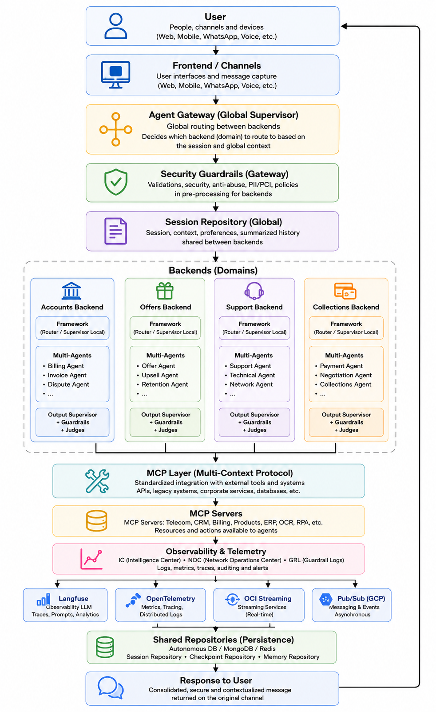
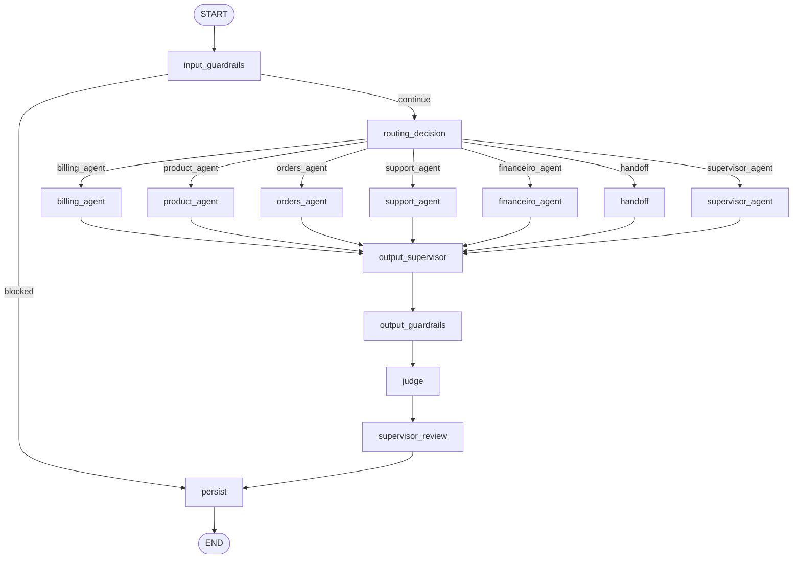
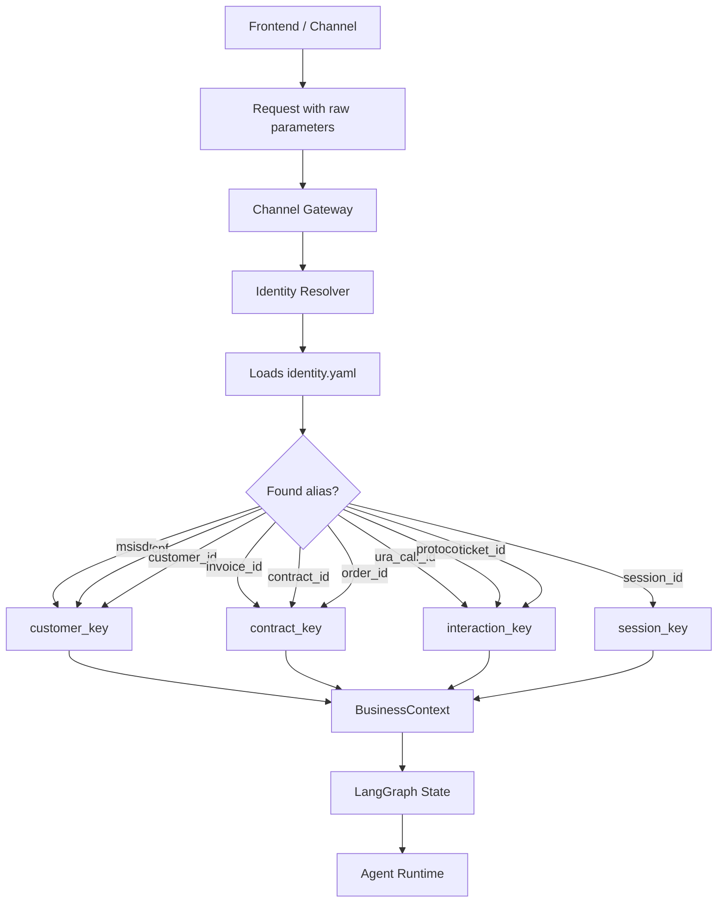
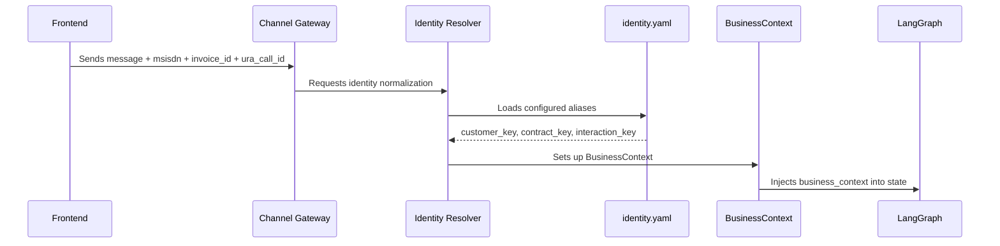
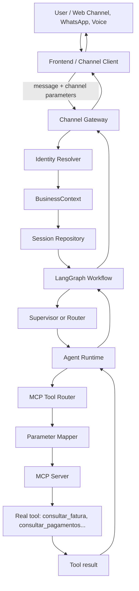
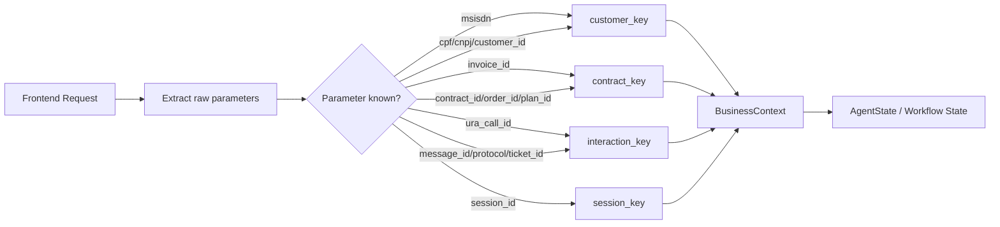
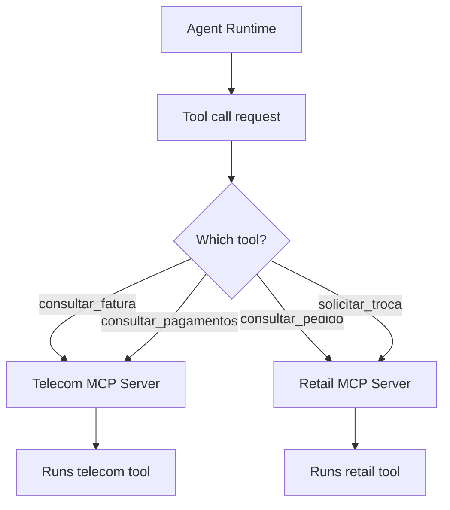
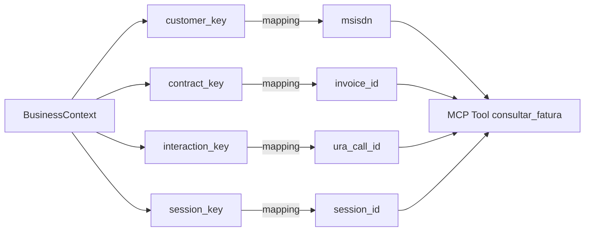
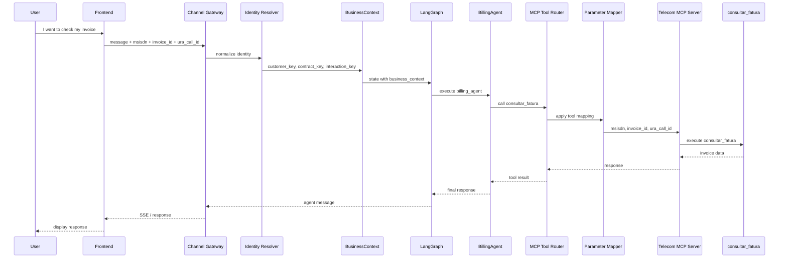

# Tutorial — Implementing an Agent using `agent_template_backend`

This tutorial teaches you how to implement a new agent from `agent_template_backend`, using the framework as a corporate execution engine.

The central idea is simple:

```text
Framework = reusable engine
Agent = specific business rule
MCP Server = standardized boundary with external systems
Config YAML = changeable behavior without recompiling code
IC/NOC/GRL = business, operation and governance traceability
```



The goal is for each new agent to implement only its domain logic — prompts, business rules, tools, schemas, and specific nodes — without recreating engines that already belong to the framework.

>**Note: If you want to test the DEMO, go to the Section 17 and 18.**

---

## 1. Architecture overview

The template separates what is generic from what is specific.

```text
agent_template_backend/
├── app/
│   ├── main.py                    # FastAPI API, gateway, session, SSE, and workflow input
│   ├── state.py                   # LangGraph shared state contract
│   ├── workflows/
│   │   └── agent_graph.py          # Enterprise workflow with router, guardrails, agents, judges, and persistence
│   ├── agents/
│   │   ├── runtime.py              # Common resources for agents: MCP, RAG, cache, IC, LLM
│   │   ├── billing_agent.py        # Example of an invoice agent
│   │   ├── product_agent.py        # Example of a product agent
│   │   ├── orders_agent.py         # Example of an order agent
│   │   └── support_agent.py        # Example of a support agent
│   └── examples/                  # Examples of IC, NOC, GRL, MCP, and observer
├── config/
│   ├── agents.yaml                # Record of available agents
│   ├── routing.yaml               # Intents, keywords, fallback and route decision
│   ├── tools.yaml                 # Catalog of tools available for the backend
│   ├── mcp_servers.yaml           # Local MCP endpoints
│   ├── mcp_servers.docker.yaml    # MCP endpoints in Docker Compose
│   ├── mcp_parameter_mapping.yaml # Mapping between canonical keys and tool parameters
│   ├── identity.yaml              # Business identity resolution
│   ├── guardrails.yaml            # Global guardrails
│   ├── judges.yaml                # Global judges
│   ├── prompt_policy.yaml         # Global prompt policy
│   └── agents/<agent_id>/         # Isolated settings by agent
├── data/
│   └── agent_framework.db         # Local sample database, when applicable
├── Dockerfile
├── requirements.txt
└── .env                           # Local configuration
```

### 1.1. What belongs to the framework

The framework should concentrate the reusable engines:

- LangGraph and workflow assembly.
- Checkpoint.
- Memory.
- Session repository.
- Channel gateway.
- Enterprise Router.
- Supervisor.
- Guardrails.
- Output Supervisor.
- Judges.
- Langfuse/OpenTelemetry Telemetry.
- Analytics IC/NOC/GRL.
- MCP Tool Router.
- Cache.
- Generic RAG.

### 1.2. What belongs to the agent

The agent should focus only on domain customizations:

- Specific prompts.
- Business rules.
- Own schemas.
- Specific tools.
- Clients from external systems, preferably encapsulated behind MCP.
- Parameter mapping.
- Specialized nodes, if any.
- Journey business ICs.

When a rule only makes sense for one domain, it belongs to the agent. When a capability is to be used by multiple agents, it belongs to the framework.

---

## 2. Template execution flow

The main flow starts at `app/main.py`, at the endpoint`/gateway/message`.

```text
Channel / Frontend / API
↓
POST /gateway/message
↓
ChannelGateway.normalize()
↓
IdentityResolver
↓
SessionRepository
↓
MemoryRepository
↓
AgentWorkflow.ainvoke()
↓
LangGraph
↓
Input Guardrails
↓
Enterprise Router or Supervisor
↓
Specialized agent
↓
MCP Tool Router / RAG / Cache / LLM
↓
Output Supervisor
↓
Output Guardrails
↓
Judges
↓
Supervisor Review
↓
Persistence / Checkpoint / Memory
↓
Response
```

`AgentWorkflow`, in `app/workflows/agent_graph.py`, usually already contains corporate nodes such as:

```text
input_guardrails
routing_decision
billing_agent
product_agent
orders_agent
support_agent
handoff
supervisor_agent
output_supervisor
output_guardrails
judge
supervisor_review
persist
```

To create a new agent, you usually change:

```text
app/agents/<new_agent>.py
app/workflows/agent_graph.py
app/state.py, if you need new fields
config/agents.yaml
config/routing.yaml
config/tools.yaml
config/mcp_servers.yaml
config/mcp_parameter_mapping.yaml
config/identity.yaml
config/agents/<agent_id>/prompt_policy.yaml
config/agents/<agent_id>/guardrails.yaml
config/agents/<agent_id>/judges.yaml
.env
```

---

## 3. Prerequisites

### 3.1. Local requirements

- Python 3.12 or 3.13.
- `pip` or `uv`.
- `Agent_framework` project available in the same workspace, if the template uses local installation.
- MCP servers, if the agent uses tools.
- Redis, Oracle Autonomous Database, MongoDB and Langfuse are optional depending on the configuration.

Recommended structure:

```text
workspace/
├── agent_framework/
└── agent_template_backend/
```

### 3.2. Local installation

Inside the `agent_template_backend` directory:

```bash
python -m venv .venv
source .venv/bin/activate
pip install -r requirements.txt
```

If `agent_framework` is in local development:

```bash
pip install -e ../agent_framework
```

In Windows PowerShell:

```powershell
python -m venv .venv
.\.venv\Scripts\Activate.ps1
pip install -r requirements.txt
pip install -e ..\agent_framework
```

---

## 4. `.env` configuration

The `.env` defines which engines will be activated. It's not just a properties file: it changes the agent's behavior at runtime.

Secure example for local development:

```env
APP_NAME=ai-agent-template
APP_ENV=local
LOG_LEVEL=INFO
API_HOST=0.0.0.0
API_PORT=8000
CORS_ORIGINS=http://localhost:5173,http://127.0.0.1:5173

LLM_PROVIDER=mock
LLM_TEMPERATURE=0.2
LLM_MAX_TOKENS=2048
LLM_TIMEOUT_SECONDS=120

SESSION_REPOSITORY_PROVIDER=memory
MEMORY_REPOSITORY_PROVIDER=memory
CHECKPOINT_REPOSITORY_PROVIDER=memory
USAGE_REPOSITORY_PROVIDER=memory

ENABLE_REDIS_CACHE=false
REDIS_URL=redis://localhost:6379/0
CACHE_TTL_SECONDS=300

VECTOR_STORE_PROVIDER=memory
GRAPH_STORE_PROVIDER=memory
RAG_TOP_K=5
EMBEDDING_PROVIDER=mock

ENABLE_LANGFUSE=false
LANGFUSE_HOST=http://localhost:3005
ENABLE_OTEL=false
OTEL_SERVICE_NAME=ai-agent-template

ENABLE_ANALYTICS=false
ANALYTICS_PROVIDERS=noop
ENABLE_OCI_STREAMING=false
OCI_STREAM_ENDPOINT=
OCI_STREAM_OCID=
OCI_STREAM_PARTITION_KEY=agent-events

ENABLE_INPUT_GUARDRAILS=true
ENABLE_OUTPUT_GUARDRAILS=true
ENABLE_OUTPUT_SUPERVISOR=true
ENABLE_JUDGES=true
ENABLE_SUPERVISOR=true
ENABLE_PARALLEL_GUARDRAILS=true
GUARDRAILS_FAIL_FAST=true
OUTPUT_SUPERVISOR_MAX_RETRIES=3
GUARDRAILS_CONFIG_PATH=./config/guardrails.yaml
JUDGES_CONFIG_PATH=./config/judges.yaml
PROMPT_POLICY_PATH=./config/prompt_policy.yaml

ROUTING_CONFIG_PATH=./config/routing.yaml
ROUTING_MODE=router
ENABLE_LLM_ROUTER=false

ENABLE_MCP_TOOLS=true
MCP_SERVERS_CONFIG_PATH=./config/mcp_servers.yaml
TOOLS_CONFIG_PATH=./config/tools.yaml
MCP_PARAMETER_MAPPING_PATH=./config/mcp_parameter_mapping.yaml
MCP_TOOL_TIMEOUT_SECONDS=30

IDENTITY_CONFIG_PATH=./config/identity.yaml
```

### 4.1. How to think about `.env`

Before testing a new agent, answer:

```text
Will the LLM be mock or real?
Will the memory be local or in a database?
Does the checkpoint need to survive a restart?
Will the MCP tools be called for real or simulated?
Will routing be by rule/intent or supervisor?
Should guardrails, judges, and supervisor block, review, or just observe?
Will Langfuse/OTEL/Streaming be used in this environment?
```

For a first test, use `LLM_PROVIDER=mock`, `in-memory` persistence, and mock/local MCP. Then move on to real LLM, database, Langfuse, and real services.

To use Oracle Autonomous Database, set:

```env
SESSION_REPOSITORY_PROVIDER=autonomous
MEMORY_REPOSITORY_PROVIDER=autonomous
CHECKPOINT_REPOSITORY_PROVIDER=autonomous
USAGE_REPOSITORY_PROVIDER=autonomous

ADB_USER=<usuario>
ADB_PASSWORD=<senha>
ADB_DSN=<dsn>
ADB_WALLET_LOCATION=<caminho-wallet>
ADB_WALLET_PASSWORD=<senha-wallet>
ADB_TABLE_PREFIX=AGENTFW
```

To use Langfuse:

```env
ENABLE_LANGFUSE=true
LANGFUSE_PUBLIC_KEY=<public-key>
LANGFUSE_SECRET_KEY=<secret-key>
LANGFUSE_HOST=http://localhost:3005
```

### 4.1.1. LLM Provider and OCI Authentication Configuration

The Agent Framework OCI supports multiple LLM providers and authentication mechanisms.

- `LLM_PROVIDER`
- `OCI_AUTH_MODE`
- `OCI_GENAI_API_KEY`

### LLM_PROVIDER

**LLM_PROVIDER**=mock

Uses a simulated model for testing and development.

**LLM_PROVIDER**=oci_openai

Uses the OCI Generative AI OpenAI-Compatible endpoint.
Uses `OCI_GENAI_API_KEY`.

**LLM_PROVIDER**=oci_sdk

Uses the native OCI Generative AI SDK.
Uses `OCI_AUTH_MODE`.

**LLM_PROVIDER**=openai_compatible

Uses any endpoint compatible with the OpenAI API.

### OCI_AUTH_MODE

Used only when:

```env
LLM_PROVIDER=oci_sdk
```

**OCI_AUTH_MODE**=config_file

Authenticates using `~/.oci/config`.

**OCI_AUTH_MODE**=instance_principal

Authenticates using OCI Instance Principals.

**OCI_AUTH_MODE**=resource_principal

Authenticates using OCI Resource Principals.

### OCI_GENAI_API_KEY

API Key used by the `oci_openai` provider.

### Configuration Matrix

| LLM_PROVIDER | OCI_AUTH_MODE | OCI_GENAI_API_KEY | Method |
|-------------|-------------|-------------|-------------|
| mock | Ignored | No | None |
| oci_openai | Ignored | Yes | API Key |
| oci_sdk | config_file | No | OCI Config File |
| oci_sdk | instance_principal | No | Instance Principal |
| oci_sdk | resource_principal | No | Resource Principal |
| openai_compatible | Ignored | No | Endpoint API Key |

---

### 4.2.`llm_profiles.yaml`

### 4.2.1. Purpose of `llm_profiles.yaml`

The `llm_profiles.yaml` file is used to centrally and granularly configure which LLM model each part of the framework should use.

Without this file, the framework usually relies on a single model defined in `.env`, for example:

```env
LLM_PROVIDER=oci_openai
OCI_GENAI_MODEL=openai.gpt-4.1
LLM_TEMPERATURE=0.2
LLM_MAX_TOKENS=2048
```

This means that the supervisor, router, agents, RAG, memory, guardrails, and judges tend to use the same default model, unless something specific is hardcoded elsewhere.

With `llm_profiles.yaml`, each inference point can use a different model with its own parameters.

Example:

```yaml
profiles:
  default:
    provider: oci_openai
    model: openai.gpt-4.1
    temperature: 0.2
    max_tokens: 2048

  guardrail:
    provider: oci_openai
    model: openai.gpt-4.1
    temperature: 0
    max_tokens: 600

  judge:
    provider: oci_openai
    model: openai.gpt-4.1
    temperature: 0
    max_tokens: 800

  rag_generation:
    provider: oci_openai
    model: openai.gpt-4.1
    temperature: 0.1
    max_tokens: 1800
```

---

### 4.2.2. Why this file matters

In an enterprise agent framework, not every component should necessarily use the same model.

For example:

- The main agent may use a more flexible model.
- The supervisor may use temperature `0` for predictable routing.
- Guardrails should be strict and stable.
- Judges should evaluate answers with low variability.
- RAG may use different models for rewriting, compression, and final generation.
- Memory summarization may use a cheaper or shorter-context model.

`llm_profiles.yaml` separates these responsibilities.

---

### 4.2.3. General behavior

The expected framework rule is:

```text
If llm_profiles.yaml exists:
  the framework uses the profiles defined in it for each component.

If llm_profiles.yaml does not exist:
  the framework keeps the previous behavior and uses .env as the global configuration.
```

So `llm_profiles.yaml` is optional.

It does not completely replace `.env`. It acts as a per-component override layer.

---

### 4.2.4. When the file does NOT exist

If `llm_profiles.yaml` does not exist, the framework should only use the global `.env` configuration.

Example:

```env
LLM_PROVIDER=oci_openai
OCI_GENAI_MODEL=openai.gpt-4.1
LLM_TEMPERATURE=0.2
LLM_MAX_TOKENS=2048
```

In this scenario, all LLM-based components tend to use the same global provider/model:

```text
supervisor      -> .env
router          -> .env
LLM guardrails  -> .env
LLM judges      -> .env
RAG             -> .env
summary memory  -> .env
agents          -> .env
```

This mode is useful for simple environments, proof-of-concepts, or when per-component model control is not needed yet.

---

### 4.2.5. When the file exists

If `llm_profiles.yaml` exists, the framework starts looking for a specific profile for each inference point.

Example:

```yaml
profiles:
  supervisor:
    provider: oci_openai
    model: openai.gpt-4.1
    temperature: 0
    max_tokens: 700

  judge:
    provider: oci_openai
    model: openai.gpt-4.1
    temperature: 0
    max_tokens: 800
```

When the supervisor calls an LLM, it should use the `supervisor` profile.

When an LLM judge calls an LLM, it should use the `judge` profile.

---

### 4.2.6. Relationship between `default` and specific profiles

The `default` profile works as a base profile.

Example:

```yaml
profiles:
  default:
    provider: oci_openai
    model: openai.gpt-4.1
    temperature: 0.2
    max_tokens: 2048

  supervisor:
    temperature: 0
    max_tokens: 700
```

If the resolver supports inheritance, the `supervisor` profile may inherit `provider` and `model` from `default`, while overriding only `temperature` and `max_tokens`.

However, to avoid ambiguity, the safest configuration is to explicitly declare `provider` and `model` in every profile:

```yaml
supervisor:
  provider: oci_openai
  model: openai.gpt-4.1
  temperature: 0
  max_tokens: 700
```

This is the recommended format.

---

### 4.2.7. Main framework profiles

| Profile | Purpose |
|---|---|
| `default` | Base/fallback configuration |
| `supervisor` | Next-agent or flow decision |
| `router` | Intent or policy routing |
| `guardrail` | Input or general safety guardrails |
| `grl` | Output guardrails and response rules |
| `judge` | LLM judges such as quality and groundedness |
| `rag_rewriter` | Query rewriting for RAG |
| `rag_compressor` | Retrieved context compression |
| `rag_generation` | Final RAG-grounded answer generation |
| `summary_memory` | Conversational memory summarization |
| `noc` | Operational/NOC analysis |
| `billing_agent` | Billing/invoice agent-specific model |
| `product_agent` | Product agent-specific model |
| `backoffice_agent` | Backoffice agent-specific model |

---

### 4.2.8. Guardrails and `llm_profiles.yaml`

Guardrails can be deterministic or LLM-based.

Deterministic guardrails do not need to call a model. Therefore, even if the `guardrail` profile contains an invalid model, a purely deterministic rail may block the request before any LLM call happens.

Example:

```yaml
guardrail:
  provider: oci_openai
  model: xopenai.gpt-4.1
```

If the input triggers a deterministic prompt-injection pattern, the model error may not appear because the LLM was not called.

To validate that the profile is being used, test a guardrail path that actually calls the LLM.

Typical profile mapping:

```text
guardrail -> PINJ, TOX, OOS, DLEX_IN, RAGSEC
grl       -> REVPREC, AOFERTA, DLEX_OUT
```

---

### 4.2.9. Judges and `llm_profiles.yaml`

`judges.yaml` defines which judges exist and whether they are enabled.

Example:

```yaml
judges:
  - name: response_quality
    enabled: true
    threshold: 0.7

  - name: groundedness
    enabled: true
    threshold: 0.6
```

If these judges are calibrated as LLM judges, they use the `judge` profile from `llm_profiles.yaml`.

Example:

```yaml
judge:
  provider: oci_openai
  model: openai.gpt-4.1
  temperature: 0
  max_tokens: 800
```

The important separation is:

```text
judges.yaml       -> defines which judges run and their rules
llm_profiles.yaml -> defines which model the LLM judge uses
```

If the `judge` profile points to an invalid model and the LLM judge is executed, the framework should fail according to the policy configured in `judges.yaml`, for example `fail_closed`.

---

### 4.2.10. RAG and `llm_profiles.yaml`

RAG may use LLMs in multiple stages:

```text
rag_rewriter    -> rewrites the user question
rag_compressor  -> compresses retrieved documents/context
rag_generation  -> generates the final grounded answer
```

Example:

```yaml
rag_rewriter:
  provider: oci_openai
  model: openai.gpt-4.1
  temperature: 0
  max_tokens: 300

rag_compressor:
  provider: oci_openai
  model: openai.gpt-4.1
  temperature: 0
  max_tokens: 1200

rag_generation:
  provider: oci_openai
  model: openai.gpt-4.1
  temperature: 0.1
  max_tokens: 1800
```

This allows different models to be used for different RAG pipeline tasks.

---

### 4.2.11. Memory and `llm_profiles.yaml`

LLM-based summary memory should use the `summary_memory` profile.

Example:

```yaml
summary_memory:
  provider: oci_openai
  model: openai.gpt-4.1
  temperature: 0.1
  max_tokens: 1200
```

This profile is used when the framework needs to summarize long conversations, compact history, or preserve conversational memory without loading all previous messages.

---

### 4.2.12. Supervisor and router

The supervisor and router are critical flow-control components.

Example:

```yaml
supervisor:
  provider: oci_openai
  model: openai.gpt-4.1
  temperature: 0
  max_tokens: 700

router:
  provider: oci_openai
  model: openai.gpt-4.1
  temperature: 0
  max_tokens: 500
```

They usually use temperature `0` because routing decisions should be predictable.

---

### 4.2.13. Recommended full example

```yaml
profiles:
  default:
    provider: oci_openai
    model: openai.gpt-4.1
    temperature: 0.2
    max_tokens: 2048

  supervisor:
    provider: oci_openai
    model: openai.gpt-4.1
    temperature: 0
    max_tokens: 700

  router:
    provider: oci_openai
    model: openai.gpt-4.1
    temperature: 0
    max_tokens: 500

  guardrail:
    provider: oci_openai
    model: openai.gpt-4.1
    temperature: 0
    max_tokens: 600

  grl:
    provider: oci_openai
    model: openai.gpt-4.1
    temperature: 0
    max_tokens: 700

  judge:
    provider: oci_openai
    model: openai.gpt-4.1
    temperature: 0
    max_tokens: 800

  rag_rewriter:
    provider: oci_openai
    model: openai.gpt-4.1
    temperature: 0
    max_tokens: 300

  rag_compressor:
    provider: oci_openai
    model: openai.gpt-4.1
    temperature: 0
    max_tokens: 1200

  rag_generation:
    provider: oci_openai
    model: openai.gpt-4.1
    temperature: 0.1
    max_tokens: 1800

  summary_memory:
    provider: oci_openai
    model: openai.gpt-4.1
    temperature: 0.1
    max_tokens: 1200

  noc:
    provider: oci_openai
    model: openai.gpt-4.1
    temperature: 0
    max_tokens: 700

  billing_agent:
    provider: oci_openai
    model: openai.gpt-4.1
    temperature: 0.2

  product_agent:
    provider: oci_openai
    model: openai.gpt-4.1
    temperature: 0.2

  backoffice_agent:
    provider: oci_openai
    model: openai.gpt-4.1
    temperature: 0.2
```

---

### 4.2.14. How to test whether a profile is being respected

A simple test is to intentionally configure a non-existent model in a specific profile.

Example:

```yaml
judge:
  provider: oci_openai
  model: xopenai.gpt-4.1
  temperature: 0
  max_tokens: 800
```

Then run a flow that actually invokes an LLM judge.

If the framework respects the profile, the call should fail because the model does not exist.

The same test can be done with:

```text
guardrail
grl
rag_rewriter
rag_compressor
rag_generation
summary_memory
supervisor
router
billing_agent
```

However, you must ensure that the component is actually executed in the flow.

---

### 4.2.15. Warning about silent fallback

One important concern in agent architectures is avoiding silent fallback when an explicit profile was configured.

If the user configured:

```yaml
judge:
  provider: oci_openai
  model: xopenai.gpt-4.1
```

then the framework should not silently ignore the error and fall back to another model, unless that fallback is explicitly configured.

Recommended rule:

```text
explicit profile + real provider + invalid model = visible error
```

This prevents situations where the team believes it is testing one model, while the framework silently uses another.

---

### 4.2.16. Final summary

`llm_profiles.yaml` is the framework's per-component LLM configuration layer.

It allows you to:

- Separate models by function.
- Use different temperatures per component.
- Test specific models in specific inference points.
- Avoid depending on a single global model in `.env`.
- Make guardrails, judges, RAG, memory, supervisor, and agents more controllable.

Main rule:

```text
Without llm_profiles.yaml:
  .env controls everything.

With llm_profiles.yaml:
  each component uses its own profile.
  .env remains as fallback for missing keys or legacy mode.
```

---

## 5. Creating a new agent

In this example, we will create an agent called `finance_agent` for generic financial service.

### 5.1. Before the code: what is an agent in this framework?

An agent is a domain class that receives the `state` from LangGraph, interprets the intent chosen by the router or supervisor, collects evidence, calls tools/RAG/LLM when necessary, and returns a decision for the workflow to continue.

It should not decide on its own everything that the framework already decides. For example:

```text
The agent does not create a session.
The agent does not open SSE.
The agent does not compile LangGraph.
The agent does not create a checkpoint.
The agent does not run global guardrails.
The agent does not call the external system directly when there is an MCP Tool Router.
```

The agent must answer questions such as:

```text
What business problem am I solving?
What data do I need to respond securely?
Which tools can provide this data?
Which domain rules prevent or authorize an action?
What response should be returned to the user?
What IC events do I need to issue for the journey audit?
```

---
#### 5.1.1. Channel Gateway — Internal and External in the Agent Framework

This chapter explains the role of the **Channel Gateway** within the Agent Framework architecture and why it can run in two different ways:

```text
1. Internal Channel Gateway
   Embedded in the framework backend itself.

2. External Channel Gateway
   Run as a separate service, maintained by a channel or integration team.
```

The main function of the Channel Gateway is to protect the Agent Framework from varied, unstable, or unknown external channel message formats.

Central rule:

```text
The agent must not know raw channel payloads.

The agent must receive only messages normalized by the framework.
```

---

### 5.1.1.1. The problem solved by the Channel Gateway

In real environments, each channel sends messages in different formats.

Examples:

```text
Web
WhatsApp
Teams
Email
Voice
IVR
Genesys
Twilio
Zendesk
CRM
Mobile app
Customer proprietary channel
```

Each channel may have a completely different payload.

A WhatsApp channel may send something like:

```json
{
  "wa_id": "5511999999999",
  "messages": [
    {
      "type": "interactive",
      "interactive": {
        "button_reply": {
          "id": "segunda_via_fatura",
          "title": "Segunda via de fatura"
        }
      }
    }
  ]
}
```

A voice channel may send:

```json
{
  "event": "voice.transcript.completed",
  "caller": "+5511999999999",
  "transcript": "quero consultar minha fatura",
  "confidence": 0.94
}
```

A web frontend may send:

```json
{
  "message": "Quero consultar minha fatura",
  "session_id": "abc123",
  "customer_key": "11999999999"
}
```

If the framework accepted all these formats directly, the core would become contaminated with channel-specific rules.

The result would be bad:

```text
agents knowing WhatsApp
agents knowing IVR
agents knowing Teams
workflow handling external payloads
guardrails receiving unexpected objects
MCP receiving inconsistent parameters
channel maintenance falling onto the framework team
```

The Channel Gateway exists to prevent this.

---

### 5.1.1.2. Channel Gateway responsibility

The Channel Gateway is the layer responsible for transforming external messages into a format accepted by the Agent Framework.

It bridges:

```text
External world
  channel-specific payloads

and

Agent Framework
  standardized input contract
```

Typical responsibilities:

```text
receive external payload
validate minimum structure
validate channel authentication or signature
extract user text
extract technical identifiers
extract business identifiers
normalize session
normalize metadata
map data to business_context
build GatewayRequest
call the Agent Framework backend
translate the framework response back to the channel
```

The Channel Gateway must not perform agent reasoning.

It must not:

```text
decide the final user response
execute LangGraph
execute domain guardrails
call MCP directly
perform RAG
call the LLM as an agent
persist framework conversational memory
implement agent business rules
```

---

### 5.1.1.3. Agent Framework responsibility

The Agent Framework starts working after the message has already been placed into the contract accepted by the backend.

Framework responsibilities:

```text
validate the input contract
normalize context
resolve business identity
create or recover session
execute input guardrails
route intent
execute LangGraph
trigger specialized agent
call MCP Tool Router
execute RAG
call LLM
execute output guardrails
execute judges
persist memory and checkpoint
emit telemetry
return standardized response
```

The framework must be protected from raw channel payloads.

---

### 5.1.1.4. Current operational contract: GatewayRequest

In the current backend version, the `/gateway/message` endpoint expects an envelope referred to here as `GatewayRequest`.

Format:

```json
{
  "channel": "web",
  "tenant_id": "default",
  "agent_id": "telecom_contas",
  "payload": {
    "message": "Quero consultar minha fatura",
    "session_id": "curl-contract-test-001",
    "user_id": "user-curl-001",
    "message_id": "msg-curl-contract-001",
    "customer_key": "11999999999",
    "contract_key": "3000131180",
    "interaction_key": "301953872",
    "session_key": "curl-contract-test-001",
    "business_context": {
      "customer_key": "11999999999",
      "contract_key": "3000131180",
      "interaction_key": "301953872",
      "session_key": "curl-contract-test-001"
    },
    "metadata": {
      "source": "curl",
      "request_id": "req-curl-contract-001"
    }
  }
}
```

Conceptual schema:

```python
from typing import Any
from pydantic import BaseModel


class GatewayRequest(BaseModel):
    channel: str = "web"
    payload: dict[str, Any]
    agent_id: str | None = None
    tenant_id: str | None = None
```

The Channel Gateway, internal or external, must produce this format before delivering the message to the workflow.

---

### 5.1.1.5. Internal Channel Gateway

### 5.1.1.5.1. Definition

The **internal Channel Gateway** is the implementation embedded within the Agent Framework backend.

In this mode, the backend itself receives the request and performs normalization.

Flow:

```text
Frontend / Simple channel
  ↓
POST /gateway/message
  ↓
Agent Framework Backend
  ↓
ChannelGateway.normalize()
  ↓
IdentityResolver
  ↓
SessionRepository
  ↓
LangGraph Workflow
  ↓
Response
```

Representation:

```text
┌──────────────────────────────────────────────────────┐
│ Agent Framework Backend                              │
│                                                      │
│  ┌──────────────────────┐                            │
│  │ Channel Gateway      │                            │
│  │ internal             │                            │
│  └──────────┬───────────┘                            │
│             ↓                                        │
│  ┌──────────────────────┐                            │
│  │ Identity Resolver    │                            │
│  └──────────┬───────────┘                            │
│             ↓                                        │
│  ┌──────────────────────┐                            │
│  │ LangGraph Workflow   │                            │
│  └──────────────────────┘                            │
└──────────────────────────────────────────────────────┘
```

---

### 5.1.1.5.2. When to use the internal Channel Gateway

Use internal mode when:

```text
the environment is local
the goal is a demo
the channel is simple
the payload is controlled
the framework team also controls the frontend
the project is an MVP
the customer has not yet defined a channel team
```

Examples:

```text
local agent_frontend
curl
Postman
automated tests
customer demo
development lab
```

---

### 5.1.1.5.3. Advantages of internal mode

```text
simpler to start
fewer services to run
less infrastructure
easier to test locally
good for demos and tutorials
reduces friction for new developers
```

---

### 5.1.1.5.4. Limitations of internal mode

Internal mode is not ideal when there are many channels or proprietary channels.

Risks:

```text
the framework starts accumulating channel parsers
the framework team becomes responsible for WhatsApp, Teams, IVR, etc. payloads
external changes break the backend
channel authentication rules enter the core
framework deployment starts depending on channel changes
architectural responsibility becomes mixed
```

The main problem is maintenance.

If every new channel requires a change in the framework backend, the framework stops being a generic engine and becomes a collection of specific integrations.

---

### 5.1.1.6. External Channel Gateway

### 5.1.1.6.1. Definition

The **external Channel Gateway** is an independent service, outside the Agent Framework backend.

It is responsible for receiving channel-specific payloads and converting them to the operational contract accepted by the framework.

Flow:

```text
External channel
  ↓
External Channel Gateway
  ↓
GatewayRequest
  ↓
Agent Framework Backend
  ↓
LangGraph Workflow
  ↓
Current ChannelResponse
  ↓
External Channel Gateway
  ↓
Response in the original channel
```

Representation:

```text
┌─────────────────────────────┐
│ External channel            │
│ WhatsApp / Voice / Teams    │
└──────────────┬──────────────┘
               ↓
┌─────────────────────────────┐
│ External Channel Gateway    │
│ Channel adapter             │
│ Auth                        │
│ Parser                      │
│ Normalization               │
└──────────────┬──────────────┘
               ↓ GatewayRequest
┌─────────────────────────────┐
│ Agent Framework Backend     │
│ /gateway/message            │
│ LangGraph / Agents / MCP    │
└──────────────┬──────────────┘
               ↓ ChannelResponse
┌─────────────────────────────┐
│ External Channel Gateway    │
│ Response translation        │
└──────────────┬──────────────┘
               ↓
┌─────────────────────────────┐
│ External channel            │
└─────────────────────────────┘
```

---

### 5.1.1.6.2. When to use the external Channel Gateway

Use external mode when:

```text
the environment is enterprise
there are multiple channels
there is a channel team
the customer has proprietary channels
the channel payload is not known by the framework team
there is channel-specific authentication
there are security or compliance requirements
there are channel-specific rate limit, retry, and idempotency rules
the framework team must not maintain specific adapters
```

Examples:

```text
official WhatsApp
corporate IVR
Genesys
Twilio
Microsoft Teams
Zendesk
Salesforce
customer mobile app
legacy portal
proprietary customer service channel
```

---

### 5.1.1.6.3. Advantages of external mode

```text
separates responsibilities
delegates channel maintenance
protects the framework
avoids coupling with external APIs
allows different teams to evolve at different speeds
facilitates enterprise governance
allows separate deployment
allows channel-specific authentication
allows channel-specific observability
```

The main idea is:

```text
The channel team owns the channel.
The framework team owns the agent engine.
```

---

### 5.1.1.6.4. Responsibility of the team owning the external Channel Gateway

The team owning the external gateway must implement:

```text
public channel endpoint
signature/authentication validation
rate limit control
channel event deduplication
retry handling
raw payload parser
text extraction
attachment extraction
technical ID extraction
mapping to customer_key, contract_key, etc.
GatewayRequest assembly
call to the Agent Framework
response handling
response translation to the original channel
channel logs and metrics
```

---

### 5.1.1.6.5. Responsibility of the Agent Framework team

The framework team must provide:

```text
GatewayRequest contract
response contract
documentation of accepted fields
curl examples
Pydantic schemas
standardized errors
stable endpoint
contract versioning
authentication rules between external gateway and framework
workflow observability
```

The framework team must not take ownership of raw channel payload maintenance.

---

### 5.1.1.7. Comparison between internal and external Channel Gateway

| Criterion | Internal | External |
|---|---|---|
| Where it runs | Inside the framework backend | Separate service |
| Best use | Demo, lab, MVP | Enterprise production |
| Typical owner | Framework team | Channel/integration team |
| Does raw payload enter the framework? | It may in simple scenarios | It should not |
| Organizational scalability | Low/Medium | High |
| Coupling with channel | Higher | Lower |
| Deployment | Together with framework | Independent |
| Channel-specific security | Limited to backend | Specialized per channel |
| Parser maintenance | Framework | Channel team |
| Production recommendation | Simple cases only | Recommended |

---

### 5.1.1.8. Detailed flow with internal Channel Gateway

```text
1. Frontend sends POST /gateway/message.
2. Backend receives GatewayRequest.
3. ChannelGateway.normalize() extracts:
   - message
   - session_id
   - user_id
   - message_id
   - business_context
   - metadata
4. IdentityResolver complements business keys.
5. SessionRepository resolves conversation_key.
6. LangGraph starts the workflow.
7. Input guardrails run.
8. Router decides intent and route.
9. Specialized agent runs.
10. MCP Tool Router calls tools, if necessary.
11. RAG retrieves documents, if necessary.
12. LLM generates response, if necessary.
13. Output guardrails run.
14. Judges evaluate the response.
15. Framework returns channel, session_id, text, and metadata.
```

---

### 5.1.1.9. Detailed flow with external Channel Gateway

```text
1. External channel sends an event to the external gateway.
2. External gateway validates authentication/signature.
3. External gateway deduplicates the message using the channel ID.
4. External gateway interprets the raw payload.
5. External gateway extracts text, event, or transcript.
6. External gateway extracts technical IDs from the channel.
7. External gateway maps data to business_context.
8. External gateway builds GatewayRequest.
9. External gateway calls POST /gateway/message in the Agent Framework.
10. Framework executes the workflow normally.
11. Framework returns the current ChannelResponse.
12. External gateway transforms text/metadata into a channel response.
13. External gateway sends the response to the user in the original channel.
```

---

### 5.1.1.10. Example: raw WhatsApp payload to GatewayRequest

#### 5.1.1.10.1. Hypothetical raw payload

```json
{
  "wa_id": "5511999999999",
  "messages": [
    {
      "id": "wamid.123",
      "type": "interactive",
      "interactive": {
        "button_reply": {
          "id": "segunda_via_fatura",
          "title": "Segunda via de fatura"
        }
      }
    }
  ]
}
```

#### 5.1.1.10.2. GatewayRequest sent to the framework

```json
{
  "channel": "whatsapp",
  "tenant_id": "default",
  "agent_id": "telecom_contas",
  "payload": {
    "message": "Segunda via de fatura",
    "session_id": "5511999999999",
    "user_id": "5511999999999",
    "message_id": "wamid.123",
    "customer_key": "5511999999999",
    "interaction_key": "wamid.123",
    "session_key": "5511999999999",
    "business_context": {
      "customer_key": "5511999999999",
      "interaction_key": "wamid.123",
      "session_key": "5511999999999",
      "metadata": {
        "source_channel": "whatsapp",
        "source_message_type": "interactive"
      }
    },
    "metadata": {
      "external_gateway": "customer-channel-gateway",
      "original_channel": "whatsapp",
      "original_message_id": "wamid.123",
      "interactive_type": "button_reply",
      "raw_reference": "segunda_via_fatura"
    }
  }
}
```

---

### 5.1.1.11. Example: raw voice payload to GatewayRequest

#### 5.1.1.11.1. Hypothetical raw payload

```json
{
  "event": "voice.transcript.completed",
  "call_id": "call-9988",
  "caller": "+5511999999999",
  "transcript": "minha fatura veio muito alta esse mês",
  "confidence": 0.94,
  "language": "pt-BR"
}
```

#### 5.1.1.11.2. GatewayRequest sent to the framework

```json
{
  "channel": "voice",
  "tenant_id": "default",
  "agent_id": "telecom_contas",
  "payload": {
    "message": "minha fatura veio muito alta esse mês",
    "session_id": "call-9988",
    "user_id": "+5511999999999",
    "message_id": "call-9988-turn-1",
    "customer_key": "5511999999999",
    "interaction_key": "call-9988",
    "session_key": "call-9988",
    "business_context": {
      "customer_key": "5511999999999",
      "interaction_key": "call-9988",
      "session_key": "call-9988",
      "metadata": {
        "source_channel": "voice",
        "transcription_provider": "speech-service",
        "confidence": 0.94,
        "language": "pt-BR"
      }
    },
    "metadata": {
      "external_gateway": "voice-channel-gateway",
      "call_id": "call-9988",
      "event": "voice.transcript.completed"
    }
  }
}
```

---

### 5.1.1.12. Curl example to validate the contract

```bash
curl -s -X POST "http://localhost:8000/gateway/message" \
  -H "Content-Type: application/json" \
  -d '{
    "channel": "web",
    "tenant_id": "default",
    "agent_id": "telecom_contas",
    "payload": {
      "message": "Quero consultar minha fatura",
      "session_id": "curl-contract-test-001",
      "user_id": "user-curl-001",
      "message_id": "msg-curl-contract-001",
      "customer_key": "11999999999",
      "contract_key": "3000131180",
      "interaction_key": "301953872",
      "session_key": "curl-contract-test-001",
      "business_context": {
        "customer_key": "11999999999",
        "contract_key": "3000131180",
        "interaction_key": "301953872",
        "session_key": "curl-contract-test-001",
        "metadata": {
          "source_channel": "web",
          "frontend": "curl",
          "version": "legacy-envelope-with-business-context"
        }
      },
      "metadata": {
        "source": "curl",
        "request_id": "req-curl-contract-001"
      }
    }
  }' | jq
```

---

### 5.1.1.13. Expected framework response

The current framework response returns:

```json
{
  "channel": "web",
  "session_id": "default:telecom_contas:curl-contract-test-001",
  "text": "[BillingAgent] Aqui estão as informações da sua fatura mais recente...",
  "metadata": {
    "tenant_id": "default",
    "agent_id": "telecom_contas",
    "original_session_id": "curl-contract-test-001",
    "conversation_key": "default:telecom_contas:curl-contract-test-001",
    "message_id": "msg-curl-contract-001",
    "route": "billing_agent",
    "intent": "billing_invoice_explanation",
    "mcp_tools": [
      "consultar_fatura",
      "consultar_pagamentos"
    ],
    "mcp_results": [],
    "business_context": {},
    "guardrails": [],
    "judges": []
  }
}
```

Main fields:

```text
channel
  Origin channel.

session_id
  Final session resolved by the framework.

text
  Final agent response.

metadata
  Technical data, routing, business context, MCP, guardrails, judges, and traceability.
```

---

### 5.1.1.14. How the external Channel Gateway should handle the response

The framework returns a backend-oriented response.

The external Channel Gateway must translate it into the format expected by the channel.

Example:

```text
Framework:
  text = "Encontrei sua fatura..."

WhatsApp:
  send text message through the WhatsApp API

Voice:
  send text to TTS

Teams:
  build a Teams card or message

Email:
  build email body

CRM:
  register response in the service interaction
```

The external gateway may use `metadata` to decide additional behavior, for example:

```text
requires_user_input
missing_fields
intent
route
handoff
mcp_results
guardrails
```

But the main user-facing response is in:

```text
text
```

---

### 5.1.1.15. Security and validation

The Channel Gateway must apply validations before calling the framework.

Recommended validations:

```text
channel authentication
webhook signature
allowed origin
rate limit
maximum message size
allowed event type
deduplication by message_id
text normalization
HTML/script removal
sensitive data minimization
attachment control
```

The Agent Framework must also validate the received contract.

Recommended framework validations:

```text
channel present
payload present
payload.message present
valid tenant_id
valid or routable agent_id
valid session_id
consistent business_context
traceable message_id
metadata within acceptable size
```

---

### 5.1.1.16. Idempotency

External channels may resend events.

Therefore, whenever possible, the Channel Gateway must fill in:

```text
payload.message_id
```

Recommended idempotency key:

```text
tenant_id:channel:user_id:message_id
```

Example:

```text
default:whatsapp:5511999999999:wamid.123
```

Possible behaviors:

```text
first time:
  process the message

duplicate resend:
  ignore
  return previous response
  return controlled conflict
```

The policy can live in the external Channel Gateway, in the Agent Framework, or in both.

---

### 5.1.1.17. Relationship with IdentityResolver

The Channel Gateway sends canonical data in `payload` and `business_context`.

The framework `IdentityResolver` can complement or standardize these keys.

Example:

```text
payload.customer_key
payload.contract_key
payload.interaction_key
payload.session_key
```

May become:

```text
metadata.business_context.customer_key
metadata.business_context.contract_key
metadata.business_context.interaction_key
metadata.business_context.session_key
```

Recommended rule:

```text
The Channel Gateway should normalize what it knows.
The IdentityResolver complements what is missing.
```

---

### 5.1.1.18. Relationship with MCP Parameter Mapping

The Channel Gateway must not know the exact parameter name of each MCP tool.

It should send canonical keys.

Example:

```text
customer_key
contract_key
interaction_key
session_key
```

The framework, through `mcp_parameter_mapping.yaml`, translates them to the parameters expected by the tools.

Example:

```yaml
tools:
  consultar_fatura:
    map:
      customer_key: msisdn
      contract_key: invoice_id
      interaction_key: ura_call_id
      session_key: session_id
```

Flow:

```text
GatewayRequest.payload.business_context.customer_key
  ↓
AgentRuntime / MCP Tool Router
  ↓
mcp_parameter_mapping.yaml
  ↓
consultar_fatura.msisdn
```

This keeps the Channel Gateway decoupled from the MCP Server.

---

### 5.1.1.19. Anti-patterns

Avoid these patterns:

```text
Agent reading raw WhatsApp payload.
Workflow with if channel == "whatsapp".
Guardrail depending on native Teams fields.
MCP Server receiving the entire channel payload.
Frontend sending arbitrary fields outside payload.
External gateway calling the agent directly, bypassing /gateway/message.
External Channel Gateway executing agent business logic.
Framework being changed for every new channel.
Sensitive data or channel tokens sent in metadata.
```

The correct design is:

```text
Specific channel
  ↓
Specific adapter
  ↓
GatewayRequest
  ↓
Agent Framework
```

---

### 5.1.1.20. Contract versioning

For enterprise environments, it is recommended to version the contract.

Example:

```json
{
  "channel": "web",
  "tenant_id": "default",
  "agent_id": "telecom_contas",
  "payload": {
    "message": "Quero consultar minha fatura",
    "metadata": {
      "contract_version": "gateway-request-v1"
    }
  }
}
```

Or in the HTTP header:

```http
X-Agent-Framework-Contract: gateway-request-v1
```

Recommended rules:

```text
compatible changes keep the same version
new fields must be optional
field removal requires a new version
semantic changes require a new version
external gateway must declare the version used
framework must reject incompatible versions
```

---

### 5.1.1.21. Observability

The Channel Gateway and the Agent Framework must emit traceability at different levels.

#### 5.1.1.21.1. Channel Gateway observability

```text
event received from channel
signature validation
deduplication
parsed payload
GatewayRequest built
framework call
response received
response sent to channel
channel error
authentication error
retry error
```

#### 5.1.1.21.2. Agent Framework observability

```text
GatewayRequest received
ChannelGateway.normalize()
IdentityResolver
SessionRepository
Guardrails
Routing
Agent execution
MCP tools
RAG
LLM
Output guardrails
Judges
Persistence
Final response
```

Correlation should use:

```text
request_id
message_id
session_id
conversation_key
trace_id
```

#### 5.1.1.21.3. Automatic Langfuse instrumentation for the OpenAI client

```python
ENABLE_LANGFUSE_OPENAI_AUTO_INSTRUMENTATION=true
```

enables automatic Langfuse instrumentation for the OpenAI client.

When enabled, every request executed through the Langfuse-instrumented OpenAI client automatically generates detailed spans and generations within Langfuse.

Benefits

With automatic instrumentation enabled, Langfuse can automatically capture and display information such as:

* OpenAI-generation
* Prompt sent to the model
* Model response
* Model name used
* Token consumption
* Estimated costs
* Request latency
* Execution errors

All of this information is linked to the main conversation trace, making troubleshooting, auditing, and performance analysis significantly easier.

Behavior When Disabled

When:

```python
ENABLE_LANGFUSE_OPENAI_AUTO_INSTRUMENTATION=false
```

or when the variable is not defined:

* LLM calls continue to function normally.
* Custom framework spans are still emitted.
* Langfuse no longer automatically creates OpenAI-generation entries.
* Less detailed information is available for analyzing model interactions.

Recommended Usage

It is recommended to enable this setting in:

* Development environments
* Testing and staging environments
* Production environments that require detailed LLM observability
* Prompt engineering, troubleshooting, and cost analysis scenarios

Important Note

This setting only affects Langfuse automatic telemetry and observability.

It does not change:

* Agent behavior
* Supervisor routing
* Guardrails
* Judges
* MCP Tool Router
* LangGraph workflows

Its sole purpose is to enrich the observability of language model interactions and provide more detailed execution insights within Langfuse.

---

### 5.1.1.22. Architecture recommendations

#### 5.1.1.22.1. For demos and development

Use the internal Channel Gateway.

Reasons:

```text
lower complexity
fewer services
quick testing
better for tutorials
easier to use with curl and local frontend
```

#### 5.1.1.22.2. For enterprise production

Use the external Channel Gateway.

Reasons:

```text
separation of responsibility
control by channel team
channel-specific security
independent deployment
lower coupling
better governance
```

#### 5.1.1.22.3. Decision rule

```text
If the channel is simple and controlled by the framework team:
  internal Channel Gateway may be enough.

If the channel is external, proprietary, regulated, or maintained by another team:
  external Channel Gateway is recommended.
```

---

### 5.1.1.23. Checklist to create an external Channel Gateway

```text
[ ] Define which channels will be supported.
[ ] Document the raw payload of each channel.
[ ] Implement authentication/signature validation.
[ ] Implement deduplication by message_id.
[ ] Extract the user's main text.
[ ] Extract attachments, if applicable.
[ ] Extract stable session_id.
[ ] Extract channel user_id.
[ ] Map business identifiers.
[ ] Build canonical business_context.
[ ] Build GatewayRequest.
[ ] Call POST /gateway/message.
[ ] Interpret response text.
[ ] Translate response to the original channel.
[ ] Handle 400/401/403/422/429/500/503 errors.
[ ] Emit logs and metrics.
[ ] Version the contract used.
[ ] Create tests with real channel payloads.
```

---

### 5.1.1.24. Checklist to accept a new channel in the framework

```text
[ ] Does the channel send a valid GatewayRequest?
[ ] Is the channel field standardized?
[ ] Is payload.message filled in?
[ ] Is session_id stable?
[ ] Is message_id traceable?
[ ] Does business_context use canonical keys?
[ ] Are channel-specific fields inside payload.metadata?
[ ] Is no huge raw payload being sent?
[ ] Are no channel tokens or secrets entering the framework?
[ ] Is the response text sufficient for the channel to reply to the user?
[ ] Is metadata sufficient for debugging and observability?
[ ] Is the 422 error handled by the external gateway?
```

---

### 5.1.1.25. Recommended architectural decision

The recommended decision is:

```text
Channel Gateway should be a framework capability,
but it should not be mandatory as an internal component.
```

The framework should support two modes:

```text
Embedded Mode
  Internal Channel Gateway for demos, labs, MVPs, and simple environments.

External Mode
  External Channel Gateway for enterprise production and delegated responsibility.
```

The current operational contract between Channel Gateway and Agent Framework is:

```text
GatewayRequest
```

And the current response is:

```text
channel
session_id
text
metadata
```

---

### 5.1.1.26. Final summary

The Channel Gateway exists to protect the Agent Framework.

Without this layer:

```text
the agent needs to understand external payloads
the workflow accumulates channel logic
the framework becomes a collection of adapters
channel maintenance belongs to the wrong team
each new channel threatens to break the core
```

With this layer:

```text
each channel is translated before entering the framework
the backend receives GatewayRequest
the agent works with normalized context
MCP receives canonical parameters
the response returns in a stable format
channel responsibility can be delegated
```

Final rule:

```text
Raw payload belongs to the Channel Gateway.
GatewayRequest belongs to the Agent Framework boundary.
Reasoning and execution belong to the Agent Framework.
```

---

### 5.2. Responsibilities of the `app/agents/financeiro_agent.py file`

This file must contain the specific logic of the financial agent. It must:

1. Receive the `state`.
2. Separate `context`, `session`, `business_context` and `tool_arguments`.
3. Issue start IC using `AgentRuntimeMixin`.
4. Collect context from MCP tools, if any, using the framework's MCP Tool Router.
5. Collect RAG context, if any, using the framework's generic RAG.
6. Set up a domain prompt.
7. Call the LLM through the common runtime, with cache and telemetry.
8. Assemble a standardized response.
9. Issue completion IC.
10. Return data to the workflow.


### 5.2.1. Understanding `state`, `context`, `session`, `business_context` and `tool_arguments`

Before copying the agent code, the developer needs to understand **where the data comes from**. In a corporate agent, the most common mistake is to take any field directly from the `state` without knowing if that data came from the channel, the gateway, the identity resolver, the router, or the user.

The `state` is the complete envelope of the LangGraph execution. Within it, there is usually a `context`, which is the context normalized by the framework.

Within `context`, if the project uses **Agent Gateway / Global Supervisor**, it is common to also have a `session` block:

```python
ctx = state.get("context") or {}
session = ctx.get("session") or {}
```

Each block has a different role:

```text
state
Complete state of the current workflow. Loads text, intent, route, partial response,
MCP results, guardrail data, checkpoint, and other technical fields.

context
Normalized context of the current message. It usually comes from the Channel Gateway,
Identity Resolver, and Agent Gateway.

session
Session and channel data. Helps you know who is talking, through which channel,
in which tenant, which global session is active, and which backend/agent is responding.

business_context
Business data that has already been normalized. Example: customer_key, contract_key,
interaction_key, session_key, protocol_id, invoice_id, order_id.

tool_arguments
Explicit parameters already prepared for tools/MCP. When it exists, it must have
priority over inferences made by the agent.
```

The recommended order of trust is:

```text
1. explicit tool_arguments
2. business_context resolved by the framework
3. standardized context
4. session and session.metadata, when they come from the Agent Gateway
5. direct state
6. original user text, for complementary extraction only
   ```

This order avoids two problems:

```text
Problem 1: ignoring data already resolved by the Gateway/Identity Resolver.
Problem 2: overwriting a canonical parameter with a raw and less reliable value.
```

Practical example: if the `business_context.customer_key` has already been resolved by the framework, the agent should not prefer a generic `session user_id` just because it exists. The `user_id` identifies the user in the channel; the `customer_key` identifies the customer in the business.

Even if a simple agent does not use `session` directly, there is a difference between **technical session** and **business context**.

### 5.2.2. Understanding the `AgentRuntimeMixin` class in `runtime.py`

Before writing a new agent, the developer needs to understand why almost all examples inherit from:

```python
from app.agents.runtime import AgentRuntimeMixin
```

`AgentRuntimeMixin` is an operational convenience layer for the agent. It is not the agent, it is not the workflow, and it does not contain a business rule. It exists to prevent each agent from having to re-implement the same technical capabilities in different ways.

In simple terms:

```text
AgentRuntimeMixin = standardized agent toolbox
FinanceiroAgent  = business rule that uses this toolbox
AgentWorkflow    = LangGraph engine that calls the agent
Framework        = complete corporate infrastructure
```

Without `AgentRuntimeMixin`, each developer would tend to write their own code to:

```text
issue IC/NOC/GRL
call MCP Tool Router
call RAG
mount LLM cache
call LLM
mount cache key
handle absence of observer, cache, RAG or tools
```

This would generate inconsistent agents. One agent would issue IC one way, another would call MCP directly, another would ignore cache, another would break when the observer was disabled. The mixin avoids this problem.

#### 5.2.2.1. What `AgentRuntimeMixin` offers

In the template, `AgentRuntimeMixin` concentrates utility methods such as:

| Method | What it's for | When the agent uses it |
|---|---|---|
| `_emit_ic()` | Emits business/audit event | start, end, business decision, collected context |
| `_emit_noc()` | Emits operational event | technical error, timeout, fallback, unavailability |
| `_emit_grl()` | Issues custom governance event | domain rule blocked or sanitized something |
| `_retrieve_rag_context()` | Queries the framework's generic RAG | agent needs document context |
| `_collect_mcp_context()` | Calls the MCP tools declared in `state.mcp_tools` | agent needs to consult external systems |
| `_cache_get()` | Reads generic cache | advanced use, usually indirect |
| `_cache_set()` | Writes generic cache | advanced use, usually indirect |
| `_llm_cache_key()` | Creates a stable LLM cache key | normally used internally |
| `_invoke_llm_cached()` | Calls the LLM with cache and telemetry | we need to generate a response with LLM |

The developer should think like this:

```text
I write the business rule in run().
When I need infrastructure, I call a helper from AgentRuntimeMixin.
```

#### 5.2.2.2. What `AgentRuntimeMixin` should not do

The mixin must not contain a specific business rule, for example:

```text
calculate invoice dispute
consult ANATEL protocol directly
open SR Siebel directly
classify TIM cancellation
calculate payment slip amount
validate specific retail product
```

These rules belong to the agent or the domain's MCP Server.

The correct boundary is:

```text
AgentRuntimeMixin
knows how to call MCP, RAG, cache, LLM and observer

Specific agent
knows what evidence it needs, what rules to apply, and how to respond

MCP Server
knows how to talk to a real system, mock, bank, REST, SOAP or legacy service
```

#### 5.2.2.3. How the mixin receives its resources

`AgentRuntimeMixin` does not create `llm`, `tool_router`, `rag_service`, `cache` or `observer`. It expects the workflow to inject these objects into the agent constructor.

Therefore, this pattern appears in the agent:

```python
class FinanceiroAgent(AgentRuntimeMixin):
name = "financeiro_agent"

    def __init__(self, llm, telemetry=None, tool_router=None, rag_service=None, cache=None, settings=None, observer=None):
        self.llm = llm
        self.telemetry = telemetry
        self.tool_router = tool_router
        self.rag_service = rag_service
        self.cache = cache
        self.settings = settings
        self.observer = observer
```

This means:

```text
llm          = generation engine configured by the framework
telemetry    = spans/technical events
tool_router  = standardized MCP router
rag_service  = document/graph/vector search
cache        = Redis/memory/etc. cache
settings     = settings loaded from .env/YAML
observer     = IC/NOC/GRL emitter
memory       = conversation memory
summary_memory=summary memory
```

The agent receives these objects ready-made. It should not create a new instance on its own within `run()`.

#### 5.2.2.4. How`_emit_ic()`,`_emit_noc()`, and`_emit_grl()` help

An agent needs to be auditable, but it should not break if observability is turned off.

Therefore, the mixin's emission methods are **fail-open**: if there is no `observer`, or if an error occurs when emitting an event, the business journey continues.

Example of IC:

```python
await self._emit_ic(
"IC.FINANCEIRO_AGENT_STARTED",
state,
{"business_component": "financeiro"},
component="agent.financeiro.start",
)
```

The developer does not need to manually assemble all the basic metadata. The mixin already tries to include information such as:

```text
session_id
conversation_key
tenant_id
agent_id
route
intent
message_id
channel_id
```

The rule of thumb is:

```text
Use _emit_ic() for business milestones.
Use _emit_noc() for an operational problem.
Use _emit_grl() for domain-specific governance.
```

#### 5.2.2.5. How`_collect_mcp_context()` works

The `_collect_mcp_context(state)` method reads the list of tools already chosen by the router:

```python
tools = state.get("mcp_tools") or[]
```

Then it calls the framework's `tool_router` for each tool. The agent does not need to know if the tool uses HTTP, Docker, mock or a real service.

Conceptual flow:

```text
routing.yaml chooses intent
↓
intent defines mcp_tools
↓
state.mcp_tools receives the list of tools
↓
AgentRuntimeMixin._collect_mcp_context()
↓
MCP Tool Router
↓
MCP Server
↓
normalized result returns to the agent
```

Example in the agent:

```python
tool_context = await self._collect_mcp_context(state)
```

The developer should use this method when it is sufficient to call the tools defined by the intent.

If the agent needs to choose special arguments per tool, skip dangerous tools, require confirmation, or set up additional parameters, it can implement its own method in the agent and call the router in a more controlled way, as in the `BackofficeAgent` example.

#### 5.2.2.6. How`_retrieve_rag_context()` works

The `_retrieve_rag_context(state)` method queries the generic RAG configured in the framework.

It uses as base text:

```text
state.sanitized_input or state.user_text
```

And it tries to define a search namespace from:

```text
agent_profile.rag_namespace
agent_id
route
default
```

You can also use information from `business_context`, such as `customer_key` or `contract_key`, to enrich graph search or related context.

Example:

```python
rag_context, rag_metadata = await self._retrieve_rag_context(state)
```

The agent uses `rag_context` in the prompt and can return `rag_metadata` for auditing/debugging.

Rule of thumb:

```text
Use RAG when the answer depends on a document, policy, knowledge base, or uncoded content.
Do not use RAG to replace an operational query that must be made by an MCP tool.
```

#### 5.2.2.7. How`_invoke_llm_cached()` works

The `_invoke_llm_cached()` method calls the LLM by passing messages in chat format:

```python
answer = await self._invoke_llm_cached(state, "FinanceAgent", messages)
```

Before calling the LLM, it assembles a cache key considering elements such as:

```text
agent name
tenant_id
agent_id
intent
customer_key
contract_key
interaction_key
user text
prompt content
```

If a response already exists in the cache, the method returns the cached value. If it does not exist, it calls the LLM, writes to the cache, and returns the response.

This prevents each agent from implementing caching differently.

The developer should understand that caching is useful for deterministic prompts or repeated queries, but should be used with caution for sensitive actions. The agent should not confirm an external operation just because an LLM response came from the cache. Operational confirmations must depend on the actual return from the tool.

#### 5.2.2.8. When to use`_collect_mcp_context()` and when to create your own logic

Use `_collect_mcp_context()` when:

```text
the intent has already defined the correct tools
the canonical parameters are already in the business_context
the execution can call all the tools in the list
no tool represents a sensitive action
```

Create your own logic in the agent when:

```text
a tool can only be called after explicit confirmation
a tool requires additional arguments derived from the message
a tool must be skipped if a required field is missing
a registration/change tool cannot run automatically
a sequence of tools depends on the previous result
```

Example of a safe rule:

```python
if tool.startswith("registrar_") and not action_text:
return {"ok": False, "skipped": True, "reason": "action without explicit confirmation"}
```

This is a domain rule and should stay in the agent, not in the mixin.

#### 5.2.2.9. How the dev should read the `run()` of an agent that inherits the mixin

When opening an agent, the developer should look for this mental structure:

```text
1. Does the agent issue an initial IC?
2. Does it read context/session/business_context in an organized way?
3. Does it validate mandatory domain data?
4. Does it call MCP using the mixin or its own controlled logic?
5. Does it call RAG when it needs documentary knowledge?
6. Does it build a prompt with evidence, not guesswork?
7. Does it call LLM via _invoke_llm_cached()?
8. Does it issue relevant IC/NOC/GRL?
9. Does it return answer, next_state, mcp_results, and useful metadata?
   ```

If the agent does this, it is using the framework correctly.

#### 5.2.2.10. Minimum example of correct use of the mixin

```python
async def run(self, state):
    await self._emit_ic(
        "IC.FINANCEIRO_AGENT_STARTED",
        state,
        {"business_component": "financeiro"},
        component="agent.financeiro.start",
    )

    tool_context = await self._collect_tool_context(state)
    if tool_context:
        await self._emit_ic(
            "IC.FINANCEIRO_MCP_CONTEXT_COLLECTED",
            state,
            {"tool_result_count": len(tool_context)},
            component="agent.financeiro.mcp",
        )

    rag_context, rag_metadata = await self._retrieve_rag_context(state)
    if rag_metadata.get("enabled"):
        await self._emit_ic(
            "IC.FINANCEIRO_RAG_CONTEXT_RETRIEVED",
            state,
            {
                "document_count": rag_metadata.get("document_count"),
                "graph_neighbors": rag_metadata.get("graph_neighbors"),
                "latency_ms": rag_metadata.get("latency_ms"),
            },
            component="agent.financeiro.rag",
        )

    # Prepara ConversationSummaryMemory antes de montar o prompt.
    # O build_messages() do framework injeta resumo + últimas mensagens quando habilitado.
    await self.prepare_memory_context(state)

    messages = self.build_messages(
        state,
        system_prompt=apply_agent_profile_prompt(
            state,
            "You are a financial agent. Respond clearly, using data from available tools. Do not confirm financial actions without evidence and explicit confirmation."
        ),
        mcp_results=tool_context,
        rag_context=rag_context,
        rag_metadata=rag_metadata,
    )

    answer = await self._invoke_llm_cached(state, "FinanceiroAgent", messages)
    result = {
        "answer": f"[FinanceiroAgent] {answer}",
        "next_state": "FINANCEIRO_ACTIVE",
        "mcp_results": tool_context,
        "rag": rag_metadata,
        "memory_context_metadata": state.get("memory_context_metadata"),
    }

    await self._emit_ic(
        "IC.FINANCEIRO_AGENT_COMPLETED",
        state,
        {
            "answer_chars": len(result.get("answer") or ""),
            "has_mcp_results": bool(tool_context),
            "rag_enabled": bool(rag_metadata.get("enabled")),
            "memory_context": state.get("memory_context_metadata"),
        },
        component="agent.financeiro.completed",
    )
    return result
```

This example shows the intention of the mixin: the developer writes the agent's reasoning, but delegates infrastructure to standardized methods.

#### 5.2.2.11. Common mistakes when using `AgentRuntimeMixin`

```text
Inherit from AgentRuntimeMixin, but call REST directly inside the agent.
Create another manual cache instead of using _invoke_llm_cached().
Emit events directly in formats other than the observer.
Placing a domain rule inside runtime.py.
Using _collect_mcp_context() for an action tool without confirmation.
Ignore business_context and get loose parameters from the payload.
Treat global session_id and backend_session_id as if they were the same thing.
Overwrite internal mixin methods unnecessarily.
```

The most important rule is:

```text
The mixin standardizes technical capabilities.
The agent decides how to apply these capabilities to the domain.
```


### 5.2.3. Understanding `messages`: the agent's conversational architecture

After understanding `state`, `context`, `session`, `business_context`, `tool_arguments` and `AgentRuntimeMixin`, there is still a central piece to understand: `messages`.

In an agent, `messages` is not just a list of texts. It is the **conversational contract** that will be sent to the LLM in that call. It is in this contract that the agent organizes instructions, the user's question, evidence, RAG context, MCP results, summarized memory, and the expected format of the response.

A minimal example is:

```python
messages = [
{
    "role": "system",
    "content": "You are a financial agent. Do not make up data.",
},
{
    "role": "user",
    "content": "I want to check my payment.",
},]
```

This format is common in modern conversational AI frameworks and providers. It appears, with minor variations, in OpenAI Chat Completions/Responses API, OCI Generative AI OpenAI-compatible, LangChain `ChatModel`, LangGraph, Semantic Kernel, LlamaIndex, and in architectures with tool calling and MCP.

The idea is simple:

```text
The agent sets up a canonical conversation.
AgentRuntimeMixin calls the standardized LLM provider.
The provider adapts this conversation to the real backend.
```

This allows the agent to continue writing `messages` in a predictable way, even if the project uses OCI Generative AI, OpenAI-compatible endpoint, LangChain, local Llama, mock or another provider underneath.

#### 5.2.3.1. Main roles of a message

Each `message` item has at least one `role` and one `content`.

| Role | What it's for |
|---|---|
| `system` | Defines the agent's identity, limits, policies, rules, and behavior. |
| `user` | Represents the user's current request or an instruction contextualized by the framework. |
| `assistant` | Represents previous model responses, when the history is explicitly included. |
| `tool` | Represents tool results in flows with structured tool calling. |
| `developer` | For some providers, it represents intermediate instructions from the developer or the application. |

In the template, the simplest pattern mainly uses:

```text
system → who the agent is, what they can do and what they cannot do
user   → current message + evidence + business context + MCP + RAG
```

This pattern is intentionally simple to maintain compatibility with multiple runtimes.

#### 5.2.3.2. What should go in the `system`

The `system` must contain stable, higher-priority rules. It answers:

```text
Who is this agent?
What domain does it serve?
What limits should it respect?
What should it never make up?
When should it ask for more data?
When should he refuse an action?
What tone and response format should it use?
```

Example:

```python
system_content = apply_agent_profile_prompt(
    state,
    """
    You are a corporate financial agent.
    Use only data provided by MCP, RAG, or business_context.
    Do not confirm payment, write-off, settlement, or dispute without evidence from the tool.
    If a mandatory identifier is missing, request only that piece of information.
    Respond in a short, operational, and auditable manner.
    """.strip(),
)
```

Critical rules must remain in the `system`, not hidden in the middle of the `user`.

#### 5.2.3.3. What should go in the `user`

The `user` must provide the current request and the context needed to respond. In the corporate agent, it usually contains:

```text
current user message
intent chosen by the router
route/active agent
normalized business_context
MCP results
RAG context
relevant session metadata
format instruction for the response
```

Example:

```python
messages = [
    {
        "role": "system",
        "content": system_content,
    },
    {
        "role": "user",
        "content": (
            "User message:\n"
            f"{user_text}\n\n"
            "Intent and route chosen by the framework:\n"
            f"intent={state.get('intent')} route={state.get('route')}\n\n"
            "Normalized business context:\n"
            f"customer_key={business_context.get('customer_key')}\n"
            f"contract_key={business_context.get('contract_key')}\n"
            f"interaction_key={business_context.get('interaction_key')}\n\n"
            "MCP results:\n"
            f"{tool_context}\n\n"
            "RAG context:\n"
            f"{rag_context or '[no RAG context]'}\n\n"
            "Response instruction:\n"
            "Respond only based on the evidence above. "
            "If a required piece of evidence is missing, say it was not found."
        ),
    },
]
```

Note that the example does not put the entire `state` in the prompt. It selects the relevant fields.

#### 5.2.3.4. Relationship between `messages`, memory and history

`messages` is not the agent's persistent memory.

```text
Persistent memory
It is in the framework's repository/memory.
It can survive multiple interactions.
It can be summarized, compressed or consulted.

messages
This is the payload sent to the LLM in a specific call.
It can include a memory summary.
It may include part of the history.
It should not become a complete dump of the conversation.
```

If the framework has already loaded the conversation history or summary, the agent should use only the necessary excerpt. Manually duplicating history increases cost, latency, and the risk of inconsistency.

#### 5.2.3.5. Relationship between `messages`, MCP and RAG

MCP and RAG produce evidence. The LLM uses this evidence to draft the response.

```text
MCP Tool Router
queries systems, mocks, services or external actions
returns structured data

RAG
searches for document context
returns relevant excerpts and metadata

messages
organize this evidence into a conversation for the LLM
```

A good agent makes it clear to the LLM what is evidence and what is instruction.

Avoid mixing everything together in an unstructured text. Use blocks instead:

```text
Instructions:
- Don't make up data.

User message:
...

MCP evidence:
...

RAG context:
...

Expected format:
...
```

This organization improves traceability and reduces hallucination.

#### 5.2.3.6. Compatibility with market frameworks

The `messages` standard is compatible with most of the conversational AI ecosystem, but there are differences between providers.

| Framework/provider | Conceptual compatibility | Attention |
|---|---|---|
| OpenAI Chat/Responses | High | Roles, tool calls, and multimodal formats may vary by API. |
| OCI Generative AI OpenAI-compatible | High | It usually accepts a format similar to OpenAI-compatible. |
| LangChain `ChatModel` | High | Can convert dicts to `SystemMessage`, `HumanMessage`, `AIMessage`. |
| LangGraph | High | The state can load `messages` or the agent can assemble messages per call. |
| Semantic Kernel | High | Uses equivalent concepts of chat history and roles. |
| LlamaIndex | High | Can be adapted for chat engine or completion engine. |
| Anthropic Messages API | Medium/High | May require adaptations of system prompt and roles. |
| Local models | Variable | Some expect a specific chat template. |

Therefore, the agent should not directly call specific SDKs. It assembles `messages` and delegates the call to:

```python
answer = await self._invoke_llm_cached(state, "FinanceiroAgent", messages)
```

Thus, the adaptation for the provider is centralized in the runtime/framework.

#### 5.2.3.7. Common pitfalls when assembling `messages`

**Pitfall 1 — Sending the entire `state` to the LLM**

Bad:

```python
{"role": "user", "content": f"Full state: {state}"}
```

Better:

```python
{"role": "user", "content": f"customer_key={business_context.get('customer_key')}"}
```

The `state` can contain technical data, sensitive fields, history, checkpoint, and unnecessary information.

**Pitfall 2 — Sending huge objects without curation**

Bad:

```python
f"Full results: {mcp_results}"
```

Better:

```python
resumo_tools = [
    {
        "tool": r.get("tool_name") or r.get("tool"),
        "ok": r.get("ok"),
        "status": r.get("status"),
        "evidence": r.get("evidence") or r.get("summary"),
    }
    for r in mcp_results]
```

Then send only the necessary summary.

**Pitfall 3 — Passing sensitive data unnecessarily**

Bad:

```python
f"Full CPF: {cpf}"
```

Better:

```python
f"Customer identified: {'yes' if customer_key else 'no'}"
```

When you need to send an identifier, prefer a canonical key, hash, or masked value, according to the project policy.

**Pitfall 4 — Letting the LLM make things up when the tool failed**

Bad:

```text
Respond about the customer's payment.
```

Better:

```text
The tool consultar_pagamentos_financeiro returned an error or no data.
Do not confirm payment. Report that the evidence was not found.
```

**Pitfall 5 — Confusing instruction with evidence**

Bad:

```text
The customer has paid and you must reply that everything is in order.
```

Better:

```text
MCP evidence:
- consult_payments_financial: status=SETTLED

Instruction:
- Explain the status objectively.
   ```

**Pitfall 6 — Putting a critical rule only in the `user`**

A permanent behavior rule must go in the `system`. The `user` must load the request and the context of that interaction.

**Pitfall 7 — Duplicating history**

If the framework already included a memory summary, don't resend the entire conversation manually.

**Pitfall 8 — Not asking for a response format**

In a corporate context, ask for a short, operational, traceable, and evidence-based response.

#### 5.2.3.8. Recommended `message` template for corporate agents

Use this standard as a reference:

```python
system_content = apply_agent_profile_prompt(
    state,
    """
    You are a corporate agent specializing in the financial domain.
    Use only evidence from business_context, MCP, and RAG.
    Do not invent a protocol, customer, contract, status, payment, or operational action.
    If mandatory data is missing, ask only for that data.
    Respond in a short, operational, and auditable manner.
    """.strip(),
)

messages = [
    {
        "role": "system",
        "content": system_content,
    },
    {
        "role": "user",
        "content": (
            "User message:\n"
            f"{user_text}\n\n"
            "Summarized session context:\n"
            f"channel={session.get('channel')} tenant_id={session.get('tenant_id')}\n"
            f"global_session_id={session.get('global_session_id')}\n\n"
            "Business context:\n"
            f"customer_key={business_context.get('customer_key')}\n"
            f"contract_key={business_context.get('contract_key')}\n"
            f"interaction_key={business_context.get('interaction_key')}\n\n"
            "Intent and route:\n"
            f"intent={state.get('intent')} route={state.get('route')}\n\n"
            "MCP evidence:\n"
            f"{mcp_evidence}\n\n"
            "RAG context:\n"
            f"{rag_context or '[no RAG context]'}\n\n"
            "Expected format:\n"
            "1. Direct response to the user.\n"
            "2. Do not mention internal architecture details.\n"
            "3. If evidence was missing, clearly state what was missing."
            ),
    },
]
```

This pattern helps the developer separate:

```text
Permanent rules        → system
Request and current context   → user
Evidence from tools       → MCP block
Documentary knowledge   → RAG block
Session/channel              → summarized context
Output format          → final instruction
```

#### 5.2.3.9. How to review `messages` during development

During development, before blaming the LLM, review the payload sent to it.

Useful questions:

```text
Does the system prompt contain the most important rules?
Does the user prompt contain the user's actual question?
Has the correct business_context been included?
Do the MCP results appear as evidence, not as a made-up instruction?
Did the RAG provide useful context or just noise?
Is there unnecessary sensitive data?
Is the prompt too long?
Is the expected response format clear?
```

A good practice is to issue a debug IC in a non-production environment or log a sanitized version of the prompt, never the raw prompt with sensitive data.


### 5.2.4. Advanced features now standardized by the framework

In the first examples of this tutorial, the agent directly uses simple methods such as`_collect_mcp_context()` and`_invoke_llm_cached()`. This is sufficient for simple agents. However, in real agents migrated to the framework, additional needs arise:

```text
normalize tools by intent;
always read context/session/business_context/tool_arguments in the same way;
assemble MCP arguments with aliases;
block action tools when the required payload is missing;
run tools one by one with observability events;
assemble messages without dumping the entire state in the prompt;
generate a controlled fallback when the LLM fails.
```

Starting with this version, they are treated as **reusable capabilities of the framework**, and not as code that each agent must copy.

#### 5.2.4.1. `RuntimeContext`: canonical reading of the state

The framework now offers a conceptual object called `RuntimeContext`, obtained by the agent with:

```python
runtime = self.get_runtime_context(state)
```

This object organizes:

```text
runtime.state              → complete LangGraph state
runtime.context            → normalized context
runtime.session            → session/channel data coming from the Gateway
runtime.session_metadata   → session metadata
runtime.business_context   → canonical business identity
runtime.tool_arguments     → explicit parameters for tools
runtime.sanitized_input    → text sanitized by guardrails
runtime.original_text      → original text, when necessary for controlled extraction
```

The developer doesn't have to keep repeating:

```python
ctx = state.get("context") or {}
session = ctx.get("session") or {}
business_context = ctx.get("business_context") or state.get("business_context") or {}
```

They can use:

```python
runtime = self.get_runtime_context(state)
customer_key = runtime.pick("customer_key", "cpf", "cnpj", "msisdn")
```

The order of trust remains standardized:

```text
1. tool_arguments
2. business_context
3. context
4. session
5. session.metadata
6. state
   ```

#### 5.2.4.2. `normalize_tools_by_intent()`: tools fallback without taking power from the router

In an ideal agent, the `EnterpriseRouter` chooses the intent and injects `mcp_tools` into the `state`. But in tests, direct calls or migrations, the agent can run without this injection.

For this, the framework offers:

```python
normalized_state = self.normalize_tools_by_intent(
state,
default_tools_by_intent=DEFAULT_TOOLS_BY_INTENT,
default_intent="financial_payments",
route=self.name,
)
```

The rule is:

```text
If state[ 'mcp_tools'] came from the router, use these tools.
If it didn't, use the fallback declared by the agent.
Remove duplicates.
Preserve stable order.
Define intent, route, and active_agent when they are missing.
```

This prevents each agent from implementing its own`_normalize_state_tools()`.

#### 5.2.4.3. `build_tool_arguments()`: canonical MCP arguments

The agent can assemble MCP arguments without knowing all the details of the mapper:

```python
args = self.build_tool_arguments(
    state,
    tool_name="consultar_titulo_financeiro",
    intent=state.get("intent"),
    aliases={
        "customer_key": ["customer_id", "cpf", "cnpj"],
        "contract_key": ["contract_id", "invoice_id"],
    },
)
```

This method assembles arguments such as:

```text
query
operator_instructions
customer_key
contract_key
interaction_key
session_key
explicit tool_arguments parameters
aliases configured by the domain
```

After that, the `MCPToolRouter` still applies the `mcp_parameter_mapping.yaml`. That is:

```text
build_tool_arguments() assembles the canonical contract.
mcp_parameter_mapping.yaml translates to the name expected by each MCP Server.
```

#### 5.2.4.4. Policy for running sensitive tools

Not every tool is just for consultation. Some tools perform actions, such as registering an opinion, opening a request, canceling a service, or creating a protocol.

These tools must be declared with a policy in `config/tools.yaml`:

```yaml
tools:
tools:
  registrar_acao_backoffice:
    description: Registers operational action in the backoffice.
    mcp_server: backoffice
    enabled: true
    tool_type: action
    requires: [protocol_id, action_text, operator_session]
    confirmation_required: false
    args_schema:
      protocol_id: string
      action_text: string
      operator_session: string
```

With this, the framework is able to block the call before it reaches the MCP when a required field is missing:

```text
Tool registrar_acao_backoffice chosen.
Framework assembles arguments.
Framework checks requires.
If action_text is missing, it returns skipped=true.
Agent issues domain IC/NOC, if necessary.
```

This prevents each agent from manually writing:

```python
if tool.startswith("registrar_") and not arguments.get("action_text"):
...
```

#### 5.2.4.5. `execute_tools_for_intent()`: standardized execution of tools

The agent can run tools selected by the intent with:

```python
mcp_results = await self.execute_tools_for_intent(
    state,
    tools=state.get("mcp_tools") or[],
    aliases=TOOL_ALIASES,
)
```

This method takes care of:

```text
assemble arguments;
apply execution policy;
call _call_mcp_tool();
normalize result;
issue IC.MCP_TOOL_CALLED;
issue IC.TOOL_CALLED;
issue NOC.MCP_TOOL_FAILED when there is a failure;
return skipped=true when a policy blocks execution.
```

The agent can still issue business-specific ICs after that. Example: `AGA.010` for Speech Analytics, `AGA.011` for Customer/IMDB, `AGA.020` for TAIS/templates.

#### 5.2.4.6. `build_messages()`: standardized messages

To prevent each agent from assembling prompts differently, the framework offers:

```python
messages = self.build_messages(
    state,
    system_prompt=system_prompt,
    mcp_results=mcp_results,
    rag_context=rag_context,
    rag_metadata=rag_metadata,
)
```

This builder separates:

```text
system prompt;
user message;
intent and route;
business_context;
MCP results;
RAG context;
RAG metadata;
extra sections.
```

The goal is to reduce these errors:

```text
sending the entire state to the LLM;
mixing a permanent rule with evidence;
including sensitive data unnecessarily;
forgetting to report that a tool has failed;
duplicating history that the framework already carries.
```

#### 5.2.4.7. When to customize and when to use the framework

Use the framework to:

```text
read context;
standardize tools;
assemble MCP arguments;
apply execution policy;
call MCP;
assemble messages;
call LLM with cache;
issue generic technical events.
```

Use the agent to:

```text
define business rules;
define domain-specific aliases;
define domain prompts;
define journey-specific ICs;
define conversational states such as WAITING_*;
handle migration compatibility;
decide on domain-specific textual fallback.
```

This separation allows a real agent to have strong customizations without becoming an engine parallel to the framework.


### 5.3. Create the agent file

Create:

```text
app/agents/financeiro_agent.py
```

Annotated base code:

```python
from app.agents.prompting import apply_agent_profile_prompt
from app.agents.runtime import AgentRuntimeMixin


class FinanceiroAgent(AgentRuntimeMixin):
    name = "financeiro_agent"

    def __init__(
            self,
            llm,
            telemetry=None,
            tool_router=None,
            rag_service=None,
            cache=None,
            settings=None,
            observer=None,
            memory=None,
            summary_memory=None,
    ):
        self.llm = llm
        self.telemetry = telemetry
        self.tool_router = tool_router
        self.rag_service = rag_service
        self.cache = cache
        self.settings = settings
        self.observer = observer
        self.memory = memory
        self.summary_memory = summary_memory

    async def run(self, state):
        await self._emit_ic(
            "IC.FINANCEIRO_AGENT_STARTED",
            state,
            {"business_component": "financeiro"},
            component="agent.financeiro.start",
        )

        tool_context = await self._collect_tool_context(state)
        if tool_context:
            await self._emit_ic(
                "IC.FINANCEIRO_MCP_CONTEXT_COLLECTED",
                state,
                {"tool_result_count": len(tool_context)},
                component="agent.financeiro.mcp",
            )

        rag_context, rag_metadata = await self._retrieve_rag_context(state)
        if rag_metadata.get("enabled"):
            await self._emit_ic(
                "IC.FINANCEIRO_RAG_CONTEXT_RETRIEVED",
                state,
                {
                    "document_count": rag_metadata.get("document_count"),
                    "graph_neighbors": rag_metadata.get("graph_neighbors"),
                    "latency_ms": rag_metadata.get("latency_ms"),
                },
                component="agent.financeiro.rag",
            )

        # Prepara ConversationSummaryMemory antes de montar o prompt.
        # O build_messages() do framework injeta resumo + últimas mensagens quando habilitado.
        await self.prepare_memory_context(state)

        messages = self.build_messages(
            state,
            system_prompt=apply_agent_profile_prompt(
                state,
                "You are a financial agent. Respond clearly, using data from the tools when available. Do not confirm financial actions without evidence and explicit confirmation."
            ),
            mcp_results=tool_context,
            rag_context=rag_context,
            rag_metadata=rag_metadata,
        )

        answer = await self._invoke_llm_cached(state, "FinanceiroAgent", messages)
        result = {
            "answer": f"[FinanceiroAgent] {answer}",
            "next_state": "FINANCEIRO_ACTIVE",
            "mcp_results": tool_context,
            "rag": rag_metadata,
            "memory_context_metadata": state.get("memory_context_metadata"),
        }

        await self._emit_ic(
            "IC.FINANCEIRO_AGENT_COMPLETED",
            state,
            {
                "answer_chars": len(result.get("answer") or ""),
                "has_mcp_results": bool(tool_context),
                "rag_enabled": bool(rag_metadata.get("enabled")),
                "memory_context": state.get("memory_context_metadata"),
            },
            component="agent.financeiro.completed",
        )
        return result

    async def _collect_tool_context(self, state):
        return await self._collect_mcp_context(state)
```

### 5.3.1. How to adapt this example to a real agent

In the example above, `session`, `business_context`, and `tool_arguments` appear in the prompt for educational purposes. In production, the developer should avoid throwing huge objects directly into the prompt. Ideally, only the necessary fields should be selected.

Example of reasoning for a financial agent:

```text
session.channel       → useful for adjusting language or understanding the origin of the conversation.
session.tenant_id     → useful for multi-tenant isolation.
business_context.customer_key → useful for consulting customer/bill/payment.
business_context.contract_key → useful for consulting contract, invoice or order.
business_context.interaction_key → useful for tracking protocol/call/interaction.
tool_arguments        → useful when the Gateway or Identity Resolver has already prepared exact parameters.
```

A common utility function within the agent is a `pick()` with an explicit order of precedence:

```python
def pick(name: str, *, tool_arguments, business_context, ctx, session, session_metadata, state):
    if name in tool_arguments:
        return tool_arguments.get(name)
    if isinstance(business_context, dict) and name in business_context:
        return business_context.get(name)
    if name in ctx:
        return ctx.get(name)
    if name in session:
        return session.get(name)
    if name in session_metadata:
        return session_metadata.get(name)
    return state.get(name)
```

This function makes it clear that the agent is not “guessing” where the data comes from. It is following a trust policy.

### 5.3.2. Where does the Agent Gateway come in in this code?

When there is an Agent Gateway / Global Supervisor, it can enrich the message before sending it to the agent's backend. Examples of data that can arrive in `context.session`:

```json
{
    "session": {
        "global_session_id": "s1",
        "backend_session_id": "default:financeiro_agent:s1",
        "active_backend": "financeiro",
        "channel": "web",
        "tenant_id": "default",
        "metadata": {
            "selected_backend": "financeiro",
            "last_reason": "Backend chosen by rules: matches=[ 'pagamento']"
        }
    }
}
```

The agent should not use this block to make a final business decision. It should use it for technical context, traceability, and conversation continuity. The business decision must continue to be based on `business_context`, MCP tools, RAG, and domain rules.

### 5.4. How do you know if the agent is well implemented?

An agent is well implemented when:

```text
It knows business rules, but it doesn't know infrastructure details.
It uses the common runtime for LLM, RAG, cache, MCP, and IC.
It returns a simple contract to the workflow.
It does not duplicate guardrail, checkpoint, session, memory, or telemetry.
It can be tested in isolation with simulated state.
```

---

## 6. Registering the agent in the workflow

### 6.1. Purpose of this chapter

So far, the tutorial has created the `FinanceiroAgent` domain class in:

```text
app/agents/financeiro_agent.py
```

But creating the class is not enough. LangGraph only executes what has been registered as a graph node.

This chapter shows, in an implementable way, how to connect the `finance_agent` to the actual workflow of the template.

From here on, consider that the code snippets are to be applied in the project, not just conceptual examples.

The ultimate goal is to make the flow below exist in the graph:

```text
START
↓
input_guardrails
↓
routing_decision
↓
financial_agent
↓
output_supervisor
↓
output_guardrails
↓
judge
↓
supervisor_review
↓
persist
↓
END
```

---

### 6.2. What needs to be changed in the workflow

Edit the file:

```text
app/workflows/agent_graph.py
```

To register a new agent in the workflow, you need to make six changes:

```text
1. Import the FinanceiroAgent class.
2. Instantiate self.financeiro in __init__.
3. Create the wrapper method financeiro_agent(self, state).
4. Register the finance_agent node in the StateGraph.
5. Add the conditional route routing_decision → financeiro_agent.
6. Connect financeiro_agent → output_supervisor.
   ```

If any of these steps are missing, the agent may exist in the code, but it will never be executed by LangGraph.

---

### 6.3. Import the agent

At the beginning of `app/workflows/agent_graph.py`, add:

```python
from app.agents.financeiro_agent import FinanceiroAgent
```

This import makes the class available to the workflow.

---

### 6.4. Instantiate the agent in `__init__`

Within the `AgentWorkflow` class, locate the point where the existing agents are instantiated, for example:

```python
self.billing = BillingAgent(llm, **agent_kwargs)
self.product = ProductAgent(llm, **agent_kwargs)
self.orders = OrdersAgent(llm, **agent_kwargs)
self.support = SupportAgent(llm, **agent_kwargs)
```

Add:

```python
self.financeiro = FinanceiroAgent(llm, **agent_kwargs)
```

The `agent_kwargs` must be the same as that used by the other agents. It typically loads shared framework capabilities, such as:

```text
telemetry
tool_router
rag_service
cache
settings
observer
memory
summary_memory
```

The finance agent should not create these objects on its own. It must receive them from the workflow.

---

### 6.5. Create the real wrapper method of the `finance_agent`

#### 6.5.1. What is the wrapper in this framework?

In LangGraph, a node needs to be a function, method, or callable that receives the current `state`.

In a simplified way:

```python
def node(state):
    return {}
```

In the framework, however, the real agent is a class with the `run()` method:

```python
await self.financeiro.run(state)
```

Therefore, the workflow needs an intermediate method. This method is the wrapper.

The implementation is a method within the `AgentWorkflow` class (/app/workflows/agent_graph.py).

#### 6.5.2. Wrapper code

Import the FinanceiroAgent in /app/workflows/agent_graph.py:

```python
from app.agents.financeiro_agent import FinanceirotAgent
```

Add the method below within the `AgentWorkflow` class:

```python
async def financeiro_agent(self, state):
    async with self.langgraph_telemetry.node("financeiro_agent", state):
    async with self.telemetry.span(
        "workflow.agent.financeiro",
        session_id=state.get("conversation_key") or state.get("session_id"),
        input={"intent": state.get("intent")},
    ):
    return await self.financeiro.run(state)
```

This method bridges the gap between:

```text
LangGraph node
↓
AgentWorkflow.financeiro_agent(state)
↓
FinanceiroAgent.run(state)
```

The business logic continues within:

```python
FinanceiroAgent.run(state)
```

The wrapper only:

```text
receives the state;
opens node telemetry;
opens agent span;
calls the real agent;
returns the result to the workflow.
```

---

### 6.6. Register the node in `StateGraph`

Within the`_build_graph()` method, locate the existing nodes:

```python
builder.add_node("billing_agent", self._node("billing_agent", self.billing_agent))
builder.add_node("product_agent", self._node("product_agent", self.product_agent))
builder.add_node("orders_agent", self._node("orders_agent", self.orders_agent))
builder.add_node("support_agent", self._node("support_agent", self.support_agent))
```

Add:

```python
builder.add_node("financeiro_agent", self._node("financeiro_agent", self.financeiro_agent))
```

The first `financeiro_agent` is the name of the node within the graph.

The second `self.financeiro_agent` is the wrapper method created in the previous step.

---

### 6.7. Add the conditional route for the new agent

The `routing_decision node` decides which agent will be called.

In the`_build_graph()` method, locate:

```python
builder.add_conditional_edges(
    "routing_decision",
    lambda s: s.get("route", "billing_agent"),
    {
        "billing_agent": "billing_agent",
        "product_agent": "product_agent",
        "orders_agent": "orders_agent",
        "support_agent": "support_agent",
        "handoff": "handoff",
        "supervisor_agent": "supervisor_agent",
    },
)
```

Add the finance route:

```python
"finance_agent": "finance_agent",
```

The complete block looks like this:

```python
builder.add_conditional_edges(
    "routing_decision",
    lambda s: s.get("route", "billing_agent"),
    {
        "billing_agent": "billing_agent",
        "product_agent": "product_agent",
        "orders_agent": "orders_agent",
        "support_agent": "support_agent",
        "financeiro_agent": "financeiro_agent",
        "handoff": "handoff",
        "supervisor_agent": "supervisor_agent",
    },
)
```

This step is mandatory.

Without it, even if the `routing.yaml` returns:

```text
route = financeiro_agent
```

LangGraph won't know which node to go to.

---

### 6.8. Connect `finance_agent` to `output_supervisor`

After the financial agent responds, the flow should not go directly to the user.

It must go through the same pipeline as the other agents:

```text
output_supervisor
↓
output_guardrails
↓
judge
↓
supervisor_review
↓
persist
```

Locate the edges of the existing agents:

```python
builder.add_edge("billing_agent", "output_supervisor")
builder.add_edge("product_agent", "output_supervisor")
builder.add_edge("orders_agent", "output_supervisor")
builder.add_edge("support_agent", "output_supervisor")
```

Add:

```python
builder.add_edge("financeiro_agent", "output_supervisor")
```

Without this line, the `finance_agent` node may run, but the graph may not know how to continue after it.

---

### 6.9. Complete example of`_build_graph()` with `financeiro_agent`

Below is the complete example of the`_build_graph()` method with the new agent included.

Use this block as a reference to compare with your actual file:

```python
def _build_graph(self):
builder = StateGraph(AgentState)

    builder.add_node("input_guardrails", self._node("input_guardrails", self.input_guardrails))
    builder.add_node("routing_decision", self._node("routing_decision", self.routing_decision))

    builder.add_node("billing_agent", self._node("billing_agent", self.billing_agent))
    builder.add_node("product_agent", self._node("product_agent", self.product_agent))
    builder.add_node("orders_agent", self._node("orders_agent", self.orders_agent))
    builder.add_node("support_agent", self._node("support_agent", self.support_agent))
    builder.add_node("finance_agent", self._node("finance_agent", self.finance_agent))

    builder.add_node("handoff", self._node("handoff", self.handoff))
    builder.add_node("supervisor_agent", self._node("supervisor_agent", self.supervisor_agent))
    builder.add_node("output_supervisor", self._node("output_supervisor", self.output_supervisor))
    builder.add_node("output_guardrails", self._node("output_guardrails", self.output_guardrails))
    builder.add_node("judge", self._node("judge", self.judge))
    builder.add_node("supervisor_review", self._node("supervisor_review", self.supervisor_review))
    builder.add_node("persist", self._node("persist", self.persist))

    builder.add_edge(START, "input_guardrails")

    builder.add_conditional_edges(
        "input_guardrails",
        self._after_input_guardrails,
        {
            "blocked": "persist",
            "continue": "routing_decision",
        },
    )
    builder.add_conditional_edges(
        "routing_decision",
        lambda s: s.get("route", "billing_agent"),
        {
            "billing_agent": "billing_agent",
            "product_agent": "product_agent",
            "orders_agent": "orders_agent",
            "support_agent": "support_agent",
            "finance_agent": "finance_agent",
            "handoff": "handoff",
            "supervisor_agent": "supervisor_agent",
        },
    )

    builder.add_edge("billing_agent", "output_supervisor")
    builder.add_edge("product_agent", "output_supervisor")
    builder.add_edge("orders_agent", "output_supervisor")
    builder.add_edge("support_agent", "output_supervisor")
    builder.add_edge("financial_agent", "output_supervisor")
    builder.add_edge("handoff", "output_supervisor")
    builder.add_edge("supervisor_agent", "output_supervisor")

    builder.add_edge("output_supervisor", "output_guardrails")
    builder.add_edge("output_guardrails", "judge")
    builder.add_edge("judge", "supervisor_review")
    builder.add_edge("supervisor_review", "persist")
    builder.add_edge("persist", END)

    return builder.compile(
        checkpointer=create_langgraph_checkpointer(self.settings)
    )
```

---

### 6.10. Complete graph with `financeiro_agent`



---

### 6.11. How `routing.yaml` connects to the graph

The workflow can only execute a route if it exists in the `add_conditional_edges()` map.

The `routing.yaml` needs to return exactly the same name:

```yaml
intents:
- name: financeiro_pagamentos
   domain: financeiro
   agent: financeiro_agent
   description: Questions about payment, payment slip, balance, agreement, collection, due date and duplicate.
   priority: 15
   mcp_tools:
   - consult_bill_finance
   - consult_payments_financial
      keywords:
   - payment
   - payment slip
   - balance
   - agreement
   - financial
   - duplicate
   - due date
   - collection
   - dispute      
```

The relationship needs to look like this:

```text
routing.yaml
agent: financeiro_agent
↓
state[ "route"] = financeiro_agent
↓
add_conditional_edges has "financeiro_agent"
↓
LangGraph executes the financeiro_agent node
↓
AgentWorkflow.financeiro_agent(state)
↓
FinanceiroAgent.run(state)
```

If the YAML uses `financeiro`, but the graph uses `financeiro_agent`, the routing will not find the correct node.

Always use the same name.

---

### 6.12. Add the agent to supervisor mode

If the project is using:

```env
ROUTING_MODE=supervisor
```

or if there is a supervised handoff, the supervisor also needs to know how to call the new agent.

In the `supervisor_agent()` method, locate the handlers map:

```python
handlers = {
    "billing_agent": self.billing.run,
    "product_agent": self.product.run,
    "orders_agent": self.orders.run,
    "support_agent": self.support.run,
}
```

Add:

```python
"financeiro_agent": self.financeiro.run,
```

The final block looks like this:

```python
handlers = {
    "billing_agent": self.billing.run,
    "product_agent": self.product.run,
    "orders_agent": self.orders.run,
    "support_agent": self.support.run,
    "financeiro_agent": self.financeiro.run,
}
```

Note: In supervisor mode, the handler normally calls the agent's `run()` directly. In router/LangGraph mode, the execution passes through the wrapper registered as a node.

---

### 6.13. Correct order of implementation

To avoid confusion, implement in this order:

```text
1. Create app/agents/financeiro_agent.py.
2. Import FinanceiroAgent into app/workflows/agent_graph.py.
3. Instantiate self.financeiro in __init__.
4. Create the wrapper async financeiro_agent(self, state).
5. Add builder.add_node("financeiro_agent", ...).
6. Add "financeiro_agent": "financeiro_agent" in add_conditional_edges.
7. Add builder.add_edge("financeiro_agent", "output_supervisor").
8. Add financeiro_agent to the supervisor handlers if supervisor mode is used.
9. Register financeiro_agent in config/agents.yaml.
10. Create config/agents/financeiro_agent/*.yaml.
11. Configure the intent in config/routing.yaml.
12. Configure tools, MCP server, and mcp_parameter_mapping.yaml.
13. Test via /gateway/message.
14. Validate routing, node, edge, MCP, RAG, output guardrails, judge, and persistence logs.
   ```

This order prevents the developer from creating a YAML configuration before there is a real node in the graph, or creating the agent class without LangGraph being able to reach it.

---

### 6.14. How to test if the node has entered the graph

After starting the backend, send a message that matches the financial intent, for example:

```text
I want to check the payment of my bank slip.
```

In the logs, look for events like:

```text
router.decision route=financeiro_agent
langgraph.edge.selected source=routing_decision target=financeiro_agent
langgraph.node.started node=financeiro_agent
workflow.agent.financeiro.started
```

If it shows:

```text
router.decision route=financeiro_agent
```

but the following does not appear:

```text
langgraph.node.started node=financeiro_agent
```

then the problem is probably in `add_conditional_edges()`.

If it shows:

```text
langgraph.node.started node=financeiro_agent
```

but this doesn't appear:

```text
workflow.agent.financeiro.started
```

then the problem is probably in the wrapper.

If it shows:

```text
workflow.agent.financeiro.started
```

but there is no final response, check the edges after the agent:

```python
builder.add_edge("financeiro_agent", "output_supervisor")
```

---

### 6.15. Common mistakes in this chapter

```text
Creating FinanceAgent, but forgetting to instantiate self.financeiro.
Instantiating self.financeiro, but forgetting the wrapper financeiro_agent(self, state).
Create the wrapper, but forget builder.add_node().
Adding builder.add_node(), but forgetting add_conditional_edges().
Configure routing.yaml with agent: financeiro, but the graph expects financeiro_agent.
Add the conditional route, but forget builder.add_edge("financeiro_agent", "output_supervisor").
Add in router mode, but forget the supervisor's handlers map.
Put business logic in the wrapper instead of keeping it in FinanceiroAgent.run().
Copy billing_agent examples without changing names to financeiro_agent.
```

---

### 6.16. Chapter summary

For `finance_agent` to work, three things need to be aligned:

```text
1. Agent code
   app/agents/financeiro_agent.py
   class FinanceiroAgent

2. Registration in the workflow
   self.financeiro = FinanceiroAgent(...)
   async def financeiro_agent(self, state)
   builder.add_node("financeiro_agent", ...)
   add_conditional_edges(... "financeiro_agent": "financeiro_agent")
   builder.add_edge("financeiro_agent", "output_supervisor")

3. Configuration
   config/agents.yaml
   config/routing.yaml
   config/tools.yaml
   config/mcp_servers.yaml
   config/mcp_parameter_mapping.yaml
   config/agents/financeiro_agent/*.yaml
   ```

When these three blocks are consistent, LangGraph can exit the routing, enter the financial agent, pass through the supervisors/guardrails/judges, and persist the response.

---


## 7. Adjusting the agent state

### 7.1. Before the code: what is the state?

The `state` is the object that travels between the LangGraph nodes. It functions as the short-term memory of the current execution.

It is not the database, it is not the complete conversational memory, and it should not become a giant repository of information.

Use the `state` for data that needs to circulate between nodes, for example:

```text
user text
chosen intent
chosen route
partial response
result of a tool
next state of the conversation
decision flags
```

Do not use `state` for:

```text
long conversation history
large files
unnecessary complete responses from external systems
raw document content
extensive logs
```

### 7.2. When to change `app/state.py`

Edit:

```text
app/state.py
```

Only add new fields if the agent needs to share specific information with other nodes.

Example:

```python
class AgentState(TypedDict, total=False):
    # existing fields...
    financial_context: dict[ str, Any]
    financial_decision: dict[ str, Any]
```

### 7.3. Decision criteria

Before creating a new field, ask:

```text
Does another node need to read this data?
Does this data need to survive the next step in the workflow?
Is this data small and structured?
Does this data help with auditing or decision-making?
```

If the answer is no, leave the data locally with the agent or save it in an appropriate repository.

---

## 8. Registering the agent in `config/agents.yaml`

### 8.1. Before YAML: what is `agents.yaml` for?

`agents.yaml` is the official registry of available agents. It does not run the agent by itself, but it informs the framework which agents exist, which isolated configurations they use, and which metadata describes the domain.

It answers:

```text
What is the agent_id?
What friendly name appears in listings and debug?
Where are the specific prompts, guardrails, and judges?
Which domain does this agent serve?
What metadata helps routing, auditing, and operation?
```

### 8.2. Record example

Edit:

```text
config/agents.yaml
```

Add:

```yaml
agents:
- agent_id: financeiro_agent
   name: Finance Agent
   description: Agent for financial questions, payments, balances, agreements, and duplicates.
   prompt_policy_path: ./config/agents/financeiro_agent/prompt_policy.yaml
   routing_config_path: ./config/routing.yaml
   guardrails_config_path: ./config/agents/financeiro_agent/guardrails.yaml
   judges_config_path: ./config/agents/financeiro_agent/judges.yaml
   mcp_servers_config_path: ./config/mcp_servers.yaml
   tools_config_path: ./config/tools.yaml
   metadata:
   domain: financeiro
   system_prefix: |
   You are running financeiro_agent.
   Use only policies, memory, checkpoints, guardrails, and judges from this agent_id.
   Do not mix history or decisions from other agents.
   ```

### 8.3. Precautions

The `agent_id` needs to be consistent with:

```text
node name in the workflow
name used in routing.yaml
canonical session_id
config/agents/<agent_id>/ folder
observability metadata
```

Avoid renaming `agent_id` after the agent is already in production, because this can break history, memory, checkpoint, and metrics.

---

## 9. Creating isolated agent configurations

### 9.1. Before YAML: why isolate configuration by agent?

Each agent can have its own prompt policy, guardrails, and judges. A financial agent may require explicit confirmation before an action. A support agent may allow for more open responses. A legal agent may require documentary evidence.

So, avoid putting everything in the global file. Use global configuration for corporate rules and local configuration for domain rules.

Create:

```text
config/agents/financial_agent/
```

### 9.2. `prompt_policy.yaml`

This file defines the agent's basic stance.

```yaml
id: financeiro_agent_prompt_policy
version: 1
description: Isolated base prompt of the financial agent.
system_prefix: |
You are a corporate agent specializing in financial services.
Be clear, objective, auditable, and don't make up data.
When you need to perform an action, use configured tools.
When mandatory information is missing, ask only for the necessary data.
```

Use this file for persistent behavior rules, not for temporary test rules.

### 9.3. `guardrails.yaml`

This file complements the global guardrails.

```yaml
input:
- code: MSK
   enabled: true
- code: VLOOP
   enabled: true
- code: PINJ
   enabled: true
   output:
- code: REVPREC
   enabled: true
- code: CMP
   enabled: true
   ```

Use guardrail when the response needs to be blocked, sanitized, or reviewed by rule.

### 9.4. `judges.yaml`

Judges evaluate quality, adherence, groundedness, and other criteria after the response is produced.

```yaml
judges:
  - name: response_quality
    type: deterministic
    enabled: true
    threshold: 0.7
  - name: groundedness
    type: deterministic
    enabled: true
    threshold: 0.6
   ```

Another example (with judge llm):

```yaml
enabled: true
fail_closed: true
profile: judge

judges:
  - name: response_quality
    enabled: true
    threshold: 0.7

  - name: groundedness
    enabled: true
    threshold: 0.6

  - name: sentiment
    enabled: true
    fail_on_negative: false

  - name: tone
    enabled: true
    fail_closed: true
```


Use judge to evaluate the response. Use guardrail to block or protect. Use prompt to guide behavior.

---

## 10. Configuring routing in `config/routing.yaml`

### 10.1. Before YAML: what is routing?

Routing is the decision of which agent should handle the message.

In a multi-agent system, the user should not need to know which agent to call. They write a message, and the framework decides the route.

The router typically considers:

```text
user text
current conversation status
keywords
examples
priority
agent_id requested
status policies
LLM router, if enabled
```

### 10.2. When to create a new intent?

Create an intent when there is a clear request category that should go to a specific agent.

Example of a financial intent:

```yaml
intents:
- name: finance_payments
   domain: finance
   agent: finance_agent
   description: Questions about payment, balance, invoice, payment slip, agreement, dispute, and duplicate.
   priority: 15
   mcp_tools:
   - consult_bill_financial
   - consult_payments_financial
      keywords:
   - payment
   - payment slip
   - balance
   - agreement
   - financial
   - duplicate
   - due date
   - charge
   - dispute
      examples:
   - I want to check my payment.
   - I need a duplicate of the payment slip.
   - My payment has not yet been processed.
```

### 10.3. What does `mcp_tools` mean in the intent?

`mcp_tools` indicates which tools should be made available/collected when this intent is chosen. This way, the agent doesn't have to manually decide each call in all simple cases.

The flow is:

```text
routing.yaml chooses intent
intent points to agent
intent declares mcp_tools
AgentRuntimeMixin collects MCP context
agent uses the data in the response
```

### 10.4. State policies

If the conversation is already in a specific state, the next message may need to go back to the same agent, even if the text is short.

Example:

```yaml
state_policies:
- state: WAITING_FINANCEIRO_CONFIRMATION
   agent: financeiro_agent
   description: Keeps short confirmations in the finance flow.
   ```

This prevents a response like “yes” from being routed to the wrong agent.

### 10.5. Router vs. supervisor

In router mode:

```env
ROUTING_MODE=router
```

The framework chooses a route more directly, usually by rules, keywords, examples, and score.

In supervisor mode:

```env
ROUTING_MODE=supervisor
```

A supervisor can decide the sequence of agents, handoff, or combination of responses.

Use router when the domain is well mapped. Use supervisor when the conversation requires decomposition, multiple agents, or more flexible decision-making.

---

## 11. Configuring tools in `config/tools.yaml`

### 11.1. Before YAML: what is a tool?

A tool is an external capability that the agent can use to obtain data or perform an action.

Examples:

```text
check invoice
check payment
open ticket
search order
cancel service
check knowledge base
```

The tool is not necessarily the actual system. It is the contract that the backend knows. The real system is behind the MCP Server.

### 11.2. Declaring tools

Edit:

```text
config/tools.yaml
```

Add:

```yaml
tools:
  consultar_titulo_financeiro:
    description: Consults a financial security by customer and contract.
    mcp_server: telecom
    enabled: true
    cache:
      enabled: true
      ttl_seconds: 600
    args_schema:
      customer_id: string
      contract_id: string

  consultar_pagamentos_financeiro:
    description: Consults financial payments by customer.
    mcp_server: telecom
    enabled: true
    cache:
      enabled: true
      ttl_seconds: 300
    args_schema:
      customer_id: string
```

### 11.3. How to think about a tool

Before declaring a tool, define:

```text
What business question does it answer?
Does it only query or does it perform an action?
Which parameters are required?
Which parameters come from the canonical identity?
Which MCP Server implements the tool?
What timeout and fallback are acceptable?
Does the result have sensitive data that needs to be masked?
```

The backend should not directly call HTTP/SOAP/DB from business systems when this call can be standardized via the MCP Tool Router.


### 11.4. MCP Cache

### 11.4.1. Overview

The Agent Framework supports caching for MCP tool executions.

The goal is to avoid repeated calls to MCP Servers when the same tool is executed multiple times with the same input parameters.

Benefits:

- Reduced latency
- Reduced backend load
- Reduced database queries
- Reduced REST/API calls
- Improved user experience
- Improved scalability

---

### 11.4.2. How MCP Cache Works

Flow without cache:

```text
Agent
  ↓
MCP Tool
  ↓
MCP Server
  ↓
Backend/API/Database
  ↓
Response
```

Flow with cache:

```text
Agent
  ↓
MCP Cache Lookup
  ↓
Cache HIT
  ↓
Cached Response
```

or

```text
Agent
  ↓
MCP Cache Lookup
  ↓
Cache MISS
  ↓
MCP Server
  ↓
Response
  ↓
Cache Store
```

---

### 11.4.3. Enabling Cache

Cache is configured directly in `tools.yaml`.

```yaml
tools:

  consultar_fatura:
    description: Consulta dados resumidos de fatura.
    mcp_server: telecom
    enabled: true

    cache:
      enabled: true
      ttl_seconds: 600

    args_schema:
      msisdn: string
      invoice_id: string
```

---

### 11.4.4. Cache Key Generation

The cache key is automatically built from:

- tool_name
- fields declared in args_schema
- values effectively sent to MCP

Fields such as session_id, request_id, trace_id and telemetry identifiers are ignored.

---

### 11.4.5. Expected Langfuse Events

### 11.4.5.1. IC.MCP_CACHE_MISS

Cache entry not found.

```text
IC.MCP_CACHE_MISS
↓
IC.MCP_TOOL_EXECUTING
↓
IC.MCP_TOOL_EXECUTED
↓
IC.MCP_CACHE_SET
```

### 11.4.5.2. IC.MCP_CACHE_HIT

Cached response returned.

```text
IC.MCP_CACHE_HIT
```

No MCP execution should occur.

### 11.4.5.3. IC.MCP_CACHE_SET

A successful MCP response was stored in cache.

### 11.4.5.4. IC.MCP_CACHE_BYPASS

Cache intentionally skipped.

### 11.4.5.5. IC.MCP_CACHE_NOT_STORED

Tool executed but response was not stored.

### 11.4.5.6. IC.MCP_TOOL_DEDUPED

The same MCP tool request was detected more than once during the same execution cycle.

---

### 11.4.6. Validation

First request:

```text
quero minha fatura
```

Expected:

```text
IC.MCP_CACHE_MISS
IC.MCP_TOOL_EXECUTING
IC.MCP_TOOL_EXECUTED
IC.MCP_CACHE_SET
```

Second identical request:

```text
quero minha fatura
```

Expected:

```text
IC.MCP_CACHE_HIT
```

No `IC.MCP_TOOL_EXECUTED` should appear.

---

## 12. Configuring MCP servers

### 12.1. Before YAML: What is the MCP Server?

The MCP Server is the adapter between the agent world and the real systems. It allows the backend to communicate with tools in a standardized way, without knowing details about REST, SOAP, database, queues or mocks.

The design is:

```text
Agent
↓
Framework MCP Tool Router
↓
Domain MCP Server
↓
Real system, mock, database, REST, SOAP or internal service
```

### 12.2. Local configuration

Edit:

```text
config/mcp_servers.yaml
```

Example:

```yaml
servers:
  financeiro:
    transport: http
    endpoint: http://localhost:8300/mcp
    enabled: true
    description: Local Finance MCP Server.

```

### 12.3. Configuration in Docker Compose

Edit:

```text
config/mcp_servers.docker.yaml
```

Example:

```yaml
servers:
  financeiro:
    transport: http
    endpoint: http://financeiro-mcp:8300/mcp
    enabled: true
    description: Financeiro MCP Server in Docker.
```

### 12.4. How to avoid a common endpoint error

Locally, `localhost` works because the backend and MCP run on the same machine.

Within Docker Compose, `localhost` within the backend container points to the backend container itself, not to the MCP container. Therefore, in Docker, use the service name:

```text
http://financeiro-mcp:8300/mcp
```

---

## 13. Configuring MCP parameter mapping

### 13.1. Before YAML: why is there mapping?

The framework works with canonical keys so as not to depend on the specific names of each system.

Example:

```text
customer_key = canonical customer in the framework
contract_key = canonical contract/invoice/order/title
interaction_key = external interaction
session_key = technical session
```

But each tool can expect different names:

```text
customer_id
cpf
msisdn
clientCode
contract_id
invoice_id
order_id
```

The `mcp_parameter_mapping.yaml` does this translation without requiring the agent to know the internal names of each MCP.

### 13.2. Example

Edit:

```text
config/mcp_parameter_mapping.yaml
```

```yaml
mcp_parameter_mapping:
  defaults:
    use_mock: true
  tools:
    consultar_titulo_financeiro:
      map:
        customer_key: customer_id
        contract_key: contract_id
        interaction_key: interaction_id
        session_key: session_id
    consultar_pagamentos_financeiro:
      map:
        customer_key: customer_id
        session_key: session_id
```

Interpretation:

```text
customer_key  -> canonical key in the framework
customer_id   -> parameter expected by the MCP tool
```

### 13.3. How to validate the mapping

If the tool receives the wrong parameter, investigate in this order:

```text
payload sent to /gateway/message
config/identity.yaml
business_context resolved
config/mcp_parameter_mapping.yaml
args_schema of the tool
actual signature on the MCP Server
```

# 13.4 MCP Parameter Extraction (extract)

The `extract` feature allows the framework to extract additional parameters from the user's message before invoking the MCP Server.

These parameters are not part of the Business Context (`customer_key`, `contract_key`, etc.), but rather business-specific information that may be required by a particular tool.

Examples include:

- Reference month
- Number of installments
- Desired period
- Order number mentioned in the conversation
- Tax ID mentioned by the user
- Quantity of items
- Desired date

---

## 13.4.1 When to Use

Use `extract` when:

1. The information is present in the user's natural language.
2. The information does not belong to the Identity Resolver.
3. The information is required by a specific tool.
4. You want the MCP Server to receive the value already structured.

Example:

User:

```text
I want my October invoice
```

The MCP Server should not need to interpret the sentence itself.

The framework should send:

```python
args["reference_month"] = 10
```

---

## 13.4.2 When NOT to Use

Do not use `extract` for:

- customer_key
- contract_key
- interaction_key
- account_key
- resource_key
- session_key

These values belong to the identity resolution mechanism and should be resolved through:

```text
identity.yaml
```

---

## 13.4.3 Configuration Example

```yaml
mcp_parameter_mapping:
  tools:

    invoice_lookup:

      map:
        customer_key: msisdn
        contract_key: invoice_id
        interaction_key: interaction_id
        session_key: session_id

      extract:
        reference_month:
          from: message
          type: int
          strategy: llm
          description: >
            Extract the month referenced in the user's message.
            January=1, February=2, March=3,
            April=4, May=5, June=6,
            July=7, August=8, September=9,
            October=10, November=11, December=12.
```

---

## 13.4.4 Execution Flow

```text
User Message
      │
      ▼
Intent Router
      │
      ▼
Selected Tool
      │
      ▼
MCP Parameter Mapping
      │
      ▼
Check for "extract" definitions
      │
      ▼
Execute LLM Extraction
      │
      ▼
Inject Extracted Parameters
      │
      ▼
Invoke MCP Server
```

---

## 13.4.5 Practical Example

User message:

```text
I want my October invoice
```

Extraction result:

```json
{
  "reference_month": 10
}
```

Payload sent to MCP:

```json
{
  "msisdn": "11999999999",
  "invoice_id": "3000131180",
  "reference_month": 10
}
```

Inside the MCP tool:

```python
month = args.get("reference_month")
```

Result:

```python
10
```

---

## 13.4.6 Benefits

### Simpler MCP Servers

Without extraction:

```python
query = args.get("query")

if "October" in query:
    month = 10
```

With extraction:

```python
month = args.get("reference_month")
```

---

## 13.4.7 Centralization

All extraction intelligence remains inside the framework.

The MCP Server is responsible only for business logic.

---

## 13.4.8 Reusability

The same extraction strategy can be reused by multiple tools.

---

## 13.4.9 Best Practices

- Use stable parameter names.
- Keep extraction logic declarative.
- Avoid hardcoded parsing rules inside MCP Servers.
- Use `extract` only for tool-specific information.
- Keep identity resolution and parameter extraction separate.

```text
identity.yaml
    → identity resolution

mcp_parameter_mapping.yaml
    → tool parameters and extraction rules
```


---

## 14. Configuring business identity

### 14.1. Before YAML: what is business identity?

Business identity is the standardization of the keys that represent the customer, contract, order, protocol, session or interaction.

Without this layer, each channel sends a different name and each tool expects a different name. The result is a parameter error, a tool without mandatory data, or a query to the wrong customer.

`identity.yaml` responds:

```text
Where can I extract customer_key from?
Where can I extract contract_key?
Where can I extract interaction_key?
Where can I extract session_key?
Which keys are required?
```
### 14.1.1. Identity Resolver and `identity.yaml`

The `identity.yaml` file defines how the framework identifies the main business parameters received by the input channels.

It is responsible for transforming specific names of each channel, frontend or business domain into canonical names used internally by the framework.

In other words, `identity.yaml` answers the question:

> When the channel sends a parameter called `msisdn`, `cpf`, `customer_id`, `invoice_id` or `ura_call_id`, what does that mean within the framework?

The result of this interpretation is used to assemble the `BusinessContext`.

---

### 14.1.2. Why `identity.yaml` exists

Each channel or domain can use different names to represent the same information.

| Business concept | Telecom | Bank | Retail | Framework |
|---|---|---|---|---|
| Customer | `msisdn` | `cpf` | `customer_id` | `customer_key` |
| Contract / Account / Order | `invoice_id` | `account_id` | `order_id` | `contract_key` |
| Interaction | `ura_call_id` | `protocol` | `ticket_id` | `interaction_key` |
| Session | `session_id` | `session_id` | `session_id` | `session_key` |

Without `identity.yaml`, the framework code would have to know all these names directly.

Bad example:

```python
customer_key = (
    request.get("msisdn")
    or request.get("cpf")
    or request.get("customer_id")
)

contract_key = (
    request.get("invoice_id")
    or request.get("account_id")
    or request.get("order_id")
)
```

This type of scattered logic makes the framework difficult to maintain, difficult to scale, and very tightly coupled to specific domains.

With `identity.yaml`, this rule is centralized and configurable.

---

### 14.1.3. Role of `identity.yaml` in the flow

The `identity.yaml` acts right at the entrance of the framework, before the creation of the `BusinessContext`.

Simplified flow:

```text
Frontend / Channel
↓
Raw parameters
↓
identity.yaml
↓
Identity Resolver
↓
BusinessContext
↓
LangGraph / Agent Runtime
↓
MCP Tool Router
```

Example:

```text
Frontend input:

msisdn=11999999999
invoice_id=3000131180
ura_call_id=301953872

        ↓ identity.yaml

BusinessContext:

customer_key=11999999999
contract_key=3000131180
interaction_key=301953872
```

---

### 14.1.4. Example of `identity.yaml`

```yaml
identity:
  aliases:
    customer_key:
      - customer_key
      - customer_id
      - client_id
      - cpf
      - cnpj
      - msisdn
      - phone_number
      - document_number

    contract_key:
      - contract_key
      - contract_id
      - invoice_id
      - account_id
      - order_id
      - plan_id
      - subscription_id

    interaction_key:
      - interaction_key
      - interaction_id
      - protocol
      - protocol_id
      - ticket_id
      - ura_call_id
      - message_id
      - call_id

    account_key:
      - account_key
      - billing_account
      - billing_account_id
      - financial_account_id

    resource_key:
      - resource_key
      - resource_id
      - product_id
      - service_id
      - asset_id

    session_key:
      - session_key
      - session_id
      - conversation_id
      - thread_id
```

---

### 14.1.5. Canonical fields of the framework

The purpose of `identity.yaml` is to fill in the canonical fields used by `BusinessContext`.

#### 14.1.5.1. `customer_key`

Represents the main customer of the interaction.

It can come from:

```text
msisdn
cpf
cnpj
customer_id
client_id
phone_number
```

Example:

```yaml
customer_key:
  - msisdn
  - cpf
  - customer_id
   ```

Input:

```json
{
"msisdn": "11999999999"
}
```

Internal result:

```json
{
"customer_key": "11999999999"
}
```

---

#### 14.1.5.2. `contract_key`

Represents the contract, invoice, order, plan, or commercial resource associated with the interaction.

It can come from:

```text
invoice_id
contract_id
account_id
order_id
plan_id
subscription_id
```

Example:

```yaml
contract_key:
  - invoice_id
  - contract_id
  - order_id
   ```

Input:

```json
{
"invoice_id": "3000131180"
}
```

Internal result:

```json
{
"contract_key": "3000131180"
}
```

---

#### 14.1.5.3. `interaction_key`

Represents the service interaction, protocol, ticket, call or message.

It can come from:

```text
ura_call_id
protocol
ticket_id
message_id
call_id
interaction_id
```

Example:

```yaml
interaction_key:
  - ura_call_id
  - protocol
  - ticket_id
   ```

Input:

```json
{
"ura_call_id": "301953872"
}
```

Internal result:

```json
{
"interaction_key": "301953872"
}
```

---

#### 14.1.5.4. `account_key`

Represents a financial account, billing account, or accounting group.

It can come from:

```text
billing_account
billing_account_id
financial_account_id
account_key
```

Example:

```yaml
account_key:
  - billing_account
  - billing_account_id
   ```

Input:

```json
{
  "billing_account_id": "BA-10001"
}
```

Internal result:

```json
{
  "account_key": "BA-10001"
}
```

---

#### 14.1.5.5. `resource_key`

Represents a specific technical resource, product, service, asset, or item.

It can come from:

```text
resource_id
product_id
service_id
asset_id
```

Example:

```yaml
resource_key:
  - product_id
  - service_id
   ```

Input:

```json
{
  "product_id": "VAS-001"
}
```

Internal result:

```json
{
  "resource_key": "VAS-001"
}
```

---

#### 14.1.5.6. `session_key`

Represents the conversational session.

It can come from:

```text
session_id
conversation_id
thread_id
session_key
```

Example:

```yaml
session_key:
  - session_id
  - conversation_id
   ```

Input:

```json
{
  "session_id": "default:telecom_contas:abc-123"
}
```

Internal result:

```json
{
  "session_key": "default:telecom_contas:abc-123"
}
```

---

### 14.1.6. Complete example of input and output

Input received by the gateway:

```json
{
    "channel": "web",
    "agent": "telecom_contas",
    "message": "I want to check my invoice",
    "msisdn": "11999999999",
    "invoice_id": "3000131180",
    "ura_call_id": "301953872",
    "use_mock": true
}
```

After applying `identity.yaml`, the framework assembles the following `BusinessContext`:

```json
{
    "customer_key": "11999999999",
    "contract_key": "3000131180",
    "interaction_key": "301953872",
    "account_key": null,
    "resource_key": null,
    "session_key": "default:telecom_contas:abc-123",
    "metadata": {
    "channel": "web",
    "agent": "telecom_contas",
    "use_mock": true
}
}
```

---

### 14.1.7. Flow with Mermaid



---

### 14.1.8. Sequence flow



---

### 14.1.9. How `identity.yaml` relates to `BusinessContext`

`identity.yaml` is not the `BusinessContext`.

It is the configuration used to create the `BusinessContext`.

```text
identity.yaml
↓
Defines aliases and identification rules
↓
Identity Resolver
↓
Creates BusinessContext
```

Example:

```yaml
customer_key:
  - msisdn
  - cpf
  - customer_id
   ```

This means:

```text
If msisdn, cpf or customer_id arrives,
use the value found to fill in customer_key.
```

---

### 14.1.10. How `identity.yaml` differs from `mcp_parameter_mapping.yaml`

The two files map names, but on opposite sides of the flow.

| File | Moment | Function |
|---|---|---|
| `identity.yaml` | Framework input | Translates external parameters to internal names |
| `mcp_parameter_mapping.yaml` | Output for tools | Translates internal names to tool parameters |

Complete flow:

```text
Channel input
msisdn, invoice_id, ura_call_id
↓
identity.yaml
↓
BusinessContext
customer_key, contract_key, interaction_key
↓
mcp_parameter_mapping.yaml
↓
MCP Tool
msisdn, invoice_id, ura_call_id
```

`identity.yaml` looks at the input.

The `mcp_parameter_mapping.yaml` looks at the output.

---

### 14.1.11. Practical example in the Accounts domain

Input:

```json
{
    "msisdn": "11999999999",
    "invoice_id": "3000131180",
    "ura_call_id": "301953872"
}
```

Configuration in `identity.yaml`:

```yaml
identity:
  aliases:
    customer_key:
      - msisdn

    contract_key:
      - invoice_id

    interaction_key:
      - ura_call_id
```

Internal result:

```json
{
    "customer_key": "11999999999",
    "contract_key": "3000131180",
    "interaction_key": "301953872"
}
```

Then the agent can work with just the canonical names.

```python
customer = business_context.customer_key
contract = business_context.contract_key
interaction = business_context.interaction_key
```

They don't need to know that, in the TIM domain, the customer is represented by `msisdn`.

---

### 14.1.12. Practical example with another domain

Imagine a retail agent.

Input:

```json
{
    "customer_id": "C100",
    "order_id": "ORD900",
    "ticket_id": "T555"
}
```

The same `identity.yaml` can have:

```yaml
identity:
  aliases:
    customer_key:
      - msisdn
      - cpf
      - customer_id

    contract_key:
      - invoice_id
      - contract_id
      - order_id

    interaction_key:
      - ura_call_id
      - protocol
      - ticket_id
```

Internal result:

```json
{
    "customer_key": "C100",
    "contract_key": "ORD900",
    "interaction_key": "T555"
}
```

The framework continues to work the same way.

Only the source channel/domain changes.

---

### 14.1.13. Benefits of `identity.yaml`

The use of `identity.yaml` brings several important benefits.

#### 14.1.13.1. Standardization

All agents now receive the same internal fields:

```text
customer_key
contract_key
interaction_key
account_key
resource_key
session_key
```

#### 14.1.13.2. Low coupling

The agent does not need to know if the customer came as:

```text
msisdn
cpf
cnpj
customer_id
phone_number
```

They always use:

```text
customer_key
```

#### 14.1.13.3. Multi-channel support

The same backend can receive data from:

```text
Web
WhatsApp
IVR
Voice
External API
Batch
```

Each channel can have its own names, but the framework standardizes everything.

#### 14.1.13.4. Support for multiple domains

The same framework can serve:

```text
Telecom
Retail
Banking
Health
Insurance
Backoffice
```

Without changing the agent core.

#### 14.1.13.5. Evolution without code change

If a new channel starts sending `phone_number` instead of `msisdn`, just add the alias:

```yaml
customer_key:
  - msisdn
  - phone_number
   ```

There is no need to change the agent code.

---

### 14.1.14. Recommended rules for `identity.yaml`

#### 14.1.14.1. Always map to canonical names

Avoid creating very specific internal fields, such as:

```yaml
msisdn_key:
  - msisdn
   ```

Instead, use:

```yaml
customer_key:
  - msisdn
   ```

Because `customer_key` works for any domain.

---

#### 14.1.14.2. Do not put tool names in `identity.yaml`

Avoid this:

```yaml
consult_invoice:
  msisdn: customer_key
```

This type of configuration belongs to `mcp_parameter_mapping.yaml`.

The `identity.yaml` should only handle the input identity.

---

#### 14.1.14.3. Keep aliases generic and reusable

Good example:

```yaml
customer_key:
  - msisdn
  - cpf
  - customer_id
  - client_id
   ```

Less recommended example:

```yaml
customer_key:
  - tim_msisdn
  - banco_cpf
  - retail_customer_id
   ```

Unless the channel actually sends those specific names.

---

#### 14.1.14.4. Priority of aliases

When multiple aliases appear in the same request, the framework must use a priority rule.

Example:

```yaml
customer_key:
  - customer_key
  - customer_id
  - msisdn
  - cpf
   ```

If the input contains:

```json
{
    "customer_key": "C999",
    "msisdn": "11999999999"
}
```

It is recommended to prioritize the first alias in the list:

```json
{
    "customer_key": "C999"
}
```

Thus, fields that are already canonical have priority over external aliases.

---

### 14.1.15. Conceptual implementation of the resolver

Simplified example:

```python
def resolve_identity(payload: dict, identity_config: dict) -> dict:
aliases = identity_config.get("identity", {}).get("aliases", {})

    resolved = {}

    for canonical_field, possible_names in aliases.items():
        for name in possible_names:
            if name in payload and payload[name] not in (None, ""):
                resolved[canonical_field] = payload[name]
                break

    return resolved
```

Use:

```python
payload = {
    "msisdn": "11999999999",
    "invoice_id": "3000131180",
    "ura_call_id": "301953872"
}

identity_config = {
    "identity": {
        "aliases": {
            "customer_key": ["customer_key", "msisdn", "cpf"],
            "contract_key": ["contract_key", "invoice_id"],
            "interaction_key": ["interaction_key", "ura_call_id"]
        }
    }
}

resolved = resolve_identity(payload, identity_config)

print(resolved)
```

Result:

```json
{
    "customer_key": "11999999999",
    "contract_key": "3000131180",
    "interaction_key": "301953872"
}
```

---

### 14.1.16. Example of setting up the `BusinessContext`

After the identity is resolved, the framework can assemble the `BusinessContext`.

```python
business_context = BusinessContext(
    customer_key=resolved.get("customer_key"),
    contract_key=resolved.get("contract_key"),
    interaction_key=resolved.get("interaction_key"),
    account_key=resolved.get("account_key"),
    resource_key=resolved.get("resource_key"),
    session_key=resolved.get("session_key") or generated_session_id,
    metadata={
        "channel": payload.get("channel"),
        "agent": payload.get("agent"),
        "use_mock": payload.get("use_mock")
    }
)
```

This object now tracks the conversation within the workflow state.

---

### 14.1.17. Expected result within the state

After normalization, the LangGraph state may contain:

```json
{
    "messages": [
        {
        "role": "user",
        "content": "I want to check my bill"
        }],
    "business_context": {
        "customer_key": "11999999999",
        "contract_key": "3000131180",
        "interaction_key": "301953872",
        "account_key": null,
        "resource_key": null,
        "session_key": "default:telecom_contas:abc-123",
        "metadata": {
            "channel": "web",
            "agent": "telecom_contas",
            "use_mock": true
        }
    }
}
```

This state is what allows the next components of the framework to make decisions without directly depending on the input names.

---

### 14.1.18. Conclusion

`identity.yaml` is a fundamental part of the framework's architecture because it separates the business identity from the technical names received by the channels.

It allows the framework to receive different parameters from multiple channels and domains, but standardizes everything to a single internal contract: the `BusinessContext`.

In summary:

```text
identity.yaml
↓
Interprets input parameters
↓
Normalizes external names
↓
Populates the BusinessContext
↓
Allows agents, workflows and tools to work in a standardized way
```

The `identity.yaml` is therefore the framework's input translation layer.

### 14.2. Example

Edit:

```text
config/identity.yaml
```

```yaml
identity:
  version: "2"
  required:
    - session_key
  keys:
    customer_key:
      description: Canonical customer.
      sources:
        - business_context.customer_key
        - context.business_context.customer_key
        - context.session.metadata.customer_key
        - customer_key
        - customer_id
        - cpf
        - cnpj
        - user_id
    contract_key:
      description: Contract, order, invoice or main title.
      sources:
        - business_context.contract_key
        - context.business_context.contract_key
        - context.session.metadata.contract_key
        - contract_key
        - contract_id
        - invoice_id
        - order_id
    interaction_key:
      description: External interaction key.
      sources:
        - business_context.interaction_key
        - context.business_context.interaction_key
        - context.session.metadata.interaction_key
        - interaction_key
        - call_id
        - message_id
        - protocol_id
    session_key:
      description: Stable technical session.
      sources:
        - business_context.session_key
        - context.business_context.session_key
        - context.session.backend_session_id
        - context.session.global_session_id
        - context.session.metadata.session_key
        - session_key
        - conversation_key
        - session_id
```

### 14.3. How to think about identity

Use the minimum necessary. Don't make everything mandatory. For a generic question, perhaps just `session_key` is sufficient. To consult a financial instrument, perhaps `customer_key` and `contract_key` are required.

The resolved identity appears in `business_context` within the `state` and is used by the `MCP Tool Router`.

### 14.3.1. BusinessContext

The `BusinessContext` is the standardized corporate envelope that carries the business identity of the conversation to the` tools`.

It allows the framework to receive parameters coming from different channels, normalize these parameters to standardized internal names, and then convert these names back to the format expected by each MCP Server or tool.

In other words:

```text
Channel / Frontend
sends domain-specific names
↓
Framework
converts to canonical names
↓
Agent Runtime / Tool Router
uses the standardized context
↓
MCP Parameter Mapper
converts to the names expected by the tool
↓
MCP Server / Real tool
```

---

### 14.3.2. Problem that BusinessContext solves

Without a business context layer, each agent would need to know the parameter names of each channel or domain directly.

For example, in the case of Accounts, the frontend can send:

```json
{
    "msisdn": "11999999999",
    "invoice_id": "3000131180",
    "ura_call_id": "301953872"
}
```

But another domain could send:

```json
{
    "cpf": "12345678900",
    "contract_id": "ABC123",
    "protocol": "P987654"
}
```

And yet another domain could use:

```json
{
    "customer_id": "CUST-001",
    "order_id": "ORD-789",
    "ticket_id": "TCK-555"
}
```

If each agent needed to understand all these names, the framework would be coupled to the details of each channel, each frontend, and each MCP Server.

`BusinessContext` avoids this by standardizing everything to an internal contract.

---

### 14.3.3. Central idea

The framework transforms specific external names into standardized internal names.

Example:

```text
msisdn         → customer_key
invoice_id     → contract_key
ura_call_id    → interaction_key
session_id     → session_key
```

Then, when a tool needs to be called, the framework can go the other way:

```text
customer_key     → msisdn
contract_key     → invoice_id
interaction_key  → ura_call_id
session_key      → session_id
```

Thus, the agent works with a stable internal model, while the mapper takes care of the external differences.

---

### 14.3.4. Flow overview



The main point is:

```text
BusinessContext is not the tool.
BusinessContext is not the MCP.
BusinessContext is the internal contract that carries the business identifiers.
```

---

### 14.3.5. Concrete example: Accounts

Imagine that the frontend sends this request:

```json
{
    "channel": "web",
    "message": "I want to check my invoice",
    "agent": "telecom_contas",
    "msisdn": "11999999999",
    "invoice_id": "3000131180",
    "ura_call_id": "301953872",
    "use_mock": true
}
```

These names are specific to the TIM channel or domain:

- `msisdn`: customer's line number;
- `invoice_id`: invoice identifier;
- `ura_call_id`: identifier of the call/interaction in the IVR;
- `use_mock`: mock or real execution indicator.

The framework should not require all agents to know these names directly.

Therefore, the request is standardized for a `BusinessContext`:

```python
BusinessContext(
    customer_key="11999999999",
    contract_key="3000131180",
    interaction_key="301953872",
    account_key=None,
    resource_key=None,
    session_key="default:telecom_contas:abc-123",
    metadata={
        "channel": "web",
        "frontend": "agent_frontend",
        "use_mock": True
    }
)
```

---

### 14.3.6. Main fields of the BusinessContext

| Field | Meaning | Example Accounts |
|---|---|---|
| `customer_key` | Primary customer identifier | `11999999999` |
| `contract_key` | Contract, invoice, plan, order or business relationship | `3000131180` |
| `interaction_key` | Source protocol, call, message or interaction | `301953872` |
| `account_key` | Financial account, grouping account or billing account | `None` |
| `resource_key` | Specific technical resource, product, service or asset | `None` |
| `session_key` | Omnichannel conversational session | `default:telecom_accounts:abc-123` |
| `metadata` | Non-standard extra information | `channel`, `use_mock`, `frontend` |

---

### 14.3.7. Parameter normalization

Normalization is the step that identifies the received parameters and converts them to the framework's canonical model.



Example of possible aliases:

```text
msisdn         → customer_key
cpf            → customer_key
cnpj           → customer_key
customer_id    → customer_key

invoice_id     → contract_key
contract_id    → contract_key
plan_id         → contract_key
order_id        → contract_key

ura_call_id    → interaction_key
protocol       → interaction_key
message_id     → interaction_key
ticket_id      → interaction_key

session_id     → session_key
```

---

### 14.3.8. BusinessContext entry in LangGraph State

Once created, the `BusinessContext` enters the conversational state of the workflow.

Conceptual example:

```python
state = {
    "messages": [
        {
        "role": "user",
        "content": "I want to check my bill"
        }],
    "business_context": {
        "customer_key": "11999999999",
        "contract_key": "3000131180",
        "interaction_key": "301953872",
        "session_key": "default:telecom_contas:abc-123",
        "metadata": {
            "channel": "web",
            "use_mock": True
        }
    }
}
```

From that moment on, any LangGraph node can access the context:

```python
state[ "business_context"]["customer_key"]
state[ "business_context"]["contract_key"]
state[ "business_context"]["interaction_key"]
```

However, in a cleaner architecture, the agent does not need to directly manipulate these fields. Ideally, the `Agent Runtime`, the `MCP Tool Router`, and the `Parameter Mapper` should do this.

---

### 14.3.9. Role of the Agent Runtime

The `Agent Runtime` is the layer that executes the agent within the framework.

It receives:

- conversation messages;
- agent identity;
- session status;
- memory;
- `BusinessContext`;
- guardrail, judge, and observability settings.

Conceptual example:

```python
agent_runtime.execute(
    messages=state[ "messages"],
    business_context=state[ "business_context"],
    session_id=state[ "session_id"]
)
```

During execution, the agent may decide to call a tool.

Example:

```json
{
    "tool": "consultar_fatura",
    "arguments": {
      "competencia": "atual"
    }
}
```

But the tool usually needs business data, such as customer, contract, or session.

The runtime or tool router complements the arguments using `BusinessContext`:

```json
{
    "tool": "consultar_fatura",
    "arguments": {
        "customer_key": "11999999999",
        "contract_key": "3000131180",
        "interaction_key": "301953872",
        "session_key": "default:telecom_contas:abc-123",
        "competencia": "atual"
    }
}
```

---

### 14.3.10. Role of the MCP Tool Router

The `MCP Tool Router` is the layer that decides which MCP Server the call should be routed to.

Example:

```text
consult_invoice        → telecom MCP Server
consult_payments    → telecom MCP Server
consult_order        → retail MCP Server
request_change         → retail MCP Server
```

Simplified flow:



Before calling the MCP Server, the router needs to ensure that the arguments are in the format expected by the tool.

That's where the `Parameter Mapper` comes in.

---

### 14.3.11. Role of the MCP Parameter Mapper

The MCP Server may not expect the internal names of the framework.

The framework uses:

```json
{
    "customer_key": "11999999999",
    "contract_key": "3000131180",
    "interaction_key": "301953872",
    "session_key": "default:telecom_contas:abc-123"
}
```

But the telecom MCP Server can wait for:

```json
{
    "msisdn": "11999999999",
    "invoice_id": "3000131180",
    "ura_call_id": "301953872",
    "session_id": "default:telecom_contas:abc-123"
}
```

That's why there is mapping.

Configuration example:

```yaml
mcp_parameter_mapping:
  defaults:
    use_mock: true

  tools:
    consultar_fatura:
      map:
        customer_key: msisdn
        contract_key: invoice_id
        interaction_key: ura_call_id
        session_key: session_id

    consultar_pagamentos:
      map:
        customer_key: msisdn
        contract_key: invoice_id
        interaction_key: ura_call_id
        session_key: session_id

    consultar_plano:
      map:
        customer_key: msisdn
        contract_key: contract_id
        interaction_key: ura_call_id
        session_key: session_id
```

This YAML should be interpreted as follows:

```text
Internal framework field  →  Field expected by the tool
customer_key                →  msisdn
contract_key                →  invoice_id
interaction_key             →  ura_call_id
session_key                 →  session_id
```

---

### 14.3.12. Illustration of mapping for a tool



---

### 14.3.13. Complete flow with sample data



---

### 14.3.14. Comparison between external, internal and tool names

| Layer | Example | Responsibility |
|---|---|---|
| Frontend / Channel | `msisdn`, `invoice_id`, `ura_call_id` | Capture data coming from the screen, IVR, WhatsApp or Web |
| Framework | `customer_key`, `contract_key`, `interaction_key` | Standardize the business context |
| LangGraph State | `business_context` | Transport the context during the workflow |
| Agent Runtime | uses `business_context` | Pass context to agent and tool router |
| MCP Parameter Mapper | `customer_key -> msisdn` | Translate internal names to names expected by the MCP |
| MCP Server | `msisdn`, `invoice_id` | Run real or mock tool |
| Tool | `consult_invoice(msisdn, invoice_id, ...)` | Search business data |

---

### 14.3.15. Example of end-to-end transformation

#### 14.3.15.1. Channel input

```json
{
    "channel": "web",
    "session_id": "default:telecom_contas:abc-123",
    "message": "I want to check my invoice",
    "msisdn": "11999999999",
    "invoice_id": "3000131180",
    "ura_call_id": "301953872",
    "use_mock": true
}
```

#### 14.3.15.2. BusinessContext generated

```json
    {
    "customer_key": "11999999999",
    "contract_key": "3000131180",
    "interaction_key": "301953872",
    "account_key": null,
    "resource_key": null,
    "session_key": "default:telecom_contas:abc-123",
    "metadata": {
        "channel": "web",
        "use_mock": true
    }
}
```

#### 14.3.15.3. State sent to LangGraph

```json
    {
    "messages": [
        {
            "role": "user",
            "content": "I want to check my invoice"
        }],
    "business_context": {
        "customer_key": "11999999999",
        "contract_key": "3000131180",
        "interaction_key": "301953872",
        "session_key": "default:telecom_contas:abc-123",
        "metadata": {
            "channel": "web",
            "use_mock": true
        }
    }
}
```

#### 14.3.15.4. Tool selected by the agent

```json
{
    "tool": "consultar_fatura",
    "arguments": {
      "competencia": "atual"
    }
}
```

#### 14.3.15.5. Arguments enriched by the framework

```json
{
    "tool": "consultar_fatura",
    "arguments": {
        "customer_key": "11999999999",
        "contract_key": "3000131180",
        "interaction_key": "301953872",
        "session_key": "default:telecom_contas:abc-123",
        "competencia": "atual"
    }
}
```

#### 14.3.15.6. Final arguments after the MCP Parameter Mapper

```json
{
    "tool": "consultar_fatura",
    "arguments": {
        "msisdn": "11999999999",
        "invoice_id": "3000131180",
        "ura_call_id": "301953872",
        "session_id": "default:telecom_contas:abc-123",
        "competencia": "atual",
        "use_mock": true
    }
}
```

---

### 14.3.16. Summary design

```text
CHANNEL INPUT
────────────────────────────────────────
msisdn=11999999999
invoice_id=3000131180
ura_call_id=301953872
message="I want to check my invoice"


FRAMEWORK NORMALIZATION
────────────────────────────────────────
msisdn       ───────► customer_key
invoice_id  ───────► contract_key
ura_call_id ───────► interaction_key


BUSINESS CONTEXT
────────────────────────────────────────
{
customer_key: "11999999999",
contract_key: "3000131180",
interaction_key: "301953872",
session_key: "default:telecom_contas:abc"
}


LANGGRAPH STATE
────────────────────────────────────────
{
messages:[...],
business_context: {...}
}


AGENT DECIDES TOOL
────────────────────────────────────────
consultar_fatura


MCP PARAMETER MAPPING
────────────────────────────────────────
customer_key    ───────► msisdn
contract_key    ───────► invoice_id
interaction_key ───────► ura_call_id
session_key     ───────► session_id


FINAL CALL TO MCP SERVER
────────────────────────────────────────
{
"tool": "consultar_fatura",
"arguments": {
"msisdn": "11999999999",
"invoice_id": "3000131180",
"ura_call_id": "301953872",
"session_id": "default:telecom_contas:abc",
"use_mock": true
}
}
```

---

### 14.3.17. Why this is important for the framework

`BusinessContext` allows the framework to be reusable for multiple domains.

Without it, an Accounts agent could look like this:

```python
msisdn = request.query_params[ "msisdn"]
invoice_id = request.query_params[ "invoice_id"]
ura_call_id = request.query_params[ "ura_call_id"]```

This couples the agent directly to the frontend, the channel, and the TIM domain.

With `BusinessContext`, the agent works with a standardized contract:

```python
customer = business_context.customer_key
contract = business_context.contract_key
interaction = business_context.interaction_key
```

And the specific detail of each tool is isolated in the mapper.

---

### 14.3.18. Reuse in different domains

The same model can work for multiple domains:

```text
Accounts:
customer_key -> msisdn
contract_key -> invoice_id
interaction_key -> ura_call_id

Bank:
customer_key -> cpf
contract_key -> account_id
interaction_key -> protocol

Retail:
customer_key -> customer_id
contract_key -> order_id
interaction_key -> ticket_id

Health:
customer_key -> patient_id
contract_key -> appointment_id
interaction_key -> protocol
```

The agent doesn't need to change.

What changes is the mapping.

---

### 14.3.19. Where each responsibility should be

| Responsibility | Suggested layer |
|---|---|
| Receive channel parameters | Frontend / Channel Gateway |
| Identify aliases such as `msisdn`, `cpf`, `invoice_id` | Identity Resolver / Business Context Builder |
| Create the canonical model | Business Context Builder |
| Save context in session | Session Repository |
| Transport context during the workflow | LangGraph State |
| Decide which agent executes | Supervisor / Router |
| Run the agent | Agent Runtime |
| Decide which MCP Server serves the tool | MCP Tool Router |
| Convert internal names to tool names | MCP Parameter Mapper |
| Run real or mock query | MCP Server / Tool |

---

### 14.3.20. Simplified mental flow

```text
1. Channel receives data with various names
   msisdn, cpf, invoice_id, protocol...

2. Framework converts everything to canonical names
   customer_key, contract_key, interaction_key...

3. LangGraph loads this into the state
   business_context within the AgentState

4. Agent decides which tool to call
   consultar_fatura

5. Tool Router gets the BusinessContext
   customer_key=11999999999

6. Parameter Mapper translates to MCP
   customer_key -> msisdn

7. MCP Server executes
   consultar_fatura(msisdn="11999999999")
   ```

---

### 14.3.21. Final summary

`BusinessContext` is the framework's business identity adapter.

It takes specific parameters from the channel or domain, transforms them into a standardized internal model, and then allows the `MCP Parameter Mapper` to convert that internal model to the names expected by each real tool.

The complete chain is:

```text
Channel parameters
↓
Canonical BusinessContext
↓
LangGraph State
↓
Agent Runtime
↓
MCP Tool Router
↓
Parameter Mapper
↓
MCP Server
↓
Real tool
```

With this, the framework gains:

- standardization;
- decoupling between channel and agent;
- reuse in multiple domains;
- less code duplication;
- easier maintenance;
- greater governance over which data arrives in the tools;
- flexibility to use mock or real tools;
- compatibility with multiple MCP Servers.

### 14.4. Relationship between SessionContext and BusinessContext

When the Agent Gateway is present, it can create or transport session data. This data is important, but it does not replace the business identity.

```text
SessionContext responds:
Who's speaking?
Through which channel?
Which global session is active?
Which backend is responding?
What was the reason for the last routing decision?

BusinessContext responds:
Which customer should be consulted?
Which contract/invoice/order is under discussion?
Which protocol/call/interaction identifies the case?
Which key should be sent to the MCP tool?
```

Rule of thumb:

```text
Use session for continuity, traceability, and channel.
Use business_context to query systems, call MCP, and make a business decision.
Use tool_arguments when parameters are already explicitly prepared.
```

Example of a common error:

```text
Using session.user_id as customer_key without validating identity.yaml.
```

The correct thing to do is to let `IdentityResolver` transform `user_id`, `cpf`, `msisdn`, `customer_id` or another identifier into a canonical key such as `customer_key`.

---

## 15. Implementing or connecting an MCP Server

### 15.1. Before the code: what is the role of the MCP Server?

The MCP Server is where the integration with external systems or domain mocks is located. It allows the agent to use a tool without knowing the technical implementation.

The backend knows how to call:

```text
consult_financial_security(customer_id, contract_id)
```

But it doesn't know, nor should it know, if this query uses:

```text
REST
SOAP
Oracle database
mock file
legacy service
queue
internal system
```

### 15.2. Conceptual contract for tools

Conceptual example:

```python
async def consultar_titulo_financeiro(customer_id: str, contract_id: str, session_id: str | None = None):
    return {
        "customer_id": customer_id,
        "contract_id": contract_id,
        "status": "OPEN",
        "amount": 129.90,
        "due date": "2026-06-20",
    }


async def consultar_pagamentos_financeiro(customer_id: str, session_id: str | None = None):
    return {
        "customer_id": customer_id,
        "pagamentos": [
            {"data": "2026-06-01", "valor": 129.90, "status": "COMPENSADO"}],
    }
```

### 15.3. Criteria for mock versus real

Use mock when:

```text
the real system is not available
you are testing routing and contract
you want to validate frontend/backend without relying on VPN
you want to set up deterministic automated tests
```

Use real integration when:

```text
the contract has already been validated
the parameters are correct
the timeout and fallback have been defined
there is observability for success and failure
there is secure data for testing
```

For development, you can use `use_mock: true` in `mcp_parameter_mapping.yaml` or implement a local MCP Server with simulated responses.

We will create the two services (`consultar_titulo_financeiro` and `consultar_pagamentos_financeiro`) so they can run on the example (mock) MCP Server provided in this project.

Update the file:

```text
/mcp_servers/telecom_mcp_server/main.py
```

Add the following entries to `TOOLS`:

```python
"consultar_titulo_financeiro": {
    "description": "Retrieve a financial invoice/title by customer and contract.",
    "input_schema": {
        "customer_id": "string",
        "contract_id": "string",
        "session_id": "string"
    },
},
"consultar_pagamentos_financeiro": {
    "description": "Retrieve financial payments for a customer.",
    "input_schema": {
        "customer_id": "string",
        "session_id": "string"
    },
}
```

The resulting `TOOLS` declaration should look like this:

```python
TOOLS = {
    "consultar_fatura": {
        "description": "Retrieve invoice summary data by msisdn/invoice_id.",
        "input_schema": {"msisdn": "string", "invoice_id": "string"},
    },
    "consultar_pagamentos": {
        "description": "Retrieve the customer's payment history.",
        "input_schema": {"msisdn": "string"},
    },
    "consultar_plano": {
        "description": "Retrieve active plan information and commercial attributes.",
        "input_schema": {"msisdn": "string", "asset_id": "string"},
    },
    "listar_servicos": {
        "description": "List active services and VAS add-ons.",
        "input_schema": {"msisdn": "string"},
    },
    "consultar_titulo_financeiro": {
        "description": "Retrieve a financial invoice/title by customer and contract.",
        "input_schema": {
            "customer_id": "string",
            "contract_id": "string",
            "session_id": "string"
        },
    },
    "consultar_pagamentos_financeiro": {
        "description": "Retrieve financial payments for a customer.",
        "input_schema": {
            "customer_id": "string",
            "session_id": "string"
        },
    }
}
```

Next, update the `call_tool()` function and add the mock implementations:

```python
elif name == "consultar_titulo_financeiro":
    result = {
        "customer_id": args.get("customer_id") or "123456",
        "contract_id": args.get("contract_id") or "3000131180",
        "status": "OPEN",
        "amount": 129.90,
        "due_date": "2026-06-20",
    }

elif name == "consultar_pagamentos_financeiro":
    result = {
        "customer_id": args.get("customer_id") or "123456",
        "payments": [
            {
                "date": "2026-06-01",
                "amount": 129.90,
                "status": "SETTLED"
            }
        ],
    }
```

These mock services are required because the `FinanceiroAgent` included in the tutorial expects these tools to be available through the MCP Tool Router.

Without these tool definitions, the agent will attempt to invoke:

```text
consultar_titulo_financeiro
consultar_pagamentos_financeiro
```

and the framework will return:

```text
Tool/server not configured
```

because the MCP catalog does not contain those tool names.

After this change, the FinanceiroAgent can execute successfully against the mock MCP Server without requiring any integration with external billing or ERP systems.

### 15.4. MCP via FastMCP in Agent Framework OCI

This section explains how to enable and configure the integration between Agent Framework OCI and MCP servers implemented with FastMCP.

### 15.4.1. What is this option

The framework supports two MCP integration modes:

1. **Legacy HTTP**
   Uses the framework’s own simple contract:

   ```text
   GET  /mcp/tools/list
   POST /mcp/tools/call
   ```

2. **FastMCP / Official MCP**
   Uses the official MCP protocol through the `streamable-http` transport, typically exposed at:

   ```text
   http://localhost:8001/mcp
   ```

The FastMCP option allows the framework to consume real MCP servers created with:

```python
from mcp.server.fastmcp import FastMCP
```

### 15.4.2. Required dependencies

Inside the project virtual environment:

```bash
pip install "mcp>=1.28.0"
```

Validate the installation:

```bash
pip show mcp
```

Expected output:

```text
Name: mcp
Version: 1.28.0
Summary: Model Context Protocol SDK
```

### 15.4.3. FastMCP Server Example

Example of a Telecom MCP server running on port `8001`:

```python
# code example preserved
```

### 15.4.4. How to start the MCP server

Example:

```bash
cd mcp_servers/telecom_mcp_server
python main_fastmcp.py
```

The server should expose:

```text
http://localhost:8001/mcp
```

Expected logs when the framework connects:

```text
Created new transport with session ID: ...
POST /mcp HTTP/1.1 200 OK
GET /mcp HTTP/1.1 200 OK
Processing request of type CallToolRequest
```

### 15.4.5. Framework configuration

#### `config/mcp_servers.yaml`

Configure the transport as `fastmcp` and point it to the `/mcp` endpoint:

```yaml
# code example preserved
```

The following aliases are also supported:

```yaml
transport: streamable_http
```

or:

```yaml
transport: sse
```

when the server is using Server-Sent Events (SSE).

### 15.4.6. Tool configuration

#### `config/tools.yaml`

Each tool must point to the correct server:

```yaml
# code example preserved
```

The tool name defined in YAML must exactly match the name of the function decorated in FastMCP:

```python
@mcp.tool()
def consultar_fatura(...):
    ...
```

### 15.4.7. Disable mock mode

If the framework appears to be calling the tool but never reaches the FastMCP server, verify the `use_mock` configuration.

Search for:

```bash
grep -R "use_mock" agent_template_backend/config agent_framework -n
```

Avoid:

```yaml
defaults:
  use_mock: true
```

Use:

```yaml
defaults:
  use_mock: false
```

or remove the parameter entirely.

When `use_mock=True`, the framework may simulate the tool response instead of calling the real server.

### 15.4.8. Parameter mapping

#### `config/mcp_parameter_mapping.yaml`

Example:

```yaml
# code example preserved
```

This file transforms the framework’s canonical `BusinessContext` into the arguments expected by the MCP tool.

Example:

```text
customer_key → msisdn
contract_key → invoice_id
```

As a result, an input such as:

```json
{
  "customer_key": "11999999999",
  "contract_key": "3000131180"
}
```

becomes:

```json
{
  "msisdn": "11999999999",
  "invoice_id": "3000131180"
}
```

### 15.4.9. Standalone server validation

Create a file named `test_fastmcp.py`:

```python
# code example preserved
```

Run:

```bash
python test_fastmcp.py
```

The expected result is that `tools` contains:

```text
consultar_fatura
consultar_pagamentos
consultar_plano
listar_servicos
```

If you see:

```text
tools=[]
```

the issue is in the server, not in the framework.

### 15.4.10. `Tool not listed` message

The message:

```text
Tool 'consultar_fatura' not listed, no validation will be performed
```

indicates that the tool did not appear in the list of tools known by the MCP session.

This can happen when:

1. The FastMCP server started without any registered tools.
2. The code recreated `mcp = FastMCP(...)` inside the `__main__` block.
3. The client called `call_tool()` without first discovering tools through `list_tools()`.
4. The endpoint being called is not the same server that contains the tools.

If `list_tools()` returns `tools=[]`, the most common cause is recreating the `mcp` object after the decorators have already registered the tools.

### 15.4.11. Expected framework logs

When the framework successfully calls a FastMCP tool, logs similar to the following should appear:

```text
MCPToolRouter loaded enabled=True servers=['telecom', 'retail']
mcp.tool.mapped tool=consultar_fatura server=telecom
span.start mcp.tool_call tool_name=consultar_fatura mcp_server=telecom
fastmcp.tools.listed server=telecom tools=['consultar_fatura', ...]
fastmcp.tool_call.normalized tool=consultar_fatura server=telecom ok=True result_type=dict error=None
```

If you see:

```text
use_mock=True
```

the call may be redirected to a mock implementation.

### 15.4.12. Internal return contract

FastMCP returns a `CallToolResult`, typically with its content stored in `TextContent.text`.

The framework must normalize that response into the internal contract:

```json
{
  "ok": true,
  "result": {
    "invoice_id": "3000131180",
    "msisdn": "11999999999",
    "valor_total": 249.90,
    "vencimento": "2026-06-10",
    "status": "ABERTA"
  },
  "metadata": {
    "transport": "fastmcp",
    "server": "telecom",
    "tool": "consultar_fatura"
  }
}
```

If normalization fails, the agent may fall back to a generic response such as:

```text
At the moment, it was not possible to retrieve your invoice information.
```

### 15.4.13. Quick checklist

Before testing through the agent, validate:

```bash
pip show mcp
```

```bash
python test_fastmcp.py
```

Confirm that:

```text
tools != []
```

Then validate within the framework:

```bash
grep -R "use_mock" agent_template_backend/config agent_framework -n
```

And confirm in `mcp_servers.yaml`:

```yaml
transport: fastmcp
endpoint: http://localhost:8001/mcp
```

### 15.4.14. Recommended startup order

Terminal 1 — Telecom MCP:

```bash
cd mcp_servers/telecom_mcp_server
python main_fastmcp.py
```

Terminal 2 — Retail MCP:

```bash
cd mcp_servers/retail_mcp_server
python main_fastmcp.py
```

Terminal 3 — Agent Framework Backend:

```bash
cd agent_template_backend
python -m uvicorn app.main:app --host 0.0.0.0 --port 8000 --reload
```

Terminal 4 — Frontend:

```bash
cd agent_frontend
npm run dev
```

### 15.4.15. Summary

To enable MCP via FastMCP:

1. Start a FastMCP server.
2. Register tools with `@mcp.tool()`.
3. Do not recreate the `mcp` object inside `__main__`.
4. Configure `mcp_servers.yaml` with `transport: fastmcp` and the `/mcp` endpoint.
5. Configure `tools.yaml` so each tool points to the correct server.
6. Ensure `use_mock: false`.
7. Validate with `session.list_tools()` before testing through the agent.


---

## 16. IC, NOC and GRL in the new agent

### 16.1. Before the events: why do they exist?

IC, NOC and GRL are not common logs. They exist to track execution in a corporate manner.

```text
IC  = business event or agent journey
NOC = operational event, error, unavailability, timeout or degradation
GRL = governance event, guardrail, blocking, review or sanitization
```

Use `logger.info()` for simple diagnostics. Use IC/NOC/GRL when the event needs to appear in an audit, observability, or operational analysis.

### 16.2. IC — business events

Use ICs within the agent to record relevant steps in the journey.

Example:

```python
await self._emit_ic(
    "IC.FINANCEIRO_AGENT_STARTED",
    state,
    {"business_component": "financeiro"},
    component="agent.financeiro.start",
)
```

Minimum suggestion per agent:

```text
IC.<AGENTE>_AGENT_STARTED
IC.<AGENTE>_MCP_CONTEXT_COLLECTED
IC.<AGENTE>_RAG_CONTEXT_RETRIEVED
IC.<AGENTE>_AGENT_COMPLETED
IC.<AGENTE>_BUSINESS_DECISION
IC.<AGENTE>_ACTION_REQUESTED
IC.<AGENTE>_ACTION_COMPLETED
```

### 16.3. NOC — operational events

NOC should be used for technical health, unavailability, error, timeout, fallback, and degradation.

Example:

```python
await self.observer.emit_noc(
    "NOC.FINANCEIRO_TOOL_TIMEOUT",
    {
        "session_id": state.get("conversation_key") or state.get("session_id"),
        "tenant_id": state.get("tenant_id"),
        "agent_id": state.get("agent_id"),
        "tool": "consultar_titulo_financeiro",
    },
    component="agent.financeiro.tool",
)
```

### 16.4. GRL — guardrails

Most GRLs are already issued by the workflow in:

```text
input_guardrails
output_supervisor
output_guardrails
```

Only implement GRL within the agent when there is a specific domain validation that does not fit within the global guardrails.

### 16.5. When not to create a new event

Do not create IC/NOC/GRL for each line of code. Create events for important decisions:

```text
validated input
MCP context collected
business decision made
external action requested
external action completed
technical fallback triggered
response blocked or revised
workflow completed
```

---

## 17. Build and local execution

At the root of the project:

```bash
cd agent_framework_oci
python -m venv .venv
```

### 17.1. Before the commands: what does it mean to upload the backend?

Bringing up the backend means starting the API that receives messages, normalizes the channel, resolves identity, opens a session, executes the workflow, and returns a response.

It can be uploaded even without a real MCP, as long as the configuration is in mock or the tools are not required for the test.

### 17.2. Run local backend

Inside `agent_template_backend`:

```bash
source .venv/bin/activate
cd agent_template_backend
pip install -e ../agent_framework
pip install -r requirements.txt
python -m uvicorn app.main:app --host 0.0.0.0 --port 8000 --reload
```

Windows PowerShell:

```powershell
.\.venv\Scripts\Activate.ps1
python -m uvicorn app.main:app --host 0.0.0.0 --port 8000 --reload
```

### 17.3. Immediate validations

Check health:

```bash
curl http://localhost:8000/health
```

List agents:

```bash
curl http://localhost:8000/agents
```

List known MCP tools:

```bash
curl http://localhost:8000/debug/mcp/tools
```

### 17.4. How to interpret the result

```text
/health ok         → API is up.
/agents lista      → agents.yaml was loaded.
/debug/mcp/tools   → tools.yaml and mcp_servers.yaml were loaded.
```

If `/health` works but`/agents` does not list the agent, the problem is probably in `config/agents.yaml`. If `/debug/mcp/tools` does not show the tool, the problem is probably in `tools.yaml` or `mcp_servers.yaml`.

---

## 18. Uploading MCP Servers

### 18.1. Before the commands: when do I need to upload MCP?

You need to upload MCP when the chosen intent uses `mcp_tools` and the agent depends on these tools to respond.

You don't need to upload MCP just to test:

```text
health check
agent registration
basic routing
mock LLM without tools
simple conversational flow without external query
```

### 18.2. Upload local MCP Server

If the MCP Servers are separate Python processes, upload each one on a different port.

Example:

```bash
cd ../mcp_servers/financeiro_mcp_server
source .venv/bin/activate
python -m uvicorn main:app --host 0.0.0.0 --port 8300 --reload
```

Then confirm that the endpoint configured in `config/mcp_servers.yaml` is correct:

```yaml
servers:
financeiro:
endpoint: http://localhost:8300/mcp
```

> **Note:** The**/scripts/ folder** has automated mcp server startup scripts for educational purposes.
> The **/agent_template_backend folder** has 2 mcp servers configured, one on port 8100 and the other on 8200. These services are ready and configured to run if you want to test the circuit.
> You can customize it to upload all your mcp servers.
> Run: **bash ./scripts/run_mcp_servers.sh**

### 18.3. Test tool through the backend

Test through the backend, not directly through the MCP. This way, you validate the complete path:

```text
backend → MCP Tool Router → MCP Server → response
```

```bash
curl -X POST http://localhost:8000/debug/mcp/call/consultar_titulo_financeiro \
  -H "Content-Type: application/json" \
  -d '{
"business_context": {
"customer_key": "12345",
"contract_key": "ABC-999",
"session_key": "sessao-teste"
},
"original_context": {
"session_id": "sessao-teste"
}
}'
```

> **Note:** In the project, there is also a visual interface for testing:

### 18.4. Upload Frontend for testing

```bash
cd agent_framework_oci
cd agent_frontend
python -m http.server 5173
```

Open http://localhost:5173.


> **Note:** The frontend is ready to work with the **Agent Gateway**. In the project, see chapters 28 and 28.10 to try it out. Just remember to change the **Backend URL** to **http://localhost:8010** because 8010 is the port where the **Agent Gateway** will be listening.

### 18.5. How to interpret MCP errors

```text
Tool not found         → tools.yaml or wrong tool name.
Server not found     → mcp_servers.yaml does not have the mcp_server indicated by the tool.
Connection refused          → MCP Server is not running or wrong port.
Required parameter missing → identity.yaml or mcp_parameter_mapping.yaml incorrect.
Timeout                     → Slow MCP, wrong endpoint, VPN, DNS or real system unavailable.
```

---

## 19. Build with Docker

The template Dockerfile expects to copy `agent_framework` and `agent_template_backend`. Therefore, run the build from the parent directory that contains both.

Expected structure:

```text
workspace/
├── agent_framework/
└── agent_template_backend/
```

Build:

```bash
cd workspace
docker build -t agent-template-backend:local -f agent_template_backend/Dockerfile.
```

Run:

```bash
docker run --rm -p 8000:8000 \
--env-file agent_template_backend/.env \
  agent-template-backend:local
```

Health check:

```bash
curl http://localhost:8000/health
```

---

## 20. Suggested Docker Compose

Create a `docker-compose.yaml` in the parent directory if you want to upload backend, Redis, Langfuse, and MCP Servers together.

Simplified example:

```yaml
services:
  backend:
    build:
      context: .
      dockerfile: agent_template_backend/Dockerfile
    env_file:
      - agent_template_backend/.env
    ports:
      - "8000:8000"
    depends_on:
      - redis
      - financeiro-mcp

  redis:
    image: redis:7
    ports:
      - "6379:6379"

  financeiro-mcp:
    build:
      context: ./mcp_servers/financeiro_mcp_server
    ports:
      - "8300:8300"
```

When in Docker, use `config/mcp_servers.docker.yaml` and adjust the `.env`:

```env
MCP_SERVERS_CONFIG_PATH=./config/mcp_servers.docker.yaml
```

---

## 21. Testing the agent through the Gateway

### 21.1. Simple test

```bash
curl -X POST http://localhost:8000/gateway/message \
  -H "Content-Type: application/json" \
  -d '{
"channel": "web",
"agent_id": "financeiro_agent",
"tenant_id": "default",
"payload": {
"text": "I want to check my payment",
"session_id": "teste-financeiro-001",
"user_id": "user-001",
"customer_id": "12345",
"contract_id": "ABC-999",
"message_id": "msg-001"
}
}'
```

The response must contain metadata such as:

```json
{
    "channel": "web",
    "session_id": "default:financeiro_agent:teste-financeiro-001",
    "text": "...",
    "metadata": {
        "route": "financeiro_agent",
        "intent": "financeiro_pagamentos",
        "mcp_results":[],
        "business_context": {
            "customer_key": "12345",
            "contract_key": "ABC-999"
        }
    }
}
```

### 21.2. Routing test without setting `agent_id`

```bash
curl -X POST http://localhost:8000/gateway/message \
  -H "Content-Type: application/json" \
  -d '{
"channel": "web",
"tenant_id": "default",
"payload": {
"text": "My payment has not been downloaded yet",
"session_id": "teste-router-001",
"user_id": "user-001",
"customer_id": "12345",
"contract_id": "ABC-999"
}
}'
```

### 21.3. SSE test

Send message with SSE:

```bash
curl -X POST http://localhost:8000/gateway/message/sse \
  -H "Content-Type: application/json" \
  -d '{
"channel": "web",
"agent_id": "financeiro_agent",
"tenant_id": "default",
"payload": {
"text": "I need a duplicate of the payment slip",
"session_id": "teste-sse-001",
"user_id": "user-001",
"customer_id": "12345",
"contract_id": "ABC-999"
}
}'
```

Open stream:

```bash
curl -N http://localhost:8000/gateway/events/default:financeiro_agent:teste-sse-001
```

Expected events:

```text
connected
flow.start
session.upserted
message.received
workflow.started
workflow.completed
message.responded
flow.end
```

---

## 22. Testing debug endpoints

### 22.1. Routing

```bash
curl -X POST http://localhost:8000/debug/route \
  -H "Content-Type: application/json" \
  -d '{
"text": "I want to check my payment",
"context": {
"agent_id": "financeiro_agent",
"tenant_id": "default"
}
}'
```

### 22.2. Identity

```bash
curl -X POST http://localhost:8000/debug/identity \
  -H "Content-Type: application/json" \
  -d '{
"session_id": "test-id-001",
"customer_id": "12345",
"contract_id": "ABC-999",
"message_id": "msg-001"
}'
```

### 22.3. Session messages

```bash
curl http://localhost:8000/sessions/default:financeiro_agent:teste-financeiro-001/messages
```

### 22.4. Checkpoint

```bash
curl http://localhost:8000/sessions/default:financeiro_agent:teste-financeiro-001/checkpoint
```

### 22.5. Usage/cost

```bash
curl http://localhost:8000/debug/usage
```

---

## 23. Functional validation checklist

Use this checklist before considering the agent ready.

### 23.1. Configuration

- [ ] `.env` without real versioned credentials.
  - [ ]Correct `LLM_PROVIDER`.
- [ ] `ROUTING_MODE` set: `router` or `supervisor`.
- [ ] `ENABLE_MCP_TOOLS` adjusted as needed.
- [ ] `MCP_SERVERS_CONFIG_PATH` points to the correct YAML.
- [ ] `IDENTITY_CONFIG_PATH` points to `config/identity.yaml`.
- [ ] Local persistence or Autonomous configured.

### 23.2. Agent

- [ ] File created in `app/agents/<agent>.py`.
- [ ] Class implements `async def run(self, state)`.
- [ ] Agent inherits `AgentRuntimeMixin`.
- [ ] Agent uses `get_runtime_context()` or equivalent standard to read `state/context/session/business_context`.
- [ ] Agent uses `normalize_tools_by_intent()` when it needs a tools fallback by intent.
- [ ] Agent uses `build_tool_arguments()` or `execute_tools_for_intent()` when aliases/tools policy are needed.
- [ ] Action tools in `tools.yaml` have `tool_type`, `requires` and, when necessary, `confirmation_required`.
- [ ] Dev understands that `AgentRuntimeMixin` is shared infrastructure, not a business rule.
- [ ] Agent uses`_emit_ic()`,`_emit_noc()` or`_emit_grl()` instead of emitting observability in its own format.
- [ ] Agent uses`_collect_mcp_context()` for simple queries to the tools declared in `routing.yaml`.
- [ ] Agent uses`_retrieve_rag_context()` when it needs document context.
- [ ] We use`_invoke_llm_cached()` for LLM calls with caching and telemetry.
- [ ] Dev understands that `messages` is the conversational contract sent to the LLM, not the persistent memory.
- [ ] `messages` separates permanent rules in the `system` and request/evidence in the `user`.
- [ ] `messages` includes only required fields from `session`, `business_context`, MCP, and RAG.
- [ ] The agent does not send `the complete state`, huge objects, or unnecessary sensitive data to the LLM.
- [ ] We make it clear in the prompt when MCP/RAG have failed, to avoid a made-up response.
- [ ] The agent does not call REST, the database, SOAP or an external service directly when this should be behind MCP.
- [ ] Agent separates `context`, `session`, `business_context`, and `tool_arguments` before making decisions.
- [ ] The agent uses `business_context` for business decisions and `session` for continuity/traceability.
- [ ] Specific prompts `apply apply_agent_profile_prompt()`.
- [ ] Tools are called via`_collect_mcp_context()`.
- [ ] RAG is called via`_retrieve_rag_context()`, if applicable.
- [ ] LLM is called via`_invoke_llm_cached()`.
- [ ] Return contains `answer`, `next_state`, `mcp_results` and, if applicable, `rag`.

### 23.3. Workflow

- [ ] Agent imported in `agent_graph.py`.
- [ ] Agent instantiated in `__init__`.
- [ ] Node added in `StateGraph`.
- [ ] Route added in `add_conditional_edges`.
- [ ] Edge created for `output_supervisor`.
- [ ] Handler added in supervisor mode, if necessary.

### 23.4. Routing

- [ ] Intent added in `config/routing.yaml`.
- [ ] Sufficient keywords.
- [ ] Consistent examples.
  - [ ]The intent `agent` matches the name of the workflow node.
  - [ ]The intent `mcp_tools` exist in `config/tools.yaml`.

### 23.5. MCP

- [ ] Tool declared in `config/tools.yaml`.
- [ ] MCP Server declared in `config/mcp_servers.yaml`.
- [ ] Mapping declared in `config/mcp_parameter_mapping.yaml`.
- [ ] Tool tested via`/debug/mcp/call/{tool_name}`.
- [ ] Timeout and fallback defined.

### 23.6. Observability

- [ ] Start and end ICs issued.
- [ ] MCP/RAG collection ICs issued when applicable.
- [ ] NOCs issued for relevant technical errors.
- [ ] Global GRLs appear in input/output.
- [ ] Langfuse or another provider receives traces, if enabled.

### 23.7. Tests

- [ ] `/health` returns `status=ok`.
- [ ] `/agents` lists the new agent.
- [ ] `/debug/route` chooses the correct agent.
- [ ] `/debug/identity` resolves the expected keys.
- [ ] `/gateway/message` returns the correct response.
- [ ] `/gateway/message/sse` publishes events.
- [ ] `/sessions/{session_id}/messages shows history`.
- [ ] `/sessions/{session_id}/checkpoint` shows checkpoint.

---

## 24. Best practices for customization

### Do

- Put the business rule in the agent, not in the framework.
- Use MCP to access external systems.
- Use `RuntimeContext`, `build_tool_arguments()`, and `execute_tools_for_intent()` before creating duplicate local helpers in the agent.
- Use `identity.yaml` to standardize business keys.
- Use `mcp_parameter_mapping.yaml` to adapt parameter names.
- Use IC for business events.
- Use NOC for technical failures.
- Use GRL for security/validation decisions.
- Set up `messages` with a clear separation between instruction, request, MCP evidence, RAG context, and output format.
- Keep prompts by agent in `config/agents/<agent_id>/prompt_policy.yaml`.
- Keep guardrails and judges isolated when the agent has its own rules.

### Avoid

- Creating another workflow outside of `AgentWorkflow` unnecessarily.
- Calling REST/DB directly inside the agent when the call should be an MCP tool.
- Creating your own checkpointer.
- Creating parallel memory outside the framework.
- Issuing telemetry in a format incompatible with `AgentObserver`.
- Place an agent-specific rule within the framework.
- Mix history of different agents in the same session.
- Send the entire `state` or large dumps of tools/RAG directly within `messages`.
- Put critical rules only in the `user` prompt when they should be in the `system`.

---

## 25. Troubleshooting

### 25.1.`/gateway/message` returns wrong route

Check:

```bash
curl -X POST http://localhost:8000/debug/route \
  -H "Content-Type: application/json" \
-d '{"text":"your test phrase","context":{"agent_id":"financeiro_agent"}}'
```

Then review:

```text
config/routing.yaml
keywords
examples
priority
ROUTING_MODE
ENABLE_LLM_ROUTER
```

### 25.2. MCP tool is not called

Check:

```text
The intent in routing.yaml has mcp_tools.
The tool exists in tools.yaml.
The MCP Server is in mcp_servers.yaml.
ENABLE_MCP_TOOLS=true.
The mapping exists in mcp_parameter_mapping.yaml.
The identity has the necessary keys.
```

### 25.3. Tool receives wrong parameter

Review:

```text
config/identity.yaml
config/mcp_parameter_mapping.yaml
payload sent to /gateway/message
```

Use:

```bash
curl -X POST http://localhost:8000/debug/identity \
  -H "Content-Type: application/json" \
-d '{"session_id":"s1","customer_id":"123","contract_id":"C1"}'
```

### 25.4. SSE gives incorrect MIME type

The correct endpoint is:

```text
GET /gateway/events/{session_id}
```

The `session_id` needs to be the full canonical key returned by the gateway:

```text
tenant_id:agent_id:session_id_original
```

Example:

```text
default:financeiro_agent:teste-sse-001
```

### 25.5. Langfuse does not show traces

Check:

```env
ENABLE_LANGFUSE=true
LANGFUSE_PUBLIC_KEY=<public-key>
LANGFUSE_SECRET_KEY=<secret-key>
LANGFUSE_HOST=http://localhost:3005
```

And check:

```bash
curl http://localhost:8000/health
curl http://localhost:8000/debug/env
```

### 25.6. Autonomous Bank does not connect

For development, simplify first:

```env
SESSION_REPOSITORY_PROVIDER=memory
MEMORY_REPOSITORY_PROVIDER=memory
CHECKPOINT_REPOSITORY_PROVIDER=memory
USAGE_REPOSITORY_PROVIDER=memory
```

Then go back to `autonomous` when the wallet, DSN, and variables are correct.

---


### 25.7. LLM responds by making up or ignoring evidence

When the LLM invents data, confirms a non-existent action, or ignores a tool, the problem is not always in the model. Often the problem lies in how `messages` was set up.

Check:

```text
Does the system prompt clearly prohibit making up data?
Does the user prompt separate MCP evidence from instructions?
Was the tool failure explicitly reported to the LLM?
Did the agent send a confusing dump of mcp_results instead of a useful summary?
Did the RAG bring relevant documents or noise?
Did the prompt ask for a clear response format?
Is there duplicate history confusing the answer?
```

Example of correction:

```text
Bad:
Respond about the customer's payment using the data below:[...]

Better:
The consultar_pagamentos_financeiro tool returned ok=false.
Do not confirm payment.
Report that proof of payment was not found.
```

In a development environment, record a sanitized version of `messages` to review what actually reached the LLM. Never log raw prompts with CPF, token, credential, sensitive data, or large payloads from external systems.

## 26. Minimum delivery template for a new agent

When finalizing an implementation, the minimum delivery must contain:

```text
app/agents/<agent_name>.py
config/agents.yaml
config/routing.yaml
config/tools.yaml
config/mcp_servers.yaml
config/mcp_parameter_mapping.yaml
config/identity.yaml
config/agents/<agent_id>/prompt_policy.yaml
config/agents/<agent_id>/guardrails.yaml
config/agents/<agent_id>/judges.yaml
app/workflows/agent_graph.py
app/state.py, if necessary
.env.example or variable documentation
README.md with curl tests
```

---

## 27. Complete test example

```bash
# 1. Health
curl http://localhost:8000/health

# 2. Agents
curl http://localhost:8000/agents

# 3. MCP Tools
curl http://localhost:8000/debug/mcp/tools

# 4. Routing
curl -X POST http://localhost:8000/debug/route \
  -H "Content-Type: application/json" \
  -d '{
"text": "I want to check my payment",
"context": {"agent_id": "financeiro_agent", "tenant_id": "default"}
}'

# 5. Identity
curl -X POST http://localhost:8000/debug/identity \
  -H "Content-Type: application/json" \
  -d '{
"session_id": "teste-final-001",
"customer_id": "12345",
"contract_id": "ABC-999"
}'

# 6. Actual message
curl -X POST http://localhost:8000/gateway/message \
  -H "Content-Type: application/json" \
  -d '{
"channel": "web",
"agent_id": "financeiro_agent",
"tenant_id": "default",
"payload": {
"text": "I want to check my payment",
"session_id": "teste-final-001",
"user_id": "user-001",
"customer_id": "12345",
"contract_id": "ABC-999",
"message_id": "msg-final-001"
}
}'

# 7. History
curl http://localhost:8000/sessions/default:financeiro_agent:teste-final-001/messages

# 8. Checkpoint
curl http://localhost:8000/sessions/default:financeiro_agent:teste-final-001/checkpoint
```

---

## 28. Agent Gateway / Global Supervisor

This chapter is a separate discussion. In a multi-agent architecture, it's not enough to know how to build an isolated agent backend. At some point, the frontend receives a message from the user and needs to decide **which agent backend should handle that conversation**.

This decision should not be scattered across the frontend, nor duplicated within each agent. That's what the **Agent Gateway** is for, also called the **Global Supervisor** here.

### 28.1. Before the code: what problem does the Agent Gateway solve?

Imagine that the company has three independent backends:

```text
Accounts Backend
handles billing, payment, consumption, duplicate bills, disputes

Offers Backend
handles plans, contracting, upgrades, retention, discounts

Support Backend
handles slow internet, signal, network, modem, technical failure
```

Without a global gateway, the frontend would have to know rules such as:

```text
If the message has "bill", call Accounts.
If the message has "plan", call Offers.
If the message has "slow internet," call Support.
```

This seems simple at first, but it becomes a problem when:

- many agents appear;
- a conversation starts in Accounts and then changes to Offers;
- a message is ambiguous, such as “I want to cancel”;
- each channel, Web, WhatsApp and Voice, begins to implement its own rule;
- the developer needs to maintain routing, session, and handoff in multiple places.

The **Agent Gateway** centralizes this decision.

It receives the normalized message from the channel, discovers the correct backend, and forwards the request to the chosen backend.

```text
User
↓
Frontend / Channel
↓
Agent Gateway / Global Supervisor
↓
Accounts Backend | Offers Backend | Support Backend | Other backends
```

The Gateway **does not replace the agent**. It must not contain a billing, offer or support business rule. It just decides **who should receive the message**.

### 28.2. Difference between Agent Supervisor and Global Supervisor

Within an agent backend, you can have a local supervisor. This supervisor decides between the agent's own internal paths.

Example within the Accounts agent:

```text
Message: "My bill was high"

Local supervisor of the Accounts Backend decides:
- explain bill
- check payments
- open dispute
- call a human
   ```

The **Global Supervisor** decides at a higher level:

```text
Message: "My internet is slow"

Global Supervisor decides:
- this is not Accounts
- this should go to Support
   ```

The correct separation is:

```text
Global Supervisor / Agent Gateway
decides the backend

Local backend supervisor
decides the agent's internal flow

Specialized agent
executes the business logic
```

This separation prevents the framework or gateway from being contaminated with domain-specific details.

### 28.3. What belongs to the Agent Gateway

The Gateway must take care of cross-cutting responsibilities between backends:

```text
agent_gateway/
app/main.py
exposes /gateway/message, /gateway/events/{session_id}, /debug/route,
/backends, /backends/health and /health

app/settings.py
reads global gateway environment variables

config/backends.yaml
declares which backends exist, their URLs, domains, keywords and priority

.env.example
documents the routing mode, session TTL, timeout and LLM provider
```

The Gateway can use framework engines for:

- global routing;
- global session;
- HTTP client for backends;
- LLM supervisor;
- observability;
- event publishing;
- SSE proxy.

In the `agent_gateway/app/main.py file`, the gateway uses framework components such as:

```python
from agent_framework.global_supervisor import (
BackendClient,
BackendRegistry,
GlobalRouteRequest,
GlobalSupervisorRouter,
InMemoryGlobalSessionStore,
)
```

This means that the gateway is not creating a parallel routing mechanism. It is using a layer specific to the framework to govern multiple backends.

### 28.4. What does not belong to the Agent Gateway

The Gateway should not implement specific rules such as:

```text
consult_invoice
consult_payments
open_dispute
consult_imdb
search_speech_analytics
open_sr_siebel
calculate_pro_rata
resolve_ean
```

These functionalities belong to specialized backends or MCP servers.

A rule of thumb:

```text
If the logic depends on the business of a specific agent, it should not be in the Gateway.
If the logic decides which backend should handle the conversation, it can stay in the Gateway.
```

### 28.5. Structure of the `agent_gateway` project

The minimum structure observed in the project is:

```text
agent_gateway/
app/
main.py
settings.py
config/
backends.yaml
docs/
ARQUITETURA_GLOBAL_SUPERVISOR.md
.env.example
Dockerfile
README.md
requirements.txt
```

Each file has a clear responsibility:

| File | Responsibility |
|---|---|
| `app/main.py` | exposes HTTP endpoints, calls the global router, forwards messages to backends, and performs SSE proxying |
| `app/settings.py` | centralizes global gateway variables |
| `config/backends.yaml` | registers available backends and routing rules by domain/keyword |
| `.env.example` | documents how to enable/disable routing modes and providers |
| `Dockerfile` | packages the gateway as a separate service |
| `docs/ARQUITETURA_GLOBAL_SUPERVISOR.md` | explains the conceptual architecture |

### 28.6. What the developer should consider before configuring the Gateway

Before editing `config/backends.yaml`, the developer must answer four questions:

```text
1. What agent backends are there?
2. What is the domain of responsibility of each backend?
3. What words or examples indicate each domain?
4. What should happen when the message is ambiguous?
   ```

Example:

```text
Message: "I want to cancel"
```

This message could mean:

```text
Cancel a single service    → maybe Accounts or Offers
Cancel the entire plan     → maybe Offers or Retention
Cancel due to a network problem → maybe Support
```

In this case, the keyword router may not be sufficient. `Hybrid` mode can keep the backend active if the conversation already has context, or call the LLM supervisor if there is a conflict.

### 28.7. Configuring the backends in `config/backends.yaml`

The main Gateway configuration file is:

```text
agent_gateway/config/backends.yaml
```

Example:

```yaml
default_backend: contas

backends:
  accounts:
    url: http://localhost:8001
    description: Backend responsible for invoices, bills, payments, usage, duplicate, and disputes.
    domains: [contas, fatura, pagamento, consumo, contestacao]
    keywords: [fatura, conta, boleto, pagamento, consumo, segunda via, contestar, contestação, valor, cobrança]
    examples:
      - I want to check my invoice
      - My bill is high
      - I need a duplicate of the payment slip
    priority: 10
    default_agent_id: telecom_contas

  offers:
    url: http://localhost:8002
    description: Backend responsible for offers, plans, upgrades, retention and contracting.
    domains: [ofertas, planos, retenção, contratação]
    keywords: [oferta, plano, contratar, upgrade, desconto, promoção, pacote, retenção, cancelar serviço]
    examples:
      - I want to change my plan
      - Do you have any offers for me?
      - I want to cancel a service
    priority: 20
    default_agent_id: telecom_ofertas

  support:
    url: http://localhost:8003
    description: Backend responsible for technical support, outages, network, internet and operational service.
    domains: [suporte, técnico, rede, internet]
    keywords: [internet, sinal, rede, suporte, técnico, problema, falha, sem conexão, modem]
    examples:
      - My internet is slow
      - I have no signal
      - I need technical support
    priority: 30
    default_agent_id: telecom_suporte
```

The developer should not fill in this YAML as a random list of words. They should think **of intent families**.

Correct example:

```text
Family: accounts
subjects: bill, payment, usage, duplicate, dispute
```

Bad example:

```text
Family: anything that has "value"
```

The word “amount” may appear in invoice, offer, discount, dispute or charge. Generic words should be used with caution.

### 28.8. Choosing the global routing mode

The gateway `.env` has the variable:

```env
GLOBAL_ROUTING_MODE=hybrid
```

The possible modes are:

| Mode | How it decides | When to use |
|---|---|---|
| `router` | uses rules, keywords, domains and priority | local development, deterministic testing, environments with low ambiguity |
| `supervisor` | uses LLM to choose backend | very similar domains or very open messages |
| `hybrid` | keeps backend active, uses rule and calls LLM in conflict | recommended for initial production |

The practical decision is:

```text
If you want full predictability, use router.
If you want strong semantic interpretation, use supervisor.
If you want a balance between context, rule, and LLM, use hybrid.
```

For most corporate projects, start with:

```env
GLOBAL_ROUTING_MODE=hybrid
GLOBAL_KEEP_ACTIVE_BACKEND=true
GLOBAL_USE_SUPERVISOR_ON_CONFLICT=true
GLOBAL_MIN_ROUTER_CONFIDENCE=0.55
```

### 28.9. Understanding global session and backend session

The Gateway maintains a global session, for example:

```text
global_session_id = s1
```

The backend can maintain another internal session, for example:

```text
backend_session_id = default:telecom_contas:s1
```

The Gateway code adjusts the response to keep both identifiers in the `metadata`:

```json
{
    "session_id": "s1",
    "metadata": {
        "global_session_id": "s1",
        "backend_session_id": "default:telecom_contas:s1",
        "selected_backend": "contas"
    }
}
```

This separation is important because the user chats with a global session, but each backend may need its own internal key for memory, checkpoint, and history.

### 28.9.1. How the Gateway should deliver the session to the backend

In order for the agent to understand where the conversation came from, the Gateway must forward the session within `context.session` or in an equivalent structure standardized by the framework.

Example of a conceptual payload that reaches the backend:

```json
{
    "channel": "web",
    "tenant_id": "default",
    "agent_id": "financeiro_agent",
    "payload": {
        "text": "I want to check my payment",
        "session_id": "s1",
        "customer_id": "12345"
    },
    "context": {
        "session": {
            "global_session_id": "s1",
            "backend_session_id": "default:financeiro_agent:s1",
            "active_backend": "financeiro",
            "channel": "web",
            "tenant_id": "default",
            "metadata": {
                "selected_backend": "financeiro",
                "route_confidence": 0.82
          }
        },
        "business_context": {
            "customer_key": "12345",
            "session_key": "default:financeiro_agent:s1"
        }
    }
}
```

The agent developer must understand that `context.session` is not “just another place to look for any parameter.” It is the contract for the continuity of the conversation. For MCP calls, always prefer `business_context` and `tool_arguments`.

### 28.10. Uploading the Agent Gateway locally

Enter the gateway directory:

```bash
cd agent_gateway
```

Copy the environment file:

```bash
cp .env.example .env
```

Configure the `PYTHONPATH` to see the framework:

```bash
export PYTHONPATH=../agent_framework/src:.
```

Start the service:

```bash
python -m uvicorn app.main:app --host 0.0.0.0 --port 8010 --reload
```

Validate the health:

```bash
curl http://localhost:8010/health
```

Expected response:

```json
{
    "status": "ok",
    "app": "agent-gateway-global-supervisor",
    "routing_mode": "hybrid",
    "backends": ["accounts", "offers", "support"],
    "llm_provider": "mock"
}
```

If this endpoint does not respond, the problem is still in the gateway, not in the backends.

### 28.11. Bringing up the agent backends

The Gateway only routes correctly if the backends configured in `backends.yaml` are up and running.

Local example:

```text
Gateway        http://localhost:8010
Accounts         http://localhost:8001
Offers        http://localhost:8002
Support        http://localhost:8003
Frontend       http://localhost:5173
```

Each backend needs to expose at least:

```text
GET  /health
POST /gateway/message
GET  /gateway/events/{session_id}
```

The Gateway endpoint`/backends/health` checks the health of the backends:

```bash
curl http://localhost:8010/backends/health
```

Use this test before blaming routing. If the backend is down, the Gateway may even choose correctly, but it will fail to route.

### 28.12. Testing only the route decision

Before sending a real message to the backend, test the decision:

```bash
curl -X POST http://localhost:8010/debug/route \
  -H 'content-type: application/json' \
  -d '{
"channel": "web",
"payload": {
"text": "My bill was high",
"session_id": "s1"
}
}'
```

Expected result:

```json
{
    "backend_id": "accounts",
    "confidence": 0.8,
    "reason": "Backend chosen by rules: matches=[ 'invoice']"
}
```

The developer should interpret the result as follows:

```text
backend_id   → which backend the gateway would send the message to
confidence   → how strong the decision was
reason       → why the decision was made
```

If the chosen backend is wrong, adjust `domains`, `keywords`, `examples`, `priority`, or the routing mode.

### 28.13. Sending a real message through the Gateway

Once the route decision is correct, send the actual message:

```bash
curl -X POST http://localhost:8010/gateway/message \
  -H 'content-type: application/json' \
  -d '{
"channel": "web",
"payload": {
"text": "My bill was high",
"session_id": "s1",
"msisdn": "11999999999"
}
}'
```

The Gateway will:

```text
1. Receive the message.
2. Issue IC.GLOBAL_GATEWAY_RECEIVED.
3. Create a GlobalRouteRequest.
4. Call GlobalSupervisorRouter.
5. Choose the backend.
6. Issue IC.GLOBAL_BACKEND_SELECTED.
7. Forward to the backend /gateway/message.
8. Save the session's active_backend.
9. Add route metadata to the response.
10. Issue IC.GLOBAL_GATEWAY_COMPLETED.
   ```

### 28.14. Handoff between backends

The handoff happens when a backend realizes that the conversation must change domains.

Example:

```text
User started in Accounts:
"My bill was high"

Then they asked:
"Do you have a better plan to reduce this amount?"
```

The Accounts backend can respond with metadata requesting a handoff:

```json
{
    "metadata": {
      "handover_backend": "offers"
    }
}
```

The Gateway detects this field and automatically calls the new backend.

The developer needs to understand that handoff is not an error. It is a controlled transition between domains.

### 28.15. SSE Proxy via Gateway

The Gateway also has an endpoint:

```text
GET /gateway/events/{session_id}
```

This endpoint proxies the SSE of the active backend.

Flow:

```text
Frontend opens EventSource in the Gateway
↓
Gateway expects a global session to exist
↓
Gateway discovers active_backend
↓
Gateway assembles backend SSE URL
↓
Gateway passes the text/event-stream events to the frontend
```

Test:

```bash
curl -N http://localhost:8010/gateway/events/s1
```

Events expected at the beginning:

```text
event: connected
data: {"session_id":"s1","component":"agent_gateway"}

```

After a message is sent to`/gateway/message`, the Gateway should output something like:

```text
event: backend.selected
data: {"session_id":"s1","backend_id":"contas","backend_session_id":"s1"}
```

If a MIME type error appears, the active backend is probably not returning `text/event-stream` in`/gateway/events/{session_id}`.

### 28.16. Agent Gateway IC and NOC

The Gateway must issue its own events, different from the agents' internal events.

Events found in the project:

| Event | Meaning |
|---|---|
| `IC.GLOBAL_GATEWAY_RECEIVED` | Gateway received message from the channel |
| `IC.GLOBAL_BACKEND_SELECTED` | Gateway chose a backend |
| `IC.GLOBAL_BACKEND_HANDOVER` | There was a backend change during the conversation |
| `IC.GLOBAL_GATEWAY_COMPLETED` | Gateway completed the forwarding |
| `NOC.005` | operational failure in the Gateway or in the call to the backend |
| `NOC.006` | HTTP completion observed by the middleware |

These events do not replace the backend IC/NOC/GRL. They complement the end-to-end view.

In full traceability, you should be able to see:

```text
IC.GLOBAL_GATEWAY_RECEIVED
IC.GLOBAL_BACKEND_SELECTED
IC.BACKEND_WORKFLOW_STARTED
IC.TOOL_CALLED
GRL.INPUT_STARTED
GRL.OUTPUT_COMPLETED
IC.BACKEND_WORKFLOW_COMPLETED
IC.GLOBAL_GATEWAY_COMPLETED
```

### 28.17. How to integrate the frontend with the Agent Gateway

The frontend should not directly call each agent backend.

Instead, it should point to:

```text
POST http://localhost:8010/gateway/message
GET  http://localhost:8010/gateway/events/{session_id}
```

The frontend continues to send a normalized message:

```json
{
    "channel": "web",
    "payload": {
        "text": "My bill was high",
        "session_id": "s1"
    }
}
```

The frontend does not need to know if the message was for Accounts, Offers or Support. This information may appear in `metadata.selected_backend`, but it should not become a business rule on the frontend.

### 28.18. Gateway Build with Docker

The Gateway Dockerfile uses:

```dockerfile
FROM python:3.12-slim
WORKDIR /app
COPY agent_framework /agent_framework
COPY agent_gateway /app
RUN pip install --no-cache-dir -e /agent_framework -r requirements.txt
CMD ["uvicorn", "app.main:app", "--host", "0.0.0.0", "--port", "8010"]```

This assumes that, in the build context, the following directories exist:

```text
agent_framework/
agent_gateway/
```

Build:

```bash
docker build -t agent-gateway:local -f agent_gateway/Dockerfile.
```

Run:

```bash
docker run --rm -p 8010:8010 \
--env-file agent_gateway/.env \
  agent-gateway:local
```

### 28.19. Agent Gateway implementation checklist

Before considering the Gateway ready, validate:

```text
[ ] /health responds.
[ ] /backends lists all expected backends.
[ ] /backends/health can call each backend.
[ ] /debug/route chooses the correct backend for obvious messages.
[ ] /debug/route explains the reason for the decision.
[ ] /gateway/message forwards to the chosen backend.
[ ] response.metadata.selected_backend appears in the response.
[ ] response.metadata.global_route_decision appears in the response.
[ ] /debug/sessions shows active_backend after the first message.
[ ] /gateway/events/{session_id} returns text/event-stream.
[ ] handoff_backend works when a backend requests a switch.
[ ] IC.GLOBAL_* appears in observability.
[ ] NOC.005 appears in actual backend failures.
```

### 28.20. Common errors in the Agent Gateway

#### Error 1: Gateway chooses wrong backend

Common causes:

```text
keywords too generic
priority poorly defined
insufficient examples
GLOBAL_MIN_ROUTER_CONFIDENCE too low
router mode used for ambiguous domain
```

Correction:

```text
1. Test /debug/route.
2. Read the reason field.
3. Adjust domains, keywords, and examples.
4. If it remains ambiguous, use hybrid or supervisor.
   ```

#### Error 2: Gateway chooses correctly, but returns 502

This usually means that the chosen backend is down or does not expose`/gateway/message`.

Test:

```bash
curl http://localhost:8001/health
curl -X POST http://localhost:8001/gateway/message \
  -H 'content-type: application/json' \
-d '{"channel":"web","payload":{"text":"teste","session_id":"s1"}}'
```

#### Error 3: SSE returns `application/json` instead of `text/event-stream`

The active backend needs to expose SSE correctly.

Test directly on the backend:

```bash
curl -i -N http://localhost:8001/gateway/events/s1
```

The expected header is:

```text
content-type: text/event-stream
```

#### Error 4: Global session exists, but the active backend does not appear

Check:

```bash
curl http://localhost:8010/debug/sessions
```

Then send a message via`/gateway/message`. The `active_backend` is only defined after the Gateway successfully routes a message.

### 28.21. How to explain this architecture to a new developer

A simple way to teach it is:

```text
The agent backend knows how to solve a type of problem.
The Gateway knows how to choose which backend should solve the problem.
The framework provides the reusable engines for both.
```

Therefore, when implementing a new agent, the developer must make two integrations:

```text
1. Create the specialized backend using agent_template_backend.
2. Register this backend in agent_gateway/config/backends.yaml.
   ```

They should not change the frontend for each new agent. You also should not put the new agent's business rule inside the Gateway.


---


## 29. Context compression with `ConversationSummaryMemory`

This chapter explains the theory, architecture, and step-by-step process for implementing conversational context compression using `ConversationSummaryMemory`.

The motivation is simple: long corporate conversations accumulate many messages, tool results, MCP evidence, RAG context, routing decisions, operational errors, and user confirmations. If all this history is sent in full to the LLM at each turn, the agent becomes more expensive, slower, and more prone to extrapolating the context window.

`ConversationSummaryMemory` solves this problem by maintaining two levels of memory:

```text
Raw memory
Complete history saved in the message repository.
It is used for auditing, replay, debugging, and traceability.

Summarized memory
Incremental summary of the old part of the conversation.
It is used to assemble the prompt without loading the entire history.

Recent messages
Most recent complete interactions.
They serve to preserve immediate details, confirmations, and local continuity.
```

The goal is not to erase the history. The goal is to separate **complete persistence** from **useful context for inference**.

### 29.1. Problem that compression solves

Without compression, the agent tends to use one of these strategies:

```text
Strategy 1: send the entire history to the LLM
Problem: high cost, higher latency, and risk of context limit.

Strategy 2: send only the last N messages
Problem: the agent forgets important decisions made earlier.

Strategy 3: each agent builds its own memory
Problem: loss of standardization, inconsistent behavior, and difficult maintenance.
```

With `ConversationSummaryMemory`, the framework starts to follow a standardized strategy:

```text
Old history → incremental summary
Recent history → full messages
Agent prompt → summary + recent messages + current message + MCP + RAG + business_context
```

This way, the agent maintains continuity in long conversations without turning the prompt into a complete session dump.

### 29.2. Difference between memory, checkpoint and state

It is important not to mix up three different concepts.

| Concept | Purpose | Example | Should it go to the prompt? |
|---|---|---|---|
| `state` | Transient data from the current LangGraph flow | intent, route, partial answer, tool results | Only curated fields |
| checkpoint | Technical resumption of the workflow | state persisted by LangGraph | Not directly |
| conversational memory | Semantic continuity of the conversation | summary, history, recent messages | Yes, in summary form |

The checkpoint allows you to recover the technical execution. Conversational memory helps the LLM understand what has already been discussed.

The rule of thumb is:

```text
Checkpoint answers: where was the workflow?
State answers: What's happening in this turn?
ConversationSummaryMemory answers: what is important to remember from the previous conversation?
```

### 29.3. Where `ConversationSummaryMemory` enters the flow

Compression must come in before the agent prompt is assembled.

Recommended flow:

```text
Channel / Frontend / API
↓
POST /gateway/message
↓
ChannelGateway.normalize()
↓
IdentityResolver
↓
SessionRepository
↓
MemoryRepository loads raw history
↓
ConversationSummaryMemory prepares context
↓
AgentWorkflow.ainvoke()
↓
Specialized agent
↓
AgentRuntimeMixin.build_messages()
↓
LLM
↓
Response
↓
Turn persistence and summary update
```

In other words, the agent should not know how to summarize the conversation. The agent should only receive the context prepared by the framework.

### 29.4. When compression kicks in

Compression is usually triggered by a message limit or context limit.

Example by number of messages:

```env
MEMORY_SUMMARY_TRIGGER_MESSAGES=20
MEMORY_RECENT_MESSAGES_LIMIT=8
```

With this configuration:

```text
When the session exceeds 20 messages:
old messages → summary
last 8 messages → preserved in full
```

Conceptual example:

```text
M1 to M12  → enter the summary
M13 to M20 → remain complete in the prompt
M21         → current user message
```

In future turns, the framework can do incremental summarization:

```text
Previous summary + new old messages → new updated summary
Latest messages → kept in full
```

### 29.5. What should be preserved in the summary

A good summary is not a generic paraphrase of the conversation. It must preserve useful information for operational continuity.

For corporate agents, preserve:

```text
user's current objective
relevant channel and session
active agent/backend
routing decisions
current intent and relevant previous intents
resolved business_context
canonical identifiers, preferably masked when sensitive
explicit user confirmations
actions already performed
MCP tools called and key evidence
relevant operational errors
pending issues and next steps
domain restrictions already explained
```

Avoid preserving:

```text
huge logs
complete stack traces
unnecessary raw payloads
complete tool responses when a structured summary is sufficient
unnecessary sensitive data
redundant or outdated content
```

### 29.6. Recommended architecture in the framework

The recommended implementation separates raw storage, summary storage, and context assembly.

```text
agent_framework/memory/
├── message_history.py      # current raw memory: append/list
├── summary_store.py        # summary persistence by session_id
├── summary_memory.py       # compression rule and context preparation
└── __init__ .py
```

Responsibilities:

```text
ConversationMemory
Saves and lists raw messages.

ConversationSummaryStore
Saves and retrieves the incremental summary of the session.

ConversationSummaryMemory
Decides when to compress, calls the summarizing LLM when enabled,
preserves recent messages, and returns MemoryContext.

AgentRuntimeMixin.build_messages()
Injects memory_summary and recent_messages into the final prompt.
```

### 29.7. Configuration in `.env`

Include these properties in the backend `.env`:

```env
ENABLE_CONVERSATION_SUMMARY_MEMORY=true
MEMORY_CONTEXT_STRATEGY=summary
MEMORY_HISTORY_LIMIT=80
MEMORY_RECENT_MESSAGES_LIMIT=8
MEMORY_SUMMARY_TRIGGER_MESSAGES=20
MEMORY_MAX_SUMMARY_CHARS=6000
MEMORY_SUMMARY_USE_LLM=true
MEMORY_INJECT_RECENT_MESSAGES=true
MEMORY_INJECT_SUMMARY=true
```

Meaning of the main options:

| Setting | Function |
|---|---|
| `ENABLE_CONVERSATION_SUMMARY_MEMORY` | Turns summary memory on or off |
| `MEMORY_CONTEXT_STRATEGY` | Defines the strategy: `none`, `window` or `summary` |
| `MEMORY_HISTORY_LIMIT` | Maximum number of messages loaded from the raw history |
| `MEMORY_RECENT_MESSAGES_LIMIT` | Number of recent messages preserved in full |
| `MEMORY_SUMMARY_TRIGGER_MESSAGES` | Number of messages that trigger compression |
| `MEMORY_MAX_SUMMARY_CHARS` | Approximate maximum summary length |
| `MEMORY_SUMMARY_USE_LLM` | Uses LLM to summarize; if false, uses deterministic fallback |
| `MEMORY_INJECT_RECENT_MESSAGES` | Injects recent messages into the prompt |
| `MEMORY_INJECT_SUMMARY` | Injects accumulated summary into the prompt |

For local development, a secure configuration is:

```env
ENABLE_CONVERSATION_SUMMARY_MEMORY=true
MEMORY_CONTEXT_STRATEGY=summary
MEMORY_REPOSITORY_PROVIDER=memory
LLM_PROVIDER=mock
```

For a persistent environment:

```env
ENABLE_CONVERSATION_SUMMARY_MEMORY=true
MEMORY_CONTEXT_STRATEGY=summary
MEMORY_REPOSITORY_PROVIDER=autonomous
ADB_TABLE_PREFIX=AGENTFW
```

### 29.8. Summary persistence

The summary should not be recalculated from scratch each turn. It must be persisted per session.

Logical model:

```text
session_id
summary
last_message_id_summarized
message_count_summarized
metadata_json
created_at
updated_at
```

Destination examples:

```text
SQLite  → agent_memory_summaries
Oracle  → <ADB_TABLE_PREFIX>_MEMORY_SUMMARY
MongoDB → memory_summaries
Memory  → InMemoryConversationSummaryStore
```

This separation allows:

```text
full replay using raw history
light prompt using summary
investigation/audit using both
future migration to corporate storage
```

### 29.9. Updating the backend `main.py`

The backend must initialize the raw memory and the summarized memory.

Example:

```python
from agent_framework.memory.message_history import create_memory
from agent_framework.memory.summary_memory import create_conversation_summary_memory

memory = create_memory(settings)
summary_memory = create_conversation_summary_memory(
    settings=settings,
    message_history=memory,
    llm=llm,
    telemetry=telemetry,
)

workflow = AgentWorkflow(
    llm,
    memory,
    telemetry,
    analytics,
    settings,
    observer=observer,
    tool_router=tool_router,
    summary_memory=summary_memory,
)
```

The main point is that `summary_memory` must be created at the same level as the other shared backend engines.

### 29.10. Workflow update

The workflow must receive `summary_memory` and pass this resource on to the agents.

Example:

```python
class AgentWorkflow:
    def __init__(
    self,
    llm,
    memory,
    telemetry,
    analytics,
    settings,
    observer=None,
    tool_router=None,
    summary_memory=None,
    ):
        self.llm = llm
        self.memory = memory
        self.summary_memory = summary_memory
```

When setting up `agent_kwargs`:

```python
agent_kwargs = {
    "telemetry": telemetry,
    "tool_router": tool_router,
    "rag_service": rag_service,
    "cache": cache,
    "settings": settings,
    "observer": observer,
    "summary_memory": summary_memory,
}
```

This way, all agents receive the same summarized memory capacity.

### 29.11. Updating agents

Agents that already use `build_messages()` only need to prepare the memory context before assembling the prompt:

```python
await self.prepare_memory_context(state)

    messages = self.build_messages(
        state,
        system_prompt=system_prompt,
        mcp_results=mcp_results,
        rag_context=rag_context,
        rag_metadata=rag_metadata,
    )
```

Agents that assemble `messages` manually should be adjusted to use `build_messages()` whenever possible.

Before:

```python
messages = [
    {"role": "system", "content": system_prompt},
    {"role": "user", "content": f"Message: {user_text}\nMCP: {tool_context}"},
]
```

After:

```python
await self.prepare_memory_context(state)

messages = self.build_messages(
    state,
    system_prompt=system_prompt,
    mcp_results=tool_context,
    rag_context=rag_context,
    rag_metadata=rag_metadata,
)
```

The architectural rule is:

```text
We don't compress memory.
Agent does not duplicate history.
Agent calls prepare_memory_context().
Agent uses build_messages().
Framework injects summary, recent messages, MCP, RAG, and business_context.
```

### 29.12. How the summary appears in the prompt

The final prompt has a structure similar to this:

```text
System:
You are a specialized corporate agent...

User:
Summary of the conversation so far:
The user is testing the account agent on the web channel. The session has already been routed to billing_agent, there was an MCP invoice query, and a previous SSE failure.

Latest messages:
User: My bill was high.
Agent: I checked the available data...
User: Can you explain the additional services?

Current user message:
I want to dispute this item.

Intent and route chosen by the framework:
intent=invoice_dispute route=billing_agent

Business context:
customer_key=***9999
contract_key=***1180

MCP evidence:
...

RAG context:
...
```

This format maintains continuity without sending the entire raw history.

### 29.13. Recommended IC/NOC/GRL events

For traceability, issue specific memory events.

| Event | When to issue |
|---|---|
| `IC.MEMORY_CONTEXT_LOADED` | History and summary have been loaded |
| `IC.MEMORY_COMPRESSION_TRIGGERED` | The configured limit has been reached |
| `IC.MEMORY_SUMMARY_UPDATED` | The incremental summary has been updated |
| `IC.MEMORY_CONTEXT_INJECTED` | The prompt received a summary/recent messages |
| `NOC.MEMORY_SUMMARY_FAILED` | Compression failed and the framework used fallback |

Payload example:

```json
{
    "session_id": "default:billing:s1",
    "messages_total": 42,
    "messages_summarized": 30,
    "recent_messages_kept": 8,
    "summary_chars": 3840,
    "strategy": "summary"
}
```

These events help prove that summarized memory is really working.

### 29.14. Minimum functional test

After uploading the backend, run a long conversation using the same `session_id`.

Example:

```bash
SESSION_ID="summary-test-001"

for i in $(seq 1 25); do
curl -s -X POST http://localhost:8000/gateway/message \
    -H 'content-type: application/json' \
-d "{\"channel\":\"web\",\"payload\":{\"text\":\"Test message $i about my high bill\",\"session_id\":\"$SESSION_ID\",\"customer_key\":\"11999999999\",\"contract_key\":\"3000131180\"}}" \
    | jq '.metadata.memory // .memory // .'
done
```

Check:

```text
The same session_id was used in all turns.
The raw history is still being saved.
After the configured limit, the summary was created or updated.
The prompt does not contain the complete history.
The latest messages remain complete.
IC.MEMORY_* events appear in observability when enabled.
```

### 29.15. Troubleshooting

| Symptom | Probable cause | Correction |
|---|---|---|
| Summary never appears | `ENABLE_CONVERSATION_SUMMARY_MEMORY=false` | Enable in `.env` |
| Summary is not injected | `MEMORY_INJECT_SUMMARY=false` or agent does not use `build_messages()` | Enable config and refactor agent |
| Recent messages do not appear | `MEMORY_INJECT_RECENT_MESSAGES=false` | Enable config |
| Agent forgets old decisions | Trigger too high or poor summary | Reduce `MEMORY_SUMMARY_TRIGGER_MESSAGES` and improve summary prompt |
| Prompt was duplicated | Agent still injects history manually | Remove manual history and use `build_messages()` |
| Latency increased | Summary with LLM throughout the shift | Use incremental summary and only compress when limit is reached |
| Sensitive data appears in the summary | Lack of masking policy | Mask identifiers before saving/injecting |

### 29.16. Acceptance criteria

Consider the implementation correct when:

```text
[ ] The backend initializes summary_memory in main.py.
[ ] The workflow receives and passes summary_memory to the agents.
[ ] The agents call prepare_memory_context(state).
[ ] The agents use build_messages() instead of assembling a duplicate manual prompt.
[ ] The raw history remains persistent.
[ ] The incremental summary is persisted by session_id.
[ ] The prompt contains summary + latest messages, but not the entire history.
[ ] Compression only runs when the configured limit is reached.
[ ] There is a fallback when the summarizer fails.
[ ] Memory IC/NOC appear in observability when enabled.
```

`ConversationSummaryMemory` should be treated as a framework capability, not as a rule for a specific agent. This way, every new agent inherits conversational continuity, cost control, lower latency, and better standardization.

---

## 30. Retrieval-Augmented Generation (RAG)

### 30.1. What is RAG?

RAG (Retrieval Augmented Generation) is an architecture that allows an agent to consult corporate documents before generating a response.

Without RAG, the LLM responds based solely on its training.

text User    ↓ LLM    ↓ Response

With RAG, the agent consults a document base before calling the model.

text User    ↓ Retriever    ↓ Relevant Documents    ↓ LLM    ↓ Reasoned Response

The main objective of RAG is to allow the agent to use updated corporate knowledge without the need for model retraining.

---

### 30.2. When to use RAG

RAG is indicated when the answer depends on documentary content.

Examples:

- Manuals
- Procedures
- Corporate policies
- Contracts
- FAQ
- Technical documentation
- Catalogs
- Regulatory standards
- Knowledge base

Typical questions:

- What is the cancellation policy?
- Explain the plan regulations.
- What does the onboarding procedure say?
- How does the return process work?

---

### 30.3. When NOT to use RAG

RAG does not replace operational inquiries.

The cases below should normally use MCP:

- View invoice
- Check order
- Check payment
- Check inventory
- Check protocol
- Update registration
- Open request
- Perform operational action

In these scenarios, the agent needs to consult transactional systems and not documents.

---

### 30.4. RAG versus MCP

| Status | MCP | RAG |
|---|---:|---:|
| Check payment | ✅ | ❌ |
| View order | ✅ | ❌ |
| Check ERP | ✅ | ❌ |
| Product manual | ❌ | ✅ |
| Internal procedure | ❌ | ✅ |
| Regulation | ❌ | ✅ |
| Corporate policy | ❌ | ✅ |

Rule of thumb:

text Systems   → MCP Documents → RAG

---

### 30.5. Framework RAG Architecture

The framework separates the document retrieval step from the generation step.

text Document     ↓ Loader     ↓ Chunking     ↓ Embeddings     ↓ Vector Store     ↓ Retriever     ↓ RagService     ↓ AgentRuntimeMixin     ↓ Agent     ↓ LLM

This separation allows components to be swapped without changing the agent implementation.

---

### 30.6. Framework Components

The framework provides a generic RAG architecture composed of the following elements:

- rag_service
- retriever
- embedding_provider
- vector_store
- graph_store

Responsibilities:

| Component | Responsibility |
|---|---|
| RagService | Orchestrates context retrieval |
| Retriever | Performs vector search |
| Embedding Provider | Generates embeddings |
| Vector Store | Stores vectors |
| Graph Store | Stores relationships for GraphRAG |

---

### 30.7. Configuration via .env

Example:

```env
VECTOR_STORE_PROVIDER=sqlite
GRAPH_STORE_PROVIDER=memory
EMBEDDING_PROVIDER=mock
RAG_TOP_K=5
```

Description:

| Variable | Function |
|---|---|
| VECTOR_STORE_PROVIDER | Defines the vector database |
| GRAPH_STORE_PROVIDER | Defines the graph |
| EMBEDDING_PROVIDER | Defines the embedding provider |
| RAG_TOP_K | Number of documents retrieved |
| RAG_ENABLED | Enables or disables RAG |

---

### 30.8. Indexing Process

The indexing process takes place before the agent is executed.

text PDF  ↓ Loader  ↓ Chunking  ↓ Embeddings  ↓ Vector Store

During indexing:

1. The document is loaded.
2. The text is divided into chunks.
3. Embeddings are generated.
4. The vectors are persisted.

---

### 30.9. Chunking

Chunking is the process of dividing the document.

Example:

python splitter = RecursiveCharacterTextSplitter(     chunk_size=1000,     chunk_overlap=200, )

Parameters:

| Parameter | Function |
|---|---|
| chunk_size | Maximum chunk size |
| chunk_overlap | Overlap between chunks |

Trade-off:

Very small text chunks ↓ Little context  Very large chunks ↓ Higher cost and more noise

---

### 30.10. Embeddings

Embeddings transform text into numerical vectors.

OCI example:

python embeddings = OCIGenAIEmbeddings(     model_id="cohere.embed-multilingual-v3.0" )

Common providers:

- OCI Generative AI
- HuggingFace
- OpenAI Compatible
- Sentence Transformers

---

### 30.11. Vector Stores

The framework supports different vector stores.

#### FAISS

Suitable for:

- Local development
- POCs
- Prototypes

#### Oracle Vector Search

Suitable for:

- Production
- Persistence
- Scalability
- Oracle Autonomous Database

#### MongoDB Atlas Vector Search

Suitable for:

- MongoDB environments
- Cloud-native architectures

---

### 30.12. Retriever

The Retriever performs the vector search.

Example:

python retriever = vector_store.as_retriever(     search_kwargs={         "k": 5     } )

Flow:

text Question  ↓ Question embedding  ↓ Vector search  ↓ Top-K documents

---

### 30.13. RagService

RagService centralizes context retrieval.

Simplified example:

python class RagService:     async def retrieve(self, query):         docs = self.retriever.invoke(query)         return "\n".join(             doc.page_content             for doc in docs         )

The agent does not access the retriever directly.

It always uses RagService.

---

### 30.14. Integration with AgentRuntimeMixin

Agents typically use:

```python 
rag_context, rag_metadata = await self._retrieve_rag_context(state)
```

Internal flow:

text Agent  ↓ AgentRuntimeMixin  ↓ RagService  ↓ Retriever  ↓ Vector Store

The returned result contains:

- rag_context
- rag_metadata

Where:

| Field | Description |
|---|---|
| rag_context | Retrieved textual content |
| rag_metadata | Debug and audit information |

---

### 30.15. Integrating RAG with the Agent

Example:

```python 
rag_context, rag_metadata = await self._retrieve_rag_context(state)  messages = [{         "role": "system",         "content": system_prompt,     },     {         "role": "user",         "content": f""" Question: {user_text}  RAG Context: {rag_context} """     }]
```

The LLM starts to respond using documentary evidence.

---

### 30.16. RAG + MCP

The framework allows you to use both approaches simultaneously.

Example:

#### Question

What is the regulation of my plan?

```text
Flow:

RAG
```

#### Question

What is my account balance?

```text
Flow:

MCP
```

#### Question

Explain the policy and check my bill.

```text
Flow:

RAG + MCP

Architecture:

text User
↓
Agent
↓
┌─────────────┐
│ MCP         │
│ RAG         │
└─────────────┘
↓
LLM
↓
Response
```

---

### 30.17. Oracle Vector Search

In corporate environments, Oracle Vector Search is recommended.

Advantages:

- Persistence
- High availability
- Backup
- Governance
- Integration with Autonomous Database

Example:

```env
VECTOR_STORE_PROVIDER=oracle
EMBEDDING_PROVIDER=oci
```

---

### 30.18. GraphRAG

GraphRAG adds relationship-based knowledge.

Architecture:

text Document
↓
Entity Extraction
↓
Graph
↓
PGQL Query
↓
Context
↓
LLM

Use cases:

- Dependency mapping
- Relationships between products
- Complex catalogs
- Technical documentation

---

### 30.19. Observability

Recommended events:

- IC.RAG_QUERY
- IC.RAG_DOCUMENTS_FOUND
- IC.RAG_NO_RESULTS
- IC.RAG_RESPONSE_GROUNDED

Example:

python await self._emit_ic(     "IC.RAG_QUERY",     state,     {"query": user_text}, )

---

### 30.20. Testing the RAG

Suggested flow:

1. Upload document.
2. Run indexing.
3. Start backend.
4. Ask a question.
5. Check retrieved context.
6. Check the generated response.
7. Check observability.

Checklist:

- Did the Retriever find documents?
- Did Top-K return results?
- Was the context sent to the LLM?
- Did the response use evidence?
- Were the IC events emitted?

If all the answers are positive, the RAG implementation is working correctly.


### 30.21. Project Embeddings Generator

In addition to runtime retrieval, the project now has an embedding generator to load documents into the RAG before starting agent tests.

Main file:

```text
scripts/generate_rag_embeddings.py
```

Internal components added to the framework:

```text
agent_framework/src/agent_framework/rag/embedding_provider.py
agent_framework/src/agent_framework/rag/ingest.py
```

Responsibilities:

| File | Responsibility |
|---|---|
| `embedding_provider.py` | Creates the `mock` or `oci` embedding provider |
| `ingest.py` | Reads documents, breaks them into chunks, generates metadata, and saves them in the vector store |
| `generate_rag_embeddings.py` | Operational CLI for indexing project documents |

Operational flow:

```text
Documents in ./docs
↓
File loader
↓
Chunking
↓
Embedding Provider
↓
Vector Store
↓
RagService.retrieve()
↓
AgentRuntimeMixin._retrieve_rag_context()
```

---

### 30.22. Embedding Generator Configuration

The main variables are in the `.env`:

```env
VECTOR_STORE_PROVIDER=sqlite
GRAPH_STORE_PROVIDER=memory
RAG_TOP_K=5
RAG_NAMESPACE=default
RAG_DOCS_DIR=./docs
RAG_FILE_GLOBS=* .md,* .txt,* .yaml,* .yml,*.json
RAG_CHUNK_SIZE=1200
RAG_CHUNK_OVERLAP=200
EMBEDDING_PROVIDER=mock
MOCK_EMBEDDING_DIMENSIONS=384
OCI_EMBEDDING_MODEL=cohere.embed-multilingual-v3.0
OCI_EMBEDDING_ENDPOINT=
```

Description:

| Variable | Description |
|---|---|
| `VECTOR_STORE_PROVIDER` | Defines where the chunks and vectors will be stored |
| `RAG_DOCS_DIR` | Directory where documents will be read |
| `RAG_NAMESPACE` | Namespace used to separate knowledge bases |
| `RAG_FILE_GLOBS` | Types of files read by the indexer |
| `RAG_CHUNK_SIZE` | Maximum size of each chunk |
| `RAG_CHUNK_OVERLAP` | Overlap between chunks |
| `EMBEDDING_PROVIDER` | Embeddings provider: `mock` or `OCI` |
| `OCI_EMBEDDING_MODEL` | Embeddings model used in OCI |
| `OCI_EMBEDDING_ENDPOINT` | Optional endpoint for OCI embeddings |

For persistent local development, use:

```env
VECTOR_STORE_PROVIDER=sqlite
EMBEDDING_PROVIDER=mock
SQLITE_DB_PATH=./data/agent_framework.db
```

For production with Oracle Autonomous Database / Oracle Vector Search, use:

```env
VECTOR_STORE_PROVIDER=autonomous
EMBEDDING_PROVIDER=oci
OCI_COMPARTMENT_ID=ocid1.compartment.oc1..xxxx
OCI_REGION=sa-saopaulo-1
OCI_EMBEDDING_MODEL=cohere.embed-multilingual-v3.0
```

Important note:

```text
VECTOR_STORE_PROVIDER=memory is not recommended for indexing via script,
because the content remains only in the memory of the process that executed the script.
For reusable local tests, use VECTOR_STORE_PROVIDER=sqlite.
```

---

### 30.23. How to Upload Documents to RAG

Create the document directory:

```bash
mkdir -p docs
```

Copy the documents to this directory:

```text
docs/
identity_yaml_chapter_14_1_1_en.md
business_context_framework_translated_en.md
manual_operacional.md
```

Run the generator:

```bash
python scripts/generate_rag_embeddings.py \
  --docs-dir ./docs \
  --namespace default
```

Example with chunking adjustments:

```bash
python scripts/generate_rag_embeddings.py \
  --docs-dir ./docs \
--namespace telecom_contas \
  --chunk-size 1200 \
  --chunk-overlap 200 \
  --globs "*.md,* .txt,*.yaml"
```

Expected output:

```text
RAG embedding generation completed
namespace:      telecom_contas
files read:     3
chunks created: 42
documents saved: 42
```

---

### 30.24. How the Script Works Internally

The script performs these steps:

```text
1. Loads settings from .env
2. Reads documents from RAG_DOCS_DIR or --docs-dir
3. Filters files using RAG_FILE_GLOBS or --globs
4. Divides the text into chunks
5. Creates metadata per chunk
6. Generates embeddings using EMBEDDING_PROVIDER
7. Saves chunks and vectors to the configured Vector Store
   ```

Metadata written by chunk:

```json
{
    "source": "manual_operacional.md",
    "file_name": "manual_operacional.md",
    "path": "/absolute/path/docs/manual_operacional.md",
    "chunk_index": 1,
    "chunk_total": 10,
    "content_sha256": "..."
}
```

This metadata helps with auditing, debugging, traceability, and source display.

---

### 30.25. Embedding Providers

The framework now has a provider factory:

```python
from agent_framework.rag.embedding_provider import create_embedding_provider

embedding_provider = create_embedding_provider(settings)
```

Available providers:

| Provider | Recommended use |
|---|---|
| `mock` | Local development, testing and pipeline validation |
| `oci` | Corporate environments and production |

The `mock` provider generates deterministic vectors locally. It should not be used for real semantic quality, but it is useful for validating ingestion, persistence, and RAG flow without relying on external calls.

The `oci` provider uses OCI Generative AI to generate real embeddings and should be used when the RAG needs corporate semantic search.

---

### 30.26. Integration with the Workflow

The backend workflow now creates the embedding provider and injects this provider into the `RagService`:

```python
from agent_framework.rag.embedding_provider import create_embedding_provider
from agent_framework.rag.rag_service import RagService

self.embedding_provider = create_embedding_provider(settings)
self.rag_service = RagService(
settings,
embedding_provider=self.embedding_provider,
telemetry=telemetry,
)
```

This way, the runtime retrieval uses the same provider configured in the indexing.

Flow at question time:

```text
User asks question
↓
AgentRuntimeMixin._retrieve_rag_context(state)
↓
RagService.retrieve(query, namespace)
↓
Question embedding
↓
Vector search
↓
Top-K chunks
↓
RAG context in the prompt
↓
LLM responds with reasoning
```

---

### 30.27. Generator Validation Checklist

After running the script, validate:

- The `docs/`directory contains the expected files.
- The `.env` uses `VECTOR_STORE_PROVIDER=sqlite` or `autonomous`.
- The namespace used in the script is the same namespace used by the agent.
- The script reported `chunks created` greater than zero.
- The SQLite or Oracle database received records in `rag_documents` or `AGENTFW_RAG_DOCUMENT`.
- The agent calls`_retrieve_rag_context(state)`.
- The agent's return includes `rag_metadata.document_count` greater than zero when the question finds context.

Quick query in SQLite:

```bash
sqlite3 ./data/agent_framework.db \
"select namespace, count(*) from rag_documents group by namespace;"
```

Quick query in Oracle:

```sql
select namespace, count(*)
from AGENTFW_RAG_DOCUMENT
group by namespace;
```

---
---
## 31. Conclusion

The `agent_template_backend` provides the corporate backbone for new agents. The implementation of a new agent should be limited to the domain: prompts, rules, tools, clients, schemas, and specific decisions.

The correct standard is:

```text
Framework = reusable engine
Agent = business customization
MCP = standardized boundary with external systems
Config YAML = changeable behavior without touching the engine
IC/NOC/GRL = corporate traceability
```

A developer should not just copy files. They must understand that each change represents an architectural decision:

```text
Create agent       → defines the domain logic.
Register workflow → makes the agent executable by LangGraph.
Adjust state      → shares data between nodes.
Configure agents  → declares the agent to the framework.
Configure routing → teaches the framework when to call the agent.
Configure tools   → declares external capabilities.
Configure MCP     → connects tools to systems or mocks.
Configure identity → normalizes business keys.
Issue IC/NOC/GRL  → makes the execution auditable.
Test gateway     → validates the actual end-to-end flow.
```

Following this model, new agents can be created with simpler standardization, scalability, traceability, and maintenance.


## 32. Final delivery with Agent Gateway

At the end of the implementation, the recommended delivery should contain four clearly separated projects or directories:

```text
agent_framework/
reusable library with workflow engines, routing, guardrails,
judges, supervisor, memory, checkpoint, observability and MCP tool router

agent_template_backend/
specialized backend of an agent, with domain, prompts, tools,
state, workflow and its own configurations

agent_gateway/
global supervisor that routes conversations between multiple agent backends

agent_frontend/
Web, WhatsApp or Voice interface that talks to the Agent Gateway
```

The correct relationship is:

```text
Frontend
calls Agent Gateway

Agent Gateway
chooses the backend

Agent backend
executes the specialized workflow

MCP Server
runs or simulates business tools

Framework
provides reusable engines for gateway and backends
```

### 32.1. Final local upload sequence

A complete local sequence can be:

```bash
# 1. Upload agent MCP, if any
cd mcp_servers/telecom_mcp_server
python -m uvicorn main:app --host 0.0.0.0 --port 8100 --reload

cd mcp_servers/telecom_mcp_server
python -m uvicorn main:app --host 0.0.0.0 --port 8200 --reload

# 2. Upload the Accounts agent backend
cd agent_template_backend
cp .env.example .env
python -m uvicorn app.main:app --host 0.0.0.0 --port 8000 --reload

# 3. Upload Agent Gateway
cd agent_gateway
cp .env.example .env
export PYTHONPATH=../agent_framework/src:.
python -m uvicorn app.main:app --host 0.0.0.0 --port 8010 --reload

# 4. Upload frontend
cd agent_frontend
npm install
npm run dev
```

### 32.2. Final test sequence

```bash
# Live gateway
curl http://localhost:8010/health

# Registered backends
curl http://localhost:8010/backends

# Backend health
curl http://localhost:8010/backends/health

# Route decision
curl -X POST http://localhost:8010/debug/route \
  -H 'content-type: application/json' \
-d '{"channel":"web","payload":{"text":"My bill was high","session_id":"s1"}}'

# Real end-to-end message
curl -X POST http://localhost:8010/gateway/message \
  -H 'content-type: application/json' \
-d '{"channel":"web","payload":{"text":"My bill was high","session_id":"s1","msisdn":"11999999999"}}'

# Global sessions
curl http://localhost:8010/debug/sessions

# SSE via Gateway
curl -N http://localhost:8010/gateway/events/s1
```

### 32.3. Architectural acceptance criteria

The implementation is architecturally correct when:

```text
[ ] the frontend does not know individual URLs of the agent backends;
[ ] the Gateway does not contain a specific business rule for billing, offers or support;
[ ] each backend remains independent;
[ ] each backend uses the framework engines;
[ ] the Gateway uses the framework's GlobalSupervisorRouter;
[ ] global routing is observable;
[ ] each backend change generates metadata and a handoff event;
[ ] the MCP servers remain pluggable by backend/agent;
[ ] the global session and the backend session are preserved in the metadata;
[ ] the developer can test the route before testing the actual execution.
```

With this design, adding a new agent does not require rewriting the frontend or copying logic between backends. The developer creates the specialized backend, registers it in the Agent Gateway, and lets the framework take care of the cross-cutting engines.
