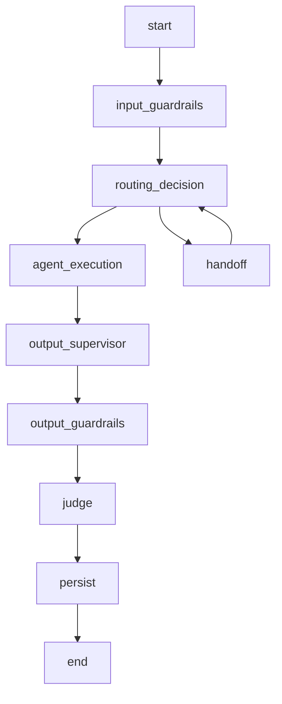
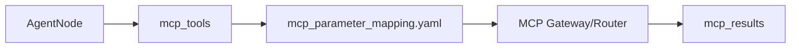
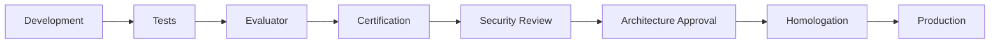

### Routing, Route Stickiness and Intent Shift

### How to use this manual

This is a **specialized reference manual**. It does not replace the main tutorial.

- To build an agent end to end, use [`README_en.md`](../../../README_en.md).
- Use this document when implementing, deep-diving or troubleshooting **routing, stickiness, intent shifts, deterministic/LLM routing and multi-agent isolation**.
- Historical examples consolidated here must be interpreted against the current framework API.
- If documentation differs, the current code and root README take precedence.

### Relationship with the main tutorial

`README_en.md` introduces this capability as part of the normal development flow. This manual consolidates details previously spread across `docs/`, `Documentacao/`, release notes, validation records and specialized guides.

Its purpose is to answer **“how does this feature work in depth and how do I troubleshoot it?”** without becoming a second copy of the main tutorial.

### Scope

Routing, stickiness, intent shifts, deterministic/llm routing and multi-agent isolation.

### Consolidated technical content

### Multi-Agent Routing, Route Stickiness and Intent Shift

This guide defines how the platform selects an agent, preserves continuity and handles an explicit change of intent without trapping the user in the previous route.

### Routing modes

The template supports two architectural modes. **Enterprise Router** performs a routing decision and invokes the selected agent. **Supervisor** uses a supervisor node to coordinate the next agent. The mode is configuration-driven; domain agents should not reimplement routing infrastructure.

### Enterprise routing decision order

Routing should use the cheapest reliable signal first. Deterministic mappings/signals may resolve known intents. If deterministic discovery does not produce a valid route and LLM routing is enabled, the router can ask the configured routing model. This keeps LLM routing as a semantic capability without forcing every turn through an LLM.

### Semantic route stickiness

Route stickiness is a lightweight session-control classification executed before normal routing. It can return:

- `CONTINUE`: keep the active agent.
- `ROUTE`: execute normal Enterprise Router logic.
- `HUMAN_HANDOFF`: enter the global human-handoff node.
- `END_SESSION`: enter the global session-ending node.

The classifier does not answer the user and does not call tools. Low confidence, timeout, invalid JSON or classifier failure falls back to normal routing. `CONTINUE` is valid only when there is an active agent; otherwise it is treated as `ROUTE`.

### Configuration

```env
ENABLE_ROUTE_STICKINESS=true
ROUTE_STICKINESS_LLM_PROFILE=route_continuity
ROUTE_STICKINESS_CONFIDENCE_THRESHOLD=0.90
ROUTE_STICKINESS_HISTORY_TURNS=2
ROUTE_STICKINESS_MAX_TOKENS=80
HUMAN_HANDOFF_MESSAGE=I will transfer your interaction to a person.
END_SESSION_MESSAGE=Interaction ended. Thank you.
```

Example lightweight profile:

```yaml
profiles:
  route_continuity:
    provider: oci_openai
    model: openai.gpt-4.1-mini
    temperature: 0
    max_tokens: 80
    timeout_seconds: 5
```

Use the smallest approved model that reliably classifies continuity in the target environment.

### Why deterministic intent shift still exists

Semantic stickiness cannot be allowed to suppress an explicit user request that clearly targets a different operation. Recent fixes introduced deterministic preemption for unequivocal intent changes before invoking the continuity LLM. This is a performance and correctness optimization, not a replacement for semantic routing.

Typical examples include moving from an informational query to a transactional action or from one tool-backed operation to another within the same agent.

### Routing precedence during an open transaction

An open transaction changes precedence. If the transaction is waiting for a required parameter and the user's message supplies that parameter, parameter extraction/merge wins over intent-shift detection. If the transaction is waiting for confirmation and the user provides an accepted confirmation/rejection, the transaction state machine wins. Only a genuinely explicit unrelated request should interrupt/reroute according to policy.

This prevents values such as a price, invoice identifier or product name from being mistaken for a new intent.

### Global session-control contracts

Human handoff should set a route/intent representing handoff, mark the request in metadata/state and emit the corresponding observability event. Selecting the actual human queue or platform remains an external channel/integration responsibility.

End-session should mark the session as ended and emit the global event. Physically closing an SSE/HTTP/voice/WhatsApp connection and applying TTL/expiration policy remains the responsibility of the channel/backend.

### Failure behavior

- No active agent + `CONTINUE` → route normally.
- Low classifier confidence → route normally.
- Classifier timeout/error/invalid output → route normally.
- Explicit deterministic intent shift → do not let stickiness override it.
- Valid transaction parameter/confirmation → continue transaction before rerouting.

### Testing

Regression coverage should include continuity, domain change, first-turn handoff, first-turn end-session, low confidence, invalid model output, no active agent, explicit intent shift within the same agent, informational→transactional shift and active-transaction parameter precedence.

### Troubleshooting

If the route never changes, inspect the active agent, route-stickiness decision/confidence, deterministic intent-shift signal and current transaction state. If every turn reroutes, verify that the active-agent/session state is being persisted and that the continuity classifier receives the configured history. If routing makes unnecessary LLM calls, verify deterministic discovery/intent-shift is enabled before semantic fallback.

### Source material consolidated

- `Documentacao/Manual de Roteamento Multi-Agent.docx`
- `Documentacao/Route_Stickiness_Semantica_Agent_Framework_OCI.docx`
- `Documentacao/README_ROUTING_MODES.md`
- `Documentacao/README_ENTERPRISE_ROUTING.md`
- intent-shift release notes and route-stickiness test results under `Documentacao/`

### Detailed normative and implementation reference

The sections below preserve the detailed English project specifications and implementation guides relevant to this capability. They are included here so a developer does not need to reconstruct the behavior from separate documents.

### Semantic route stickiness reference

> Consolidated from `Documentacao/README_SEMANTIC_ROUTE_STICKINESS.md`.

### Purpose

This optional capability uses a lightweight LLM profile and no regex, phrase lists, or domain-specific language rules. It classifies each turn as:

- `CONTINUE`: keep the active agent;
- `ROUTE`: run the regular Enterprise Router;
- `HUMAN_HANDOFF`: request human assistance;
- `END_SESSION`: finish the automated session.

The classifier does not answer the user, execute tools, or implement domain rules. Human handoff and session ending are handled by global graph nodes.

### Flow

```text
Incoming turn
  -> lightweight semantic classifier
       CONTINUE + active agent -> active agent
       ROUTE / low confidence / error -> Enterprise Router
       HUMAN_HANDOFF -> human_handoff node
       END_SESSION -> end_session node
```

`CONTINUE` is converted to `ROUTE` when there is no active agent. Global session actions can be detected on the first turn.

### Configuration

```dotenv
ENABLE_ROUTE_STICKINESS=true
ROUTE_STICKINESS_LLM_PROFILE=route_continuity
ROUTE_STICKINESS_CONFIDENCE_THRESHOLD=0.90
ROUTE_STICKINESS_HISTORY_TURNS=2
ROUTE_STICKINESS_MAX_TOKENS=80
HUMAN_HANDOFF_MESSAGE=I will transfer your request to a person.
END_SESSION_MESSAGE=The session has ended. Thank you for contacting us.
```

```yaml
profiles:
  route_continuity:
    provider: oci_openai
    model: openai.gpt-4.1-mini
    temperature: 0
    max_tokens: 80
    timeout_seconds: 5
```

Use the smallest approved model available in the target OCI environment.

### Human handoff contract

The router returns route `human_handoff`, intent `human_handoff`, `handoff=true`, and metadata `session_control=HUMAN_HANDOFF`. The graph node sets:

- `human_handoff_requested=true`;
- `session_ended=false`;
- `next_state=HUMAN_HANDOFF_REQUESTED`.

It emits `session.human_handoff.requested`. The customer integration remains responsible for choosing the human queue and protocol.

### End-session contract

The router returns route `end_session`, intent `end_session`, and metadata `session_control=END_SESSION`. The graph node sets:

- `session_ended=true`;
- `human_handoff_requested=false`;
- `next_state=SESSION_ENDED`.

It emits `session.end.requested`. Channel-specific session expiration or connection closing remains an integration responsibility.

### Safety behavior

- Only decisions above the configured confidence threshold are accepted.
- Invalid JSON, timeout, low confidence, or errors fall back to the Enterprise Router.
- Human handoff and session ending do not execute domain agents or MCP tools.
- The classifier never selects a human queue and never physically closes a channel connection.

### Tests

Run:

```bash
PYTHONPATH=libs/agent_framework/src pytest -q tests/unit/test_semantic_route_stickiness.py
```

The suite covers CONTINUE, ROUTE, low confidence, invalid output, HUMAN_HANDOFF, END_SESSION, first-turn global actions, and CONTINUE without an active agent.

### Runtime routing responsibilities

> Consolidated from `specs/SPEC-002-Agent-Runtime.md`.

### Escopo

O Agent Runtime executa o ciclo de vida conversacional do agente. A execução inclui normalização de contexto, estado LangGraph, memória, checkpoint, roteamento, supervisor, guardrails, MCP, RAG, LLM, judges, persistência e resposta final.

### Componentes

| Componente | Responsabilidade |
|---|---|
| Workflow Builder | Compila o grafo LangGraph. |
| State Manager | Mantém o estado de execução. |
| Session Manager | Resolve sessão e conversation_key. |
| Memory Manager | Carrega e persiste histórico. |
| Checkpoint Manager | Persiste estado LangGraph. |
| Input Guardrail Node | Executa guardrails de entrada. |
| Router Node | Decide rota/intent. |
| Supervisor Node | Decide handoff ou próximo agente quando habilitado. |
| Agent Node | Executa agente de domínio. |
| MCP Client/Router | Executa tools por contrato. |
| RAG Service | Recupera contexto documental. |
| Output Supervisor | Revisa resposta antes de saída. |
| Output Guardrail Node | Executa guardrails de saída. |
| Judge Node | Avalia resposta. |
| Persistence Node | Persiste mensagens, memória e checkpoint. |

### State Model

```python
class AgentState(TypedDict, total=False):
    user_text: str
    sanitized_input: str
    response_text: str
    tenant_id: str
    agent_id: str
    channel: str
    session_id: str
    conversation_key: str
    message_id: str
    route: str
    intent: str
    context: dict
    business_context: dict
    tool_arguments: dict
    mcp_tools: list[str]
    mcp_results: list[dict]
    rag_context: str
    rag_metadata: dict
    guardrails: list[dict]
    judges: list[dict]
    metadata: dict
    errors: list[dict]
```

### Workflow



### Nós

| Nó | Entrada | Saída |
|---|---|---|
| `input_guardrails` | `user_text`, `context` | `sanitized_input`, `guardrails` |
| `routing_decision` | `sanitized_input`, `business_context` | `route`, `intent`, `mcp_tools` |
| `agent_execution` | `state` completo | `response_text`, `mcp_results`, `rag_metadata` |
| `output_supervisor` | `response_text` | `response_text` revisado |
| `output_guardrails` | `response_text` | `response_text`, `guardrails` |
| `judge` | `response_text`, evidências | `judges` |
| `persist` | `state` completo | checkpoint, memória, mensagens |

### Router

```yaml
routing:
  mode: router
  fallback_agent: billing_agent
  enable_llm_router: false
  intents:
    billing_invoice_explanation:
      route: billing_agent
      keywords:
        - fatura
        - cobrança
        - boleto
      mcp_tools:
        - consultar_fatura
        - consultar_pagamentos
```

### Supervisor

```yaml
supervisor:
  enabled: true
  profile: supervisor
  max_turns: 5
  handoff_enabled: true
  fallback_route: support_agent
```

### Memory

| Provider | Uso |
|---|---|
| `memory` | Execução local e testes. |
| `sqlite` | Desenvolvimento local persistente. |
| `mongodb` | Checkpoint e histórico em ambiente distribuído. |
| `autonomous` | Produção com Oracle Autonomous Database. |

### Checkpoints

Checkpoint contém:

```json
{
  "conversation_key": "default:telecom_contas:session-001",
  "checkpoint_id": "ckpt-001",
  "state": {},
  "pending_writes": [],
  "created_at": "2026-06-19T12:00:00Z"
}
```

Formato entregue ao LangGraph:

```python
pending_writes: list[tuple[str, str, object]]
```

### Business Context

```yaml
business_context:
  customer_key: "11999999999"
  contract_key: "3000131180"
  interaction_key: "301953872"
  account_key: null
  resource_key: null
  session_key: "session-001"
  metadata:
    source_channel: web
```

### Ordem de Prioridade dos Dados

1. `tool_arguments`
2. `business_context`
3. `context`
4. `session.metadata`
5. `state`
6. extração complementar do texto

### MCP Integration



### RAG Integration

```yaml
rag:
  enabled: true
  namespace_strategy: agent_id
  top_k: 5
  profile_generation: rag_generation
```

### Eventos

| Evento | Descrição |
|---|---|
| `runtime.started` | Execução iniciada. |
| `runtime.session.loaded` | Sessão carregada. |
| `runtime.memory.loaded` | Memória carregada. |
| `runtime.checkpoint.loaded` | Checkpoint carregado. |
| `runtime.route.selected` | Rota selecionada. |
| `runtime.agent.started` | Agente iniciado. |
| `runtime.agent.completed` | Agente concluído. |
| `runtime.persist.completed` | Persistência concluída. |
| `runtime.failed` | Falha controlada. |

### Erros

| Código | Condição | Tratamento |
|---|---|---|
| `RUNTIME_INVALID_REQUEST` | GatewayRequest inválido | 422 |
| `RUNTIME_ROUTE_NOT_FOUND` | Nenhuma rota elegível | fallback ou resposta controlada |
| `RUNTIME_CHECKPOINT_ERROR` | Falha em checkpoint | retry ou stateless conforme config |
| `RUNTIME_MEMORY_ERROR` | Falha em memória | retry ou resposta controlada |
| `RUNTIME_AGENT_ERROR` | Falha no agente | NOC + fallback |
| `RUNTIME_TIMEOUT` | Timeout geral | resposta controlada |


### Contrato Durável de Estado Transacional

Hosts que utilizam `AgentRuntime` com transações multi-turno DEVEM declarar no `AgentState` os campos `active_transaction` e `last_transaction`. O primeiro é a fonte canônica da transação em andamento e deve sobreviver a checkpoint/resume; o segundo mantém o snapshot da última transação terminal.

```python
active_transaction: dict[str, Any]
last_transaction: dict[str, Any]
```

`selected_tool_call` e `pending_tool_call` são campos auxiliares/compatibilidade e não substituem o latch canônico. Durante `COLLECTING_PARAMETERS`, a retomada da transação e o consumo de parâmetros pendentes têm precedência sobre keyword routing genérico. Uma mudança de intenção só deve interromper a transação quando for inequívoca ou explicitamente solicitada pelo usuário.

O contrato completo, ciclo de vida, precedência de roteamento, checklist e testes regressivos estão em [`docs/TRANSACTION_STATE_DEVELOPER_GUIDE.md`](../docs/TRANSACTION_STATE_DEVELOPER_GUIDE.md).


### Requisitos Não Funcionais

| Categoria | Requisito |
|---|---|
| Disponibilidade | Componentes deployáveis expõem `/health` e `/ready`. |
| Escalabilidade | Apps stateless escalam horizontalmente. Estado conversacional fica em repositórios externos. |
| Segurança | Segredos são fornecidos por secret store ou Kubernetes Secrets. |
| Observabilidade | Logs, métricas e traces usam correlação por request_id, trace_id, session_id, tenant_id e agent_id. |
| Auditabilidade | Decisões de rota, guardrail, judge, MCP e LLM são rastreáveis. |
| Portabilidade | Execução suportada em local, Docker Compose e Kubernetes/OKE. |
| Configuração | Comportamento variável é controlado por `.env` e YAML versionado. |


### Critérios de Aceite

- [ ] Runtime recebe GatewayRequest validado.
- [ ] State contém tenant_id, agent_id, session_id, conversation_key, route e intent.
- [ ] Input guardrails executam antes do roteamento.
- [ ] Router ou Supervisor seleciona rota.
- [ ] Agent Node executa sem acessar payload bruto de canal.
- [ ] MCP é acessado por contrato.
- [ ] RAG é acessado por serviço reutilizável.
- [ ] Output guardrails executam antes da resposta final.
- [ ] Judges geram JudgeResult.
- [ ] Memória e checkpoint são persistidos conforme provider.
- [ ] Hosts transacionais declaram `active_transaction` e `last_transaction` no `AgentState`.
- [ ] Durante `COLLECTING_PARAMETERS`, respostas a parâmetros pendentes têm precedência sobre keyword routing genérico.
- [ ] Erros geram NOC e resposta controlada.


### Glossário

| Termo | Definição |
|---|---|
| Agent Platform | Plataforma composta por runtime, gateways, evaluator, templates, contratos e componentes operacionais. |
| Agent Framework | Biblioteca/core reutilizável com contratos, guardrails, judges, memória, telemetria, providers e utilitários. |
| Agent Runtime | Motor de execução de agentes baseado em LangGraph, estado, sessão, memória, checkpoints, roteamento e ciclo de vida. |
| Agent Gateway | Aplicação deployável de entrada, roteamento e orquestração entre backends/agentes. |
| Channel Gateway | Aplicação ou módulo de normalização de payloads de canais para GatewayRequest. |
| AI Gateway | Aplicação de governança, roteamento e abstração de chamadas LLM/embedding. |
| MCP Gateway | Aplicação de governança e roteamento de tools MCP. |
| Evaluator | Camada de avaliação online/offline, regressão e certificação. |
| Business Context | Conjunto de chaves canônicas de negócio: customer_key, contract_key, interaction_key, account_key, resource_key e session_key. |

### Governance constraints affecting routing

> Consolidated from `specs/SPEC-011-Governance-Model.md`.

### Agent Platform OCI

Version: 1.0.0


---

### Padrão de leitura

Cada SPEC está organizada para servir tanto como contrato arquitetural quanto como guia prático de adoção.

A estrutura usada é:

1. Conceito.
2. Problema que resolve.
3. Quando usar.
4. Quando não usar.
5. Arquitetura.
6. Implementação.
7. Exemplos.
8. Erros comuns.
9. Critérios de aceite.

---


### 1. Conceito

Governança é o conjunto de papéis, responsabilidades, controles, aprovações, evidências e processos que permite que a Agent Platform OCI seja usada por múltiplos times sem perder padronização, segurança, rastreabilidade e capacidade de evolução.

A governança não substitui a engenharia. Ela define como a engenharia evolui de forma controlada.

Em uma plataforma de agentes, governança cobre:

- quem pode criar agentes;
- quem pode alterar prompts;
- quem pode liberar MCP tools;
- quem aprova mudanças de guardrails;
- quem aprova modelos;
- quem aprova datasets;
- quem promove para produção;
- quais evidências são obrigatórias;
- como auditar decisões da plataforma.

### 2. Problema que resolve

Sem governança, cada time tende a criar agentes de forma diferente.

Problemas comuns:

- prompts sem versionamento;
- MCP tools sem owner;
- datasets ausentes;
- agentes sem avaliação;
- produção sem certification;
- mudanças de modelo sem rastreabilidade;
- guardrails duplicados;
- regras de negócio dentro do runtime;
- uso diferente da plataforma por cada fornecedor;
- dificuldade de manutenção.

A governança cria um modelo único de adoção.

### 3. Domínios de governança

| Domínio | Escopo |
| --- | --- |
| Platform Governance | Framework, Runtime, Gateways, Evaluator, Certification Suite. |
| Agent Governance | Agentes, prompts, regras de negócio, datasets e configs. |
| Model Governance | LLM profiles, providers, fallback, custo e uso. |
| MCP Governance | Tools, MCP servers, owners, SLAs, autorização e contratos. |
| Data Governance | BusinessContext, RAG, datasets, memória e retenção. |
| Security Governance | Identidade, autorização, secrets, auditoria e PII. |
| Operational Governance | Deploy, monitoramento, alertas, SLOs e incidentes. |
| Evaluation Governance | Judges, evaluator, certification e métricas. |


### 4. Modelo de ownership

### 4.1. Platform Team

Responsável por:

- Agent Framework;
- Agent Runtime;
- Agent Gateway;
- Channel Gateway;
- AI Gateway;
- MCP Gateway;
- Evaluator;
- Certification Suite;
- contratos canônicos;
- documentação da plataforma;
- templates oficiais.

### 4.2. Domain Team

Responsável por:

- comportamento do agente;
- prompts;
- regras de negócio;
- datasets;
- configurações específicas;
- validação funcional;
- critérios de sucesso.

### 4.3. Integration Team

Responsável por:

- MCP servers;
- APIs externas;
- SLAs de tools;
- contratos de integração;
- credenciais de backend;
- disponibilidade de sistemas externos.

### 4.4. SRE / DevOps

Responsável por:

- CI/CD;
- deploy;
- observabilidade;
- alertas;
- capacidade;
- SLOs;
- runbooks;
- rollback.

### 4.5. Security / Architecture

Responsável por:

- segurança;
- arquitetura;
- policies;
- Workload Identity;
- secrets;
- revisão de risco;
- aprovação de exceções.

### 5. RACI

| Atividade | Platform | Domain | Integration | SRE | Security |
| --- | --- | --- | --- | --- | --- |
| Framework change | R/A | C | I | C | C |
| Runtime change | R/A | C | I | C | C |
| New agent | C | R/A | C | I | I |
| New MCP tool | C | C | R/A | I | C |
| Prompt change | I | R/A | I | I | C |
| Guardrail change | R | C | I | I | A |
| Model profile change | R | C | I | I | C |
| Production deploy | I | C | C | R/A | C |
| Security review | I | C | C | C | R/A |
| Certification | R/A | C | C | I | I |


### 6. Governança de agentes

Todo agente deve possuir:

```yaml
agent:
  id: telecom_contas
  owner: billing_team
  technical_owner: ai_platform_team
  business_objective: "Atendimento sobre faturas, pagamentos e cobranças"
  status: active
  version: 1.0.0
```

Artefatos obrigatórios:

- `agents.yaml`;
- `routing.yaml`;
- `prompt_policy.yaml`;
- `guardrails.yaml`;
- `judges.yaml`;
- `tools.yaml`;
- `mcp_parameter_mapping.yaml`;
- dataset de regressão;
- testes;
- evidências de evaluator;
- evidências de certification.

### 7. Governança de prompts

Prompts devem ser versionados e rastreáveis.

```yaml
prompt:
  name: billing_system_prompt
  version: 1.3.0
  owner: billing_team
  reviewed_at: 2026-06-19
  status: approved
```

Mudanças de prompt exigem:

1. revisão do domain owner;
2. execução de dataset;
3. evaluator;
4. comparação contra baseline;
5. registro da versão.

### 8. Governança de guardrails

Guardrails globais pertencem à plataforma/segurança.

Guardrails por agente pertencem ao domínio, mas precisam seguir o contrato da plataforma.

```yaml
guardrail:
  code: REVPREC
  version: 2.0.0
  owner: platform_security
  phase: output
  mode: enforce
```

Mudanças em guardrails `enforce` exigem certification.

### 9. Governança de judges

Judges devem ter objetivo, métrica, threshold e owner.

```yaml
judge:
  name: groundedness
  version: 1.1.0
  threshold: 0.70
  owner: platform_quality
```

Mudanças de threshold exigem reexecução do evaluator.

### 10. Governança de modelos

Agentes não referenciam modelo diretamente.

O modelo é resolvido por profile.

```yaml
profiles:
  judge:
    provider: oci_openai
    model: openai.gpt-4.1
    temperature: 0
```

Mudanças de modelo exigem:

- validação de custo;
- evaluator;
- validação de qualidade;
- validação de latência;
- atualização de release notes.

### 11. Governança de MCP

Cada tool deve ter owner, SLA, timeout e contrato.

```yaml
tool:
  name: consultar_fatura
  version: 1.0.0
  owner: billing_platform
  sla: p95_2s
  timeout_seconds: 30
  idempotent: true
```

Tools mutáveis exigem política de confirmação.

### 12. Governança de datasets

Datasets são ativos de qualidade.

```yaml
dataset:
  name: telecom_contas_regression
  version: 1.0.0
  owner: billing_team
```

Datasets devem conter:

- entrada;
- BusinessContext;
- rota esperada;
- tools esperadas;
- critérios mínimos;
- casos negativos;
- casos de segurança.

### 13. Processo de aprovação



### 14. Evidências obrigatórias

- relatório de testes;
- relatório evaluator;
- relatório certification;
- trace Langfuse;
- logs e métricas;
- checklist de segurança;
- release notes;
- versão dos artefatos.

### 15. Erros comuns

| Erro | Impacto | Correção |
| --- | --- | --- |
| Prompt sem owner | Dificulta manutenção e aprovação. | Definir owner no metadata. |
| Tool sem SLA | Operação sem expectativa de resposta. | Registrar SLA em tools.yaml. |
| Dataset ausente | Sem regressão objetiva. | Criar dataset mínimo. |
| Guardrail hardcoded | Governança fora do YAML. | Mover para config. |
| Modelo definido no agente | Quebra governança de modelos. | Usar AI Gateway profiles. |


### 16. Critérios de aceite

- [ ] Cada agente possui owner funcional e técnico.
- [ ] Prompts estão versionados.
- [ ] Tools MCP possuem owner, SLA e versão.
- [ ] Guardrails possuem owner e modo.
- [ ] Judges possuem threshold e versão.
- [ ] Datasets estão versionados.
- [ ] Evaluator roda por agente.
- [ ] Certification aprova antes de produção.
- [ ] Release possui evidências.
- [ ] Exceções são documentadas.
