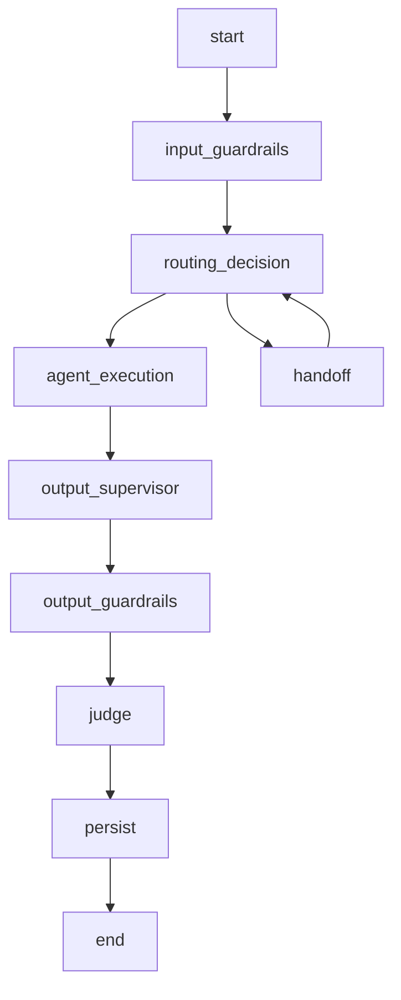
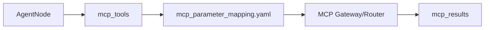

### Transactional Workflows and State

### How to use this manual

This is a **specialized reference manual**. It does not replace the main tutorial.

- To build an agent end to end, use [`README_en.md`](../../../README_en.md).
- Use this document when implementing, deep-diving or troubleshooting **transaction state, parameter collection, confirmation, pause/resume and execution evidence**.
- Historical examples consolidated here must be interpreted against the current framework API.
- If documentation differs, the current code and root README take precedence.

### Relationship with the main tutorial

`README_en.md` introduces this capability as part of the normal development flow. This manual consolidates details previously spread across `docs/`, `Documentacao/`, release notes, validation records and specialized guides.

Its purpose is to answer **“how does this feature work in depth and how do I troubleshoot it?”** without becoming a second copy of the main tutorial.

### Scope

Transaction state, parameter collection, confirmation, pause/resume and execution evidence.

### Consolidated technical content

### Transaction Workflows, Multi-turn State and Resume

This guide is the canonical developer reference for side-effecting multi-turn operations.

### Why a deterministic transaction engine exists

A general-purpose LLM is useful for language understanding and composition, but it should not own the sequence of critical side effects. The framework therefore supports an optional deterministic LangGraph workflow engine. Domain YAML/actions stay with the agent; the framework supplies reusable orchestration and state semantics. Legacy direct-tool execution remains available for agents that have not opted into workflows.

### Canonical transaction state

The transaction object is the source of truth for the active operation. It should explicitly represent the current operation/tool/workflow, collected parameters, missing parameters, confirmation requirement/status, execution result/evidence and lifecycle status such as collecting, awaiting confirmation, executing, completed, failed or cancelled.

Checkpoint persistence is not a substitute for transaction state. A checkpoint may contain historical graph state; the runtime must still identify the canonical active transaction before resuming anything.

### Parameter merge

Parameter collection is incremental. Existing valid parameters remain in the transaction and newly extracted parameters are merged. The runtime must not discard previously collected values just because the latest message contains only one missing field.

When the user supplies a value expected by the active transaction, that parameter is processed before generic intent-shift routing. This is essential for natural language such as a bare amount, date, invoice id or service name.

### Confirmation

A transactional policy may require explicit confirmation. The workflow enters an awaiting-confirmation state and must not invoke the side-effecting MCP tool until confirmation is accepted. Rejection cancels/abandons the operation according to the workflow policy. Unrelated messages may be evaluated for intent shift instead of being coerced into confirmation.

### Pause and resume

A paused workflow resumes from persisted state and the next valid node. Resume logic must verify the active transaction rather than reopening every historical transaction found in checkpoints. Closed/completed/cancelled transactions remain closed.

### Operational evidence

Logical `COMPLETED` state alone is not proof that the external action succeeded. The final state and response should be grounded in execution evidence such as MCP results, returned operation/protocol identifiers or an explicit successful tool result. The framework distinguishes intent to execute, attempted execution and confirmed success.

### Framework versus agent ownership

The framework owns generic lifecycle/state handling, confirmation plumbing, pause/resume mechanics and tool-policy integration. The agent owns the business workflow definition, parameter descriptions, domain validation and tool/action mapping.

### Minimum regression matrix

Test at least: one-parameter collection, multiple parameters across turns, multiple parameters in one sentence, confirmation accept/reject, unrelated message during confirmation, parameter value that resembles an intent, pause/resume, backend restart, completed transaction followed by a new request, explicit transaction interruption, MCP success, MCP error/timeout and no-evidence failure.

### Common anti-patterns

Do not derive active transaction from checkpoint existence alone. Do not reset the full parameter map on each turn. Do not let route stickiness consume a valid transaction parameter. Do not mark success before receiving external evidence. Do not hardcode domain parameter names in shared transaction code.

### Source material consolidated

- `docs/TRANSACTION_STATE_DEVELOPER_GUIDE.md`
- `docs/ADR_TRANSACTIONAL_WORKFLOW_ENGINE.md`
- `Documentacao/IMPLEMENTACAO_WORKFLOWS_TRANSACIONAIS.md`
- `FIX_TRANSACTION_PARAMETER_PRECEDENCE.md`
- `FIX_TRANSACTION_INTENT_LOOP.md`
- `docs/TRANSACTION_OPERATIONAL_EVIDENCE_FIX.md`
- `Documentacao/VALIDACAO_TRANSACIONAL_BACKEND_MCP.md`

### Detailed normative and implementation reference

The sections below preserve the detailed English project specifications and implementation guides relevant to this capability. They are included here so a developer does not need to reconstruct the behavior from separate documents.

### Full multi-turn transaction state developer guide

> Consolidated from `docs/TRANSACTION_STATE_DEVELOPER_GUIDE_en.md`.

This document defines the operational contract for multi-turn transactions in Agent Framework OCI. It is normative for hosts and templates that use `AgentRuntime`, LangGraph checkpoints, and transactional tools.

### 1. Goal

A transaction may span multiple turns:

```text
User: cancel my order
Framework: provide the order number
User: PED-1001
Framework: confirm cancellation?
User: yes
Framework: execute the tool
```

The framework must preserve the transaction across all turns without relying on LLM reclassification, keyword routing, or re-extraction of parameters already collected.

### 2. Canonical transaction state

The canonical in-flight transaction is `active_transaction`.

```python
active_transaction: dict[str, Any]
last_transaction: dict[str, Any]
```

Every `AgentState` used by a host that enables multi-turn transactions **MUST** declare both fields. LangGraph uses the state schema for checkpoint persistence, so a field created dynamically by the runtime alone is not a safe durable contract.

Minimal example:

```python
from typing import Any, TypedDict

class AgentState(TypedDict, total=False):
    # ...normal fields...
    selected_tool_call: dict[str, Any]
    pending_tool_call: dict[str, Any]
    active_transaction: dict[str, Any]
    last_transaction: dict[str, Any]
    transaction_status: str
    missing_parameters: list[str]
    confirmation_required: bool
    confirmation_received: bool
```

### 3. Field responsibilities

| Field | Responsibility | Rule |
|---|---|---|
| `active_transaction` | Canonical in-flight transaction | Must survive checkpoint/resume while active. |
| `last_transaction` | Snapshot of the latest terminal transaction | Used for audit/evidence; does not automatically reactivate a transaction. |
| `transaction_status` | Current logical status | E.g. `COLLECTING_PARAMETERS`, `AWAITING_CONFIRMATION`, `COMPLETED`, `CANCELLED`, `OUT_OF_SCOPE`. |
| `missing_parameters` | Parameters still required | Must reflect canonical transaction state, not only the current message. |
| `selected_tool_call` | Auxiliary/backward-compatible state | Must not replace `active_transaction` as canonical state. |
| `pending_tool_call` | Auxiliary/backward-compatible state | May support compatibility but is not the primary latch. |
| `next_state` | Workflow routing guidance | Keeps the correct node/agent during collection/confirmation. |
| `transaction_pre_validation` | Pre-validation evidence | Stores validation before confirmation/execution. |
| `transaction_evidence` | Execution evidence | Stores results and the transaction execution trail. |

### 4. Recommended lifecycle

```text
IDLE
  ↓ transactional intent
COLLECTING_PARAMETERS
  ↓ complete parameters
PRE_VALIDATION (when configured)
  ↓ eligible
AWAITING_CONFIRMATION
  ↓ positive confirmation
EXECUTING
  ↓
COMPLETED
```

Alternative terminal outcomes include `CANCELLED`, `OUT_OF_SCOPE`, and `FAILED`.

### 5. Incremental parameter merge

A later answer must complement the existing transaction instead of rebuilding it from the latest text only.

```python
existing = dict((state.get("active_transaction") or {}).get("arguments") or {})
new_values = {"amount": "71.99"}
arguments = {**existing, **new_values}
```

Previously collected arguments must remain available on subsequent turns.

### 6. Routing precedence during an active transaction

When `active_transaction` is in `COLLECTING_PARAMETERS`, the message must first be evaluated as a possible answer to pending parameters.

Normative precedence:

1. clearly fills a pending parameter → continue transaction;
2. explicit cancel/abandon → cancel transaction;
3. unambiguous new intent → interrupt and route;
4. generic keyword in the same domain/agent → **do not** interrupt;
5. ambiguous message → keep transaction and clarify.

| Current state | Message | Correct result |
|---|---|---|
| `retail_order_cancel`, missing `order_id` | `PED-1001` | Continue cancellation and fill `order_id`. |
| `retail_order_cancel`, missing `order_id` | `the order is PED-1001` | Continue cancellation; `order` must not switch to tracking. |
| contestation, missing `amount` | `R$ 71.99` | Continue contestation and fill amount. |
| pending cancellation | `forget it, show my bill` | Explicit interruption is allowed. |
| pending cancellation | `track my order` | Unambiguous shift to tracking is allowed. |

### 7. Checkpoint and resume

Before normal routing, restore the checkpoint with the same conversation identity (`tenant_id`, `agent_id`, `session_id`/`conversation_key` according to the host contract).

An active transaction must be resumed before generic keyword routing or LLM continuity. `COLLECTING_PARAMETERS` without `active_transaction` should be treated as inconsistent state and diagnosed rather than silently restarting the tool.

### 8. Framework vs. agent responsibility

Framework owns latch persistence, argument merge, collection/confirmation states, resume precedence, deterministic confirmation, idempotency/evidence, and checkpoint/resume.

The agent owns domain tools, required parameters, domain messages, domain eligibility/pre-validation, and customer-facing final responses. It must not create a parallel transaction engine.

### 9. New host/template checklist

- [ ] `AgentState` declares `active_transaction`.
- [ ] `AgentState` declares `last_transaction`.
- [ ] `transaction_status` and `missing_parameters` are declared when used.
- [ ] Checkpoint provider is compatible with the state schema.
- [ ] The same conversation identity is reused across turns.
- [ ] New parameters are merged with previously collected arguments.
- [ ] Pending parameter answers take precedence over generic keyword routing.
- [ ] Explicit intent shifts remain possible.
- [ ] Transactional agent responses propagate `transaction_state_patch(state)` where required by the template.
- [ ] Multi-turn tests cover collection, confirmation, interruption, and resume.

### 10. Minimum regression tests

Test order cancellation with a pending `order_id`, contestation with a subject collected on the first turn and amount on the second, explicit interruption to a different intent, and checkpoint/resume using the same conversation identity.

### 11. Anti-patterns

- rebuilding the transaction from only the latest message;
- using `selected_tool_call` as the only latch source;
- removing `active_transaction` because it appears redundant;
- allowing a generic keyword such as `order` to interrupt `order_id` collection;
- keeping parameters only in node-local variables;
- duplicating transaction confirmation in the agent prompt;
- clearing the latch before a terminal state.

### 12. Project references

- `specs/SPEC-002-Agent-Runtime.md`
- `specs/SPEC-010-Agent-Development.md`
- `templates/agent_template_backend/app/state.py`
- `libs/agent_framework/src/agent_framework/runtime/agent_runtime.py`
- `libs/agent_framework/src/agent_framework/routing/enterprise_router.py`
- `Tuning-Performance/Deterministic_Transactional_Workflow/`
- `Tuning-Performance/Transaction_Pre_Validation/`
- `Tuning-Performance/Transaction_Evidence/`

### Runtime state and execution model

> Consolidated from `specs/SPEC-002-Agent-Runtime.md`.

### Escopo

O Agent Runtime executa o ciclo de vida conversacional do agente. A execução inclui normalização de contexto, estado LangGraph, memória, checkpoint, roteamento, supervisor, guardrails, MCP, RAG, LLM, judges, persistência e resposta final.

### Componentes

| Componente | Responsabilidade |
|---|---|
| Workflow Builder | Compila o grafo LangGraph. |
| State Manager | Mantém o estado de execução. |
| Session Manager | Resolve sessão e conversation_key. |
| Memory Manager | Carrega e persiste histórico. |
| Checkpoint Manager | Persiste estado LangGraph. |
| Input Guardrail Node | Executa guardrails de entrada. |
| Router Node | Decide rota/intent. |
| Supervisor Node | Decide handoff ou próximo agente quando habilitado. |
| Agent Node | Executa agente de domínio. |
| MCP Client/Router | Executa tools por contrato. |
| RAG Service | Recupera contexto documental. |
| Output Supervisor | Revisa resposta antes de saída. |
| Output Guardrail Node | Executa guardrails de saída. |
| Judge Node | Avalia resposta. |
| Persistence Node | Persiste mensagens, memória e checkpoint. |

### State Model

```python
class AgentState(TypedDict, total=False):
    user_text: str
    sanitized_input: str
    response_text: str
    tenant_id: str
    agent_id: str
    channel: str
    session_id: str
    conversation_key: str
    message_id: str
    route: str
    intent: str
    context: dict
    business_context: dict
    tool_arguments: dict
    mcp_tools: list[str]
    mcp_results: list[dict]
    rag_context: str
    rag_metadata: dict
    guardrails: list[dict]
    judges: list[dict]
    metadata: dict
    errors: list[dict]
```

### Workflow



### Nós

| Nó | Entrada | Saída |
|---|---|---|
| `input_guardrails` | `user_text`, `context` | `sanitized_input`, `guardrails` |
| `routing_decision` | `sanitized_input`, `business_context` | `route`, `intent`, `mcp_tools` |
| `agent_execution` | `state` completo | `response_text`, `mcp_results`, `rag_metadata` |
| `output_supervisor` | `response_text` | `response_text` revisado |
| `output_guardrails` | `response_text` | `response_text`, `guardrails` |
| `judge` | `response_text`, evidências | `judges` |
| `persist` | `state` completo | checkpoint, memória, mensagens |

### Router

```yaml
routing:
  mode: router
  fallback_agent: billing_agent
  enable_llm_router: false
  intents:
    billing_invoice_explanation:
      route: billing_agent
      keywords:
        - fatura
        - cobrança
        - boleto
      mcp_tools:
        - consultar_fatura
        - consultar_pagamentos
```

### Supervisor

```yaml
supervisor:
  enabled: true
  profile: supervisor
  max_turns: 5
  handoff_enabled: true
  fallback_route: support_agent
```

### Memory

| Provider | Uso |
|---|---|
| `memory` | Execução local e testes. |
| `sqlite` | Desenvolvimento local persistente. |
| `mongodb` | Checkpoint e histórico em ambiente distribuído. |
| `autonomous` | Produção com Oracle Autonomous Database. |

### Checkpoints

Checkpoint contém:

```json
{
  "conversation_key": "default:telecom_contas:session-001",
  "checkpoint_id": "ckpt-001",
  "state": {},
  "pending_writes": [],
  "created_at": "2026-06-19T12:00:00Z"
}
```

Formato entregue ao LangGraph:

```python
pending_writes: list[tuple[str, str, object]]
```

### Business Context

```yaml
business_context:
  customer_key: "11999999999"
  contract_key: "3000131180"
  interaction_key: "301953872"
  account_key: null
  resource_key: null
  session_key: "session-001"
  metadata:
    source_channel: web
```

### Ordem de Prioridade dos Dados

1. `tool_arguments`
2. `business_context`
3. `context`
4. `session.metadata`
5. `state`
6. extração complementar do texto

### MCP Integration



### RAG Integration

```yaml
rag:
  enabled: true
  namespace_strategy: agent_id
  top_k: 5
  profile_generation: rag_generation
```

### Eventos

| Evento | Descrição |
|---|---|
| `runtime.started` | Execução iniciada. |
| `runtime.session.loaded` | Sessão carregada. |
| `runtime.memory.loaded` | Memória carregada. |
| `runtime.checkpoint.loaded` | Checkpoint carregado. |
| `runtime.route.selected` | Rota selecionada. |
| `runtime.agent.started` | Agente iniciado. |
| `runtime.agent.completed` | Agente concluído. |
| `runtime.persist.completed` | Persistência concluída. |
| `runtime.failed` | Falha controlada. |

### Erros

| Código | Condição | Tratamento |
|---|---|---|
| `RUNTIME_INVALID_REQUEST` | GatewayRequest inválido | 422 |
| `RUNTIME_ROUTE_NOT_FOUND` | Nenhuma rota elegível | fallback ou resposta controlada |
| `RUNTIME_CHECKPOINT_ERROR` | Falha em checkpoint | retry ou stateless conforme config |
| `RUNTIME_MEMORY_ERROR` | Falha em memória | retry ou resposta controlada |
| `RUNTIME_AGENT_ERROR` | Falha no agente | NOC + fallback |
| `RUNTIME_TIMEOUT` | Timeout geral | resposta controlada |


### Contrato Durável de Estado Transacional

Hosts que utilizam `AgentRuntime` com transações multi-turno DEVEM declarar no `AgentState` os campos `active_transaction` e `last_transaction`. O primeiro é a fonte canônica da transação em andamento e deve sobreviver a checkpoint/resume; o segundo mantém o snapshot da última transação terminal.

```python
active_transaction: dict[str, Any]
last_transaction: dict[str, Any]
```

`selected_tool_call` e `pending_tool_call` são campos auxiliares/compatibilidade e não substituem o latch canônico. Durante `COLLECTING_PARAMETERS`, a retomada da transação e o consumo de parâmetros pendentes têm precedência sobre keyword routing genérico. Uma mudança de intenção só deve interromper a transação quando for inequívoca ou explicitamente solicitada pelo usuário.

O contrato completo, ciclo de vida, precedência de roteamento, checklist e testes regressivos estão em [`docs/TRANSACTION_STATE_DEVELOPER_GUIDE.md`](../docs/TRANSACTION_STATE_DEVELOPER_GUIDE.md).


### Requisitos Não Funcionais

| Categoria | Requisito |
|---|---|
| Disponibilidade | Componentes deployáveis expõem `/health` e `/ready`. |
| Escalabilidade | Apps stateless escalam horizontalmente. Estado conversacional fica em repositórios externos. |
| Segurança | Segredos são fornecidos por secret store ou Kubernetes Secrets. |
| Observabilidade | Logs, métricas e traces usam correlação por request_id, trace_id, session_id, tenant_id e agent_id. |
| Auditabilidade | Decisões de rota, guardrail, judge, MCP e LLM são rastreáveis. |
| Portabilidade | Execução suportada em local, Docker Compose e Kubernetes/OKE. |
| Configuração | Comportamento variável é controlado por `.env` e YAML versionado. |


### Critérios de Aceite

- [ ] Runtime recebe GatewayRequest validado.
- [ ] State contém tenant_id, agent_id, session_id, conversation_key, route e intent.
- [ ] Input guardrails executam antes do roteamento.
- [ ] Router ou Supervisor seleciona rota.
- [ ] Agent Node executa sem acessar payload bruto de canal.
- [ ] MCP é acessado por contrato.
- [ ] RAG é acessado por serviço reutilizável.
- [ ] Output guardrails executam antes da resposta final.
- [ ] Judges geram JudgeResult.
- [ ] Memória e checkpoint são persistidos conforme provider.
- [ ] Hosts transacionais declaram `active_transaction` e `last_transaction` no `AgentState`.
- [ ] Durante `COLLECTING_PARAMETERS`, respostas a parâmetros pendentes têm precedência sobre keyword routing genérico.
- [ ] Erros geram NOC e resposta controlada.


### Glossário

| Termo | Definição |
|---|---|
| Agent Platform | Plataforma composta por runtime, gateways, evaluator, templates, contratos e componentes operacionais. |
| Agent Framework | Biblioteca/core reutilizável com contratos, guardrails, judges, memória, telemetria, providers e utilitários. |
| Agent Runtime | Motor de execução de agentes baseado em LangGraph, estado, sessão, memória, checkpoints, roteamento e ciclo de vida. |
| Agent Gateway | Aplicação deployável de entrada, roteamento e orquestração entre backends/agentes. |
| Channel Gateway | Aplicação ou módulo de normalização de payloads de canais para GatewayRequest. |
| AI Gateway | Aplicação de governança, roteamento e abstração de chamadas LLM/embedding. |
| MCP Gateway | Aplicação de governança e roteamento de tools MCP. |
| Evaluator | Camada de avaliação online/offline, regressão e certificação. |
| Business Context | Conjunto de chaves canônicas de negócio: customer_key, contract_key, interaction_key, account_key, resource_key e session_key. |

### Canonical state contracts

> Consolidated from `specs/SPEC-012-Canonical-Contracts.md`.

### Agent Platform OCI

Version: 1.0.0


---

### Padrão de leitura

Cada SPEC está organizada para servir tanto como contrato arquitetural quanto como guia prático de adoção.

A estrutura usada é:

1. Conceito.
2. Problema que resolve.
3. Quando usar.
4. Quando não usar.
5. Arquitetura.
6. Implementação.
7. Exemplos.
8. Erros comuns.
9. Critérios de aceite.

---


### 1. Conceito

Contratos canônicos são estruturas padronizadas usadas para desacoplar canais, gateways, runtime, agentes, tools, LLMs, evaluator e observabilidade.

A plataforma usa contratos para garantir que componentes independentes possam evoluir sem quebrar uns aos outros.

### 2. Problema que resolve

Sem contratos:

- cada canal envia payload diferente;
- agentes passam a conhecer WhatsApp, Voice, Teams ou CRM;
- MCP tools recebem parâmetros inconsistentes;
- LLM calls ficam acopladas ao provider;
- evaluator não consegue comparar respostas;
- observabilidade fica fragmentada.

Com contratos:

```text
Canal → GatewayRequest → Runtime → BusinessContext → ToolInvocation → ToolResult
```

### 3. Catálogo de contratos

| Contrato | Uso |
| --- | --- |
| GatewayRequest | Entrada canônica da plataforma. |
| ChannelResponse | Resposta canônica ao canal. |
| BusinessContext | Identidade canônica de negócio. |
| AgentState | Estado interno do runtime. |
| Session | Sessão técnica/conversacional. |
| Checkpoint | Persistência de estado LangGraph. |
| ToolInvocation | Chamada canônica de tool MCP. |
| ToolResult | Resposta canônica de tool MCP. |
| LLMRequest | Chamada canônica ao AI Gateway. |
| LLMResponse | Resposta canônica do AI Gateway. |
| EvaluationRun | Execução do evaluator. |
| EvaluationResult | Resultado de avaliação. |
| CertificationResult | Resultado de certificação. |
| EventEnvelope | Envelope de eventos IC/NOC/GRL. |


### 4. GatewayRequest

### 4.1. Uso

Usado por Channel Gateway e Agent Gateway para enviar mensagens ao Runtime.

```json
{
  "channel": "web",
  "tenant_id": "default",
  "agent_id": "telecom_contas",
  "payload": {
    "message": "Quero consultar minha fatura",
    "session_id": "session-001",
    "user_id": "user-001",
    "message_id": "msg-001",
    "business_context": {
      "customer_key": "11999999999",
      "contract_key": "3000131180",
      "interaction_key": "301953872",
      "session_key": "session-001"
    },
    "metadata": {
      "request_id": "req-001",
      "contract_version": "gateway-request-v1"
    }
  }
}
```

### 4.2. Campos obrigatórios

- `channel`;
- `payload.message`;
- `payload.session_id`;
- `payload.message_id`;
- `tenant_id` quando multi-tenant;
- `agent_id` quando não houver roteamento global.

### 5. ChannelResponse

```json
{
  "channel": "web",
  "session_id": "default:telecom_contas:session-001",
  "text": "Resposta final do agente.",
  "metadata": {
    "tenant_id": "default",
    "agent_id": "telecom_contas",
    "route": "billing_agent",
    "intent": "billing_invoice_explanation",
    "guardrails": [],
    "judges": []
  }
}
```

### 6. BusinessContext

### 6.1. Uso

BusinessContext transporta identidade de negócio sem acoplar a plataforma ao formato de cada canal.

```yaml
business_context:
  customer_key: "11999999999"
  contract_key: "3000131180"
  interaction_key: "301953872"
  account_key: null
  resource_key: null
  session_key: "session-001"
  metadata:
    source_channel: web
```

### 6.2. Mapeamento para MCP

```yaml
tools:
  consultar_fatura:
    map:
      customer_key: msisdn
      contract_key: invoice_id
      interaction_key: ura_call_id
      session_key: session_id
```

### 7. AgentState

```python
class AgentState(TypedDict, total=False):
    user_text: str
    sanitized_input: str
    response_text: str
    tenant_id: str
    agent_id: str
    channel: str
    session_id: str
    conversation_key: str
    message_id: str
    route: str
    intent: str
    business_context: dict
    mcp_tools: list[str]
    mcp_results: list[dict]
    rag_context: str
    guardrails: list[dict]
    judges: list[dict]
```

### 8. ToolInvocation

```json
{
  "tenant_id": "default",
  "agent_id": "telecom_contas",
  "tool_name": "consultar_fatura",
  "arguments": {
    "msisdn": "11999999999",
    "invoice_id": "3000131180"
  },
  "business_context": {
    "customer_key": "11999999999",
    "contract_key": "3000131180"
  },
  "metadata": {
    "request_id": "req-001",
    "trace_id": "trace-001"
  }
}
```

### 9. ToolResult

```json
{
  "tool_name": "consultar_fatura",
  "ok": true,
  "data": {
    "invoice_id": "3000131180",
    "valor_total": 249.90,
    "status": "ABERTA"
  },
  "cache": {
    "hit": false,
    "ttl_seconds": 300
  },
  "latency_ms": 140
}
```

### 10. LLMRequest

```json
{
  "tenant_id": "default",
  "agent_id": "telecom_contas",
  "profile": "judge",
  "operation": "judge.response_quality",
  "messages": [
    {"role": "system", "content": "Você é um avaliador."},
    {"role": "user", "content": "Avalie a resposta."}
  ],
  "metadata": {
    "request_id": "req-001",
    "trace_id": "trace-001"
  }
}
```

### 11. LLMResponse

```json
{
  "provider": "oci_openai",
  "model": "openai.gpt-4.1",
  "profile": "judge",
  "content": "Resultado",
  "usage": {
    "input_tokens": 1200,
    "output_tokens": 300,
    "total_tokens": 1500
  },
  "latency_ms": 820
}
```

### 12. EvaluationRun

```json
{
  "run_id": "eval-001",
  "agent_id": "telecom_contas",
  "source": "langfuse",
  "period_start": "2026-06-18T00:00:00Z",
  "period_end": "2026-06-19T00:00:00Z",
  "status": "running"
}
```

### 13. EventEnvelope

```json
{
  "event_type": "IC.AGENT_COMPLETED",
  "timestamp": "2026-06-19T12:00:00Z",
  "tenant_id": "default",
  "agent_id": "telecom_contas",
  "session_id": "session-001",
  "trace_id": "trace-001",
  "payload": {}
}
```

### 14. Regras de evolução

- campos novos devem ser opcionais;
- campos obrigatórios não podem ser removidos dentro da mesma major;
- mudança semântica exige nova versão;
- contratos são versionados independentemente.

### 15. Erros comuns

| Erro | Impacto | Correção |
| --- | --- | --- |
| Payload bruto no Runtime | Acopla canais ao core. | Usar GatewayRequest. |
| Tool recebendo BusinessContext bruto sem mapping | Quebra contrato da tool. | Usar mcp_parameter_mapping.yaml. |
| LLM direto no agente | Quebra AI Gateway. | Usar LLMRequest/profile. |
| Campos sem versão | Dificulta migração. | Declarar contract_version. |


### 16. Critérios de aceite

- [ ] GatewayRequest documentado e versionado.
- [ ] ChannelResponse documentado e versionado.
- [ ] BusinessContext usado por canais e MCP.
- [ ] ToolInvocation e ToolResult padronizados.
- [ ] LLMRequest e LLMResponse padronizados.
- [ ] EvaluationRun e EvaluationResult padronizados.
- [ ] EventEnvelope usado para IC/NOC/GRL.
- [ ] Contratos possuem regras de evolução.
