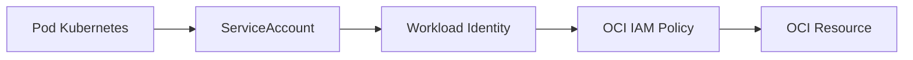

### Agent Gateway, MCP Gateway and Authentication

### How to use this manual

This is a **specialized reference manual**. It does not replace the main tutorial.

- To build an agent end to end, use [`README_en.md`](../../../README_en.md).
- Use this document when implementing, deep-diving or troubleshooting **ingress governance, gateways, MCP catalog and component authentication**.
- Historical examples consolidated here must be interpreted against the current framework API.
- If documentation differs, the current code and root README take precedence.

### Relationship with the main tutorial

`README_en.md` introduces this capability as part of the normal development flow. This manual consolidates details previously spread across `docs/`, `Documentacao/`, release notes, validation records and specialized guides.

Its purpose is to answer **“how does this feature work in depth and how do I troubleshoot it?”** without becoming a second copy of the main tutorial.

### Scope

Ingress governance, gateways, mcp catalog and component authentication.

### Consolidated technical content

### Agent Gateway, MCP Gateway, Local Execution and Basic Auth

This is the operational integration guide for the two gateways and the reference backend/frontend.

### Responsibility model

The Agent Gateway is the governed ingress for agent requests. It may apply authentication, routing/governance metadata, model/profile policy, rate limits, audit and evaluation hooks before calling the agent backend.

The agent backend/runtime executes the LangGraph workflow and agent logic.

The MCP Gateway is the centralized tool catalog/execution boundary. It talks to one or more MCP Servers and applies tool-level governance such as server mapping, catalog synchronization, timeout/retry/cache behavior and authentication.

### Expected local chain

Client/Frontend → Agent Gateway → Agent Template Backend → MCP Gateway → MCP Server(s).

Each component should be started and tested independently before validating the full chain. Do not configure the backend to bypass the MCP Gateway when centralized governance is expected.

### MCP discovery

Discovery is automatic only for servers explicitly registered with discovery enabled. The gateway fetches their manifest/catalog, normalizes discovered tools and merges them with static configuration. Discovery does not scan the network or repository for arbitrary MCP Servers.

Static tool definitions have precedence over discovered metadata with the same tool name, allowing explicit operational overrides.

The gateway exposes endpoints to inspect discovery servers, force synchronization and list the merged tool catalog. Use these endpoints before debugging an agent prompt when a tool appears to be missing.

### Basic Auth trust boundaries

Use separate credential pairs for each hop:

1. external client/TIA → Agent Gateway;
2. Agent Gateway → agent backend;
3. agent backend → MCP Gateway.

Each receiving component validates its own pair; each sending component is configured with the downstream credentials. This separation allows credentials to be rotated independently and makes failures diagnosable by hop.

Do not confuse inbound credentials with outbound credentials. A working login to the Agent Gateway says nothing about the gateway's credentials for the backend.

### Startup validation sequence

1. Start MCP Servers and call each `/health` endpoint.
2. Start MCP Gateway and inspect health + merged tool list.
3. Start agent backend and verify it points to the MCP Gateway.
4. Start Agent Gateway and verify backend connectivity.
5. Start frontend/channel integration and verify it targets the Agent Gateway.
6. Run an end-to-end read-only tool call.
7. Run a transactional policy/confirmation test if applicable.

### Troubleshooting by symptom

**MCP tool absent from catalog:** verify server registration, `enabled`, discovery flag, manifest endpoint and sync result; then check static/discovered name collisions.

**Backend calls MCP Server directly:** correct the MCP base URL so the runtime targets MCP Gateway, not a domain server.

**Agent Gateway cannot reach backend:** verify backend URL/port, container DNS, inbound backend credentials and gateway outbound credentials.

**401 on external request:** validate client→Agent Gateway pair.

**401 between gateway and backend:** validate Agent Gateway outbound pair and backend inbound pair.

**401 from backend to MCP Gateway:** validate backend outbound pair and MCP Gateway inbound pair.

**Frontend uses wrong port:** treat frontend URL configuration as a channel concern and keep it pointed at Agent Gateway in the governed topology.

### Source material consolidated

- `Documentacao/MANUAL_AGENT_PLATFORM_GATEWAYS.md`
- `Documentacao/MANUAL_EXECUCAO_AGENT_GATEWAY_MCP_GATEWAY_FRONTEND.md`
- `Documentacao/Implementando_Basic_Auth.md`
- `docs/MCP_GATEWAY_DISCOVERY.md`
- `Documentacao/MCP_GATEWAY_RUNBOOK.md`
- `Documentacao/README_AGENT_GATEWAY_AND_MCP_GATEWAY_EVOLUTION.md`
- `Documentacao/INVENTARIO_AGENT_GATEWAY_MCP_GATEWAY.md`

### Detailed normative and implementation reference

The sections below preserve the detailed English project specifications and implementation guides relevant to this capability. They are included here so a developer does not need to reconstruct the behavior from separate documents.

### MCP Gateway discovery and catalog sync

> Consolidated from `docs/MCP_GATEWAY_DISCOVERY.md`.

### Goal

This evolution allows the MCP Gateway to discover tools from registered MCP Servers by reading a manifest or catalog endpoint.

The framework still points to a single MCP Gateway:

```env
MCP_GATEWAY_ENABLED=true
MCP_GATEWAY_URL=http://localhost:8300
MCP_GATEWAY_TIMEOUT_SECONDS=60
```

The MCP Gateway can point to many MCP Servers:

```text
Agent Framework
  -> MCP Gateway
     -> telecom_mcp_server
     -> retail_mcp_server
     -> nf_items_mcp_server
     -> any other MCP Server
```

### What is automatic

After a server is registered in `apps/mcp_gateway/config/mcp_gateway.yaml` with `discover: true`, the gateway can:

- call its manifest/catalog endpoint;
- normalize the returned tool list;
- publish the tools in `GET /v1/tools`;
- execute the discovered tool through `POST /v1/tools/{tool_name}/invoke`.

### What is still explicit

The gateway does not scan the network or GitHub by itself. You still register the MCP Server endpoint in YAML.

Example:

```yaml
servers:
  nf_items:
    enabled: true
    discover: true
    protocol: legacy_http
    transport: http
    url: http://localhost:8400/mcp
    catalog_endpoint: /tools
    invoke_endpoint: /tools/call
    timeout_seconds: 30
```

If `catalog_endpoint` is omitted, the gateway tries:

```text
/.well-known/mcp-server.json
/manifest
/mcp/tools
/tools/list
/tools
/v1/tools
```

### Expected manifest/catalog formats

The gateway accepts common shapes:

```json
{
  "server_id": "nf_items",
  "tools": [
    {
      "name": "buscar_notas_por_criterios",
      "description": "Search invoice items by criteria.",
      "input_schema": {
        "cliente": "string",
        "estado": "string",
        "preco": "number",
        "ean": "string",
        "margem": "number"
      }
    }
  ]
}
```

It also accepts:

```json
{"tools": [...]}
```

```json
{"data": {"tools": [...]}}
```

```json
{"capabilities": {"tools": [...]}}
```

### New endpoints

### List discovery servers

```bash
curl http://localhost:8300/v1/discovery/servers | jq
```

### Force catalog sync

```bash
curl -X POST http://localhost:8300/v1/discovery/sync | jq
```

### List merged static + discovered tools

```bash
curl http://localhost:8300/v1/tools | jq
```

### Precedence rule

Static tools configured under `tools:` override discovered tools with the same name. This allows operations teams to override timeout, cache, allowed agents, required business keys, and endpoint behavior safely.

### Plugging a new MCP Server

1. Start the MCP Server.
2. Confirm that it exposes a catalog or manifest endpoint.
3. Add it under `servers:` in `mcp_gateway.yaml` with `discover: true`.
4. Restart the MCP Gateway or call `POST /v1/discovery/sync`.
5. Confirm the tool appears in `GET /v1/tools`.
6. Invoke the tool through the gateway.

### Example invocation

```bash
curl -s -X POST http://localhost:8300/v1/tools/buscar_notas_por_criterios/invoke \
  -H "Content-Type: application/json" \
  -d '{
    "tenant_id": "default",
    "agent_id": "telecom_contas",
    "channel": "web",
    "tool_name": "buscar_notas_por_criterios",
    "arguments": {
      "cliente": "CLIENTE-001",
      "estado": "SP",
      "preco": 100.0,
      "ean": "7890000000000",
      "margem": 0.05
    },
    "business_context": {
      "session_key": "session-001"
    }
  }' | jq
```

### Agent Gateway specification

> Consolidated from `specs/SPEC-003-Agent-Gateway.md`.

### Escopo

O Agent Gateway é o ponto único de entrada da plataforma para canais e consumidores externos.

Sua responsabilidade é receber mensagens, gerenciar sessões globais, resolver o backend/agente responsável, executar roteamento, realizar handoff entre agentes/backends e encaminhar eventos SSE.

O Agent Gateway não executa inferência LLM nem embeddings. Essas capacidades pertencem ao Runtime e ao Agent Framework.

---

### Responsabilidades

### Entrada Única da Plataforma

```text
Web
WhatsApp
Voice
Teams
Slack
      |
      v
Agent Gateway
      |
      +--> Agent Backend A
      |
      +--> Agent Backend B
      |
      +--> Agent Backend C
```

### Gerenciamento de Sessões

Responsável por:

- Criação de sessões
- Recuperação de sessões
- Atualização de contexto global
- Persistência de metadados de sessão
- Correlação de requisições

Exemplo:

```json
{
  "session_id": "default:telecom_contas:123",
  "tenant_id": "default",
  "active_backend": "telecom_contas",
  "active_agent": "telecom_contas",
  "turn_count": 12,
  "metadata": {}
}
```

---

### Backend Routing

Resolve qual backend deve processar a mensagem.

Exemplo:

```yaml
backends:
  telecom_contas:
    url: http://backend-contas:8000

  telecom_ofertas:
    url: http://backend-ofertas:8000
```

Critérios possíveis:

- Backend padrão
- Regras YAML
- Intenção detectada
- Contexto da sessão
- Router LLM (opcional)

---

### Handoff

Permite transferência entre agentes ou backends.

Exemplo:

```text
Contas
   |
   +--> Ofertas
   |
   +--> Retenção
```

O handoff deve preservar:

- session_id
- conversation_key
- business context
- histórico da conversa
- metadados de correlação

---

### SSE Proxy

Responsável por encaminhar eventos de streaming para clientes.

### Endpoints

| Método | Endpoint |
|----------|----------|
| POST | /gateway/message |
| POST | /gateway/message/sse |
| GET | /gateway/events/{session_id} |

Eventos SSE suportados:

- connected
- workflow.started
- message.responded
- workflow.completed
- flow.end
- error

---

### Backend Discovery

Pode operar com catálogo estático ou descoberta dinâmica.

### Catálogo Estático

```yaml
backends:
  telecom_contas:
    url: http://contas:8000

  telecom_ofertas:
    url: http://ofertas:8000
```

### Descoberta Dinâmica

```yaml
service_discovery:
  enabled: true
```

Capacidades:

- Registro automático
- Health check periódico
- Atualização de catálogo
- Sincronização de metadados

---

### Health e Operação

### Endpoints

| Método | Endpoint |
|----------|----------|
| GET | /health |
| GET | /ready |
| GET | /backends |
| GET | /debug/sessions |

---

### Contrato GatewayRequest

```json
{
  "tenant_id": "default",
  "agent_id": "telecom_contas",
  "session_id": "default:telecom_contas:123",
  "message": "Quero consultar minha fatura",
  "business_context": {
    "customer_key": "11999999999"
  },
  "metadata": {
    "request_id": "req-001",
    "trace_id": "trace-001"
  }
}
```

---

### Contrato GatewayResponse

```json
{
  "session_id": "default:telecom_contas:123",
  "backend": "telecom_contas",
  "agent": "telecom_contas",
  "message": "Sua fatura está disponível.",
  "metadata": {
    "request_id": "req-001"
  }
}
```

---

### Eventos

| Evento | Descrição |
|----------|----------|
| agent.gateway.request.received | Requisição recebida |
| agent.gateway.session.created | Sessão criada |
| agent.gateway.backend.selected | Backend selecionado |
| agent.gateway.handoff.started | Handoff iniciado |
| agent.gateway.handoff.completed | Handoff concluído |
| agent.gateway.sse.connected | Cliente SSE conectado |
| agent.gateway.request.failed | Falha de processamento |

---

### Métricas

| Métrica | Dimensões |
|----------|----------|
| gateway_requests_total | tenant, backend, agent, status |
| gateway_sessions_active | tenant |
| gateway_backend_selection_total | backend |
| gateway_handoff_total | origem, destino |
| gateway_latency_ms | backend |
| gateway_sse_connections | backend |

---

### Segurança

- Autenticação obrigatória quando configurada.
- Propagação de identidade entre gateways.
- Máscara de dados sensíveis em logs.
- Correlação por request_id, trace_id e session_id.
- Controle de acesso por tenant.

---

### Requisitos Não Funcionais

| Categoria | Requisito |
|----------|----------|
| Disponibilidade | Expor /health e /ready |
| Escalabilidade | Stateless com escala horizontal |
| Observabilidade | Logs, métricas e traces |
| Auditabilidade | Todas as decisões de roteamento rastreáveis |
| Segurança | Segredos externos e mascaramento |
| Portabilidade | Local, Docker e Kubernetes |
| Configuração | YAML e variáveis de ambiente |

---

### Critérios de Aceite

- [ ] Recebe mensagens de múltiplos canais.
- [ ] Seleciona backend corretamente.
- [ ] Mantém sessão global.
- [ ] Encaminha SSE.
- [ ] Executa handoff.
- [ ] Preserva Business Context.
- [ ] Suporta múltiplos backends.
- [ ] Permite descoberta dinâmica.
- [ ] Expõe health e readiness.
- [ ] Gera métricas e telemetria.

### MCP Gateway specification

> Consolidated from `specs/SPEC-004-MCP-Gateway.md`.

### Escopo

O MCP Gateway centraliza catálogo, autorização, roteamento, execução, cache, timeout, retry, observabilidade e resposta padronizada de tools MCP.

### Endpoints

| Método | Endpoint | Descrição |
|---|---|---|
| `GET` | `/health` | Health check. |
| `GET` | `/ready` | Readiness check. |
| `GET` | `/v1/tools` | Catálogo de tools. |
| `GET` | `/v1/tools/{tool_name}` | Detalhe da tool. |
| `POST` | `/v1/tools/{tool_name}/invoke` | Execução de tool. |
| `GET` | `/v1/servers` | Lista MCP servers. |

### ToolInvocation

```json
{
  "tenant_id": "default",
  "agent_id": "telecom_contas",
  "tool_name": "consultar_fatura",
  "arguments": {
    "msisdn": "11999999999",
    "invoice_id": "3000131180",
    "session_id": "default:telecom_contas:session-001"
  },
  "business_context": {
    "customer_key": "11999999999",
    "contract_key": "3000131180",
    "session_key": "session-001"
  },
  "metadata": {
    "request_id": "req-001",
    "trace_id": "trace-001"
  }
}
```

### ToolResult

```json
{
  "tool_name": "consultar_fatura",
  "ok": true,
  "data": {
    "invoice_id": "3000131180",
    "valor_total": 249.90,
    "vencimento": "2026-06-10",
    "status": "ABERTA"
  },
  "cache": {
    "hit": false,
    "ttl_seconds": 300
  },
  "latency_ms": 140,
  "metadata": {
    "server": "telecom"
  }
}
```

### mcp_servers.yaml

```yaml
servers:
  telecom:
    transport: http
    url: http://telecom-mcp:8001/mcp
    enabled: true
    timeout_seconds: 30

  retail:
    transport: http
    url: http://retail-mcp:8002/mcp
    enabled: true
    timeout_seconds: 30
```

### tools.yaml

```yaml
tools:
  consultar_fatura:
    server: telecom
    enabled: true
    idempotent: true
    cache_ttl_seconds: 300
    allowed_agents:
      - telecom_contas
    required_business_keys:
      - customer_key
      - contract_key

  solicitar_devolucao:
    server: retail
    enabled: true
    idempotent: false
    requires_confirmation: true
    allowed_agents:
      - retail_orders
```

### mcp_parameter_mapping.yaml

```yaml
tools:
  consultar_fatura:
    map:
      customer_key: msisdn
      contract_key: invoice_id
      interaction_key: ura_call_id
      session_key: session_id
```

### Autorização

```yaml
authorization:
  default_policy: deny
  agents:
    telecom_contas:
      allowed_tools:
        - consultar_fatura
        - consultar_pagamentos
        - consultar_plano
```

### Cache

| Regra | Valor |
|---|---|
| Chave | `tenant_id:agent_id:tool_name:hash(arguments)` |
| Aplicação | Apenas tools idempotentes |
| Bypass | `metadata.cache_bypass=true` |
| TTL | `cache_ttl_seconds` |
| Escrita | Não cachear operações mutáveis |

### Retry e Timeout

```yaml
execution:
  default_timeout_seconds: 30
  retry:
    enabled: true
    max_attempts: 2
    backoff_ms: 250
  circuit_breaker:
    enabled: true
    failure_threshold: 5
    recovery_seconds: 60
```

### Eventos

| Evento | Descrição |
|---|---|
| `mcp.tool.requested` | Tool requisitada. |
| `mcp.tool.authorized` | Autorização aprovada. |
| `mcp.tool.denied` | Autorização negada. |
| `mcp.tool.started` | Execução iniciada. |
| `mcp.tool.completed` | Execução concluída. |
| `mcp.tool.failed` | Execução falhou. |
| `mcp.cache.hit` | Cache hit. |
| `mcp.cache.miss` | Cache miss. |

### Métricas

| Métrica | Dimensões |
|---|---|
| `mcp_tool_calls_total` | tool, server, tenant, agent, status |
| `mcp_tool_latency_ms` | tool, server |
| `mcp_tool_errors_total` | tool, server, error_type |
| `mcp_cache_hits_total` | tool |
| `mcp_cache_misses_total` | tool |

### Segurança

- Tools são negadas por padrão.
- Argumentos sensíveis são mascarados.
- Tools mutáveis exigem confirmação quando configurado.
- MCP servers não recebem payload bruto de canal.
- Credenciais de backend são mantidas nos MCP servers ou secret store.


### Requisitos Não Funcionais

| Categoria | Requisito |
|---|---|
| Disponibilidade | Componentes deployáveis expõem `/health` e `/ready`. |
| Escalabilidade | Apps stateless escalam horizontalmente. Estado conversacional fica em repositórios externos. |
| Segurança | Segredos são fornecidos por secret store ou Kubernetes Secrets. |
| Observabilidade | Logs, métricas e traces usam correlação por request_id, trace_id, session_id, tenant_id e agent_id. |
| Auditabilidade | Decisões de rota, guardrail, judge, MCP e LLM são rastreáveis. |
| Portabilidade | Execução suportada em local, Docker Compose e Kubernetes/OKE. |
| Configuração | Comportamento variável é controlado por `.env` e YAML versionado. |


### Critérios de Aceite

- [ ] Catálogo de tools retorna tools habilitadas.
- [ ] ToolInvocation é validado antes da execução.
- [ ] Autorização por agente é aplicada.
- [ ] Parâmetros são derivados do BusinessContext.
- [ ] Cache só é aplicado a tools idempotentes.
- [ ] Timeout/retry/circuit breaker são configuráveis.
- [ ] Eventos e métricas são emitidos.
- [ ] Falhas retornam ToolResult padronizado.
- [ ] MCP servers são substituíveis por configuração.
- [ ] Tools críticas possuem testes de contrato.


### Glossário

| Termo | Definição |
|---|---|
| Agent Platform | Plataforma composta por runtime, gateways, evaluator, templates, contratos e componentes operacionais. |
| Agent Framework | Biblioteca/core reutilizável com contratos, guardrails, judges, memória, telemetria, providers e utilitários. |
| Agent Runtime | Motor de execução de agentes baseado em LangGraph, estado, sessão, memória, checkpoints, roteamento e ciclo de vida. |
| Agent Gateway | Aplicação deployável de entrada, roteamento e orquestração entre backends/agentes. |
| Channel Gateway | Aplicação ou módulo de normalização de payloads de canais para GatewayRequest. |
| AI Gateway | Aplicação de governança, roteamento e abstração de chamadas LLM/embedding. |
| MCP Gateway | Aplicação de governança e roteamento de tools MCP. |
| Evaluator | Camada de avaliação online/offline, regressão e certificação. |
| Business Context | Conjunto de chaves canônicas de negócio: customer_key, contract_key, interaction_key, account_key, resource_key e session_key. |

### Política mínima de operação

Antes de encaminhar uma tool, o runtime deve aplicar a política opcional do backend em `config/tool_policies.yaml`. Os tipos canônicos são `read_only` e `transactional`; esta última pode exigir confirmação booleana explícita e campos obrigatórios. A ausência do arquivo não é erro e preserva os campos legados de `tools.yaml`. A política conversacional não substitui autenticação, autorização, idempotência nem atomicidade no MCP Server.

### Security and identity model

> Consolidated from `specs/SPEC-018-Security-and-Identity-Model.md`.

### Agent Platform OCI

Version: 1.0.0


---

### Padrão de leitura

Cada SPEC está organizada para servir tanto como contrato arquitetural quanto como guia prático de adoção.

A estrutura usada é:

1. Conceito.
2. Problema que resolve.
3. Quando usar.
4. Quando não usar.
5. Arquitetura.
6. Implementação.
7. Exemplos.
8. Erros comuns.
9. Critérios de aceite.

---


### 1. Conceito

Security and Identity Model define como workloads autenticam, como componentes autorizam ações, como segredos são protegidos e como dados sensíveis são tratados.

### 2. Modelos de autenticação

| Modo | Uso |
| --- | --- |
| config_file | Desenvolvimento local com ~/.oci/config. |
| instance_principal | Execução em OCI Compute. |
| workload_identity | Execução em OKE/Kubernetes. |
| resource_principal | Recursos OCI gerenciados. |
| api_key | Endpoints compatíveis com OpenAI quando aplicável. |


### 3. Workload Identity

Fluxo:



### 4. Autorização

Escopos:

- agente pode chamar tool?
- tenant pode usar provider?
- canal pode chamar agent_id?
- usuário pode executar ação?
- tool mutável exige confirmação?

### 5. Secrets

Secrets não ficam no código.

Fontes:

- OCI Vault;
- Kubernetes Secrets;
- secret manager corporativo.

Exemplos:

```text
LANGFUSE_SECRET_KEY
OCI_GENAI_API_KEY
ADB_PASSWORD
MCP_BACKEND_TOKEN
```

### 6. Proteção de dados

Aplicar:

- máscara de PII;
- minimização de metadata;
- sanitização de payload;
- não logar secrets;
- retenção controlada;
- classificação de dados.

### 7. Segurança em MCP

MCP tools devem ter:

- autorização por agente;
- allowlist;
- timeout;
- retry;
- idempotência declarada;
- confirmação para operações mutáveis.

### 8. Segurança em canais

Channel Gateway deve:

- validar assinatura;
- validar origem;
- deduplicar;
- rate limit;
- remover tokens;
- normalizar payload;
- rejeitar anexos inválidos.

### 9. Auditoria

Registrar:

- usuário/canal;
- agent_id;
- tenant_id;
- tool chamada;
- modelo usado;
- decisão de guardrail;
- judge score;
- erro;
- trace_id.

### 10. Erros comuns

| Erro | Impacto | Correção |
| --- | --- | --- |
| Secret em .env versionado | Vazamento. | Usar Vault/Secrets. |
| Tool sem autorização | Acesso indevido. | Allowed agents por tool. |
| Payload bruto em logs | Exposição de dados. | Mascarar/minimizar. |
| Instance principal local | Timeout/autenticação inválida. | Usar config_file local. |


### 11. Critérios de aceite

- [ ] Modo de autenticação definido por ambiente.
- [ ] Secrets externos ao código.
- [ ] MCP tools autorizadas por agente.
- [ ] Channel Gateway valida origem.
- [ ] PII mascarada em logs.
- [ ] Eventos auditáveis emitidos.
- [ ] Workload Identity definido para OKE.
- [ ] Security review executado antes de produção.

### Deployment requirements

> Consolidated from `specs/SPEC-008-Deployment.md`.

### Escopo

Deployment cobre empacotamento, CI/CD, Kubernetes/OKE, Docker, secrets, autenticação OCI, health checks, rollback e operação dos componentes.

### Componentes Deployáveis

| Componente | Artefato |
|---|---|
| Agent Gateway | Docker image + Kubernetes Deployment |
| Channel Gateway | Docker image + Kubernetes Deployment |
| AI Gateway | Docker image + Kubernetes Deployment |
| MCP Gateway | Docker image + Kubernetes Deployment |
| Agent Backend | Docker image + Kubernetes Deployment |
| MCP Server | Docker image + Kubernetes Deployment |
| Evaluator API | Docker image + Kubernetes Deployment |
| Evaluator Batch | Kubernetes CronJob |
| Frontend Demo | Docker image opcional |

### Pipeline


### Stages

```yaml
stages:
  - validate
  - lint
  - type_check
  - unit_test
  - contract_test
  - security_scan
  - build_package
  - build_image
  - publish
  - deploy_dev
  - smoke_test
  - certification
  - deploy_hml
  - deploy_prod
```

### Kubernetes Deployment

```yaml
apiVersion: apps/v1
kind: Deployment
metadata:
  name: agent-runtime
  labels:
    app: agent-runtime
    component: runtime
spec:
  replicas: 2
  selector:
    matchLabels:
      app: agent-runtime
  template:
    metadata:
      labels:
        app: agent-runtime
    spec:
      serviceAccountName: agent-runtime-sa
      containers:
        - name: agent-runtime
          image: registry/agent-runtime:1.0.0
          ports:
            - containerPort: 8000
          envFrom:
            - configMapRef:
                name: agent-runtime-config
            - secretRef:
                name: agent-runtime-secrets
          readinessProbe:
            httpGet:
              path: /ready
              port: 8000
          livenessProbe:
            httpGet:
              path: /health
              port: 8000
```

### Service

```yaml
apiVersion: v1
kind: Service
metadata:
  name: agent-runtime
spec:
  selector:
    app: agent-runtime
  ports:
    - port: 8000
      targetPort: 8000
```

### OCI Authentication

| Ambiente | Modo |
|---|---|
| Local | `config_file` |
| Local com endpoint OpenAI-Compatible | API key |
| OCI Compute | `instance_principal` |
| OKE | `workload_identity` ou `resource_principal` |
| Testes | `mock` |

### Variáveis

```env
LLM_PROVIDER=oci_sdk
OCI_AUTH_MODE=workload_identity
ENABLE_LANGFUSE=true
ENABLE_OTEL=true
SESSION_REPOSITORY_PROVIDER=autonomous
MEMORY_REPOSITORY_PROVIDER=autonomous
CHECKPOINT_REPOSITORY_PROVIDER=autonomous
```

### Secrets

| Secret | Uso |
|---|---|
| `LANGFUSE_PUBLIC_KEY` | Langfuse |
| `LANGFUSE_SECRET_KEY` | Langfuse |
| `OCI_GENAI_API_KEY` | OCI OpenAI-Compatible |
| `ADB_PASSWORD` | Autonomous Database |
| `MCP_BACKEND_TOKEN` | Integrações MCP |
| `OTEL_AUTH_TOKEN` | Exportador OTEL, se aplicável |

### Health Checks

| Endpoint | Uso |
|---|---|
| `/health` | Processo vivo. |
| `/ready` | Pronto para tráfego. |
| `/version` | Versão de build. |
| `/debug/env` | Ambiente sem segredos, quando habilitado. |

### Rollback

Itens considerados:

- tag da imagem;
- versão do pacote Python;
- versão dos schemas;
- versão dos YAMLs;
- migrations;
- datasets de eval;
- contracts;
- dashboards.

### Smoke Tests

```bash
curl -f http://agent-runtime:8000/health
curl -f http://agent-gateway:9000/health
curl -f http://mcp-gateway:8300/health
curl -f http://ai-gateway:9100/health
```

### Certification Stage

A pipeline executa:

- health checks;
- contrato GatewayRequest;
- roteamento;
- MCP invoke;
- LLM mock/real conforme ambiente;
- guardrails;
- judges;
- memória/checkpoint;
- relatório JSON/HTML.


### Requisitos Não Funcionais

| Categoria | Requisito |
|---|---|
| Disponibilidade | Componentes deployáveis expõem `/health` e `/ready`. |
| Escalabilidade | Apps stateless escalam horizontalmente. Estado conversacional fica em repositórios externos. |
| Segurança | Segredos são fornecidos por secret store ou Kubernetes Secrets. |
| Observabilidade | Logs, métricas e traces usam correlação por request_id, trace_id, session_id, tenant_id e agent_id. |
| Auditabilidade | Decisões de rota, guardrail, judge, MCP e LLM são rastreáveis. |
| Portabilidade | Execução suportada em local, Docker Compose e Kubernetes/OKE. |
| Configuração | Comportamento variável é controlado por `.env` e YAML versionado. |


### Critérios de Aceite

- [ ] Cada app possui Dockerfile.
- [ ] Cada app possui manifest Kubernetes.
- [ ] CI executa lint, type check e testes.
- [ ] Contract tests validam contratos principais.
- [ ] Security scan executa antes do publish.
- [ ] Secrets não são versionados.
- [ ] Workload Identity está configurado em OKE.
- [ ] Health/readiness/liveness estão ativos.
- [ ] Smoke tests rodam após deploy.
- [ ] Rollback está documentado.


### Glossário

| Termo | Definição |
|---|---|
| Agent Platform | Plataforma composta por runtime, gateways, evaluator, templates, contratos e componentes operacionais. |
| Agent Framework | Biblioteca/core reutilizável com contratos, guardrails, judges, memória, telemetria, providers e utilitários. |
| Agent Runtime | Motor de execução de agentes baseado em LangGraph, estado, sessão, memória, checkpoints, roteamento e ciclo de vida. |
| Agent Gateway | Aplicação deployável de entrada, roteamento e orquestração entre backends/agentes. |
| Channel Gateway | Aplicação ou módulo de normalização de payloads de canais para GatewayRequest. |
| AI Gateway | Aplicação de governança, roteamento e abstração de chamadas LLM/embedding. |
| MCP Gateway | Aplicação de governança e roteamento de tools MCP. |
| Evaluator | Camada de avaliação online/offline, regressão e certificação. |
| Business Context | Conjunto de chaves canônicas de negócio: customer_key, contract_key, interaction_key, account_key, resource_key e session_key. |
