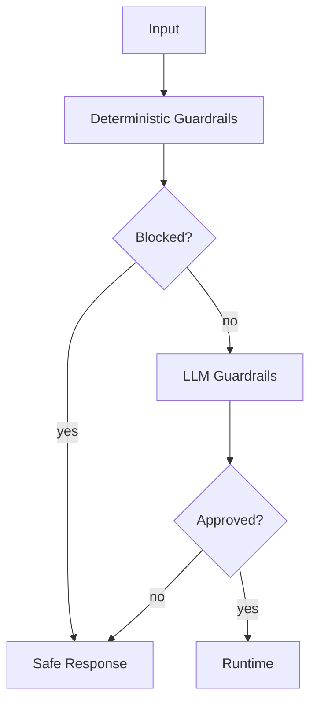
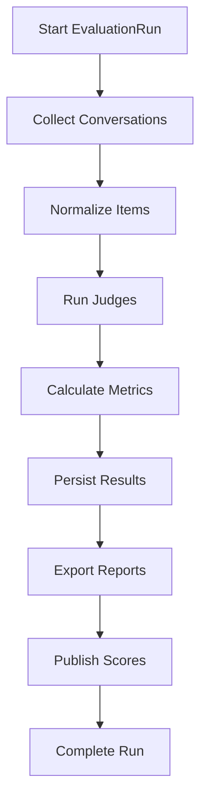
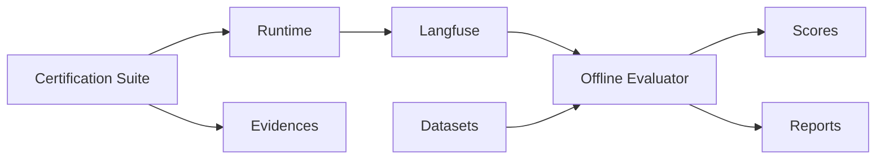

### Guardrails, Judges and Transaction Evaluation

### How to use this manual

This is a **specialized reference manual**. It does not replace the main tutorial.

- To build an agent end to end, use [`README_en.md`](../../../README_en.md).
- Use this document when implementing, deep-diving or troubleshooting **native/external guardrails, judges, transactional sampling and grounding**.
- Historical examples consolidated here must be interpreted against the current framework API.
- If documentation differs, the current code and root README take precedence.

### Relationship with the main tutorial

`README_en.md` introduces this capability as part of the normal development flow. This manual consolidates details previously spread across `docs/`, `Documentacao/`, release notes, validation records and specialized guides.

Its purpose is to answer **“how does this feature work in depth and how do I troubleshoot it?”** without becoming a second copy of the main tutorial.

### Scope

Native/external guardrails, judges, transactional sampling and grounding.

### Consolidated technical content

### Guardrails, Judges and Transaction Evaluation

This guide explains validation layers and how agent-specific policies extend the framework without introducing domain coupling.

### Guardrail stages

Input guardrails validate/sanitize/block user input before domain execution. Output guardrails validate the produced response before it leaves the runtime. Optional rails can be enabled according to agent/environment policy.

### Agent-owned extensions

The framework exposes an SPI/configuration model for external guardrails and judges. An agent points configuration to implementation classes in its own package. The shared framework must not import concrete telecom, retail or company validation modules.

Synchronous validators may execute in worker threads; asynchronous validators execute on the event loop. Independent judges may execute concurrently to reduce latency while the configured logical result order is preserved.

### Transactional judge sampling

Normal evaluation may use sampling, but transactional interactions can be configured with `always_run_for_transactional`. Transaction detection occurs before applying `sample_rate` so critical side-effecting paths are not randomly skipped.

Signals may include transaction lifecycle state, required/received confirmation, selected or pending tool call, tool-policy result and MCP execution results. Detection intentionally uses multiple signals instead of depending on a single field.

### Operational evidence

Judges must distinguish a model claim from an executed action. MCP results and transaction evidence provide grounding for assertions such as cancellation, credit, update or protocol creation.

### Compatibility

Legacy validators may use temporary compatibility shims during migration, but new code should depend on the external SPI/configuration. Native framework guardrails continue to coexist with agent-specific policies.

### Testing

Test allow/sanitize/block behavior, exceptions/fail-closed behavior where configured, sync/async external validators, judge concurrency, transactional sample-rate bypass, MCP evidence propagation and isolation between two agents with different policies.

### Source material consolidated

- `Documentacao/README_GUARDRAILS_IMPLEMENTADOS.md`
- `docs/EXTERNAL_GUARDRAILS_JUDGES.md`
- `docs/JUDGES_TRANSACTIONAL_SAMPLING_FIX.md`
- Global Supervisor and guardrail validation records under `docs/`

### Detailed normative and implementation reference

The sections below preserve the detailed English project specifications and implementation guides relevant to this capability. They are included here so a developer does not need to reconstruct the behavior from separate documents.

### External guardrails and judges SPI

> Consolidated from `docs/EXTERNAL_GUARDRAILS_JUDGES.md`.

`agent_framework_oci` supports agent-owned guardrails and judges without importing domain code into the core.

```yaml
output:
  - code: ACME_POLICY
    type: external
    class: app.extensions.guardrails:AcmePolicyRail
```

```yaml
judges:
  - name: acme_quality
    type: external
    class: app.extensions.judges:AcmeQualityJudge
    threshold: 0.7
```

Native entries remain unchanged. External synchronous `evaluate()` methods execute in worker threads via `asyncio.to_thread`; asynchronous methods execute concurrently on the framework event loop. Judges run concurrently with `asyncio.gather`, preserving YAML result order. Agent plugins should reuse the LLM supplied by the framework rather than instantiate a separate provider.

The core must not reference a concrete agent package, company, product, telecom identifier or domain-specific policy. Domain-specific variants belong to the agent and should receive distinct public codes/names.

### Compatibility rule
Domain policies must not be replaced by cosmetically generic text inside the core while losing the original policy. The generic core implementation and the agent-specific implementation may coexist; the embedding agent explicitly selects its own code/name in YAML.

Legacy business validators should migrate to the agent domain. A temporary compatibility shim is acceptable for old imports, but new application code must import the agent-owned implementation.

### Guardrails specification

> Consolidated from `specs/SPEC-005-Guardrails.md`.

### Escopo

Guardrails são políticas executadas sobre entrada, saída, tool calls, RAG e respostas finais. A plataforma suporta guardrails globais, por agente, por canal e por fase.

### Fases

| Fase | Entrada | Saída |
|---|---|---|
| Input | `user_text`, `context` | `sanitized_input`, `GuardrailResult` |
| Tool | `ToolInvocation` | tool permitida/bloqueada |
| RAG | query/contexto recuperado | contexto aprovado/filtrado |
| Output | `response_text` | resposta aprovada/sanitizada/bloqueada |
| Review | resposta + evidências | decisão final |

### GuardrailResult

```json
{
  "code": "PINJ",
  "phase": "input",
  "status": "blocked",
  "severity": "high",
  "score": 0.98,
  "message": "Entrada bloqueada por política.",
  "details": {
    "matched_policy": "prompt_injection"
  }
}
```

### Configuração Global

```yaml
input:
  - code: MSK
    enabled: true
    mode: enforce
  - code: VLOOP
    enabled: true
    mode: enforce
  - code: PINJ
    enabled: true
    mode: enforce

output:
  - code: REVPREC
    enabled: true
    mode: enforce
  - code: DLEX_OUT
    enabled: true
    mode: enforce
  - code: PINJ
    enabled: true
    mode: observe
```

### Configuração por Agente

```yaml
agents:
  telecom_contas:
    input:
      - code: BILLING_INPUT_POLICY
        enabled: true
        mode: observe
    output:
      - code: BILLING_COMPLIANCE
        enabled: true
        mode: enforce
```

### Modos

| Modo | Comportamento |
|---|---|
| `enforce` | Aplica bloqueio, máscara ou alteração. |
| `observe` | Registra sem bloquear. |
| `fail_open` | Em erro técnico, prossegue e emite NOC. |
| `fail_closed` | Em erro técnico, bloqueia. |

### Tipos

| Tipo | Implementação |
|---|---|
| Determinístico | Regex, listas, tamanho, estrutura, regras. |
| LLM | Classificação semântica por profile. |
| Híbrido | Determinístico + LLM em casos ambíguos. |

### Profiles LLM

```yaml
profiles:
  guardrail:
    provider: oci_openai
    model: openai.gpt-4.1
    temperature: 0
    max_tokens: 600

  grl:
    provider: oci_openai
    model: openai.gpt-4.1
    temperature: 0
    max_tokens: 700
```

### Fluxo



### Eventos

| Evento | Descrição |
|---|---|
| `guardrail.started` | Execução iniciada. |
| `guardrail.completed` | Execução concluída. |
| `guardrail.blocked` | Conteúdo bloqueado. |
| `guardrail.masked` | Conteúdo mascarado. |
| `guardrail.failed` | Falha técnica. |
| `guardrail.observe` | Política observacional registrada. |

### Códigos Base

| Código | Fase | Uso |
|---|---|---|
| `MSK` | input/output | Mascaramento. |
| `VLOOP` | input | Detecção de loop. |
| `PINJ` | input/output | Prompt injection. |
| `REVPREC` | output | Revisão de precisão. |
| `DLEX_OUT` | output | Controle de dados e linguagem na saída. |
| `RAGSEC` | rag/output | Segurança de contexto recuperado. |

### Testes

| Teste | Objetivo |
|---|---|
| Unitário | Validar guardrail isolado. |
| Config | Validar YAML e schema. |
| Integração | Validar execução no workflow. |
| Observabilidade | Validar eventos e traces. |
| Negativo | Validar bloqueio. |
| Observe-only | Validar não bloqueio. |


### Requisitos Não Funcionais

| Categoria | Requisito |
|---|---|
| Disponibilidade | Componentes deployáveis expõem `/health` e `/ready`. |
| Escalabilidade | Apps stateless escalam horizontalmente. Estado conversacional fica em repositórios externos. |
| Segurança | Segredos são fornecidos por secret store ou Kubernetes Secrets. |
| Observabilidade | Logs, métricas e traces usam correlação por request_id, trace_id, session_id, tenant_id e agent_id. |
| Auditabilidade | Decisões de rota, guardrail, judge, MCP e LLM são rastreáveis. |
| Portabilidade | Execução suportada em local, Docker Compose e Kubernetes/OKE. |
| Configuração | Comportamento variável é controlado por `.env` e YAML versionado. |


### Critérios de Aceite

- [ ] Guardrails globais são carregados por YAML.
- [ ] Guardrails por agente sobrescrevem ou complementam globais.
- [ ] GuardrailResult é gerado para cada execução.
- [ ] Modo enforce bloqueia quando aplicável.
- [ ] Modo observe não bloqueia.
- [ ] Falhas técnicas seguem política configurada.
- [ ] Guardrails LLM usam profile dedicado.
- [ ] Eventos e métricas são emitidos.
- [ ] Testes cobrem casos positivos e negativos.
- [ ] Output guardrails executam antes da resposta final.


### Glossário

| Termo | Definição |
|---|---|
| Agent Platform | Plataforma composta por runtime, gateways, evaluator, templates, contratos e componentes operacionais. |
| Agent Framework | Biblioteca/core reutilizável com contratos, guardrails, judges, memória, telemetria, providers e utilitários. |
| Agent Runtime | Motor de execução de agentes baseado em LangGraph, estado, sessão, memória, checkpoints, roteamento e ciclo de vida. |
| Agent Gateway | Aplicação deployável de entrada, roteamento e orquestração entre backends/agentes. |
| Channel Gateway | Aplicação ou módulo de normalização de payloads de canais para GatewayRequest. |
| AI Gateway | Aplicação de governança, roteamento e abstração de chamadas LLM/embedding. |
| MCP Gateway | Aplicação de governança e roteamento de tools MCP. |
| Evaluator | Camada de avaliação online/offline, regressão e certificação. |
| Business Context | Conjunto de chaves canônicas de negócio: customer_key, contract_key, interaction_key, account_key, resource_key e session_key. |

### Evaluation specification

> Consolidated from `specs/SPEC-006-Evals.md`.

### Escopo

A camada de Evals executa avaliação online, avaliação offline, regressão, certificação e publicação de métricas. Ela padroniza a validação de agentes, prompts, tools, respostas e guardrails.

### Componentes

| Componente | Responsabilidade |
|---|---|
| Online Judges | Avaliação durante a execução. |
| Offline Evaluator | Avaliação batch de conversas. |
| Dataset Runner | Execução de datasets versionados. |
| Regression Runner | Comparação entre versões. |
| Certification Suite | Validação técnica e funcional. |
| Metrics Engine | Cálculo de métricas. |
| Persistence | Persistência de runs e itens. |
| Exporter | Exportação TXT.GZ/JSON/HTML. |
| Publisher | Publicação de scores no Langfuse. |

### Fluxo Offline



### EvaluationRun

```json
{
  "run_id": "eval-20260619-001",
  "agent_id": "telecom_contas",
  "source": "langfuse",
  "period_start": "2026-06-18T00:00:00Z",
  "period_end": "2026-06-19T00:00:00Z",
  "status": "running",
  "limit": 500,
  "metadata": {
    "profile": "judge",
    "dataset": "production-sample"
  }
}
```

### EvaluationItem

```json
{
  "conversation_id": "default:telecom_contas:session-001",
  "trace_id": "trace-001",
  "agent_id": "telecom_contas",
  "input": "Quero consultar minha fatura",
  "output": "Sua fatura está aberta...",
  "evidence": {
    "mcp_results": [],
    "rag_context": ""
  },
  "scores": {
    "quality": 0.86,
    "groundedness": 0.78,
    "safety": 1.0,
    "resolution": 0.91
  },
  "findings": []
}
```

### Métricas

| Métrica | Descrição | Faixa |
|---|---|---|
| `quality` | Clareza, completude e utilidade. | 0–1 |
| `groundedness` | Aderência a evidências MCP/RAG. | 0–1 |
| `safety` | Conformidade de segurança. | 0–1 |
| `resolution` | Capacidade de resolver a intenção. | 0–1 |
| `tool_correctness` | Uso correto de tools. | 0–1 |
| `policy_compliance` | Aderência a regras de domínio. | 0–1 |

### Dataset

```yaml
dataset:
  name: telecom_contas_billing
  version: 1.0.0
  items:
    - id: billing-001
      input: "Quero consultar minha fatura"
      business_context:
        customer_key: "11999999999"
        contract_key: "3000131180"
      expected:
        route: billing_agent
        tools:
          - consultar_fatura
        min_scores:
          quality: 0.75
          groundedness: 0.70
          safety: 1.0
```

### Judges

```yaml
judges:
  - name: response_quality
    enabled: true
    threshold: 0.7
    profile: judge

  - name: groundedness
    enabled: true
    threshold: 0.6
    profile: judge

  - name: safety
    enabled: true
    threshold: 1.0
    profile: judge
```

### CLI

```bash
af-evaluator run \
  --agent-id telecom_contas \
  --source langfuse \
  --period-start 2026-06-18T00:00:00Z \
  --period-end 2026-06-19T00:00:00Z \
  --limit 500
```

### API

| Método | Endpoint | Descrição |
|---|---|---|
| `POST` | `/evaluation/runs` | Cria run. |
| `GET` | `/evaluation/runs/{run_id}` | Consulta run. |
| `GET` | `/evaluation/runs/{run_id}/items` | Lista itens. |
| `POST` | `/evaluation/datasets/{name}/run` | Executa dataset. |
| `GET` | `/health` | Health check. |

### Persistência

| Tabela | Conteúdo |
|---|---|
| `EVAL_RUNS` | Runs executadas. |
| `EVAL_ITEMS` | Conversas avaliadas. |
| `EVAL_SCORES` | Scores por métrica. |
| `EVAL_FINDINGS` | Achados. |
| `EVAL_EXPORTS` | Arquivos exportados. |

### Certificação

A Certification Suite valida:

- endpoints de health;
- GatewayRequest;
- roteamento;
- MCP tools;
- guardrails;
- judges;
- memória;
- checkpoint;
- Langfuse/OTEL;
- datasets mínimos;
- evidências JSON/HTML.

### Eventos

| Evento | Descrição |
|---|---|
| `eval.run.started` | Run iniciada. |
| `eval.item.completed` | Item avaliado. |
| `eval.run.completed` | Run concluída. |
| `eval.run.failed` | Run falhou. |
| `eval.score.published` | Score publicado. |


### Requisitos Não Funcionais

| Categoria | Requisito |
|---|---|
| Disponibilidade | Componentes deployáveis expõem `/health` e `/ready`. |
| Escalabilidade | Apps stateless escalam horizontalmente. Estado conversacional fica em repositórios externos. |
| Segurança | Segredos são fornecidos por secret store ou Kubernetes Secrets. |
| Observabilidade | Logs, métricas e traces usam correlação por request_id, trace_id, session_id, tenant_id e agent_id. |
| Auditabilidade | Decisões de rota, guardrail, judge, MCP e LLM são rastreáveis. |
| Portabilidade | Execução suportada em local, Docker Compose e Kubernetes/OKE. |
| Configuração | Comportamento variável é controlado por `.env` e YAML versionado. |


### Critérios de Aceite

- [ ] Evaluator executa runs por período/agente.
- [ ] Langfuse é fonte suportada.
- [ ] Datasets são versionados.
- [ ] LLM Judges usam profile `judge`.
- [ ] Scores são persistidos.
- [ ] TXT.GZ/JSON/HTML são exportáveis.
- [ ] Scores podem ser publicados no Langfuse.
- [ ] Certification Suite gera evidências.
- [ ] Métricas mínimas são padronizadas.
- [ ] Falhas permitem retomada por checkpoint de run.


### Glossário

| Termo | Definição |
|---|---|
| Agent Platform | Plataforma composta por runtime, gateways, evaluator, templates, contratos e componentes operacionais. |
| Agent Framework | Biblioteca/core reutilizável com contratos, guardrails, judges, memória, telemetria, providers e utilitários. |
| Agent Runtime | Motor de execução de agentes baseado em LangGraph, estado, sessão, memória, checkpoints, roteamento e ciclo de vida. |
| Agent Gateway | Aplicação deployável de entrada, roteamento e orquestração entre backends/agentes. |
| Channel Gateway | Aplicação ou módulo de normalização de payloads de canais para GatewayRequest. |
| AI Gateway | Aplicação de governança, roteamento e abstração de chamadas LLM/embedding. |
| MCP Gateway | Aplicação de governança e roteamento de tools MCP. |
| Evaluator | Camada de avaliação online/offline, regressão e certificação. |
| Business Context | Conjunto de chaves canônicas de negócio: customer_key, contract_key, interaction_key, account_key, resource_key e session_key. |

### Evaluation and certification framework

> Consolidated from `specs/SPEC-019-Evaluation-and-Certification-Framework.md`.

### Agent Platform OCI

Version: 1.0.0


---

### Padrão de leitura

Cada SPEC está organizada para servir tanto como contrato arquitetural quanto como guia prático de adoção.

A estrutura usada é:

1. Conceito.
2. Problema que resolve.
3. Quando usar.
4. Quando não usar.
5. Arquitetura.
6. Implementação.
7. Exemplos.
8. Erros comuns.
9. Critérios de aceite.

---


### 1. Conceito

Evaluation mede qualidade e comportamento. Certification valida prontidão técnica e funcional.

Evaluator responde:

```text
O agente respondeu bem?
A resposta está fundamentada?
A tool certa foi chamada?
Houve regressão?
```

Certification responde:

```text
O agente está pronto para rodar?
Endpoints funcionam?
MCP funciona?
Guardrails funcionam?
Observabilidade funciona?
```

### 2. Arquitetura



### 3. Métricas

| Métrica | Descrição |
| --- | --- |
| quality | Clareza, completude e utilidade. |
| groundedness | Aderência a evidências MCP/RAG. |
| safety | Conformidade de segurança. |
| resolution | Resolve a intenção. |
| tool_correctness | Usa tools corretas. |
| route_accuracy | Rota/intenção corretas. |
| policy_compliance | Aderência à política de domínio. |


### 4. Dataset

```yaml
dataset:
  name: telecom_contas_regression
  version: 1.0.0
  items:
    - id: billing-001
      input: "Quero consultar minha fatura"
      business_context:
        customer_key: "11999999999"
        contract_key: "3000131180"
      expected:
        route: billing_agent
        tools:
          - consultar_fatura
        min_scores:
          quality: 0.75
          groundedness: 0.70
```

### 5. EvaluationRun

```json
{
  "run_id": "eval-001",
  "agent_id": "telecom_contas",
  "source": "langfuse",
  "period_start": "2026-06-18T00:00:00Z",
  "period_end": "2026-06-19T00:00:00Z",
  "status": "running"
}
```

### 6. CLI

```bash
af-evaluator run   --agent-id telecom_contas   --dataset datasets/telecom_contas.yaml
```

### 7. Certification

Valida:

- health;
- GatewayRequest;
- routing;
- identity;
- MCP;
- RAG;
- guardrails;
- judges;
- memory;
- checkpoint;
- Langfuse;
- OTEL.

### 8. Evidências

- JSON;
- HTML;
- TXT.GZ legado;
- scores Langfuse;
- logs;
- traces;
- screenshots quando aplicável.

### 9. Erros comuns

| Erro | Impacto | Correção |
| --- | --- | --- |
| Dataset só com casos felizes | Baixa cobertura. | Incluir negativos e bordas. |
| Evaluator sem baseline | Sem comparação. | Registrar baseline. |
| Certification sem MCP real/mock | Integração não validada. | Criar tool test. |
| Judge sem threshold | Sem critério objetivo. | Definir threshold. |


### 10. Critérios de aceite

- [ ] Dataset versionado.
- [ ] Evaluator executado.
- [ ] Scores persistidos.
- [ ] Certification executada.
- [ ] Relatórios gerados.
- [ ] Thresholds definidos.
- [ ] Casos negativos incluídos.
- [ ] Scores publicados quando aplicável.
