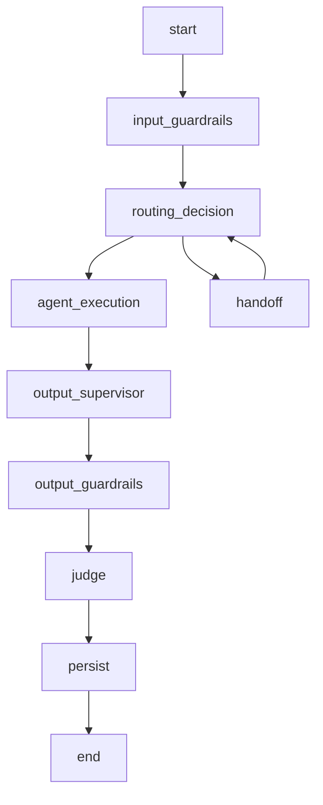
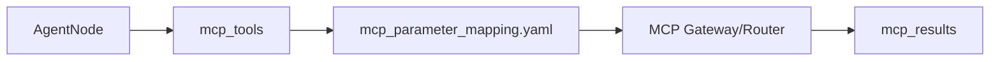

### RAG, BusinessContext and Grounding

### How to use this manual

This is a **specialized reference manual**. It does not replace the main tutorial.

- To build an agent end to end, use [`README_en.md`](../../../README_en.md).
- Use this document when implementing, deep-diving or troubleshooting **RAG, providers, BusinessContext, retrieved context and grounding**.
- Historical examples consolidated here must be interpreted against the current framework API.
- If documentation differs, the current code and root README take precedence.

### Relationship with the main tutorial

`README_en.md` introduces this capability as part of the normal development flow. This manual consolidates details previously spread across `docs/`, `Documentacao/`, release notes, validation records and specialized guides.

Its purpose is to answer **“how does this feature work in depth and how do I troubleshoot it?”** without becoming a second copy of the main tutorial.

### Scope

Rag, providers, businesscontext, retrieved context and grounding.

### Consolidated technical content

### RAG, Enterprise Providers, BusinessContext and Grounding

This guide covers configurable retrieval and its relationship with tools, memory and agent context.

### Provider selection

RAG is provider-based. The standard implementation and the enterprise KBDB implementation are selected through configuration rather than through domain branches in the agent code. Provider-specific connection/index settings remain environment/configuration concerns.

### Runtime role

Retrieved knowledge is injected into the execution context so the agent can ground informational responses. RAG does not replace transactional tool execution and it is not the same as long-term memory. Use RAG for external/reference knowledge, MCP for live business operations/data and LTM for durable user/customer facts.

### KBDB Enterprise

The KBDB provider is an alternative backend with its own configuration while preserving the framework-facing retrieval contract. Agent code should not need to know which provider is active.

### BusinessContext

BusinessContext v2 carries generic business identifiers resolved from domain aliases. RAG filters, tool calls and telemetry can consume these canonical keys without introducing `msisdn`, invoice/order naming or other domain fields into shared modules.

### MCP sufficiency and grounding

When a tool result already contains sufficient authoritative data for the requested answer, the runtime can avoid unnecessary retrieval/composition work according to the configured response path. Conversely, a RAG answer must not claim a transactional action occurred merely because documentation describes how the action works.

### Sample validation

The project contains sample PDFs/policies for billing, orders, products, support and business-context/RAG flow. Use them to validate ingestion/embedding/retrieval and ask targeted questions whose expected answer is present in one document.

### Source material consolidated

- `docs/RAG_PROVIDER_KBDB.md`
- `docs/README_rag_samples.md`
- `Documentacao/README_TEMPLATE_BUSINESS_CONTEXT_V2.md`
- operational RAG/cache notes in `Documentacao/README_FIRST_MAX_OPERATIONAL_FIXES.md`

### Detailed normative and implementation reference

The sections below preserve the detailed English project specifications and implementation guides relevant to this capability. They are included here so a developer does not need to reconstruct the behavior from separate documents.

### RAG provider implementation notes

> Consolidated from `docs/RAG_PROVIDER_KBDB.md`.

O framework passa a suportar dois backends de retrieval pelo mesmo contrato `RagService`, sem alterar os agentes nem `_retrieve_rag_context()`.

### Seleção

```env
RAG_PROVIDER=standard  # default: comportamento anterior
# ou
RAG_PROVIDER=kbdb      # KBDB enterprise
```

A seleção é exclusiva por processo. Os dois RAGs não executam juntos e não compartilham vector store, graph store ou ingestão.

### `standard`

Mantém integralmente o RAG já existente no `agent_framework_oci`: `VECTOR_STORE_PROVIDER`, `GRAPH_STORE_PROVIDER`, embedding, query rewrite, compression, retrieval guardrails e geração continuam válidos.

### `kbdb`

O framework integra somente a porta estável de serving do projeto KBDB:

`PKG_KB_SERVING.SEARCH_KNOWLEDGE_BASE`

O pipeline enterprise continua externo ao runtime do agente e preserva sua própria arquitetura RAW → SILVER → GOLD, HVI/hybrid search, property graph, publicação, lifecycle, auditoria e observabilidade.

O envelope KBDB é adaptado para `RagResult`/`VectorDocument`; portanto os agentes existentes continuam chamando `_retrieve_rag_context()` e os retrieval guardrails do framework continuam depois do retrieval.

### Configuração

```env
RAG_PROVIDER=kbdb
RAG_TOP_K=5
KBDB_DB_USER=KB_USER
KBDB_DB_PASSWORD=...
KBDB_DB_DSN=...
KBDB_DB_WALLET_LOCATION=...
KBDB_DB_WALLET_PASSWORD=...
KBDB_SEARCH_TYPE=hybrid
KBDB_NODE_EXPANSION=true
KBDB_NODE_MAX_RELATED=8
KBDB_GRAPH_CROSS_REF=false
KBDB_MAX_CROSS_REF_HOPS=1
KBDB_DOCUMENT_TYPE=customer_safe
KBDB_METADATA_JSON=
KBDB_MIN_SCORE=
```

Quando `RAG_PROVIDER=kbdb`, `KBDB_DB_USER`, `KBDB_DB_PASSWORD` e `KBDB_DB_DSN` são obrigatórios. O KBDB usa conexão isolada porque pode residir em outro Autonomous. `KBDB_DB_DSN` segue a mesma semântica de `ADB_DSN`: use o alias TNS existente no `tnsnames.ora` da wallet indicada por `KBDB_DB_WALLET_LOCATION`, e não uma URL `tcps://...`.

### Isolamento e compatibilidade

- `RAG_PROVIDER=standard` não importa nem conecta ao KBDB.
- `RAG_PROVIDER=kbdb` não instancia vector/graph stores do RAG padrão.
- Ingestão por `RagService.add_documents()` não é permitida no modo KBDB: deve passar pelo pipeline/publicação KBDB.
- Query rewrite e context compression continuam opcionais e são aplicados pela camada comum do framework.
- `AgentRuntimeMixin._retrieve_rag_context()` e os agentes permanecem inalterados.
- Falhas do KBDB seguem a semântica existente do framework: retrieval é evidência auxiliar e a exceção é convertida em metadata técnica sem derrubar a jornada.


### Resposta direta de tool e RAG

O framework não considera mais que um resultado MCP estruturado é, por si só, uma resposta suficiente ao usuário.

Uma política `response.renderer` define somente **como** apresentar o resultado. Ela não encerra o fluxo antes de RAG/LLM. Para uma tool deliberadamente produzir uma resposta final direta, a aplicação deve declarar explicitamente:

```yaml
response:
  mode: renderer
  renderer: meu.renderer
  direct: true
```

Sem `direct: true`, o resultado da tool permanece como evidência MCP e o fluxo segue para `_retrieve_rag_context()` e composição LLM. Isso permite, por exemplo, que uma consulta operacional de plano seja combinada com conhecimento documental do KBDB quando a pergunta pedir regras, políticas ou explicações.

O core do framework não possui fallback por nome de tool (`consultar_plano`, `consultar_pedido`, etc.). Regras de apresentação pertencem à aplicação/domínio.


### Suficiência MCP e grounding

Um resultado MCP bem-sucedido **não** faz o framework pular RAG automaticamente.
O domínio só pode declarar suficiência documental explicitamente no payload com
`rag_sufficient=true` ou `knowledge_sufficient=true`. Essa decisão é genérica e
não depende do nome da tool nem de palavras-chave de telecom/retail.

No provider `kbdb`, `KBDB_GROUNDED_ONLY=true` é o padrão. Quando a busca KBDB
retorna vazia, bloqueada ou com erro, a composição LLM pode usar fatos comprovados
por MCP/business context, mas não pode completar a parte documental com conhecimento
paramétrico do modelo. Deve informar que não há evidência suficiente na base.

Eventos do ProductAgent registram `IC.PRODUCT_RAG_CONTEXT_EVALUATED` em toda
tentativa/decisão e `IC.PRODUCT_RAG_CONTEXT_RETRIEVED` somente quando há contexto
recuperado. Os metadados incluem `provider`, `status`, `document_count`, `reason`,
`error`, `query`, `namespace` e `latency_ms`.

### RAG sample validation guide

> Consolidated from `docs/README_rag_samples.md`.

These PDF files are synthetic, searchable sample documents created to validate the RAG embedding and retrieval flow of `agent_template_backend`.

### Files

- `01_billing_agent_invoice_policy.pdf` - sample knowledge for `billing_agent`
- `02_orders_agent_lifecycle_policy.pdf` - sample knowledge for `orders_agent`
- `03_product_agent_catalog_policy.pdf` - sample knowledge for `product_agent`
- `04_support_agent_sla_policy.pdf` - sample knowledge for `support_agent`
- `05_business_context_rag_flow.pdf` - sample knowledge about BusinessContext, identity.yaml and MCP parameter mapping

### How to use

Copy the PDF files to the backend documentation directory:

```bash
mkdir -p agent_template_backend/docs/rag_samples
cp *.pdf agent_template_backend/docs/rag_samples/
```

For a local smoke test, use:

```env
VECTOR_STORE_PROVIDER=sqlite
EMBEDDING_PROVIDER=mock
SQLITE_DB_PATH=./data/agent_framework.db
RAG_TOP_K=4
```

Then run:

```bash
python scripts/generate_rag_embeddings.py \
  --docs-dir ./agent_template_backend/docs/rag_samples \
  --namespace default
```

For production-like semantic embeddings with OCI Generative AI, use:

```env
VECTOR_STORE_PROVIDER=autonomous
EMBEDDING_PROVIDER=oci
OCI_COMPARTMENT_ID=ocid1.compartment.oc1..xxxx
OCI_REGION=us-chicago-1
OCI_EMBEDDING_MODEL=cohere.embed-multilingual-v3.0
```

### Suggested retrieval test questions

- What is a prorated charge?
- When can the OrdersAgent open an exchange request?
- Which SKU represents the AI Agents book?
- What is the target response for a critical support ticket?
- How does BusinessContext map customer_key to MCP tool parameters?

### Runtime integration constraints

> Consolidated from `specs/SPEC-002-Agent-Runtime.md`.

### Escopo

O Agent Runtime executa o ciclo de vida conversacional do agente. A execução inclui normalização de contexto, estado LangGraph, memória, checkpoint, roteamento, supervisor, guardrails, MCP, RAG, LLM, judges, persistência e resposta final.

### Componentes

| Componente | Responsabilidade |
|---|---|
| Workflow Builder | Compila o grafo LangGraph. |
| State Manager | Mantém o estado de execução. |
| Session Manager | Resolve sessão e conversation_key. |
| Memory Manager | Carrega e persiste histórico. |
| Checkpoint Manager | Persiste estado LangGraph. |
| Input Guardrail Node | Executa guardrails de entrada. |
| Router Node | Decide rota/intent. |
| Supervisor Node | Decide handoff ou próximo agente quando habilitado. |
| Agent Node | Executa agente de domínio. |
| MCP Client/Router | Executa tools por contrato. |
| RAG Service | Recupera contexto documental. |
| Output Supervisor | Revisa resposta antes de saída. |
| Output Guardrail Node | Executa guardrails de saída. |
| Judge Node | Avalia resposta. |
| Persistence Node | Persiste mensagens, memória e checkpoint. |

### State Model

```python
class AgentState(TypedDict, total=False):
    user_text: str
    sanitized_input: str
    response_text: str
    tenant_id: str
    agent_id: str
    channel: str
    session_id: str
    conversation_key: str
    message_id: str
    route: str
    intent: str
    context: dict
    business_context: dict
    tool_arguments: dict
    mcp_tools: list[str]
    mcp_results: list[dict]
    rag_context: str
    rag_metadata: dict
    guardrails: list[dict]
    judges: list[dict]
    metadata: dict
    errors: list[dict]
```

### Workflow



### Nós

| Nó | Entrada | Saída |
|---|---|---|
| `input_guardrails` | `user_text`, `context` | `sanitized_input`, `guardrails` |
| `routing_decision` | `sanitized_input`, `business_context` | `route`, `intent`, `mcp_tools` |
| `agent_execution` | `state` completo | `response_text`, `mcp_results`, `rag_metadata` |
| `output_supervisor` | `response_text` | `response_text` revisado |
| `output_guardrails` | `response_text` | `response_text`, `guardrails` |
| `judge` | `response_text`, evidências | `judges` |
| `persist` | `state` completo | checkpoint, memória, mensagens |

### Router

```yaml
routing:
  mode: router
  fallback_agent: billing_agent
  enable_llm_router: false
  intents:
    billing_invoice_explanation:
      route: billing_agent
      keywords:
        - fatura
        - cobrança
        - boleto
      mcp_tools:
        - consultar_fatura
        - consultar_pagamentos
```

### Supervisor

```yaml
supervisor:
  enabled: true
  profile: supervisor
  max_turns: 5
  handoff_enabled: true
  fallback_route: support_agent
```

### Memory

| Provider | Uso |
|---|---|
| `memory` | Execução local e testes. |
| `sqlite` | Desenvolvimento local persistente. |
| `mongodb` | Checkpoint e histórico em ambiente distribuído. |
| `autonomous` | Produção com Oracle Autonomous Database. |

### Checkpoints

Checkpoint contém:

```json
{
  "conversation_key": "default:telecom_contas:session-001",
  "checkpoint_id": "ckpt-001",
  "state": {},
  "pending_writes": [],
  "created_at": "2026-06-19T12:00:00Z"
}
```

Formato entregue ao LangGraph:

```python
pending_writes: list[tuple[str, str, object]]
```

### Business Context

```yaml
business_context:
  customer_key: "11999999999"
  contract_key: "3000131180"
  interaction_key: "301953872"
  account_key: null
  resource_key: null
  session_key: "session-001"
  metadata:
    source_channel: web
```

### Ordem de Prioridade dos Dados

1. `tool_arguments`
2. `business_context`
3. `context`
4. `session.metadata`
5. `state`
6. extração complementar do texto

### MCP Integration



### RAG Integration

```yaml
rag:
  enabled: true
  namespace_strategy: agent_id
  top_k: 5
  profile_generation: rag_generation
```

### Eventos

| Evento | Descrição |
|---|---|
| `runtime.started` | Execução iniciada. |
| `runtime.session.loaded` | Sessão carregada. |
| `runtime.memory.loaded` | Memória carregada. |
| `runtime.checkpoint.loaded` | Checkpoint carregado. |
| `runtime.route.selected` | Rota selecionada. |
| `runtime.agent.started` | Agente iniciado. |
| `runtime.agent.completed` | Agente concluído. |
| `runtime.persist.completed` | Persistência concluída. |
| `runtime.failed` | Falha controlada. |

### Erros

| Código | Condição | Tratamento |
|---|---|---|
| `RUNTIME_INVALID_REQUEST` | GatewayRequest inválido | 422 |
| `RUNTIME_ROUTE_NOT_FOUND` | Nenhuma rota elegível | fallback ou resposta controlada |
| `RUNTIME_CHECKPOINT_ERROR` | Falha em checkpoint | retry ou stateless conforme config |
| `RUNTIME_MEMORY_ERROR` | Falha em memória | retry ou resposta controlada |
| `RUNTIME_AGENT_ERROR` | Falha no agente | NOC + fallback |
| `RUNTIME_TIMEOUT` | Timeout geral | resposta controlada |


### Contrato Durável de Estado Transacional

Hosts que utilizam `AgentRuntime` com transações multi-turno DEVEM declarar no `AgentState` os campos `active_transaction` e `last_transaction`. O primeiro é a fonte canônica da transação em andamento e deve sobreviver a checkpoint/resume; o segundo mantém o snapshot da última transação terminal.

```python
active_transaction: dict[str, Any]
last_transaction: dict[str, Any]
```

`selected_tool_call` e `pending_tool_call` são campos auxiliares/compatibilidade e não substituem o latch canônico. Durante `COLLECTING_PARAMETERS`, a retomada da transação e o consumo de parâmetros pendentes têm precedência sobre keyword routing genérico. Uma mudança de intenção só deve interromper a transação quando for inequívoca ou explicitamente solicitada pelo usuário.

O contrato completo, ciclo de vida, precedência de roteamento, checklist e testes regressivos estão em [`docs/TRANSACTION_STATE_DEVELOPER_GUIDE.md`](../docs/TRANSACTION_STATE_DEVELOPER_GUIDE.md).


### Requisitos Não Funcionais

| Categoria | Requisito |
|---|---|
| Disponibilidade | Componentes deployáveis expõem `/health` e `/ready`. |
| Escalabilidade | Apps stateless escalam horizontalmente. Estado conversacional fica em repositórios externos. |
| Segurança | Segredos são fornecidos por secret store ou Kubernetes Secrets. |
| Observabilidade | Logs, métricas e traces usam correlação por request_id, trace_id, session_id, tenant_id e agent_id. |
| Auditabilidade | Decisões de rota, guardrail, judge, MCP e LLM são rastreáveis. |
| Portabilidade | Execução suportada em local, Docker Compose e Kubernetes/OKE. |
| Configuração | Comportamento variável é controlado por `.env` e YAML versionado. |


### Critérios de Aceite

- [ ] Runtime recebe GatewayRequest validado.
- [ ] State contém tenant_id, agent_id, session_id, conversation_key, route e intent.
- [ ] Input guardrails executam antes do roteamento.
- [ ] Router ou Supervisor seleciona rota.
- [ ] Agent Node executa sem acessar payload bruto de canal.
- [ ] MCP é acessado por contrato.
- [ ] RAG é acessado por serviço reutilizável.
- [ ] Output guardrails executam antes da resposta final.
- [ ] Judges geram JudgeResult.
- [ ] Memória e checkpoint são persistidos conforme provider.
- [ ] Hosts transacionais declaram `active_transaction` e `last_transaction` no `AgentState`.
- [ ] Durante `COLLECTING_PARAMETERS`, respostas a parâmetros pendentes têm precedência sobre keyword routing genérico.
- [ ] Erros geram NOC e resposta controlada.


### Glossário

| Termo | Definição |
|---|---|
| Agent Platform | Plataforma composta por runtime, gateways, evaluator, templates, contratos e componentes operacionais. |
| Agent Framework | Biblioteca/core reutilizável com contratos, guardrails, judges, memória, telemetria, providers e utilitários. |
| Agent Runtime | Motor de execução de agentes baseado em LangGraph, estado, sessão, memória, checkpoints, roteamento e ciclo de vida. |
| Agent Gateway | Aplicação deployável de entrada, roteamento e orquestração entre backends/agentes. |
| Channel Gateway | Aplicação ou módulo de normalização de payloads de canais para GatewayRequest. |
| AI Gateway | Aplicação de governança, roteamento e abstração de chamadas LLM/embedding. |
| MCP Gateway | Aplicação de governança e roteamento de tools MCP. |
| Evaluator | Camada de avaliação online/offline, regressão e certificação. |
| Business Context | Conjunto de chaves canônicas de negócio: customer_key, contract_key, interaction_key, account_key, resource_key e session_key. |

### Business context contracts

> Consolidated from `specs/SPEC-012-Canonical-Contracts.md`.

### Agent Platform OCI

Version: 1.0.0


---

### Padrão de leitura

Cada SPEC está organizada para servir tanto como contrato arquitetural quanto como guia prático de adoção.

A estrutura usada é:

1. Conceito.
2. Problema que resolve.
3. Quando usar.
4. Quando não usar.
5. Arquitetura.
6. Implementação.
7. Exemplos.
8. Erros comuns.
9. Critérios de aceite.

---


### 1. Conceito

Contratos canônicos são estruturas padronizadas usadas para desacoplar canais, gateways, runtime, agentes, tools, LLMs, evaluator e observabilidade.

A plataforma usa contratos para garantir que componentes independentes possam evoluir sem quebrar uns aos outros.

### 2. Problema que resolve

Sem contratos:

- cada canal envia payload diferente;
- agentes passam a conhecer WhatsApp, Voice, Teams ou CRM;
- MCP tools recebem parâmetros inconsistentes;
- LLM calls ficam acopladas ao provider;
- evaluator não consegue comparar respostas;
- observabilidade fica fragmentada.

Com contratos:

```text
Canal → GatewayRequest → Runtime → BusinessContext → ToolInvocation → ToolResult
```

### 3. Catálogo de contratos

| Contrato | Uso |
| --- | --- |
| GatewayRequest | Entrada canônica da plataforma. |
| ChannelResponse | Resposta canônica ao canal. |
| BusinessContext | Identidade canônica de negócio. |
| AgentState | Estado interno do runtime. |
| Session | Sessão técnica/conversacional. |
| Checkpoint | Persistência de estado LangGraph. |
| ToolInvocation | Chamada canônica de tool MCP. |
| ToolResult | Resposta canônica de tool MCP. |
| LLMRequest | Chamada canônica ao AI Gateway. |
| LLMResponse | Resposta canônica do AI Gateway. |
| EvaluationRun | Execução do evaluator. |
| EvaluationResult | Resultado de avaliação. |
| CertificationResult | Resultado de certificação. |
| EventEnvelope | Envelope de eventos IC/NOC/GRL. |


### 4. GatewayRequest

### 4.1. Uso

Usado por Channel Gateway e Agent Gateway para enviar mensagens ao Runtime.

```json
{
  "channel": "web",
  "tenant_id": "default",
  "agent_id": "telecom_contas",
  "payload": {
    "message": "Quero consultar minha fatura",
    "session_id": "session-001",
    "user_id": "user-001",
    "message_id": "msg-001",
    "business_context": {
      "customer_key": "11999999999",
      "contract_key": "3000131180",
      "interaction_key": "301953872",
      "session_key": "session-001"
    },
    "metadata": {
      "request_id": "req-001",
      "contract_version": "gateway-request-v1"
    }
  }
}
```

### 4.2. Campos obrigatórios

- `channel`;
- `payload.message`;
- `payload.session_id`;
- `payload.message_id`;
- `tenant_id` quando multi-tenant;
- `agent_id` quando não houver roteamento global.

### 5. ChannelResponse

```json
{
  "channel": "web",
  "session_id": "default:telecom_contas:session-001",
  "text": "Resposta final do agente.",
  "metadata": {
    "tenant_id": "default",
    "agent_id": "telecom_contas",
    "route": "billing_agent",
    "intent": "billing_invoice_explanation",
    "guardrails": [],
    "judges": []
  }
}
```

### 6. BusinessContext

### 6.1. Uso

BusinessContext transporta identidade de negócio sem acoplar a plataforma ao formato de cada canal.

```yaml
business_context:
  customer_key: "11999999999"
  contract_key: "3000131180"
  interaction_key: "301953872"
  account_key: null
  resource_key: null
  session_key: "session-001"
  metadata:
    source_channel: web
```

### 6.2. Mapeamento para MCP

```yaml
tools:
  consultar_fatura:
    map:
      customer_key: msisdn
      contract_key: invoice_id
      interaction_key: ura_call_id
      session_key: session_id
```

### 7. AgentState

```python
class AgentState(TypedDict, total=False):
    user_text: str
    sanitized_input: str
    response_text: str
    tenant_id: str
    agent_id: str
    channel: str
    session_id: str
    conversation_key: str
    message_id: str
    route: str
    intent: str
    business_context: dict
    mcp_tools: list[str]
    mcp_results: list[dict]
    rag_context: str
    guardrails: list[dict]
    judges: list[dict]
```

### 8. ToolInvocation

```json
{
  "tenant_id": "default",
  "agent_id": "telecom_contas",
  "tool_name": "consultar_fatura",
  "arguments": {
    "msisdn": "11999999999",
    "invoice_id": "3000131180"
  },
  "business_context": {
    "customer_key": "11999999999",
    "contract_key": "3000131180"
  },
  "metadata": {
    "request_id": "req-001",
    "trace_id": "trace-001"
  }
}
```

### 9. ToolResult

```json
{
  "tool_name": "consultar_fatura",
  "ok": true,
  "data": {
    "invoice_id": "3000131180",
    "valor_total": 249.90,
    "status": "ABERTA"
  },
  "cache": {
    "hit": false,
    "ttl_seconds": 300
  },
  "latency_ms": 140
}
```

### 10. LLMRequest

```json
{
  "tenant_id": "default",
  "agent_id": "telecom_contas",
  "profile": "judge",
  "operation": "judge.response_quality",
  "messages": [
    {"role": "system", "content": "Você é um avaliador."},
    {"role": "user", "content": "Avalie a resposta."}
  ],
  "metadata": {
    "request_id": "req-001",
    "trace_id": "trace-001"
  }
}
```

### 11. LLMResponse

```json
{
  "provider": "oci_openai",
  "model": "openai.gpt-4.1",
  "profile": "judge",
  "content": "Resultado",
  "usage": {
    "input_tokens": 1200,
    "output_tokens": 300,
    "total_tokens": 1500
  },
  "latency_ms": 820
}
```

### 12. EvaluationRun

```json
{
  "run_id": "eval-001",
  "agent_id": "telecom_contas",
  "source": "langfuse",
  "period_start": "2026-06-18T00:00:00Z",
  "period_end": "2026-06-19T00:00:00Z",
  "status": "running"
}
```

### 13. EventEnvelope

```json
{
  "event_type": "IC.AGENT_COMPLETED",
  "timestamp": "2026-06-19T12:00:00Z",
  "tenant_id": "default",
  "agent_id": "telecom_contas",
  "session_id": "session-001",
  "trace_id": "trace-001",
  "payload": {}
}
```

### 14. Regras de evolução

- campos novos devem ser opcionais;
- campos obrigatórios não podem ser removidos dentro da mesma major;
- mudança semântica exige nova versão;
- contratos são versionados independentemente.

### 15. Erros comuns

| Erro | Impacto | Correção |
| --- | --- | --- |
| Payload bruto no Runtime | Acopla canais ao core. | Usar GatewayRequest. |
| Tool recebendo BusinessContext bruto sem mapping | Quebra contrato da tool. | Usar mcp_parameter_mapping.yaml. |
| LLM direto no agente | Quebra AI Gateway. | Usar LLMRequest/profile. |
| Campos sem versão | Dificulta migração. | Declarar contract_version. |


### 16. Critérios de aceite

- [ ] GatewayRequest documentado e versionado.
- [ ] ChannelResponse documentado e versionado.
- [ ] BusinessContext usado por canais e MCP.
- [ ] ToolInvocation e ToolResult padronizados.
- [ ] LLMRequest e LLMResponse padronizados.
- [ ] EvaluationRun e EvaluationResult padronizados.
- [ ] EventEnvelope usado para IC/NOC/GRL.
- [ ] Contratos possuem regras de evolução.
