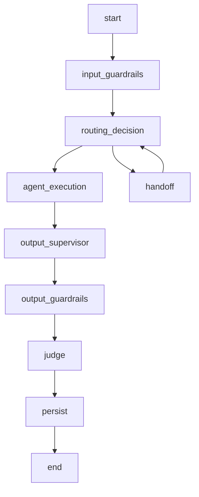

### Long-Term Memory and Checkpoint

### How to use this manual

This is a **specialized reference manual**. It does not replace the main tutorial.

- To build an agent end to end, use [`README_en.md`](../../../README_en.md).
- Use this document when implementing, deep-diving or troubleshooting **LTM, conversation memory, identity isolation and state persistence**.
- Historical examples consolidated here must be interpreted against the current framework API.
- If documentation differs, the current code and root README take precedence.

### Relationship with the main tutorial

`README_en.md` introduces this capability as part of the normal development flow. This manual consolidates details previously spread across `docs/`, `Documentacao/`, release notes, validation records and specialized guides.

Its purpose is to answer **“how does this feature work in depth and how do I troubleshoot it?”** without becoming a second copy of the main tutorial.

### Scope

Ltm, conversation memory, identity isolation and state persistence.

### Consolidated technical content

### Long-Term Memory and Enterprise Checkpointing

This is the developer implementation guide for durable memory and graph-state persistence.

### Memory types

Conversation memory is short-lived turn history used for current conversational continuity. Summary memory compresses conversation history. Long-Term Memory stores durable facts that should survive session changes. These mechanisms solve different problems and must not be treated as interchangeable.

### LTM components

The reference implementation uses `LongTermMemoryManager`, an abstract `LongTermMemoryStore`, concrete SQLite/in-memory stores, a `LongTermMemoryExtractor`, `LongTermMemoryItem` records and runtime/workflow integration through a `persist_long_term_memory` node.

### Identity and isolation

LTM must be keyed by stable business identity such as tenant, agent and customer key rather than by ephemeral frontend session alone. Retrieval in a later session should return the same customer's durable facts while remaining isolated from other tenants/agents/customers.

### Execution flow

At runtime, relevant durable memories are loaded into the agent context before response composition. After the turn, the extractor decides which candidate facts are worth persisting. The store writes the accepted items. Resetting a frontend session should not erase durable memory unless an explicit deletion policy is invoked.

### Checkpointing

Enterprise checkpointing persists LangGraph execution state and enables controlled resume after another turn or process restart. It is technical workflow persistence, not durable user memory.

A checkpoint must not become the source of truth for the active business transaction. Resume logic still uses canonical transaction state to determine whether there is an active paused workflow.

### Testing

Validate: persistence after a turn, retrieval from a different session for the same identity, isolation across identities, frontend reset, backend restart, direct SQLite/store verification and disabled-LTM behavior. For checkpointing, validate pause/resume plus completed/cancelled transaction non-resumption.

### Reference implementation limitations

The local SQLite/in-memory stores are reference implementations. Production deployments should select storage, retention, encryption and privacy policies appropriate to the environment. Extraction quality depends on the configured model/prompt and should be tested with domain-specific examples.

### Source material consolidated

- `Documentacao/Manual_Long_Term_Memory_PT.md`
- `Documentacao/Long_Term_Memory_Implementation_Guide_EN.md`
- `Documentacao/README_CHECKPOINT_ENTERPRISE.md`

### Detailed normative and implementation reference

The sections below preserve the detailed English project specifications and implementation guides relevant to this capability. They are included here so a developer does not need to reconstruct the behavior from separate documents.

### Full Long-Term Memory implementation guide

> Consolidated from `Documentacao/Long_Term_Memory_Implementation_Guide_EN.md`.

### Concept

Long-Term Memory (LTM) is the `agent_framework` capability that stores and retrieves durable facts beyond the lifetime of a conversation session.

Unlike message history, which is normally associated with a `session_id`, Long-Term Memory is associated with the business identity of the user or customer. In the current implementation, this identity consists of:

```text
tenant_id
agent_id
customer_key
```

This allows an agent to retrieve preferences, identity information, projects and constraints even when a new session is created.

### Purpose

Long-Term Memory is used to:

- maintain continuity across sessions;
- personalize responses;
- prevent users from repeating previously supplied information;
- reduce the need to send the full conversation history to the model;
- store preferences, current projects, preferred names and constraints;
- isolate memory across tenants, agents and customers.

Example:

```text
Session A:
"Call me Cris. My preferred language is Python."

Session B, with another session_id and the same customer_key:
"What do you remember about me?"

Expected response:
"Your preferred name is Cris and your preferred language is Python."
```

### Memory type differences

### Conversation Memory

Stores messages from the current conversation and is normally associated with the `session_id`.

### Summary Memory

Stores a summary of the conversation to reduce the context size sent to the model.

### Long-Term Memory

Stores durable facts across sessions and is associated with the business identity, primarily the `customer_key`.

### Components

### LongTermMemoryManager

Coordinates:

- memory loading;
- identity-based retrieval;
- context rendering;
- durable fact extraction;
- fact persistence;
- deduplication and updates.

### LongTermMemoryStore

Persistence interface used by the manager.

### SQLiteLongTermMemoryStore

Reference implementation based on SQLite.

It is suitable for:

- local development;
- testing;
- demonstrations;
- low-scale environments.

### InMemoryLongTermMemoryStore

In-memory implementation used for quick tests.

Its content is lost when the backend process stops.

### LongTermMemoryExtractor

Identifies durable facts in messages.

Examples:

```text
preferred_name = Cris
preferred_language = Python
current_project = Atlas
```

### LongTermMemoryItem

Data model representing a persisted item, including identity, key, value, category, confidence and metadata.

### AgentRuntime

Loads memory before agent execution and injects the rendered context into the prompt.

### persist_long_term_memory node

LangGraph node responsible for persisting facts after the final response has been generated and validated.

### File structure

```text
libs/
└── agent_framework/
    └── src/
        └── agent_framework/
            └── memory/
                ├── __init__.py
                ├── long_term_extractor.py
                ├── long_term_memory.py
                ├── long_term_models.py
                └── long_term_store.py
```

### Execution flow

```text
User message
     │
     ▼
AgentRuntime.prepare_memory_context()
     │
     ├── Conversation Memory
     ├── Summary Memory
     └── Long-Term Memory
                 │
                 ▼
       long_term_memory_context
                 │
                 ▼
            Agent prompt
                 │
                 ▼
               Agent
                 │
                 ▼
    Guardrails / Judges / Supervisor
                 │
                 ▼
      persist_long_term_memory
                 │
                 ▼
       LongTermMemoryExtractor
                 │
                 ▼
        LongTermMemoryStore
```

### Framework configuration

### New modules

Copy:

```text
libs/agent_framework/src/agent_framework/memory/long_term_extractor.py
libs/agent_framework/src/agent_framework/memory/long_term_memory.py
libs/agent_framework/src/agent_framework/memory/long_term_models.py
libs/agent_framework/src/agent_framework/memory/long_term_store.py
```

### Update memory/__init__.py

Export the Long-Term Memory components:

```python
from agent_framework.memory.long_term_memory import (
    LongTermMemoryManager,
    create_long_term_memory_manager,
)
from agent_framework.memory.long_term_models import LongTermMemoryItem
from agent_framework.memory.long_term_store import (
    InMemoryLongTermMemoryStore,
    LongTermMemoryStore,
    SQLiteLongTermMemoryStore,
    create_long_term_memory_store,
)
```

### Update settings.py

Add:

```python
ENABLE_LONG_TERM_MEMORY: bool = False
LONG_TERM_MEMORY_PROVIDER: str = "sqlite"
LONG_TERM_MEMORY_SQLITE_PATH: str = "./data/agent_framework.db"
LONG_TERM_MEMORY_TABLE: str = "agentfw_long_term_memory"
LONG_TERM_MEMORY_MAX_CONTEXT_ITEMS: int = 20
LONG_TERM_MEMORY_MIN_CONFIDENCE: float = 0.70
LONG_TERM_MEMORY_AUTO_EXTRACT: bool = True
LONG_TERM_MEMORY_INJECT_CONTEXT: bool = True
```

### AgentRuntime integration

The runtime must:

1. verify that the feature is enabled;
2. create the manager when needed;
3. retrieve facts using the identity;
4. populate the workflow state;
5. inject the rendered context into the prompt.

State fields:

```python
long_term_memories: list[dict]
long_term_memory_context: str
long_term_memory_write_result: dict
```

### AgentWorkflow initialization

Create the manager in `AgentWorkflow`:

```python
self.long_term_memory_manager = create_long_term_memory_manager(
    settings,
    telemetry=telemetry,
)
```

### Correct agent initialization

Do not pass `long_term_memory_manager` through `agent_kwargs` when the constructors of `BillingAgent`, `ProductAgent`, `OrdersAgent` and `SupportAgent` do not declare that parameter.

This initialization causes an error:

```python
agent_kwargs = {
    "telemetry": telemetry,
    "settings": settings,
    "memory": memory,
    "summary_memory": summary_memory,
    "long_term_memory_manager": self.long_term_memory_manager,
}

self.billing = BillingAgent(llm, **agent_kwargs)
```

Resulting error:

```text
TypeError: BillingAgent.__init__() got an unexpected keyword argument
'long_term_memory_manager'
```

The recommended approach is to create agents using their existing signatures and inject the manager as an attribute after initialization:

```python
agent_kwargs = {
    "telemetry": telemetry,
    "tool_router": getattr(self, "tool_router", None),
    "rag_service": self.rag_service,
    "cache": self.cache,
    "settings": settings,
    "observer": self.observer,
    "memory": memory,
    "summary_memory": summary_memory,
}

self.billing = BillingAgent(llm, **agent_kwargs)
self.product = ProductAgent(llm, **agent_kwargs)
self.orders = OrdersAgent(llm, **agent_kwargs)
self.support = SupportAgent(llm, **agent_kwargs)

for agent in (
    self.billing,
    self.product,
    self.orders,
    self.support,
):
    agent.long_term_memory_manager = self.long_term_memory_manager
```

This approach avoids changing every agent constructor and keeps the feature encapsulated in the framework.

### LangGraph configuration

Register the node:

```python
builder.add_node(
    "persist_long_term_memory",
    self._node(
        "persist_long_term_memory",
        self.persist_long_term_memory,
    ),
)
```

Update the edges:

```python
builder.add_edge(
    "supervisor_review",
    "persist_long_term_memory",
)
builder.add_edge(
    "persist_long_term_memory",
    "persist",
)
```

Implement:

```python
async def persist_long_term_memory(
    self,
    state: AgentState,
) -> dict[str, object]:
    result = await self.long_term_memory_manager.persist_turn(state)

    return {
        "long_term_memory_write_result": result,
    }
```

Final flow:

```text
supervisor_review
        │
        ▼
persist_long_term_memory
        │
        ▼
persist
```

### Environment variables

```env
ENABLE_LONG_TERM_MEMORY=true

LONG_TERM_MEMORY_PROVIDER=sqlite
LONG_TERM_MEMORY_SQLITE_PATH=./data/agent_framework.db
LONG_TERM_MEMORY_TABLE=agentfw_long_term_memory

LONG_TERM_MEMORY_MAX_CONTEXT_ITEMS=20
LONG_TERM_MEMORY_MIN_CONFIDENCE=0.70
LONG_TERM_MEMORY_AUTO_EXTRACT=true
LONG_TERM_MEMORY_INJECT_CONTEXT=true
```

### SQLite database path

A relative path is resolved from the directory in which the backend is started.

To prevent different databases from being created accidentally, prefer an absolute path in development environments:

```env
LONG_TERM_MEMORY_SQLITE_PATH=/mnt/c/Asus_Projects/agent_platform_oci_long_term_memory/data/agent_framework.db
```

Create the directory before starting:

```bash
mkdir -p data
```

### Testing

### Test 1 — Persistence

Send:

```json
{
  "session_id": "default:telecom_contas:memory-session-a",
  "customer_key": "11999999999",
  "message": "Call me Cris. My preferred language is Python and my current project is Atlas."
}
```

### Test 2 — Retrieval in another session

Use another `session_id` while keeping the same `customer_key`:

```json
{
  "session_id": "default:telecom_contas:memory-session-b",
  "customer_key": "11999999999",
  "message": "What do you remember about me, my preferences and my project?"
}
```

Expected result:

```text
Your preferred name is Cris.
Your preferred language is Python.
Your current project is Atlas.
```

### Test 3 — Isolation

Use another customer:

```json
{
  "session_id": "default:telecom_contas:memory-session-c",
  "customer_key": "another-customer",
  "message": "What is my preferred name and current project?"
}
```

The data associated with `11999999999` must not be returned.

### Test 4 — Frontend reset

Restart or reset the frontend and verify that it still sends the same `customer_key`.

Memory must survive a `session_id` change. Resetting the frontend does not delete the SQLite database.

### Test 5 — Backend restart

Restart Uvicorn and repeat the query.

With:

```env
LONG_TERM_MEMORY_PROVIDER=sqlite
```

memory must remain available.

With:

```env
LONG_TERM_MEMORY_PROVIDER=memory
```

memory is lost when the process stops.

### Direct SQLite verification

Find the database:

```bash
find . -name "agent_framework.db" -type f
```

Open it:

```bash
sqlite3 ./data/agent_framework.db
```

Query:

```sql
SELECT
    tenant_id,
    agent_id,
    customer_key,
    memory_type,
    memory_key,
    memory_value,
    confidence,
    created_at,
    updated_at
FROM agentfw_long_term_memory
ORDER BY updated_at DESC;
```

### Success criteria

The implementation is working when:

- memory is retrieved with another `session_id`;
- the same `customer_key` retrieves previous facts;
- another `customer_key` cannot access those facts;
- restarting the frontend does not erase memory;
- restarting the backend does not erase memory when using SQLite;
- the `persist_long_term_memory` node runs;
- the prompt receives `long_term_memory_context`.

### Best practices

- Persist only durable facts.
- Do not store the complete conversation as Long-Term Memory.
- Isolate data by `tenant_id`, `agent_id` and `customer_key`.
- Do not use `session_id` as the permanent user identity.
- Persist only after final validations.
- Avoid persisting temporary tool results.
- Record telemetry for reads, writes, updates and failures.
- Define retention and deletion policies.
- Use an absolute SQLite path in environments with multiple working directories.
- Move to an enterprise database for production and high-availability environments.

### Reference implementation limitations

The current implementation uses rule-based extraction and SQLite as the reference provider.

Recommended future enhancements:

- LLM-based fact extraction;
- vector-based semantic memory;
- episodic memory;
- expiration and versioning;
- semantic deduplication;
- consent policies;
- query and deletion APIs;
- Oracle Autonomous Database provider;
- encryption and sensitive-data classification.

### Runtime persistence responsibilities

> Consolidated from `specs/SPEC-002-Agent-Runtime.md`.

### Escopo

O Agent Runtime executa o ciclo de vida conversacional do agente. A execução inclui normalização de contexto, estado LangGraph, memória, checkpoint, roteamento, supervisor, guardrails, MCP, RAG, LLM, judges, persistência e resposta final.

### Componentes

| Componente | Responsabilidade |
|---|---|
| Workflow Builder | Compila o grafo LangGraph. |
| State Manager | Mantém o estado de execução. |
| Session Manager | Resolve sessão e conversation_key. |
| Memory Manager | Carrega e persiste histórico. |
| Checkpoint Manager | Persiste estado LangGraph. |
| Input Guardrail Node | Executa guardrails de entrada. |
| Router Node | Decide rota/intent. |
| Supervisor Node | Decide handoff ou próximo agente quando habilitado. |
| Agent Node | Executa agente de domínio. |
| MCP Client/Router | Executa tools por contrato. |
| RAG Service | Recupera contexto documental. |
| Output Supervisor | Revisa resposta antes de saída. |
| Output Guardrail Node | Executa guardrails de saída. |
| Judge Node | Avalia resposta. |
| Persistence Node | Persiste mensagens, memória e checkpoint. |

### State Model

```python
class AgentState(TypedDict, total=False):
    user_text: str
    sanitized_input: str
    response_text: str
    tenant_id: str
    agent_id: str
    channel: str
    session_id: str
    conversation_key: str
    message_id: str
    route: str
    intent: str
    context: dict
    business_context: dict
    tool_arguments: dict
    mcp_tools: list[str]
    mcp_results: list[dict]
    rag_context: str
    rag_metadata: dict
    guardrails: list[dict]
    judges: list[dict]
    metadata: dict
    errors: list[dict]
```

### Workflow



### Nós

| Nó | Entrada | Saída |
|---|---|---|
| `input_guardrails` | `user_text`, `context` | `sanitized_input`, `guardrails` |
| `routing_decision` | `sanitized_input`, `business_context` | `route`, `intent`, `mcp_tools` |
| `agent_execution` | `state` completo | `response_text`, `mcp_results`, `rag_metadata` |
| `output_supervisor` | `response_text` | `response_text` revisado |
| `output_guardrails` | `response_text` | `response_text`, `guardrails` |
| `judge` | `response_text`, evidências | `judges` |
| `persist` | `state` completo | checkpoint, memória, mensagens |

### Router

```yaml
routing:
  mode: router
  fallback_agent: billing_agent
  enable_llm_router: false
  intents:
    billing_invoice_explanation:
      route: billing_agent
      keywords:
        - fatura
        - cobrança
        - boleto
      mcp_tools:
        - consultar_fatura
        - consultar_pagamentos
```

### Supervisor

```yaml
supervisor:
  enabled: true
  profile: supervisor
  max_turns: 5
  handoff_enabled: true
  fallback_route: support_agent
```

### Memory

| Provider | Uso |
|---|---|
| `memory` | Execução local e testes. |
| `sqlite` | Desenvolvimento local persistente. |
| `mongodb` | Checkpoint e histórico em ambiente distribuído. |
| `autonomous` | Produção com Oracle Autonomous Database. |

### Checkpoints

Checkpoint contém:

```json
{
  "conversation_key": "default:telecom_contas:session-001",
  "checkpoint_id": "ckpt-001",
  "state": {},
  "pending_writes": [],
  "created_at": "2026-06-19T12:00:00Z"
}
```

Formato entregue ao LangGraph:

```python
pending_writes: list[tuple[str, str, object]]
```

### Business Context

```yaml
business_context:
  customer_key: "11999999999"
  contract_key: "3000131180"
  interaction_key: "301953872"
  account_key: null
  resource_key: null
  session_key: "session-001"
  metadata:
    source_channel: web
```

### Ordem de Prioridade dos Dados

1. `tool_arguments`
2. `business_context`
3. `context`
4. `session.metadata`
5. `state`
6. extração complementar do texto

### MCP Integration


### RAG Integration

```yaml
rag:
  enabled: true
  namespace_strategy: agent_id
  top_k: 5
  profile_generation: rag_generation
```

### Eventos

| Evento | Descrição |
|---|---|
| `runtime.started` | Execução iniciada. |
| `runtime.session.loaded` | Sessão carregada. |
| `runtime.memory.loaded` | Memória carregada. |
| `runtime.checkpoint.loaded` | Checkpoint carregado. |
| `runtime.route.selected` | Rota selecionada. |
| `runtime.agent.started` | Agente iniciado. |
| `runtime.agent.completed` | Agente concluído. |
| `runtime.persist.completed` | Persistência concluída. |
| `runtime.failed` | Falha controlada. |

### Erros

| Código | Condição | Tratamento |
|---|---|---|
| `RUNTIME_INVALID_REQUEST` | GatewayRequest inválido | 422 |
| `RUNTIME_ROUTE_NOT_FOUND` | Nenhuma rota elegível | fallback ou resposta controlada |
| `RUNTIME_CHECKPOINT_ERROR` | Falha em checkpoint | retry ou stateless conforme config |
| `RUNTIME_MEMORY_ERROR` | Falha em memória | retry ou resposta controlada |
| `RUNTIME_AGENT_ERROR` | Falha no agente | NOC + fallback |
| `RUNTIME_TIMEOUT` | Timeout geral | resposta controlada |


### Contrato Durável de Estado Transacional

Hosts que utilizam `AgentRuntime` com transações multi-turno DEVEM declarar no `AgentState` os campos `active_transaction` e `last_transaction`. O primeiro é a fonte canônica da transação em andamento e deve sobreviver a checkpoint/resume; o segundo mantém o snapshot da última transação terminal.

```python
active_transaction: dict[str, Any]
last_transaction: dict[str, Any]
```

`selected_tool_call` e `pending_tool_call` são campos auxiliares/compatibilidade e não substituem o latch canônico. Durante `COLLECTING_PARAMETERS`, a retomada da transação e o consumo de parâmetros pendentes têm precedência sobre keyword routing genérico. Uma mudança de intenção só deve interromper a transação quando for inequívoca ou explicitamente solicitada pelo usuário.

O contrato completo, ciclo de vida, precedência de roteamento, checklist e testes regressivos estão em [`docs/TRANSACTION_STATE_DEVELOPER_GUIDE.md`](../docs/TRANSACTION_STATE_DEVELOPER_GUIDE.md).


### Requisitos Não Funcionais

| Categoria | Requisito |
|---|---|
| Disponibilidade | Componentes deployáveis expõem `/health` e `/ready`. |
| Escalabilidade | Apps stateless escalam horizontalmente. Estado conversacional fica em repositórios externos. |
| Segurança | Segredos são fornecidos por secret store ou Kubernetes Secrets. |
| Observabilidade | Logs, métricas e traces usam correlação por request_id, trace_id, session_id, tenant_id e agent_id. |
| Auditabilidade | Decisões de rota, guardrail, judge, MCP e LLM são rastreáveis. |
| Portabilidade | Execução suportada em local, Docker Compose e Kubernetes/OKE. |
| Configuração | Comportamento variável é controlado por `.env` e YAML versionado. |


### Critérios de Aceite

- [ ] Runtime recebe GatewayRequest validado.
- [ ] State contém tenant_id, agent_id, session_id, conversation_key, route e intent.
- [ ] Input guardrails executam antes do roteamento.
- [ ] Router ou Supervisor seleciona rota.
- [ ] Agent Node executa sem acessar payload bruto de canal.
- [ ] MCP é acessado por contrato.
- [ ] RAG é acessado por serviço reutilizável.
- [ ] Output guardrails executam antes da resposta final.
- [ ] Judges geram JudgeResult.
- [ ] Memória e checkpoint são persistidos conforme provider.
- [ ] Hosts transacionais declaram `active_transaction` e `last_transaction` no `AgentState`.
- [ ] Durante `COLLECTING_PARAMETERS`, respostas a parâmetros pendentes têm precedência sobre keyword routing genérico.
- [ ] Erros geram NOC e resposta controlada.


### Glossário

| Termo | Definição |
|---|---|
| Agent Platform | Plataforma composta por runtime, gateways, evaluator, templates, contratos e componentes operacionais. |
| Agent Framework | Biblioteca/core reutilizável com contratos, guardrails, judges, memória, telemetria, providers e utilitários. |
| Agent Runtime | Motor de execução de agentes baseado em LangGraph, estado, sessão, memória, checkpoints, roteamento e ciclo de vida. |
| Agent Gateway | Aplicação deployável de entrada, roteamento e orquestração entre backends/agentes. |
| Channel Gateway | Aplicação ou módulo de normalização de payloads de canais para GatewayRequest. |
| AI Gateway | Aplicação de governança, roteamento e abstração de chamadas LLM/embedding. |
| MCP Gateway | Aplicação de governança e roteamento de tools MCP. |
| Evaluator | Camada de avaliação online/offline, regressão e certificação. |
| Business Context | Conjunto de chaves canônicas de negócio: customer_key, contract_key, interaction_key, account_key, resource_key e session_key. |

### Identity and state contracts

> Consolidated from `specs/SPEC-012-Canonical-Contracts.md`.

### Agent Platform OCI

Version: 1.0.0


---

### Padrão de leitura

Cada SPEC está organizada para servir tanto como contrato arquitetural quanto como guia prático de adoção.

A estrutura usada é:

1. Conceito.
2. Problema que resolve.
3. Quando usar.
4. Quando não usar.
5. Arquitetura.
6. Implementação.
7. Exemplos.
8. Erros comuns.
9. Critérios de aceite.

---


### 1. Conceito

Contratos canônicos são estruturas padronizadas usadas para desacoplar canais, gateways, runtime, agentes, tools, LLMs, evaluator e observabilidade.

A plataforma usa contratos para garantir que componentes independentes possam evoluir sem quebrar uns aos outros.

### 2. Problema que resolve

Sem contratos:

- cada canal envia payload diferente;
- agentes passam a conhecer WhatsApp, Voice, Teams ou CRM;
- MCP tools recebem parâmetros inconsistentes;
- LLM calls ficam acopladas ao provider;
- evaluator não consegue comparar respostas;
- observabilidade fica fragmentada.

Com contratos:

```text
Canal → GatewayRequest → Runtime → BusinessContext → ToolInvocation → ToolResult
```

### 3. Catálogo de contratos

| Contrato | Uso |
| --- | --- |
| GatewayRequest | Entrada canônica da plataforma. |
| ChannelResponse | Resposta canônica ao canal. |
| BusinessContext | Identidade canônica de negócio. |
| AgentState | Estado interno do runtime. |
| Session | Sessão técnica/conversacional. |
| Checkpoint | Persistência de estado LangGraph. |
| ToolInvocation | Chamada canônica de tool MCP. |
| ToolResult | Resposta canônica de tool MCP. |
| LLMRequest | Chamada canônica ao AI Gateway. |
| LLMResponse | Resposta canônica do AI Gateway. |
| EvaluationRun | Execução do evaluator. |
| EvaluationResult | Resultado de avaliação. |
| CertificationResult | Resultado de certificação. |
| EventEnvelope | Envelope de eventos IC/NOC/GRL. |


### 4. GatewayRequest

### 4.1. Uso

Usado por Channel Gateway e Agent Gateway para enviar mensagens ao Runtime.

```json
{
  "channel": "web",
  "tenant_id": "default",
  "agent_id": "telecom_contas",
  "payload": {
    "message": "Quero consultar minha fatura",
    "session_id": "session-001",
    "user_id": "user-001",
    "message_id": "msg-001",
    "business_context": {
      "customer_key": "11999999999",
      "contract_key": "3000131180",
      "interaction_key": "301953872",
      "session_key": "session-001"
    },
    "metadata": {
      "request_id": "req-001",
      "contract_version": "gateway-request-v1"
    }
  }
}
```

### 4.2. Campos obrigatórios

- `channel`;
- `payload.message`;
- `payload.session_id`;
- `payload.message_id`;
- `tenant_id` quando multi-tenant;
- `agent_id` quando não houver roteamento global.

### 5. ChannelResponse

```json
{
  "channel": "web",
  "session_id": "default:telecom_contas:session-001",
  "text": "Resposta final do agente.",
  "metadata": {
    "tenant_id": "default",
    "agent_id": "telecom_contas",
    "route": "billing_agent",
    "intent": "billing_invoice_explanation",
    "guardrails": [],
    "judges": []
  }
}
```

### 6. BusinessContext

### 6.1. Uso

BusinessContext transporta identidade de negócio sem acoplar a plataforma ao formato de cada canal.

```yaml
business_context:
  customer_key: "11999999999"
  contract_key: "3000131180"
  interaction_key: "301953872"
  account_key: null
  resource_key: null
  session_key: "session-001"
  metadata:
    source_channel: web
```

### 6.2. Mapeamento para MCP

```yaml
tools:
  consultar_fatura:
    map:
      customer_key: msisdn
      contract_key: invoice_id
      interaction_key: ura_call_id
      session_key: session_id
```

### 7. AgentState

```python
class AgentState(TypedDict, total=False):
    user_text: str
    sanitized_input: str
    response_text: str
    tenant_id: str
    agent_id: str
    channel: str
    session_id: str
    conversation_key: str
    message_id: str
    route: str
    intent: str
    business_context: dict
    mcp_tools: list[str]
    mcp_results: list[dict]
    rag_context: str
    guardrails: list[dict]
    judges: list[dict]
```

### 8. ToolInvocation

```json
{
  "tenant_id": "default",
  "agent_id": "telecom_contas",
  "tool_name": "consultar_fatura",
  "arguments": {
    "msisdn": "11999999999",
    "invoice_id": "3000131180"
  },
  "business_context": {
    "customer_key": "11999999999",
    "contract_key": "3000131180"
  },
  "metadata": {
    "request_id": "req-001",
    "trace_id": "trace-001"
  }
}
```

### 9. ToolResult

```json
{
  "tool_name": "consultar_fatura",
  "ok": true,
  "data": {
    "invoice_id": "3000131180",
    "valor_total": 249.90,
    "status": "ABERTA"
  },
  "cache": {
    "hit": false,
    "ttl_seconds": 300
  },
  "latency_ms": 140
}
```

### 10. LLMRequest

```json
{
  "tenant_id": "default",
  "agent_id": "telecom_contas",
  "profile": "judge",
  "operation": "judge.response_quality",
  "messages": [
    {"role": "system", "content": "Você é um avaliador."},
    {"role": "user", "content": "Avalie a resposta."}
  ],
  "metadata": {
    "request_id": "req-001",
    "trace_id": "trace-001"
  }
}
```

### 11. LLMResponse

```json
{
  "provider": "oci_openai",
  "model": "openai.gpt-4.1",
  "profile": "judge",
  "content": "Resultado",
  "usage": {
    "input_tokens": 1200,
    "output_tokens": 300,
    "total_tokens": 1500
  },
  "latency_ms": 820
}
```

### 12. EvaluationRun

```json
{
  "run_id": "eval-001",
  "agent_id": "telecom_contas",
  "source": "langfuse",
  "period_start": "2026-06-18T00:00:00Z",
  "period_end": "2026-06-19T00:00:00Z",
  "status": "running"
}
```

### 13. EventEnvelope

```json
{
  "event_type": "IC.AGENT_COMPLETED",
  "timestamp": "2026-06-19T12:00:00Z",
  "tenant_id": "default",
  "agent_id": "telecom_contas",
  "session_id": "session-001",
  "trace_id": "trace-001",
  "payload": {}
}
```

### 14. Regras de evolução

- campos novos devem ser opcionais;
- campos obrigatórios não podem ser removidos dentro da mesma major;
- mudança semântica exige nova versão;
- contratos são versionados independentemente.

### 15. Erros comuns

| Erro | Impacto | Correção |
| --- | --- | --- |
| Payload bruto no Runtime | Acopla canais ao core. | Usar GatewayRequest. |
| Tool recebendo BusinessContext bruto sem mapping | Quebra contrato da tool. | Usar mcp_parameter_mapping.yaml. |
| LLM direto no agente | Quebra AI Gateway. | Usar LLMRequest/profile. |
| Campos sem versão | Dificulta migração. | Declarar contract_version. |


### 16. Critérios de aceite

- [ ] GatewayRequest documentado e versionado.
- [ ] ChannelResponse documentado e versionado.
- [ ] BusinessContext usado por canais e MCP.
- [ ] ToolInvocation e ToolResult padronizados.
- [ ] LLMRequest e LLMResponse padronizados.
- [ ] EvaluationRun e EvaluationResult padronizados.
- [ ] EventEnvelope usado para IC/NOC/GRL.
- [ ] Contratos possuem regras de evolução.
