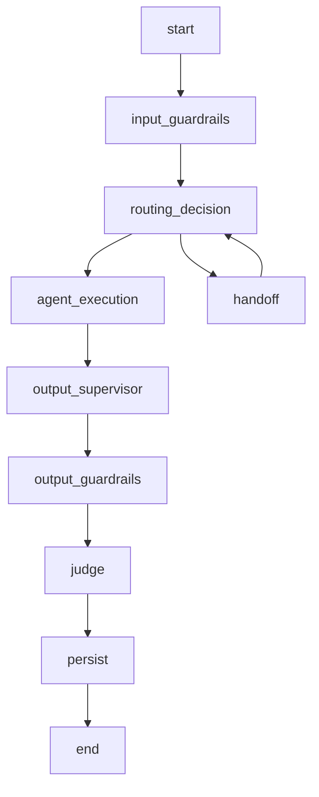
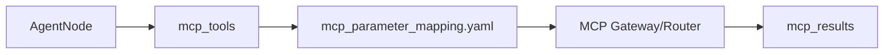

### LLM Rich Response and reasoning_content

### How to use this manual

This is a **specialized reference manual**. It does not replace the main tutorial.

- To build an agent end to end, use [`README_en.md`](../../../README_en.md).
- Use this document when implementing, deep-diving or troubleshooting **`ainvoke_response()`, inference metadata and optional `reasoning_content`**.
- Historical examples consolidated here must be interpreted against the current framework API.
- If documentation differs, the current code and root README take precedence.

### Relationship with the main tutorial

`README_en.md` introduces this capability as part of the normal development flow. This manual consolidates details previously spread across `docs/`, `Documentacao/`, release notes, validation records and specialized guides.

Its purpose is to answer **“how does this feature work in depth and how do I troubleshoot it?”** without becoming a second copy of the main tutorial.

### Scope

`ainvoke_response()`, inference metadata and optional `reasoning_content`.

### Consolidated technical content

### LLM Rich Response and reasoning_content

The LLM abstraction keeps the legacy string-returning API and adds an opt-in structured response for consumers that need inference metadata.

### Legacy API

`ainvoke()` continues to return `str`. Existing agents do not need to change and callers that do not need metadata should keep using it.

### Rich API

`ainvoke_response()` returns a structured object containing the final content and, when available, `reasoning_content`, usage, model and provider metadata.

`reasoning_content` is optional. The framework never fabricates it. If a provider/model does not expose this field, the value is `None`. The reasoning field remains separate from final user-visible content.

### Backoffice use

A Backoffice consumer that needs model-decision metadata may opt into `ainvoke_response()` while agent runtime paths that only need final content keep using `ainvoke()`.

### Provider compatibility

Custom providers that only implement the legacy method continue to work through fallback behavior: the framework wraps the returned text as rich content and leaves reasoning metadata unset. Provider implementations that support richer metadata can override/implement the rich path directly.

### Testing

Cover legacy return type, provider with reasoning, provider without reasoning, fallback custom provider, usage/model/provider metadata and failure behavior.

### Source material consolidated

- `docs/LLM_RICH_RESPONSE.md`

### Detailed normative and implementation reference

The sections below preserve the detailed English project specifications and implementation guides relevant to this capability. They are included here so a developer does not need to reconstruct the behavior from separate documents.

### LLM runtime contract context

> Consolidated from `specs/SPEC-002-Agent-Runtime.md`.

### Escopo

O Agent Runtime executa o ciclo de vida conversacional do agente. A execução inclui normalização de contexto, estado LangGraph, memória, checkpoint, roteamento, supervisor, guardrails, MCP, RAG, LLM, judges, persistência e resposta final.

### Componentes

| Componente | Responsabilidade |
|---|---|
| Workflow Builder | Compila o grafo LangGraph. |
| State Manager | Mantém o estado de execução. |
| Session Manager | Resolve sessão e conversation_key. |
| Memory Manager | Carrega e persiste histórico. |
| Checkpoint Manager | Persiste estado LangGraph. |
| Input Guardrail Node | Executa guardrails de entrada. |
| Router Node | Decide rota/intent. |
| Supervisor Node | Decide handoff ou próximo agente quando habilitado. |
| Agent Node | Executa agente de domínio. |
| MCP Client/Router | Executa tools por contrato. |
| RAG Service | Recupera contexto documental. |
| Output Supervisor | Revisa resposta antes de saída. |
| Output Guardrail Node | Executa guardrails de saída. |
| Judge Node | Avalia resposta. |
| Persistence Node | Persiste mensagens, memória e checkpoint. |

### State Model

```python
class AgentState(TypedDict, total=False):
    user_text: str
    sanitized_input: str
    response_text: str
    tenant_id: str
    agent_id: str
    channel: str
    session_id: str
    conversation_key: str
    message_id: str
    route: str
    intent: str
    context: dict
    business_context: dict
    tool_arguments: dict
    mcp_tools: list[str]
    mcp_results: list[dict]
    rag_context: str
    rag_metadata: dict
    guardrails: list[dict]
    judges: list[dict]
    metadata: dict
    errors: list[dict]
```

### Workflow



### Nós

| Nó | Entrada | Saída |
|---|---|---|
| `input_guardrails` | `user_text`, `context` | `sanitized_input`, `guardrails` |
| `routing_decision` | `sanitized_input`, `business_context` | `route`, `intent`, `mcp_tools` |
| `agent_execution` | `state` completo | `response_text`, `mcp_results`, `rag_metadata` |
| `output_supervisor` | `response_text` | `response_text` revisado |
| `output_guardrails` | `response_text` | `response_text`, `guardrails` |
| `judge` | `response_text`, evidências | `judges` |
| `persist` | `state` completo | checkpoint, memória, mensagens |

### Router

```yaml
routing:
  mode: router
  fallback_agent: billing_agent
  enable_llm_router: false
  intents:
    billing_invoice_explanation:
      route: billing_agent
      keywords:
        - fatura
        - cobrança
        - boleto
      mcp_tools:
        - consultar_fatura
        - consultar_pagamentos
```

### Supervisor

```yaml
supervisor:
  enabled: true
  profile: supervisor
  max_turns: 5
  handoff_enabled: true
  fallback_route: support_agent
```

### Memory

| Provider | Uso |
|---|---|
| `memory` | Execução local e testes. |
| `sqlite` | Desenvolvimento local persistente. |
| `mongodb` | Checkpoint e histórico em ambiente distribuído. |
| `autonomous` | Produção com Oracle Autonomous Database. |

### Checkpoints

Checkpoint contém:

```json
{
  "conversation_key": "default:telecom_contas:session-001",
  "checkpoint_id": "ckpt-001",
  "state": {},
  "pending_writes": [],
  "created_at": "2026-06-19T12:00:00Z"
}
```

Formato entregue ao LangGraph:

```python
pending_writes: list[tuple[str, str, object]]
```

### Business Context

```yaml
business_context:
  customer_key: "11999999999"
  contract_key: "3000131180"
  interaction_key: "301953872"
  account_key: null
  resource_key: null
  session_key: "session-001"
  metadata:
    source_channel: web
```

### Ordem de Prioridade dos Dados

1. `tool_arguments`
2. `business_context`
3. `context`
4. `session.metadata`
5. `state`
6. extração complementar do texto

### MCP Integration



### RAG Integration

```yaml
rag:
  enabled: true
  namespace_strategy: agent_id
  top_k: 5
  profile_generation: rag_generation
```

### Eventos

| Evento | Descrição |
|---|---|
| `runtime.started` | Execução iniciada. |
| `runtime.session.loaded` | Sessão carregada. |
| `runtime.memory.loaded` | Memória carregada. |
| `runtime.checkpoint.loaded` | Checkpoint carregado. |
| `runtime.route.selected` | Rota selecionada. |
| `runtime.agent.started` | Agente iniciado. |
| `runtime.agent.completed` | Agente concluído. |
| `runtime.persist.completed` | Persistência concluída. |
| `runtime.failed` | Falha controlada. |

### Erros

| Código | Condição | Tratamento |
|---|---|---|
| `RUNTIME_INVALID_REQUEST` | GatewayRequest inválido | 422 |
| `RUNTIME_ROUTE_NOT_FOUND` | Nenhuma rota elegível | fallback ou resposta controlada |
| `RUNTIME_CHECKPOINT_ERROR` | Falha em checkpoint | retry ou stateless conforme config |
| `RUNTIME_MEMORY_ERROR` | Falha em memória | retry ou resposta controlada |
| `RUNTIME_AGENT_ERROR` | Falha no agente | NOC + fallback |
| `RUNTIME_TIMEOUT` | Timeout geral | resposta controlada |


### Contrato Durável de Estado Transacional

Hosts que utilizam `AgentRuntime` com transações multi-turno DEVEM declarar no `AgentState` os campos `active_transaction` e `last_transaction`. O primeiro é a fonte canônica da transação em andamento e deve sobreviver a checkpoint/resume; o segundo mantém o snapshot da última transação terminal.

```python
active_transaction: dict[str, Any]
last_transaction: dict[str, Any]
```

`selected_tool_call` e `pending_tool_call` são campos auxiliares/compatibilidade e não substituem o latch canônico. Durante `COLLECTING_PARAMETERS`, a retomada da transação e o consumo de parâmetros pendentes têm precedência sobre keyword routing genérico. Uma mudança de intenção só deve interromper a transação quando for inequívoca ou explicitamente solicitada pelo usuário.

O contrato completo, ciclo de vida, precedência de roteamento, checklist e testes regressivos estão em [`docs/TRANSACTION_STATE_DEVELOPER_GUIDE.md`](../docs/TRANSACTION_STATE_DEVELOPER_GUIDE.md).


### Requisitos Não Funcionais

| Categoria | Requisito |
|---|---|
| Disponibilidade | Componentes deployáveis expõem `/health` e `/ready`. |
| Escalabilidade | Apps stateless escalam horizontalmente. Estado conversacional fica em repositórios externos. |
| Segurança | Segredos são fornecidos por secret store ou Kubernetes Secrets. |
| Observabilidade | Logs, métricas e traces usam correlação por request_id, trace_id, session_id, tenant_id e agent_id. |
| Auditabilidade | Decisões de rota, guardrail, judge, MCP e LLM são rastreáveis. |
| Portabilidade | Execução suportada em local, Docker Compose e Kubernetes/OKE. |
| Configuração | Comportamento variável é controlado por `.env` e YAML versionado. |


### Critérios de Aceite

- [ ] Runtime recebe GatewayRequest validado.
- [ ] State contém tenant_id, agent_id, session_id, conversation_key, route e intent.
- [ ] Input guardrails executam antes do roteamento.
- [ ] Router ou Supervisor seleciona rota.
- [ ] Agent Node executa sem acessar payload bruto de canal.
- [ ] MCP é acessado por contrato.
- [ ] RAG é acessado por serviço reutilizável.
- [ ] Output guardrails executam antes da resposta final.
- [ ] Judges geram JudgeResult.
- [ ] Memória e checkpoint são persistidos conforme provider.
- [ ] Hosts transacionais declaram `active_transaction` e `last_transaction` no `AgentState`.
- [ ] Durante `COLLECTING_PARAMETERS`, respostas a parâmetros pendentes têm precedência sobre keyword routing genérico.
- [ ] Erros geram NOC e resposta controlada.


### Glossário

| Termo | Definição |
|---|---|
| Agent Platform | Plataforma composta por runtime, gateways, evaluator, templates, contratos e componentes operacionais. |
| Agent Framework | Biblioteca/core reutilizável com contratos, guardrails, judges, memória, telemetria, providers e utilitários. |
| Agent Runtime | Motor de execução de agentes baseado em LangGraph, estado, sessão, memória, checkpoints, roteamento e ciclo de vida. |
| Agent Gateway | Aplicação deployável de entrada, roteamento e orquestração entre backends/agentes. |
| Channel Gateway | Aplicação ou módulo de normalização de payloads de canais para GatewayRequest. |
| AI Gateway | Aplicação de governança, roteamento e abstração de chamadas LLM/embedding. |
| MCP Gateway | Aplicação de governança e roteamento de tools MCP. |
| Evaluator | Camada de avaliação online/offline, regressão e certificação. |
| Business Context | Conjunto de chaves canônicas de negócio: customer_key, contract_key, interaction_key, account_key, resource_key e session_key. |

### Compatibility rules

> Consolidated from `specs/SPEC-013-Versioning-and-Compatibility-Model.md`.

### Agent Platform OCI

Version: 1.0.0


---

### Padrão de leitura

Cada SPEC está organizada para servir tanto como contrato arquitetural quanto como guia prático de adoção.

A estrutura usada é:

1. Conceito.
2. Problema que resolve.
3. Quando usar.
4. Quando não usar.
5. Arquitetura.
6. Implementação.
7. Exemplos.
8. Erros comuns.
9. Critérios de aceite.

---


### 1. Conceito

Versionamento define como a plataforma evolui sem quebrar projetos existentes. Compatibilidade define quais versões de framework, runtime, gateways, contracts, templates, prompts, tools e evaluator podem operar juntas.

### 2. Problema que resolve

Sem modelo de versionamento:

- uma mudança em GatewayRequest quebra canais;
- uma mudança em MCP tool quebra agentes;
- um prompt alterado muda comportamento sem rastreabilidade;
- evaluator muda score sem histórico;
- templates ficam incompatíveis com runtime;
- produção usa imagem `latest` sem controle.

### 3. Semantic Versioning

Formato:

```text
MAJOR.MINOR.PATCH
```

Regras:

| Parte | Significado |
| --- | --- |
| MAJOR | Mudança incompatível. |
| MINOR | Nova capacidade compatível. |
| PATCH | Correção sem mudança de contrato. |


### 4. Artefatos versionados

| Artefato | Modelo |
| --- | --- |
| agent_framework | SemVer |
| agent_runtime | SemVer alinhado ao framework |
| agent_gateway | SemVer + Docker tag |
| channel_gateway | SemVer + Docker tag |
| ai_gateway | SemVer + Docker tag |
| mcp_gateway | SemVer + Docker tag |
| templates | versão da plataforma |
| contracts | contract-name-vN |
| prompts | SemVer |
| datasets | SemVer |
| guardrails | SemVer por código |
| judges | SemVer por judge |
| mcp_tools | SemVer por tool |
| evaluator | SemVer |
| certification_suite | SemVer + ruleset version |


### 5. Contract versioning

Exemplos:

```text
gateway-request-v1
business-context-v1
tool-invocation-v1
llm-request-v1
```

Permitido na mesma versão major:

- adicionar campos opcionais;
- adicionar metadata;
- adicionar enum documentado.

Não permitido:

- remover campo obrigatório;
- mudar tipo;
- mudar significado;
- alterar regra obrigatória.

### 6. Compatibility Matrix

```yaml
compatibility:
  - framework: "1.4.x"
    runtime: "1.4.x"
    agent_gateway: "1.4.x"
    supported: true
  - framework: "1.4.x"
    runtime: "2.0.x"
    supported: false
```

### 7. Política de depreciação

Ciclo:

```text
Active → Deprecated → Retired
```

Período recomendado:

```text
12 meses
```

### 8. Política de migração

Mudanças major exigem:

- migration guide;
- compatibility matrix;
- rollback strategy;
- certification;
- evaluator;
- release notes.

### 9. Estratégia de rollback

Rollback deve considerar:

- imagem Docker;
- versão do pacote;
- versão dos YAMLs;
- versão do contrato;
- migration de banco;
- dataset;
- prompts.

### 10. Erros comuns

| Erro | Impacto | Correção |
| --- | --- | --- |
| Usar latest em produção | Deploy não reprodutível. | Usar tag explícita. |
| Mudar prompt sem versão | Sem rastreabilidade. | Versionar prompt. |
| Adicionar campo obrigatório em contrato v1 | Quebra clientes. | Criar v2. |
| Atualizar evaluator sem baseline | Scores não comparáveis. | Registrar versão e metodologia. |


### 11. Critérios de aceite

- [ ] Todos os componentes têm versão.
- [ ] Contratos têm versão independente.
- [ ] Matriz de compatibilidade publicada.
- [ ] Release notes publicadas.
- [ ] Migrações major possuem guide.
- [ ] Rollback definido.
- [ ] Prompts e datasets versionados.
- [ ] Evaluator e certification registram versão.
