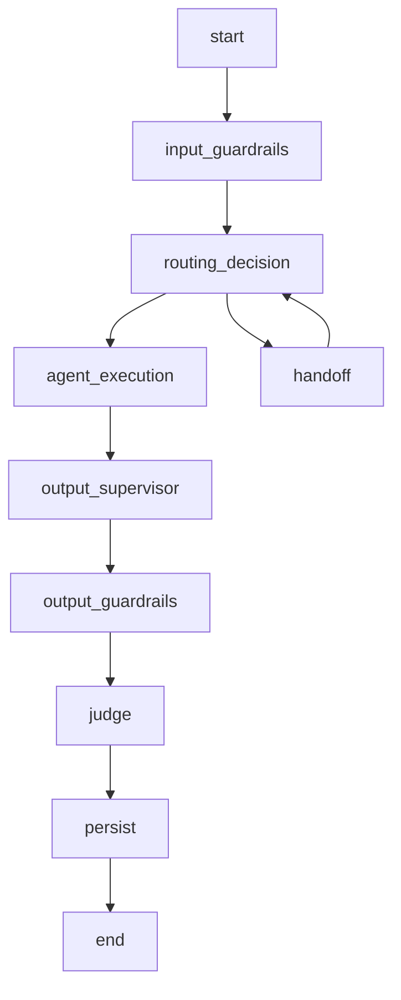
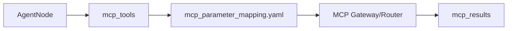
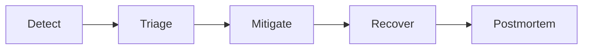

### Performance, Cache and Async Runtime

### How to use this manual

This is a **specialized reference manual**. It does not replace the main tutorial.

- To build an agent end to end, use [`README_en.md`](../../../README_en.md).
- Use this document when implementing, deep-diving or troubleshooting **concurrency, caching, reduction of LLM calls and cross-loop fixes**.
- Historical examples consolidated here must be interpreted against the current framework API.
- If documentation differs, the current code and root README take precedence.

### Relationship with the main tutorial

`README_en.md` introduces this capability as part of the normal development flow. This manual consolidates details previously spread across `docs/`, `Documentacao/`, release notes, validation records and specialized guides.

Its purpose is to answer **“how does this feature work in depth and how do I troubleshoot it?”** without becoming a second copy of the main tutorial.

### Scope

Concurrency, caching, reduction of llm calls and cross-loop fixes.

### Consolidated technical content

### Performance, Cache, Concurrency and Asynchronous Runtime

This guide collects optimizations that reduce latency without changing functional semantics.

### Optimization principles

Use deterministic signals before expensive semantic calls when they are reliable; execute independent work concurrently; avoid recomputing retrieval/tool metadata; cache only when correctness allows it; and keep I/O asynchronous without sharing loop-bound primitives incorrectly.

### MCP/RAG/Judges

MCP preparation and repeated metadata operations can be reused where safe. RAG should avoid repeated retrieval/embedding work through configured cache layers. Independent judges can execute concurrently instead of serially.

Transactional judge rules still override normal sampling optimization: performance must not skip critical evaluation.

### Routing optimization

Explicit intent-shift signals can preempt the route-continuity LLM. This reduces token consumption and latency while preserving semantic fallback for ambiguous cases.

### Cross-loop deadlock fix

Sequence generation/observability previously could wait on synchronization primitives associated with another event loop. The fix removes cross-loop waiting and keeps sequencing safe for asynchronous runtime and tests that create multiple loops.

### Validation

Performance tests should measure latency and call counts, not only functional output. Regression coverage should include concurrent judges, cached/uncached RAG behavior, MCP reuse paths, deterministic routing preemption and observer/sequence calls across separate event loops.

### Source material consolidated

- `docs/PERFORMANCE_OPTIMIZATIONS_MCP_JUDGES_RAG.md`
- `Documentacao/FIX_DEADLOCK_SEQUENCE_CROSS_LOOP.md`
- operational notes in `Documentacao/README_MAX_OPERACIONAL.md` and `README_FIRST_MAX_OPERATIONAL_FIXES.md`

### Detailed normative and implementation reference

The sections below preserve the detailed English project specifications and implementation guides relevant to this capability. They are included here so a developer does not need to reconstruct the behavior from separate documents.

### Runtime execution requirements

> Consolidated from `specs/SPEC-002-Agent-Runtime.md`.

### Escopo

O Agent Runtime executa o ciclo de vida conversacional do agente. A execução inclui normalização de contexto, estado LangGraph, memória, checkpoint, roteamento, supervisor, guardrails, MCP, RAG, LLM, judges, persistência e resposta final.

### Componentes

| Componente | Responsabilidade |
|---|---|
| Workflow Builder | Compila o grafo LangGraph. |
| State Manager | Mantém o estado de execução. |
| Session Manager | Resolve sessão e conversation_key. |
| Memory Manager | Carrega e persiste histórico. |
| Checkpoint Manager | Persiste estado LangGraph. |
| Input Guardrail Node | Executa guardrails de entrada. |
| Router Node | Decide rota/intent. |
| Supervisor Node | Decide handoff ou próximo agente quando habilitado. |
| Agent Node | Executa agente de domínio. |
| MCP Client/Router | Executa tools por contrato. |
| RAG Service | Recupera contexto documental. |
| Output Supervisor | Revisa resposta antes de saída. |
| Output Guardrail Node | Executa guardrails de saída. |
| Judge Node | Avalia resposta. |
| Persistence Node | Persiste mensagens, memória e checkpoint. |

### State Model

```python
class AgentState(TypedDict, total=False):
    user_text: str
    sanitized_input: str
    response_text: str
    tenant_id: str
    agent_id: str
    channel: str
    session_id: str
    conversation_key: str
    message_id: str
    route: str
    intent: str
    context: dict
    business_context: dict
    tool_arguments: dict
    mcp_tools: list[str]
    mcp_results: list[dict]
    rag_context: str
    rag_metadata: dict
    guardrails: list[dict]
    judges: list[dict]
    metadata: dict
    errors: list[dict]
```

### Workflow



### Nós

| Nó | Entrada | Saída |
|---|---|---|
| `input_guardrails` | `user_text`, `context` | `sanitized_input`, `guardrails` |
| `routing_decision` | `sanitized_input`, `business_context` | `route`, `intent`, `mcp_tools` |
| `agent_execution` | `state` completo | `response_text`, `mcp_results`, `rag_metadata` |
| `output_supervisor` | `response_text` | `response_text` revisado |
| `output_guardrails` | `response_text` | `response_text`, `guardrails` |
| `judge` | `response_text`, evidências | `judges` |
| `persist` | `state` completo | checkpoint, memória, mensagens |

### Router

```yaml
routing:
  mode: router
  fallback_agent: billing_agent
  enable_llm_router: false
  intents:
    billing_invoice_explanation:
      route: billing_agent
      keywords:
        - fatura
        - cobrança
        - boleto
      mcp_tools:
        - consultar_fatura
        - consultar_pagamentos
```

### Supervisor

```yaml
supervisor:
  enabled: true
  profile: supervisor
  max_turns: 5
  handoff_enabled: true
  fallback_route: support_agent
```

### Memory

| Provider | Uso |
|---|---|
| `memory` | Execução local e testes. |
| `sqlite` | Desenvolvimento local persistente. |
| `mongodb` | Checkpoint e histórico em ambiente distribuído. |
| `autonomous` | Produção com Oracle Autonomous Database. |

### Checkpoints

Checkpoint contém:

```json
{
  "conversation_key": "default:telecom_contas:session-001",
  "checkpoint_id": "ckpt-001",
  "state": {},
  "pending_writes": [],
  "created_at": "2026-06-19T12:00:00Z"
}
```

Formato entregue ao LangGraph:

```python
pending_writes: list[tuple[str, str, object]]
```

### Business Context

```yaml
business_context:
  customer_key: "11999999999"
  contract_key: "3000131180"
  interaction_key: "301953872"
  account_key: null
  resource_key: null
  session_key: "session-001"
  metadata:
    source_channel: web
```

### Ordem de Prioridade dos Dados

1. `tool_arguments`
2. `business_context`
3. `context`
4. `session.metadata`
5. `state`
6. extração complementar do texto

### MCP Integration



### RAG Integration

```yaml
rag:
  enabled: true
  namespace_strategy: agent_id
  top_k: 5
  profile_generation: rag_generation
```

### Eventos

| Evento | Descrição |
|---|---|
| `runtime.started` | Execução iniciada. |
| `runtime.session.loaded` | Sessão carregada. |
| `runtime.memory.loaded` | Memória carregada. |
| `runtime.checkpoint.loaded` | Checkpoint carregado. |
| `runtime.route.selected` | Rota selecionada. |
| `runtime.agent.started` | Agente iniciado. |
| `runtime.agent.completed` | Agente concluído. |
| `runtime.persist.completed` | Persistência concluída. |
| `runtime.failed` | Falha controlada. |

### Erros

| Código | Condição | Tratamento |
|---|---|---|
| `RUNTIME_INVALID_REQUEST` | GatewayRequest inválido | 422 |
| `RUNTIME_ROUTE_NOT_FOUND` | Nenhuma rota elegível | fallback ou resposta controlada |
| `RUNTIME_CHECKPOINT_ERROR` | Falha em checkpoint | retry ou stateless conforme config |
| `RUNTIME_MEMORY_ERROR` | Falha em memória | retry ou resposta controlada |
| `RUNTIME_AGENT_ERROR` | Falha no agente | NOC + fallback |
| `RUNTIME_TIMEOUT` | Timeout geral | resposta controlada |


### Contrato Durável de Estado Transacional

Hosts que utilizam `AgentRuntime` com transações multi-turno DEVEM declarar no `AgentState` os campos `active_transaction` e `last_transaction`. O primeiro é a fonte canônica da transação em andamento e deve sobreviver a checkpoint/resume; o segundo mantém o snapshot da última transação terminal.

```python
active_transaction: dict[str, Any]
last_transaction: dict[str, Any]
```

`selected_tool_call` e `pending_tool_call` são campos auxiliares/compatibilidade e não substituem o latch canônico. Durante `COLLECTING_PARAMETERS`, a retomada da transação e o consumo de parâmetros pendentes têm precedência sobre keyword routing genérico. Uma mudança de intenção só deve interromper a transação quando for inequívoca ou explicitamente solicitada pelo usuário.

O contrato completo, ciclo de vida, precedência de roteamento, checklist e testes regressivos estão em [`docs/TRANSACTION_STATE_DEVELOPER_GUIDE.md`](../docs/TRANSACTION_STATE_DEVELOPER_GUIDE.md).


### Requisitos Não Funcionais

| Categoria | Requisito |
|---|---|
| Disponibilidade | Componentes deployáveis expõem `/health` e `/ready`. |
| Escalabilidade | Apps stateless escalam horizontalmente. Estado conversacional fica em repositórios externos. |
| Segurança | Segredos são fornecidos por secret store ou Kubernetes Secrets. |
| Observabilidade | Logs, métricas e traces usam correlação por request_id, trace_id, session_id, tenant_id e agent_id. |
| Auditabilidade | Decisões de rota, guardrail, judge, MCP e LLM são rastreáveis. |
| Portabilidade | Execução suportada em local, Docker Compose e Kubernetes/OKE. |
| Configuração | Comportamento variável é controlado por `.env` e YAML versionado. |


### Critérios de Aceite

- [ ] Runtime recebe GatewayRequest validado.
- [ ] State contém tenant_id, agent_id, session_id, conversation_key, route e intent.
- [ ] Input guardrails executam antes do roteamento.
- [ ] Router ou Supervisor seleciona rota.
- [ ] Agent Node executa sem acessar payload bruto de canal.
- [ ] MCP é acessado por contrato.
- [ ] RAG é acessado por serviço reutilizável.
- [ ] Output guardrails executam antes da resposta final.
- [ ] Judges geram JudgeResult.
- [ ] Memória e checkpoint são persistidos conforme provider.
- [ ] Hosts transacionais declaram `active_transaction` e `last_transaction` no `AgentState`.
- [ ] Durante `COLLECTING_PARAMETERS`, respostas a parâmetros pendentes têm precedência sobre keyword routing genérico.
- [ ] Erros geram NOC e resposta controlada.


### Glossário

| Termo | Definição |
|---|---|
| Agent Platform | Plataforma composta por runtime, gateways, evaluator, templates, contratos e componentes operacionais. |
| Agent Framework | Biblioteca/core reutilizável com contratos, guardrails, judges, memória, telemetria, providers e utilitários. |
| Agent Runtime | Motor de execução de agentes baseado em LangGraph, estado, sessão, memória, checkpoints, roteamento e ciclo de vida. |
| Agent Gateway | Aplicação deployável de entrada, roteamento e orquestração entre backends/agentes. |
| Channel Gateway | Aplicação ou módulo de normalização de payloads de canais para GatewayRequest. |
| AI Gateway | Aplicação de governança, roteamento e abstração de chamadas LLM/embedding. |
| MCP Gateway | Aplicação de governança e roteamento de tools MCP. |
| Evaluator | Camada de avaliação online/offline, regressão e certificação. |
| Business Context | Conjunto de chaves canônicas de negócio: customer_key, contract_key, interaction_key, account_key, resource_key e session_key. |

### Operational performance and SRE requirements

> Consolidated from `specs/SPEC-020-Operational-Readiness-and-SRE-Model.md`.

### Agent Platform OCI

Version: 1.0.0


---

### Padrão de leitura

Cada SPEC está organizada para servir tanto como contrato arquitetural quanto como guia prático de adoção.

A estrutura usada é:

1. Conceito.
2. Problema que resolve.
3. Quando usar.
4. Quando não usar.
5. Arquitetura.
6. Implementação.
7. Exemplos.
8. Erros comuns.
9. Critérios de aceite.

---


### 1. Conceito

Operational Readiness define os requisitos mínimos para operar a Agent Platform OCI em produção com confiabilidade, observabilidade, capacidade de resposta a incidentes e recuperação.

### 2. Componentes operados

- Agent Gateway;
- Channel Gateway;
- Agent Runtime;
- AI Gateway;
- MCP Gateway;
- MCP Servers;
- Evaluator;
- bancos/repositórios;
- Langfuse/OTEL;
- Redis/Mongo/ADB quando usados.

### 3. Health e readiness

Endpoints mínimos:

```text
GET /health
GET /ready
GET /version
```

### 4. SLOs

| Componente | Latência | Disponibilidade |
| --- | --- | --- |
| Agent Gateway | p95 < 1s | 99.5% |
| Agent Runtime | p95 < 5s | 99.0% |
| AI Gateway | p95 < 10s | 99.0% |
| MCP Gateway | p95 < 2s | 99.0% |
| Evaluator | janela batch | execução diária |


### 5. Métricas

- requests_total;
- request_latency_ms;
- errors_total;
- active_sessions;
- llm_tokens_total;
- llm_cost_estimated;
- mcp_tool_calls_total;
- guardrail_blocks_total;
- judge_scores;
- evaluator_scores.

### 6. Dashboards

Dashboards mínimos:

- Platform Overview;
- Runtime;
- Gateway;
- AI Gateway;
- MCP Gateway;
- Guardrails;
- Evaluator;
- Cost/Usage;
- Incidents.

### 7. Alertas

| Alerta | Condição |
| --- | --- |
| HighErrorRate | 5xx acima do limite. |
| LatencySLOBreach | p95 acima do SLO. |
| LLMProviderDown | Falhas consecutivas no provider. |
| MCPTimeoutSpike | Aumento de timeout MCP. |
| GuardrailSpike | Aumento anômalo de bloqueios. |
| EvaluatorFailed | Run falhou. |


### 8. Runbooks

Runbook deve conter:

- sintoma;
- impacto;
- consultas;
- dashboards;
- logs;
- ações;
- rollback;
- escalonamento.

### 9. Incident management

Fluxo:



### 10. Capacidade

Avaliar:

- QPS;
- sessões simultâneas;
- tokens/minuto;
- chamadas MCP/minuto;
- latência de provider;
- uso de memória;
- storage de checkpoints.

### 11. Erros comuns

| Erro | Impacto | Correção |
| --- | --- | --- |
| Sem readiness | Tráfego antes do app estar pronto. | Implementar /ready. |
| Sem alertas MCP | Falha silenciosa. | Criar alertas por tool. |
| Sem runbook | MTTR alto. | Criar runbooks por incidente. |
| Sem custo LLM | Sem controle financeiro. | Registrar tokens/custos. |


### 12. Production readiness checklist

- [ ] Health checks ativos.
- [ ] Readiness checks ativos.
- [ ] Logs estruturados.
- [ ] Métricas exportadas.
- [ ] Traces exportados.
- [ ] Dashboards criados.
- [ ] Alertas configurados.
- [ ] Runbooks disponíveis.
- [ ] Rollback validado.
- [ ] SLOs definidos.
- [ ] Capacidade estimada.
- [ ] Incident process definido.
