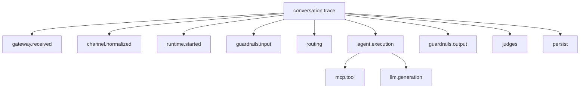
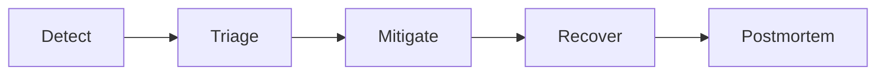

### Observability, Persistence and Operational Readiness

### How to use this manual

This is a **specialized reference manual**. It does not replace the main tutorial.

- To build an agent end to end, use [`README_en.md`](../../../README_en.md).
- Use this document when implementing, deep-diving or troubleshooting **telemetry, IC/NOC/GRL, correlation, sequencing, persistence and operational diagnostics**.
- Historical examples consolidated here must be interpreted against the current framework API.
- If documentation differs, the current code and root README take precedence.

### Relationship with the main tutorial

`README_en.md` introduces this capability as part of the normal development flow. This manual consolidates details previously spread across `docs/`, `Documentacao/`, release notes, validation records and specialized guides.

Its purpose is to answer **“how does this feature work in depth and how do I troubleshoot it?”** without becoming a second copy of the main tutorial.

### Scope

Telemetry, ic/noc/grl, correlation, sequencing, persistence and operational diagnostics.

### Consolidated technical content

### Observability, Persistence and Operational Readiness

This guide consolidates the FIRST-ready operational capabilities that turn the framework into an observable, persistent platform rather than a stateless demo.

### End-to-end correlation

Every request should preserve correlation across channel/gateway, selected agent, LangGraph execution, guardrails, judges, MCP calls and final response. Tenant, agent, session, request/trace and transaction identifiers should remain consistent across emitted events.

### Langfuse and OpenTelemetry

Langfuse provides LLM/trace-oriented observability while OpenTelemetry supports vendor-neutral traces/metrics/log integration. The runtime adapters should wrap the real execution path rather than emitting synthetic telemetry disconnected from the actual graph/tool call.

### LangGraph telemetry

Graph execution should be traced around the real nodes/edges so route decisions, agent execution and failures are visible. SSE responses must preserve correlation even though delivery is streamed.

### Persistent state

Enterprise configurations may use Oracle Autonomous Database for durable platform data. Checkpoints, sessions, long-term memory and analytics have different retention/consistency requirements and should not be collapsed into a single logical table just because they share a database technology.

### Token and cost accounting

Model usage metadata can be persisted/aggregated for operational and financial visibility. Rich provider usage metadata should be preferred when available; missing provider fields must not be invented.

### Cache

Enterprise cache reduces repeated work for safe reusable operations. Cache keys must include the identity/context necessary to prevent cross-agent or cross-tenant leakage.

### Operational validation

Before production, validate failure paths, telemetry delivery, disabled-observability behavior, persistence restart, SSE correlation, tool latency/error spans, guardrail/judge events and token/cost accounting. Also validate the Global Supervisor configuration if that routing mode is used.

### Source material consolidated

- `Documentacao/README_FIRST_READY.md`
- `Documentacao/README_FIRST_ENTERPRISE_PLUS.md`
- `Documentacao/README_FIRST_ENTERPRISE_DELTA.md`
- `Documentacao/README_MAX_OPERACIONAL.md`
- Global Supervisor validation records under `docs/`

### Detailed normative and implementation reference

The sections below preserve the detailed English project specifications and implementation guides relevant to this capability. They are included here so a developer does not need to reconstruct the behavior from separate documents.

### Observability specification

> Consolidated from `specs/SPEC-007-Observability.md`.

### Escopo

Observabilidade cobre logs, métricas, traces, eventos IC/NOC/GRL, Langfuse, OpenTelemetry, dashboards, alertas e evidências operacionais.

### Correlação

Campos obrigatórios:

```text
request_id
trace_id
session_id
conversation_key
tenant_id
agent_id
channel
message_id
route
intent
```

### Logs

Formato:

```json
{
  "timestamp": "2026-06-19T12:00:00Z",
  "level": "INFO",
  "service": "agent-runtime",
  "event": "runtime.route.selected",
  "tenant_id": "default",
  "agent_id": "telecom_contas",
  "session_id": "default:telecom_contas:session-001",
  "trace_id": "trace-001",
  "route": "billing_agent",
  "intent": "billing_invoice_explanation"
}
```

### Traces



### Métricas

| Métrica | Dimensões |
|---|---|
| `requests_total` | service, tenant, agent, channel, status |
| `request_latency_ms` | service, route, intent |
| `active_sessions` | tenant, agent |
| `llm_tokens_total` | provider, model, profile |
| `llm_cost_estimated` | provider, model, tenant, agent |
| `mcp_tool_calls_total` | tool, server, status |
| `mcp_tool_latency_ms` | tool, server |
| `guardrail_blocks_total` | code, phase, agent |
| `judge_scores` | metric, agent, route |
| `errors_total` | service, component, error_type |

### Langfuse

Dados registrados:

- trace de conversa;
- spans técnicos;
- generations LLM;
- prompts e respostas quando permitido;
- tokens;
- custos;
- latência;
- scores;
- metadados;
- erros.

### OpenTelemetry

Configuração:

```yaml
otel:
  enabled: true
  service_name: agent-runtime
  exporter: otlp
  endpoint: http://otel-collector:4317
```

### IC/NOC/GRL

| Família | Eventos |
|---|---|
| IC | `IC.GATEWAY_RECEIVED`, `IC.AGENT_STARTED`, `IC.AGENT_COMPLETED` |
| NOC | `NOC.RUNTIME_FAILED`, `NOC.MCP_TIMEOUT`, `NOC.LLM_FAILED` |
| GRL | `GRL.INPUT_BLOCKED`, `GRL.OUTPUT_BLOCKED`, `GRL.MASK_APPLIED` |

### Dashboards

| Dashboard | Conteúdo |
|---|---|
| Platform Overview | tráfego, erros, latência, sessões. |
| Agent Runtime | rotas, intents, memória, checkpoints. |
| LLM Usage | tokens, custo, latência, provider/model. |
| MCP Operations | chamadas, erros, cache, latência. |
| Guardrails | bloqueios, observe-only, códigos. |
| Evals | scores, trends, regressões. |
| Channels | tráfego por canal, erros, retries. |

### Alertas

| Alerta | Condição |
|---|---|
| `GatewayHighErrorRate` | Erros 5xx acima do limite. |
| `RuntimeLatencyHigh` | p95 acima do SLO. |
| `LLMProviderUnavailable` | falhas consecutivas de provider. |
| `MCPToolTimeoutSpike` | aumento de timeouts. |
| `GuardrailBlockSpike` | aumento anômalo de bloqueios. |
| `EvaluatorRunFailed` | run batch falhou. |
| `CheckpointFailure` | falha persistente em checkpoint. |

### Mascaramento

Campos mascarados:

- tokens;
- API keys;
- senhas;
- secrets;
- CPF/CNPJ, quando aplicável;
- telefone, quando configurado;
- payload bruto de canal;
- documentos sensíveis.

### Evidências

Relatórios de homologação incluem:

- health checks;
- logs de execução;
- traces Langfuse;
- métricas;
- resultados de guardrails;
- resultados de judges;
- chamadas MCP;
- chamadas LLM;
- relatório do evaluator;
- relatório da certification suite.


### Requisitos Não Funcionais

| Categoria | Requisito |
|---|---|
| Disponibilidade | Componentes deployáveis expõem `/health` e `/ready`. |
| Escalabilidade | Apps stateless escalam horizontalmente. Estado conversacional fica em repositórios externos. |
| Segurança | Segredos são fornecidos por secret store ou Kubernetes Secrets. |
| Observabilidade | Logs, métricas e traces usam correlação por request_id, trace_id, session_id, tenant_id e agent_id. |
| Auditabilidade | Decisões de rota, guardrail, judge, MCP e LLM são rastreáveis. |
| Portabilidade | Execução suportada em local, Docker Compose e Kubernetes/OKE. |
| Configuração | Comportamento variável é controlado por `.env` e YAML versionado. |


### Critérios de Aceite

- [ ] Todos os serviços emitem logs estruturados.
- [ ] Trace correlaciona gateway, runtime, MCP, LLM, guardrails e judges.
- [ ] Langfuse recebe traces quando habilitado.
- [ ] OTEL exporta spans quando habilitado.
- [ ] Métricas mínimas estão disponíveis.
- [ ] Dashboards estão definidos.
- [ ] Alertas estão definidos.
- [ ] Segredos e PII são mascarados.
- [ ] Evaluator consome dados observáveis.
- [ ] Certification Suite gera evidências.


### Glossário

| Termo | Definição |
|---|---|
| Agent Platform | Plataforma composta por runtime, gateways, evaluator, templates, contratos e componentes operacionais. |
| Agent Framework | Biblioteca/core reutilizável com contratos, guardrails, judges, memória, telemetria, providers e utilitários. |
| Agent Runtime | Motor de execução de agentes baseado em LangGraph, estado, sessão, memória, checkpoints, roteamento e ciclo de vida. |
| Agent Gateway | Aplicação deployável de entrada, roteamento e orquestração entre backends/agentes. |
| Channel Gateway | Aplicação ou módulo de normalização de payloads de canais para GatewayRequest. |
| AI Gateway | Aplicação de governança, roteamento e abstração de chamadas LLM/embedding. |
| MCP Gateway | Aplicação de governança e roteamento de tools MCP. |
| Evaluator | Camada de avaliação online/offline, regressão e certificação. |
| Business Context | Conjunto de chaves canônicas de negócio: customer_key, contract_key, interaction_key, account_key, resource_key e session_key. |

### Operational readiness and SRE model

> Consolidated from `specs/SPEC-020-Operational-Readiness-and-SRE-Model.md`.

### Agent Platform OCI

Version: 1.0.0


---

### Padrão de leitura

Cada SPEC está organizada para servir tanto como contrato arquitetural quanto como guia prático de adoção.

A estrutura usada é:

1. Conceito.
2. Problema que resolve.
3. Quando usar.
4. Quando não usar.
5. Arquitetura.
6. Implementação.
7. Exemplos.
8. Erros comuns.
9. Critérios de aceite.

---


### 1. Conceito

Operational Readiness define os requisitos mínimos para operar a Agent Platform OCI em produção com confiabilidade, observabilidade, capacidade de resposta a incidentes e recuperação.

### 2. Componentes operados

- Agent Gateway;
- Channel Gateway;
- Agent Runtime;
- AI Gateway;
- MCP Gateway;
- MCP Servers;
- Evaluator;
- bancos/repositórios;
- Langfuse/OTEL;
- Redis/Mongo/ADB quando usados.

### 3. Health e readiness

Endpoints mínimos:

```text
GET /health
GET /ready
GET /version
```

### 4. SLOs

| Componente | Latência | Disponibilidade |
| --- | --- | --- |
| Agent Gateway | p95 < 1s | 99.5% |
| Agent Runtime | p95 < 5s | 99.0% |
| AI Gateway | p95 < 10s | 99.0% |
| MCP Gateway | p95 < 2s | 99.0% |
| Evaluator | janela batch | execução diária |


### 5. Métricas

- requests_total;
- request_latency_ms;
- errors_total;
- active_sessions;
- llm_tokens_total;
- llm_cost_estimated;
- mcp_tool_calls_total;
- guardrail_blocks_total;
- judge_scores;
- evaluator_scores.

### 6. Dashboards

Dashboards mínimos:

- Platform Overview;
- Runtime;
- Gateway;
- AI Gateway;
- MCP Gateway;
- Guardrails;
- Evaluator;
- Cost/Usage;
- Incidents.

### 7. Alertas

| Alerta | Condição |
| --- | --- |
| HighErrorRate | 5xx acima do limite. |
| LatencySLOBreach | p95 acima do SLO. |
| LLMProviderDown | Falhas consecutivas no provider. |
| MCPTimeoutSpike | Aumento de timeout MCP. |
| GuardrailSpike | Aumento anômalo de bloqueios. |
| EvaluatorFailed | Run falhou. |


### 8. Runbooks

Runbook deve conter:

- sintoma;
- impacto;
- consultas;
- dashboards;
- logs;
- ações;
- rollback;
- escalonamento.

### 9. Incident management

Fluxo:



### 10. Capacidade

Avaliar:

- QPS;
- sessões simultâneas;
- tokens/minuto;
- chamadas MCP/minuto;
- latência de provider;
- uso de memória;
- storage de checkpoints.

### 11. Erros comuns

| Erro | Impacto | Correção |
| --- | --- | --- |
| Sem readiness | Tráfego antes do app estar pronto. | Implementar /ready. |
| Sem alertas MCP | Falha silenciosa. | Criar alertas por tool. |
| Sem runbook | MTTR alto. | Criar runbooks por incidente. |
| Sem custo LLM | Sem controle financeiro. | Registrar tokens/custos. |


### 12. Production readiness checklist

- [ ] Health checks ativos.
- [ ] Readiness checks ativos.
- [ ] Logs estruturados.
- [ ] Métricas exportadas.
- [ ] Traces exportados.
- [ ] Dashboards criados.
- [ ] Alertas configurados.
- [ ] Runbooks disponíveis.
- [ ] Rollback validado.
- [ ] SLOs definidos.
- [ ] Capacidade estimada.
- [ ] Incident process definido.

### Deployment operational requirements

> Consolidated from `specs/SPEC-008-Deployment.md`.

### Escopo

Deployment cobre empacotamento, CI/CD, Kubernetes/OKE, Docker, secrets, autenticação OCI, health checks, rollback e operação dos componentes.

### Componentes Deployáveis

| Componente | Artefato |
|---|---|
| Agent Gateway | Docker image + Kubernetes Deployment |
| Channel Gateway | Docker image + Kubernetes Deployment |
| AI Gateway | Docker image + Kubernetes Deployment |
| MCP Gateway | Docker image + Kubernetes Deployment |
| Agent Backend | Docker image + Kubernetes Deployment |
| MCP Server | Docker image + Kubernetes Deployment |
| Evaluator API | Docker image + Kubernetes Deployment |
| Evaluator Batch | Kubernetes CronJob |
| Frontend Demo | Docker image opcional |

### Pipeline


### Stages

```yaml
stages:
  - validate
  - lint
  - type_check
  - unit_test
  - contract_test
  - security_scan
  - build_package
  - build_image
  - publish
  - deploy_dev
  - smoke_test
  - certification
  - deploy_hml
  - deploy_prod
```

### Kubernetes Deployment

```yaml
apiVersion: apps/v1
kind: Deployment
metadata:
  name: agent-runtime
  labels:
    app: agent-runtime
    component: runtime
spec:
  replicas: 2
  selector:
    matchLabels:
      app: agent-runtime
  template:
    metadata:
      labels:
        app: agent-runtime
    spec:
      serviceAccountName: agent-runtime-sa
      containers:
        - name: agent-runtime
          image: registry/agent-runtime:1.0.0
          ports:
            - containerPort: 8000
          envFrom:
            - configMapRef:
                name: agent-runtime-config
            - secretRef:
                name: agent-runtime-secrets
          readinessProbe:
            httpGet:
              path: /ready
              port: 8000
          livenessProbe:
            httpGet:
              path: /health
              port: 8000
```

### Service

```yaml
apiVersion: v1
kind: Service
metadata:
  name: agent-runtime
spec:
  selector:
    app: agent-runtime
  ports:
    - port: 8000
      targetPort: 8000
```

### OCI Authentication

| Ambiente | Modo |
|---|---|
| Local | `config_file` |
| Local com endpoint OpenAI-Compatible | API key |
| OCI Compute | `instance_principal` |
| OKE | `workload_identity` ou `resource_principal` |
| Testes | `mock` |

### Variáveis

```env
LLM_PROVIDER=oci_sdk
OCI_AUTH_MODE=workload_identity
ENABLE_LANGFUSE=true
ENABLE_OTEL=true
SESSION_REPOSITORY_PROVIDER=autonomous
MEMORY_REPOSITORY_PROVIDER=autonomous
CHECKPOINT_REPOSITORY_PROVIDER=autonomous
```

### Secrets

| Secret | Uso |
|---|---|
| `LANGFUSE_PUBLIC_KEY` | Langfuse |
| `LANGFUSE_SECRET_KEY` | Langfuse |
| `OCI_GENAI_API_KEY` | OCI OpenAI-Compatible |
| `ADB_PASSWORD` | Autonomous Database |
| `MCP_BACKEND_TOKEN` | Integrações MCP |
| `OTEL_AUTH_TOKEN` | Exportador OTEL, se aplicável |

### Health Checks

| Endpoint | Uso |
|---|---|
| `/health` | Processo vivo. |
| `/ready` | Pronto para tráfego. |
| `/version` | Versão de build. |
| `/debug/env` | Ambiente sem segredos, quando habilitado. |

### Rollback

Itens considerados:

- tag da imagem;
- versão do pacote Python;
- versão dos schemas;
- versão dos YAMLs;
- migrations;
- datasets de eval;
- contracts;
- dashboards.

### Smoke Tests

```bash
curl -f http://agent-runtime:8000/health
curl -f http://agent-gateway:9000/health
curl -f http://mcp-gateway:8300/health
curl -f http://ai-gateway:9100/health
```

### Certification Stage

A pipeline executa:

- health checks;
- contrato GatewayRequest;
- roteamento;
- MCP invoke;
- LLM mock/real conforme ambiente;
- guardrails;
- judges;
- memória/checkpoint;
- relatório JSON/HTML.


### Requisitos Não Funcionais

| Categoria | Requisito |
|---|---|
| Disponibilidade | Componentes deployáveis expõem `/health` e `/ready`. |
| Escalabilidade | Apps stateless escalam horizontalmente. Estado conversacional fica em repositórios externos. |
| Segurança | Segredos são fornecidos por secret store ou Kubernetes Secrets. |
| Observabilidade | Logs, métricas e traces usam correlação por request_id, trace_id, session_id, tenant_id e agent_id. |
| Auditabilidade | Decisões de rota, guardrail, judge, MCP e LLM são rastreáveis. |
| Portabilidade | Execução suportada em local, Docker Compose e Kubernetes/OKE. |
| Configuração | Comportamento variável é controlado por `.env` e YAML versionado. |


### Critérios de Aceite

- [ ] Cada app possui Dockerfile.
- [ ] Cada app possui manifest Kubernetes.
- [ ] CI executa lint, type check e testes.
- [ ] Contract tests validam contratos principais.
- [ ] Security scan executa antes do publish.
- [ ] Secrets não são versionados.
- [ ] Workload Identity está configurado em OKE.
- [ ] Health/readiness/liveness estão ativos.
- [ ] Smoke tests rodam após deploy.
- [ ] Rollback está documentado.


### Glossário

| Termo | Definição |
|---|---|
| Agent Platform | Plataforma composta por runtime, gateways, evaluator, templates, contratos e componentes operacionais. |
| Agent Framework | Biblioteca/core reutilizável com contratos, guardrails, judges, memória, telemetria, providers e utilitários. |
| Agent Runtime | Motor de execução de agentes baseado em LangGraph, estado, sessão, memória, checkpoints, roteamento e ciclo de vida. |
| Agent Gateway | Aplicação deployável de entrada, roteamento e orquestração entre backends/agentes. |
| Channel Gateway | Aplicação ou módulo de normalização de payloads de canais para GatewayRequest. |
| AI Gateway | Aplicação de governança, roteamento e abstração de chamadas LLM/embedding. |
| MCP Gateway | Aplicação de governança e roteamento de tools MCP. |
| Evaluator | Camada de avaliação online/offline, regressão e certificação. |
| Business Context | Conjunto de chaves canônicas de negócio: customer_key, contract_key, interaction_key, account_key, resource_key e session_key. |

### Release management and CI/CD

> Consolidated from `specs/SPEC-017-Release-Management-and-CICD.md`.

### Agent Platform OCI

Version: 1.0.0


---

### Padrão de leitura

Cada SPEC está organizada para servir tanto como contrato arquitetural quanto como guia prático de adoção.

A estrutura usada é:

1. Conceito.
2. Problema que resolve.
3. Quando usar.
4. Quando não usar.
5. Arquitetura.
6. Implementação.
7. Exemplos.
8. Erros comuns.
9. Critérios de aceite.

---


### 1. Conceito

Release management define como mudanças entram na plataforma, são testadas, empacotadas, publicadas, promovidas e auditadas.

CI/CD automatiza validações e reduz risco operacional.

### 2. Pipeline padrão


### 3. Stages

| Stage | Função |
| --- | --- |
| validate | Validação inicial de estrutura. |
| lint | Estilo e erros simples. |
| type_check | Tipos e contratos Python. |
| unit_test | Testes unitários. |
| integration_test | Integrações locais. |
| contract_test | Contratos JSON/YAML/API. |
| security_scan | Dependências, secrets e imagens. |
| build_package | Wheel/package. |
| build_image | Imagem Docker. |
| publish | Registry/artifacts. |
| deploy_dev | Ambiente dev. |
| smoke_test | Health e chamadas básicas. |
| certification | Certification Suite. |
| deploy_hml | Homologação. |
| deploy_prod | Produção. |


### 4. Artefatos de release

- imagem Docker;
- pacote Python;
- release notes;
- matriz de compatibilidade;
- migration guide quando necessário;
- evaluator report;
- certification report;
- SBOM quando aplicável;
- evidência de scan;
- changelog.

### 5. Exemplo de pipeline

```yaml
stages:
  - lint
  - test
  - contract
  - security
  - build
  - publish
  - deploy
  - certification
```

### 6. Gates

| Gate | Quando aplica |
| --- | --- |
| Architecture Gate | Mudanças estruturais, contratos, runtime, gateways. |
| Security Gate | Segredos, identidade, dados sensíveis, MCP externo. |
| Quality Gate | Testes, evaluator, certification. |
| Operations Gate | Dashboards, alertas, runbook, rollback. |


### 7. Estratégia de rollback

Rollback deve restaurar:

- imagem anterior;
- configuração anterior;
- contrato anterior;
- prompt anterior;
- dataset anterior quando necessário;
- migration de banco quando aplicável.

### 8. Erros comuns

| Erro | Impacto | Correção |
| --- | --- | --- |
| Deploy sem certification | Risco funcional. | Rodar certification no pipeline. |
| Sem release notes | Sem rastreabilidade. | Publicar release notes. |
| Sem contract tests | Quebra integração. | Adicionar testes de contrato. |
| Sem rollback | Risco operacional. | Definir estratégia de rollback. |


### 9. Critérios de aceite

- [ ] Pipeline executa lint, type check e testes.
- [ ] Contract tests executam.
- [ ] Security scan executa.
- [ ] Imagem Docker gerada.
- [ ] Artifacts publicados.
- [ ] Smoke tests executados.
- [ ] Certification executada.
- [ ] Release notes publicadas.
- [ ] Rollback definido.
- [ ] Evidências arquivadas.
