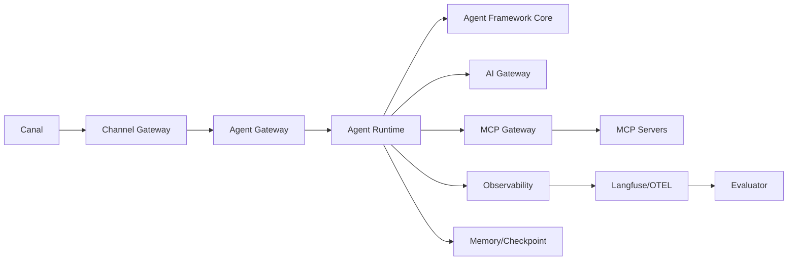
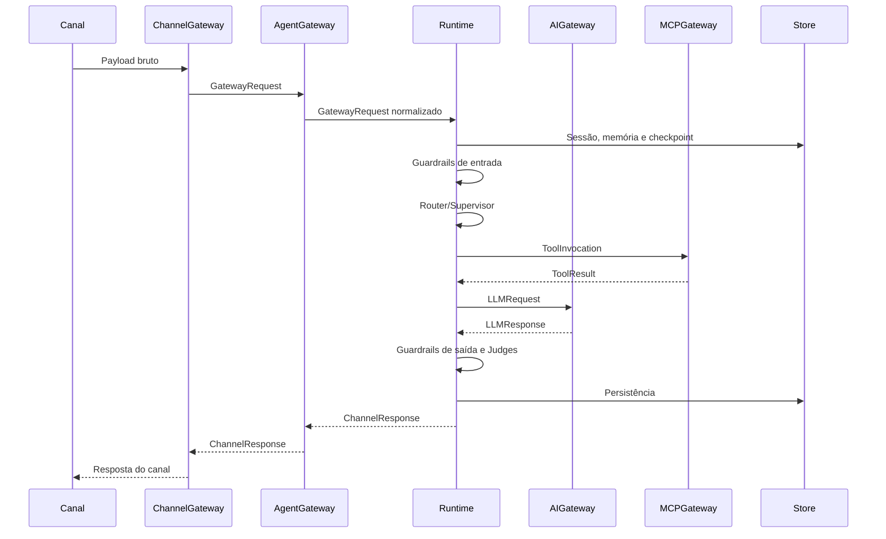

# SPEC-001 — Architecture

## Escopo

A Agent Platform OCI é composta por componentes reutilizáveis, aplicações deployáveis, contratos de integração, templates de agentes, camada de avaliação e artefatos de operação.

## Componentes

| Componente | Tipo | Responsabilidade |
|---|---|---|
| `libs/agent_framework` | Lib | Core reutilizável do framework. |
| `runtimes/langgraph_runtime` | Runtime | Execução de agentes baseada em LangGraph. |
| `apps/agent_gateway` | App | Entrada padronizada e roteamento de agentes/backends. |
| `apps/channel_gateway` | App | Normalização de canais externos. |
| `apps/ai_gateway` | App | Abstração, governança e roteamento de modelos. |
| `apps/mcp_gateway` | App | Governança, catálogo e execução de tools MCP. |
| `mcp/servers` | Apps | MCP servers de domínio. |
| `evals/offline` | App/Lib | Avaliação offline/batch. |
| `evals/certification` | Suite | Certificação técnica e funcional. |
| `templates/backend` | Template | Scaffold para novos agentes. |
| `specs` | Documentação | Contratos SDD versionados. |
| `deploy` | Operação | Docker, Kubernetes e Helm. |

## Estrutura de Repositório

```text
agent_platform_oci/
├── libs/
│   └── agent_framework/
├── runtimes/
│   └── langgraph_runtime/
├── apps/
│   ├── agent_gateway/
│   ├── channel_gateway/
│   ├── ai_gateway/
│   └── mcp_gateway/
├── mcp/
│   └── servers/
├── evals/
│   ├── offline/
│   └── certification/
├── templates/
│   ├── backend/
│   └── backend_day_zero/
├── specs/
├── deploy/
│   ├── docker/
│   ├── k8s/
│   └── helm/
├── tests/
└── docs/
```

## Arquitetura Lógica



## Arquitetura Física

| Serviço | Porta Padrão | Deploy | Escala |
|---|---:|---|---|
| Agent Gateway | 9000 | Kubernetes Deployment | Horizontal |
| Agent Backend / Runtime | 8000 | Kubernetes Deployment | Horizontal com storage externo |
| Channel Gateway | 7000 | Kubernetes Deployment | Horizontal |
| AI Gateway | 9100 | Kubernetes Deployment | Horizontal |
| MCP Gateway | 9200 | Kubernetes Deployment | Horizontal |
| MCP Servers | 8001+ | Kubernetes Deployment | Por domínio |
| Evaluator API | 9300 | Deployment/CronJob | Por carga batch |
| Frontend Demo | 5173 | Opcional | Não crítico |

## Contratos Principais

| Contrato | Produtor | Consumidor |
|---|---|---|
| GatewayRequest | Channel Gateway / Agent Gateway | Agent Runtime |
| ChannelResponse | Agent Runtime | Channel Gateway / Cliente |
| BusinessContext | Channel Gateway / Identity Resolver | Runtime / Agents / MCP |
| LLMRequest | Agent Runtime | AI Gateway |
| LLMResponse | AI Gateway | Agent Runtime |
| ToolInvocation | Agent Runtime / MCP Gateway | MCP Server |
| ToolResult | MCP Server / MCP Gateway | Agent Runtime |
| GuardrailResult | Guardrail Engine | Runtime / Observability |
| JudgeResult | Judge Engine / Evaluator | Runtime / Evaluator |
| EvaluationRun | Evaluator | Persistence / Dashboards |

## GatewayRequest

```json
{
  "channel": "web",
  "tenant_id": "default",
  "agent_id": "telecom_contas",
  "payload": {
    "message": "Quero consultar minha fatura",
    "session_id": "session-001",
    "user_id": "user-001",
    "message_id": "msg-001",
    "business_context": {
      "customer_key": "11999999999",
      "contract_key": "3000131180",
      "interaction_key": "301953872",
      "session_key": "session-001"
    },
    "metadata": {
      "request_id": "req-001"
    }
  }
}
```

## ChannelResponse

```json
{
  "channel": "web",
  "session_id": "default:telecom_contas:session-001",
  "text": "Resposta final do agente.",
  "metadata": {
    "tenant_id": "default",
    "agent_id": "telecom_contas",
    "route": "billing_agent",
    "intent": "billing_invoice_explanation"
  }
}
```

## Fluxo Principal



## Configuração

| Arquivo | Uso |
|---|---|
| `.env` | Provider, autenticação, flags e endpoints por ambiente. |
| `agents.yaml` | Registro de agentes. |
| `routing.yaml` | Intents, rotas, políticas e fallback. |
| `guardrails.yaml` | Guardrails globais. |
| `judges.yaml` | Judges globais. |
| `llm_profiles.yaml` | Profiles de modelos por componente. |
| `mcp_servers.yaml` | MCP servers disponíveis. |
| `tools.yaml` | Catálogo de tools. |
| `mcp_parameter_mapping.yaml` | Mapeamento BusinessContext → argumentos MCP. |
| `identity.yaml` | Resolução de identidade de negócio. |
| `observability.yaml` | Logs, métricas, traces e exporters. |
| `evals.yaml` | Datasets, métricas e configuração do evaluator. |

## Eventos

| Evento | Origem | Descrição |
|---|---|---|
| `gateway.request.received` | Agent Gateway | Requisição recebida. |
| `channel.normalized` | Channel Gateway | Payload convertido em GatewayRequest. |
| `runtime.started` | Runtime | Execução iniciada. |
| `guardrail.input.completed` | Guardrails | Guardrails de entrada concluídos. |
| `route.selected` | Router/Supervisor | Rota definida. |
| `mcp.tool.completed` | MCP Gateway | Tool executada. |
| `llm.completed` | AI Gateway | Chamada LLM concluída. |
| `judge.completed` | Judge Engine | Avaliação concluída. |
| `runtime.completed` | Runtime | Execução finalizada. |


## Requisitos Não Funcionais

| Categoria | Requisito |
|---|---|
| Disponibilidade | Componentes deployáveis expõem `/health` e `/ready`. |
| Escalabilidade | Apps stateless escalam horizontalmente. Estado conversacional fica em repositórios externos. |
| Segurança | Segredos são fornecidos por secret store ou Kubernetes Secrets. |
| Observabilidade | Logs, métricas e traces usam correlação por request_id, trace_id, session_id, tenant_id e agent_id. |
| Auditabilidade | Decisões de rota, guardrail, judge, MCP e LLM são rastreáveis. |
| Portabilidade | Execução suportada em local, Docker Compose e Kubernetes/OKE. |
| Configuração | Comportamento variável é controlado por `.env` e YAML versionado. |


## Critérios de Aceite

- [ ] Estrutura de repositório separa libs, runtimes, apps, mcp, evals, templates, specs e deploy.
- [ ] Cada app deployável possui contrato de entrada/saída documentado.
- [ ] GatewayRequest e ChannelResponse estão versionados.
- [ ] BusinessContext é usado como contrato canônico.
- [ ] Runtime não recebe payload bruto de canal.
- [ ] AI Gateway e MCP Gateway possuem fronteiras explícitas.
- [ ] Evaluator é componente padronizado de avaliação.
- [ ] Todos os serviços possuem health check.
- [ ] Telemetria fim-a-fim correlaciona request_id, trace_id e session_id.
- [ ] Configurações críticas possuem YAML dedicado.


## Glossário

| Termo | Definição |
|---|---|
| Agent Platform | Plataforma composta por runtime, gateways, evaluator, templates, contratos e componentes operacionais. |
| Agent Framework | Biblioteca/core reutilizável com contratos, guardrails, judges, memória, telemetria, providers e utilitários. |
| Agent Runtime | Motor de execução de agentes baseado em LangGraph, estado, sessão, memória, checkpoints, roteamento e ciclo de vida. |
| Agent Gateway | Aplicação deployável de entrada, roteamento e orquestração entre backends/agentes. |
| Channel Gateway | Aplicação ou módulo de normalização de payloads de canais para GatewayRequest. |
| AI Gateway | Aplicação de governança, roteamento e abstração de chamadas LLM/embedding. |
| MCP Gateway | Aplicação de governança e roteamento de tools MCP. |
| Evaluator | Camada de avaliação online/offline, regressão e certificação. |
| Business Context | Conjunto de chaves canônicas de negócio: customer_key, contract_key, interaction_key, account_key, resource_key e session_key. |
