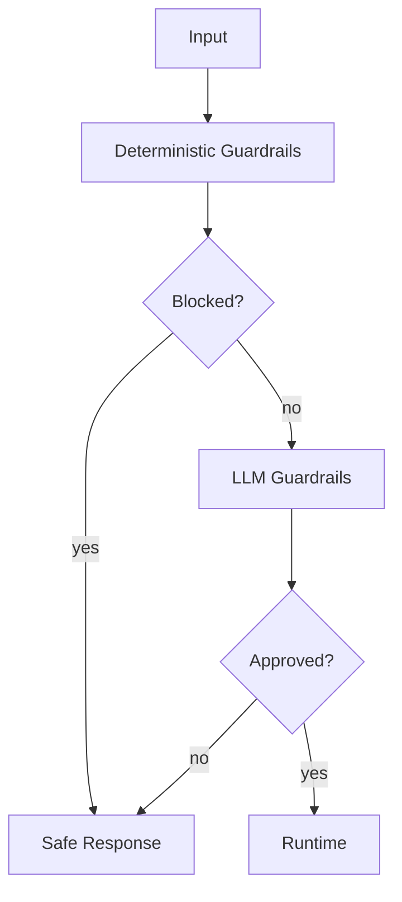

# SPEC-005 — Guardrails

## Escopo

Guardrails são políticas executadas sobre entrada, saída, tool calls, RAG e respostas finais. A plataforma suporta guardrails globais, por agente, por canal e por fase.

## Fases

| Fase | Entrada | Saída |
|---|---|---|
| Input | `user_text`, `context` | `sanitized_input`, `GuardrailResult` |
| Tool | `ToolInvocation` | tool permitida/bloqueada |
| RAG | query/contexto recuperado | contexto aprovado/filtrado |
| Output | `response_text` | resposta aprovada/sanitizada/bloqueada |
| Review | resposta + evidências | decisão final |

## GuardrailResult

```json
{
  "code": "PINJ",
  "phase": "input",
  "status": "blocked",
  "severity": "high",
  "score": 0.98,
  "message": "Entrada bloqueada por política.",
  "details": {
    "matched_policy": "prompt_injection"
  }
}
```

## Configuração Global

```yaml
input:
  - code: MSK
    enabled: true
    mode: enforce
  - code: VLOOP
    enabled: true
    mode: enforce
  - code: PINJ
    enabled: true
    mode: enforce

output:
  - code: REVPREC
    enabled: true
    mode: enforce
  - code: DLEX_OUT
    enabled: true
    mode: enforce
  - code: PINJ
    enabled: true
    mode: observe
```

## Configuração por Agente

```yaml
agents:
  telecom_contas:
    input:
      - code: BILLING_INPUT_POLICY
        enabled: true
        mode: observe
    output:
      - code: BILLING_COMPLIANCE
        enabled: true
        mode: enforce
```

## Modos

| Modo | Comportamento |
|---|---|
| `enforce` | Aplica bloqueio, máscara ou alteração. |
| `observe` | Registra sem bloquear. |
| `fail_open` | Em erro técnico, prossegue e emite NOC. |
| `fail_closed` | Em erro técnico, bloqueia. |

## Tipos

| Tipo | Implementação |
|---|---|
| Determinístico | Regex, listas, tamanho, estrutura, regras. |
| LLM | Classificação semântica por profile. |
| Híbrido | Determinístico + LLM em casos ambíguos. |

## Profiles LLM

```yaml
profiles:
  guardrail:
    provider: oci_openai
    model: openai.gpt-4.1
    temperature: 0
    max_tokens: 600

  grl:
    provider: oci_openai
    model: openai.gpt-4.1
    temperature: 0
    max_tokens: 700
```

## Fluxo



## Eventos

| Evento | Descrição |
|---|---|
| `guardrail.started` | Execução iniciada. |
| `guardrail.completed` | Execução concluída. |
| `guardrail.blocked` | Conteúdo bloqueado. |
| `guardrail.masked` | Conteúdo mascarado. |
| `guardrail.failed` | Falha técnica. |
| `guardrail.observe` | Política observacional registrada. |

## Códigos Base

| Código | Fase | Uso |
|---|---|---|
| `MSK` | input/output | Mascaramento. |
| `VLOOP` | input | Detecção de loop. |
| `PINJ` | input/output | Prompt injection. |
| `REVPREC` | output | Revisão de precisão. |
| `DLEX_OUT` | output | Controle de dados e linguagem na saída. |
| `RAGSEC` | rag/output | Segurança de contexto recuperado. |

## Testes

| Teste | Objetivo |
|---|---|
| Unitário | Validar guardrail isolado. |
| Config | Validar YAML e schema. |
| Integração | Validar execução no workflow. |
| Observabilidade | Validar eventos e traces. |
| Negativo | Validar bloqueio. |
| Observe-only | Validar não bloqueio. |


## Requisitos Não Funcionais

| Categoria | Requisito |
|---|---|
| Disponibilidade | Componentes deployáveis expõem `/health` e `/ready`. |
| Escalabilidade | Apps stateless escalam horizontalmente. Estado conversacional fica em repositórios externos. |
| Segurança | Segredos são fornecidos por secret store ou Kubernetes Secrets. |
| Observabilidade | Logs, métricas e traces usam correlação por request_id, trace_id, session_id, tenant_id e agent_id. |
| Auditabilidade | Decisões de rota, guardrail, judge, MCP e LLM são rastreáveis. |
| Portabilidade | Execução suportada em local, Docker Compose e Kubernetes/OKE. |
| Configuração | Comportamento variável é controlado por `.env` e YAML versionado. |


## Critérios de Aceite

- [ ] Guardrails globais são carregados por YAML.
- [ ] Guardrails por agente sobrescrevem ou complementam globais.
- [ ] GuardrailResult é gerado para cada execução.
- [ ] Modo enforce bloqueia quando aplicável.
- [ ] Modo observe não bloqueia.
- [ ] Falhas técnicas seguem política configurada.
- [ ] Guardrails LLM usam profile dedicado.
- [ ] Eventos e métricas são emitidos.
- [ ] Testes cobrem casos positivos e negativos.
- [ ] Output guardrails executam antes da resposta final.


## Glossário

| Termo | Definição |
|---|---|
| Agent Platform | Plataforma composta por runtime, gateways, evaluator, templates, contratos e componentes operacionais. |
| Agent Framework | Biblioteca/core reutilizável com contratos, guardrails, judges, memória, telemetria, providers e utilitários. |
| Agent Runtime | Motor de execução de agentes baseado em LangGraph, estado, sessão, memória, checkpoints, roteamento e ciclo de vida. |
| Agent Gateway | Aplicação deployável de entrada, roteamento e orquestração entre backends/agentes. |
| Channel Gateway | Aplicação ou módulo de normalização de payloads de canais para GatewayRequest. |
| AI Gateway | Aplicação de governança, roteamento e abstração de chamadas LLM/embedding. |
| MCP Gateway | Aplicação de governança e roteamento de tools MCP. |
| Evaluator | Camada de avaliação online/offline, regressão e certificação. |
| Business Context | Conjunto de chaves canônicas de negócio: customer_key, contract_key, interaction_key, account_key, resource_key e session_key. |
