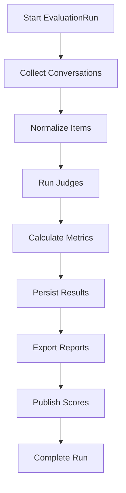

# SPEC-006 — Evals

## Escopo

A camada de Evals executa avaliação online, avaliação offline, regressão, certificação e publicação de métricas. Ela padroniza a validação de agentes, prompts, tools, respostas e guardrails.

## Componentes

| Componente | Responsabilidade |
|---|---|
| Online Judges | Avaliação durante a execução. |
| Offline Evaluator | Avaliação batch de conversas. |
| Dataset Runner | Execução de datasets versionados. |
| Regression Runner | Comparação entre versões. |
| Certification Suite | Validação técnica e funcional. |
| Metrics Engine | Cálculo de métricas. |
| Persistence | Persistência de runs e itens. |
| Exporter | Exportação TXT.GZ/JSON/HTML. |
| Publisher | Publicação de scores no Langfuse. |

## Fluxo Offline



## EvaluationRun

```json
{
  "run_id": "eval-20260619-001",
  "agent_id": "telecom_contas",
  "source": "langfuse",
  "period_start": "2026-06-18T00:00:00Z",
  "period_end": "2026-06-19T00:00:00Z",
  "status": "running",
  "limit": 500,
  "metadata": {
    "profile": "judge",
    "dataset": "production-sample"
  }
}
```

## EvaluationItem

```json
{
  "conversation_id": "default:telecom_contas:session-001",
  "trace_id": "trace-001",
  "agent_id": "telecom_contas",
  "input": "Quero consultar minha fatura",
  "output": "Sua fatura está aberta...",
  "evidence": {
    "mcp_results": [],
    "rag_context": ""
  },
  "scores": {
    "quality": 0.86,
    "groundedness": 0.78,
    "safety": 1.0,
    "resolution": 0.91
  },
  "findings": []
}
```

## Métricas

| Métrica | Descrição | Faixa |
|---|---|---|
| `quality` | Clareza, completude e utilidade. | 0–1 |
| `groundedness` | Aderência a evidências MCP/RAG. | 0–1 |
| `safety` | Conformidade de segurança. | 0–1 |
| `resolution` | Capacidade de resolver a intenção. | 0–1 |
| `tool_correctness` | Uso correto de tools. | 0–1 |
| `policy_compliance` | Aderência a regras de domínio. | 0–1 |

## Dataset

```yaml
dataset:
  name: telecom_contas_billing
  version: 1.0.0
  items:
    - id: billing-001
      input: "Quero consultar minha fatura"
      business_context:
        customer_key: "11999999999"
        contract_key: "3000131180"
      expected:
        route: billing_agent
        tools:
          - consultar_fatura
        min_scores:
          quality: 0.75
          groundedness: 0.70
          safety: 1.0
```

## Judges

```yaml
judges:
  - name: response_quality
    enabled: true
    threshold: 0.7
    profile: judge

  - name: groundedness
    enabled: true
    threshold: 0.6
    profile: judge

  - name: safety
    enabled: true
    threshold: 1.0
    profile: judge
```

## CLI

```bash
af-evaluator run \
  --agent-id telecom_contas \
  --source langfuse \
  --period-start 2026-06-18T00:00:00Z \
  --period-end 2026-06-19T00:00:00Z \
  --limit 500
```

## API

| Método | Endpoint | Descrição |
|---|---|---|
| `POST` | `/evaluation/runs` | Cria run. |
| `GET` | `/evaluation/runs/{run_id}` | Consulta run. |
| `GET` | `/evaluation/runs/{run_id}/items` | Lista itens. |
| `POST` | `/evaluation/datasets/{name}/run` | Executa dataset. |
| `GET` | `/health` | Health check. |

## Persistência

| Tabela | Conteúdo |
|---|---|
| `EVAL_RUNS` | Runs executadas. |
| `EVAL_ITEMS` | Conversas avaliadas. |
| `EVAL_SCORES` | Scores por métrica. |
| `EVAL_FINDINGS` | Achados. |
| `EVAL_EXPORTS` | Arquivos exportados. |

## Certificação

A Certification Suite valida:

- endpoints de health;
- GatewayRequest;
- roteamento;
- MCP tools;
- guardrails;
- judges;
- memória;
- checkpoint;
- Langfuse/OTEL;
- datasets mínimos;
- evidências JSON/HTML.

## Eventos

| Evento | Descrição |
|---|---|
| `eval.run.started` | Run iniciada. |
| `eval.item.completed` | Item avaliado. |
| `eval.run.completed` | Run concluída. |
| `eval.run.failed` | Run falhou. |
| `eval.score.published` | Score publicado. |


## Requisitos Não Funcionais

| Categoria | Requisito |
|---|---|
| Disponibilidade | Componentes deployáveis expõem `/health` e `/ready`. |
| Escalabilidade | Apps stateless escalam horizontalmente. Estado conversacional fica em repositórios externos. |
| Segurança | Segredos são fornecidos por secret store ou Kubernetes Secrets. |
| Observabilidade | Logs, métricas e traces usam correlação por request_id, trace_id, session_id, tenant_id e agent_id. |
| Auditabilidade | Decisões de rota, guardrail, judge, MCP e LLM são rastreáveis. |
| Portabilidade | Execução suportada em local, Docker Compose e Kubernetes/OKE. |
| Configuração | Comportamento variável é controlado por `.env` e YAML versionado. |


## Critérios de Aceite

- [ ] Evaluator executa runs por período/agente.
- [ ] Langfuse é fonte suportada.
- [ ] Datasets são versionados.
- [ ] LLM Judges usam profile `judge`.
- [ ] Scores são persistidos.
- [ ] TXT.GZ/JSON/HTML são exportáveis.
- [ ] Scores podem ser publicados no Langfuse.
- [ ] Certification Suite gera evidências.
- [ ] Métricas mínimas são padronizadas.
- [ ] Falhas permitem retomada por checkpoint de run.


## Glossário

| Termo | Definição |
|---|---|
| Agent Platform | Plataforma composta por runtime, gateways, evaluator, templates, contratos e componentes operacionais. |
| Agent Framework | Biblioteca/core reutilizável com contratos, guardrails, judges, memória, telemetria, providers e utilitários. |
| Agent Runtime | Motor de execução de agentes baseado em LangGraph, estado, sessão, memória, checkpoints, roteamento e ciclo de vida. |
| Agent Gateway | Aplicação deployável de entrada, roteamento e orquestração entre backends/agentes. |
| Channel Gateway | Aplicação ou módulo de normalização de payloads de canais para GatewayRequest. |
| AI Gateway | Aplicação de governança, roteamento e abstração de chamadas LLM/embedding. |
| MCP Gateway | Aplicação de governança e roteamento de tools MCP. |
| Evaluator | Camada de avaliação online/offline, regressão e certificação. |
| Business Context | Conjunto de chaves canônicas de negócio: customer_key, contract_key, interaction_key, account_key, resource_key e session_key. |
