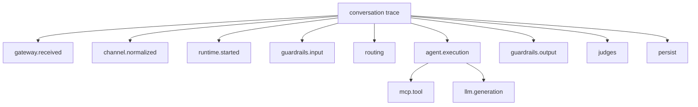

# SPEC-007 — Observability

## Escopo

Observabilidade cobre logs, métricas, traces, eventos IC/NOC/GRL, Langfuse, OpenTelemetry, dashboards, alertas e evidências operacionais.

## Correlação

Campos obrigatórios:

```text
request_id
trace_id
session_id
conversation_key
tenant_id
agent_id
channel
message_id
route
intent
```

## Logs

Formato:

```json
{
  "timestamp": "2026-06-19T12:00:00Z",
  "level": "INFO",
  "service": "agent-runtime",
  "event": "runtime.route.selected",
  "tenant_id": "default",
  "agent_id": "telecom_contas",
  "session_id": "default:telecom_contas:session-001",
  "trace_id": "trace-001",
  "route": "billing_agent",
  "intent": "billing_invoice_explanation"
}
```

## Traces



## Métricas

| Métrica | Dimensões |
|---|---|
| `requests_total` | service, tenant, agent, channel, status |
| `request_latency_ms` | service, route, intent |
| `active_sessions` | tenant, agent |
| `llm_tokens_total` | provider, model, profile |
| `llm_cost_estimated` | provider, model, tenant, agent |
| `mcp_tool_calls_total` | tool, server, status |
| `mcp_tool_latency_ms` | tool, server |
| `guardrail_blocks_total` | code, phase, agent |
| `judge_scores` | metric, agent, route |
| `errors_total` | service, component, error_type |

## Langfuse

Dados registrados:

- trace de conversa;
- spans técnicos;
- generations LLM;
- prompts e respostas quando permitido;
- tokens;
- custos;
- latência;
- scores;
- metadados;
- erros.

## OpenTelemetry

Configuração:

```yaml
otel:
  enabled: true
  service_name: agent-runtime
  exporter: otlp
  endpoint: http://otel-collector:4317
```

## IC/NOC/GRL

| Família | Eventos |
|---|---|
| IC | `IC.GATEWAY_RECEIVED`, `IC.AGENT_STARTED`, `IC.AGENT_COMPLETED` |
| NOC | `NOC.RUNTIME_FAILED`, `NOC.MCP_TIMEOUT`, `NOC.LLM_FAILED` |
| GRL | `GRL.INPUT_BLOCKED`, `GRL.OUTPUT_BLOCKED`, `GRL.MASK_APPLIED` |

## Dashboards

| Dashboard | Conteúdo |
|---|---|
| Platform Overview | tráfego, erros, latência, sessões. |
| Agent Runtime | rotas, intents, memória, checkpoints. |
| LLM Usage | tokens, custo, latência, provider/model. |
| MCP Operations | chamadas, erros, cache, latência. |
| Guardrails | bloqueios, observe-only, códigos. |
| Evals | scores, trends, regressões. |
| Channels | tráfego por canal, erros, retries. |

## Alertas

| Alerta | Condição |
|---|---|
| `GatewayHighErrorRate` | Erros 5xx acima do limite. |
| `RuntimeLatencyHigh` | p95 acima do SLO. |
| `LLMProviderUnavailable` | falhas consecutivas de provider. |
| `MCPToolTimeoutSpike` | aumento de timeouts. |
| `GuardrailBlockSpike` | aumento anômalo de bloqueios. |
| `EvaluatorRunFailed` | run batch falhou. |
| `CheckpointFailure` | falha persistente em checkpoint. |

## Mascaramento

Campos mascarados:

- tokens;
- API keys;
- senhas;
- secrets;
- CPF/CNPJ, quando aplicável;
- telefone, quando configurado;
- payload bruto de canal;
- documentos sensíveis.

## Evidências

Relatórios de homologação incluem:

- health checks;
- logs de execução;
- traces Langfuse;
- métricas;
- resultados de guardrails;
- resultados de judges;
- chamadas MCP;
- chamadas LLM;
- relatório do evaluator;
- relatório da certification suite.


## Requisitos Não Funcionais

| Categoria | Requisito |
|---|---|
| Disponibilidade | Componentes deployáveis expõem `/health` e `/ready`. |
| Escalabilidade | Apps stateless escalam horizontalmente. Estado conversacional fica em repositórios externos. |
| Segurança | Segredos são fornecidos por secret store ou Kubernetes Secrets. |
| Observabilidade | Logs, métricas e traces usam correlação por request_id, trace_id, session_id, tenant_id e agent_id. |
| Auditabilidade | Decisões de rota, guardrail, judge, MCP e LLM são rastreáveis. |
| Portabilidade | Execução suportada em local, Docker Compose e Kubernetes/OKE. |
| Configuração | Comportamento variável é controlado por `.env` e YAML versionado. |


## Critérios de Aceite

- [ ] Todos os serviços emitem logs estruturados.
- [ ] Trace correlaciona gateway, runtime, MCP, LLM, guardrails e judges.
- [ ] Langfuse recebe traces quando habilitado.
- [ ] OTEL exporta spans quando habilitado.
- [ ] Métricas mínimas estão disponíveis.
- [ ] Dashboards estão definidos.
- [ ] Alertas estão definidos.
- [ ] Segredos e PII são mascarados.
- [ ] Evaluator consome dados observáveis.
- [ ] Certification Suite gera evidências.


## Glossário

| Termo | Definição |
|---|---|
| Agent Platform | Plataforma composta por runtime, gateways, evaluator, templates, contratos e componentes operacionais. |
| Agent Framework | Biblioteca/core reutilizável com contratos, guardrails, judges, memória, telemetria, providers e utilitários. |
| Agent Runtime | Motor de execução de agentes baseado em LangGraph, estado, sessão, memória, checkpoints, roteamento e ciclo de vida. |
| Agent Gateway | Aplicação deployável de entrada, roteamento e orquestração entre backends/agentes. |
| Channel Gateway | Aplicação ou módulo de normalização de payloads de canais para GatewayRequest. |
| AI Gateway | Aplicação de governança, roteamento e abstração de chamadas LLM/embedding. |
| MCP Gateway | Aplicação de governança e roteamento de tools MCP. |
| Evaluator | Camada de avaliação online/offline, regressão e certificação. |
| Business Context | Conjunto de chaves canônicas de negócio: customer_key, contract_key, interaction_key, account_key, resource_key e session_key. |
