# SPEC-008 — Deployment

## Escopo

Deployment cobre empacotamento, CI/CD, Kubernetes/OKE, Docker, secrets, autenticação OCI, health checks, rollback e operação dos componentes.

## Componentes Deployáveis

| Componente | Artefato |
|---|---|
| Agent Gateway | Docker image + Kubernetes Deployment |
| Channel Gateway | Docker image + Kubernetes Deployment |
| AI Gateway | Docker image + Kubernetes Deployment |
| MCP Gateway | Docker image + Kubernetes Deployment |
| Agent Backend | Docker image + Kubernetes Deployment |
| MCP Server | Docker image + Kubernetes Deployment |
| Evaluator API | Docker image + Kubernetes Deployment |
| Evaluator Batch | Kubernetes CronJob |
| Frontend Demo | Docker image opcional |

## Pipeline

```mermaid
flowchart LR
    A[Commit] --> B[Lint]
    B --> C[Type Check]
    C --> D[Unit Tests]
    D --> E[Contract Tests]
    E --> F[Security Scan]
    F --> G[Build Wheel]
    G --> H[Build Images]
    H --> I[Publish]
    I --> J[Deploy Dev]
    J --> K[Smoke Tests]
    K --> L[Certification]
    L --> M[Deploy HML/Prod]
```



## Stages

```yaml
stages:
  - validate
  - lint
  - type_check
  - unit_test
  - contract_test
  - security_scan
  - build_package
  - build_image
  - publish
  - deploy_dev
  - smoke_test
  - certification
  - deploy_hml
  - deploy_prod
```

## Kubernetes Deployment

```yaml
apiVersion: apps/v1
kind: Deployment
metadata:
  name: agent-runtime
  labels:
    app: agent-runtime
    component: runtime
spec:
  replicas: 2
  selector:
    matchLabels:
      app: agent-runtime
  template:
    metadata:
      labels:
        app: agent-runtime
    spec:
      serviceAccountName: agent-runtime-sa
      containers:
        - name: agent-runtime
          image: registry/agent-runtime:1.0.0
          ports:
            - containerPort: 8000
          envFrom:
            - configMapRef:
                name: agent-runtime-config
            - secretRef:
                name: agent-runtime-secrets
          readinessProbe:
            httpGet:
              path: /ready
              port: 8000
          livenessProbe:
            httpGet:
              path: /health
              port: 8000
```

## Service

```yaml
apiVersion: v1
kind: Service
metadata:
  name: agent-runtime
spec:
  selector:
    app: agent-runtime
  ports:
    - port: 8000
      targetPort: 8000
```

## OCI Authentication

| Ambiente | Modo |
|---|---|
| Local | `config_file` |
| Local com endpoint OpenAI-Compatible | API key |
| OCI Compute | `instance_principal` |
| OKE | `workload_identity` ou `resource_principal` |
| Testes | `mock` |

## Variáveis

```env
LLM_PROVIDER=oci_sdk
OCI_AUTH_MODE=workload_identity
ENABLE_LANGFUSE=true
ENABLE_OTEL=true
SESSION_REPOSITORY_PROVIDER=autonomous
MEMORY_REPOSITORY_PROVIDER=autonomous
CHECKPOINT_REPOSITORY_PROVIDER=autonomous
```

## Secrets

| Secret | Uso |
|---|---|
| `LANGFUSE_PUBLIC_KEY` | Langfuse |
| `LANGFUSE_SECRET_KEY` | Langfuse |
| `OCI_GENAI_API_KEY` | OCI OpenAI-Compatible |
| `ADB_PASSWORD` | Autonomous Database |
| `MCP_BACKEND_TOKEN` | Integrações MCP |
| `OTEL_AUTH_TOKEN` | Exportador OTEL, se aplicável |

## Health Checks

| Endpoint | Uso |
|---|---|
| `/health` | Processo vivo. |
| `/ready` | Pronto para tráfego. |
| `/version` | Versão de build. |
| `/debug/env` | Ambiente sem segredos, quando habilitado. |

## Rollback

Itens considerados:

- tag da imagem;
- versão do pacote Python;
- versão dos schemas;
- versão dos YAMLs;
- migrations;
- datasets de eval;
- contracts;
- dashboards.

## Smoke Tests

```bash
curl -f http://agent-runtime:8000/health
curl -f http://agent-gateway:9000/health
curl -f http://mcp-gateway:8300/health
curl -f http://ai-gateway:9100/health
```

## Certification Stage

A pipeline executa:

- health checks;
- contrato GatewayRequest;
- roteamento;
- MCP invoke;
- LLM mock/real conforme ambiente;
- guardrails;
- judges;
- memória/checkpoint;
- relatório JSON/HTML.


## Requisitos Não Funcionais

| Categoria | Requisito |
|---|---|
| Disponibilidade | Componentes deployáveis expõem `/health` e `/ready`. |
| Escalabilidade | Apps stateless escalam horizontalmente. Estado conversacional fica em repositórios externos. |
| Segurança | Segredos são fornecidos por secret store ou Kubernetes Secrets. |
| Observabilidade | Logs, métricas e traces usam correlação por request_id, trace_id, session_id, tenant_id e agent_id. |
| Auditabilidade | Decisões de rota, guardrail, judge, MCP e LLM são rastreáveis. |
| Portabilidade | Execução suportada em local, Docker Compose e Kubernetes/OKE. |
| Configuração | Comportamento variável é controlado por `.env` e YAML versionado. |


## Critérios de Aceite

- [ ] Cada app possui Dockerfile.
- [ ] Cada app possui manifest Kubernetes.
- [ ] CI executa lint, type check e testes.
- [ ] Contract tests validam contratos principais.
- [ ] Security scan executa antes do publish.
- [ ] Secrets não são versionados.
- [ ] Workload Identity está configurado em OKE.
- [ ] Health/readiness/liveness estão ativos.
- [ ] Smoke tests rodam após deploy.
- [ ] Rollback está documentado.


## Glossário

| Termo | Definição |
|---|---|
| Agent Platform | Plataforma composta por runtime, gateways, evaluator, templates, contratos e componentes operacionais. |
| Agent Framework | Biblioteca/core reutilizável com contratos, guardrails, judges, memória, telemetria, providers e utilitários. |
| Agent Runtime | Motor de execução de agentes baseado em LangGraph, estado, sessão, memória, checkpoints, roteamento e ciclo de vida. |
| Agent Gateway | Aplicação deployável de entrada, roteamento e orquestração entre backends/agentes. |
| Channel Gateway | Aplicação ou módulo de normalização de payloads de canais para GatewayRequest. |
| AI Gateway | Aplicação de governança, roteamento e abstração de chamadas LLM/embedding. |
| MCP Gateway | Aplicação de governança e roteamento de tools MCP. |
| Evaluator | Camada de avaliação online/offline, regressão e certificação. |
| Business Context | Conjunto de chaves canônicas de negócio: customer_key, contract_key, interaction_key, account_key, resource_key e session_key. |
