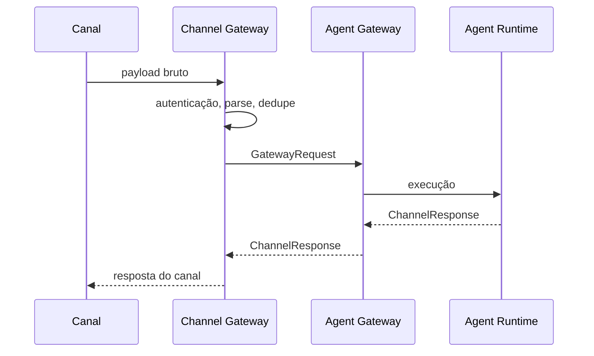

# SPEC-009 — Channel Gateway

## Escopo

O Channel Gateway normaliza payloads de canais externos para GatewayRequest e traduz ChannelResponse para o formato de resposta do canal.

## Modos de Operação

| Modo | Descrição |
|---|---|
| Embedded | Normalização no próprio backend para demos e cenários simples. |
| External | Serviço dedicado para canais corporativos. |

## GatewayRequest

```json
{
  "channel": "whatsapp",
  "tenant_id": "default",
  "agent_id": "telecom_contas",
  "payload": {
    "message": "Segunda via de fatura",
    "session_id": "5511999999999",
    "user_id": "5511999999999",
    "message_id": "wamid.123",
    "business_context": {
      "customer_key": "5511999999999",
      "interaction_key": "wamid.123",
      "session_key": "5511999999999"
    },
    "metadata": {
      "source_channel": "whatsapp",
      "source_message_type": "interactive"
    }
  }
}
```

## ChannelResponse

```json
{
  "channel": "whatsapp",
  "session_id": "default:telecom_contas:5511999999999",
  "text": "Encontrei sua fatura...",
  "metadata": {
    "tenant_id": "default",
    "agent_id": "telecom_contas",
    "route": "billing_agent",
    "intent": "billing_invoice_explanation"
  }
}
```

## Fluxo Externo



## Responsabilidades

| Responsabilidade | Detalhe |
|---|---|
| Auth | Validar assinatura, token ou origem. |
| Parse | Interpretar payload bruto. |
| Dedup | Evitar reprocessamento por message_id. |
| Normalize | Criar GatewayRequest. |
| Business Context | Mapear chaves canônicas. |
| Forward | Chamar Agent Gateway. |
| Translate | Converter ChannelResponse para canal. |
| Observe | Emitir logs, métricas e traces. |

## Idempotência

Chave:

```text
tenant_id:channel:user_id:message_id
```

Comportamentos:

| Situação | Ação |
|---|---|
| Primeira mensagem | Processar. |
| Duplicada em andamento | Retornar 202 ou resposta controlada. |
| Duplicada concluída | Retornar resposta anterior. |

## Versionamento

Header:

```http
X-Agent-Framework-Contract: gateway-request-v1
```

Campo alternativo:

```json
{
  "payload": {
    "metadata": {
      "contract_version": "gateway-request-v1"
    }
  }
}
```

## Segurança

Validações:

- assinatura do webhook;
- origem permitida;
- tamanho máximo;
- tipo de evento permitido;
- anexos permitidos;
- sanitização de texto;
- remoção de tokens;
- máscara de dados sensíveis;
- rate limit;
- deduplicação.

## Erros

| Código HTTP | Uso |
|---|---|
| 400 | Payload inválido do canal. |
| 401 | Autenticação ausente. |
| 403 | Origem não autorizada. |
| 422 | GatewayRequest inválido. |
| 429 | Rate limit. |
| 500 | Erro interno. |
| 503 | Runtime indisponível. |

## Anti-patterns

- Agente lendo payload bruto.
- Workflow tratando `channel == whatsapp`.
- MCP recebendo payload bruto.
- Tokens do canal em metadata.
- Gateway externo executando regra de agente.
- Frontend enviando campos fora do contrato.


## Requisitos Não Funcionais

| Categoria | Requisito |
|---|---|
| Disponibilidade | Componentes deployáveis expõem `/health` e `/ready`. |
| Escalabilidade | Apps stateless escalam horizontalmente. Estado conversacional fica em repositórios externos. |
| Segurança | Segredos são fornecidos por secret store ou Kubernetes Secrets. |
| Observabilidade | Logs, métricas e traces usam correlação por request_id, trace_id, session_id, tenant_id e agent_id. |
| Auditabilidade | Decisões de rota, guardrail, judge, MCP e LLM são rastreáveis. |
| Portabilidade | Execução suportada em local, Docker Compose e Kubernetes/OKE. |
| Configuração | Comportamento variável é controlado por `.env` e YAML versionado. |


## Critérios de Aceite

- [ ] Payload bruto é convertido para GatewayRequest.
- [ ] GatewayRequest é validado.
- [ ] message_id é usado para idempotência.
- [ ] business_context contém chaves canônicas.
- [ ] Resposta do runtime é traduzida para o canal.
- [ ] Payload bruto não chega ao Agent Runtime.
- [ ] Auth/rate limit/dedup estão implementados.
- [ ] Erros são padronizados.
- [ ] Contrato possui versão.
- [ ] Logs/traces usam request_id e trace_id.


## Glossário

| Termo | Definição |
|---|---|
| Agent Platform | Plataforma composta por runtime, gateways, evaluator, templates, contratos e componentes operacionais. |
| Agent Framework | Biblioteca/core reutilizável com contratos, guardrails, judges, memória, telemetria, providers e utilitários. |
| Agent Runtime | Motor de execução de agentes baseado em LangGraph, estado, sessão, memória, checkpoints, roteamento e ciclo de vida. |
| Agent Gateway | Aplicação deployável de entrada, roteamento e orquestração entre backends/agentes. |
| Channel Gateway | Aplicação ou módulo de normalização de payloads de canais para GatewayRequest. |
| AI Gateway | Aplicação de governança, roteamento e abstração de chamadas LLM/embedding. |
| MCP Gateway | Aplicação de governança e roteamento de tools MCP. |
| Evaluator | Camada de avaliação online/offline, regressão e certificação. |
| Business Context | Conjunto de chaves canônicas de negócio: customer_key, contract_key, interaction_key, account_key, resource_key e session_key. |
