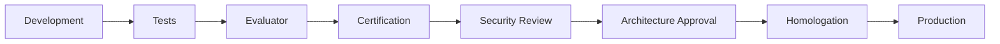

# SPEC-011 — Governance Model

## Agent Platform OCI

Version: 1.0.0


---

## Padrão de leitura

Cada SPEC está organizada para servir tanto como contrato arquitetural quanto como guia prático de adoção.

A estrutura usada é:

1. Conceito.
2. Problema que resolve.
3. Quando usar.
4. Quando não usar.
5. Arquitetura.
6. Implementação.
7. Exemplos.
8. Erros comuns.
9. Critérios de aceite.

---


# 1. Conceito

Governança é o conjunto de papéis, responsabilidades, controles, aprovações, evidências e processos que permite que a Agent Platform OCI seja usada por múltiplos times sem perder padronização, segurança, rastreabilidade e capacidade de evolução.

A governança não substitui a engenharia. Ela define como a engenharia evolui de forma controlada.

Em uma plataforma de agentes, governança cobre:

- quem pode criar agentes;
- quem pode alterar prompts;
- quem pode liberar MCP tools;
- quem aprova mudanças de guardrails;
- quem aprova modelos;
- quem aprova datasets;
- quem promove para produção;
- quais evidências são obrigatórias;
- como auditar decisões da plataforma.

# 2. Problema que resolve

Sem governança, cada time tende a criar agentes de forma diferente.

Problemas comuns:

- prompts sem versionamento;
- MCP tools sem owner;
- datasets ausentes;
- agentes sem avaliação;
- produção sem certification;
- mudanças de modelo sem rastreabilidade;
- guardrails duplicados;
- regras de negócio dentro do runtime;
- uso diferente da plataforma por cada fornecedor;
- dificuldade de manutenção.

A governança cria um modelo único de adoção.

# 3. Domínios de governança

| Domínio | Escopo |
| --- | --- |
| Platform Governance | Framework, Runtime, Gateways, Evaluator, Certification Suite. |
| Agent Governance | Agentes, prompts, regras de negócio, datasets e configs. |
| Model Governance | LLM profiles, providers, fallback, custo e uso. |
| MCP Governance | Tools, MCP servers, owners, SLAs, autorização e contratos. |
| Data Governance | BusinessContext, RAG, datasets, memória e retenção. |
| Security Governance | Identidade, autorização, secrets, auditoria e PII. |
| Operational Governance | Deploy, monitoramento, alertas, SLOs e incidentes. |
| Evaluation Governance | Judges, evaluator, certification e métricas. |


# 4. Modelo de ownership

## 4.1. Platform Team

Responsável por:

- Agent Framework;
- Agent Runtime;
- Agent Gateway;
- Channel Gateway;
- AI Gateway;
- MCP Gateway;
- Evaluator;
- Certification Suite;
- contratos canônicos;
- documentação da plataforma;
- templates oficiais.

## 4.2. Domain Team

Responsável por:

- comportamento do agente;
- prompts;
- regras de negócio;
- datasets;
- configurações específicas;
- validação funcional;
- critérios de sucesso.

## 4.3. Integration Team

Responsável por:

- MCP servers;
- APIs externas;
- SLAs de tools;
- contratos de integração;
- credenciais de backend;
- disponibilidade de sistemas externos.

## 4.4. SRE / DevOps

Responsável por:

- CI/CD;
- deploy;
- observabilidade;
- alertas;
- capacidade;
- SLOs;
- runbooks;
- rollback.

## 4.5. Security / Architecture

Responsável por:

- segurança;
- arquitetura;
- policies;
- Workload Identity;
- secrets;
- revisão de risco;
- aprovação de exceções.

# 5. RACI

| Atividade | Platform | Domain | Integration | SRE | Security |
| --- | --- | --- | --- | --- | --- |
| Framework change | R/A | C | I | C | C |
| Runtime change | R/A | C | I | C | C |
| New agent | C | R/A | C | I | I |
| New MCP tool | C | C | R/A | I | C |
| Prompt change | I | R/A | I | I | C |
| Guardrail change | R | C | I | I | A |
| Model profile change | R | C | I | I | C |
| Production deploy | I | C | C | R/A | C |
| Security review | I | C | C | C | R/A |
| Certification | R/A | C | C | I | I |


# 6. Governança de agentes

Todo agente deve possuir:

```yaml
agent:
  id: telecom_contas
  owner: billing_team
  technical_owner: ai_platform_team
  business_objective: "Atendimento sobre faturas, pagamentos e cobranças"
  status: active
  version: 1.0.0
```

Artefatos obrigatórios:

- `agents.yaml`;
- `routing.yaml`;
- `prompt_policy.yaml`;
- `guardrails.yaml`;
- `judges.yaml`;
- `tools.yaml`;
- `mcp_parameter_mapping.yaml`;
- dataset de regressão;
- testes;
- evidências de evaluator;
- evidências de certification.

# 7. Governança de prompts

Prompts devem ser versionados e rastreáveis.

```yaml
prompt:
  name: billing_system_prompt
  version: 1.3.0
  owner: billing_team
  reviewed_at: 2026-06-19
  status: approved
```

Mudanças de prompt exigem:

1. revisão do domain owner;
2. execução de dataset;
3. evaluator;
4. comparação contra baseline;
5. registro da versão.

# 8. Governança de guardrails

Guardrails globais pertencem à plataforma/segurança.

Guardrails por agente pertencem ao domínio, mas precisam seguir o contrato da plataforma.

```yaml
guardrail:
  code: REVPREC
  version: 2.0.0
  owner: platform_security
  phase: output
  mode: enforce
```

Mudanças em guardrails `enforce` exigem certification.

# 9. Governança de judges

Judges devem ter objetivo, métrica, threshold e owner.

```yaml
judge:
  name: groundedness
  version: 1.1.0
  threshold: 0.70
  owner: platform_quality
```

Mudanças de threshold exigem reexecução do evaluator.

# 10. Governança de modelos

Agentes não referenciam modelo diretamente.

O modelo é resolvido por profile.

```yaml
profiles:
  judge:
    provider: oci_openai
    model: openai.gpt-4.1
    temperature: 0
```

Mudanças de modelo exigem:

- validação de custo;
- evaluator;
- validação de qualidade;
- validação de latência;
- atualização de release notes.

# 11. Governança de MCP

Cada tool deve ter owner, SLA, timeout e contrato.

```yaml
tool:
  name: consultar_fatura
  version: 1.0.0
  owner: billing_platform
  sla: p95_2s
  timeout_seconds: 30
  idempotent: true
```

Tools mutáveis exigem política de confirmação.

# 12. Governança de datasets

Datasets são ativos de qualidade.

```yaml
dataset:
  name: telecom_contas_regression
  version: 1.0.0
  owner: billing_team
```

Datasets devem conter:

- entrada;
- BusinessContext;
- rota esperada;
- tools esperadas;
- critérios mínimos;
- casos negativos;
- casos de segurança.

# 13. Processo de aprovação



# 14. Evidências obrigatórias

- relatório de testes;
- relatório evaluator;
- relatório certification;
- trace Langfuse;
- logs e métricas;
- checklist de segurança;
- release notes;
- versão dos artefatos.

# 15. Erros comuns

| Erro | Impacto | Correção |
| --- | --- | --- |
| Prompt sem owner | Dificulta manutenção e aprovação. | Definir owner no metadata. |
| Tool sem SLA | Operação sem expectativa de resposta. | Registrar SLA em tools.yaml. |
| Dataset ausente | Sem regressão objetiva. | Criar dataset mínimo. |
| Guardrail hardcoded | Governança fora do YAML. | Mover para config. |
| Modelo definido no agente | Quebra governança de modelos. | Usar AI Gateway profiles. |


# 16. Critérios de aceite

- [ ] Cada agente possui owner funcional e técnico.
- [ ] Prompts estão versionados.
- [ ] Tools MCP possuem owner, SLA e versão.
- [ ] Guardrails possuem owner e modo.
- [ ] Judges possuem threshold e versão.
- [ ] Datasets estão versionados.
- [ ] Evaluator roda por agente.
- [ ] Certification aprova antes de produção.
- [ ] Release possui evidências.
- [ ] Exceções são documentadas.
