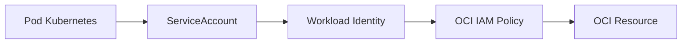

# SPEC-018 — Security and Identity Model

## Agent Platform OCI

Version: 1.0.0


---

## Padrão de leitura

Cada SPEC está organizada para servir tanto como contrato arquitetural quanto como guia prático de adoção.

A estrutura usada é:

1. Conceito.
2. Problema que resolve.
3. Quando usar.
4. Quando não usar.
5. Arquitetura.
6. Implementação.
7. Exemplos.
8. Erros comuns.
9. Critérios de aceite.

---


# 1. Conceito

Security and Identity Model define como workloads autenticam, como componentes autorizam ações, como segredos são protegidos e como dados sensíveis são tratados.

# 2. Modelos de autenticação

| Modo | Uso |
| --- | --- |
| config_file | Desenvolvimento local com ~/.oci/config. |
| instance_principal | Execução em OCI Compute. |
| workload_identity | Execução em OKE/Kubernetes. |
| resource_principal | Recursos OCI gerenciados. |
| api_key | Endpoints compatíveis com OpenAI quando aplicável. |


# 3. Workload Identity

Fluxo:



# 4. Autorização

Escopos:

- agente pode chamar tool?
- tenant pode usar provider?
- canal pode chamar agent_id?
- usuário pode executar ação?
- tool mutável exige confirmação?

# 5. Secrets

Secrets não ficam no código.

Fontes:

- OCI Vault;
- Kubernetes Secrets;
- secret manager corporativo.

Exemplos:

```text
LANGFUSE_SECRET_KEY
OCI_GENAI_API_KEY
ADB_PASSWORD
MCP_BACKEND_TOKEN
```

# 6. Proteção de dados

Aplicar:

- máscara de PII;
- minimização de metadata;
- sanitização de payload;
- não logar secrets;
- retenção controlada;
- classificação de dados.

# 7. Segurança em MCP

MCP tools devem ter:

- autorização por agente;
- allowlist;
- timeout;
- retry;
- idempotência declarada;
- confirmação para operações mutáveis.

# 8. Segurança em canais

Channel Gateway deve:

- validar assinatura;
- validar origem;
- deduplicar;
- rate limit;
- remover tokens;
- normalizar payload;
- rejeitar anexos inválidos.

# 9. Auditoria

Registrar:

- usuário/canal;
- agent_id;
- tenant_id;
- tool chamada;
- modelo usado;
- decisão de guardrail;
- judge score;
- erro;
- trace_id.

# 10. Erros comuns

| Erro | Impacto | Correção |
| --- | --- | --- |
| Secret em .env versionado | Vazamento. | Usar Vault/Secrets. |
| Tool sem autorização | Acesso indevido. | Allowed agents por tool. |
| Payload bruto em logs | Exposição de dados. | Mascarar/minimizar. |
| Instance principal local | Timeout/autenticação inválida. | Usar config_file local. |


# 11. Critérios de aceite

- [ ] Modo de autenticação definido por ambiente.
- [ ] Secrets externos ao código.
- [ ] MCP tools autorizadas por agente.
- [ ] Channel Gateway valida origem.
- [ ] PII mascarada em logs.
- [ ] Eventos auditáveis emitidos.
- [ ] Workload Identity definido para OKE.
- [ ] Security review executado antes de produção.
