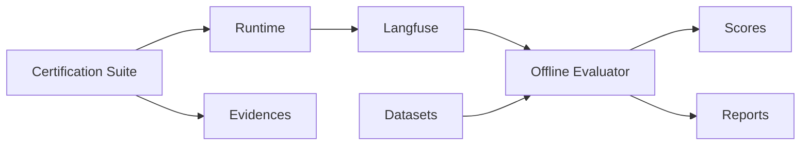

# SPEC-019 — Evaluation and Certification Framework

## Agent Platform OCI

Version: 1.0.0


---

## Padrão de leitura

Cada SPEC está organizada para servir tanto como contrato arquitetural quanto como guia prático de adoção.

A estrutura usada é:

1. Conceito.
2. Problema que resolve.
3. Quando usar.
4. Quando não usar.
5. Arquitetura.
6. Implementação.
7. Exemplos.
8. Erros comuns.
9. Critérios de aceite.

---


# 1. Conceito

Evaluation mede qualidade e comportamento. Certification valida prontidão técnica e funcional.

Evaluator responde:

```text
O agente respondeu bem?
A resposta está fundamentada?
A tool certa foi chamada?
Houve regressão?
```

Certification responde:

```text
O agente está pronto para rodar?
Endpoints funcionam?
MCP funciona?
Guardrails funcionam?
Observabilidade funciona?
```

# 2. Arquitetura



# 3. Métricas

| Métrica | Descrição |
| --- | --- |
| quality | Clareza, completude e utilidade. |
| groundedness | Aderência a evidências MCP/RAG. |
| safety | Conformidade de segurança. |
| resolution | Resolve a intenção. |
| tool_correctness | Usa tools corretas. |
| route_accuracy | Rota/intenção corretas. |
| policy_compliance | Aderência à política de domínio. |


# 4. Dataset

```yaml
dataset:
  name: telecom_contas_regression
  version: 1.0.0
  items:
    - id: billing-001
      input: "Quero consultar minha fatura"
      business_context:
        customer_key: "11999999999"
        contract_key: "3000131180"
      expected:
        route: billing_agent
        tools:
          - consultar_fatura
        min_scores:
          quality: 0.75
          groundedness: 0.70
```

# 5. EvaluationRun

```json
{
  "run_id": "eval-001",
  "agent_id": "telecom_contas",
  "source": "langfuse",
  "period_start": "2026-06-18T00:00:00Z",
  "period_end": "2026-06-19T00:00:00Z",
  "status": "running"
}
```

# 6. CLI

```bash
af-evaluator run   --agent-id telecom_contas   --dataset datasets/telecom_contas.yaml
```

# 7. Certification

Valida:

- health;
- GatewayRequest;
- routing;
- identity;
- MCP;
- RAG;
- guardrails;
- judges;
- memory;
- checkpoint;
- Langfuse;
- OTEL.

# 8. Evidências

- JSON;
- HTML;
- TXT.GZ legado;
- scores Langfuse;
- logs;
- traces;
- screenshots quando aplicável.

# 9. Erros comuns

| Erro | Impacto | Correção |
| --- | --- | --- |
| Dataset só com casos felizes | Baixa cobertura. | Incluir negativos e bordas. |
| Evaluator sem baseline | Sem comparação. | Registrar baseline. |
| Certification sem MCP real/mock | Integração não validada. | Criar tool test. |
| Judge sem threshold | Sem critério objetivo. | Definir threshold. |


# 10. Critérios de aceite

- [ ] Dataset versionado.
- [ ] Evaluator executado.
- [ ] Scores persistidos.
- [ ] Certification executada.
- [ ] Relatórios gerados.
- [ ] Thresholds definidos.
- [ ] Casos negativos incluídos.
- [ ] Scores publicados quando aplicável.
