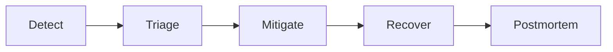

# SPEC-020 — Operational Readiness and SRE Model

## Agent Platform OCI

Version: 1.0.0


---

## Padrão de leitura

Cada SPEC está organizada para servir tanto como contrato arquitetural quanto como guia prático de adoção.

A estrutura usada é:

1. Conceito.
2. Problema que resolve.
3. Quando usar.
4. Quando não usar.
5. Arquitetura.
6. Implementação.
7. Exemplos.
8. Erros comuns.
9. Critérios de aceite.

---


# 1. Conceito

Operational Readiness define os requisitos mínimos para operar a Agent Platform OCI em produção com confiabilidade, observabilidade, capacidade de resposta a incidentes e recuperação.

# 2. Componentes operados

- Agent Gateway;
- Channel Gateway;
- Agent Runtime;
- AI Gateway;
- MCP Gateway;
- MCP Servers;
- Evaluator;
- bancos/repositórios;
- Langfuse/OTEL;
- Redis/Mongo/ADB quando usados.

# 3. Health e readiness

Endpoints mínimos:

```text
GET /health
GET /ready
GET /version
```

# 4. SLOs

| Componente | Latência | Disponibilidade |
| --- | --- | --- |
| Agent Gateway | p95 < 1s | 99.5% |
| Agent Runtime | p95 < 5s | 99.0% |
| AI Gateway | p95 < 10s | 99.0% |
| MCP Gateway | p95 < 2s | 99.0% |
| Evaluator | janela batch | execução diária |


# 5. Métricas

- requests_total;
- request_latency_ms;
- errors_total;
- active_sessions;
- llm_tokens_total;
- llm_cost_estimated;
- mcp_tool_calls_total;
- guardrail_blocks_total;
- judge_scores;
- evaluator_scores.

# 6. Dashboards

Dashboards mínimos:

- Platform Overview;
- Runtime;
- Gateway;
- AI Gateway;
- MCP Gateway;
- Guardrails;
- Evaluator;
- Cost/Usage;
- Incidents.

# 7. Alertas

| Alerta | Condição |
| --- | --- |
| HighErrorRate | 5xx acima do limite. |
| LatencySLOBreach | p95 acima do SLO. |
| LLMProviderDown | Falhas consecutivas no provider. |
| MCPTimeoutSpike | Aumento de timeout MCP. |
| GuardrailSpike | Aumento anômalo de bloqueios. |
| EvaluatorFailed | Run falhou. |


# 8. Runbooks

Runbook deve conter:

- sintoma;
- impacto;
- consultas;
- dashboards;
- logs;
- ações;
- rollback;
- escalonamento.

# 9. Incident management

Fluxo:



# 10. Capacidade

Avaliar:

- QPS;
- sessões simultâneas;
- tokens/minuto;
- chamadas MCP/minuto;
- latência de provider;
- uso de memória;
- storage de checkpoints.

# 11. Erros comuns

| Erro | Impacto | Correção |
| --- | --- | --- |
| Sem readiness | Tráfego antes do app estar pronto. | Implementar /ready. |
| Sem alertas MCP | Falha silenciosa. | Criar alertas por tool. |
| Sem runbook | MTTR alto. | Criar runbooks por incidente. |
| Sem custo LLM | Sem controle financeiro. | Registrar tokens/custos. |


# 12. Production readiness checklist

- [ ] Health checks ativos.
- [ ] Readiness checks ativos.
- [ ] Logs estruturados.
- [ ] Métricas exportadas.
- [ ] Traces exportados.
- [ ] Dashboards criados.
- [ ] Alertas configurados.
- [ ] Runbooks disponíveis.
- [ ] Rollback validado.
- [ ] SLOs definidos.
- [ ] Capacidade estimada.
- [ ] Incident process definido.
